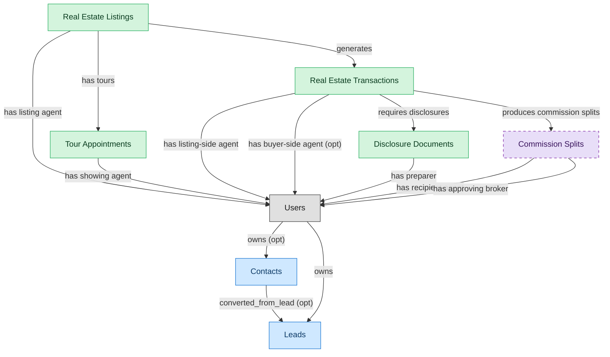

# Real Estate Agent Operations

## 1. Overview

Agent-facing workflow from lead capture through closing. Lead nurture (writes back into CRM contributor flow), listing creation and MLS syndication, tour scheduling and execution, transaction management (offer to escrow to contingencies to close), and buyer/seller disclosure handling. The deployable unit for solo agents and small firms; agents in larger brokerages work here while broker oversight runs in BROKERAGE-OPS.

## 2. Entity summary

| Name | Description |
| --- | --- |
| Disclosure Documents | State-mandated and brokerage-policy disclosure forms attached to transactions (agency disclosure, property condition, lead paint, HOA documents); required for compliance audit. |
| Real Estate Listings | Property offered for sale or rent on an MLS or brokerage marketplace; carries pricing, photos, descriptive text, agent representation, and listing-status lifecycle (active/contingent/pending/sold/withdrawn). |
| Real Estate Transactions | Deal pipeline from offer through close: parties, terms, contingencies, escrow timeline, and document compliance. One transaction per accepted offer; survives the listing once the offer is bound. |
| Tour Appointments | Scheduled property showings with lock-box codes, access windows, agent attendance, and follow-up tracking. |
| Contacts | Person at a customer account (B2B) or contact-level record (B2C-relevant). Carries title, email, decision-maker flag, preferred channel, opt-in state. MA contributes engagement data; SALES-ENG contributes cadence touchpoints. |
| Leads | Pre-qualification prospect record - source, score, status (new/working/qualified/disqualified/converted), assigned rep, conversion target (which contact + account it would become). MQL handoff from MA lands here. |
| Commission Splits | Per-transaction commission distribution across listing-side and buyer-side brokerages, then internal agent splits per franchise rules; referenced by accounting and 1099 processes. |

## 3. Entities catalog

| # | data_object | role | mastered in | necessity | pattern flags | notes |
| ---: | --- | --- | --- | --- | --- | --- |
| 1 | `disclosure_documents` (Disclosure Documents) | master | - | required | personal_content, submit_lock, single_approver | - |
| 2 | `real_estate_listings` (Real Estate Listings) | master | - | required | personal_content | - |
| 3 | `real_estate_transactions` (Real Estate Transactions) | master | - | required | personal_content, submit_lock | - |
| 4 | `tour_appointments` (Tour Appointments) | master | - | required | personal_content | - |
| 5 | `crm_contacts` (Contacts) | contributor | `crm-acct-mgt` | required | personal_content | - |
| 6 | `crm_leads` (Leads) | contributor | `crm-lead-mgt` | required | personal_content | - |
| 7 | `commission_splits` (Commission Splits) | consumer | `re-brok-brokerage-ops` | optional | submit_lock, single_approver | - |

## 4. Aliases and industry synonyms

_(no industry-scoped aliases or non-synonym alias types loaded for this scope; generic synonyms are omitted as common knowledge.)_

## 5. Relationships

### 5.1 Intra-scope edges

| from | verb | to | cardinality | kind | necessity | owner_side | notes |
| --- | --- | --- | --- | --- | --- | --- | --- |
| `real_estate_listings` | generates | `real_estate_transactions` | one_to_many | reference | required | target | - |
| `real_estate_listings` | has tours | `tour_appointments` | one_to_many | reference | required | target | - |
| `real_estate_transactions` | requires disclosures | `disclosure_documents` | one_to_many | composition | required | target | - |
| `real_estate_transactions` | produces commission splits | `commission_splits` | one_to_many | composition | required | target | - |
| `crm_contacts` | converted_from_lead | `crm_leads` | one_to_many | reference | optional | source | - |

### 5.2 Built-in edges (`users` and other platform built-ins)

| from | verb | to | cardinality | necessity | owner_side | notes |
| --- | --- | --- | --- | --- | --- | --- |
| `real_estate_listings` | has listing agent | `users` | many_to_many | required | source | - |
| `tour_appointments` | has showing agent | `users` | many_to_many | required | source | - |
| `real_estate_transactions` | has listing-side agent | `users` | many_to_many | required | source | - |
| `real_estate_transactions` | has buyer-side agent | `users` | many_to_many | optional | source | - |
| `disclosure_documents` | has preparer | `users` | many_to_many | required | source | - |
| `commission_splits` | has recipient agent | `users` | many_to_many | required | source | - |
| `commission_splits` | has approving broker | `users` | many_to_many | required | source | - |
| `users` | owns | `crm_leads` | one_to_many | required | source | - |
| `users` | owns | `crm_contacts` | one_to_many | optional | source | - |

### 5.3 Cross-scope edges

| from | verb | to | cardinality | necessity | notes |
| --- | --- | --- | --- | --- | --- |
| `customers` | has_contacts | `crm_contacts` | one_to_many | optional | - |
| `customers` | converted_from_lead | `crm_leads` | one_to_many | optional | - |
| `crm_opportunities` | converted_from_lead | `crm_leads` | one_to_many | optional | - |
| `crm_opportunities` | involves_contacts | `crm_contacts` | many_to_many | optional | - |
| `crm_contacts` | has_activities | `sales_activities` | one_to_many | optional | - |
| `crm_leads` | has_activities | `sales_activities` | one_to_many | optional | - |

## 6. Cross-domain context

### 6.1 Master consumers (other modules / domains that embed this scope's masters)

| data_object | other module / domain | role | necessity | notes |
| --- | --- | --- | --- | --- |
| `disclosure_documents` | RE-BROK-BROKERAGE-OPS (Brokerage Oversight and Commission Management) - RE-BROKERAGE | contributor | required | - |
| `disclosure_documents` | REAL-ESTATE-AGENT (Real Estate Agent (solo / small firm bundle)) | embedded_master | required | - |
| `real_estate_listings` | REAL-ESTATE-AGENT (Real Estate Agent (solo / small firm bundle)) | embedded_master | required | - |
| `real_estate_transactions` | RE-BROK-BROKERAGE-OPS (Brokerage Oversight and Commission Management) - RE-BROKERAGE | contributor | required | - |
| `real_estate_transactions` | REAL-ESTATE-AGENT (Real Estate Agent (solo / small firm bundle)) | embedded_master | required | - |
| `tour_appointments` | REAL-ESTATE-AGENT (Real Estate Agent (solo / small firm bundle)) | embedded_master | required | - |

### 6.2 Outbound handoffs (events this scope publishes)

| source module | target domain | target module | trigger_event | payload | integration | friction | description |
| --- | --- | --- | --- | --- | --- | --- | --- |
| _(domain-level)_ | GRC | _(domain-level)_ | `real_estate_transaction.closed` | `disclosure_documents` | batch_sync | low | Disclosure-document completeness per closed transaction feeds brokerage-compliance audit and state-real-estate-commission requirements. |
| _(domain-level)_ | RE-PROP-MGMT | _(domain-level)_ | `real_estate_transaction.closed` | `real_estate_transactions` | manual_handoff | high | Closed sale of a rental property results in a new landlord-of-record; the new owner's property-management platform must be configured (often manual handoff via email; the buyer's PM and the seller's brokerage are different vendors). |
| _(domain-level)_ | RE-CRE | _(domain-level)_ | `listing.sold` | `real_estate_listings` | batch_sync | medium | Closed sale triggers commercial lease setup if multi-tenant. |
| _(domain-level)_ | RE-CRE | _(domain-level)_ | `real_estate_transaction.closed` | `real_estate_transactions` | manual_handoff | high | Closed sale of a CRE asset transfers operations to the new owner's CRE platform; rent-roll, leases, and CAM history must be carried over (typically manual). |
| _(domain-level)_ | RE-INVEST | _(domain-level)_ | `listing.sold` | `real_estate_listings` | manual_handoff | high | Sale closing triggers fund NAV and LP-reporting recalculation. |

### 6.3 Inbound handoffs (events this scope reacts to)

_(no inbound `handoffs` whose payload is in this scope.)_

### 6.4 Master providers (modules / domains that own masters this scope embeds)

| data_object | role here | necessity | canonical owner(s) | slice notes |
| --- | --- | --- | --- | --- |
| `crm_contacts` | contributor | required | CRM-ACCT-MGT (CRM) | - |
| `crm_leads` | contributor | required | CRM-LEAD-MGT (CRM) | - |
| `commission_splits` | consumer | optional | RE-BROK-BROKERAGE-OPS (RE-BROKERAGE) | - |

## 7. Lifecycle states (per touched entity)

### `commission_splits` (Commission Split)

_This scope holds `commission_splits` as **consumer**; the canonical state machine is owned by `RE-BROK-BROKERAGE-OPS`._

| order | state_name | initial? | terminal? | requires_permission? | derived gate | description |
| --- | --- | --- | --- | --- | --- | --- |
| 1 | `calculated` | ✓ | - | - | - | Split row auto-derived from transaction close (listing-side vs buyer-side splits, agent shares, franchise overrides). Pending review. |
| 2 | `reviewed` | - | - | ✓ | `re-brok-brokerage-ops:review_commission_split` | Broker reviewed split accuracy against the listing agreement and brokerage policy; flagged any anomalies. |
| 3 | `disputed` | - | - | ✓ | `re-brok-brokerage-ops:dispute_commission_split` | One participating agent contests the calculated split. Holds disbursement pending resolution; may return to reviewed after adjustment. |
| 4 | `approved` | - | - | ✓ | `re-brok-brokerage-ops:approve_commission_split` | Broker approved the split for payment. Ready for disbursement. |
| 5 | `paid` | - | ✓ | ✓ | `re-brok-brokerage-ops:disburse_commission` | Commission funds disbursed to participating agents and franchise; ledger entry recorded. |

### `crm_contacts` (Contact)

_This scope holds `crm_contacts` as **contributor**; the canonical state machine is owned by `CRM-ACCT-MGT`._

| order | state_name | initial? | terminal? | requires_permission? | derived gate | description |
| --- | --- | --- | --- | --- | --- | --- |
| 1 | `active` | ✓ | - | - | - | Contact is current and reachable. |
| 2 | `inactive` | - | - | - | - | Contact is no longer engaged but record retained. |
| 3 | `unsubscribed` | - | ✓ | - | - | Contact has opted out of all channels. |

### `crm_leads` (Lead)

_This scope holds `crm_leads` as **contributor**; the canonical state machine is owned by `CRM-LEAD-MGT`._

| order | state_name | initial? | terminal? | requires_permission? | derived gate | description |
| --- | --- | --- | --- | --- | --- | --- |
| 1 | `new` | ✓ | - | - | - | Freshly captured lead awaiting triage. |
| 2 | `working` | - | - | - | - | Sales rep is actively engaging the lead. |
| 3 | `qualified` | - | - | - | - | Lead meets qualification criteria and is ready to convert. |
| 4 | `converted` | - | ✓ | ✓ | `crm-lead-mgt:convert_lead` | Lead has been converted into a contact, account, and opportunity. |
| 5 | `disqualified` | - | ✓ | - | - | Lead does not meet criteria; closed without conversion. |

### `disclosure_documents` (Disclosure Document)

| order | state_name | initial? | terminal? | requires_permission? | derived gate | description |
| --- | --- | --- | --- | --- | --- | --- |
| 1 | `drafted` | ✓ | - | - | - | Disclosure generated from a state-specific template (agency disclosure, lead-paint, natural-hazards, transfer disclosure). Not yet delivered. |
| 2 | `delivered` | - | - | ✓ | `re-brok-agent-ops:deliver_disclosure` | Disclosure sent to recipient (buyer or seller); recipient acknowledgment pending. |
| 3 | `acknowledged` | - | ✓ | ✓ | `re-brok-agent-ops:acknowledge_disclosure` | Recipient signed acknowledgment recorded (typically via eSign callback). Disclosure satisfies the compliance requirement on the transaction. |
| 4 | `rejected` | - | ✓ | - | - | Recipient refused to acknowledge or signed under dispute. Typically requires the transaction to address the rejection before progressing. |

### `real_estate_listings` (Real Estate Listing)

| order | state_name | initial? | terminal? | requires_permission? | derived gate | description |
| --- | --- | --- | --- | --- | --- | --- |
| 1 | `draft` | ✓ | - | - | - | Listing is being prepared (photos, copy, pricing); not yet published to MLS. |
| 2 | `active` | - | - | ✓ | `re-brok-agent-ops:activate_listing` | Listing is published to the MLS and accepting offers. |
| 3 | `under_contract` | - | - | ✓ | `re-brok-agent-ops:mark_under_contract` | Offer accepted; a real_estate_transaction has been opened. Listing remains visible on MLS as 'pending' but not accepting new offers. |
| 4 | `sold` | - | ✓ | ✓ | `re-brok-agent-ops:close_listing` | Transaction closed; listing terminated as a sale. Triggers downstream events to property-management, CRE, and investment systems. |
| 5 | `withdrawn` | - | ✓ | ✓ | `re-brok-agent-ops:withdraw_listing` | Listing pulled from the market without a sale (seller decision, expired listing agreement before contract, market reasons). |
| 6 | `expired` | - | ✓ | - | - | Listing agreement reached its end date without a sale or active renewal. No explicit user action; system marks at expiration. |

### `real_estate_transactions` (Real Estate Transaction)

| order | state_name | initial? | terminal? | requires_permission? | derived gate | description |
| --- | --- | --- | --- | --- | --- | --- |
| 1 | `opened` | ✓ | - | - | - | Accepted offer created the transaction; buyer/seller, listing reference, offer price, escrow agent, target close date captured. |
| 2 | `inspection` | - | - | ✓ | `re-brok-agent-ops:schedule_inspection` | Inspection period active; structural / pest / specialty inspections scheduled or in progress. |
| 3 | `financing` | - | - | ✓ | `re-brok-agent-ops:submit_financing` | Buyer's loan application in underwriting; appraisal pending; financing contingency open. |
| 4 | `contingencies_cleared` | - | - | ✓ | `re-brok-agent-ops:clear_contingencies` | All contingencies (inspection, financing, appraisal, title) satisfied or waived. Transaction ready for broker compliance review. |
| 5 | `compliance_review` | - | - | ✓ | `re-brok-brokerage-ops:submit_for_compliance_review` | Broker / transaction coordinator reviewing transaction file for compliance (disclosure completeness, signature audit, trust-account accounting). Only realized when BROKERAGE-OPS module is deployed. |
| 6 | `cleared_to_close` | - | - | ✓ | `re-brok-brokerage-ops:approve_for_closing` | Broker signed off; closing date and location confirmed. Only realized when BROKERAGE-OPS module is deployed. |
| 7 | `closed` | - | ✓ | ✓ | `re-brok-agent-ops:close_transaction` | Deed recorded, funds disbursed via escrow; transaction complete. Commission splits become payable; downstream domains notified. |
| 8 | `cancelled` | - | ✓ | ✓ | `re-brok-agent-ops:cancel_transaction` | Transaction fell through (failed inspection beyond repair, financing denied, mutual cancellation, contingency invocation). Listing typically returns to active. |

### `tour_appointments` (Tour Appointment)

| order | state_name | initial? | terminal? | requires_permission? | derived gate | description |
| --- | --- | --- | --- | --- | --- | --- |
| 1 | `scheduled` | ✓ | - | - | - | Tour booked with prospect; access arrangements (lockbox code, listing-agent attendance) pending confirmation. |
| 2 | `confirmed` | - | - | ✓ | `re-brok-agent-ops:confirm_tour` | Prospect confirmed attendance; access arrangements finalized. |
| 3 | `completed` | - | ✓ | ✓ | `re-brok-agent-ops:complete_tour` | Tour took place; agent recorded notes and any buyer-feedback signals. |
| 4 | `cancelled` | - | ✓ | ✓ | `re-brok-agent-ops:cancel_tour` | Tour cancelled by either party before it took place. |
| 5 | `no_show` | - | ✓ | - | - | Prospect did not appear at the scheduled time. No explicit cancellation; agent marks after the fact. |

## 8. Permissions and business rules (derived)

### 8.1 Permissions

| permission | tier | description | included in `:admin`? |
| --- | --- | --- | --- |
| `re-brok-agent-ops:read` | baseline-read | Read access to every entity in the module | ✓ |
| `re-brok-agent-ops:manage` | baseline-manage | Edit operational records | ✓ |
| `re-brok-agent-ops:admin` | baseline-admin | Edit reference data and inherit every workflow gate below | - |
| `re-brok-agent-ops:activate_listing` | workflow-gate (lifecycle) | Transition `real_estate_listings` into state `active` | ✓ |
| `re-brok-agent-ops:mark_under_contract` | workflow-gate (lifecycle) | Transition `real_estate_listings` into state `under_contract` | ✓ |
| `re-brok-agent-ops:close_listing` | workflow-gate (lifecycle) | Transition `real_estate_listings` into state `sold` | ✓ |
| `re-brok-agent-ops:withdraw_listing` | workflow-gate (lifecycle) | Transition `real_estate_listings` into state `withdrawn` | ✓ |
| `re-brok-agent-ops:schedule_inspection` | workflow-gate (lifecycle) | Transition `real_estate_transactions` into state `inspection` | ✓ |
| `re-brok-agent-ops:submit_financing` | workflow-gate (lifecycle) | Transition `real_estate_transactions` into state `financing` | ✓ |
| `re-brok-agent-ops:clear_contingencies` | workflow-gate (lifecycle) | Transition `real_estate_transactions` into state `contingencies_cleared` | ✓ |
| `re-brok-agent-ops:close_transaction` | workflow-gate (lifecycle) | Transition `real_estate_transactions` into state `closed` | ✓ |
| `re-brok-agent-ops:cancel_transaction` | workflow-gate (lifecycle) | Transition `real_estate_transactions` into state `cancelled` | ✓ |
| `re-brok-agent-ops:confirm_tour` | workflow-gate (lifecycle) | Transition `tour_appointments` into state `confirmed` | ✓ |
| `re-brok-agent-ops:complete_tour` | workflow-gate (lifecycle) | Transition `tour_appointments` into state `completed` | ✓ |
| `re-brok-agent-ops:cancel_tour` | workflow-gate (lifecycle) | Transition `tour_appointments` into state `cancelled` | ✓ |
| `re-brok-agent-ops:deliver_disclosure` | workflow-gate (lifecycle) | Transition `disclosure_documents` into state `delivered` | ✓ |
| `re-brok-agent-ops:acknowledge_disclosure` | workflow-gate (lifecycle) | Transition `disclosure_documents` into state `acknowledged` | ✓ |
| `re-brok-agent-ops:view_all_real_estate_listings` | override (personal_content) | View all `real_estate_listings` rows beyond row-scope | ✓ |
| `re-brok-agent-ops:manage_all_real_estate_listings` | override (personal_content) | Manage all `real_estate_listings` rows beyond row-scope | ✓ |
| `re-brok-agent-ops:view_all_tour_appointments` | override (personal_content) | View all `tour_appointments` rows beyond row-scope | ✓ |
| `re-brok-agent-ops:manage_all_tour_appointments` | override (personal_content) | Manage all `tour_appointments` rows beyond row-scope | ✓ |
| `re-brok-agent-ops:view_all_real_estate_transactions` | override (personal_content) | View all `real_estate_transactions` rows beyond row-scope | ✓ |
| `re-brok-agent-ops:manage_all_real_estate_transactions` | override (personal_content) | Manage all `real_estate_transactions` rows beyond row-scope | ✓ |
| `re-brok-agent-ops:submit_real_estate_transaction` | override (submit_lock) | Submit and lock a `real_estate_transactions` row (post-submit edits gated) | ✓ |
| `re-brok-agent-ops:view_all_disclosure_documents` | override (personal_content) | View all `disclosure_documents` rows beyond row-scope | ✓ |
| `re-brok-agent-ops:manage_all_disclosure_documents` | override (personal_content) | Manage all `disclosure_documents` rows beyond row-scope | ✓ |
| `re-brok-agent-ops:submit_disclosure_document` | override (submit_lock) | Submit and lock a `disclosure_documents` row (post-submit edits gated) | ✓ |

### 8.2 Business rules

| rule_name | data_object | source flag | intent |
| --- | --- | --- | --- |
| `real_estate_listing_edit_scope` | `real_estate_listings` | has_personal_content | Row-scope by default; override via `re-brok-agent-ops:view_all_real_estate_listings` / `re-brok-agent-ops:manage_all_real_estate_listings` |
| `tour_appointment_edit_scope` | `tour_appointments` | has_personal_content | Row-scope by default; override via `re-brok-agent-ops:view_all_tour_appointments` / `re-brok-agent-ops:manage_all_tour_appointments` |
| `real_estate_transaction_edit_scope` | `real_estate_transactions` | has_personal_content | Row-scope by default; override via `re-brok-agent-ops:view_all_real_estate_transactions` / `re-brok-agent-ops:manage_all_real_estate_transactions` |
| `submit_restricted_to_real_estate_transaction_owner` | `real_estate_transactions` | has_submit_lock | Only the row's authoring user can submit; post-submit the row is read-only except via `re-brok-agent-ops:manage_all_real_estate_transactions` |
| `disclosure_document_edit_scope` | `disclosure_documents` | has_personal_content | Row-scope by default; override via `re-brok-agent-ops:view_all_disclosure_documents` / `re-brok-agent-ops:manage_all_disclosure_documents` |
| `submit_restricted_to_disclosure_document_owner` | `disclosure_documents` | has_submit_lock | Only the row's authoring user can submit; post-submit the row is read-only except via `re-brok-agent-ops:manage_all_disclosure_documents` |
| `approve_disclosure_document_requires_approver` | `disclosure_documents` | has_single_approver | Exactly one explicit approver required; uses the module's approval gate (`re-brok-agent-ops:approve_disclosure_document` if surfaced as a lifecycle workflow gate). |
