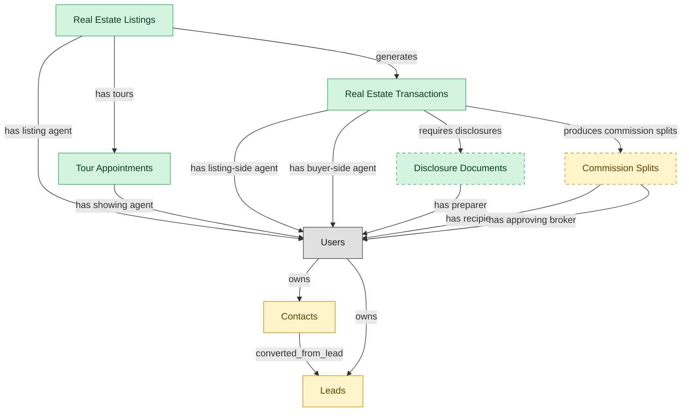

# Real Estate Agent Operations

## 1. Overview

Agent-facing workflow from lead capture through closing. Lead nurture (writes back into CRM contributor flow), listing creation and MLS syndication, tour scheduling and execution, transaction management (offer to escrow to contingencies to close), and buyer/seller disclosure handling. The deployable unit for solo agents and small firms; agents in larger brokerages work here while broker oversight runs in BROKERAGE-OPS.

## 2. Entity summary

| Name | data_object | Description |
| --- | --- | --- |
| Disclosure Documents | `disclosure_documents` | State-mandated and brokerage-policy disclosure forms attached to transactions, such as agency, property condition, lead paint, and HOA documents. |
| Real Estate Listings | `real_estate_listings` | Properties offered for sale or rent, with pricing, photos, descriptions, agent representation, and status from active to sold. |
| Real Estate Transactions | `real_estate_transactions` | Real estate deals from accepted offer through close, with parties, terms, contingencies, escrow timeline, and document compliance. |
| Tour Appointments | `tour_appointments` | Scheduled property showings with lock-box codes, access windows, agent attendance, and follow-up tracking. |
| Commission Splits | `commission_splits` | How a transaction's commission is divided across brokerages and then internal agents, used by accounting and tax reporting. |
| Contacts | `crm_contacts` | People at customer or prospect organizations, carrying title, contact details, decision-maker flag, preferred channel, and opt-in state. |
| Leads | `crm_leads` | Prospects captured before qualification, tracking source, score, status, assigned rep, and the contact and account they would convert into. |

## 3. Entities catalog

| # | data_object | canonical code | singular | plural | role | mastered in | mastered label | necessity | personal_content | entity_type | write tier | notes |
| ---: | --- | --- | --- | --- | --- | --- | --- | --- | --- | --- | --- | --- |
| 1 | `disclosure_documents` | `disclosure_documents` | Disclosure Document | Disclosure Documents | master | - | - | optional | yes | operational_workflow | `:manage` | - |
| 2 | `real_estate_listings` | `real_estate_listings` | Real Estate Listing | Real Estate Listings | master | - | - | required | yes | operational_workflow | `:manage` | - |
| 3 | `real_estate_transactions` | `real_estate_transactions` | Real Estate Transaction | Real Estate Transactions | master | - | - | required | yes | operational_workflow | `:manage` | - |
| 4 | `tour_appointments` | `tour_appointments` | Tour Appointment | Tour Appointments | master | - | - | required | yes | operational_workflow | `:manage` | - |
| 5 | `commission_splits` | `commission_splits` | Commission Split | Commission Splits | embedded_master | `re-brok-brokerage-ops` | Brokerage Oversight and Commission Management | optional | - | operational_workflow | `:manage` | - |
| 6 | `crm_contacts` | `crm_contacts` | Contact | Contacts | embedded_master | `crm-acct-mgt` | Account and Contact Management | required | yes | operational_record | `:manage` | - |
| 7 | `crm_leads` | `crm_leads` | Lead | Leads | embedded_master | `crm-lead-mgt` | Lead Capture and Qualification | required | yes | operational_workflow | `:manage` | - |

## 4. Aliases and industry synonyms

| data_object | alias | alias_type | preferred? | industry | notes |
| --- | --- | --- | --- | --- | --- |
| `real_estate_transactions` | Closing | industry_term | - | Real Estate | - |
| `commission_splits` | Co-Op Commission | industry_term | - | Real Estate | - |
| `real_estate_transactions` | Escrow | industry_term | - | Real Estate | - |
| `real_estate_listings` | MLS Listing | industry_term | - | Real Estate | - |
| `tour_appointments` | Open House Appointment | industry_term | - | Real Estate | - |
| `disclosure_documents` | Seller Disclosures | industry_term | - | Real Estate | - |
| `tour_appointments` | Showing | industry_term | - | Real Estate | - |
| `disclosure_documents` | TDS | industry_term | - | Real Estate | - |

## 5. Relationships

### 5.1 Intra-scope edges

| from | verb | to | cardinality | kind | necessity | owner_side | delete_mode | fk_format | notes |
| --- | --- | --- | --- | --- | --- | --- | --- | --- | --- |
| `real_estate_listings` | generates | `real_estate_transactions` | one_to_many | reference | required | target | restrict | reference | - |
| `real_estate_listings` | has tours | `tour_appointments` | one_to_many | reference | required | target | restrict | reference | - |
| `real_estate_transactions` | requires disclosures | `disclosure_documents` | one_to_many | composition | required | source | cascade | parent | - |
| `real_estate_transactions` | produces commission splits | `commission_splits` | one_to_many | composition | required | source | cascade | parent | - |
| `crm_contacts` | converted_from_lead | `crm_leads` | one_to_many | reference | optional | source | clear | reference | - |

### 5.2 Built-in edges (`users` and other platform built-ins)

| from | verb | to | cardinality | necessity | owner_side | delete_mode | fk_format | notes |
| --- | --- | --- | --- | --- | --- | --- | --- | --- |
| `real_estate_listings` | has listing agent | `users` | many_to_many | required | source | restrict | reference | - |
| `tour_appointments` | has showing agent | `users` | many_to_many | required | source | restrict | reference | - |
| `real_estate_transactions` | has listing-side agent | `users` | many_to_many | required | source | restrict | reference | - |
| `real_estate_transactions` | has buyer-side agent | `users` | many_to_many | optional | source | clear | reference | - |
| `disclosure_documents` | has preparer | `users` | many_to_many | required | source | restrict | reference | - |
| `commission_splits` | has recipient agent | `users` | many_to_many | required | source | restrict | reference | - |
| `commission_splits` | has approving broker | `users` | many_to_many | required | source | restrict | reference | - |
| `users` | owns | `crm_leads` | one_to_many | required | source | restrict | reference | - |
| `users` | owns | `crm_contacts` | one_to_many | optional | source | clear | reference | - |

### 5.3 Cross-scope edges

#### 5.3a Outbound from this scope's masters and contributors

_Edges this scope drives: the in-scope endpoint has `role` of `master` or `contributor`._

_(none: no outbound cross-scope edges from this scope's masters or contributors)_

#### 5.3b Context edges on embedded shells and consumed entities

_Edges the canonical owner drives, shown for context: the in-scope endpoint has `role` of `embedded_master`, `consumer`, or `derived`._

| from | verb | to | cardinality | necessity | delete_mode | fk_format | notes |
| --- | --- | --- | --- | --- | --- | --- | --- |
| `customers` | has_contacts | `crm_contacts` | one_to_many | optional | none | n/a | - |
| `customers` | converted_from_lead | `crm_leads` | one_to_many | optional | none | n/a | - |
| `crm_opportunities` | converted_from_lead | `crm_leads` | one_to_many | optional | none | n/a | - |
| `crm_opportunities` | involves_contacts | `crm_contacts` | many_to_many | optional | none | n/a | - |
| `crm_contacts` | has_activities | `sales_activities` | one_to_many | optional | none | n/a | - |
| `crm_leads` | has_activities | `sales_activities` | one_to_many | optional | none | n/a | - |
| `contact_records` | enriches | `crm_contacts` | one_to_many | optional | none | n/a | - |

## 6. Cross-domain context

### 6.1 Master consumers (other modules / domains that embed this scope's masters)

| data_object | other module / domain | role | necessity | notes |
| --- | --- | --- | --- | --- |
| `disclosure_documents` | RE-BROK-BROKERAGE-OPS (Brokerage Oversight and Commission Management) - RE-BROKERAGE | embedded_master | required | - |
| `disclosure_documents` | REAL-ESTATE-AGENT (Real Estate Agent (solo / small firm bundle)) - REAL-ESTATE-AGENT | embedded_master | required | - |
| `real_estate_listings` | REAL-ESTATE-AGENT (Real Estate Agent (solo / small firm bundle)) - REAL-ESTATE-AGENT | embedded_master | required | - |
| `real_estate_transactions` | RE-BROK-BROKERAGE-OPS (Brokerage Oversight and Commission Management) - RE-BROKERAGE | embedded_master | required | - |
| `real_estate_transactions` | REAL-ESTATE-AGENT (Real Estate Agent (solo / small firm bundle)) - REAL-ESTATE-AGENT | embedded_master | required | - |
| `tour_appointments` | REAL-ESTATE-AGENT (Real Estate Agent (solo / small firm bundle)) - REAL-ESTATE-AGENT | embedded_master | required | - |

### 6.2 Outbound handoffs (events this scope publishes)

| source module | target domain | target module | trigger_event | transition | payload | integration | friction | description |
| --- | --- | --- | --- | --- | --- | --- | --- | --- |
| RE-BROK-AGENT-OPS | GRC | _(domain-level)_ | `real_estate_transaction.closed` | `pending` → `closed` _(lifecycle)_ | `disclosure_documents` | batch_sync | low | Disclosure-document completeness per closed transaction feeds brokerage-compliance audit and state-real-estate-commission requirements. |
| CRM-LEAD-MGT | CRM | CRM-ACTIVITY | `crm_lead.qualified` | _(state_change)_ | `crm_leads` | lifecycle_progression | low | - |
| RE-BROK-AGENT-OPS | CRM | CRM-LEAD-MGT | `real_estate_listing.qualified` | `qualified` _(signal)_ | `crm_leads` | api_call | medium | Qualified buyer/seller leads flow into CRM-cluster contacts and the agent's CRM for nurture and conversion tracking. |
| CRM-ACCT-MGT | MA | MA-CAMPAIGN-AUTHORING | `crm_contact.synced` | `synced` _(signal)_ | `crm_contacts` | batch_sync | medium | Contact updates in CRM (new contact, status change, opt-in change, account ownership) sync to MA so audience lists and campaigns stay current. Batch-sync is the typical pattern - real-time would be ideal but most stacks accept hourly or daily latency here. |
| CRM-LEAD-MGT | SALES-ENG | _(domain-level)_ | `crm_lead.scored_above_threshold` | _(threshold)_ | `crm_leads` | event_stream | medium | A lead's predictive score has crossed the qualified-handoff threshold; SALES-ENG picks up for cadence enrollment. Failure modes: noisy scoring causes cadence whiplash; threshold tuned per segment but not surfaced. |
| RE-BROK-AGENT-OPS | RE-BROKERAGE | RE-BROK-BROKERAGE-OPS | `real_estate_transaction.contingencies_cleared` | _(state_change)_ | `real_estate_transactions` | lifecycle_progression | low | Agent-side has cleared inspection, financing, and appraisal contingencies; broker oversight takes the transaction into compliance review before authorizing closing. |
| RE-BROK-AGENT-OPS | RE-PROP-MGMT | _(domain-level)_ | `real_estate_transaction.closed` | `pending` → `closed` _(lifecycle)_ | `real_estate_transactions` | manual_handoff | high | Closed sale of a rental property results in a new landlord-of-record; the new owner's property-management platform must be configured (often manual handoff via email; the buyer's PM and the seller's brokerage are different vendors). |
| RE-BROK-AGENT-OPS | RE-CRE | _(domain-level)_ | `listing.sold` | _(lifecycle)_ | `real_estate_listings` | batch_sync | medium | Closed sale triggers commercial lease setup if multi-tenant. |
| RE-BROK-AGENT-OPS | RE-CRE | _(domain-level)_ | `real_estate_transaction.closed` | `pending` → `closed` _(lifecycle)_ | `real_estate_transactions` | manual_handoff | high | Closed sale of a CRE asset transfers operations to the new owner's CRE platform; rent-roll, leases, and CAM history must be carried over (typically manual). |
| RE-BROK-AGENT-OPS | RE-INVEST | RE-INVEST-PORTFOLIO-VAL | `listing.sold` | _(lifecycle)_ | `real_estate_listings` | manual_handoff | high | Sale closing triggers fund NAV and LP-reporting recalculation. |

### 6.3 Inbound handoffs (events this scope reacts to)

| target module | source domain | source module | trigger_event | transition | payload | integration | friction | description |
| --- | --- | --- | --- | --- | --- | --- | --- | --- |
| CRM-LEAD-MGT | MA | MA-LEAD-SCORING | `crm_lead.qualified` | _(state_change)_ | `crm_leads` | event_stream | medium | MA-driven scoring crosses the MQL threshold; the lead routes to CRM with a recommended owner. Friction comes from definition drift - what counts as MQL, who owns routing, what happens to disqualified leads - and from the lead-to-contact-to-opportunity conversion chain inside CRM. |
| CRM-LEAD-MGT | MA | MA-LEAD-SCORING | `crm_lead.scored_above_threshold` | _(threshold)_ | `crm_leads` | event_stream | low | Qualified leads routed to CRM for sales pickup. Tight integration on all major MA platforms. |
| CRM-LEAD-MGT | MA | MA-LEAD-SCORING | `nurture.completed` | `completed` _(state_change)_ | `crm_leads` | api_call | low | Nurture journey completion (whether successful conversion or exit) updates lead status in CRM. Low friction in same-vendor all-in-one stacks; medium when MA and CRM are separate. |
| CRM-LEAD-MGT | MA | MA-LEAD-SCORING | `nurture_journey.completed` | _(lifecycle)_ | `crm_leads` | api_call | low | Completed nurture without conversion returns the lead to CRM for re-routing or recycle. |
| CRM-LEAD-MGT | PRM | _(domain-level)_ | `partner_referral.qualified` | `qualified` _(state_change)_ | `crm_leads` | api_call | medium | Partner-sourced referrals flow into CRM lead-routing. Failure modes: dedup against existing prospects; partner-attribution edge cases. |
| CRM-LEAD-MGT | SMM | _(domain-level)_ | `social_lead.captured` | `captured` _(state_change)_ | `crm_leads` | api_call | medium | Social interaction with explicit intent, DM asking pricing, click-through on a lead-gen form, message-ad reply, converts into a CRM-mastered lead with handle, captured form data, and source attribution. Failure modes: handle-to-existing-contact reconciliation produces duplicate leads; form-data quality from social lead-gen ads is inconsistent across networks. |
| RE-BROK-AGENT-OPS | RE-BROKERAGE | RE-BROK-BROKERAGE-OPS | `commission_split.paid` | _(lifecycle)_ | `commission_splits` | lifecycle_progression | low | Broker disbursed commission; agent-side surfaces the paid status for the recipient agent. |
| RE-BROK-AGENT-OPS | RE-BROKERAGE | RE-BROK-BROKERAGE-OPS | `real_estate_transaction.cleared_to_close` | _(state_change)_ | `real_estate_transactions` | lifecycle_progression | low | Broker compliance review approved; transaction returns to agent-side for closing coordination. |

### 6.4 Master providers (modules / domains that own masters this scope embeds)

| data_object | role here | necessity | canonical owner(s) | slice notes |
| --- | --- | --- | --- | --- |
| `commission_splits` | embedded_master | optional | RE-BROK-BROKERAGE-OPS (RE-BROKERAGE) | - |
| `crm_contacts` | embedded_master | required | CRM-ACCT-MGT (CRM) | - |
| `crm_leads` | embedded_master | required | CRM-LEAD-MGT (CRM) | - |

## 7. Lifecycle states

### `commission_splits` (Commission Split)

_This scope holds `commission_splits` as **embedded_master**; the canonical state machine is owned by `RE-BROK-BROKERAGE-OPS`._

| order | state_name | initial? | terminal? | requires_permission? | derived gate | description |
| --- | --- | --- | --- | --- | --- | --- |
| 1 | `calculated` | ✓ | - | - | - | Split row auto-derived from transaction close (listing-side vs buyer-side splits, agent shares, franchise overrides). Pending review. |
| 2 | `reviewed` | - | - | ✓ | `re-brok-agent-ops:review_commission_split` | Broker reviewed split accuracy against the listing agreement and brokerage policy; flagged any anomalies. |
| 3 | `disputed` | - | - | ✓ | `re-brok-agent-ops:dispute_commission_split` | One participating agent contests the calculated split. Holds disbursement pending resolution; may return to reviewed after adjustment. |
| 4 | `approved` | - | - | ✓ | `re-brok-agent-ops:approve_commission_split` | Broker approved the split for payment. Ready for disbursement. |
| 5 | `paid` | - | ✓ | ✓ | `re-brok-agent-ops:disburse_commission` | Commission funds disbursed to participating agents and franchise; ledger entry recorded. |

### `crm_contacts` (Contact)

_This scope holds `crm_contacts` as **embedded_master**; the canonical state machine is owned by `CRM-ACCT-MGT`._

| order | state_name | initial? | terminal? | requires_permission? | derived gate | description |
| --- | --- | --- | --- | --- | --- | --- |
| 1 | `active` | ✓ | - | - | - | Contact is current and reachable. |
| 2 | `inactive` | - | - | - | - | Contact is no longer engaged but record retained. |
| 3 | `unsubscribed` | - | ✓ | - | - | Contact has opted out of all channels. |

### `crm_leads` (Lead)

_This scope holds `crm_leads` as **embedded_master**; the canonical state machine is owned by `CRM-LEAD-MGT`._

| order | state_name | initial? | terminal? | requires_permission? | derived gate | description |
| --- | --- | --- | --- | --- | --- | --- |
| 1 | `new` | ✓ | - | - | - | Freshly captured lead awaiting triage. |
| 2 | `working` | - | - | - | - | Sales rep is actively engaging the lead. |
| 3 | `qualified` | - | - | - | - | Lead meets qualification criteria and is ready to convert. |
| 4 | `converted` | - | ✓ | ✓ | `re-brok-agent-ops:convert_lead` | Lead has been converted into a contact, account, and opportunity. |
| 5 | `disqualified` | - | ✓ | - | - | Lead does not meet criteria; closed without conversion. |

### `disclosure_documents` (Disclosure Document)

| order | state_name | initial? | terminal? | requires_permission? | derived gate | description |
| --- | --- | --- | --- | --- | --- | --- |
| 1 | `drafted` | ✓ | - | - | - | Disclosure generated from a state-specific template (agency disclosure, lead-paint, natural-hazards, transfer disclosure). Not yet delivered. |
| 2 | `delivered` | - | - | ✓ | `re-brok-agent-ops:deliver_disclosure` | Disclosure sent to recipient (buyer or seller); recipient acknowledgment pending. |
| 3 | `acknowledged` | - | ✓ | ✓ | `re-brok-agent-ops:acknowledge_disclosure` | Recipient signed acknowledgment recorded (typically via eSign callback). Disclosure satisfies the compliance requirement on the transaction. |
| 4 | `rejected` | - | ✓ | - | - | Recipient refused to acknowledge or signed under dispute. Typically requires the transaction to address the rejection before progressing. |

### `real_estate_listings` (Real Estate Listing)

| order | state_name | initial? | terminal? | requires_permission? | derived gate | description |
| --- | --- | --- | --- | --- | --- | --- |
| 1 | `draft` | ✓ | - | - | - | Listing is being prepared (photos, copy, pricing); not yet published to MLS. |
| 2 | `active` | - | - | ✓ | `re-brok-agent-ops:activate_listing` | Listing is published to the MLS and accepting offers. |
| 3 | `under_contract` | - | - | ✓ | `re-brok-agent-ops:mark_under_contract` | Offer accepted; a real_estate_transaction has been opened. Listing remains visible on MLS as 'pending' but not accepting new offers. |
| 4 | `sold` | - | ✓ | ✓ | `re-brok-agent-ops:close_listing` | Transaction closed; listing terminated as a sale. Triggers downstream events to property-management, CRE, and investment systems. |
| 5 | `withdrawn` | - | ✓ | ✓ | `re-brok-agent-ops:withdraw_listing` | Listing pulled from the market without a sale (seller decision, expired listing agreement before contract, market reasons). |
| 6 | `expired` | - | ✓ | - | - | Listing agreement reached its end date without a sale or active renewal. No explicit user action; system marks at expiration. |

### `real_estate_transactions` (Real Estate Transaction)

| order | state_name | initial? | terminal? | requires_permission? | derived gate | description |
| --- | --- | --- | --- | --- | --- | --- |
| 1 | `opened` | ✓ | - | - | - | Accepted offer created the transaction; buyer/seller, listing reference, offer price, escrow agent, target close date captured. |
| 2 | `inspection` | - | - | ✓ | `re-brok-agent-ops:schedule_inspection` | Inspection period active; structural / pest / specialty inspections scheduled or in progress. |
| 3 | `financing` | - | - | ✓ | `re-brok-agent-ops:submit_financing` | Buyer's loan application in underwriting; appraisal pending; financing contingency open. |
| 4 | `contingencies_cleared` | - | - | ✓ | `re-brok-agent-ops:clear_contingencies` | All contingencies (inspection, financing, appraisal, title) satisfied or waived. Transaction ready for broker compliance review. |
| 5 | `compliance_review` | - | - | ✓ | `re-brok-brokerage-ops:submit_for_compliance_review` | Broker / transaction coordinator reviewing transaction file for compliance (disclosure completeness, signature audit, trust-account accounting). Only realized when BROKERAGE-OPS module is deployed. |
| 6 | `cleared_to_close` | - | - | ✓ | `re-brok-brokerage-ops:approve_for_closing` | Broker signed off; closing date and location confirmed. Only realized when BROKERAGE-OPS module is deployed. |
| 7 | `closed` | - | ✓ | ✓ | `re-brok-agent-ops:close_transaction` | Deed recorded, funds disbursed via escrow; transaction complete. Commission splits become payable; downstream domains notified. |
| 8 | `canceled` | - | ✓ | ✓ | `re-brok-agent-ops:cancel_transaction` | Transaction fell through (failed inspection beyond repair, financing denied, mutual cancellation, contingency invocation). Listing typically returns to active. |

### `tour_appointments` (Tour Appointment)

| order | state_name | initial? | terminal? | requires_permission? | derived gate | description |
| --- | --- | --- | --- | --- | --- | --- |
| 1 | `scheduled` | ✓ | - | - | - | Tour booked with prospect; access arrangements (lockbox code, listing-agent attendance) pending confirmation. |
| 2 | `confirmed` | - | - | ✓ | `re-brok-agent-ops:confirm_tour` | Prospect confirmed attendance; access arrangements finalized. |
| 3 | `completed` | - | ✓ | ✓ | `re-brok-agent-ops:complete_tour` | Tour took place; agent recorded notes and any buyer-feedback signals. |
| 4 | `canceled` | - | ✓ | ✓ | `re-brok-agent-ops:cancel_tour` | Tour canceled by either party before it took place. |
| 5 | `no_show` | - | ✓ | - | - | Prospect did not appear at the scheduled time. No explicit cancellation; agent marks after the fact. |

## 8. Permissions and business rules (derived)

### 8.1 Permissions

| permission | tier | description | included in `:admin`? |
| --- | --- | --- | --- |
| `re-brok-agent-ops:read` | baseline-read | Read access to every entity in the module | ✓ |
| `re-brok-agent-ops:manage` | baseline-manage | Edit operational records | ✓ |
| `re-brok-agent-ops:admin` | baseline-admin | Edit reference data and inherit every workflow gate below | - |
| `re-brok-agent-ops:convert_lead` | workflow-gate (lifecycle) | Transition `crm_leads` into state `converted` | ✓ |
| `re-brok-agent-ops:activate_listing` | workflow-gate (lifecycle) | Transition `real_estate_listings` into state `active` | ✓ |
| `re-brok-agent-ops:mark_under_contract` | workflow-gate (lifecycle) | Transition `real_estate_listings` into state `under_contract` | ✓ |
| `re-brok-agent-ops:close_listing` | workflow-gate (lifecycle) | Transition `real_estate_listings` into state `sold` | ✓ |
| `re-brok-agent-ops:withdraw_listing` | workflow-gate (lifecycle) | Transition `real_estate_listings` into state `withdrawn` | ✓ |
| `re-brok-agent-ops:schedule_inspection` | workflow-gate (lifecycle) | Transition `real_estate_transactions` into state `inspection` | ✓ |
| `re-brok-agent-ops:submit_financing` | workflow-gate (lifecycle) | Transition `real_estate_transactions` into state `financing` | ✓ |
| `re-brok-agent-ops:clear_contingencies` | workflow-gate (lifecycle) | Transition `real_estate_transactions` into state `contingencies_cleared` | ✓ |
| `re-brok-agent-ops:close_transaction` | workflow-gate (lifecycle) | Transition `real_estate_transactions` into state `closed` | ✓ |
| `re-brok-agent-ops:cancel_transaction` | workflow-gate (lifecycle) | Transition `real_estate_transactions` into state `canceled` | ✓ |
| `re-brok-agent-ops:review_commission_split` | workflow-gate (lifecycle) | Transition `commission_splits` into state `reviewed` | ✓ |
| `re-brok-agent-ops:dispute_commission_split` | workflow-gate (lifecycle) | Transition `commission_splits` into state `disputed` | ✓ |
| `re-brok-agent-ops:approve_commission_split` | workflow-gate (lifecycle) | Transition `commission_splits` into state `approved` | ✓ |
| `re-brok-agent-ops:disburse_commission` | workflow-gate (lifecycle) | Transition `commission_splits` into state `paid` | ✓ |
| `re-brok-agent-ops:confirm_tour` | workflow-gate (lifecycle) | Transition `tour_appointments` into state `confirmed` | ✓ |
| `re-brok-agent-ops:complete_tour` | workflow-gate (lifecycle) | Transition `tour_appointments` into state `completed` | ✓ |
| `re-brok-agent-ops:cancel_tour` | workflow-gate (lifecycle) | Transition `tour_appointments` into state `canceled` | ✓ |
| `re-brok-agent-ops:deliver_disclosure` | workflow-gate (lifecycle) | Transition `disclosure_documents` into state `delivered` | ✓ |
| `re-brok-agent-ops:acknowledge_disclosure` | workflow-gate (lifecycle) | Transition `disclosure_documents` into state `acknowledged` | ✓ |
| `re-brok-agent-ops:view_all_real_estate_listings` | override (personal_content) | View all `real_estate_listings` rows beyond row-scope | ✓ |
| `re-brok-agent-ops:manage_all_real_estate_listings` | override (personal_content) | Manage all `real_estate_listings` rows beyond row-scope | ✓ |
| `re-brok-agent-ops:view_all_tour_appointments` | override (personal_content) | View all `tour_appointments` rows beyond row-scope | ✓ |
| `re-brok-agent-ops:manage_all_tour_appointments` | override (personal_content) | Manage all `tour_appointments` rows beyond row-scope | ✓ |
| `re-brok-agent-ops:view_all_real_estate_transactions` | override (personal_content) | View all `real_estate_transactions` rows beyond row-scope | ✓ |
| `re-brok-agent-ops:manage_all_real_estate_transactions` | override (personal_content) | Manage all `real_estate_transactions` rows beyond row-scope | ✓ |
| `re-brok-agent-ops:view_all_disclosure_documents` | override (personal_content) | View all `disclosure_documents` rows beyond row-scope | ✓ |
| `re-brok-agent-ops:manage_all_disclosure_documents` | override (personal_content) | Manage all `disclosure_documents` rows beyond row-scope | ✓ |
| `re-brok-agent-ops:view_all_contacts` | override (personal_content) | View all `crm_contacts` rows beyond row-scope | ✓ |
| `re-brok-agent-ops:manage_all_contacts` | override (personal_content) | Manage all `crm_contacts` rows beyond row-scope | ✓ |
| `re-brok-agent-ops:view_all_leads` | override (personal_content) | View all `crm_leads` rows beyond row-scope | ✓ |
| `re-brok-agent-ops:manage_all_leads` | override (personal_content) | Manage all `crm_leads` rows beyond row-scope | ✓ |

### 8.2 Business rules

| rule_name | data_object | source flag | intent |
| --- | --- | --- | --- |
| `real_estate_listing_edit_scope` | `real_estate_listings` | has_personal_content | Row-scope by default; override via `re-brok-agent-ops:view_all_real_estate_listings` / `re-brok-agent-ops:manage_all_real_estate_listings` |
| `tour_appointment_edit_scope` | `tour_appointments` | has_personal_content | Row-scope by default; override via `re-brok-agent-ops:view_all_tour_appointments` / `re-brok-agent-ops:manage_all_tour_appointments` |
| `real_estate_transaction_edit_scope` | `real_estate_transactions` | has_personal_content | Row-scope by default; override via `re-brok-agent-ops:view_all_real_estate_transactions` / `re-brok-agent-ops:manage_all_real_estate_transactions` |
| `disclosure_document_edit_scope` | `disclosure_documents` | has_personal_content | Row-scope by default; override via `re-brok-agent-ops:view_all_disclosure_documents` / `re-brok-agent-ops:manage_all_disclosure_documents` |
| `contact_edit_scope` | `crm_contacts` | has_personal_content | Row-scope by default; override via `re-brok-agent-ops:view_all_contacts` / `re-brok-agent-ops:manage_all_contacts` |
| `lead_edit_scope` | `crm_leads` | has_personal_content | Row-scope by default; override via `re-brok-agent-ops:view_all_leads` / `re-brok-agent-ops:manage_all_leads` |

## 9. Roles, RACI, and responsibilities (derived)

_Baseline roles, the permission hierarchy, and RACI realization are DERIVED from this scope's entity-type write tiers + `process_raci`; none of it is stored in the catalog (the deployer provisions it from this blueprint)._

### 9.1 `RE-BROK-AGENT-OPS`

**Baseline roles:**

| role | baseline grant |
| --- | --- |
| `re-brok-agent-ops_viewer` | `re-brok-agent-ops:read` |
| `re-brok-agent-ops_manager` | `re-brok-agent-ops:manage` |

**Permission hierarchy:**

| permission | includes |
| --- | --- |
| `re-brok-agent-ops:admin` | `re-brok-agent-ops:manage` |
| `re-brok-agent-ops:manage` | `re-brok-agent-ops:read` |
| `re-brok-agent-ops:admin` | `re-brok-agent-ops:convert_lead` |
| `re-brok-agent-ops:admin` | `re-brok-agent-ops:activate_listing` |
| `re-brok-agent-ops:admin` | `re-brok-agent-ops:mark_under_contract` |
| `re-brok-agent-ops:admin` | `re-brok-agent-ops:close_listing` |
| `re-brok-agent-ops:admin` | `re-brok-agent-ops:withdraw_listing` |
| `re-brok-agent-ops:admin` | `re-brok-agent-ops:schedule_inspection` |
| `re-brok-agent-ops:admin` | `re-brok-agent-ops:submit_financing` |
| `re-brok-agent-ops:admin` | `re-brok-agent-ops:clear_contingencies` |
| `re-brok-agent-ops:admin` | `re-brok-agent-ops:close_transaction` |
| `re-brok-agent-ops:admin` | `re-brok-agent-ops:cancel_transaction` |
| `re-brok-agent-ops:admin` | `re-brok-agent-ops:review_commission_split` |
| `re-brok-agent-ops:admin` | `re-brok-agent-ops:dispute_commission_split` |
| `re-brok-agent-ops:admin` | `re-brok-agent-ops:approve_commission_split` |
| `re-brok-agent-ops:admin` | `re-brok-agent-ops:disburse_commission` |
| `re-brok-agent-ops:admin` | `re-brok-agent-ops:confirm_tour` |
| `re-brok-agent-ops:admin` | `re-brok-agent-ops:complete_tour` |
| `re-brok-agent-ops:admin` | `re-brok-agent-ops:cancel_tour` |
| `re-brok-agent-ops:admin` | `re-brok-agent-ops:deliver_disclosure` |
| `re-brok-agent-ops:admin` | `re-brok-agent-ops:acknowledge_disclosure` |
| `re-brok-agent-ops:admin` | `re-brok-agent-ops:view_all_real_estate_listings` |
| `re-brok-agent-ops:admin` | `re-brok-agent-ops:manage_all_real_estate_listings` |
| `re-brok-agent-ops:admin` | `re-brok-agent-ops:view_all_tour_appointments` |
| `re-brok-agent-ops:admin` | `re-brok-agent-ops:manage_all_tour_appointments` |
| `re-brok-agent-ops:admin` | `re-brok-agent-ops:view_all_real_estate_transactions` |
| `re-brok-agent-ops:admin` | `re-brok-agent-ops:manage_all_real_estate_transactions` |
| `re-brok-agent-ops:admin` | `re-brok-agent-ops:view_all_disclosure_documents` |
| `re-brok-agent-ops:admin` | `re-brok-agent-ops:manage_all_disclosure_documents` |
| `re-brok-agent-ops:admin` | `re-brok-agent-ops:view_all_contacts` |
| `re-brok-agent-ops:admin` | `re-brok-agent-ops:manage_all_contacts` |
| `re-brok-agent-ops:admin` | `re-brok-agent-ops:view_all_leads` |
| `re-brok-agent-ops:admin` | `re-brok-agent-ops:manage_all_leads` |

**RACI realization:**

_(none: no process_raci assignments wired to this module's gated processes yet)_

### 9.2 Functional ownership and default grants

| responsibility | business function | default role | default tier |
| --- | --- | --- | --- |
| owner | Sales | `admin` | `:admin` |
| contributor | Marketing | `manage` | `:manage` |
| consumer | Accounting | `read` | `:read` |
