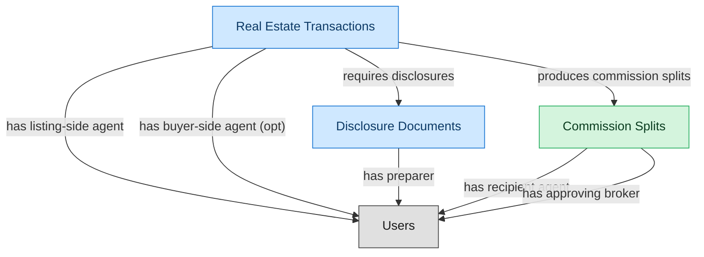

# Brokerage Oversight and Commission Management

## 1. Overview

Broker-level oversight on top of agent operations. Multi-agent commission-split engine with franchise overrides and per-agent caps, broker compliance review of transactions and disclosures, trust-account / escrow oversight, broker-level MLS conformance review. Only deployed when the brokerage has grown past informal-broker-supervision scale (typically 10+ agents).

## 2. Entity summary

| Name | Description |
| --- | --- |
| Commission Splits | Per-transaction commission distribution across listing-side and buyer-side brokerages, then internal agent splits per franchise rules; referenced by accounting and 1099 processes. |
| Disclosure Documents | State-mandated and brokerage-policy disclosure forms attached to transactions (agency disclosure, property condition, lead paint, HOA documents); required for compliance audit. |
| Real Estate Transactions | Deal pipeline from offer through close: parties, terms, contingencies, escrow timeline, and document compliance. One transaction per accepted offer; survives the listing once the offer is bound. |

## 3. Entities catalog

| # | data_object | role | mastered in | necessity | pattern flags | notes |
| ---: | --- | --- | --- | --- | --- | --- |
| 1 | `commission_splits` (Commission Splits) | master | - | required | submit_lock, single_approver | - |
| 2 | `disclosure_documents` (Disclosure Documents) | contributor | `re-brok-agent-ops` | required | personal_content, submit_lock, single_approver | - |
| 3 | `real_estate_transactions` (Real Estate Transactions) | contributor | `re-brok-agent-ops` | required | personal_content, submit_lock | - |

## 4. Aliases and industry synonyms

_(no industry-scoped aliases or non-synonym alias types loaded for this scope; generic synonyms are omitted as common knowledge.)_

## 5. Relationships

### 5.1 Intra-scope edges

| from | verb | to | cardinality | kind | necessity | owner_side | notes |
| --- | --- | --- | --- | --- | --- | --- | --- |
| `real_estate_transactions` | requires disclosures | `disclosure_documents` | one_to_many | composition | required | target | - |
| `real_estate_transactions` | produces commission splits | `commission_splits` | one_to_many | composition | required | target | - |

### 5.2 Built-in edges (`users` and other platform built-ins)

| from | verb | to | cardinality | necessity | owner_side | notes |
| --- | --- | --- | --- | --- | --- | --- |
| `real_estate_transactions` | has listing-side agent | `users` | many_to_many | required | source | - |
| `real_estate_transactions` | has buyer-side agent | `users` | many_to_many | optional | source | - |
| `disclosure_documents` | has preparer | `users` | many_to_many | required | source | - |
| `commission_splits` | has recipient agent | `users` | many_to_many | required | source | - |
| `commission_splits` | has approving broker | `users` | many_to_many | required | source | - |

### 5.3 Cross-scope edges

| from | verb | to | cardinality | necessity | notes |
| --- | --- | --- | --- | --- | --- |
| `real_estate_listings` | generates | `real_estate_transactions` | one_to_many | required | - |

## 6. Cross-domain context

### 6.1 Master consumers (other modules / domains that embed this scope's masters)

| data_object | other module / domain | role | necessity | notes |
| --- | --- | --- | --- | --- |
| `commission_splits` | RE-BROK-AGENT-OPS (Real Estate Agent Operations) - RE-BROKERAGE | consumer | optional | - |

### 6.2 Outbound handoffs (events this scope publishes)

_(no outbound `handoffs` whose payload is in this scope.)_

### 6.3 Inbound handoffs (events this scope reacts to)

_(no inbound `handoffs` whose payload is in this scope.)_

### 6.4 Master providers (modules / domains that own masters this scope embeds)

| data_object | role here | necessity | canonical owner(s) | slice notes |
| --- | --- | --- | --- | --- |
| `disclosure_documents` | contributor | required | RE-BROK-AGENT-OPS (RE-BROKERAGE) | - |
| `real_estate_transactions` | contributor | required | RE-BROK-AGENT-OPS (RE-BROKERAGE) | - |

## 7. Lifecycle states (per touched entity)

### `commission_splits` (Commission Split)

| order | state_name | initial? | terminal? | requires_permission? | derived gate | description |
| --- | --- | --- | --- | --- | --- | --- |
| 1 | `calculated` | ✓ | - | - | - | Split row auto-derived from transaction close (listing-side vs buyer-side splits, agent shares, franchise overrides). Pending review. |
| 2 | `reviewed` | - | - | ✓ | `re-brok-brokerage-ops:review_commission_split` | Broker reviewed split accuracy against the listing agreement and brokerage policy; flagged any anomalies. |
| 3 | `disputed` | - | - | ✓ | `re-brok-brokerage-ops:dispute_commission_split` | One participating agent contests the calculated split. Holds disbursement pending resolution; may return to reviewed after adjustment. |
| 4 | `approved` | - | - | ✓ | `re-brok-brokerage-ops:approve_commission_split` | Broker approved the split for payment. Ready for disbursement. |
| 5 | `paid` | - | ✓ | ✓ | `re-brok-brokerage-ops:disburse_commission` | Commission funds disbursed to participating agents and franchise; ledger entry recorded. |

### `disclosure_documents` (Disclosure Document)

_This scope holds `disclosure_documents` as **contributor**; the canonical state machine is owned by `RE-BROK-AGENT-OPS`._

| order | state_name | initial? | terminal? | requires_permission? | derived gate | description |
| --- | --- | --- | --- | --- | --- | --- |
| 1 | `drafted` | ✓ | - | - | - | Disclosure generated from a state-specific template (agency disclosure, lead-paint, natural-hazards, transfer disclosure). Not yet delivered. |
| 2 | `delivered` | - | - | ✓ | `re-brok-agent-ops:deliver_disclosure` | Disclosure sent to recipient (buyer or seller); recipient acknowledgment pending. |
| 3 | `acknowledged` | - | ✓ | ✓ | `re-brok-agent-ops:acknowledge_disclosure` | Recipient signed acknowledgment recorded (typically via eSign callback). Disclosure satisfies the compliance requirement on the transaction. |
| 4 | `rejected` | - | ✓ | - | - | Recipient refused to acknowledge or signed under dispute. Typically requires the transaction to address the rejection before progressing. |

### `real_estate_transactions` (Real Estate Transaction)

_This scope holds `real_estate_transactions` as **contributor**; the canonical state machine is owned by `RE-BROK-AGENT-OPS`._

| order | state_name | initial? | terminal? | requires_permission? | derived gate | description |
| --- | --- | --- | --- | --- | --- | --- |
| 1 | `opened` | ✓ | - | - | - | Accepted offer created the transaction; buyer/seller, listing reference, offer price, escrow agent, target close date captured. |
| 2 | `inspection` | - | - | ✓ | `re-brok-agent-ops:schedule_inspection` | Inspection period active; structural / pest / specialty inspections scheduled or in progress. |
| 3 | `financing` | - | - | ✓ | `re-brok-agent-ops:submit_financing` | Buyer's loan application in underwriting; appraisal pending; financing contingency open. |
| 4 | `contingencies_cleared` | - | - | ✓ | `re-brok-agent-ops:clear_contingencies` | All contingencies (inspection, financing, appraisal, title) satisfied or waived. Transaction ready for broker compliance review. |
| 5 | `compliance_review` | - | - | ✓ | `re-brok-brokerage-ops:submit_for_compliance_review` | Broker / transaction coordinator reviewing transaction file for compliance (disclosure completeness, signature audit, trust-account accounting). Only realized when BROKERAGE-OPS module is deployed. |
| 6 | `cleared_to_close` | - | - | ✓ | `re-brok-brokerage-ops:approve_for_closing` | Broker signed off; closing date and location confirmed. Only realized when BROKERAGE-OPS module is deployed. |
| 7 | `closed` | - | ✓ | ✓ | `re-brok-agent-ops:close_transaction` | Deed recorded, funds disbursed via escrow; transaction complete. Commission splits become payable; downstream domains notified. |
| 8 | `cancelled` | - | ✓ | ✓ | `re-brok-agent-ops:cancel_transaction` | Transaction fell through (failed inspection beyond repair, financing denied, mutual cancellation, contingency invocation). Listing typically returns to active. |

## 8. Permissions and business rules (derived)

### 8.1 Permissions

| permission | tier | description | included in `:admin`? |
| --- | --- | --- | --- |
| `re-brok-brokerage-ops:read` | baseline-read | Read access to every entity in the module | ✓ |
| `re-brok-brokerage-ops:manage` | baseline-manage | Edit operational records | ✓ |
| `re-brok-brokerage-ops:admin` | baseline-admin | Edit reference data and inherit every workflow gate below | - |
| `re-brok-brokerage-ops:submit_for_compliance_review` | workflow-gate (lifecycle) | Transition `real_estate_transactions` into state `compliance_review` | ✓ |
| `re-brok-brokerage-ops:approve_for_closing` | workflow-gate (lifecycle) | Transition `real_estate_transactions` into state `cleared_to_close` | ✓ |
| `re-brok-brokerage-ops:review_commission_split` | workflow-gate (lifecycle) | Transition `commission_splits` into state `reviewed` | ✓ |
| `re-brok-brokerage-ops:dispute_commission_split` | workflow-gate (lifecycle) | Transition `commission_splits` into state `disputed` | ✓ |
| `re-brok-brokerage-ops:approve_commission_split` | workflow-gate (lifecycle) | Transition `commission_splits` into state `approved` | ✓ |
| `re-brok-brokerage-ops:disburse_commission` | workflow-gate (lifecycle) | Transition `commission_splits` into state `paid` | ✓ |
| `re-brok-brokerage-ops:submit_commission_split` | override (submit_lock) | Submit and lock a `commission_splits` row (post-submit edits gated) | ✓ |

### 8.2 Business rules

| rule_name | data_object | source flag | intent |
| --- | --- | --- | --- |
| `submit_restricted_to_commission_split_owner` | `commission_splits` | has_submit_lock | Only the row's authoring user can submit; post-submit the row is read-only except via `re-brok-brokerage-ops:manage_all_commission_splits` |
| `approve_commission_split_requires_approver` | `commission_splits` | has_single_approver | Exactly one explicit approver required; uses the module's approval gate (`re-brok-brokerage-ops:approve_commission_split` if surfaced as a lifecycle workflow gate). |
