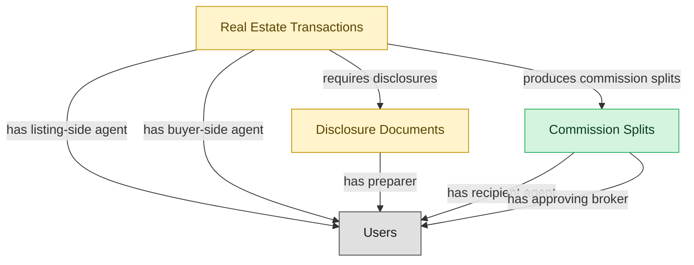

# Brokerage Oversight and Commission Management

## 1. Overview

Broker-level oversight on top of agent operations. Multi-agent commission-split engine with franchise overrides and per-agent caps, broker compliance review of transactions and disclosures, trust-account / escrow oversight, broker-level MLS conformance review. Only deployed when the brokerage has grown past informal-broker-supervision scale (typically 10+ agents).

## 2. Entity summary

| Name | data_object | Description |
| --- | --- | --- |
| Commission Splits | `commission_splits` | Per-transaction commission distribution across listing-side and buyer-side brokerages, then internal agent splits per franchise rules; referenced by accounting and 1099 processes. |
| Disclosure Documents | `disclosure_documents` | State-mandated and brokerage-policy disclosure forms attached to transactions (agency disclosure, property condition, lead paint, HOA documents); required for compliance audit. |
| Real Estate Transactions | `real_estate_transactions` | Deal pipeline from offer through close: parties, terms, contingencies, escrow timeline, and document compliance. One transaction per accepted offer; survives the listing once the offer is bound. |

## 3. Entities catalog

| # | data_object | canonical code | singular | plural | role | mastered in | mastered label | necessity | pattern flags | entity_type | write tier | notes |
| ---: | --- | --- | --- | --- | --- | --- | --- | --- | --- | --- | --- | --- |
| 1 | `commission_splits` | `commission_splits` | Commission Split | Commission Splits | master | - | - | required | submit_lock, single_approver | operational_workflow | `:manage` | - |
| 2 | `disclosure_documents` | `disclosure_documents` | Disclosure Document | Disclosure Documents | embedded_master | `re-brok-agent-ops` | Real Estate Agent Operations | required | personal_content, submit_lock, single_approver | operational_workflow | `:manage` | - |
| 3 | `real_estate_transactions` | `real_estate_transactions` | Real Estate Transaction | Real Estate Transactions | embedded_master | `re-brok-agent-ops` | Real Estate Agent Operations | required | personal_content, submit_lock | operational_workflow | `:manage` | - |

## 4. Aliases and industry synonyms

| data_object | alias | alias_type | preferred? | industry | notes |
| --- | --- | --- | --- | --- | --- |
| `real_estate_transactions` | Closing | industry_term | - | Real Estate | - |
| `commission_splits` | Co-Op Commission | industry_term | - | Real Estate | - |
| `real_estate_transactions` | Escrow | industry_term | - | Real Estate | - |
| `disclosure_documents` | Seller Disclosures | industry_term | - | Real Estate | - |
| `disclosure_documents` | TDS | industry_term | - | Real Estate | - |

## 5. Relationships

### 5.1 Intra-scope edges

| from | verb | to | cardinality | kind | necessity | owner_side | delete_mode | fk_format | notes |
| --- | --- | --- | --- | --- | --- | --- | --- | --- | --- |
| `real_estate_transactions` | requires disclosures | `disclosure_documents` | one_to_many | composition | required | source | cascade | parent | - |
| `real_estate_transactions` | produces commission splits | `commission_splits` | one_to_many | composition | required | source | cascade | parent | - |

### 5.2 Built-in edges (`users` and other platform built-ins)

| from | verb | to | cardinality | necessity | owner_side | delete_mode | fk_format | notes |
| --- | --- | --- | --- | --- | --- | --- | --- | --- |
| `real_estate_transactions` | has listing-side agent | `users` | many_to_many | required | source | restrict | reference | - |
| `real_estate_transactions` | has buyer-side agent | `users` | many_to_many | optional | source | clear | reference | - |
| `disclosure_documents` | has preparer | `users` | many_to_many | required | source | restrict | reference | - |
| `commission_splits` | has recipient agent | `users` | many_to_many | required | source | restrict | reference | - |
| `commission_splits` | has approving broker | `users` | many_to_many | required | source | restrict | reference | - |

### 5.3 Cross-scope edges

#### 5.3a Outbound from this scope's masters and contributors

_Edges this scope drives: the in-scope endpoint has `role` of `master` or `contributor`._

_(none: no outbound cross-scope edges from this scope's masters or contributors)_

#### 5.3b Context edges on embedded shells and consumed entities

_Edges the canonical owner drives, shown for context: the in-scope endpoint has `role` of `embedded_master`, `consumer`, or `derived`._

| from | verb | to | cardinality | necessity | delete_mode | fk_format | notes |
| --- | --- | --- | --- | --- | --- | --- | --- |
| `real_estate_listings` | generates | `real_estate_transactions` | one_to_many | required | none (required-if-present) | n/a | - |

## 6. Cross-domain context

### 6.1 Master consumers (other modules / domains that embed this scope's masters)

| data_object | other module / domain | role | necessity | notes |
| --- | --- | --- | --- | --- |
| `commission_splits` | RE-BROK-AGENT-OPS (Real Estate Agent Operations) - RE-BROKERAGE | embedded_master | optional | - |

### 6.2 Outbound handoffs (events this scope publishes)

| source module | target domain | target module | trigger_event | transition | payload | integration | friction | description |
| --- | --- | --- | --- | --- | --- | --- | --- | --- |
| RE-BROK-AGENT-OPS | GRC | _(domain-level)_ | `real_estate_transaction.closed` | `pending` → `closed` _(lifecycle)_ | `disclosure_documents` | batch_sync | low | Disclosure-document completeness per closed transaction feeds brokerage-compliance audit and state-real-estate-commission requirements. |
| RE-BROK-BROKERAGE-OPS | RE-BROKERAGE | RE-BROK-AGENT-OPS | `commission_split.paid` | _(lifecycle)_ | `commission_splits` | lifecycle_progression | low | Broker disbursed commission; agent-side surfaces the paid status for the recipient agent. |
| RE-BROK-BROKERAGE-OPS | RE-BROKERAGE | RE-BROK-AGENT-OPS | `real_estate_transaction.cleared_to_close` | _(state_change)_ | `real_estate_transactions` | lifecycle_progression | low | Broker compliance review approved; transaction returns to agent-side for closing coordination. |
| RE-BROK-AGENT-OPS | RE-PROP-MGMT | _(domain-level)_ | `real_estate_transaction.closed` | `pending` → `closed` _(lifecycle)_ | `real_estate_transactions` | manual_handoff | high | Closed sale of a rental property results in a new landlord-of-record; the new owner's property-management platform must be configured (often manual handoff via email; the buyer's PM and the seller's brokerage are different vendors). |
| RE-BROK-AGENT-OPS | RE-CRE | _(domain-level)_ | `real_estate_transaction.closed` | `pending` → `closed` _(lifecycle)_ | `real_estate_transactions` | manual_handoff | high | Closed sale of a CRE asset transfers operations to the new owner's CRE platform; rent-roll, leases, and CAM history must be carried over (typically manual). |

### 6.3 Inbound handoffs (events this scope reacts to)

| target module | source domain | source module | trigger_event | transition | payload | integration | friction | description |
| --- | --- | --- | --- | --- | --- | --- | --- | --- |
| RE-BROK-BROKERAGE-OPS | RE-BROKERAGE | RE-BROK-AGENT-OPS | `real_estate_transaction.contingencies_cleared` | _(state_change)_ | `real_estate_transactions` | lifecycle_progression | low | Agent-side has cleared inspection, financing, and appraisal contingencies; broker oversight takes the transaction into compliance review before authorizing closing. |

### 6.4 Master providers (modules / domains that own masters this scope embeds)

| data_object | role here | necessity | canonical owner(s) | slice notes |
| --- | --- | --- | --- | --- |
| `disclosure_documents` | embedded_master | required | RE-BROK-AGENT-OPS (RE-BROKERAGE) | - |
| `real_estate_transactions` | embedded_master | required | RE-BROK-AGENT-OPS (RE-BROKERAGE) | - |

## 7. Lifecycle states

### `commission_splits` (Commission Split)

| order | state_name | initial? | terminal? | requires_permission? | derived gate | description |
| --- | --- | --- | --- | --- | --- | --- |
| 1 | `calculated` | ✓ | - | - | - | Split row auto-derived from transaction close (listing-side vs buyer-side splits, agent shares, franchise overrides). Pending review. |
| 2 | `reviewed` | - | - | ✓ | `re-brok-brokerage-ops:review_commission_split` | Broker reviewed split accuracy against the listing agreement and brokerage policy; flagged any anomalies. |
| 3 | `disputed` | - | - | ✓ | `re-brok-brokerage-ops:dispute_commission_split` | One participating agent contests the calculated split. Holds disbursement pending resolution; may return to reviewed after adjustment. |
| 4 | `approved` | - | - | ✓ | `re-brok-brokerage-ops:approve_commission_split` | Broker approved the split for payment. Ready for disbursement. |
| 5 | `paid` | - | ✓ | ✓ | `re-brok-brokerage-ops:disburse_commission` | Commission funds disbursed to participating agents and franchise; ledger entry recorded. |

### `disclosure_documents` (Disclosure Document)

_This scope holds `disclosure_documents` as **embedded_master**; the canonical state machine is owned by `RE-BROK-AGENT-OPS`._

| order | state_name | initial? | terminal? | requires_permission? | derived gate | description |
| --- | --- | --- | --- | --- | --- | --- |
| 1 | `drafted` | ✓ | - | - | - | Disclosure generated from a state-specific template (agency disclosure, lead-paint, natural-hazards, transfer disclosure). Not yet delivered. |
| 2 | `delivered` | - | - | ✓ | `re-brok-brokerage-ops:deliver_disclosure` | Disclosure sent to recipient (buyer or seller); recipient acknowledgment pending. |
| 3 | `acknowledged` | - | ✓ | ✓ | `re-brok-brokerage-ops:acknowledge_disclosure` | Recipient signed acknowledgment recorded (typically via eSign callback). Disclosure satisfies the compliance requirement on the transaction. |
| 4 | `rejected` | - | ✓ | - | - | Recipient refused to acknowledge or signed under dispute. Typically requires the transaction to address the rejection before progressing. |

### `real_estate_transactions` (Real Estate Transaction)

_This scope holds `real_estate_transactions` as **embedded_master**; the canonical state machine is owned by `RE-BROK-AGENT-OPS`._

| order | state_name | initial? | terminal? | requires_permission? | derived gate | description |
| --- | --- | --- | --- | --- | --- | --- |
| 1 | `opened` | ✓ | - | - | - | Accepted offer created the transaction; buyer/seller, listing reference, offer price, escrow agent, target close date captured. |
| 2 | `inspection` | - | - | ✓ | `re-brok-brokerage-ops:schedule_inspection` | Inspection period active; structural / pest / specialty inspections scheduled or in progress. |
| 3 | `financing` | - | - | ✓ | `re-brok-brokerage-ops:submit_financing` | Buyer's loan application in underwriting; appraisal pending; financing contingency open. |
| 4 | `contingencies_cleared` | - | - | ✓ | `re-brok-brokerage-ops:clear_contingencies` | All contingencies (inspection, financing, appraisal, title) satisfied or waived. Transaction ready for broker compliance review. |
| 5 | `compliance_review` | - | - | ✓ | `re-brok-brokerage-ops:submit_for_compliance_review` | Broker / transaction coordinator reviewing transaction file for compliance (disclosure completeness, signature audit, trust-account accounting). Only realized when BROKERAGE-OPS module is deployed. |
| 6 | `cleared_to_close` | - | - | ✓ | `re-brok-brokerage-ops:approve_for_closing` | Broker signed off; closing date and location confirmed. Only realized when BROKERAGE-OPS module is deployed. |
| 7 | `closed` | - | ✓ | ✓ | `re-brok-brokerage-ops:close_transaction` | Deed recorded, funds disbursed via escrow; transaction complete. Commission splits become payable; downstream domains notified. |
| 8 | `canceled` | - | ✓ | ✓ | `re-brok-brokerage-ops:cancel_transaction` | Transaction fell through (failed inspection beyond repair, financing denied, mutual cancellation, contingency invocation). Listing typically returns to active. |

## 8. Permissions and business rules (derived)

### 8.1 Permissions

| permission | tier | description | included in `:admin`? |
| --- | --- | --- | --- |
| `re-brok-brokerage-ops:read` | baseline-read | Read access to every entity in the module | ✓ |
| `re-brok-brokerage-ops:manage` | baseline-manage | Edit operational records | ✓ |
| `re-brok-brokerage-ops:admin` | baseline-admin | Edit reference data and inherit every workflow gate below | - |
| `re-brok-brokerage-ops:schedule_inspection` | workflow-gate (lifecycle) | Transition `real_estate_transactions` into state `inspection` | ✓ |
| `re-brok-brokerage-ops:submit_financing` | workflow-gate (lifecycle) | Transition `real_estate_transactions` into state `financing` | ✓ |
| `re-brok-brokerage-ops:clear_contingencies` | workflow-gate (lifecycle) | Transition `real_estate_transactions` into state `contingencies_cleared` | ✓ |
| `re-brok-brokerage-ops:submit_for_compliance_review` | workflow-gate (lifecycle) | Transition `real_estate_transactions` into state `compliance_review` | ✓ |
| `re-brok-brokerage-ops:approve_for_closing` | workflow-gate (lifecycle) | Transition `real_estate_transactions` into state `cleared_to_close` | ✓ |
| `re-brok-brokerage-ops:close_transaction` | workflow-gate (lifecycle) | Transition `real_estate_transactions` into state `closed` | ✓ |
| `re-brok-brokerage-ops:cancel_transaction` | workflow-gate (lifecycle) | Transition `real_estate_transactions` into state `canceled` | ✓ |
| `re-brok-brokerage-ops:review_commission_split` | workflow-gate (lifecycle) | Transition `commission_splits` into state `reviewed` | ✓ |
| `re-brok-brokerage-ops:dispute_commission_split` | workflow-gate (lifecycle) | Transition `commission_splits` into state `disputed` | ✓ |
| `re-brok-brokerage-ops:approve_commission_split` | workflow-gate (lifecycle) | Transition `commission_splits` into state `approved` | ✓ |
| `re-brok-brokerage-ops:disburse_commission` | workflow-gate (lifecycle) | Transition `commission_splits` into state `paid` | ✓ |
| `re-brok-brokerage-ops:deliver_disclosure` | workflow-gate (lifecycle) | Transition `disclosure_documents` into state `delivered` | ✓ |
| `re-brok-brokerage-ops:acknowledge_disclosure` | workflow-gate (lifecycle) | Transition `disclosure_documents` into state `acknowledged` | ✓ |
| `re-brok-brokerage-ops:submit_commission_split` | override (submit_lock) | Submit and lock a `commission_splits` row (post-submit edits gated) | ✓ |
| `re-brok-brokerage-ops:view_all_disclosure_documents` | override (personal_content) | View all `disclosure_documents` rows beyond row-scope | ✓ |
| `re-brok-brokerage-ops:manage_all_disclosure_documents` | override (personal_content) | Manage all `disclosure_documents` rows beyond row-scope | ✓ |
| `re-brok-brokerage-ops:submit_disclosure_document` | override (submit_lock) | Submit and lock a `disclosure_documents` row (post-submit edits gated) | ✓ |
| `re-brok-brokerage-ops:view_all_real_estate_transactions` | override (personal_content) | View all `real_estate_transactions` rows beyond row-scope | ✓ |
| `re-brok-brokerage-ops:manage_all_real_estate_transactions` | override (personal_content) | Manage all `real_estate_transactions` rows beyond row-scope | ✓ |
| `re-brok-brokerage-ops:submit_real_estate_transaction` | override (submit_lock) | Submit and lock a `real_estate_transactions` row (post-submit edits gated) | ✓ |

### 8.2 Business rules

| rule_name | data_object | source flag | intent |
| --- | --- | --- | --- |
| `submit_restricted_to_commission_split_owner` | `commission_splits` | has_submit_lock | Only the row's authoring user can submit; post-submit the row is read-only except via `re-brok-brokerage-ops:manage_all_commission_splits` |
| `approve_commission_split_requires_approver` | `commission_splits` | has_single_approver | Exactly one explicit approver required; uses the module's approval gate (`re-brok-brokerage-ops:approve_commission_split` if surfaced as a lifecycle workflow gate). |
| `disclosure_document_edit_scope` | `disclosure_documents` | has_personal_content | Row-scope by default; override via `re-brok-brokerage-ops:view_all_disclosure_documents` / `re-brok-brokerage-ops:manage_all_disclosure_documents` |
| `submit_restricted_to_disclosure_document_owner` | `disclosure_documents` | has_submit_lock | Only the row's authoring user can submit; post-submit the row is read-only except via `re-brok-brokerage-ops:manage_all_disclosure_documents` |
| `approve_disclosure_document_requires_approver` | `disclosure_documents` | has_single_approver | Exactly one explicit approver required; uses the module's approval gate (`re-brok-brokerage-ops:approve_disclosure_document` if surfaced as a lifecycle workflow gate). |
| `real_estate_transaction_edit_scope` | `real_estate_transactions` | has_personal_content | Row-scope by default; override via `re-brok-brokerage-ops:view_all_real_estate_transactions` / `re-brok-brokerage-ops:manage_all_real_estate_transactions` |
| `submit_restricted_to_real_estate_transaction_owner` | `real_estate_transactions` | has_submit_lock | Only the row's authoring user can submit; post-submit the row is read-only except via `re-brok-brokerage-ops:manage_all_real_estate_transactions` |

## 9. Roles, RACI, and responsibilities (derived)

_Baseline roles, the permission hierarchy, and RACI realization are DERIVED from this scope's entity-type write tiers + `process_raci`; none of it is stored in the catalog (the deployer provisions it from this blueprint)._

### 9.1 `RE-BROK-BROKERAGE-OPS`

**Baseline roles:**

| role | baseline grant |
| --- | --- |
| `re-brok-brokerage-ops_viewer` | `re-brok-brokerage-ops:read` |
| `re-brok-brokerage-ops_manager` | `re-brok-brokerage-ops:manage` |

**Permission hierarchy:**

| permission | includes |
| --- | --- |
| `re-brok-brokerage-ops:admin` | `re-brok-brokerage-ops:manage` |
| `re-brok-brokerage-ops:manage` | `re-brok-brokerage-ops:read` |
| `re-brok-brokerage-ops:admin` | `re-brok-brokerage-ops:schedule_inspection` |
| `re-brok-brokerage-ops:admin` | `re-brok-brokerage-ops:submit_financing` |
| `re-brok-brokerage-ops:admin` | `re-brok-brokerage-ops:clear_contingencies` |
| `re-brok-brokerage-ops:admin` | `re-brok-brokerage-ops:submit_for_compliance_review` |
| `re-brok-brokerage-ops:admin` | `re-brok-brokerage-ops:approve_for_closing` |
| `re-brok-brokerage-ops:admin` | `re-brok-brokerage-ops:close_transaction` |
| `re-brok-brokerage-ops:admin` | `re-brok-brokerage-ops:cancel_transaction` |
| `re-brok-brokerage-ops:admin` | `re-brok-brokerage-ops:review_commission_split` |
| `re-brok-brokerage-ops:admin` | `re-brok-brokerage-ops:dispute_commission_split` |
| `re-brok-brokerage-ops:admin` | `re-brok-brokerage-ops:approve_commission_split` |
| `re-brok-brokerage-ops:admin` | `re-brok-brokerage-ops:disburse_commission` |
| `re-brok-brokerage-ops:admin` | `re-brok-brokerage-ops:deliver_disclosure` |
| `re-brok-brokerage-ops:admin` | `re-brok-brokerage-ops:acknowledge_disclosure` |
| `re-brok-brokerage-ops:admin` | `re-brok-brokerage-ops:submit_commission_split` |
| `re-brok-brokerage-ops:admin` | `re-brok-brokerage-ops:view_all_disclosure_documents` |
| `re-brok-brokerage-ops:admin` | `re-brok-brokerage-ops:manage_all_disclosure_documents` |
| `re-brok-brokerage-ops:admin` | `re-brok-brokerage-ops:submit_disclosure_document` |
| `re-brok-brokerage-ops:admin` | `re-brok-brokerage-ops:view_all_real_estate_transactions` |
| `re-brok-brokerage-ops:admin` | `re-brok-brokerage-ops:manage_all_real_estate_transactions` |
| `re-brok-brokerage-ops:admin` | `re-brok-brokerage-ops:submit_real_estate_transaction` |

**RACI realization:**

_(none: no process_raci assignments wired to this module's gated processes yet)_

### 9.2 Functional ownership and default grants

| responsibility | business function | default role | default tier |
| --- | --- | --- | --- |
| owner | Sales | `admin` | `:admin` |
| contributor | Marketing | `manage` | `:manage` |
| consumer | Accounting | `read` | `:read` |
