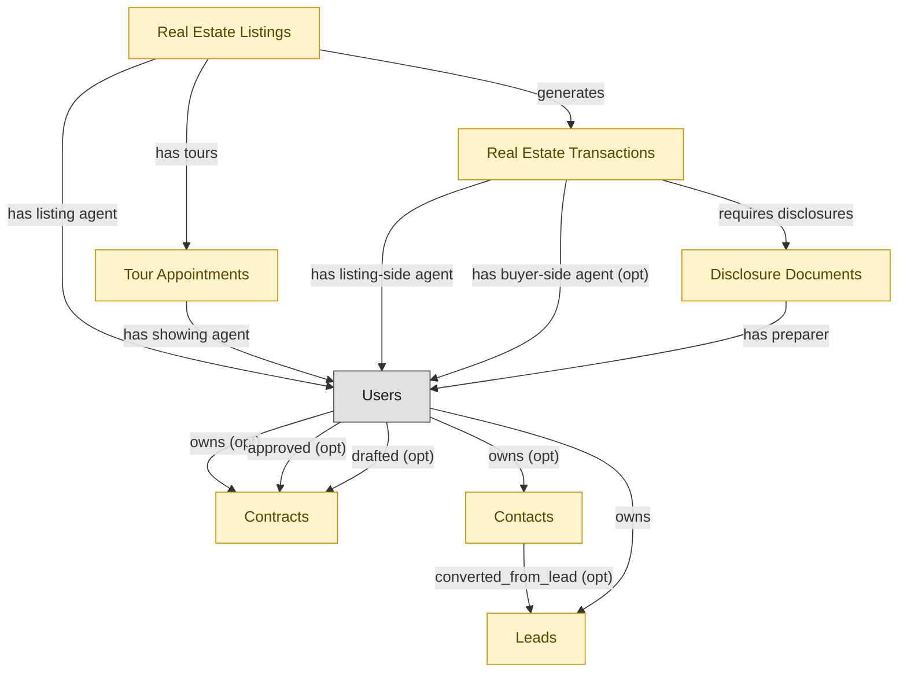

# Real Estate Agent (solo / small firm bundle)

## 1. Overview

Solo-agent and small-firm persona bundle. Single-install deployable for individual real estate agents covering lead capture and contact relationships (CRM-LEAD-MGT, CRM-ACCT-MGT), listing creation and MLS syndication, tour scheduling, transaction execution, disclosure handling (RE-BROK-AGENT-OPS), and contract reference (CLM-REPOSITORY). One module to install; larger brokerages deploy the underlying full modules and skip the starter.

## 2. Entity summary

| Name | Description |
| --- | --- |
| Contacts | Person at a customer account (B2B) or contact-level record (B2C-relevant). Carries title, email, decision-maker flag, preferred channel, opt-in state. MA contributes engagement data; SALES-ENG contributes cadence touchpoints. |
| Contracts | Canonical contract record: counterparty / supplier, contract type (MSA, SOW, NDA, DPA, subscription, lease), effective and expiry dates, total value, governing law, status (draft, in-negotiation, signed, active, expired, terminated). The most multi-mastered SaaS-related object - CLM owns the document, S2P and SMP contribute context. |
| Disclosure Documents | State-mandated and brokerage-policy disclosure forms attached to transactions (agency disclosure, property condition, lead paint, HOA documents); required for compliance audit. |
| Leads | Pre-qualification prospect record - source, score, status (new/working/qualified/disqualified/converted), assigned rep, conversion target (which contact + account it would become). MQL handoff from MA lands here. |
| Real Estate Listings | Property offered for sale or rent on an MLS or brokerage marketplace; carries pricing, photos, descriptive text, agent representation, and listing-status lifecycle (active/contingent/pending/sold/withdrawn). |
| Real Estate Transactions | Deal pipeline from offer through close: parties, terms, contingencies, escrow timeline, and document compliance. One transaction per accepted offer; survives the listing once the offer is bound. |
| Tour Appointments | Scheduled property showings with lock-box codes, access windows, agent attendance, and follow-up tracking. |

## 3. Entities catalog

| # | data_object | role | mastered in | necessity | pattern flags | notes |
| ---: | --- | --- | --- | --- | --- | --- |
| 1 | `crm_contacts` (Contacts) | embedded_master | `crm-acct-mgt` | required | personal_content | - |
| 2 | `legal_contracts` (Contracts) | embedded_master | `clm-repository` | required | submit_lock | - |
| 3 | `disclosure_documents` (Disclosure Documents) | embedded_master | `re-brok-agent-ops` | required | personal_content, submit_lock, single_approver | - |
| 4 | `crm_leads` (Leads) | embedded_master | `crm-lead-mgt` | required | personal_content | - |
| 5 | `real_estate_listings` (Real Estate Listings) | embedded_master | `re-brok-agent-ops` | required | personal_content | - |
| 6 | `real_estate_transactions` (Real Estate Transactions) | embedded_master | `re-brok-agent-ops` | required | personal_content, submit_lock | - |
| 7 | `tour_appointments` (Tour Appointments) | embedded_master | `re-brok-agent-ops` | required | personal_content | - |

## 4. Aliases and industry synonyms

_(no industry-scoped aliases or non-synonym alias types loaded for this scope; generic synonyms are omitted as common knowledge.)_

## 5. Relationships

### 5.1 Intra-scope edges

| from | verb | to | cardinality | kind | necessity | owner_side | notes |
| --- | --- | --- | --- | --- | --- | --- | --- |
| `real_estate_listings` | generates | `real_estate_transactions` | one_to_many | reference | required | target | - |
| `real_estate_listings` | has tours | `tour_appointments` | one_to_many | reference | required | target | - |
| `real_estate_transactions` | requires disclosures | `disclosure_documents` | one_to_many | composition | required | target | - |
| `crm_contacts` | converted_from_lead | `crm_leads` | one_to_many | reference | optional | source | - |

### 5.2 Built-in edges (`users` and other platform built-ins)

| from | verb | to | cardinality | necessity | owner_side | notes |
| --- | --- | --- | --- | --- | --- | --- |
| `real_estate_listings` | has listing agent | `users` | many_to_many | required | source | - |
| `tour_appointments` | has showing agent | `users` | many_to_many | required | source | - |
| `real_estate_transactions` | has listing-side agent | `users` | many_to_many | required | source | - |
| `real_estate_transactions` | has buyer-side agent | `users` | many_to_many | optional | source | - |
| `disclosure_documents` | has preparer | `users` | many_to_many | required | source | - |
| `users` | owns | `legal_contracts` | one_to_many | optional | source | - |
| `users` | approved | `legal_contracts` | one_to_many | optional | source | - |
| `users` | drafted | `legal_contracts` | one_to_many | optional | source | - |
| `users` | owns | `crm_leads` | one_to_many | required | source | - |
| `users` | owns | `crm_contacts` | one_to_many | optional | source | - |

### 5.3 Cross-scope edges

| from | verb | to | cardinality | necessity | notes |
| --- | --- | --- | --- | --- | --- |
| `in_house_legal_matters` | references | `legal_contracts` | many_to_many | optional | - |
| `legal_contracts` | governs | `customer_entitlements` | one_to_many | optional | - |
| `legal_contracts` | backs | `customer_subscriptions` | one_to_many | optional | - |
| `real_estate_transactions` | produces commission splits | `commission_splits` | one_to_many | required | - |
| `contract_templates` | seeds | `legal_contracts` | one_to_many | optional | - |
| `legal_contracts` | contains | `contract_clauses` | one_to_many | optional | - |
| `legal_contracts` | imposes | `contract_obligations` | one_to_many | required | - |
| `legal_contracts` | witnessed_by | `signature_records` | one_to_many | required | - |
| `legal_contracts` | activates | `saas_subscriptions` | one_to_many | optional | - |
| `legal_contracts` | activates | `software_licenses` | one_to_many | optional | - |
| `sourcing_events` | originates | `legal_contracts` | one_to_many | optional | - |
| `legal_contracts` | triggers_creation_of | `purchase_orders` | one_to_many | optional | - |
| `legal_contracts` | triggers_review_in | `purchase_requisitions` | one_to_many | optional | - |
| `legal_contracts` | propagates_terms_to | `invoice_matches` | one_to_many | optional | - |
| `legal_contracts` | feeds_revrec_in | `revenue_recognition_records` | one_to_many | optional | - |
| `legal_contracts` | seeds | `service_projects` | one_to_many | optional | - |
| `legal_contracts` | renewal_warns | `crm_opportunities` | one_to_many | optional | - |
| `legal_contracts` | renewal_warns | `saas_subscriptions` | one_to_many | optional | - |
| `legal_contracts` | renewed_into | `customer_subscriptions` | one_to_many | optional | - |
| `legal_contracts` | seeds | `agency_jobs` | one_to_many | optional | - |
| `crm_opportunities` | drafts | `legal_contracts` | one_to_many | optional | - |
| `sales_quotes` | drafts | `legal_contracts` | one_to_many | optional | - |
| `contract_drafts` | drafts | `legal_contracts` | one_to_many | optional | - |
| `quote_discounts` | flows into | `legal_contracts` | one_to_many | optional | - |
| `commercial_leases` | flows into | `legal_contracts` | one_to_many | optional | - |
| `engagement_letters` | flows into | `legal_contracts` | one_to_many | optional | - |
| `customers` | has_contacts | `crm_contacts` | one_to_many | optional | - |
| `customers` | converted_from_lead | `crm_leads` | one_to_many | optional | - |
| `crm_opportunities` | converted_from_lead | `crm_leads` | one_to_many | optional | - |
| `crm_opportunities` | involves_contacts | `crm_contacts` | many_to_many | optional | - |
| `crm_contacts` | has_activities | `sales_activities` | one_to_many | optional | - |
| `crm_leads` | has_activities | `sales_activities` | one_to_many | optional | - |

## 6. Cross-domain context

### 6.1 Master consumers (other modules / domains that embed this scope's masters)

### 6.2 Outbound handoffs (events this scope publishes)

_(no outbound `handoffs` whose payload is in this scope.)_

### 6.3 Inbound handoffs (events this scope reacts to)

_(no inbound `handoffs` whose payload is in this scope.)_

### 6.4 Master providers (modules / domains that own masters this scope embeds)

| data_object | role here | necessity | canonical owner(s) | slice notes |
| --- | --- | --- | --- | --- |
| `crm_contacts` | embedded_master | required | CRM-ACCT-MGT (CRM) | - |
| `crm_leads` | embedded_master | required | CRM-LEAD-MGT (CRM) | - |
| `disclosure_documents` | embedded_master | required | RE-BROK-AGENT-OPS (RE-BROKERAGE) | - |
| `legal_contracts` | embedded_master | required | CLM-REPOSITORY (CLM) | - |
| `real_estate_listings` | embedded_master | required | RE-BROK-AGENT-OPS (RE-BROKERAGE) | - |
| `real_estate_transactions` | embedded_master | required | RE-BROK-AGENT-OPS (RE-BROKERAGE) | - |
| `tour_appointments` | embedded_master | required | RE-BROK-AGENT-OPS (RE-BROKERAGE) | - |

## 7. Lifecycle states (per touched entity)

### `crm_contacts` (Contact)

_This scope holds `crm_contacts` as **embedded_master**; the canonical state machine is owned by `CRM-ACCT-MGT`._

| order | state_name | initial? | terminal? | requires_permission? | derived gate | description |
| --- | --- | --- | --- | --- | --- | --- |
| 1 | `active` | ✓ | - | - | - | Contact is current and reachable. |
| 2 | `inactive` | - | - | - | - | Contact is no longer engaged but record retained. |
| 3 | `unsubscribed` | - | ✓ | - | - | Contact has opted out of all channels. |

### `crm_leads` (Lead)

_This scope holds `crm_leads` as **embedded_master**; the canonical state machine is owned by `CRM-LEAD-MGT`._

| order | state_name | initial? | terminal? | requires_permission? | derived gate | description |
| --- | --- | --- | --- | --- | --- | --- |
| 1 | `new` | ✓ | - | - | - | Freshly captured lead awaiting triage. |
| 2 | `working` | - | - | - | - | Sales rep is actively engaging the lead. |
| 3 | `qualified` | - | - | - | - | Lead meets qualification criteria and is ready to convert. |
| 4 | `converted` | - | ✓ | ✓ | `crm-lead-mgt:convert_lead` | Lead has been converted into a contact, account, and opportunity. |
| 5 | `disqualified` | - | ✓ | - | - | Lead does not meet criteria; closed without conversion. |

### `disclosure_documents` (Disclosure Document)

_This scope holds `disclosure_documents` as **embedded_master**; the canonical state machine is owned by `RE-BROK-AGENT-OPS`._

| order | state_name | initial? | terminal? | requires_permission? | derived gate | description |
| --- | --- | --- | --- | --- | --- | --- |
| 1 | `drafted` | ✓ | - | - | - | Disclosure generated from a state-specific template (agency disclosure, lead-paint, natural-hazards, transfer disclosure). Not yet delivered. |
| 2 | `delivered` | - | - | ✓ | `re-brok-agent-ops:deliver_disclosure` | Disclosure sent to recipient (buyer or seller); recipient acknowledgment pending. |
| 3 | `acknowledged` | - | ✓ | ✓ | `re-brok-agent-ops:acknowledge_disclosure` | Recipient signed acknowledgment recorded (typically via eSign callback). Disclosure satisfies the compliance requirement on the transaction. |
| 4 | `rejected` | - | ✓ | - | - | Recipient refused to acknowledge or signed under dispute. Typically requires the transaction to address the rejection before progressing. |

### `legal_contracts` (Contract)

_This scope holds `legal_contracts` as **embedded_master**; the canonical state machine is owned by `CLM-REPOSITORY`._

| order | state_name | initial? | terminal? | requires_permission? | derived gate | description |
| --- | --- | --- | --- | --- | --- | --- |
| 10 | `draft` | ✓ | - | - | - | Initial draft created in CLM-AUTHORING from a template, or received via inbound handoff from CPQ/sourcing. |
| 20 | `in_review` | - | - | - | - | Draft has been routed for internal review prior to counterparty exchange. |
| 30 | `in_negotiation` | - | - | - | - | Active counterparty negotiation with track-changes / redline exchange. |
| 40 | `approved` | - | - | ✓ | `clm-negotiation:approve_legal_contract` | Final negotiated text approved by all internal stakeholders; ready for signature. |
| 50 | `out_for_signature` | - | - | - | - | Signature envelope dispatched to all required signers. |
| 60 | `signed` | - | - | ✓ | `clm-repository:execute_legal_contract` | All signers have signed; contract is fully executed. |
| 70 | `active` | - | - | - | - | Effective date has passed; contract is in force. Default post-signature state. |
| 75 | `amended` | - | - | ✓ | `clm-repository:amend_legal_contract` | An amendment has been executed against this contract. Amendment is a separate record; this contract row reflects the amended terms going forward. |
| 80 | `expired` | - | ✓ | - | - | End date passed without renewal or termination. Terminal state. |
| 90 | `terminated` | - | ✓ | ✓ | `clm-repository:terminate_legal_contract` | Contract terminated before end date (by mutual consent, breach, or for-cause). Terminal state. |
| 100 | `renewed` | - | ✓ | ✓ | `clm-renewal:renew_legal_contract` | Renewed via a new contract record (or extended via amendment). The renewal is a separate record; this row is terminal. |

### `real_estate_listings` (Real Estate Listing)

_This scope holds `real_estate_listings` as **embedded_master**; the canonical state machine is owned by `RE-BROK-AGENT-OPS`._

| order | state_name | initial? | terminal? | requires_permission? | derived gate | description |
| --- | --- | --- | --- | --- | --- | --- |
| 1 | `draft` | ✓ | - | - | - | Listing is being prepared (photos, copy, pricing); not yet published to MLS. |
| 2 | `active` | - | - | ✓ | `re-brok-agent-ops:activate_listing` | Listing is published to the MLS and accepting offers. |
| 3 | `under_contract` | - | - | ✓ | `re-brok-agent-ops:mark_under_contract` | Offer accepted; a real_estate_transaction has been opened. Listing remains visible on MLS as 'pending' but not accepting new offers. |
| 4 | `sold` | - | ✓ | ✓ | `re-brok-agent-ops:close_listing` | Transaction closed; listing terminated as a sale. Triggers downstream events to property-management, CRE, and investment systems. |
| 5 | `withdrawn` | - | ✓ | ✓ | `re-brok-agent-ops:withdraw_listing` | Listing pulled from the market without a sale (seller decision, expired listing agreement before contract, market reasons). |
| 6 | `expired` | - | ✓ | - | - | Listing agreement reached its end date without a sale or active renewal. No explicit user action; system marks at expiration. |

### `real_estate_transactions` (Real Estate Transaction)

_This scope holds `real_estate_transactions` as **embedded_master**; the canonical state machine is owned by `RE-BROK-AGENT-OPS`._

| order | state_name | initial? | terminal? | requires_permission? | derived gate | description |
| --- | --- | --- | --- | --- | --- | --- |
| 1 | `opened` | ✓ | - | - | - | Accepted offer created the transaction; buyer/seller, listing reference, offer price, escrow agent, target close date captured. |
| 2 | `inspection` | - | - | ✓ | `re-brok-agent-ops:schedule_inspection` | Inspection period active; structural / pest / specialty inspections scheduled or in progress. |
| 3 | `financing` | - | - | ✓ | `re-brok-agent-ops:submit_financing` | Buyer's loan application in underwriting; appraisal pending; financing contingency open. |
| 4 | `contingencies_cleared` | - | - | ✓ | `re-brok-agent-ops:clear_contingencies` | All contingencies (inspection, financing, appraisal, title) satisfied or waived. Transaction ready for broker compliance review. |
| 5 | `compliance_review` | - | - | ✓ | `re-brok-brokerage-ops:submit_for_compliance_review` | Broker / transaction coordinator reviewing transaction file for compliance (disclosure completeness, signature audit, trust-account accounting). Only realized when BROKERAGE-OPS module is deployed. |
| 6 | `cleared_to_close` | - | - | ✓ | `re-brok-brokerage-ops:approve_for_closing` | Broker signed off; closing date and location confirmed. Only realized when BROKERAGE-OPS module is deployed. |
| 7 | `closed` | - | ✓ | ✓ | `re-brok-agent-ops:close_transaction` | Deed recorded, funds disbursed via escrow; transaction complete. Commission splits become payable; downstream domains notified. |
| 8 | `cancelled` | - | ✓ | ✓ | `re-brok-agent-ops:cancel_transaction` | Transaction fell through (failed inspection beyond repair, financing denied, mutual cancellation, contingency invocation). Listing typically returns to active. |

### `tour_appointments` (Tour Appointment)

_This scope holds `tour_appointments` as **embedded_master**; the canonical state machine is owned by `RE-BROK-AGENT-OPS`._

| order | state_name | initial? | terminal? | requires_permission? | derived gate | description |
| --- | --- | --- | --- | --- | --- | --- |
| 1 | `scheduled` | ✓ | - | - | - | Tour booked with prospect; access arrangements (lockbox code, listing-agent attendance) pending confirmation. |
| 2 | `confirmed` | - | - | ✓ | `re-brok-agent-ops:confirm_tour` | Prospect confirmed attendance; access arrangements finalized. |
| 3 | `completed` | - | ✓ | ✓ | `re-brok-agent-ops:complete_tour` | Tour took place; agent recorded notes and any buyer-feedback signals. |
| 4 | `cancelled` | - | ✓ | ✓ | `re-brok-agent-ops:cancel_tour` | Tour cancelled by either party before it took place. |
| 5 | `no_show` | - | ✓ | - | - | Prospect did not appear at the scheduled time. No explicit cancellation; agent marks after the fact. |

## 8. Permissions and business rules (derived)

### 8.1 Permissions

| permission | tier | description | included in `:admin`? |
| --- | --- | --- | --- |
| `real-estate-agent:read` | baseline-read | Read access to every entity in the module | ✓ |
| `real-estate-agent:manage` | baseline-manage | Edit operational records | ✓ |
| `real-estate-agent:admin` | baseline-admin | Edit reference data and inherit every workflow gate below | - |

### 8.2 Business rules

_(no flag-derived business rules.)_
