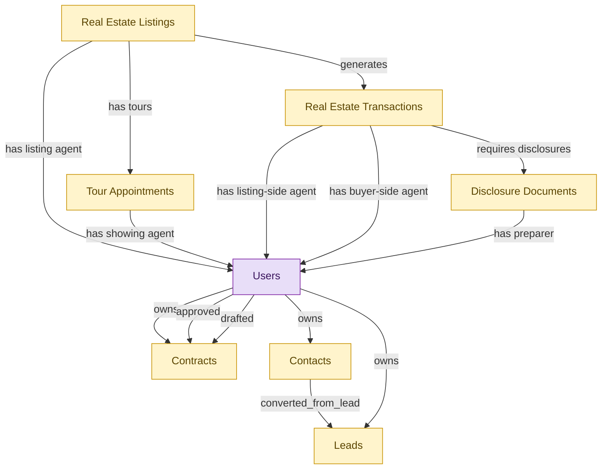

# Real Estate Agent (solo / small firm bundle)

## 1. Overview

Solo-agent and small-firm persona bundle. Single-install deployable for individual real estate agents covering lead capture and contact relationships (CRM-LEAD-MGT, CRM-ACCT-MGT), listing creation and MLS syndication, tour scheduling, transaction execution, disclosure handling (RE-BROK-AGENT-OPS), and contract reference (CLM-REPOSITORY). One module to install; larger brokerages deploy the underlying full modules and skip the starter.

## 2. Entity summary

| Name | data_object | Description |
| --- | --- | --- |
| Contacts | `crm_contacts` | People at customer or prospect organizations, carrying title, contact details, decision-maker flag, preferred channel, and opt-in state. |
| Contracts | `legal_contracts` | Contracts with counterparties or suppliers, covering type, value, key dates, governing law, and lifecycle from draft to terminated. |
| Disclosure Documents | `disclosure_documents` | State-mandated and brokerage-policy disclosure forms attached to transactions, such as agency, property condition, lead paint, and HOA documents. |
| Leads | `crm_leads` | Prospects captured before qualification, tracking source, score, status, assigned rep, and the contact and account they would convert into. |
| Real Estate Listings | `real_estate_listings` | Properties offered for sale or rent, with pricing, photos, descriptions, agent representation, and status from active to sold. |
| Real Estate Transactions | `real_estate_transactions` | Real estate deals from accepted offer through close, with parties, terms, contingencies, escrow timeline, and document compliance. |
| Tour Appointments | `tour_appointments` | Scheduled property showings with lock-box codes, access windows, agent attendance, and follow-up tracking. |
| Users | `users` | Platform users referenced as assignees, authors, approvers, and creators across records. |

## 3. Entities catalog

| # | data_object | canonical code | singular | plural | role | mastered in | mastered label | necessity | personal_content | entity_type | write tier | notes |
| ---: | --- | --- | --- | --- | --- | --- | --- | --- | --- | --- | --- | --- |
| 1 | `crm_contacts` | `crm_contacts` | Contact | Contacts | embedded_master | `crm-acct-mgt` | Account and Contact Management | required | yes | operational_record | `:manage` | - |
| 2 | `legal_contracts` | `legal_contracts` | Contract | Contracts | embedded_master | `clm-repository` | Contract Repository | required | yes | operational_workflow | `:manage` | - |
| 3 | `disclosure_documents` | `disclosure_documents` | Disclosure Document | Disclosure Documents | embedded_master | `re-brok-agent-ops` | Real Estate Agent Operations | required | yes | operational_workflow | `:manage` | - |
| 4 | `crm_leads` | `crm_leads` | Lead | Leads | embedded_master | `crm-lead-mgt` | Lead Capture and Qualification | required | yes | operational_workflow | `:manage` | - |
| 5 | `real_estate_listings` | `real_estate_listings` | Real Estate Listing | Real Estate Listings | embedded_master | `re-brok-agent-ops` | Real Estate Agent Operations | required | yes | operational_workflow | `:manage` | - |
| 6 | `real_estate_transactions` | `real_estate_transactions` | Real Estate Transaction | Real Estate Transactions | embedded_master | `re-brok-agent-ops` | Real Estate Agent Operations | required | yes | operational_workflow | `:manage` | - |
| 7 | `tour_appointments` | `tour_appointments` | Tour Appointment | Tour Appointments | embedded_master | `re-brok-agent-ops` | Real Estate Agent Operations | required | yes | operational_workflow | `:manage` | - |
| 8 | `users` | `users` | User | Users | consumer | _(platform built-in)_ | _(platform built-in)_ | required | - | operational_record | `:manage` | - |

## 4. Aliases and industry synonyms

| data_object | alias | alias_type | preferred? | industry | notes |
| --- | --- | --- | --- | --- | --- |
| `real_estate_transactions` | Closing | industry_term | - | Real Estate | - |
| `real_estate_transactions` | Escrow | industry_term | - | Real Estate | - |
| `real_estate_listings` | MLS Listing | industry_term | - | Real Estate | - |
| `tour_appointments` | Open House Appointment | industry_term | - | Real Estate | - |
| `disclosure_documents` | Seller Disclosures | industry_term | - | Real Estate | - |
| `tour_appointments` | Showing | industry_term | - | Real Estate | - |
| `disclosure_documents` | TDS | industry_term | - | Real Estate | - |

## 5. Relationships

### 5.1 Intra-scope edges

| from | verb | to | cardinality | kind | necessity | owner_side | delete_mode | fk_format | notes |
| --- | --- | --- | --- | --- | --- | --- | --- | --- | --- |
| `real_estate_listings` | generates | `real_estate_transactions` | one_to_many | reference | required | target | restrict | reference | - |
| `real_estate_listings` | has tours | `tour_appointments` | one_to_many | reference | required | target | restrict | reference | - |
| `real_estate_transactions` | requires disclosures | `disclosure_documents` | one_to_many | composition | required | source | cascade | parent | - |
| `crm_contacts` | converted_from_lead | `crm_leads` | one_to_many | reference | optional | source | clear | reference | - |

### 5.2 Built-in edges (`users` and other platform built-ins)

| from | verb | to | cardinality | necessity | owner_side | delete_mode | fk_format | notes |
| --- | --- | --- | --- | --- | --- | --- | --- | --- |
| `real_estate_listings` | has listing agent | `users` | many_to_many | required | source | restrict | reference | - |
| `tour_appointments` | has showing agent | `users` | many_to_many | required | source | restrict | reference | - |
| `real_estate_transactions` | has listing-side agent | `users` | many_to_many | required | source | restrict | reference | - |
| `real_estate_transactions` | has buyer-side agent | `users` | many_to_many | optional | source | clear | reference | - |
| `disclosure_documents` | has preparer | `users` | many_to_many | required | source | restrict | reference | - |
| `users` | owns | `legal_contracts` | one_to_many | optional | source | clear | reference | - |
| `users` | approved | `legal_contracts` | one_to_many | optional | source | clear | reference | - |
| `users` | drafted | `legal_contracts` | one_to_many | optional | source | clear | reference | - |
| `users` | owns | `crm_leads` | one_to_many | required | source | restrict | reference | - |
| `users` | owns | `crm_contacts` | one_to_many | optional | source | clear | reference | - |

### 5.3 Cross-scope edges

#### 5.3a Outbound from this scope's masters and contributors

_Edges this scope drives: the in-scope endpoint has `role` of `master` or `contributor`._

_(none: no outbound cross-scope edges from this scope's masters or contributors)_

#### 5.3b Context edges on embedded shells and consumed entities

_Edges the canonical owner drives, shown for context: the in-scope endpoint has `role` of `embedded_master`, `consumer`, or `derived`._

| from | verb | to | cardinality | necessity | delete_mode | fk_format | notes |
| --- | --- | --- | --- | --- | --- | --- | --- |
| `in_house_legal_matters` | references | `legal_contracts` | many_to_many | optional | none | n/a | - |
| `legal_contracts` | governs | `customer_entitlements` | one_to_many | optional | none | n/a | - |
| `legal_contracts` | backs | `customer_subscriptions` | one_to_many | optional | none | n/a | - |
| `real_estate_transactions` | produces commission splits | `commission_splits` | one_to_many | required | ⚠ audit: required composed child out of scope | n/a | - |
| `contract_templates` | seeds | `legal_contracts` | one_to_many | optional | none | n/a | - |
| `legal_contracts` | contains | `contract_clauses` | one_to_many | optional | none | n/a | - |
| `legal_contracts` | imposes | `contract_obligations` | one_to_many | required | ⚠ audit: required composed child out of scope | n/a | - |
| `legal_contracts` | witnessed_by | `signature_records` | one_to_many | required | ⚠ audit: required composed child out of scope | n/a | - |
| `legal_contracts` | activates | `saas_subscriptions` | one_to_many | optional | none | n/a | - |
| `legal_contracts` | activates | `software_licenses` | one_to_many | optional | none | n/a | - |
| `sourcing_events` | originates | `legal_contracts` | one_to_many | optional | none | n/a | - |
| `legal_contracts` | triggers_creation_of | `purchase_orders` | one_to_many | optional | none | n/a | - |
| `legal_contracts` | triggers_review_in | `purchase_requisitions` | one_to_many | optional | none | n/a | - |
| `legal_contracts` | propagates_terms_to | `invoice_matches` | one_to_many | optional | none | n/a | - |
| `legal_contracts` | feeds_revrec_in | `revenue_recognition_records` | one_to_many | optional | none | n/a | - |
| `legal_contracts` | seeds | `service_projects` | one_to_many | optional | none | n/a | - |
| `legal_contracts` | renewal_warns | `crm_opportunities` | one_to_many | optional | none | n/a | - |
| `legal_contracts` | renewal_warns | `saas_subscriptions` | one_to_many | optional | none | n/a | - |
| `legal_contracts` | renewed_into | `customer_subscriptions` | one_to_many | optional | none | n/a | - |
| `legal_contracts` | seeds | `agency_jobs` | one_to_many | optional | none | n/a | - |
| `crm_opportunities` | drafts | `legal_contracts` | one_to_many | optional | none | n/a | - |
| `sales_quotes` | drafts | `legal_contracts` | one_to_many | optional | none | n/a | - |
| `contract_drafts` | drafts | `legal_contracts` | one_to_many | optional | none | n/a | - |
| `quote_discounts` | flows into | `legal_contracts` | one_to_many | optional | none | n/a | - |
| `commercial_leases` | flows into | `legal_contracts` | one_to_many | optional | none | n/a | - |
| `engagement_letters` | flows into | `legal_contracts` | one_to_many | optional | none | n/a | - |
| `customers` | has_contacts | `crm_contacts` | one_to_many | optional | none | n/a | - |
| `customers` | converted_from_lead | `crm_leads` | one_to_many | optional | none | n/a | - |
| `crm_opportunities` | converted_from_lead | `crm_leads` | one_to_many | optional | none | n/a | - |
| `crm_opportunities` | involves_contacts | `crm_contacts` | many_to_many | optional | none | n/a | - |
| `crm_contacts` | has_activities | `sales_activities` | one_to_many | optional | none | n/a | - |
| `crm_leads` | has_activities | `sales_activities` | one_to_many | optional | none | n/a | - |
| `contact_records` | enriches | `crm_contacts` | one_to_many | optional | none | n/a | - |
| `legal_contracts` | is amended by | `contract_amendments` | one_to_many | optional | none | n/a | - |
| `legal_contracts` | is renewed by | `contract_renewal_records` | one_to_many | optional | none | n/a | - |
| `legal_contracts` | is assessed by | `contract_risk_assessments` | one_to_many | optional | none | n/a | - |
| `contract_counterparties` | is party to | `legal_contracts` | one_to_many | optional | none | n/a | - |
| `legal_contracts` | has milestone | `contract_milestones` | one_to_many | optional | none | n/a | - |
| `legal_contracts` | has data protection addendum | `data_protection_addenda` | one_to_many | optional | none | n/a | - |
| `legal_contracts` | is negotiated in | `contract_negotiation_threads` | one_to_many | optional | none | n/a | - |

## 6. Cross-domain context

### 6.1 Master consumers (other modules / domains that embed this scope's masters)

_(none: no other module embeds this scope's masters; the canonical owners do.)_

### 6.2 Outbound handoffs (events this scope publishes)

| source module | target domain | target module | trigger_event | transition | payload | integration | friction | description |
| --- | --- | --- | --- | --- | --- | --- | --- | --- |
| RE-BROK-AGENT-OPS | GRC | _(domain-level)_ | `real_estate_transaction.closed` | `pending` → `closed` _(lifecycle)_ | `disclosure_documents` | batch_sync | low | Disclosure-document completeness per closed transaction feeds brokerage-compliance audit and state-real-estate-commission requirements. |
| CLM-REPOSITORY | CLM | CLM-OBLIGATION-MGMT | `legal_contract.signed` | `signed` _(lifecycle)_ | `legal_contracts` | lifecycle_progression | low | - |
| CLM-REPOSITORY | CLM | CLM-RENEWAL | `legal_contract.active` | _(state_change)_ | `legal_contracts` | lifecycle_progression | low | - |
| CLM-REPOSITORY | S2P | _(domain-level)_ | `legal_contract.expired` | `active` → `expired` _(lifecycle)_ | `legal_contracts` | batch_sync | medium | Expired contracts trigger procurement renewal-decision workflow. Failure modes: auto-renewal clauses missed; silent expiry of long-tail contracts. |
| CLM-REPOSITORY | AP-AUTO | _(domain-level)_ | `legal_contract.amended` | `amended` _(state_change)_ | `legal_contracts` | api_call | medium | Contract amendments propagate to AP-AUTO: updated payment terms, discount schedule, GL coding. Failure modes: retroactive amendments require recalculating already-paid invoices. |
| CLM-REPOSITORY | FIN | _(domain-level)_ | `legal_contract.signed` | `signed` _(lifecycle)_ | `legal_contracts` | api_call | medium | Signed contract feeds ERP-FIN payment terms and rev-rec rules. Friction in extracting structured terms from contract text. |
| CLM-REPOSITORY | PSA | PSA-PROJECT-DELIVERY | `legal_contract.signed` | `signed` _(lifecycle)_ | `legal_contracts` | api_call | medium | Signed SOW seeds PSA project scope, billing terms, and milestone schedule. Deviations between contract terms and operational project structure require manual reconciliation. |
| CRM-LEAD-MGT | CRM | CRM-ACTIVITY | `crm_lead.qualified` | _(state_change)_ | `crm_leads` | lifecycle_progression | low | - |
| CRM-ACCT-MGT | MA | MA-CAMPAIGN-AUTHORING | `crm_contact.synced` | `synced` _(signal)_ | `crm_contacts` | batch_sync | medium | Contact updates in CRM (new contact, status change, opt-in change, account ownership) sync to MA so audience lists and campaigns stay current. Batch-sync is the typical pattern - real-time would be ideal but most stacks accept hourly or daily latency here. |
| CRM-LEAD-MGT | SALES-ENG | _(domain-level)_ | `crm_lead.scored_above_threshold` | _(threshold)_ | `crm_leads` | event_stream | medium | A lead's predictive score has crossed the qualified-handoff threshold; SALES-ENG picks up for cadence enrollment. Failure modes: noisy scoring causes cadence whiplash; threshold tuned per segment but not surfaced. |
| CLM-REPOSITORY | SUB-MGMT | _(domain-level)_ | `legal_contract.signed` | `signed` _(lifecycle)_ | `legal_contracts` | api_call | medium | Signed contract triggers SUB-MGMT to activate the subscription record. |
| RE-BROK-AGENT-OPS | RE-BROKERAGE | RE-BROK-BROKERAGE-OPS | `real_estate_transaction.contingencies_cleared` | _(state_change)_ | `real_estate_transactions` | lifecycle_progression | low | Agent-side has cleared inspection, financing, and appraisal contingencies; broker oversight takes the transaction into compliance review before authorizing closing. |
| RE-BROK-AGENT-OPS | RE-PROP-MGMT | _(domain-level)_ | `real_estate_transaction.closed` | `pending` → `closed` _(lifecycle)_ | `real_estate_transactions` | manual_handoff | high | Closed sale of a rental property results in a new landlord-of-record; the new owner's property-management platform must be configured (often manual handoff via email; the buyer's PM and the seller's brokerage are different vendors). |
| RE-BROK-AGENT-OPS | RE-CRE | _(domain-level)_ | `listing.sold` | _(lifecycle)_ | `real_estate_listings` | batch_sync | medium | Closed sale triggers commercial lease setup if multi-tenant. |
| RE-BROK-AGENT-OPS | RE-CRE | _(domain-level)_ | `real_estate_transaction.closed` | `pending` → `closed` _(lifecycle)_ | `real_estate_transactions` | manual_handoff | high | Closed sale of a CRE asset transfers operations to the new owner's CRE platform; rent-roll, leases, and CAM history must be carried over (typically manual). |
| RE-BROK-AGENT-OPS | RE-INVEST | RE-INVEST-PORTFOLIO-VAL | `listing.sold` | _(lifecycle)_ | `real_estate_listings` | manual_handoff | high | Sale closing triggers fund NAV and LP-reporting recalculation. |

### 6.3 Inbound handoffs (events this scope reacts to)

| target module | source domain | source module | trigger_event | transition | payload | integration | friction | description |
| --- | --- | --- | --- | --- | --- | --- | --- | --- |
| CLM-REPOSITORY | CLM | CLM-NEGOTIATION | `legal_contract.approved` | _(state_change)_ | `legal_contracts` | lifecycle_progression | low | - |
| CLM-REPOSITORY | CLM | CLM-RENEWAL | `legal_contract.renewed` | _(state_change)_ | `legal_contracts` | lifecycle_progression | low | - |
| CLM-REPOSITORY | S2P | _(domain-level)_ | `sourcing.contract_drafted` | _(state_change)_ | `legal_contracts` | api_call | medium | Sourcing decision in S2P hands off to CLM to author the contract. Friction sits in clause selection, redline coordination with the counterparty, and the legal-review loop with LSD. |
| CLM-REPOSITORY | CPQ | CPQ-QUOTE-BUILDER | `quote.accepted` | `accepted` _(state_change)_ | `legal_contracts` | api_call | medium | Accepted quote hands off to CLM for contract authoring - pulls in clause language, populates the agreed terms, routes for signature. |
| CLM-REPOSITORY | SMP | SMP-RENEWAL-VENDOR | `renewal.30_day_warning` | _(threshold)_ | `legal_contracts` | api_call | low | SMP's renewal-watch surfaces a 30-day expiry warning to CLM so the contract document workflow (amendment, renegotiation) can start in time. |
| CLM-REPOSITORY | AGENCY-MGMT | AGENCY-MGMT-JOB-TRAFFIC | `estimate.approved` | `pending` → `approved` _(lifecycle)_ | `legal_contracts` | api_call | medium | Client-approved estimate must be converted into a signed SOW in CLM before delivery can start. Includes line-item scope, billing terms, deliverable schedule, and approval routing. |
| CRM-LEAD-MGT | MA | MA-LEAD-SCORING | `crm_lead.qualified` | _(state_change)_ | `crm_leads` | event_stream | medium | MA-driven scoring crosses the MQL threshold; the lead routes to CRM with a recommended owner. Friction comes from definition drift - what counts as MQL, who owns routing, what happens to disqualified leads - and from the lead-to-contact-to-opportunity conversion chain inside CRM. |
| CRM-LEAD-MGT | MA | MA-LEAD-SCORING | `crm_lead.scored_above_threshold` | _(threshold)_ | `crm_leads` | event_stream | low | Qualified leads routed to CRM for sales pickup. Tight integration on all major MA platforms. |
| CRM-LEAD-MGT | MA | MA-LEAD-SCORING | `nurture.completed` | `completed` _(state_change)_ | `crm_leads` | api_call | low | Nurture journey completion (whether successful conversion or exit) updates lead status in CRM. Low friction in same-vendor all-in-one stacks; medium when MA and CRM are separate. |
| CRM-LEAD-MGT | MA | MA-LEAD-SCORING | `nurture_journey.completed` | _(lifecycle)_ | `crm_leads` | api_call | low | Completed nurture without conversion returns the lead to CRM for re-routing or recycle. |
| CRM-LEAD-MGT | PRM | _(domain-level)_ | `partner_referral.qualified` | `qualified` _(state_change)_ | `crm_leads` | api_call | medium | Partner-sourced referrals flow into CRM lead-routing. Failure modes: dedup against existing prospects; partner-attribution edge cases. |
| CRM-LEAD-MGT | SMM | _(domain-level)_ | `social_lead.captured` | `captured` _(state_change)_ | `crm_leads` | api_call | medium | Social interaction with explicit intent, DM asking pricing, click-through on a lead-gen form, message-ad reply, converts into a CRM-mastered lead with handle, captured form data, and source attribution. Failure modes: handle-to-existing-contact reconciliation produces duplicate leads; form-data quality from social lead-gen ads is inconsistent across networks. |
| RE-BROK-AGENT-OPS | RE-BROKERAGE | RE-BROK-BROKERAGE-OPS | `real_estate_transaction.cleared_to_close` | _(state_change)_ | `real_estate_transactions` | lifecycle_progression | low | Broker compliance review approved; transaction returns to agent-side for closing coordination. |

### 6.4 Master providers (modules / domains that own masters this scope embeds)

| data_object | role here | necessity | canonical owner(s) | slice notes |
| --- | --- | --- | --- | --- |
| `crm_contacts` | embedded_master | required | CRM-ACCT-MGT (CRM) | - |
| `crm_leads` | embedded_master | required | CRM-LEAD-MGT (CRM) | - |
| `disclosure_documents` | embedded_master | required | RE-BROK-AGENT-OPS (RE-BROKERAGE) | - |
| `legal_contracts` | embedded_master | required | CLM-REPOSITORY (CLM) | - |
| `real_estate_listings` | embedded_master | required | RE-BROK-AGENT-OPS (RE-BROKERAGE) | - |
| `real_estate_transactions` | embedded_master | required | RE-BROK-AGENT-OPS (RE-BROKERAGE) | - |
| `tour_appointments` | embedded_master | required | RE-BROK-AGENT-OPS (RE-BROKERAGE) | - |
| `users` | consumer | required | _(platform built-in)_ | - |

## 7. Lifecycle states

### `crm_contacts` (Contact)

_This scope holds `crm_contacts` as **embedded_master**; the canonical state machine is owned by `CRM-ACCT-MGT`._

| order | state_name | initial? | terminal? | requires_permission? | derived gate | description |
| --- | --- | --- | --- | --- | --- | --- |
| 1 | `active` | ✓ | - | - | - | Contact is current and reachable. |
| 2 | `inactive` | - | - | - | - | Contact is no longer engaged but record retained. |
| 3 | `unsubscribed` | - | ✓ | - | - | Contact has opted out of all channels. |

### `crm_leads` (Lead)

_This scope holds `crm_leads` as **embedded_master**; the canonical state machine is owned by `CRM-LEAD-MGT`._

| order | state_name | initial? | terminal? | requires_permission? | derived gate | description |
| --- | --- | --- | --- | --- | --- | --- |
| 1 | `new` | ✓ | - | - | - | Freshly captured lead awaiting triage. |
| 2 | `working` | - | - | - | - | Sales rep is actively engaging the lead. |
| 3 | `qualified` | - | - | - | - | Lead meets qualification criteria and is ready to convert. |
| 4 | `converted` | - | ✓ | ✓ | `real-estate-agent:convert_lead` | Lead has been converted into a contact, account, and opportunity. |
| 5 | `disqualified` | - | ✓ | - | - | Lead does not meet criteria; closed without conversion. |

### `disclosure_documents` (Disclosure Document)

_This scope holds `disclosure_documents` as **embedded_master**; the canonical state machine is owned by `RE-BROK-AGENT-OPS`._

| order | state_name | initial? | terminal? | requires_permission? | derived gate | description |
| --- | --- | --- | --- | --- | --- | --- |
| 1 | `drafted` | ✓ | - | - | - | Disclosure generated from a state-specific template (agency disclosure, lead-paint, natural-hazards, transfer disclosure). Not yet delivered. |
| 2 | `delivered` | - | - | ✓ | `real-estate-agent:deliver_disclosure` | Disclosure sent to recipient (buyer or seller); recipient acknowledgment pending. |
| 3 | `acknowledged` | - | ✓ | ✓ | `real-estate-agent:acknowledge_disclosure` | Recipient signed acknowledgment recorded (typically via eSign callback). Disclosure satisfies the compliance requirement on the transaction. |
| 4 | `rejected` | - | ✓ | - | - | Recipient refused to acknowledge or signed under dispute. Typically requires the transaction to address the rejection before progressing. |

### `legal_contracts` (Contract)

_This scope holds `legal_contracts` as **embedded_master**; the canonical state machine is owned by `CLM-REPOSITORY`._

| order | state_name | initial? | terminal? | requires_permission? | derived gate | description |
| --- | --- | --- | --- | --- | --- | --- |
| 10 | `draft` | ✓ | - | - | - | Initial draft created in CLM-AUTHORING from a template, or received via inbound handoff from CPQ/sourcing. |
| 20 | `in_review` | - | - | - | - | Draft has been routed for internal review prior to counterparty exchange. |
| 30 | `in_negotiation` | - | - | - | - | Active counterparty negotiation with track-changes / redline exchange. |
| 40 | `approved` | - | - | ✓ | `real-estate-agent:approve_legal_contract` | Final negotiated text approved by all internal stakeholders; ready for signature. |
| 50 | `out_for_signature` | - | - | - | - | Signature envelope dispatched to all required signers. |
| 60 | `signed` | - | - | ✓ | `real-estate-agent:execute_legal_contract` | All signers have signed; contract is fully executed. |
| 70 | `active` | - | - | - | - | Effective date has passed; contract is in force. Default post-signature state. |
| 75 | `amended` | - | - | ✓ | `real-estate-agent:amend_legal_contract` | An amendment has been executed against this contract. Amendment is a separate record; this contract row reflects the amended terms going forward. |
| 80 | `expired` | - | ✓ | - | - | End date passed without renewal or termination. Terminal state. |
| 90 | `terminated` | - | ✓ | ✓ | `real-estate-agent:terminate_legal_contract` | Contract terminated before end date (by mutual consent, breach, or for-cause). Terminal state. |
| 100 | `renewed` | - | ✓ | ✓ | `real-estate-agent:renew_legal_contract` | Renewed via a new contract record (or extended via amendment). The renewal is a separate record; this row is terminal. |

### `real_estate_listings` (Real Estate Listing)

_This scope holds `real_estate_listings` as **embedded_master**; the canonical state machine is owned by `RE-BROK-AGENT-OPS`._

| order | state_name | initial? | terminal? | requires_permission? | derived gate | description |
| --- | --- | --- | --- | --- | --- | --- |
| 1 | `draft` | ✓ | - | - | - | Listing is being prepared (photos, copy, pricing); not yet published to MLS. |
| 2 | `active` | - | - | ✓ | `real-estate-agent:activate_listing` | Listing is published to the MLS and accepting offers. |
| 3 | `under_contract` | - | - | ✓ | `real-estate-agent:mark_under_contract` | Offer accepted; a real_estate_transaction has been opened. Listing remains visible on MLS as 'pending' but not accepting new offers. |
| 4 | `sold` | - | ✓ | ✓ | `real-estate-agent:close_listing` | Transaction closed; listing terminated as a sale. Triggers downstream events to property-management, CRE, and investment systems. |
| 5 | `withdrawn` | - | ✓ | ✓ | `real-estate-agent:withdraw_listing` | Listing pulled from the market without a sale (seller decision, expired listing agreement before contract, market reasons). |
| 6 | `expired` | - | ✓ | - | - | Listing agreement reached its end date without a sale or active renewal. No explicit user action; system marks at expiration. |

### `real_estate_transactions` (Real Estate Transaction)

_This scope holds `real_estate_transactions` as **embedded_master**; the canonical state machine is owned by `RE-BROK-AGENT-OPS`._

| order | state_name | initial? | terminal? | requires_permission? | derived gate | description |
| --- | --- | --- | --- | --- | --- | --- |
| 1 | `opened` | ✓ | - | - | - | Accepted offer created the transaction; buyer/seller, listing reference, offer price, escrow agent, target close date captured. |
| 2 | `inspection` | - | - | ✓ | `real-estate-agent:schedule_inspection` | Inspection period active; structural / pest / specialty inspections scheduled or in progress. |
| 3 | `financing` | - | - | ✓ | `real-estate-agent:submit_financing` | Buyer's loan application in underwriting; appraisal pending; financing contingency open. |
| 4 | `contingencies_cleared` | - | - | ✓ | `real-estate-agent:clear_contingencies` | All contingencies (inspection, financing, appraisal, title) satisfied or waived. Transaction ready for broker compliance review. |
| 5 | `compliance_review` | - | - | ✓ | `real-estate-agent:submit_for_compliance_review` | Broker / transaction coordinator reviewing transaction file for compliance (disclosure completeness, signature audit, trust-account accounting). Only realized when BROKERAGE-OPS module is deployed. |
| 6 | `cleared_to_close` | - | - | ✓ | `real-estate-agent:approve_for_closing` | Broker signed off; closing date and location confirmed. Only realized when BROKERAGE-OPS module is deployed. |
| 7 | `closed` | - | ✓ | ✓ | `real-estate-agent:close_transaction` | Deed recorded, funds disbursed via escrow; transaction complete. Commission splits become payable; downstream domains notified. |
| 8 | `canceled` | - | ✓ | ✓ | `real-estate-agent:cancel_transaction` | Transaction fell through (failed inspection beyond repair, financing denied, mutual cancellation, contingency invocation). Listing typically returns to active. |

### `tour_appointments` (Tour Appointment)

_This scope holds `tour_appointments` as **embedded_master**; the canonical state machine is owned by `RE-BROK-AGENT-OPS`._

| order | state_name | initial? | terminal? | requires_permission? | derived gate | description |
| --- | --- | --- | --- | --- | --- | --- |
| 1 | `scheduled` | ✓ | - | - | - | Tour booked with prospect; access arrangements (lockbox code, listing-agent attendance) pending confirmation. |
| 2 | `confirmed` | - | - | ✓ | `real-estate-agent:confirm_tour` | Prospect confirmed attendance; access arrangements finalized. |
| 3 | `completed` | - | ✓ | ✓ | `real-estate-agent:complete_tour` | Tour took place; agent recorded notes and any buyer-feedback signals. |
| 4 | `canceled` | - | ✓ | ✓ | `real-estate-agent:cancel_tour` | Tour canceled by either party before it took place. |
| 5 | `no_show` | - | ✓ | - | - | Prospect did not appear at the scheduled time. No explicit cancellation; agent marks after the fact. |

## 8. Permissions and business rules (derived)

### 8.1 Permissions

| permission | tier | description | included in `:admin`? |
| --- | --- | --- | --- |
| `real-estate-agent:read` | baseline-read | Read access to every entity in the module | ✓ |
| `real-estate-agent:manage` | baseline-manage | Edit operational records | ✓ |
| `real-estate-agent:admin` | baseline-admin | Edit reference data and inherit every workflow gate below | - |
| `real-estate-agent:approve_legal_contract` | workflow-gate (lifecycle) | Transition `legal_contracts` into state `approved` | ✓ |
| `real-estate-agent:execute_legal_contract` | workflow-gate (lifecycle) | Transition `legal_contracts` into state `signed` | ✓ |
| `real-estate-agent:amend_legal_contract` | workflow-gate (lifecycle) | Transition `legal_contracts` into state `amended` | ✓ |
| `real-estate-agent:terminate_legal_contract` | workflow-gate (lifecycle) | Transition `legal_contracts` into state `terminated` | ✓ |
| `real-estate-agent:renew_legal_contract` | workflow-gate (lifecycle) | Transition `legal_contracts` into state `renewed` | ✓ |
| `real-estate-agent:convert_lead` | workflow-gate (lifecycle) | Transition `crm_leads` into state `converted` | ✓ |
| `real-estate-agent:activate_listing` | workflow-gate (lifecycle) | Transition `real_estate_listings` into state `active` | ✓ |
| `real-estate-agent:mark_under_contract` | workflow-gate (lifecycle) | Transition `real_estate_listings` into state `under_contract` | ✓ |
| `real-estate-agent:close_listing` | workflow-gate (lifecycle) | Transition `real_estate_listings` into state `sold` | ✓ |
| `real-estate-agent:withdraw_listing` | workflow-gate (lifecycle) | Transition `real_estate_listings` into state `withdrawn` | ✓ |
| `real-estate-agent:schedule_inspection` | workflow-gate (lifecycle) | Transition `real_estate_transactions` into state `inspection` | ✓ |
| `real-estate-agent:submit_financing` | workflow-gate (lifecycle) | Transition `real_estate_transactions` into state `financing` | ✓ |
| `real-estate-agent:clear_contingencies` | workflow-gate (lifecycle) | Transition `real_estate_transactions` into state `contingencies_cleared` | ✓ |
| `real-estate-agent:submit_for_compliance_review` | workflow-gate (lifecycle) | Transition `real_estate_transactions` into state `compliance_review` | ✓ |
| `real-estate-agent:approve_for_closing` | workflow-gate (lifecycle) | Transition `real_estate_transactions` into state `cleared_to_close` | ✓ |
| `real-estate-agent:close_transaction` | workflow-gate (lifecycle) | Transition `real_estate_transactions` into state `closed` | ✓ |
| `real-estate-agent:cancel_transaction` | workflow-gate (lifecycle) | Transition `real_estate_transactions` into state `canceled` | ✓ |
| `real-estate-agent:confirm_tour` | workflow-gate (lifecycle) | Transition `tour_appointments` into state `confirmed` | ✓ |
| `real-estate-agent:complete_tour` | workflow-gate (lifecycle) | Transition `tour_appointments` into state `completed` | ✓ |
| `real-estate-agent:cancel_tour` | workflow-gate (lifecycle) | Transition `tour_appointments` into state `canceled` | ✓ |
| `real-estate-agent:deliver_disclosure` | workflow-gate (lifecycle) | Transition `disclosure_documents` into state `delivered` | ✓ |
| `real-estate-agent:acknowledge_disclosure` | workflow-gate (lifecycle) | Transition `disclosure_documents` into state `acknowledged` | ✓ |
| `real-estate-agent:view_all_contracts` | override (personal_content) | View all `legal_contracts` rows beyond row-scope | ✓ |
| `real-estate-agent:manage_all_contracts` | override (personal_content) | Manage all `legal_contracts` rows beyond row-scope | ✓ |
| `real-estate-agent:view_all_leads` | override (personal_content) | View all `crm_leads` rows beyond row-scope | ✓ |
| `real-estate-agent:manage_all_leads` | override (personal_content) | Manage all `crm_leads` rows beyond row-scope | ✓ |
| `real-estate-agent:view_all_contacts` | override (personal_content) | View all `crm_contacts` rows beyond row-scope | ✓ |
| `real-estate-agent:manage_all_contacts` | override (personal_content) | Manage all `crm_contacts` rows beyond row-scope | ✓ |
| `real-estate-agent:view_all_real_estate_listings` | override (personal_content) | View all `real_estate_listings` rows beyond row-scope | ✓ |
| `real-estate-agent:manage_all_real_estate_listings` | override (personal_content) | Manage all `real_estate_listings` rows beyond row-scope | ✓ |
| `real-estate-agent:view_all_tour_appointments` | override (personal_content) | View all `tour_appointments` rows beyond row-scope | ✓ |
| `real-estate-agent:manage_all_tour_appointments` | override (personal_content) | Manage all `tour_appointments` rows beyond row-scope | ✓ |
| `real-estate-agent:view_all_real_estate_transactions` | override (personal_content) | View all `real_estate_transactions` rows beyond row-scope | ✓ |
| `real-estate-agent:manage_all_real_estate_transactions` | override (personal_content) | Manage all `real_estate_transactions` rows beyond row-scope | ✓ |
| `real-estate-agent:view_all_disclosure_documents` | override (personal_content) | View all `disclosure_documents` rows beyond row-scope | ✓ |
| `real-estate-agent:manage_all_disclosure_documents` | override (personal_content) | Manage all `disclosure_documents` rows beyond row-scope | ✓ |

### 8.2 Business rules

| rule_name | data_object | source flag | intent |
| --- | --- | --- | --- |
| `contract_edit_scope` | `legal_contracts` | has_personal_content | Row-scope by default; override via `real-estate-agent:view_all_contracts` / `real-estate-agent:manage_all_contracts` |
| `lead_edit_scope` | `crm_leads` | has_personal_content | Row-scope by default; override via `real-estate-agent:view_all_leads` / `real-estate-agent:manage_all_leads` |
| `contact_edit_scope` | `crm_contacts` | has_personal_content | Row-scope by default; override via `real-estate-agent:view_all_contacts` / `real-estate-agent:manage_all_contacts` |
| `real_estate_listing_edit_scope` | `real_estate_listings` | has_personal_content | Row-scope by default; override via `real-estate-agent:view_all_real_estate_listings` / `real-estate-agent:manage_all_real_estate_listings` |
| `tour_appointment_edit_scope` | `tour_appointments` | has_personal_content | Row-scope by default; override via `real-estate-agent:view_all_tour_appointments` / `real-estate-agent:manage_all_tour_appointments` |
| `real_estate_transaction_edit_scope` | `real_estate_transactions` | has_personal_content | Row-scope by default; override via `real-estate-agent:view_all_real_estate_transactions` / `real-estate-agent:manage_all_real_estate_transactions` |
| `disclosure_document_edit_scope` | `disclosure_documents` | has_personal_content | Row-scope by default; override via `real-estate-agent:view_all_disclosure_documents` / `real-estate-agent:manage_all_disclosure_documents` |

## 9. Roles, RACI, and responsibilities (derived)

_Baseline roles, the permission hierarchy, and RACI realization are DERIVED from this scope's entity-type write tiers + `process_raci`; none of it is stored in the catalog (the deployer provisions it from this blueprint)._

### 9.1 `REAL-ESTATE-AGENT`

**Baseline roles:**

| role | baseline grant |
| --- | --- |
| `real-estate-agent_viewer` | `real-estate-agent:read` |
| `real-estate-agent_manager` | `real-estate-agent:manage` |

**Permission hierarchy:**

| permission | includes |
| --- | --- |
| `real-estate-agent:admin` | `real-estate-agent:manage` |
| `real-estate-agent:manage` | `real-estate-agent:read` |
| `real-estate-agent:admin` | `real-estate-agent:approve_legal_contract` |
| `real-estate-agent:admin` | `real-estate-agent:execute_legal_contract` |
| `real-estate-agent:admin` | `real-estate-agent:amend_legal_contract` |
| `real-estate-agent:admin` | `real-estate-agent:terminate_legal_contract` |
| `real-estate-agent:admin` | `real-estate-agent:renew_legal_contract` |
| `real-estate-agent:admin` | `real-estate-agent:convert_lead` |
| `real-estate-agent:admin` | `real-estate-agent:activate_listing` |
| `real-estate-agent:admin` | `real-estate-agent:mark_under_contract` |
| `real-estate-agent:admin` | `real-estate-agent:close_listing` |
| `real-estate-agent:admin` | `real-estate-agent:withdraw_listing` |
| `real-estate-agent:admin` | `real-estate-agent:schedule_inspection` |
| `real-estate-agent:admin` | `real-estate-agent:submit_financing` |
| `real-estate-agent:admin` | `real-estate-agent:clear_contingencies` |
| `real-estate-agent:admin` | `real-estate-agent:submit_for_compliance_review` |
| `real-estate-agent:admin` | `real-estate-agent:approve_for_closing` |
| `real-estate-agent:admin` | `real-estate-agent:close_transaction` |
| `real-estate-agent:admin` | `real-estate-agent:cancel_transaction` |
| `real-estate-agent:admin` | `real-estate-agent:confirm_tour` |
| `real-estate-agent:admin` | `real-estate-agent:complete_tour` |
| `real-estate-agent:admin` | `real-estate-agent:cancel_tour` |
| `real-estate-agent:admin` | `real-estate-agent:deliver_disclosure` |
| `real-estate-agent:admin` | `real-estate-agent:acknowledge_disclosure` |
| `real-estate-agent:admin` | `real-estate-agent:view_all_contracts` |
| `real-estate-agent:admin` | `real-estate-agent:manage_all_contracts` |
| `real-estate-agent:admin` | `real-estate-agent:view_all_leads` |
| `real-estate-agent:admin` | `real-estate-agent:manage_all_leads` |
| `real-estate-agent:admin` | `real-estate-agent:view_all_contacts` |
| `real-estate-agent:admin` | `real-estate-agent:manage_all_contacts` |
| `real-estate-agent:admin` | `real-estate-agent:view_all_real_estate_listings` |
| `real-estate-agent:admin` | `real-estate-agent:manage_all_real_estate_listings` |
| `real-estate-agent:admin` | `real-estate-agent:view_all_tour_appointments` |
| `real-estate-agent:admin` | `real-estate-agent:manage_all_tour_appointments` |
| `real-estate-agent:admin` | `real-estate-agent:view_all_real_estate_transactions` |
| `real-estate-agent:admin` | `real-estate-agent:manage_all_real_estate_transactions` |
| `real-estate-agent:admin` | `real-estate-agent:view_all_disclosure_documents` |
| `real-estate-agent:admin` | `real-estate-agent:manage_all_disclosure_documents` |

**Processes wired:**

| process_key | process_name | PCF code | PCF ID | level | description |
| --- | --- | --- | --- | --- | --- |
| `negotiate_document_agreements` | Negotiate and document agreements/contracts | 12.4.9 | 11052 | 3 | Negotiating terms to reach a final draft of a contract that is acceptable to all parties. |
| `manage_contracts` | Manage contracts | 4.2.3.4 | 10291 | 4 | Keeping contracts up-to-date with routine evaluation. Maintain order and discipline with the contracts in order to avoid any loss of information and mishaps. |

**RACI realization:**

| actor | kind | raci | process_key | realization |
| --- | --- | --- | --- | --- |
| `LEGAL-COUNSEL` | persona | responsible | `negotiate_document_agreements` | grant gates [real-estate-agent:approve_legal_contract] + the gated entities' write tier |
| `CONTRACT-OPS-MANAGER` | persona | accountable | `negotiate_document_agreements` | approval gate |
| `PROCUREMENT-CONTRACT-LIAISON` | persona | consulted | `negotiate_document_agreements` | advisory read grant |
| `CONTRACT-OPS-SPECIALIST` | persona | informed | `negotiate_document_agreements` | notification side effect (trigger_event / webhook_receiver) |
| `CONTRACT-OPS-SPECIALIST` | persona | responsible | `manage_contracts` | grant gates [real-estate-agent:execute_legal_contract, real-estate-agent:terminate_legal_contract, real-estate-agent:renew_legal_contract] + the gated entities' write tier |
| `CONTRACT-OPS-MANAGER` | persona | accountable | `manage_contracts` | approval gate |
| `LEGAL-COUNSEL` | persona | consulted | `manage_contracts` | advisory read grant |

### 9.2 Functional ownership and default grants

_(none: no business_function_domains rows for this scope's domain)_
