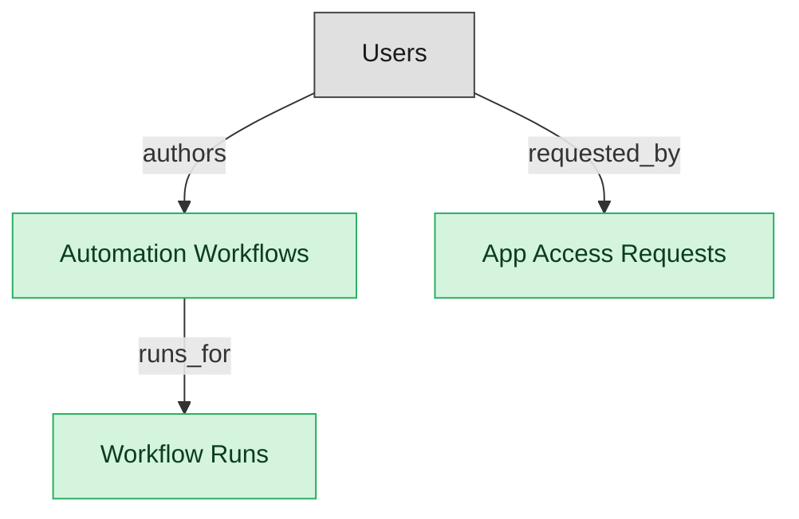

# SMP Automation and Self-Service Requests

## 1. Overview

Declarative automation workflows, workflow run history, and employee-facing self-service app-access requests. The automation surface of an SMP deployment.

## 2. Entity summary

| Name | data_object | Description |
| --- | --- | --- |
| App Access Requests | `smp_app_requests` | Employee requests for access to a SaaS app via the published catalog, routed for manager and IT approval before provisioning. |
| Automation Workflows | `smp_automation_workflows` | Declarative automation workflows with a trigger and steps such as provisioning, notifying, offboarding, or requesting approval. |
| Workflow Runs | `smp_workflow_runs` | Execution logs for each automation workflow run, with trigger source, input, step-by-step status, output, duration, and any error. |

## 3. Entities catalog

| # | data_object | canonical code | singular | plural | description | role | mastered in | mastered label | necessity | pattern flags | entity_type | write tier | notes |
| ---: | --- | --- | --- | --- | --- | --- | --- | --- | --- | --- | --- | --- | --- |
| 1 | `smp_app_requests` | `smp_app_requests` | App Access Request | App Access Requests | Employee request for access to a SaaS application via the published catalog. Routes through manager + IT approval, then hands off to IGA for entitlement provisioning. App-grain (pre-IGA-handoff); distinct from iga_access_requests (entitlement-grain) and itsm_service_requests (generic catalog). Torii App Catalog requests + BetterCloud Self-Service Requests are the flagship. | master | - | - | required | personal_content, submit_lock | operational_workflow | `:manage` | - |
| 2 | `smp_automation_workflows` | `smp_automation_workflows` | Automation Workflow | Automation Workflows | Declarative orchestration: trigger + steps (provision in SaaS app, send notification, file offboarding action, request approval, escalate). BetterCloud Workflows + Torii Workflows are the flagship product surface. Distinct from iga_access_requests (request-side) and integration_recipes (generic iPaaS). | master | - | - | required | - | catalog | `:admin` | - |
| 3 | `smp_workflow_runs` | `smp_workflow_runs` | Workflow Run | Workflow Runs | Execution log per automation workflow invocation. Carries trigger source, input payload, step-by-step status, output, duration, and error if failed. | master | - | - | required | - | operational_record | `:manage` | - |

## 4. Aliases and industry synonyms

_(none: no industry-scoped aliases for this scope)_

## 5. Relationships

### 5.1 Intra-scope edges

| from | verb | to | cardinality | kind | necessity | owner_side | delete_mode | fk_format | notes |
| --- | --- | --- | --- | --- | --- | --- | --- | --- | --- |
| `smp_automation_workflows` | runs_for | `smp_workflow_runs` | one_to_many | composition | required | source | cascade | parent | - |

### 5.2 Built-in edges (`users` and other platform built-ins)

| from | verb | to | cardinality | necessity | owner_side | delete_mode | fk_format | notes |
| --- | --- | --- | --- | --- | --- | --- | --- | --- |
| `users` | requested_by | `smp_app_requests` | one_to_many | required | target | restrict | reference | - |
| `users` | authors | `smp_automation_workflows` | one_to_many | required | target | restrict | reference | - |

### 5.3 Cross-scope edges

#### 5.3a Outbound from this scope's masters and contributors

_Edges this scope drives: the in-scope endpoint has `role` of `master` or `contributor`._

| from | verb | to | cardinality | necessity | delete_mode | fk_format | notes |
| --- | --- | --- | --- | --- | --- | --- | --- |
| `saas_applications` | automates_app | `smp_automation_workflows` | one_to_many | optional | none | n/a | - |
| `smp_app_catalog_listings` | requests_listing | `smp_app_requests` | one_to_many | required | none (required-if-present) | n/a | - |

#### 5.3b Context edges on embedded shells and consumed entities

_Edges the canonical owner drives, shown for context: the in-scope endpoint has `role` of `embedded_master`, `consumer`, or `derived`._

_(none: no context cross-scope edges on this scope's embedded shells or consumed entities)_

## 6. Cross-domain context

### 6.1 Master consumers (other modules / domains that embed this scope's masters)

_(none: no other module embeds this scope's masters; the canonical owners do.)_

### 6.2 Outbound handoffs (events this scope publishes)

_(none: no outbound handoffs whose payload is in this scope)_

### 6.3 Inbound handoffs (events this scope reacts to)

| target module | source domain | source module | trigger_event | transition | payload | integration | friction | description |
| --- | --- | --- | --- | --- | --- | --- | --- | --- |
| SMP-AUTOMATION | SMP | SMP-DISCOVERY | `smp_app_catalog_listing.published` | _(lifecycle)_ | `smp_app_requests` | lifecycle_progression | low | Publishing an app to the self-service catalog opens employee app-access requests in the automation module. |

### 6.4 Master providers (modules / domains that own masters this scope embeds)

_(none: this scope embeds no masters owned elsewhere; every entity is mastered here)_

## 7. Lifecycle states

### `smp_app_requests` (App Access Request)

| order | state_name | initial? | terminal? | requires_permission? | derived gate | description |
| --- | --- | --- | --- | --- | --- | --- |
| 10 | `submitted` | ✓ | - | ✓ | `smp-automation:submit_app_request` | - |
| 20 | `manager_approved` | - | - | ✓ | `smp-automation:manager_approve_request` | - |
| 30 | `it_approved` | - | - | ✓ | `smp-automation:it_approve_request` | - |
| 40 | `fulfilled` | - | ✓ | ✓ | `smp-automation:fulfill_app_request` | - |
| 50 | `denied` | - | ✓ | ✓ | `smp-automation:deny_app_request` | - |
| 60 | `canceled` | - | ✓ | ✓ | `smp-automation:cancel_app_request` | - |

### `smp_automation_workflows` (Automation Workflow)

| order | state_name | initial? | terminal? | requires_permission? | derived gate | description |
| --- | --- | --- | --- | --- | --- | --- |
| 10 | `draft` | ✓ | - | - | - | - |
| 20 | `active` | - | - | ✓ | `smp-automation:activate_workflow` | - |
| 30 | `paused` | - | - | ✓ | `smp-automation:pause_workflow` | - |
| 40 | `archived` | - | ✓ | ✓ | `smp-automation:archive_workflow` | - |

### `smp_workflow_runs` (Workflow Run)

| order | state_name | initial? | terminal? | requires_permission? | derived gate | description |
| --- | --- | --- | --- | --- | --- | --- |
| 10 | `queued` | ✓ | - | - | - | - |
| 20 | `running` | - | - | - | - | - |
| 30 | `succeeded` | - | ✓ | - | - | - |
| 40 | `failed` | - | ✓ | - | - | - |
| 50 | `canceled` | - | ✓ | ✓ | `smp-automation:cancel_workflow_run` | - |

## 8. Permissions and business rules (derived)

### 8.1 Permissions

| permission | tier | description | included in `:admin`? |
| --- | --- | --- | --- |
| `smp-automation:read` | baseline-read | Read access to every entity in the module | ✓ |
| `smp-automation:manage` | baseline-manage | Edit operational records | ✓ |
| `smp-automation:admin` | baseline-admin | Edit reference data and inherit every workflow gate below | - |
| `smp-automation:activate_workflow` | workflow-gate (lifecycle) | Transition `smp_automation_workflows` into state `active` | ✓ |
| `smp-automation:pause_workflow` | workflow-gate (lifecycle) | Transition `smp_automation_workflows` into state `paused` | ✓ |
| `smp-automation:archive_workflow` | workflow-gate (lifecycle) | Transition `smp_automation_workflows` into state `archived` | ✓ |
| `smp-automation:cancel_workflow_run` | workflow-gate (lifecycle) | Transition `smp_workflow_runs` into state `canceled` | ✓ |
| `smp-automation:submit_app_request` | workflow-gate (lifecycle) | Transition `smp_app_requests` into state `submitted` | ✓ |
| `smp-automation:manager_approve_request` | workflow-gate (lifecycle) | Transition `smp_app_requests` into state `manager_approved` | ✓ |
| `smp-automation:it_approve_request` | workflow-gate (lifecycle) | Transition `smp_app_requests` into state `it_approved` | ✓ |
| `smp-automation:fulfill_app_request` | workflow-gate (lifecycle) | Transition `smp_app_requests` into state `fulfilled` | ✓ |
| `smp-automation:deny_app_request` | workflow-gate (lifecycle) | Transition `smp_app_requests` into state `denied` | ✓ |
| `smp-automation:cancel_app_request` | workflow-gate (lifecycle) | Transition `smp_app_requests` into state `canceled` | ✓ |
| `smp-automation:view_all_app_access_requests` | override (personal_content) | View all `smp_app_requests` rows beyond row-scope | ✓ |
| `smp-automation:manage_all_app_access_requests` | override (personal_content) | Manage all `smp_app_requests` rows beyond row-scope | ✓ |
| `smp-automation:submit_app_access_request` | override (submit_lock) | Submit and lock a `smp_app_requests` row (post-submit edits gated) | ✓ |

### 8.2 Business rules

| rule_name | data_object | source flag | intent |
| --- | --- | --- | --- |
| `app_access_request_edit_scope` | `smp_app_requests` | has_personal_content | Row-scope by default; override via `smp-automation:view_all_app_access_requests` / `smp-automation:manage_all_app_access_requests` |
| `submit_restricted_to_app_access_request_owner` | `smp_app_requests` | has_submit_lock | Only the row's authoring user can submit; post-submit the row is read-only except via `smp-automation:manage_all_app_access_requests` |

## 9. Roles, RACI, and responsibilities (derived)

_Baseline roles, the permission hierarchy, and RACI realization are DERIVED from this scope's entity-type write tiers + `process_raci`; none of it is stored in the catalog (the deployer provisions it from this blueprint)._

### 9.1 `SMP-AUTOMATION`

**Baseline roles:**

| role | baseline grant |
| --- | --- |
| `smp-automation_viewer` | `smp-automation:read` |
| `smp-automation_manager` | `smp-automation:manage` |
| `smp-automation_admin` | `smp-automation:admin` |

**Permission hierarchy:**

| permission | includes |
| --- | --- |
| `smp-automation:admin` | `smp-automation:manage` |
| `smp-automation:manage` | `smp-automation:read` |
| `smp-automation:admin` | `smp-automation:activate_workflow` |
| `smp-automation:admin` | `smp-automation:pause_workflow` |
| `smp-automation:admin` | `smp-automation:archive_workflow` |
| `smp-automation:admin` | `smp-automation:cancel_workflow_run` |
| `smp-automation:admin` | `smp-automation:submit_app_request` |
| `smp-automation:admin` | `smp-automation:manager_approve_request` |
| `smp-automation:admin` | `smp-automation:it_approve_request` |
| `smp-automation:admin` | `smp-automation:fulfill_app_request` |
| `smp-automation:admin` | `smp-automation:deny_app_request` |
| `smp-automation:admin` | `smp-automation:cancel_app_request` |
| `smp-automation:admin` | `smp-automation:view_all_app_access_requests` |
| `smp-automation:admin` | `smp-automation:manage_all_app_access_requests` |
| `smp-automation:admin` | `smp-automation:submit_app_access_request` |

**Processes wired:**

| process_key | process_name | PCF code | PCF ID | level | description |
| --- | --- | --- | --- | --- | --- |
| `manage_infrastructure_resource` | Manage infrastructure resource administration | 8.7.7 | 20914 | 3 | Managing the resources required for administration of IT infrastructure. Manage the IT inventory and assets. Take care of the organization's IT resource capacity. |
| `manage_it_user_identity` | Manage IT user identity and authorization | 8.3.8 | 20756 | 3 | The process of identifying, authenticating, and authorizing IT users to have access to applications, systems, IT components, or networks by associating user rights and restrictions with established identities. |

**RACI realization:**

| actor | kind | raci | process_key | realization |
| --- | --- | --- | --- | --- |
| `IT-SAAS-ADMIN` | persona | responsible | `manage_infrastructure_resource` | grant gates [smp-automation:activate_workflow, smp-automation:pause_workflow, smp-automation:archive_workflow, smp-automation:cancel_workflow_run] + the gated entities' write tier |
| `IT-SAAS-ADMIN` | persona | accountable | `manage_infrastructure_resource` | approval gate |
| `IT-SAAS-ADMIN` | persona | responsible | `manage_it_user_identity` | grant gates [smp-automation:submit_app_request, smp-automation:manager_approve_request, smp-automation:it_approve_request, smp-automation:fulfill_app_request, smp-automation:deny_app_request, smp-automation:cancel_app_request] + the gated entities' write tier |
| `IT-SAAS-ADMIN` | persona | accountable | `manage_it_user_identity` | approval gate |

### 9.2 Functional ownership and default grants

| responsibility | business function | default role | default tier |
| --- | --- | --- | --- |
| owner | IT Asset Management | `admin` | `:admin` |
| contributor | Finance | `manage` | `:manage` |
| contributor | Procurement | `manage` | `:manage` |
