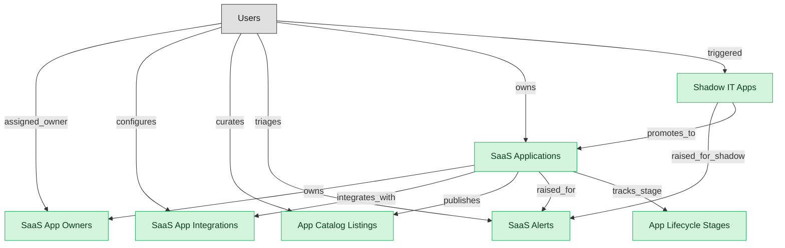

# SMP Discovery and Catalog

## 1. Overview

Discovery of sanctioned and shadow SaaS, app inventory, ownership, integrations, lifecycle staging, catalog publication, and operational signal/alerts. The discovery substrate of an SMP deployment.

## 2. Entity summary

| Name | data_object | Description |
| --- | --- | --- |
| App Catalog Listings | `smp_app_catalog_listings` | Curated, published listing of a sanctioned SaaS application that employees can browse and request access to. Carries description, owner, request route, SSO availability, approval workflow. Distinct from saas_applications (the discovered inventory of what's running); the catalog is the publication of what's offered. LeanIX, Torii, BetterCloud flagship. |
| App Lifecycle Stages | `smp_app_lifecycle_stages` | Portfolio-rationalization stage of a SaaS application (Evaluate, Pilot, Sanctioned, Sunset, Retired). Distinct from saas_applications.record_status (discovered, sanctioned, deprecated, deprovisioned), which tracks discovery state. The stage set follows the industry-standard TIME portfolio taxonomy (Tolerate, Invest, Migrate, Eliminate). |
| SaaS Alerts | `smp_alerts` | System-raised anomaly on the SaaS portfolio: shadow-IT signup detected, license-overage projected, renewal window opening, integration token expiring, vendor-risk score change. Distinct from monitoring_alerts (OBS/AIOPS infrastructure-grain). BetterCloud Alert Center and Torii Alerts are the flagship surfaces. |
| SaaS App Integrations | `smp_app_integrations` | Discovered or configured connection between SMP and a SaaS application's APIs (SSO source, SCIM source, finance source, usage source). Per-app per-tenant, with auth state and last-sync time. Distinct from IPAAS integration_connectors (platform-grain vendor-connector definitions); BetterCloud's App Integrations flagship surface. |
| SaaS App Owners | `smp_app_owners` | Typed role assignment of a user to a SaaS application (business owner, IT owner, finance owner, security owner). Not a flat FK on saas_applications because one app may have multiple typed owners; modeled by Productiv and LeanIX as a first-class junction. |
| SaaS Applications | `saas_applications` | Canonical SaaS app in the portfolio (collaboration, CRM, productivity, design, work-management tools). Carries vendor, category, criticality tier, sanctioned/shadow flag, and links to the active subscription. Distinct from SAM's software_titles which are typically installed (or hybrid). The flagship SMP entity. |
| Shadow IT Apps | `shadow_it_apps` | SaaS app discovered in use but not officially sanctioned. Found via expense data (corporate card SaaS charges), SSO logs (unsanctioned login), browser extensions, network traffic, or signup-with-corporate-email detection. The thing finance, security, IT, and SMP all want to see but historically nobody owns end-to-end. |

## 3. Entities catalog

| # | data_object | canonical code | singular | plural | role | mastered in | mastered label | necessity | pattern flags | entity_type | write tier | notes |
| ---: | --- | --- | --- | --- | --- | --- | --- | --- | --- | --- | --- | --- |
| 1 | `smp_app_catalog_listings` | `smp_app_catalog_listings` | App Catalog Listing | App Catalog Listings | master | - | - | required | - | catalog | `:admin` | - |
| 2 | `smp_app_lifecycle_stages` | `smp_app_lifecycle_stages` | App Lifecycle Stage | App Lifecycle Stages | master | - | - | required | - | operational_workflow | `:manage` | - |
| 3 | `smp_alerts` | `smp_alerts` | SaaS Alert | SaaS Alerts | master | - | - | required | - | operational_workflow | `:manage` | - |
| 4 | `smp_app_integrations` | `smp_app_integrations` | SaaS App Integration | SaaS App Integrations | master | - | - | required | - | operational_workflow | `:manage` | - |
| 5 | `smp_app_owners` | `smp_app_owners` | SaaS App Owner | SaaS App Owners | master | - | - | required | - | junction | `:manage` | - |
| 6 | `saas_applications` | `saas_applications` | SaaS Application | SaaS Applications | master | - | - | required | - | operational_workflow | `:manage` | - |
| 7 | `shadow_it_apps` | `shadow_it_apps` | Shadow IT App | Shadow IT Apps | master | - | - | required | - | operational_workflow | `:manage` | - |

## 4. Aliases and industry synonyms

_(none: no industry-scoped aliases for this scope)_

## 5. Relationships

### 5.1 Intra-scope edges

| from | verb | to | cardinality | kind | necessity | owner_side | delete_mode | fk_format | notes |
| --- | --- | --- | --- | --- | --- | --- | --- | --- | --- |
| `saas_applications` | owns | `smp_app_owners` | many_to_many | reference | required | source | restrict | reference | - |
| `saas_applications` | integrates_with | `smp_app_integrations` | one_to_many | reference | required | target | restrict | reference | - |
| `saas_applications` | publishes | `smp_app_catalog_listings` | one_to_one | reference | required | source | restrict | reference | - |
| `saas_applications` | raised_for | `smp_alerts` | one_to_many | reference | optional | target | clear | reference | - |
| `shadow_it_apps` | raised_for_shadow | `smp_alerts` | one_to_many | reference | optional | target | clear | reference | - |
| `saas_applications` | tracks_stage | `smp_app_lifecycle_stages` | one_to_one | reference | required | target | restrict | reference | - |
| `shadow_it_apps` | promotes_to | `saas_applications` | one_to_one | reference | optional | source | clear | reference | - |

### 5.2 Built-in edges (`users` and other platform built-ins)

| from | verb | to | cardinality | necessity | owner_side | delete_mode | fk_format | notes |
| --- | --- | --- | --- | --- | --- | --- | --- | --- |
| `users` | assigned_owner | `smp_app_owners` | many_to_many | required | source | restrict | reference | - |
| `users` | configures | `smp_app_integrations` | one_to_many | required | target | restrict | reference | - |
| `users` | curates | `smp_app_catalog_listings` | one_to_many | optional | target | clear | reference | - |
| `users` | triages | `smp_alerts` | one_to_many | optional | target | clear | reference | - |
| `users` | owns | `saas_applications` | one_to_many | required | target | restrict | reference | - |
| `users` | triggered | `shadow_it_apps` | one_to_many | optional | target | clear | reference | - |

### 5.3 Cross-scope edges

#### 5.3a Outbound from this scope's masters and contributors

_Edges this scope drives: the in-scope endpoint has `role` of `master` or `contributor`._

| from | verb | to | cardinality | necessity | delete_mode | fk_format | notes |
| --- | --- | --- | --- | --- | --- | --- | --- |
| `enterprise_applications` | aliased_as | `saas_applications` | one_to_one | optional | none | n/a | - |
| `saas_applications` | lifecycle events for | `asset_lifecycle_events` | one_to_many | optional | none | n/a | - |
| `asset_contracts` | covers | `saas_applications` | many_to_many | optional | none | n/a | - |
| `saas_applications` | entitles_to | `iga_user_entitlements` | one_to_many | required | none (required-if-present) | n/a | - |
| `saas_applications` | recommends_for_app | `smp_optimization_recommendations` | one_to_many | optional | none | n/a | - |
| `saas_applications` | benchmarks_for | `smp_app_benchmarks` | one_to_many | required | none (required-if-present) | n/a | - |
| `saas_applications` | assesses_app | `smp_vendor_risk_assessments` | one_to_many | required | none (required-if-present) | n/a | - |
| `saas_applications` | automates_app | `smp_automation_workflows` | one_to_many | optional | none | n/a | - |
| `smp_app_catalog_listings` | requests_listing | `smp_app_requests` | one_to_many | required | none (required-if-present) | n/a | - |
| `saas_applications` | has | `saas_subscriptions` | one_to_many | optional | none | n/a | - |
| `saas_applications` | measured_by | `saas_usage_metrics` | one_to_many | required | ⚠ audit: required composed child out of scope | n/a | - |
| `saas_applications` | assigned_via | `smp_license_seat_assignments` | one_to_many | required | ⚠ audit: required composed child out of scope | n/a | - |
| `saas_applications` | is registered as | `enterprise_applications` | one_to_one | optional | none | n/a | - |
| `saas_applications` | raises_incident | `service_incidents` | one_to_many | optional | none | n/a | - |
| `shadow_it_apps` | triggers_requisition | `purchase_requisitions` | one_to_many | optional | none | n/a | - |

#### 5.3b Context edges on embedded shells and consumed entities

_Edges the canonical owner drives, shown for context: the in-scope endpoint has `role` of `embedded_master`, `consumer`, or `derived`._

_(none: no context cross-scope edges on this scope's embedded shells or consumed entities)_

## 6. Cross-domain context

### 6.1 Master consumers (other modules / domains that embed this scope's masters)

| data_object | other module / domain | role | necessity | notes |
| --- | --- | --- | --- | --- |
| `saas_applications` | APM-PORTFOLIO-REGISTRY (Portfolio Registry) - APM | consumer | optional | - |
| `saas_applications` | IGA-ENTITLEMENT-CATALOG (IGA Entitlement Catalog) - IGA | consumer | optional | Newly discovered or sanctioned SaaS apps trigger entitlement registration in IGA catalog. |
| `saas_applications` | IT-OPS-STARTER (IT Operations Starter) - IT-OPS-STARTER | embedded_master | optional | - |
| `saas_applications` | ITAM-PORTFOLIO-REPORTING (Portfolio TCO Reporting) - ITAM | consumer | required | - |
| `saas_applications` | SMP-RENEWAL-VENDOR (SMP Renewal and Vendor Management) - SMP | embedded_master | required | - |

### 6.2 Outbound handoffs (events this scope publishes)

| source module | target domain | target module | trigger_event | transition | payload | integration | friction | description |
| --- | --- | --- | --- | --- | --- | --- | --- | --- |
| SMP-DISCOVERY | IGA | IGA-ENTITLEMENT-CATALOG | `saas_application.discovered` | _(lifecycle)_ | `saas_applications` | event_stream | medium | Newly discovered SaaS apps surface to IGA for shadow-IT visibility and access governance. |
| SMP-DISCOVERY | IGA | IGA-ENTITLEMENT-CATALOG | `saas_application.sanctioned` | _(lifecycle)_ | `saas_applications` | api_call | low | Sanctioned SaaS apps are wired into IGA provisioning catalog. |
| SMP-DISCOVERY | FINOPS | _(domain-level)_ | `saas_application.sanctioned` | _(lifecycle)_ | `saas_applications` | event_stream | medium | Sanctioned SaaS apps come under FINOPS spend tracking. |

### 6.3 Inbound handoffs (events this scope reacts to)

| target module | source domain | source module | trigger_event | transition | payload | integration | friction | description |
| --- | --- | --- | --- | --- | --- | --- | --- | --- |
| SMP-DISCOVERY | DISCOVERY | _(domain-level)_ | `sso_login.unsanctioned_app` | _(state_change)_ | `shadow_it_apps` | event_stream | medium | SSO logs reveal a login to a SaaS app that's not in the sanctioned catalog - flagged as shadow IT. Complements the EXPENSE-side detection: SSO catches apps that use corporate SSO but aren't tracked; expense catches credit-card paid apps that don't. |
| SMP-DISCOVERY | EXPENSE | _(domain-level)_ | `card.saas_charge_detected` | _(state_change)_ | `shadow_it_apps` | event_stream | high | Corporate-card SaaS charge detected by the expense system surfaces a candidate shadow-IT app in SMP. High friction: finance sees the charge, IT/SMP sees (or doesn't see) the app - reconciling vendor-name-on-card with app-name-in-portfolio is messy and is one of the highest-value SMP-to-EXPENSE integrations. |
| SMP-DISCOVERY | SMP | SMP-RENEWAL-VENDOR | `smp_vendor_risk_assessment.remediation_required` | _(state_change)_ | `smp_alerts` | lifecycle_progression | low | A vendor risk assessment requiring remediation raises a portfolio alert on the application. |
| SMP-DISCOVERY | SPEND-MGMT | SPEND-MGMT-CARDS | `card_transaction.posted` | `posted` _(signal)_ | `shadow_it_apps` | api_call | high | SaaS purchases on corporate cards reveal shadow IT to SMP - merchant categorization required to identify SaaS subscriptions vs other spend, then deduplicated against the existing SMP saas_subscription catalog. The card-side discovery path is the primary signal for off-procurement SaaS today. Shadow-data pattern. |

### 6.4 Master providers (modules / domains that own masters this scope embeds)

_(none: this scope embeds no masters owned elsewhere; every entity is mastered here)_

## 7. Lifecycle states

### `saas_applications` (SaaS Application)

| order | state_name | initial? | terminal? | requires_permission? | derived gate | description |
| --- | --- | --- | --- | --- | --- | --- |
| 10 | `discovered` | ✓ | - | - | - | App detected via SSO logs, expense data, or browser plugin. Not yet reviewed by IT. |
| 20 | `triaged` | - | - | - | - | App has been reviewed by IT but no sanction decision recorded yet. |
| 30 | `sanctioned` | - | - | ✓ | `smp-discovery:sanction_application` | App is officially supported; IGA provisioning, FINOPS spend tracking, and ITAM registration activated. |
| 40 | `deprecated` | - | - | ✓ | `smp-discovery:deprecate_application` | Slated for replacement or removal; no new assignments allowed; existing users on read-only or sunset path. |
| 50 | `deprovisioned` | - | ✓ | ✓ | `smp-discovery:deprovision_application` | App removed tenant-wide. ITSM closes related tickets; IGA revokes access; FINOPS terminates spend. |

### `shadow_it_apps` (Shadow IT App)

| order | state_name | initial? | terminal? | requires_permission? | derived gate | description |
| --- | --- | --- | --- | --- | --- | --- |
| 10 | `discovered` | ✓ | - | - | - | Unsanctioned app surfaced by discovery (expense card, signup detection, network traffic). Awaiting triage. |
| 20 | `triaged` | - | - | - | - | IT has reviewed the shadow app and is weighing sanction vs block. |
| 30 | `sanctioned_promoted` | - | ✓ | ✓ | `smp-discovery:promote_shadow_app` | Shadow app promoted to the sanctioned catalog; a corresponding saas_applications record is created. |
| 40 | `blocked` | - | ✓ | ✓ | `smp-discovery:block_shadow_app` | Shadow app blocked at the network and SSO layer; users notified. |

### `smp_alerts` (SaaS Alert)

| order | state_name | initial? | terminal? | requires_permission? | derived gate | description |
| --- | --- | --- | --- | --- | --- | --- |
| 10 | `raised` | ✓ | - | - | - | - |
| 20 | `acknowledged` | - | - | ✓ | `smp-discovery:acknowledge_alert` | - |
| 30 | `triaged` | - | - | ✓ | `smp-discovery:triage_alert` | - |
| 40 | `resolved` | - | ✓ | ✓ | `smp-discovery:resolve_alert` | - |
| 50 | `suppressed` | - | ✓ | ✓ | `smp-discovery:suppress_alert` | - |

### `smp_app_catalog_listings` (App Catalog Listing)

| order | state_name | initial? | terminal? | requires_permission? | derived gate | description |
| --- | --- | --- | --- | --- | --- | --- |
| 10 | `draft` | ✓ | - | - | - | - |
| 20 | `published` | - | - | ✓ | `smp-discovery:publish_catalog_listing` | - |
| 30 | `deprecated` | - | - | ✓ | `smp-discovery:deprecate_catalog_listing` | - |
| 40 | `unlisted` | - | ✓ | ✓ | `smp-discovery:unlist_catalog_listing` | - |

### `smp_app_integrations` (SaaS App Integration)

| order | state_name | initial? | terminal? | requires_permission? | derived gate | description |
| --- | --- | --- | --- | --- | --- | --- |
| 10 | `configured` | ✓ | - | - | - | - |
| 20 | `connected` | - | - | - | - | - |
| 30 | `degraded` | - | - | ✓ | `smp-discovery:mark_integration_degraded` | - |
| 40 | `disconnected` | - | - | ✓ | `smp-discovery:disconnect_integration` | - |
| 50 | `archived` | - | ✓ | ✓ | `smp-discovery:archive_integration` | - |

### `smp_app_lifecycle_stages` (App Lifecycle Stage)

| order | state_name | initial? | terminal? | requires_permission? | derived gate | description |
| --- | --- | --- | --- | --- | --- | --- |
| 10 | `evaluate` | ✓ | - | - | - | - |
| 20 | `pilot` | - | - | ✓ | `smp-discovery:promote_to_pilot` | - |
| 30 | `sanctioned` | - | - | ✓ | `smp-discovery:promote_to_sanctioned` | - |
| 40 | `sunset` | - | - | ✓ | `smp-discovery:sunset_app` | - |
| 50 | `retired` | - | ✓ | ✓ | `smp-discovery:retire_app` | - |

### `smp_app_owners` (SaaS App Owner)

| order | state_name | initial? | terminal? | requires_permission? | derived gate | description |
| --- | --- | --- | --- | --- | --- | --- |
| 10 | `active` | ✓ | - | - | - | - |
| 20 | `revoked` | - | ✓ | ✓ | `smp-discovery:revoke_app_owner` | - |

## 8. Permissions and business rules (derived)

### 8.1 Permissions

| permission | tier | description | included in `:admin`? |
| --- | --- | --- | --- |
| `smp-discovery:read` | baseline-read | Read access to every entity in the module | ✓ |
| `smp-discovery:manage` | baseline-manage | Edit operational records | ✓ |
| `smp-discovery:admin` | baseline-admin | Edit reference data and inherit every workflow gate below | - |
| `smp-discovery:sanction_application` | workflow-gate (lifecycle) | Transition `saas_applications` into state `sanctioned` | ✓ |
| `smp-discovery:deprecate_application` | workflow-gate (lifecycle) | Transition `saas_applications` into state `deprecated` | ✓ |
| `smp-discovery:deprovision_application` | workflow-gate (lifecycle) | Transition `saas_applications` into state `deprovisioned` | ✓ |
| `smp-discovery:promote_shadow_app` | workflow-gate (lifecycle) | Transition `shadow_it_apps` into state `sanctioned_promoted` | ✓ |
| `smp-discovery:block_shadow_app` | workflow-gate (lifecycle) | Transition `shadow_it_apps` into state `blocked` | ✓ |
| `smp-discovery:revoke_app_owner` | workflow-gate (lifecycle) | Transition `smp_app_owners` into state `revoked` | ✓ |
| `smp-discovery:mark_integration_degraded` | workflow-gate (lifecycle) | Transition `smp_app_integrations` into state `degraded` | ✓ |
| `smp-discovery:disconnect_integration` | workflow-gate (lifecycle) | Transition `smp_app_integrations` into state `disconnected` | ✓ |
| `smp-discovery:archive_integration` | workflow-gate (lifecycle) | Transition `smp_app_integrations` into state `archived` | ✓ |
| `smp-discovery:publish_catalog_listing` | workflow-gate (lifecycle) | Transition `smp_app_catalog_listings` into state `published` | ✓ |
| `smp-discovery:deprecate_catalog_listing` | workflow-gate (lifecycle) | Transition `smp_app_catalog_listings` into state `deprecated` | ✓ |
| `smp-discovery:unlist_catalog_listing` | workflow-gate (lifecycle) | Transition `smp_app_catalog_listings` into state `unlisted` | ✓ |
| `smp-discovery:acknowledge_alert` | workflow-gate (lifecycle) | Transition `smp_alerts` into state `acknowledged` | ✓ |
| `smp-discovery:triage_alert` | workflow-gate (lifecycle) | Transition `smp_alerts` into state `triaged` | ✓ |
| `smp-discovery:resolve_alert` | workflow-gate (lifecycle) | Transition `smp_alerts` into state `resolved` | ✓ |
| `smp-discovery:suppress_alert` | workflow-gate (lifecycle) | Transition `smp_alerts` into state `suppressed` | ✓ |
| `smp-discovery:promote_to_pilot` | workflow-gate (lifecycle) | Transition `smp_app_lifecycle_stages` into state `pilot` | ✓ |
| `smp-discovery:promote_to_sanctioned` | workflow-gate (lifecycle) | Transition `smp_app_lifecycle_stages` into state `sanctioned` | ✓ |
| `smp-discovery:sunset_app` | workflow-gate (lifecycle) | Transition `smp_app_lifecycle_stages` into state `sunset` | ✓ |
| `smp-discovery:retire_app` | workflow-gate (lifecycle) | Transition `smp_app_lifecycle_stages` into state `retired` | ✓ |

### 8.2 Business rules

_(none: no flag-derived business rules)_

## 9. Roles, RACI, and responsibilities (derived)

_Baseline roles, the permission hierarchy, and RACI realization are DERIVED from this scope's entity-type write tiers + `process_raci`; none of it is stored in the catalog (the deployer provisions it from this blueprint)._

### 9.1 `SMP-DISCOVERY`

**Baseline roles:**

| role | baseline grant |
| --- | --- |
| `smp-discovery_viewer` | `smp-discovery:read` |
| `smp-discovery_manager` | `smp-discovery:manage` |
| `smp-discovery_admin` | `smp-discovery:admin` |

**Permission hierarchy:**

| permission | includes |
| --- | --- |
| `smp-discovery:admin` | `smp-discovery:manage` |
| `smp-discovery:manage` | `smp-discovery:read` |
| `smp-discovery:admin` | `smp-discovery:sanction_application` |
| `smp-discovery:admin` | `smp-discovery:deprecate_application` |
| `smp-discovery:admin` | `smp-discovery:deprovision_application` |
| `smp-discovery:admin` | `smp-discovery:promote_shadow_app` |
| `smp-discovery:admin` | `smp-discovery:block_shadow_app` |
| `smp-discovery:admin` | `smp-discovery:revoke_app_owner` |
| `smp-discovery:admin` | `smp-discovery:mark_integration_degraded` |
| `smp-discovery:admin` | `smp-discovery:disconnect_integration` |
| `smp-discovery:admin` | `smp-discovery:archive_integration` |
| `smp-discovery:admin` | `smp-discovery:publish_catalog_listing` |
| `smp-discovery:admin` | `smp-discovery:deprecate_catalog_listing` |
| `smp-discovery:admin` | `smp-discovery:unlist_catalog_listing` |
| `smp-discovery:admin` | `smp-discovery:acknowledge_alert` |
| `smp-discovery:admin` | `smp-discovery:triage_alert` |
| `smp-discovery:admin` | `smp-discovery:resolve_alert` |
| `smp-discovery:admin` | `smp-discovery:suppress_alert` |
| `smp-discovery:admin` | `smp-discovery:promote_to_pilot` |
| `smp-discovery:admin` | `smp-discovery:promote_to_sanctioned` |
| `smp-discovery:admin` | `smp-discovery:sunset_app` |
| `smp-discovery:admin` | `smp-discovery:retire_app` |

**Processes wired:**

| process_key | process_name | PCF code | PCF ID | level | description |
| --- | --- | --- | --- | --- | --- |
| `manage_it_portfolio_strategy` | Manage IT portfolio strategy | 8.2.2 | 20660 | 3 | Strategy for systematic management of IT investments, projects, and activities. Analyze and examine the value of the IT portfolio and allocate resources based on business objectives. |
| `manage_it_user_identity` | Manage IT user identity and authorization | 8.3.8 | 20756 | 3 | The process of identifying, authenticating, and authorizing IT users to have access to applications, systems, IT components, or networks by associating user rights and restrictions with established identities. |
| `manage_infrastructure_resource` | Manage infrastructure resource administration | 8.7.7 | 20914 | 3 | Managing the resources required for administration of IT infrastructure. Manage the IT inventory and assets. Take care of the organization's IT resource capacity. |
| `manage_corporate_credit_cards` | Manage corporate credit cards | 9.6.3 | 20929 | 3 | Handling and authoring credit cards to business entities or for corporate purchases. |

**RACI realization:**

| actor | kind | raci | process_key | realization |
| --- | --- | --- | --- | --- |
| `ITAM-SAAS-PORTFOLIO-MANAGER` | persona | responsible | `manage_it_portfolio_strategy` | grant gates [smp-discovery:sanction_application, smp-discovery:deprecate_application, smp-discovery:promote_to_pilot, smp-discovery:promote_to_sanctioned, smp-discovery:sunset_app, smp-discovery:retire_app] + the gated entities' write tier |
| `ITAM-SAAS-PORTFOLIO-MANAGER` | persona | accountable | `manage_it_portfolio_strategy` | approval gate |
| `IT-SAAS-ADMIN` | persona | responsible | `manage_it_user_identity` | grant gates [smp-discovery:deprovision_application, smp-discovery:revoke_app_owner] + the gated entities' write tier |
| `IT-SAAS-ADMIN` | persona | accountable | `manage_it_user_identity` | approval gate |
| `IT-SAAS-ADMIN` | persona | responsible | `manage_infrastructure_resource` | grant gates [smp-discovery:promote_shadow_app, smp-discovery:mark_integration_degraded, smp-discovery:disconnect_integration, smp-discovery:archive_integration, smp-discovery:publish_catalog_listing, smp-discovery:deprecate_catalog_listing, smp-discovery:unlist_catalog_listing, smp-discovery:acknowledge_alert, smp-discovery:triage_alert, smp-discovery:resolve_alert, smp-discovery:suppress_alert] + the gated entities' write tier |
| `IT-SAAS-ADMIN` | persona | accountable | `manage_infrastructure_resource` | approval gate |
| `IT-SAAS-ADMIN` | persona | responsible | `manage_corporate_credit_cards` | grant gates [smp-discovery:block_shadow_app] + the gated entities' write tier |
| `IT-SAAS-ADMIN` | persona | accountable | `manage_corporate_credit_cards` | approval gate |

### 9.2 Functional ownership and default grants

| responsibility | business function | default role | default tier |
| --- | --- | --- | --- |
| owner | IT Asset Management | `admin` | `:admin` |
| contributor | Finance | `manage` | `:manage` |
| contributor | Procurement | `manage` | `:manage` |
