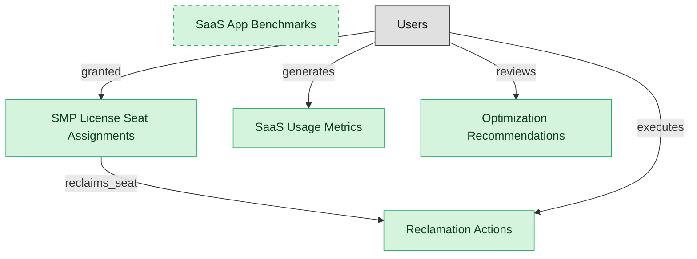

# SMP License Optimization

## 1. Overview

Usage analytics, license rightsizing, reclamation actions, per-app cost benchmarks, and optimization recommendations. The cost-and-utilization substrate of an SMP deployment.

## 2. Entity summary

| Name | data_object | Description |
| --- | --- | --- |
| Optimization Recommendations | `smp_optimization_recommendations` | System-generated rightsizing or consolidation proposal against a SaaS subscription or application. Carries savings_estimate, rationale, recommendation type (downgrade tier, reduce seats, consolidate apps), status. Productiv Recommendations + Zylo Savings Opportunities are the flagship. |
| Reclamation Actions | `smp_reclamation_actions` | Executed reclamation against an smp_license_seat_assignment (revoke, downgrade, reassign) with savings_realized linkage. Tracks the operational payoff of the optimization workflow. BetterCloud License Recovery + Torii Reclaim workflows are the flagship. |
| SaaS App Benchmarks | `smp_app_benchmarks` | Per-app utilization and cost-per-seat benchmark vs an industry peer-set. Snapshot record per measurement period; carries headcount cohort, peer-percentile, and outlier flag. Productiv Benchmarks + Zylo Industry Benchmarks are the flagship. |
| SaaS Usage Metrics | `saas_usage_metrics` | Per-app per-user activity metrics: logins, time-in-app, feature usage, last-active date. The basis for license right-sizing, renewal-tier decisions, and shadow-IT vs sanctioned-app analysis. |
| SMP License Seat Assignments | `smp_license_seat_assignments` | SMP's view of a user-to-app license seat: who holds a seat at which tier, cost-per-seat, utilization signal, last active. Drives reclamation and rightsizing. Correlates with an iga_user_entitlement record (the governance view of the same access fact); the two routinely diverge. |

## 3. Entities catalog

| # | data_object | canonical code | singular | plural | role | mastered in | mastered label | necessity | pattern flags | entity_type | write tier | notes |
| ---: | --- | --- | --- | --- | --- | --- | --- | --- | --- | --- | --- | --- |
| 1 | `smp_optimization_recommendations` | `smp_optimization_recommendations` | Optimization Recommendation | Optimization Recommendations | master | - | - | required | - | operational_workflow | `:manage` | - |
| 2 | `smp_reclamation_actions` | `smp_reclamation_actions` | Reclamation Action | Reclamation Actions | master | - | - | required | - | operational_workflow | `:manage` | - |
| 3 | `smp_app_benchmarks` | `smp_app_benchmarks` | SaaS App Benchmark | SaaS App Benchmarks | master | - | - | optional | - | computed | read-only | - |
| 4 | `saas_usage_metrics` | `saas_usage_metrics` | SaaS Usage Metric | SaaS Usage Metrics | master | - | - | required | - | computed | read-only | - |
| 5 | `smp_license_seat_assignments` | `smp_license_seat_assignments` | SMP License Seat Assignment | SMP License Seat Assignments | master | - | - | required | - | junction | `:manage` | - |

## 4. Aliases and industry synonyms

_(none: no industry-scoped aliases for this scope)_

## 5. Relationships

### 5.1 Intra-scope edges

| from | verb | to | cardinality | kind | necessity | owner_side | delete_mode | fk_format | notes |
| --- | --- | --- | --- | --- | --- | --- | --- | --- | --- |
| `smp_license_seat_assignments` | reclaims_seat | `smp_reclamation_actions` | one_to_one | reference | required | source | restrict | reference | - |

### 5.2 Built-in edges (`users` and other platform built-ins)

| from | verb | to | cardinality | necessity | owner_side | delete_mode | fk_format | notes |
| --- | --- | --- | --- | --- | --- | --- | --- | --- |
| `users` | reviews | `smp_optimization_recommendations` | one_to_many | optional | target | clear | reference | - |
| `users` | executes | `smp_reclamation_actions` | one_to_many | optional | target | clear | reference | - |
| `users` | granted | `smp_license_seat_assignments` | one_to_many | required | target | restrict | reference | - |
| `users` | generates | `saas_usage_metrics` | one_to_many | required | target | restrict | reference | - |

### 5.3 Cross-scope edges

#### 5.3a Outbound from this scope's masters and contributors

_Edges this scope drives: the in-scope endpoint has `role` of `master` or `contributor`._

| from | verb | to | cardinality | necessity | delete_mode | fk_format | notes |
| --- | --- | --- | --- | --- | --- | --- | --- |
| `smp_license_seat_assignments` | correlates_with | `iga_user_entitlements` | one_to_one | optional | none | n/a | - |
| `saas_applications` | recommends_for_app | `smp_optimization_recommendations` | one_to_many | optional | none | n/a | - |
| `saas_subscriptions` | recommends_for_sub | `smp_optimization_recommendations` | one_to_many | optional | none | n/a | - |
| `saas_applications` | benchmarks_for | `smp_app_benchmarks` | one_to_many | required | none (required-if-present) | n/a | - |
| `saas_applications` | measured_by | `saas_usage_metrics` | one_to_many | required | ⚠ audit: required composed child out of scope | n/a | - |
| `saas_applications` | assigned_via | `smp_license_seat_assignments` | one_to_many | required | ⚠ audit: required composed child out of scope | n/a | - |
| `saas_subscriptions` | grants | `smp_license_seat_assignments` | one_to_many | optional | none | n/a | - |

#### 5.3b Context edges on embedded shells and consumed entities

_Edges the canonical owner drives, shown for context: the in-scope endpoint has `role` of `embedded_master`, `consumer`, or `derived`._

_(none: no context cross-scope edges on this scope's embedded shells or consumed entities)_

## 6. Cross-domain context

### 6.1 Master consumers (other modules / domains that embed this scope's masters)

_(none: no other module embeds this scope's masters; the canonical owners do.)_

### 6.2 Outbound handoffs (events this scope publishes)

_(none: no outbound handoffs whose payload is in this scope)_

### 6.3 Inbound handoffs (events this scope reacts to)

| target module | source domain | source module | trigger_event | transition | payload | integration | friction | description |
| --- | --- | --- | --- | --- | --- | --- | --- | --- |
| SMP-OPTIMIZATION | SMP | SMP-DISCOVERY | `saas_application.deprovisioned` | _(lifecycle)_ | `smp_license_seat_assignments` | lifecycle_progression | low | Deprovisioning an application reclaims all of its license seat assignments. |
| SMP-OPTIMIZATION | SMP | SMP-DISCOVERY | `saas_application.sanctioned` | _(lifecycle)_ | `smp_license_seat_assignments` | lifecycle_progression | low | A sanctioned SaaS application becomes eligible for license seat provisioning and usage metering in the optimization module. |
| SMP-OPTIMIZATION | SMP | SMP-RENEWAL-VENDOR | `saas_subscription.canceled` | `active` → `canceled` _(lifecycle)_ | `smp_reclamation_actions` | lifecycle_progression | low | Canceling a subscription triggers reclamation of its license seats. |
| SMP-OPTIMIZATION | SMP | SMP-AUTOMATION | `smp_app_request.fulfilled` | _(lifecycle)_ | `smp_license_seat_assignments` | lifecycle_progression | low | Fulfilling a self-service app request provisions a license seat assignment. |

### 6.4 Master providers (modules / domains that own masters this scope embeds)

_(none: this scope embeds no masters owned elsewhere; every entity is mastered here)_

## 7. Lifecycle states

### `smp_license_seat_assignments` (SMP License Seat Assignment)

| order | state_name | initial? | terminal? | requires_permission? | derived gate | description |
| --- | --- | --- | --- | --- | --- | --- |
| 10 | `provisioned` | ✓ | - | - | - | User has been granted access to the SaaS app via SSO or direct provisioning. |
| 20 | `active` | - | - | - | - | User is actively using the app per usage telemetry. |
| 30 | `idle` | - | - | - | - | User has not used the app within the configured engagement window; reclaim candidate. |
| 40 | `reclaimed` | - | ✓ | ✓ | `smp-optimization:reclaim_seat_assignment` | License returned to the pool. User notified, access revoked. |

### `smp_optimization_recommendations` (Optimization Recommendation)

| order | state_name | initial? | terminal? | requires_permission? | derived gate | description |
| --- | --- | --- | --- | --- | --- | --- |
| 10 | `open` | ✓ | - | - | - | - |
| 20 | `reviewed` | - | - | - | - | - |
| 30 | `accepted` | - | - | ✓ | `smp-optimization:accept_recommendation` | - |
| 40 | `in_progress` | - | - | ✓ | `smp-optimization:start_recommendation` | - |
| 50 | `realized` | - | ✓ | ✓ | `smp-optimization:realize_recommendation` | - |
| 60 | `dismissed` | - | ✓ | ✓ | `smp-optimization:dismiss_recommendation` | - |

### `smp_reclamation_actions` (Reclamation Action)

| order | state_name | initial? | terminal? | requires_permission? | derived gate | description |
| --- | --- | --- | --- | --- | --- | --- |
| 10 | `identified` | ✓ | - | - | - | - |
| 20 | `notified` | - | - | ✓ | `smp-optimization:notify_user_of_reclamation` | - |
| 30 | `grace_period` | - | - | - | - | - |
| 40 | `reclaimed` | - | ✓ | ✓ | `smp-optimization:execute_reclamation` | - |
| 50 | `restored` | - | ✓ | ✓ | `smp-optimization:restore_reclamation` | - |
| 60 | `canceled` | - | ✓ | ✓ | `smp-optimization:cancel_reclamation` | - |

## 8. Permissions and business rules (derived)

### 8.1 Permissions

| permission | tier | description | included in `:admin`? |
| --- | --- | --- | --- |
| `smp-optimization:read` | baseline-read | Read access to every entity in the module | ✓ |
| `smp-optimization:manage` | baseline-manage | Edit operational records | ✓ |
| `smp-optimization:admin` | baseline-admin | Edit reference data and inherit every workflow gate below | - |
| `smp-optimization:reclaim_seat_assignment` | workflow-gate (lifecycle) | Transition `smp_license_seat_assignments` into state `reclaimed` | ✓ |
| `smp-optimization:accept_recommendation` | workflow-gate (lifecycle) | Transition `smp_optimization_recommendations` into state `accepted` | ✓ |
| `smp-optimization:start_recommendation` | workflow-gate (lifecycle) | Transition `smp_optimization_recommendations` into state `in_progress` | ✓ |
| `smp-optimization:realize_recommendation` | workflow-gate (lifecycle) | Transition `smp_optimization_recommendations` into state `realized` | ✓ |
| `smp-optimization:dismiss_recommendation` | workflow-gate (lifecycle) | Transition `smp_optimization_recommendations` into state `dismissed` | ✓ |
| `smp-optimization:notify_user_of_reclamation` | workflow-gate (lifecycle) | Transition `smp_reclamation_actions` into state `notified` | ✓ |
| `smp-optimization:execute_reclamation` | workflow-gate (lifecycle) | Transition `smp_reclamation_actions` into state `reclaimed` | ✓ |
| `smp-optimization:restore_reclamation` | workflow-gate (lifecycle) | Transition `smp_reclamation_actions` into state `restored` | ✓ |
| `smp-optimization:cancel_reclamation` | workflow-gate (lifecycle) | Transition `smp_reclamation_actions` into state `canceled` | ✓ |

### 8.2 Business rules

_(none: no flag-derived business rules)_

## 9. Roles, RACI, and responsibilities (derived)

_Baseline roles, the permission hierarchy, and RACI realization are DERIVED from this scope's entity-type write tiers + `process_raci`; none of it is stored in the catalog (the deployer provisions it from this blueprint)._

### 9.1 `SMP-OPTIMIZATION`

**Baseline roles:**

| role | baseline grant |
| --- | --- |
| `smp-optimization_viewer` | `smp-optimization:read` |
| `smp-optimization_manager` | `smp-optimization:manage` |

**Permission hierarchy:**

| permission | includes |
| --- | --- |
| `smp-optimization:admin` | `smp-optimization:manage` |
| `smp-optimization:manage` | `smp-optimization:read` |
| `smp-optimization:admin` | `smp-optimization:reclaim_seat_assignment` |
| `smp-optimization:admin` | `smp-optimization:accept_recommendation` |
| `smp-optimization:admin` | `smp-optimization:start_recommendation` |
| `smp-optimization:admin` | `smp-optimization:realize_recommendation` |
| `smp-optimization:admin` | `smp-optimization:dismiss_recommendation` |
| `smp-optimization:admin` | `smp-optimization:notify_user_of_reclamation` |
| `smp-optimization:admin` | `smp-optimization:execute_reclamation` |
| `smp-optimization:admin` | `smp-optimization:restore_reclamation` |
| `smp-optimization:admin` | `smp-optimization:cancel_reclamation` |

**Processes wired:**

| process_key | process_name | PCF code | PCF ID | level | description |
| --- | --- | --- | --- | --- | --- |
| `optimize_it_resource_allocation` | Optimize IT resource allocation | 8.2.5.6 | 20688 | 4 | Create process to assign and manage IT assets that support organization's strategic goals. |

**RACI realization:**

| actor | kind | raci | process_key | realization |
| --- | --- | --- | --- | --- |
| `ITAM-SAAS-PORTFOLIO-MANAGER` | persona | responsible | `optimize_it_resource_allocation` | grant gates [smp-optimization:reclaim_seat_assignment, smp-optimization:accept_recommendation, smp-optimization:start_recommendation, smp-optimization:realize_recommendation, smp-optimization:dismiss_recommendation, smp-optimization:notify_user_of_reclamation, smp-optimization:execute_reclamation, smp-optimization:restore_reclamation, smp-optimization:cancel_reclamation] + the gated entities' write tier |
| `ITAM-SAAS-PORTFOLIO-MANAGER` | persona | accountable | `optimize_it_resource_allocation` | approval gate |

### 9.2 Functional ownership and default grants

| responsibility | business function | default role | default tier |
| --- | --- | --- | --- |
| owner | IT Asset Management | `admin` | `:admin` |
| contributor | Finance | `manage` | `:manage` |
| contributor | Procurement | `manage` | `:manage` |
