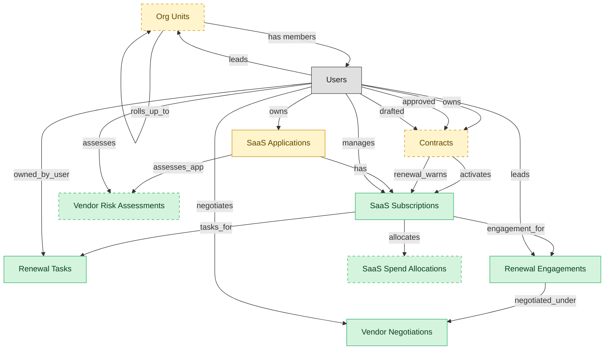

# SMP Renewal and Vendor Management

## 1. Overview

Renewal pipeline tracking, vendor relationship management, contract coordination with procurement and legal, spend allocation, and per-SaaS vendor-risk attestation. The commercial layer of an SMP deployment.

## 2. Entity summary

| Name | data_object | Description |
| --- | --- | --- |
| Renewal Engagements | `smp_renewal_engagements` | Per-renewal-cycle envelopes covering timeline, owner, vendor proposals received, fallback notes, and decisions taken. |
| Renewal Tasks | `smp_renewal_tasks` | Tasks within a SaaS renewal cycle, such as the renewal-window notice, owner assignment, and the renew-or-cancel decision. |
| SaaS Spend Allocations | `smp_spend_allocations` | Chargeback splits of a SaaS subscription across cost centers, business units, or projects, with the allocation method and effective window. |
| SaaS Subscriptions | `saas_subscriptions` | Contractual subscriptions for SaaS apps: plan tier, seat count, recurring cost, billing cadence, renewal date, and owner. |
| Vendor Negotiations | `smp_vendor_negotiations` | Quote, counter-quote, and discount records tied to a renewal, documenting how the final commercial terms were reached. |
| Vendor Risk Assessments | `smp_vendor_risk_assessments` | SaaS vendor risk scorecards covering attestation status, data-processing review, subprocessors, breach history, and posture score. |
| Contracts | `legal_contracts` | Contracts with counterparties or suppliers, covering type, value, key dates, governing law, and lifecycle from draft to terminated. |
| Org Units | `org_units` | Nodes in the organizational hierarchy such as divisions, departments, and teams, with manager, cost center alignment, geographic scope, and parent-child links. |
| SaaS Applications | `saas_applications` | SaaS applications in the company portfolio, with vendor, category, criticality, owner, and whether each is sanctioned or shadow IT. |

## 3. Entities catalog

| # | data_object | canonical code | singular | plural | role | mastered in | mastered label | necessity | pattern flags | entity_type | write tier | notes |
| ---: | --- | --- | --- | --- | --- | --- | --- | --- | --- | --- | --- | --- |
| 1 | `smp_renewal_engagements` | `smp_renewal_engagements` | Renewal Engagement | Renewal Engagements | master | - | - | required | - | operational_workflow | `:manage` | - |
| 2 | `smp_renewal_tasks` | `smp_renewal_tasks` | Renewal Task | Renewal Tasks | master | - | - | required | - | operational_workflow | `:manage` | - |
| 3 | `smp_spend_allocations` | `smp_spend_allocations` | SaaS Spend Allocation | SaaS Spend Allocations | master | - | - | optional | - | operational_workflow | `:manage` | - |
| 4 | `saas_subscriptions` | `saas_subscriptions` | SaaS Subscription | SaaS Subscriptions | master | - | - | required | - | operational_workflow | `:manage` | - |
| 5 | `smp_vendor_negotiations` | `smp_vendor_negotiations` | Vendor Negotiation | Vendor Negotiations | master | - | - | required | - | operational_workflow | `:manage` | - |
| 6 | `smp_vendor_risk_assessments` | `smp_vendor_risk_assessments` | Vendor Risk Assessment | Vendor Risk Assessments | master | - | - | optional | - | operational_workflow | `:manage` | - |
| 7 | `legal_contracts` | `legal_contracts` | Contract | Contracts | embedded_master | `clm-repository` | Contract Repository | optional | personal_content, submit_lock | operational_workflow | `:manage` | - |
| 8 | `org_units` | `org_units` | Org Unit | Org Units | embedded_master | `hcm-org-positions` | Organization and Position Management | optional | - | operational_workflow | `:manage` | - |
| 9 | `saas_applications` | `saas_applications` | SaaS Application | SaaS Applications | embedded_master | `smp-discovery` | SMP Discovery and Catalog | required | - | operational_workflow | `:manage` | - |

## 4. Aliases and industry synonyms

_(none: no industry-scoped aliases for this scope)_

## 5. Relationships

### 5.1 Intra-scope edges

| from | verb | to | cardinality | kind | necessity | owner_side | delete_mode | fk_format | notes |
| --- | --- | --- | --- | --- | --- | --- | --- | --- | --- |
| `saas_subscriptions` | tasks_for | `smp_renewal_tasks` | one_to_many | reference | required | target | restrict | reference | - |
| `saas_subscriptions` | engagement_for | `smp_renewal_engagements` | one_to_many | reference | required | target | restrict | reference | - |
| `smp_renewal_engagements` | negotiated_under | `smp_vendor_negotiations` | one_to_many | composition | required | target | cascade | parent | - |
| `saas_subscriptions` | allocates | `smp_spend_allocations` | one_to_many | reference | required | target | restrict | reference | - |
| `saas_applications` | assesses_app | `smp_vendor_risk_assessments` | one_to_many | reference | required | target | restrict | reference | - |
| `legal_contracts` | activates | `saas_subscriptions` | one_to_many | reference | optional | source | clear | reference | - |
| `legal_contracts` | renewal_warns | `saas_subscriptions` | one_to_many | reference | optional | source | clear | reference | - |
| `saas_applications` | has | `saas_subscriptions` | one_to_many | reference | optional | source | clear | reference | - |
| `org_units` | rolls_up_to | `org_units` | one_to_many | reference | optional | source | clear | reference | - |

### 5.2 Built-in edges (`users` and other platform built-ins)

| from | verb | to | cardinality | necessity | owner_side | delete_mode | fk_format | notes |
| --- | --- | --- | --- | --- | --- | --- | --- | --- |
| `users` | owned_by_user | `smp_renewal_tasks` | one_to_many | required | target | restrict | reference | - |
| `users` | leads | `smp_renewal_engagements` | one_to_many | required | target | restrict | reference | - |
| `users` | negotiates | `smp_vendor_negotiations` | one_to_many | required | target | restrict | reference | - |
| `users` | assesses | `smp_vendor_risk_assessments` | one_to_many | required | target | restrict | reference | - |
| `users` | owns | `legal_contracts` | one_to_many | optional | source | clear | reference | - |
| `users` | approved | `legal_contracts` | one_to_many | optional | source | clear | reference | - |
| `users` | drafted | `legal_contracts` | one_to_many | optional | source | clear | reference | - |
| `users` | leads | `org_units` | one_to_many | optional | source | clear | reference | - |
| `users` | owns | `saas_applications` | one_to_many | required | target | restrict | reference | - |
| `users` | manages | `saas_subscriptions` | one_to_many | required | target | restrict | reference | - |
| `org_units` | has members | `users` | one_to_many | optional | target | clear | reference | - |

### 5.3 Cross-scope edges

#### 5.3a Outbound from this scope's masters and contributors

_Edges this scope drives: the in-scope endpoint has `role` of `master` or `contributor`._

| from | verb | to | cardinality | necessity | delete_mode | fk_format | notes |
| --- | --- | --- | --- | --- | --- | --- | --- |
| `saas_subscriptions` | recommends_for_sub | `smp_optimization_recommendations` | one_to_many | optional | none | n/a | - |
| `saas_subscriptions` | charged to subscription | `expense_lines` | one_to_many | optional | none | n/a | - |
| `saas_subscriptions` | grants | `smp_license_seat_assignments` | one_to_many | optional | none | n/a | - |
| `enterprise_applications` | is delivered via | `saas_subscriptions` | one_to_many | optional | none | n/a | - |

#### 5.3b Context edges on embedded shells and consumed entities

_Edges the canonical owner drives, shown for context: the in-scope endpoint has `role` of `embedded_master`, `consumer`, or `derived`._

| from | verb | to | cardinality | necessity | delete_mode | fk_format | notes |
| --- | --- | --- | --- | --- | --- | --- | --- |
| `enterprise_applications` | aliased_as | `saas_applications` | one_to_one | optional | none | n/a | - |
| `saas_applications` | lifecycle events for | `asset_lifecycle_events` | one_to_many | optional | none | n/a | - |
| `asset_contracts` | covers | `saas_applications` | many_to_many | optional | none | n/a | - |
| `in_house_legal_matters` | references | `legal_contracts` | many_to_many | optional | none | n/a | - |
| `legal_contracts` | governs | `customer_entitlements` | one_to_many | optional | none | n/a | - |
| `legal_contracts` | backs | `customer_subscriptions` | one_to_many | optional | none | n/a | - |
| `saas_applications` | entitles_to | `iga_user_entitlements` | one_to_many | required | none (required-if-present) | n/a | - |
| `saas_applications` | owns | `smp_app_owners` | many_to_many | required | none (required-if-present) | n/a | - |
| `saas_applications` | integrates_with | `smp_app_integrations` | one_to_many | required | none (required-if-present) | n/a | - |
| `saas_applications` | publishes | `smp_app_catalog_listings` | one_to_one | required | none (required-if-present) | n/a | - |
| `saas_applications` | raised_for | `smp_alerts` | one_to_many | optional | none | n/a | - |
| `saas_applications` | tracks_stage | `smp_app_lifecycle_stages` | one_to_one | required | none (required-if-present) | n/a | - |
| `saas_applications` | recommends_for_app | `smp_optimization_recommendations` | one_to_many | optional | none | n/a | - |
| `saas_applications` | benchmarks_for | `smp_app_benchmarks` | one_to_many | required | none (required-if-present) | n/a | - |
| `saas_applications` | automates_app | `smp_automation_workflows` | one_to_many | optional | none | n/a | - |
| `contract_templates` | seeds | `legal_contracts` | one_to_many | optional | none | n/a | - |
| `legal_contracts` | contains | `contract_clauses` | one_to_many | optional | none | n/a | - |
| `legal_contracts` | imposes | `contract_obligations` | one_to_many | required | ⚠ audit: required composed child out of scope | n/a | - |
| `legal_contracts` | witnessed_by | `signature_records` | one_to_many | required | ⚠ audit: required composed child out of scope | n/a | - |
| `legal_contracts` | activates | `software_licenses` | one_to_many | optional | none | n/a | - |
| `sourcing_events` | originates | `legal_contracts` | one_to_many | optional | none | n/a | - |
| `legal_contracts` | triggers_creation_of | `purchase_orders` | one_to_many | optional | none | n/a | - |
| `legal_contracts` | triggers_review_in | `purchase_requisitions` | one_to_many | optional | none | n/a | - |
| `legal_contracts` | propagates_terms_to | `invoice_matches` | one_to_many | optional | none | n/a | - |
| `legal_contracts` | feeds_revrec_in | `revenue_recognition_records` | one_to_many | optional | none | n/a | - |
| `legal_contracts` | seeds | `service_projects` | one_to_many | optional | none | n/a | - |
| `legal_contracts` | renewal_warns | `crm_opportunities` | one_to_many | optional | none | n/a | - |
| `org_units` | groups | `employees` | one_to_many | required | none (required-if-present) | n/a | - |
| `org_units` | contains | `hcm_positions` | one_to_many | required | none (required-if-present) | n/a | - |
| `cost_centers` | funds | `org_units` | one_to_many | required | none (required-if-present) | n/a | - |
| `org_units` | engages | `contingent_workers` | one_to_many | optional | none | n/a | - |
| `org_units` | is_scored_by | `engagement_drivers` | one_to_many | optional | none | n/a | - |
| `org_units` | is_measured_by | `people_kpis` | one_to_many | optional | none | n/a | - |
| `org_units` | triggers | `iga_entitlement_definitions` | one_to_many | optional | none | n/a | - |
| `org_units` | maps_to | `cost_centers` | one_to_one | optional | none | n/a | - |
| `org_units` | sponsors | `compliance_assignments` | one_to_many | optional | none | n/a | - |
| `org_units` | sponsors | `benefit_plans` | many_to_many | optional | none | n/a | - |
| `survey_campaigns` | targets | `org_units` | many_to_many | optional | none | n/a | - |
| `org_units` | owns | `action_plans` | one_to_many | optional | none | n/a | - |
| `legal_contracts` | renewed_into | `customer_subscriptions` | one_to_many | optional | none | n/a | - |
| `legal_contracts` | seeds | `agency_jobs` | one_to_many | optional | none | n/a | - |
| `crm_opportunities` | drafts | `legal_contracts` | one_to_many | optional | none | n/a | - |
| `sales_quotes` | drafts | `legal_contracts` | one_to_many | optional | none | n/a | - |
| `contract_drafts` | drafts | `legal_contracts` | one_to_many | optional | none | n/a | - |
| `quote_discounts` | flows into | `legal_contracts` | one_to_many | optional | none | n/a | - |
| `commercial_leases` | flows into | `legal_contracts` | one_to_many | optional | none | n/a | - |
| `engagement_letters` | flows into | `legal_contracts` | one_to_many | optional | none | n/a | - |
| `saas_applications` | measured_by | `saas_usage_metrics` | one_to_many | required | ⚠ audit: required composed child out of scope | n/a | - |
| `saas_applications` | assigned_via | `smp_license_seat_assignments` | one_to_many | required | ⚠ audit: required composed child out of scope | n/a | - |
| `shadow_it_apps` | promotes_to | `saas_applications` | one_to_one | optional | none | n/a | - |
| `saas_applications` | is registered as | `enterprise_applications` | one_to_one | optional | none | n/a | - |
| `legal_contracts` | is amended by | `contract_amendments` | one_to_many | optional | none | n/a | - |
| `legal_contracts` | is renewed by | `contract_renewal_records` | one_to_many | optional | none | n/a | - |
| `legal_contracts` | is assessed by | `contract_risk_assessments` | one_to_many | optional | none | n/a | - |
| `contract_counterparties` | is party to | `legal_contracts` | one_to_many | optional | none | n/a | - |
| `legal_contracts` | has milestone | `contract_milestones` | one_to_many | optional | none | n/a | - |
| `legal_contracts` | has data protection addendum | `data_protection_addenda` | one_to_many | optional | none | n/a | - |
| `legal_contracts` | is negotiated in | `contract_negotiation_threads` | one_to_many | optional | none | n/a | - |
| `saas_applications` | raises_incident | `service_incidents` | one_to_many | optional | none | n/a | - |

## 6. Cross-domain context

### 6.1 Master consumers (other modules / domains that embed this scope's masters)

| data_object | other module / domain | role | necessity | notes |
| --- | --- | --- | --- | --- |
| `saas_subscriptions` | EXPENSE-CAPTURE-AND-REPORTING (Expense Capture and Reporting) - EXPENSE | consumer | required | - |
| `saas_subscriptions` | IT-OPS-STARTER (IT Operations Starter) - IT-OPS-STARTER | embedded_master | required | - |

### 6.2 Outbound handoffs (events this scope publishes)

| source module | target domain | target module | trigger_event | transition | payload | integration | friction | description |
| --- | --- | --- | --- | --- | --- | --- | --- | --- |
| CLM-REPOSITORY | CLM | CLM-OBLIGATION-MGMT | `legal_contract.signed` | `signed` _(lifecycle)_ | `legal_contracts` | lifecycle_progression | low | - |
| CLM-REPOSITORY | CLM | CLM-RENEWAL | `legal_contract.active` | _(state_change)_ | `legal_contracts` | lifecycle_progression | low | - |
| SMP-RENEWAL-VENDOR | CLM | CLM-REPOSITORY | `renewal.30_day_warning` | _(threshold)_ | `legal_contracts` | api_call | low | SMP's renewal-watch surfaces a 30-day expiry warning to CLM so the contract document workflow (amendment, renegotiation) can start in time. |
| CLM-REPOSITORY | S2P | _(domain-level)_ | `legal_contract.expired` | `active` → `expired` _(lifecycle)_ | `legal_contracts` | batch_sync | medium | Expired contracts trigger procurement renewal-decision workflow. Failure modes: auto-renewal clauses missed; silent expiry of long-tail contracts. |
| CLM-REPOSITORY | AP-AUTO | _(domain-level)_ | `legal_contract.amended` | `amended` _(state_change)_ | `legal_contracts` | api_call | medium | Contract amendments propagate to AP-AUTO: updated payment terms, discount schedule, GL coding. Failure modes: retroactive amendments require recalculating already-paid invoices. |
| HCM-ORG-POSITIONS | IGA | IGA-ACCESS-REQUEST | `org_unit.created` | _(state_change)_ | `org_units` | event_stream | medium | New org unit drives IGA group/role provisioning. Group-name conventions and ownership must be encoded; otherwise orphan groups proliferate. |
| HCM-ORG-POSITIONS | IGA | IGA-ACCESS-REQUEST | `org_unit.disbanded` | _(state_change)_ | `org_units` | event_stream | high | Org-unit disbandment requires IGA group cleanup; orphan-group risk if employees re-assigned slowly. |
| HCM-ORG-POSITIONS | IGA | IGA-ACCESS-REQUEST | `org_unit.merged` | _(state_change)_ | `org_units` | event_stream | high | Org-unit merge consolidates IGA groups: members migrate, entitlements deduplicated, SoD revalidated. Often runs as a batch project rather than event. |
| SMP-DISCOVERY | IGA | IGA-ENTITLEMENT-CATALOG | `saas_application.discovered` | _(lifecycle)_ | `saas_applications` | event_stream | medium | Newly discovered SaaS apps surface to IGA for shadow-IT visibility and access governance. |
| SMP-DISCOVERY | IGA | IGA-ENTITLEMENT-CATALOG | `saas_application.sanctioned` | _(lifecycle)_ | `saas_applications` | api_call | low | Sanctioned SaaS apps are wired into IGA provisioning catalog. |
| SMP-DISCOVERY | FINOPS | _(domain-level)_ | `saas_application.sanctioned` | _(lifecycle)_ | `saas_applications` | event_stream | medium | Sanctioned SaaS apps come under FINOPS spend tracking. |
| HCM-ORG-POSITIONS | HCM | HCM-CORE-WORKER | `org_unit.disbanded` | _(state_change)_ | `org_units` | lifecycle_progression | high | Disbanded org unit requires every incumbent employee to be re-placed before close; worker-record module blocks the close until reassignment completes. |
| HCM-ORG-POSITIONS | HCM | HCM-CORE-WORKER | `org_unit.merged` | _(state_change)_ | `org_units` | lifecycle_progression | medium | Org-unit consolidation cascades employee re-assignment, manager and dotted-line reassignment, and reporting-line recompute on the worker record. |
| HCM-ORG-POSITIONS | ATS | ATS-RECRUITMENT-PIPELINE | `org_unit.activated` | _(state_change)_ | `org_units` | api_call | low | - |
| HCM-ORG-POSITIONS | ATS | ATS-RECRUITMENT-PIPELINE | `org_unit.closed` | _(state_change)_ | `org_units` | api_call | high | - |
| HCM-ORG-POSITIONS | ATS | ATS-RECRUITMENT-PIPELINE | `org_unit.created` | _(state_change)_ | `org_units` | api_call | medium | - |
| HCM-ORG-POSITIONS | ATS | ATS-RECRUITMENT-PIPELINE | `org_unit.disbanded` | _(state_change)_ | `org_units` | api_call | high | - |
| HCM-ORG-POSITIONS | ATS | ATS-RECRUITMENT-PIPELINE | `org_unit.merged` | _(state_change)_ | `org_units` | api_call | high | - |
| HCM-ORG-POSITIONS | ATS | ATS-RECRUITMENT-PIPELINE | `org_unit.reorganized` | _(state_change)_ | `org_units` | api_call | high | - |
| CLM-REPOSITORY | FIN | _(domain-level)_ | `legal_contract.signed` | `signed` _(lifecycle)_ | `legal_contracts` | api_call | medium | Signed contract feeds ERP-FIN payment terms and rev-rec rules. Friction in extracting structured terms from contract text. |
| HCM-ORG-POSITIONS | FIN | _(domain-level)_ | `org_unit.created` | _(state_change)_ | `org_units` | api_call | medium | New org unit usually maps to cost-center; ERP-FIN must reflect the structure for budgeting and labor allocation. |
| CLM-REPOSITORY | PSA | PSA-PROJECT-DELIVERY | `legal_contract.signed` | `signed` _(lifecycle)_ | `legal_contracts` | api_call | medium | Signed SOW seeds PSA project scope, billing terms, and milestone schedule. Deviations between contract terms and operational project structure require manual reconciliation. |
| CLM-REPOSITORY | SUB-MGMT | _(domain-level)_ | `legal_contract.signed` | `signed` _(lifecycle)_ | `legal_contracts` | api_call | medium | Signed contract triggers SUB-MGMT to activate the subscription record. |

### 6.3 Inbound handoffs (events this scope reacts to)

| target module | source domain | source module | trigger_event | transition | payload | integration | friction | description |
| --- | --- | --- | --- | --- | --- | --- | --- | --- |
| CLM-REPOSITORY | CLM | CLM-NEGOTIATION | `legal_contract.approved` | _(state_change)_ | `legal_contracts` | lifecycle_progression | low | - |
| CLM-REPOSITORY | CLM | CLM-RENEWAL | `legal_contract.renewed` | _(state_change)_ | `legal_contracts` | lifecycle_progression | low | - |
| CLM-REPOSITORY | S2P | _(domain-level)_ | `sourcing.contract_drafted` | _(state_change)_ | `legal_contracts` | api_call | medium | Sourcing decision in S2P hands off to CLM to author the contract. Friction sits in clause selection, redline coordination with the counterparty, and the legal-review loop with LSD. |
| CLM-REPOSITORY | CPQ | CPQ-QUOTE-BUILDER | `quote.accepted` | `accepted` _(state_change)_ | `legal_contracts` | api_call | medium | Accepted quote hands off to CLM for contract authoring - pulls in clause language, populates the agreed terms, routes for signature. |
| CLM-REPOSITORY | AGENCY-MGMT | AGENCY-MGMT-JOB-TRAFFIC | `estimate.approved` | `pending` → `approved` _(lifecycle)_ | `legal_contracts` | api_call | medium | Client-approved estimate must be converted into a signed SOW in CLM before delivery can start. Includes line-item scope, billing terms, deliverable schedule, and approval routing. |
| SMP-RENEWAL-VENDOR | APM | APM-PORTFOLIO-REGISTRY | `application.lifecycle_state_changed` | `any` → `any` _(state_change)_ | `saas_subscriptions` | api_call | high | When APM marks an application for elimination or retirement (TIME 'Eliminate'), SMP cancels the corresponding SaaS subscription(s) to stop the spend and triggers deprovisioning. High friction: the portfolio-level decision must reconcile to the specific SaaS subscription(s) to cancel, and the cancellation must complete or the org keeps paying for a retired app. |
| SMP-RENEWAL-VENDOR | CLM | CLM-REPOSITORY | `legal_contract.renewed` | _(state_change)_ | `saas_subscriptions` | api_call | low | Renewed SaaS contract in CLM updates the corresponding subscription in SMP with new term, new seat count, new pricing. |
| SMP-RENEWAL-VENDOR | S2P | _(domain-level)_ | `po.saas_subscription_created` | _(state_change)_ | `saas_subscriptions` | event_stream | medium | PO for a SaaS subscription creates the corresponding subscription record in SMP. Friction sits in matching the PO line items to a known SaaS app in the SMP catalog; new vendors require manual creation. |
| SMP-RENEWAL-VENDOR | SMP | SMP-OPTIMIZATION | `smp_optimization_recommendation.generated` | _(signal)_ | `smp_renewal_engagements` | lifecycle_progression | low | A rightsizing or downgrade recommendation feeds the renewal engagement decision. |

### 6.4 Master providers (modules / domains that own masters this scope embeds)

| data_object | role here | necessity | canonical owner(s) | slice notes |
| --- | --- | --- | --- | --- |
| `legal_contracts` | embedded_master | optional | CLM-REPOSITORY (CLM) | - |
| `org_units` | embedded_master | optional | HCM-ORG-POSITIONS (HCM) | - |
| `saas_applications` | embedded_master | required | SMP-DISCOVERY (SMP) | - |

## 7. Lifecycle states

### `legal_contracts` (Contract)

_This scope holds `legal_contracts` as **embedded_master**; the canonical state machine is owned by `CLM-REPOSITORY`._

| order | state_name | initial? | terminal? | requires_permission? | derived gate | description |
| --- | --- | --- | --- | --- | --- | --- |
| 10 | `draft` | ✓ | - | - | - | Initial draft created in CLM-AUTHORING from a template, or received via inbound handoff from CPQ/sourcing. |
| 20 | `in_review` | - | - | - | - | Draft has been routed for internal review prior to counterparty exchange. |
| 30 | `in_negotiation` | - | - | - | - | Active counterparty negotiation with track-changes / redline exchange. |
| 40 | `approved` | - | - | ✓ | `smp-renewal-vendor:approve_legal_contract` | Final negotiated text approved by all internal stakeholders; ready for signature. |
| 50 | `out_for_signature` | - | - | - | - | Signature envelope dispatched to all required signers. |
| 60 | `signed` | - | - | ✓ | `smp-renewal-vendor:execute_legal_contract` | All signers have signed; contract is fully executed. |
| 70 | `active` | - | - | - | - | Effective date has passed; contract is in force. Default post-signature state. |
| 75 | `amended` | - | - | ✓ | `smp-renewal-vendor:amend_legal_contract` | An amendment has been executed against this contract. Amendment is a separate record; this contract row reflects the amended terms going forward. |
| 80 | `expired` | - | ✓ | - | - | End date passed without renewal or termination. Terminal state. |
| 90 | `terminated` | - | ✓ | ✓ | `smp-renewal-vendor:terminate_legal_contract` | Contract terminated before end date (by mutual consent, breach, or for-cause). Terminal state. |
| 100 | `renewed` | - | ✓ | ✓ | `smp-renewal-vendor:renew_legal_contract` | Renewed via a new contract record (or extended via amendment). The renewal is a separate record; this row is terminal. |

### `org_units` (Org Unit)

_This scope holds `org_units` as **embedded_master**; the canonical state machine is owned by `HCM-ORG-POSITIONS`._

| order | state_name | initial? | terminal? | requires_permission? | derived gate | description |
| --- | --- | --- | --- | --- | --- | --- |
| 1 | `draft` | ✓ | - | - | - | Org unit defined as part of a future structure; not yet operational. |
| 2 | `active` | - | - | ✓ | `smp-renewal-vendor:active_org_unit` | Operational unit; carries headcount, cost-center linkage, and reporting lines. |
| 3 | `reorganized` | - | ✓ | ✓ | `smp-renewal-vendor:reorganized_org_unit` | Unit folded into or replaced by a new structure; references remain for history. |
| 4 | `closed` | - | ✓ | ✓ | `smp-renewal-vendor:closed_org_unit` | Unit dissolved; no employees or positions reside in it. |

### `saas_applications` (SaaS Application)

_This scope holds `saas_applications` as **embedded_master**; the canonical state machine is owned by `SMP-DISCOVERY`._

| order | state_name | initial? | terminal? | requires_permission? | derived gate | description |
| --- | --- | --- | --- | --- | --- | --- |
| 10 | `discovered` | ✓ | - | - | - | App detected via SSO logs, expense data, or browser plugin. Not yet reviewed by IT. |
| 20 | `triaged` | - | - | - | - | App has been reviewed by IT but no sanction decision recorded yet. |
| 30 | `sanctioned` | - | - | ✓ | `smp-renewal-vendor:sanction_application` | App is officially supported; IGA provisioning, FINOPS spend tracking, and ITAM registration activated. |
| 40 | `deprecated` | - | - | ✓ | `smp-renewal-vendor:deprecate_application` | Slated for replacement or removal; no new assignments allowed; existing users on read-only or sunset path. |
| 50 | `deprovisioned` | - | ✓ | ✓ | `smp-renewal-vendor:deprovision_application` | App removed tenant-wide. ITSM closes related tickets; IGA revokes access; FINOPS terminates spend. |

### `saas_subscriptions` (SaaS Subscription)

| order | state_name | initial? | terminal? | requires_permission? | derived gate | description |
| --- | --- | --- | --- | --- | --- | --- |
| 10 | `draft` | ✓ | - | - | - | Subscription record created during procurement; terms not yet finalized. |
| 20 | `active` | - | - | - | - | Contract executed; license consumption underway. |
| 30 | `renewing` | - | - | ✓ | `smp-renewal-vendor:initiate_renewal` | Within the renewal window (typically 90 days pre-expiry). Quantity and tier negotiation in progress. |
| 40 | `renewed` | - | ✓ | ✓ | `smp-renewal-vendor:approve_renewal` | Renewal executed; a new active term started. |
| 50 | `canceled` | - | ✓ | ✓ | `smp-renewal-vendor:cancel_subscription` | Subscription terminated; deprovisioning workflow triggered. |

### `smp_renewal_engagements` (Renewal Engagement)

| order | state_name | initial? | terminal? | requires_permission? | derived gate | description |
| --- | --- | --- | --- | --- | --- | --- |
| 10 | `scheduled` | ✓ | - | - | - | - |
| 20 | `discovery` | - | - | - | - | - |
| 30 | `negotiation` | - | - | ✓ | `smp-renewal-vendor:begin_negotiation` | - |
| 40 | `decision` | - | - | ✓ | `smp-renewal-vendor:decide_renewal` | - |
| 50 | `executed` | - | - | ✓ | `smp-renewal-vendor:execute_renewal` | - |
| 60 | `closed` | - | ✓ | - | - | - |

### `smp_renewal_tasks` (Renewal Task)

| order | state_name | initial? | terminal? | requires_permission? | derived gate | description |
| --- | --- | --- | --- | --- | --- | --- |
| 10 | `open` | ✓ | - | - | - | - |
| 20 | `in_progress` | - | - | ✓ | `smp-renewal-vendor:start_renewal_task` | - |
| 30 | `blocked` | - | - | - | - | - |
| 40 | `done` | - | ✓ | ✓ | `smp-renewal-vendor:complete_renewal_task` | - |
| 50 | `canceled` | - | ✓ | ✓ | `smp-renewal-vendor:cancel_renewal_task` | - |

### `smp_spend_allocations` (SaaS Spend Allocation)

| order | state_name | initial? | terminal? | requires_permission? | derived gate | description |
| --- | --- | --- | --- | --- | --- | --- |
| 10 | `draft` | ✓ | - | - | - | - |
| 20 | `active` | - | - | ✓ | `smp-renewal-vendor:activate_allocation` | - |
| 30 | `adjusted` | - | - | - | - | - |
| 40 | `closed` | - | ✓ | ✓ | `smp-renewal-vendor:close_allocation` | - |

### `smp_vendor_negotiations` (Vendor Negotiation)

| order | state_name | initial? | terminal? | requires_permission? | derived gate | description |
| --- | --- | --- | --- | --- | --- | --- |
| 10 | `opened` | ✓ | - | - | - | - |
| 20 | `counter_offered` | - | - | - | - | - |
| 30 | `at_impasse` | - | - | - | - | - |
| 40 | `agreed` | - | ✓ | ✓ | `smp-renewal-vendor:agree_negotiation` | - |
| 50 | `abandoned` | - | ✓ | ✓ | `smp-renewal-vendor:abandon_negotiation` | - |

### `smp_vendor_risk_assessments` (Vendor Risk Assessment)

| order | state_name | initial? | terminal? | requires_permission? | derived gate | description |
| --- | --- | --- | --- | --- | --- | --- |
| 10 | `scoped` | ✓ | - | - | - | - |
| 20 | `in_review` | - | - | ✓ | `smp-renewal-vendor:start_risk_review` | - |
| 30 | `information_requested` | - | - | - | - | - |
| 40 | `completed` | - | - | ✓ | `smp-renewal-vendor:complete_risk_review` | - |
| 50 | `expired` | - | ✓ | - | - | - |
| 60 | `remediation_required` | - | - | ✓ | `smp-renewal-vendor:flag_remediation` | - |

## 8. Permissions and business rules (derived)

### 8.1 Permissions

| permission | tier | description | included in `:admin`? |
| --- | --- | --- | --- |
| `smp-renewal-vendor:read` | baseline-read | Read access to every entity in the module | ✓ |
| `smp-renewal-vendor:manage` | baseline-manage | Edit operational records | ✓ |
| `smp-renewal-vendor:admin` | baseline-admin | Edit reference data and inherit every workflow gate below | - |
| `smp-renewal-vendor:active_org_unit` | workflow-gate (lifecycle) | Transition `org_units` into state `active` | ✓ |
| `smp-renewal-vendor:reorganized_org_unit` | workflow-gate (lifecycle) | Transition `org_units` into state `reorganized` | ✓ |
| `smp-renewal-vendor:closed_org_unit` | workflow-gate (lifecycle) | Transition `org_units` into state `closed` | ✓ |
| `smp-renewal-vendor:sanction_application` | workflow-gate (lifecycle) | Transition `saas_applications` into state `sanctioned` | ✓ |
| `smp-renewal-vendor:deprecate_application` | workflow-gate (lifecycle) | Transition `saas_applications` into state `deprecated` | ✓ |
| `smp-renewal-vendor:deprovision_application` | workflow-gate (lifecycle) | Transition `saas_applications` into state `deprovisioned` | ✓ |
| `smp-renewal-vendor:initiate_renewal` | workflow-gate (lifecycle) | Transition `saas_subscriptions` into state `renewing` | ✓ |
| `smp-renewal-vendor:approve_renewal` | workflow-gate (lifecycle) | Transition `saas_subscriptions` into state `renewed` | ✓ |
| `smp-renewal-vendor:cancel_subscription` | workflow-gate (lifecycle) | Transition `saas_subscriptions` into state `canceled` | ✓ |
| `smp-renewal-vendor:approve_legal_contract` | workflow-gate (lifecycle) | Transition `legal_contracts` into state `approved` | ✓ |
| `smp-renewal-vendor:execute_legal_contract` | workflow-gate (lifecycle) | Transition `legal_contracts` into state `signed` | ✓ |
| `smp-renewal-vendor:amend_legal_contract` | workflow-gate (lifecycle) | Transition `legal_contracts` into state `amended` | ✓ |
| `smp-renewal-vendor:terminate_legal_contract` | workflow-gate (lifecycle) | Transition `legal_contracts` into state `terminated` | ✓ |
| `smp-renewal-vendor:renew_legal_contract` | workflow-gate (lifecycle) | Transition `legal_contracts` into state `renewed` | ✓ |
| `smp-renewal-vendor:start_renewal_task` | workflow-gate (lifecycle) | Transition `smp_renewal_tasks` into state `in_progress` | ✓ |
| `smp-renewal-vendor:complete_renewal_task` | workflow-gate (lifecycle) | Transition `smp_renewal_tasks` into state `done` | ✓ |
| `smp-renewal-vendor:cancel_renewal_task` | workflow-gate (lifecycle) | Transition `smp_renewal_tasks` into state `canceled` | ✓ |
| `smp-renewal-vendor:begin_negotiation` | workflow-gate (lifecycle) | Transition `smp_renewal_engagements` into state `negotiation` | ✓ |
| `smp-renewal-vendor:decide_renewal` | workflow-gate (lifecycle) | Transition `smp_renewal_engagements` into state `decision` | ✓ |
| `smp-renewal-vendor:execute_renewal` | workflow-gate (lifecycle) | Transition `smp_renewal_engagements` into state `executed` | ✓ |
| `smp-renewal-vendor:agree_negotiation` | workflow-gate (lifecycle) | Transition `smp_vendor_negotiations` into state `agreed` | ✓ |
| `smp-renewal-vendor:abandon_negotiation` | workflow-gate (lifecycle) | Transition `smp_vendor_negotiations` into state `abandoned` | ✓ |
| `smp-renewal-vendor:activate_allocation` | workflow-gate (lifecycle) | Transition `smp_spend_allocations` into state `active` | ✓ |
| `smp-renewal-vendor:close_allocation` | workflow-gate (lifecycle) | Transition `smp_spend_allocations` into state `closed` | ✓ |
| `smp-renewal-vendor:start_risk_review` | workflow-gate (lifecycle) | Transition `smp_vendor_risk_assessments` into state `in_review` | ✓ |
| `smp-renewal-vendor:complete_risk_review` | workflow-gate (lifecycle) | Transition `smp_vendor_risk_assessments` into state `completed` | ✓ |
| `smp-renewal-vendor:flag_remediation` | workflow-gate (lifecycle) | Transition `smp_vendor_risk_assessments` into state `remediation_required` | ✓ |
| `smp-renewal-vendor:view_all_contracts` | override (personal_content) | View all `legal_contracts` rows beyond row-scope | ✓ |
| `smp-renewal-vendor:manage_all_contracts` | override (personal_content) | Manage all `legal_contracts` rows beyond row-scope | ✓ |
| `smp-renewal-vendor:submit_contract` | override (submit_lock) | Submit and lock a `legal_contracts` row (post-submit edits gated) | ✓ |

### 8.2 Business rules

| rule_name | data_object | source flag | intent |
| --- | --- | --- | --- |
| `contract_edit_scope` | `legal_contracts` | has_personal_content | Row-scope by default; override via `smp-renewal-vendor:view_all_contracts` / `smp-renewal-vendor:manage_all_contracts` |
| `submit_restricted_to_contract_owner` | `legal_contracts` | has_submit_lock | Only the row's authoring user can submit; post-submit the row is read-only except via `smp-renewal-vendor:manage_all_contracts` |

## 9. Roles, RACI, and responsibilities (derived)

_Baseline roles, the permission hierarchy, and RACI realization are DERIVED from this scope's entity-type write tiers + `process_raci`; none of it is stored in the catalog (the deployer provisions it from this blueprint)._

### 9.1 `SMP-RENEWAL-VENDOR`

**Baseline roles:**

| role | baseline grant |
| --- | --- |
| `smp-renewal-vendor_viewer` | `smp-renewal-vendor:read` |
| `smp-renewal-vendor_manager` | `smp-renewal-vendor:manage` |

**Permission hierarchy:**

| permission | includes |
| --- | --- |
| `smp-renewal-vendor:admin` | `smp-renewal-vendor:manage` |
| `smp-renewal-vendor:manage` | `smp-renewal-vendor:read` |
| `smp-renewal-vendor:admin` | `smp-renewal-vendor:active_org_unit` |
| `smp-renewal-vendor:admin` | `smp-renewal-vendor:reorganized_org_unit` |
| `smp-renewal-vendor:admin` | `smp-renewal-vendor:closed_org_unit` |
| `smp-renewal-vendor:admin` | `smp-renewal-vendor:sanction_application` |
| `smp-renewal-vendor:admin` | `smp-renewal-vendor:deprecate_application` |
| `smp-renewal-vendor:admin` | `smp-renewal-vendor:deprovision_application` |
| `smp-renewal-vendor:admin` | `smp-renewal-vendor:initiate_renewal` |
| `smp-renewal-vendor:admin` | `smp-renewal-vendor:approve_renewal` |
| `smp-renewal-vendor:admin` | `smp-renewal-vendor:cancel_subscription` |
| `smp-renewal-vendor:admin` | `smp-renewal-vendor:approve_legal_contract` |
| `smp-renewal-vendor:admin` | `smp-renewal-vendor:execute_legal_contract` |
| `smp-renewal-vendor:admin` | `smp-renewal-vendor:amend_legal_contract` |
| `smp-renewal-vendor:admin` | `smp-renewal-vendor:terminate_legal_contract` |
| `smp-renewal-vendor:admin` | `smp-renewal-vendor:renew_legal_contract` |
| `smp-renewal-vendor:admin` | `smp-renewal-vendor:start_renewal_task` |
| `smp-renewal-vendor:admin` | `smp-renewal-vendor:complete_renewal_task` |
| `smp-renewal-vendor:admin` | `smp-renewal-vendor:cancel_renewal_task` |
| `smp-renewal-vendor:admin` | `smp-renewal-vendor:begin_negotiation` |
| `smp-renewal-vendor:admin` | `smp-renewal-vendor:decide_renewal` |
| `smp-renewal-vendor:admin` | `smp-renewal-vendor:execute_renewal` |
| `smp-renewal-vendor:admin` | `smp-renewal-vendor:agree_negotiation` |
| `smp-renewal-vendor:admin` | `smp-renewal-vendor:abandon_negotiation` |
| `smp-renewal-vendor:admin` | `smp-renewal-vendor:activate_allocation` |
| `smp-renewal-vendor:admin` | `smp-renewal-vendor:close_allocation` |
| `smp-renewal-vendor:admin` | `smp-renewal-vendor:start_risk_review` |
| `smp-renewal-vendor:admin` | `smp-renewal-vendor:complete_risk_review` |
| `smp-renewal-vendor:admin` | `smp-renewal-vendor:flag_remediation` |
| `smp-renewal-vendor:admin` | `smp-renewal-vendor:view_all_contracts` |
| `smp-renewal-vendor:admin` | `smp-renewal-vendor:manage_all_contracts` |
| `smp-renewal-vendor:admin` | `smp-renewal-vendor:submit_contract` |

**Processes wired:**

| process_key | process_name | PCF code | PCF ID | level | description |
| --- | --- | --- | --- | --- | --- |
| `create_organizational_design` | Create organizational design | 1.2.5 | 10041 | 3 | Formulating a design for the organization's resources that allow it to meet its objectives. Develop a new framework for molding the organization's various processes into a coherent and seamless whole. |
| `conduct_organization` | Conduct organization restructuring opportunities | 1.1.5 | 16792 | 3 | Examining the scope and contingencies for restructuring based on market situation and internal realities. Map the market forces over which any and all probabilities can be probed for utility and viability. Once the restructuring options have been analyzed and the due-diligence performed, execute the deal. Consider seeking professional services for assistance in formalizing these opportunities. |
| `manage_it_portfolio_strategy` | Manage IT portfolio strategy | 8.2.2 | 20660 | 3 | Strategy for systematic management of IT investments, projects, and activities. Analyze and examine the value of the IT portfolio and allocate resources based on business objectives. |
| `manage_it_user_identity` | Manage IT user identity and authorization | 8.3.8 | 20756 | 3 | The process of identifying, authenticating, and authorizing IT users to have access to applications, systems, IT components, or networks by associating user rights and restrictions with established identities. |
| `manage_demand_products` | Manage demand for products | 4.1.2 | 10222 | 3 | Forecasting demand for products using secondary research and customer feedback. Refine these forecasts. Inspect the approach used in creating forecasts, and determine its accuracy. |
| `negotiate_document_agreements` | Negotiate and document agreements/contracts | 12.4.9 | 11052 | 3 | Negotiating terms to reach a final draft of a contract that is acceptable to all parties. |
| `manage_contracts` | Manage contracts | 4.2.3.4 | 10291 | 4 | Keeping contracts up-to-date with routine evaluation. Maintain order and discipline with the contracts in order to avoid any loss of information and mishaps. |
| `optimize_it_resource_allocation` | Optimize IT resource allocation | 8.2.5.6 | 20688 | 4 | Create process to assign and manage IT assets that support organization's strategic goals. |

**RACI realization:**

| actor | kind | raci | process_key | realization |
| --- | --- | --- | --- | --- |
| `HR-ORG-DESIGN-ANALYST` | persona | responsible | `create_organizational_design` | grant gates [smp-renewal-vendor:active_org_unit] + the gated entities' write tier |
| `HR-BUSINESS-PARTNER` | persona | accountable | `create_organizational_design` | approval gate |
| `PEOPLE-MANAGER` | persona | consulted | `create_organizational_design` | advisory read grant |
| `HR-HRIS-ADMIN` | persona | informed | `create_organizational_design` | notification side effect (trigger_event / webhook_receiver) |
| `HR-ORG-DESIGN-ANALYST` | persona | responsible | `conduct_organization` | grant gates [smp-renewal-vendor:reorganized_org_unit] + the gated entities' write tier |
| `HR-BUSINESS-PARTNER` | persona | accountable | `conduct_organization` | approval gate |
| `PEOPLE-MANAGER` | persona | consulted | `conduct_organization` | advisory read grant |
| `ITAM-SAAS-PORTFOLIO-MANAGER` | persona | responsible | `manage_it_portfolio_strategy` | grant gates [smp-renewal-vendor:sanction_application, smp-renewal-vendor:deprecate_application] + the gated entities' write tier |
| `ITAM-SAAS-PORTFOLIO-MANAGER` | persona | accountable | `manage_it_portfolio_strategy` | approval gate |
| `IT-SAAS-ADMIN` | persona | responsible | `manage_it_user_identity` | grant gates [smp-renewal-vendor:deprovision_application] + the gated entities' write tier |
| `IT-SAAS-ADMIN` | persona | accountable | `manage_it_user_identity` | approval gate |
| `PROCUREMENT-SAAS-RENEWAL-OWNER` | persona | responsible | `manage_demand_products` | grant gates [smp-renewal-vendor:initiate_renewal, smp-renewal-vendor:approve_renewal, smp-renewal-vendor:cancel_subscription] + the gated entities' write tier |
| `PROCUREMENT-SAAS-RENEWAL-OWNER` | persona | accountable | `manage_demand_products` | approval gate |
| `LEGAL-COUNSEL` | persona | responsible | `negotiate_document_agreements` | grant gates [smp-renewal-vendor:approve_legal_contract] + the gated entities' write tier |
| `CONTRACT-OPS-MANAGER` | persona | accountable | `negotiate_document_agreements` | approval gate |
| `PROCUREMENT-CONTRACT-LIAISON` | persona | consulted | `negotiate_document_agreements` | advisory read grant |
| `CONTRACT-OPS-SPECIALIST` | persona | informed | `negotiate_document_agreements` | notification side effect (trigger_event / webhook_receiver) |
| `CONTRACT-OPS-SPECIALIST` | persona | responsible | `manage_contracts` | grant gates [smp-renewal-vendor:execute_legal_contract, smp-renewal-vendor:terminate_legal_contract, smp-renewal-vendor:renew_legal_contract] + the gated entities' write tier |
| `CONTRACT-OPS-MANAGER` | persona | accountable | `manage_contracts` | approval gate |
| `LEGAL-COUNSEL` | persona | consulted | `manage_contracts` | advisory read grant |
| `ITAM-SAAS-PORTFOLIO-MANAGER` | persona | responsible | `optimize_it_resource_allocation` | grant gates [smp-renewal-vendor:activate_allocation, smp-renewal-vendor:close_allocation] + the gated entities' write tier |
| `ITAM-SAAS-PORTFOLIO-MANAGER` | persona | accountable | `optimize_it_resource_allocation` | approval gate |

### 9.2 Functional ownership and default grants

| responsibility | business function | default role | default tier |
| --- | --- | --- | --- |
| owner | IT Asset Management | `admin` | `:admin` |
| contributor | Finance | `manage` | `:manage` |
| contributor | Procurement | `manage` | `:manage` |
