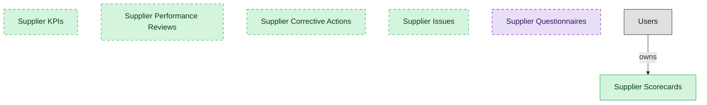

# Supplier Performance Management

## 1. Overview

Supplier performance scorecards, KPIs, reviews, and corrective actions. Measures and improves supplier delivery, quality, and service.

## 2. Entity summary

| Name | data_object | Description |
| --- | --- | --- |
| Supplier Corrective Actions | `supplier_corrective_actions` | Corrective-action plans opened against supplier underperformance and tracked to closure, with root cause and verification. |
| Supplier Issues | `supplier_issues` | Logged supplier issues and complaints that feed performance and corrective-action workflows, tracked from log to resolution. |
| Supplier KPIs | `supplier_kpis` | Performance metric definitions tracked per supplier, such as delivery, quality, responsiveness, and savings, with targets and weightings. |
| Supplier Performance Reviews | `supplier_performance_reviews` | Periodic reviews that roll KPIs into a shared assessment with each supplier, from draft through finalization. |
| Supplier Scorecards | `supplier_scorecards` | Weighted performance ratings of suppliers over a period, scoring on-time delivery, quality, responsiveness, and savings delivered. |
| Supplier Questionnaires | `supplier_questionnaires` | Reusable questionnaire templates used across qualification, performance, and risk workflows, such as insurance, security, ESG, and financial forms. |

## 3. Entities catalog

| # | data_object | canonical code | singular | plural | role | mastered in | mastered label | necessity | pattern flags | entity_type | write tier | notes |
| ---: | --- | --- | --- | --- | --- | --- | --- | --- | --- | --- | --- | --- |
| 1 | `supplier_corrective_actions` | `supplier_corrective_actions` | Supplier Corrective Action | Supplier Corrective Actions | master | - | - | optional | - | operational_workflow | `:manage` | - |
| 2 | `supplier_issues` | `supplier_issues` | Supplier Issue | Supplier Issues | master | - | - | optional | - | operational_workflow | `:manage` | - |
| 3 | `supplier_kpis` | `supplier_kpis` | Supplier KPI | Supplier KPIs | master | - | - | optional | - | catalog | `:admin` | - |
| 4 | `supplier_performance_reviews` | `supplier_performance_reviews` | Supplier Performance Review | Supplier Performance Reviews | master | - | - | optional | - | operational_workflow | `:manage` | - |
| 5 | `supplier_scorecards` | `supplier_scorecards` | Supplier Scorecard | Supplier Scorecards | master | - | - | required | - | operational_workflow | `:manage` | - |
| 6 | `supplier_questionnaires` | `supplier_questionnaires` | Supplier Questionnaire | Supplier Questionnaires | consumer | `srm-supplier-lifecycle` | Supplier Lifecycle Management | optional | - | catalog | `:admin` | - |

## 4. Aliases and industry synonyms

_(none: no industry-scoped aliases for this scope)_

## 5. Relationships

### 5.1 Intra-scope edges

_(none: no relationships with both endpoints inside the scope)_

### 5.2 Built-in edges (`users` and other platform built-ins)

| from | verb | to | cardinality | necessity | owner_side | delete_mode | fk_format | notes |
| --- | --- | --- | --- | --- | --- | --- | --- | --- |
| `users` | owns | `supplier_scorecards` | one_to_many | optional | source | clear | reference | - |

### 5.3 Cross-scope edges

#### 5.3a Outbound from this scope's masters and contributors

_Edges this scope drives: the in-scope endpoint has `role` of `master` or `contributor`._

| from | verb | to | cardinality | necessity | delete_mode | fk_format | notes |
| --- | --- | --- | --- | --- | --- | --- | --- |
| `suppliers` | rated_by | `supplier_scorecards` | one_to_many | optional | none | n/a | - |
| `supplier_risk_assessments` | feeds | `supplier_scorecards` | one_to_many | optional | none | n/a | - |
| `supplier_scorecards` | escalates_to | `audit_issues` | one_to_many | optional | none | n/a | - |
| `invoice_matches` | signals | `supplier_scorecards` | one_to_many | optional | none | n/a | - |
| `goods_receipts` | signals | `supplier_scorecards` | one_to_many | optional | none | n/a | - |

#### 5.3b Context edges on embedded shells and consumed entities

_Edges the canonical owner drives, shown for context: the in-scope endpoint has `role` of `embedded_master`, `consumer`, or `derived`._

_(none: no context cross-scope edges on this scope's embedded shells or consumed entities)_

## 6. Cross-domain context

### 6.1 Master consumers (other modules / domains that embed this scope's masters)

_(none: no other module embeds this scope's masters; the canonical owners do.)_

### 6.2 Outbound handoffs (events this scope publishes)

| source module | target domain | target module | trigger_event | transition | payload | integration | friction | description |
| --- | --- | --- | --- | --- | --- | --- | --- | --- |
| _(domain-level)_ | GRC | _(domain-level)_ | `supplier.risk_elevated` | _(threshold)_ | `supplier_scorecards` | api_call | high | Risk-score elevation triggers GRC engagement: enhanced due diligence, mitigation plan, exit strategy if warranted. Failure modes: false-positive risk signals from third-party data; rep-attribution edge cases. |

### 6.3 Inbound handoffs (events this scope reacts to)

_(none: no inbound handoffs whose payload is in this scope)_

### 6.4 Master providers (modules / domains that own masters this scope embeds)

| data_object | role here | necessity | canonical owner(s) | slice notes |
| --- | --- | --- | --- | --- |
| `supplier_questionnaires` | consumer | optional | SRM-SUPPLIER-LIFECYCLE (SRM) | - |

## 7. Lifecycle states

### `supplier_corrective_actions` (Supplier Corrective Action)

| order | state_name | initial? | terminal? | requires_permission? | derived gate | description |
| --- | --- | --- | --- | --- | --- | --- |
| 10 | `open` | ✓ | - | - | - | - |
| 20 | `in_progress` | - | - | - | - | - |
| 30 | `resolved` | - | - | - | - | - |
| 40 | `verified` | - | - | ✓ | `srm-performance-mgmt:verify_corrective_action` | - |
| 50 | `closed` | - | ✓ | - | - | - |

### `supplier_issues` (Supplier Issue)

| order | state_name | initial? | terminal? | requires_permission? | derived gate | description |
| --- | --- | --- | --- | --- | --- | --- |
| 10 | `logged` | ✓ | - | - | - | - |
| 20 | `triaged` | - | - | - | - | - |
| 30 | `in_progress` | - | - | - | - | - |
| 40 | `resolved` | - | - | - | - | - |
| 50 | `closed` | - | ✓ | - | - | - |

### `supplier_performance_reviews` (Supplier Performance Review)

| order | state_name | initial? | terminal? | requires_permission? | derived gate | description |
| --- | --- | --- | --- | --- | --- | --- |
| 10 | `draft` | ✓ | - | - | - | - |
| 20 | `in_review` | - | - | - | - | - |
| 30 | `finalized` | - | - | ✓ | `srm-performance-mgmt:finalize_performance_review` | - |
| 40 | `acknowledged` | - | ✓ | - | - | - |

## 8. Permissions and business rules (derived)

### 8.1 Permissions

| permission | tier | description | included in `:admin`? |
| --- | --- | --- | --- |
| `srm-performance-mgmt:read` | baseline-read | Read access to every entity in the module | ✓ |
| `srm-performance-mgmt:manage` | baseline-manage | Edit operational records | ✓ |
| `srm-performance-mgmt:admin` | baseline-admin | Edit reference data and inherit every workflow gate below | - |
| `srm-performance-mgmt:finalize_performance_review` | workflow-gate (lifecycle) | Transition `supplier_performance_reviews` into state `finalized` | ✓ |
| `srm-performance-mgmt:verify_corrective_action` | workflow-gate (lifecycle) | Transition `supplier_corrective_actions` into state `verified` | ✓ |

### 8.2 Business rules

_(none: no flag-derived business rules)_

## 9. Roles, RACI, and responsibilities (derived)

_Baseline roles, the permission hierarchy, and RACI realization are DERIVED from this scope's entity-type write tiers + `process_raci`; none of it is stored in the catalog (the deployer provisions it from this blueprint)._

### 9.1 `SRM-PERFORMANCE-MGMT`

**Baseline roles:**

| role | baseline grant |
| --- | --- |
| `srm-performance-mgmt_viewer` | `srm-performance-mgmt:read` |
| `srm-performance-mgmt_manager` | `srm-performance-mgmt:manage` |
| `srm-performance-mgmt_admin` | `srm-performance-mgmt:admin` |

**Permission hierarchy:**

| permission | includes |
| --- | --- |
| `srm-performance-mgmt:admin` | `srm-performance-mgmt:manage` |
| `srm-performance-mgmt:manage` | `srm-performance-mgmt:read` |
| `srm-performance-mgmt:admin` | `srm-performance-mgmt:finalize_performance_review` |
| `srm-performance-mgmt:admin` | `srm-performance-mgmt:verify_corrective_action` |

**RACI realization:**

_(none: no process_raci assignments wired to this module's gated processes yet)_

### 9.2 Functional ownership and default grants

| responsibility | business function | default role | default tier |
| --- | --- | --- | --- |
| owner | Procurement | `admin` | `:admin` |
| contributor | Governance, Risk and Compliance | `manage` | `:manage` |
| contributor | Legal | `manage` | `:manage` |
