# Supplier Risk and Compliance

## 1. Overview

Supplier risk assessment, certifications, sanctions and compliance screening, and ESG. Operational, qualification-gated supplier risk, distinct from deep third-party due diligence (TPRM).

## 2. Entity summary

| Name | data_object | Description |
| --- | --- | --- |
| Supplier Attestations | `supplier_attestations` | Declarations the supplier signs, such as code-of-conduct, modern-slavery, and conflict-minerals attestations, tracked through signature and expiry. |
| Supplier Beneficial Owners | `supplier_beneficial_owners` | Beneficial-ownership records for each supplier, capturing owner identity, ownership percentage, and verification source. |
| Supplier Certifications | `supplier_certifications` | Supplier-issued certifications such as food safety, organic, kosher, halal, allergen statements, and insurance coverage, with expiry tracking. |
| Supplier Diversity Classifications | `supplier_diversity_classifications` | Diversity spend certifications for each supplier, such as MBE, WBE, and VBE, with certifying body and expiry. |
| Supplier Insurance Certificates | `supplier_insurance_certificates` | Certificates of insurance for each supplier, with coverage type, limits, carrier, and expiry. |
| Supplier Risk Assessments | `supplier_risk_assessments` | Risk-scoring records per supplier across operational, financial, and cyber dimensions. |
| Supplier Screening Records | `supplier_screening_records` | Sanctions, denied-party, and PEP screening events per supplier, with results and adjudication trail. |
| Supplier ESG Assessments | `supplier_esg_assessments` | Supplier ESG performance profiles, with questionnaire responses, audit results, certifications, and Scope 3 estimates, refreshed annually. |
| Supplier Questionnaires | `supplier_questionnaires` | Reusable questionnaire templates used across qualification, performance, and risk workflows, such as insurance, security, ESG, and financial forms. |

```mermaid
flowchart TD
  classDef master fill:#d4f4dd,stroke:#27ae60,color:#0b3d20;
  classDef consumer fill:#e8def8,stroke:#7b1fa2,color:#3a155d;
  classDef platform_builtin fill:#e0e0e0,stroke:#424242,color:#1a1a1a;
  supplier_risk_assessments["Supplier Risk Assessments"]
  supplier_certifications["Supplier Certifications"]
  supplier_screening_records["Supplier Screening Records"]
  supplier_beneficial_owners["Supplier Beneficial Owners"]
  supplier_diversity_classifications["Supplier Diversity Classifications"]
  supplier_insurance_certificates["Supplier Insurance Certificates"]
  supplier_attestations["Supplier Attestations"]
  supplier_questionnaires["Supplier Questionnaires"]
  supplier_esg_assessments["Supplier ESG Assessments"]
  users["Users"]
  users -->|"authors"| supplier_risk_assessments
  users -->|"approves"| supplier_risk_assessments
  users -->|"uploads"| supplier_certifications
  class supplier_risk_assessments master;
  class supplier_certifications master;
  class supplier_screening_records master;
  class supplier_beneficial_owners master;
  class supplier_diversity_classifications master;
  class supplier_insurance_certificates master;
  class supplier_attestations master;
  class supplier_questionnaires consumer;
  class supplier_esg_assessments consumer;
  class users platform_builtin;
  style supplier_screening_records stroke-dasharray:5 5;
  style supplier_beneficial_owners stroke-dasharray:5 5;
  style supplier_diversity_classifications stroke-dasharray:5 5;
  style supplier_insurance_certificates stroke-dasharray:5 5;
  style supplier_attestations stroke-dasharray:5 5;
  style supplier_questionnaires stroke-dasharray:5 5;
  style supplier_esg_assessments stroke-dasharray:5 5;
```

## 3. Entities catalog

| # | data_object | canonical code | singular | plural | role | mastered in | mastered label | necessity | pattern flags | entity_type | write tier | notes |
| ---: | --- | --- | --- | --- | --- | --- | --- | --- | --- | --- | --- | --- |
| 1 | `supplier_attestations` | `supplier_attestations` | Supplier Attestation | Supplier Attestations | master | - | - | optional | submit_lock | operational_workflow | `:manage` | - |
| 2 | `supplier_beneficial_owners` | `supplier_beneficial_owners` | Supplier Beneficial Owner | Supplier Beneficial Owners | master | - | - | optional | personal_content | operational_record | `:manage` | - |
| 3 | `supplier_certifications` | `supplier_certifications` | Supplier Certification | Supplier Certifications | master | - | - | required | submit_lock | operational_workflow | `:manage` | - |
| 4 | `supplier_diversity_classifications` | `supplier_diversity_classifications` | Supplier Diversity Classification | Supplier Diversity Classifications | master | - | - | optional | - | operational_workflow | `:manage` | - |
| 5 | `supplier_insurance_certificates` | `supplier_insurance_certificates` | Supplier Insurance Certificate | Supplier Insurance Certificates | master | - | - | optional | submit_lock | operational_workflow | `:manage` | - |
| 6 | `supplier_risk_assessments` | `supplier_risk_assessments` | Supplier Risk Assessment | Supplier Risk Assessments | master | - | - | required | single_approver | operational_workflow | `:manage` | - |
| 7 | `supplier_screening_records` | `supplier_screening_records` | Supplier Screening Record | Supplier Screening Records | master | - | - | optional | submit_lock | operational_workflow | `:manage` | - |
| 8 | `supplier_esg_assessments` | `supplier_esg_assessments` | Supplier ESG Assessment | Supplier ESG Assessments | consumer | - | - | optional | - | operational_workflow | `:manage` | - |
| 9 | `supplier_questionnaires` | `supplier_questionnaires` | Supplier Questionnaire | Supplier Questionnaires | consumer | `srm-supplier-lifecycle` | Supplier Lifecycle Management | optional | - | catalog | `:admin` | - |

## 4. Aliases and industry synonyms

_(none: no industry-scoped aliases for this scope)_

## 5. Relationships

### 5.1 Intra-scope edges

_(none: no relationships with both endpoints inside the scope)_

### 5.2 Built-in edges (`users` and other platform built-ins)

| from | verb | to | cardinality | necessity | owner_side | delete_mode | fk_format | notes |
| --- | --- | --- | --- | --- | --- | --- | --- | --- |
| `users` | authors | `supplier_risk_assessments` | one_to_many | optional | source | clear | reference | - |
| `users` | approves | `supplier_risk_assessments` | one_to_many | optional | source | clear | reference | - |
| `users` | uploads | `supplier_certifications` | one_to_many | optional | source | clear | reference | - |

### 5.3 Cross-scope edges

#### 5.3a Outbound from this scope's masters and contributors

_Edges this scope drives: the in-scope endpoint has `role` of `master` or `contributor`._

| from | verb | to | cardinality | necessity | delete_mode | fk_format | notes |
| --- | --- | --- | --- | --- | --- | --- | --- |
| `audit_engagements` | samples | `supplier_risk_assessments` | many_to_many | optional | none | n/a | - |
| `supplier_certifications` | authorizes | `traceability_lots` | many_to_many | optional | none | n/a | - |
| `suppliers` | holds | `supplier_certifications` | one_to_many | optional | none | n/a | - |
| `suppliers` | assessed_by | `supplier_risk_assessments` | one_to_many | optional | none | n/a | - |
| `supplier_qualifications` | requires | `supplier_certifications` | many_to_many | optional | none | n/a | - |
| `supplier_risk_assessments` | feeds | `supplier_scorecards` | one_to_many | optional | none | n/a | - |
| `supplier_risk_assessments` | escalates_to | `audit_issues` | one_to_many | optional | none | n/a | - |
| `supplier_risk_assessments` | sampled_by | `audit_engagements` | one_to_many | optional | none | n/a | - |
| `supplier_certifications` | updates | `supplier_qualifications` | one_to_many | required | none (required-if-present) | n/a | - |

#### 5.3b Context edges on embedded shells and consumed entities

_Edges the canonical owner drives, shown for context: the in-scope endpoint has `role` of `embedded_master`, `consumer`, or `derived`._

| from | verb | to | cardinality | necessity | delete_mode | fk_format | notes |
| --- | --- | --- | --- | --- | --- | --- | --- |
| `supplier_esg_assessments` | updates | `supplier_qualifications` | one_to_many | optional | none | n/a | - |

## 6. Cross-domain context

### 6.1 Master consumers (other modules / domains that embed this scope's masters)

| data_object | other module / domain | role | necessity | notes |
| --- | --- | --- | --- | --- |
| `supplier_certifications` | FOOD-TRACE-SUPPLIER-PROVENANCE (Supplier Documents and Provenance) - FOOD-TRACE | master | required | - |
| `supplier_certifications` | FSQM-AUDIT-SUPPLIER (Certification Audit and Supplier Risk) - FSQM | contributor | required | - |

### 6.2 Outbound handoffs (events this scope publishes)

| source module | target domain | target module | trigger_event | transition | payload | integration | friction | description |
| --- | --- | --- | --- | --- | --- | --- | --- | --- |
| _(domain-level)_ | GRC | _(domain-level)_ | `supplier_risk_assessment.elevated` | _(threshold)_ | `supplier_risk_assessments` | event_stream | high | Elevated supplier risk opens a GRC issue and may trigger remediation. |
| _(domain-level)_ | AUDIT | _(domain-level)_ | `supplier_risk_assessment.completed` | _(lifecycle)_ | `supplier_risk_assessments` | batch_sync | medium | AUDIT samples supplier risk assessments as part of third-party-risk testing. |

### 6.3 Inbound handoffs (events this scope reacts to)

| target module | source domain | source module | trigger_event | transition | payload | integration | friction | description |
| --- | --- | --- | --- | --- | --- | --- | --- | --- |
| _(domain-level)_ | ESG | _(domain-level)_ | `supplier_esg_assessment.score_updated` | `assessed` → `assessed` _(state_change)_ | `supplier_esg_assessments` | api_call | medium | Updated ESG score → SUP-LIFE supplier_qualifications field; tier reassessment. |

### 6.4 Master providers (modules / domains that own masters this scope embeds)

| data_object | role here | necessity | canonical owner(s) | slice notes |
| --- | --- | --- | --- | --- |
| `supplier_esg_assessments` | consumer | optional | _(no canonical owner recorded)_ | - |
| `supplier_questionnaires` | consumer | optional | SRM-SUPPLIER-LIFECYCLE (SRM) | - |

## 7. Lifecycle states

### `supplier_attestations` (Supplier Attestation)

| order | state_name | initial? | terminal? | requires_permission? | derived gate | description |
| --- | --- | --- | --- | --- | --- | --- |
| 10 | `requested` | ✓ | - | - | - | - |
| 20 | `signed` | - | - | ✓ | `srm-risk-compliance:sign_attestation` | - |
| 30 | `expired` | - | ✓ | - | - | - |

### `supplier_certifications` (Supplier Certification)

| order | state_name | initial? | terminal? | requires_permission? | derived gate | description |
| --- | --- | --- | --- | --- | --- | --- |
| 0 | `uploaded` | ✓ | - | - | - | Certification document uploaded and awaiting verification. |
| 1 | `verified` | - | - | ✓ | `food-trace-supplier-provenance:verified_supplier_certification` | Certification verified against the issuing authority and document validity. |
| 2 | `active` | - | - | - | - | Certification active and within its validity window. |
| 3 | `expiring` | - | - | - | - | Certification approaching expiry; renewal requested. |
| 4 | `expired` | - | - | - | - | Certification past expiry with no renewal received. |
| 5 | `renewed` | - | - | - | - | Certification renewed with a current valid document; validity window resets. |
| 6 | `revoked` | - | ✓ | ✓ | `food-trace-supplier-provenance:revoked_supplier_certification` | Certification revoked; supplier blocked from new lot acceptance until restored. |

### `supplier_diversity_classifications` (Supplier Diversity Classification)

| order | state_name | initial? | terminal? | requires_permission? | derived gate | description |
| --- | --- | --- | --- | --- | --- | --- |
| 10 | `valid` | ✓ | - | - | - | - |
| 20 | `expiring_soon` | - | - | - | - | - |
| 30 | `expired` | - | ✓ | - | - | - |
| 40 | `revoked` | - | ✓ | - | - | - |

### `supplier_insurance_certificates` (Supplier Insurance Certificate)

| order | state_name | initial? | terminal? | requires_permission? | derived gate | description |
| --- | --- | --- | --- | --- | --- | --- |
| 10 | `valid` | ✓ | - | - | - | - |
| 20 | `expiring_soon` | - | - | - | - | - |
| 30 | `expired` | - | ✓ | - | - | - |

### `supplier_screening_records` (Supplier Screening Record)

| order | state_name | initial? | terminal? | requires_permission? | derived gate | description |
| --- | --- | --- | --- | --- | --- | --- |
| 10 | `pending` | ✓ | - | - | - | - |
| 20 | `screened` | - | - | - | - | - |
| 30 | `hit_review` | - | - | - | - | - |
| 40 | `adjudicated` | - | ✓ | ✓ | `srm-risk-compliance:adjudicate_screening` | - |
| 50 | `cleared` | - | ✓ | - | - | - |

## 8. Permissions and business rules (derived)

### 8.1 Permissions

| permission | tier | description | included in `:admin`? |
| --- | --- | --- | --- |
| `srm-risk-compliance:read` | baseline-read | Read access to every entity in the module | ✓ |
| `srm-risk-compliance:manage` | baseline-manage | Edit operational records | ✓ |
| `srm-risk-compliance:admin` | baseline-admin | Edit reference data and inherit every workflow gate below | - |
| `srm-risk-compliance:adjudicate_screening` | workflow-gate (lifecycle) | Transition `supplier_screening_records` into state `adjudicated` | ✓ |
| `srm-risk-compliance:sign_attestation` | workflow-gate (lifecycle) | Transition `supplier_attestations` into state `signed` | ✓ |
| `srm-risk-compliance:submit_supplier_certification` | override (submit_lock) | Submit and lock a `supplier_certifications` row (post-submit edits gated) | ✓ |
| `srm-risk-compliance:submit_supplier_screening_record` | override (submit_lock) | Submit and lock a `supplier_screening_records` row (post-submit edits gated) | ✓ |
| `srm-risk-compliance:view_all_supplier_beneficial_owners` | override (personal_content) | View all `supplier_beneficial_owners` rows beyond row-scope | ✓ |
| `srm-risk-compliance:manage_all_supplier_beneficial_owners` | override (personal_content) | Manage all `supplier_beneficial_owners` rows beyond row-scope | ✓ |
| `srm-risk-compliance:submit_supplier_insurance_certificate` | override (submit_lock) | Submit and lock a `supplier_insurance_certificates` row (post-submit edits gated) | ✓ |
| `srm-risk-compliance:submit_supplier_attestation` | override (submit_lock) | Submit and lock a `supplier_attestations` row (post-submit edits gated) | ✓ |

### 8.2 Business rules

| rule_name | data_object | source flag | intent |
| --- | --- | --- | --- |
| `approve_supplier_risk_assessment_requires_approver` | `supplier_risk_assessments` | has_single_approver | Exactly one explicit approver required; uses the module's approval gate (`srm-risk-compliance:approve_supplier_risk_assessment` if surfaced as a lifecycle workflow gate). |
| `submit_restricted_to_supplier_certification_owner` | `supplier_certifications` | has_submit_lock | Only the row's authoring user can submit; post-submit the row is read-only except via `srm-risk-compliance:manage_all_supplier_certifications` |
| `submit_restricted_to_supplier_screening_record_owner` | `supplier_screening_records` | has_submit_lock | Only the row's authoring user can submit; post-submit the row is read-only except via `srm-risk-compliance:manage_all_supplier_screening_records` |
| `supplier_beneficial_owner_edit_scope` | `supplier_beneficial_owners` | has_personal_content | Row-scope by default; override via `srm-risk-compliance:view_all_supplier_beneficial_owners` / `srm-risk-compliance:manage_all_supplier_beneficial_owners` |
| `submit_restricted_to_supplier_insurance_certificate_owner` | `supplier_insurance_certificates` | has_submit_lock | Only the row's authoring user can submit; post-submit the row is read-only except via `srm-risk-compliance:manage_all_supplier_insurance_certificates` |
| `submit_restricted_to_supplier_attestation_owner` | `supplier_attestations` | has_submit_lock | Only the row's authoring user can submit; post-submit the row is read-only except via `srm-risk-compliance:manage_all_supplier_attestations` |

## 9. Roles, RACI, and responsibilities (derived)

_Baseline roles, the permission hierarchy, and RACI realization are DERIVED from this scope's entity-type write tiers + `process_raci`; none of it is stored in the catalog (the deployer provisions it from this blueprint)._

### 9.1 `SRM-RISK-COMPLIANCE`

**Baseline roles:**

| role | baseline grant |
| --- | --- |
| `srm-risk-compliance_viewer` | `srm-risk-compliance:read` |
| `srm-risk-compliance_manager` | `srm-risk-compliance:manage` |

**Permission hierarchy:**

| permission | includes |
| --- | --- |
| `srm-risk-compliance:admin` | `srm-risk-compliance:manage` |
| `srm-risk-compliance:manage` | `srm-risk-compliance:read` |
| `srm-risk-compliance:admin` | `srm-risk-compliance:adjudicate_screening` |
| `srm-risk-compliance:admin` | `srm-risk-compliance:sign_attestation` |
| `srm-risk-compliance:admin` | `srm-risk-compliance:submit_supplier_certification` |
| `srm-risk-compliance:admin` | `srm-risk-compliance:submit_supplier_screening_record` |
| `srm-risk-compliance:admin` | `srm-risk-compliance:view_all_supplier_beneficial_owners` |
| `srm-risk-compliance:admin` | `srm-risk-compliance:manage_all_supplier_beneficial_owners` |
| `srm-risk-compliance:admin` | `srm-risk-compliance:submit_supplier_insurance_certificate` |
| `srm-risk-compliance:admin` | `srm-risk-compliance:submit_supplier_attestation` |

**RACI realization:**

_(none: no process_raci assignments wired to this module's gated processes yet)_

### 9.2 Functional ownership and default grants

| responsibility | business function | default role | default tier |
| --- | --- | --- | --- |
| owner | Procurement | `admin` | `:admin` |
| contributor | Governance, Risk and Compliance | `manage` | `:manage` |
| contributor | Legal | `manage` | `:manage` |
