# Supplier Lifecycle Management

## 1. Overview

Supplier master data, onboarding, registration, and qualification. The intake and master-record spine of supplier management.

## 2. Entity summary

| Name | data_object | Description |
| --- | --- | --- |
| Supplier Bank Accounts | `supplier_bank_accounts` | Validated remittance bank accounts for each supplier, holding account details, currency, and validation status. |
| Supplier Contacts | `supplier_contacts` | Named contact people for each supplier, with their role, email, phone, and primary-contact designation. |
| Supplier Documents | `supplier_documents` | Documents uploaded by or about each supplier, such as tax forms, certificates, and agreements, with type and expiry metadata. |
| Supplier Information Requests | `supplier_information_requests` | Campaigns asking suppliers to update or re-attest their information, tracked from issue through response and closure. |
| Supplier Locations | `supplier_locations` | Operating sites for each supplier, such as ship-from, remit-to, and manufacturing locations. |
| Supplier Onboardings | `supplier_onboardings` | Onboarding workflows for new suppliers, covering invitation, registration, document collection, and approval chain. |
| Supplier Qualifications | `supplier_qualifications` | Risk and compliance profiles for active suppliers, including sanctions screening, financial health, ESG scoring, and certifications. |
| Supplier Questionnaires | `supplier_questionnaires` | Reusable questionnaire templates used across qualification, performance, and risk workflows, such as insurance, security, ESG, and financial forms. |
| Supplier Registrations | `supplier_registrations` | Self-service registrations submitted by prospective suppliers before onboarding, with company, tax, and contact basics. |
| Supplier Relationships | `supplier_relationships` | Hierarchy and affiliate links between supplier records, such as parent, child, and affiliate relationships. |
| Supplier Segmentation Tiers | `supplier_segmentation_tiers` | Tier classifications that rank suppliers by strategic importance, such as strategic, preferred, and transactional. |
| Supplier Tasks | `supplier_tasks` | Tasks and to-dos assigned across the supplier-management lifecycle, with assignee, due date, and status. |
| Suppliers | `suppliers` | Vendor master records, holding legal name, tax id, addresses, payment terms, contacts, currency, status, and risk profile. |

```mermaid
flowchart TD
  classDef master fill:#d4f4dd,stroke:#27ae60,color:#0b3d20;
  classDef platform_builtin fill:#e0e0e0,stroke:#424242,color:#1a1a1a;
  suppliers["Suppliers"]
  supplier_onboardings["Supplier Onboardings"]
  supplier_qualifications["Supplier Qualifications"]
  supplier_contacts["Supplier Contacts"]
  supplier_locations["Supplier Locations"]
  supplier_bank_accounts["Supplier Bank Accounts"]
  supplier_documents["Supplier Documents"]
  supplier_relationships["Supplier Relationships"]
  supplier_registrations["Supplier Registrations"]
  supplier_segmentation_tiers["Supplier Segmentation Tiers"]
  supplier_information_requests["Supplier Information Requests"]
  supplier_tasks["Supplier Tasks"]
  supplier_questionnaires["Supplier Questionnaires"]
  users["Users"]
  suppliers -->|"undergoes"| supplier_onboardings
  suppliers -->|"holds"| supplier_qualifications
  supplier_onboardings -->|"yields"| supplier_qualifications
  users -->|"owns"| suppliers
  users -->|"runs"| supplier_onboardings
  users -->|"approves"| supplier_onboardings
  users -->|"approves"| supplier_qualifications
  class suppliers master;
  class supplier_onboardings master;
  class supplier_qualifications master;
  class supplier_contacts master;
  class supplier_locations master;
  class supplier_bank_accounts master;
  class supplier_documents master;
  class supplier_relationships master;
  class supplier_registrations master;
  class supplier_segmentation_tiers master;
  class supplier_information_requests master;
  class supplier_tasks master;
  class supplier_questionnaires master;
  class users platform_builtin;
  style supplier_locations stroke-dasharray:5 5;
  style supplier_relationships stroke-dasharray:5 5;
  style supplier_segmentation_tiers stroke-dasharray:5 5;
  style supplier_tasks stroke-dasharray:5 5;
  style supplier_questionnaires stroke-dasharray:5 5;
```

## 3. Entities catalog

| # | data_object | canonical code | singular | plural | role | mastered in | mastered label | necessity | personal_content | entity_type | write tier | notes |
| ---: | --- | --- | --- | --- | --- | --- | --- | --- | --- | --- | --- | --- |
| 1 | `supplier_bank_accounts` | `supplier_bank_accounts` | Supplier Bank Account | Supplier Bank Accounts | master | - | - | required | - | operational_workflow | `:manage` | - |
| 2 | `supplier_contacts` | `supplier_contacts` | Supplier Contact | Supplier Contacts | master | - | - | required | yes | operational_record | `:manage` | - |
| 3 | `supplier_documents` | `supplier_documents` | Supplier Document | Supplier Documents | master | - | - | required | - | operational_record | `:manage` | - |
| 4 | `supplier_information_requests` | `supplier_information_requests` | Supplier Information Request | Supplier Information Requests | master | - | - | required | - | operational_workflow | `:manage` | - |
| 5 | `supplier_locations` | `supplier_locations` | Supplier Location | Supplier Locations | master | - | - | optional | - | operational_record | `:manage` | - |
| 6 | `supplier_onboardings` | `supplier_onboardings` | Supplier Onboarding | Supplier Onboardings | master | - | - | required | - | operational_workflow | `:manage` | - |
| 7 | `supplier_qualifications` | `supplier_qualifications` | Supplier Qualification | Supplier Qualifications | master | - | - | required | - | operational_workflow | `:manage` | - |
| 8 | `supplier_questionnaires` | `supplier_questionnaires` | Supplier Questionnaire | Supplier Questionnaires | master | - | - | optional | - | catalog | `:admin` | - |
| 9 | `supplier_registrations` | `supplier_registrations` | Supplier Registration | Supplier Registrations | master | - | - | required | - | operational_workflow | `:manage` | - |
| 10 | `supplier_relationships` | `supplier_relationships` | Supplier Relationship | Supplier Relationships | master | - | - | optional | - | junction | `:manage` | - |
| 11 | `supplier_segmentation_tiers` | `supplier_segmentation_tiers` | Supplier Segmentation Tier | Supplier Segmentation Tiers | master | - | - | optional | - | catalog | `:admin` | - |
| 12 | `supplier_tasks` | `supplier_tasks` | Supplier Task | Supplier Tasks | master | - | - | optional | - | operational_workflow | `:manage` | - |
| 13 | `suppliers` | `suppliers` | Supplier | Suppliers | master | - | - | required | yes | operational_workflow | `:manage` | - |

## 4. Aliases and industry synonyms

_(none: no industry-scoped aliases for this scope)_

## 5. Relationships

### 5.1 Intra-scope edges

| from | verb | to | cardinality | kind | necessity | owner_side | delete_mode | fk_format | notes |
| --- | --- | --- | --- | --- | --- | --- | --- | --- | --- |
| `suppliers` | undergoes | `supplier_onboardings` | one_to_many | composition | required | source | cascade | parent | - |
| `suppliers` | holds | `supplier_qualifications` | one_to_many | composition | optional | source | cascade | parent | - |
| `supplier_onboardings` | yields | `supplier_qualifications` | one_to_many | reference | optional | source | clear | reference | - |

### 5.2 Built-in edges (`users` and other platform built-ins)

| from | verb | to | cardinality | necessity | owner_side | delete_mode | fk_format | notes |
| --- | --- | --- | --- | --- | --- | --- | --- | --- |
| `users` | owns | `suppliers` | one_to_many | optional | source | clear | reference | - |
| `users` | runs | `supplier_onboardings` | one_to_many | optional | source | clear | reference | - |
| `users` | approves | `supplier_onboardings` | one_to_many | optional | source | clear | reference | - |
| `users` | approves | `supplier_qualifications` | one_to_many | optional | source | clear | reference | - |

### 5.3 Cross-scope edges

#### 5.3a Outbound from this scope's masters and contributors

_Edges this scope drives: the in-scope endpoint has `role` of `master` or `contributor`._

| from | verb | to | cardinality | necessity | delete_mode | fk_format | notes |
| --- | --- | --- | --- | --- | --- | --- | --- |
| `audit_findings` | updates | `suppliers` | many_to_many | optional | none | n/a | - |
| `pim_products` | sourced_from | `suppliers` | many_to_many | optional | none | n/a | Supplier onboarding feeds attribute data into PIM; the product can have one primary supplier and many alternates. |
| `suppliers` | reconciles | `staffing_suppliers` | one_to_many | optional | none | n/a | - |
| `suppliers` | holds | `supplier_certifications` | one_to_many | optional | none | n/a | - |
| `suppliers` | assessed_by | `supplier_risk_assessments` | one_to_many | optional | none | n/a | - |
| `suppliers` | rated_by | `supplier_scorecards` | one_to_many | optional | none | n/a | - |
| `supplier_qualifications` | requires | `supplier_certifications` | many_to_many | optional | none | n/a | - |
| `supplier_esg_assessments` | updates | `supplier_qualifications` | one_to_many | optional | none | n/a | - |
| `suppliers` | enables | `sourcing_events` | one_to_many | optional | none | n/a | - |
| `supplier_qualifications` | gates | `purchase_orders` | one_to_many | optional | none | n/a | - |
| `suppliers` | propagates_bank_change_to | `payment_runs` | one_to_many | optional | none | n/a | - |
| `supplier_qualifications` | unblocks | `payment_runs` | one_to_many | optional | none | n/a | - |
| `supplier_onboardings` | creates_vendor_master_in | `bank_accounts` | one_to_many | optional | none | n/a | - |
| `supplier_golden_records` | resolves to | `suppliers` | one_to_many | optional | none | n/a | - |
| `supplier_certifications` | updates | `supplier_qualifications` | one_to_many | required | none (required-if-present) | n/a | - |
| `engineering_parts` | sourced_from | `suppliers` | many_to_many | optional | none | n/a | - |
| `suppliers` | submits | `product_compliance_declarations` | one_to_many | required | none (required-if-present) | n/a | - |

#### 5.3b Context edges on embedded shells and consumed entities

_Edges the canonical owner drives, shown for context: the in-scope endpoint has `role` of `embedded_master`, `consumer`, or `derived`._

_(none: no context cross-scope edges on this scope's embedded shells or consumed entities)_

## 6. Cross-domain context

### 6.1 Master consumers (other modules / domains that embed this scope's masters)

| data_object | other module / domain | role | necessity | notes |
| --- | --- | --- | --- | --- |
| `supplier_questionnaires` | SRM-PERFORMANCE-MGMT (Supplier Performance Management) - SRM | consumer | optional | - |
| `supplier_questionnaires` | SRM-RISK-COMPLIANCE (Supplier Risk and Compliance) - SRM | consumer | optional | - |
| `suppliers` | AGENCY-MGMT-MEDIA-BUY (Media Plan and Insertion Order Management) - AGENCY-MGMT | consumer | required | - |
| `suppliers` | DAIRY-MGMT-HERD (Herd and Animal Lifecycle) - DAIRY-MGMT | consumer | required | - |
| `suppliers` | FOOD-TRACE-SUPPLIER-PROVENANCE (Supplier Documents and Provenance) - FOOD-TRACE | consumer | required | - |
| `suppliers` | FSQM-AUDIT-SUPPLIER (Certification Audit and Supplier Risk) - FSQM | consumer | required | - |
| `suppliers` | INV-REPLENISHMENT (Replenishment and Reorder Automation) - INV-MGMT | consumer | required | - |
| `suppliers` | PIM-PRODUCT-CONTENT (Product Content and Attributes) - PIM | contributor | optional | - |
| `suppliers` | PLM-COMPLIANCE (Product Compliance) - PLM | contributor | required | - |
| `suppliers` | SPEND-MGMT-BILL-PAY (Vendor Bill Pay) - SPEND-MGMT | consumer | required | - |
| `suppliers` | SVCS-PROC-ENGAGEMENT (Services Sourcing and Engagement) - SVCS-PROC | consumer | optional | - |
| `suppliers` | TPRM-ONBOARDING-INTAKE (Third-Party Onboarding and Intake) - TPRM | consumer | optional | - |
| `suppliers` | TPRM-SUPPLY-CHAIN-RISK (Supply-Chain and Nth-Party Risk) - TPRM | consumer | optional | - |

### 6.2 Outbound handoffs (events this scope publishes)

| source module | target domain | target module | trigger_event | transition | payload | integration | friction | description |
| --- | --- | --- | --- | --- | --- | --- | --- | --- |
| _(domain-level)_ | S2P | _(domain-level)_ | `supplier.approved` | `approved` _(state_change)_ | `suppliers` | event_stream | low | Supplier onboarding completion makes the supplier eligible for sourcing events and purchase orders. |
| _(domain-level)_ | S2P | _(domain-level)_ | `supplier_qualification.approved` | _(state_change)_ | `supplier_qualifications` | event_stream | low | Qualified suppliers become eligible for sourcing events. |
| _(domain-level)_ | S2P | _(domain-level)_ | `supplier_qualification.expired` | _(threshold)_ | `supplier_qualifications` | event_stream | high | Expired qualifications block new POs until re-qualification. |
| _(domain-level)_ | AP-AUTO | _(domain-level)_ | `supplier.bank_changed` | _(state_change)_ | `suppliers` | api_call | high | Supplier bank-account changes carry significant fraud risk; identity-reconciliation pattern. Strong vendor-master controls and out-of-band verification gate the propagation to AP-AUTO. |
| _(domain-level)_ | AP-AUTO | _(domain-level)_ | `supplier_qualification.approved` | _(state_change)_ | `supplier_qualifications` | event_stream | low | AP-AUTO unblocks payments once qualification is complete. |
| _(domain-level)_ | AP-AUTO | _(domain-level)_ | `supplier_qualification.expired` | _(threshold)_ | `supplier_qualifications` | event_stream | high | Expired qualifications hold supplier payments pending re-qualification. |
| _(domain-level)_ | FIN | _(domain-level)_ | `supplier.onboarded` | `in_progress` → `onboarded` _(lifecycle)_ | `supplier_onboardings` | api_call | medium | Newly-onboarded supplier triggers vendor-master creation in ERP-FIN: AP setup, payment-method record, tax-form repository. Failure modes: supplier-identity duplication when the same legal entity appears under different names; bank-detail validation delays. |

### 6.3 Inbound handoffs (events this scope reacts to)

_(none: no inbound handoffs whose payload is in this scope)_

### 6.4 Master providers (modules / domains that own masters this scope embeds)

_(none: this scope embeds no masters owned elsewhere; every entity is mastered here)_

## 7. Lifecycle states

### `supplier_bank_accounts` (Supplier Bank Account)

| order | state_name | initial? | terminal? | requires_permission? | derived gate | description |
| --- | --- | --- | --- | --- | --- | --- |
| 10 | `unverified` | ✓ | - | - | - | - |
| 20 | `pending_validation` | - | - | - | - | - |
| 30 | `validated` | - | - | ✓ | `srm-supplier-lifecycle:validate_bank_account` | - |
| 40 | `active` | - | - | - | - | - |
| 50 | `inactive` | - | ✓ | - | - | - |

### `supplier_information_requests` (Supplier Information Request)

| order | state_name | initial? | terminal? | requires_permission? | derived gate | description |
| --- | --- | --- | --- | --- | --- | --- |
| 10 | `draft` | ✓ | - | - | - | - |
| 20 | `sent` | - | - | - | - | - |
| 30 | `in_progress` | - | - | - | - | - |
| 40 | `completed` | - | ✓ | ✓ | `srm-supplier-lifecycle:close_information_request` | - |
| 50 | `cancelled` | - | ✓ | - | - | - |

### `supplier_registrations` (Supplier Registration)

| order | state_name | initial? | terminal? | requires_permission? | derived gate | description |
| --- | --- | --- | --- | --- | --- | --- |
| 10 | `draft` | ✓ | - | - | - | - |
| 20 | `submitted` | - | - | - | - | - |
| 30 | `under_review` | - | - | - | - | - |
| 40 | `approved` | - | ✓ | ✓ | `srm-supplier-lifecycle:approve_registration` | - |
| 50 | `rejected` | - | ✓ | - | - | - |

### `supplier_tasks` (Supplier Task)

| order | state_name | initial? | terminal? | requires_permission? | derived gate | description |
| --- | --- | --- | --- | --- | --- | --- |
| 10 | `open` | ✓ | - | - | - | - |
| 20 | `in_progress` | - | - | - | - | - |
| 30 | `completed` | - | ✓ | - | - | - |
| 40 | `cancelled` | - | ✓ | - | - | - |

## 8. Permissions and business rules (derived)

### 8.1 Permissions

| permission | tier | description | included in `:admin`? |
| --- | --- | --- | --- |
| `srm-supplier-lifecycle:read` | baseline-read | Read access to every entity in the module | ✓ |
| `srm-supplier-lifecycle:manage` | baseline-manage | Edit operational records | ✓ |
| `srm-supplier-lifecycle:admin` | baseline-admin | Edit reference data and inherit every workflow gate below | - |
| `srm-supplier-lifecycle:validate_bank_account` | workflow-gate (lifecycle) | Transition `supplier_bank_accounts` into state `validated` | ✓ |
| `srm-supplier-lifecycle:approve_registration` | workflow-gate (lifecycle) | Transition `supplier_registrations` into state `approved` | ✓ |
| `srm-supplier-lifecycle:close_information_request` | workflow-gate (lifecycle) | Transition `supplier_information_requests` into state `completed` | ✓ |
| `srm-supplier-lifecycle:view_all_suppliers` | override (personal_content) | View all `suppliers` rows beyond row-scope | ✓ |
| `srm-supplier-lifecycle:manage_all_suppliers` | override (personal_content) | Manage all `suppliers` rows beyond row-scope | ✓ |
| `srm-supplier-lifecycle:view_all_supplier_contacts` | override (personal_content) | View all `supplier_contacts` rows beyond row-scope | ✓ |
| `srm-supplier-lifecycle:manage_all_supplier_contacts` | override (personal_content) | Manage all `supplier_contacts` rows beyond row-scope | ✓ |

### 8.2 Business rules

| rule_name | data_object | source flag | intent |
| --- | --- | --- | --- |
| `supplier_edit_scope` | `suppliers` | has_personal_content | Row-scope by default; override via `srm-supplier-lifecycle:view_all_suppliers` / `srm-supplier-lifecycle:manage_all_suppliers` |
| `supplier_contact_edit_scope` | `supplier_contacts` | has_personal_content | Row-scope by default; override via `srm-supplier-lifecycle:view_all_supplier_contacts` / `srm-supplier-lifecycle:manage_all_supplier_contacts` |

## 9. Roles, RACI, and responsibilities (derived)

_Baseline roles, the permission hierarchy, and RACI realization are DERIVED from this scope's entity-type write tiers + `process_raci`; none of it is stored in the catalog (the deployer provisions it from this blueprint)._

### 9.1 `SRM-SUPPLIER-LIFECYCLE`

**Baseline roles:**

| role | baseline grant |
| --- | --- |
| `srm-supplier-lifecycle_viewer` | `srm-supplier-lifecycle:read` |
| `srm-supplier-lifecycle_manager` | `srm-supplier-lifecycle:manage` |
| `srm-supplier-lifecycle_admin` | `srm-supplier-lifecycle:admin` |

**Permission hierarchy:**

| permission | includes |
| --- | --- |
| `srm-supplier-lifecycle:admin` | `srm-supplier-lifecycle:manage` |
| `srm-supplier-lifecycle:manage` | `srm-supplier-lifecycle:read` |
| `srm-supplier-lifecycle:admin` | `srm-supplier-lifecycle:validate_bank_account` |
| `srm-supplier-lifecycle:admin` | `srm-supplier-lifecycle:approve_registration` |
| `srm-supplier-lifecycle:admin` | `srm-supplier-lifecycle:close_information_request` |
| `srm-supplier-lifecycle:admin` | `srm-supplier-lifecycle:view_all_suppliers` |
| `srm-supplier-lifecycle:admin` | `srm-supplier-lifecycle:manage_all_suppliers` |
| `srm-supplier-lifecycle:admin` | `srm-supplier-lifecycle:view_all_supplier_contacts` |
| `srm-supplier-lifecycle:admin` | `srm-supplier-lifecycle:manage_all_supplier_contacts` |

**RACI realization:**

_(none: no process_raci assignments wired to this module's gated processes yet)_

### 9.2 Functional ownership and default grants

| responsibility | business function | default role | default tier |
| --- | --- | --- | --- |
| owner | Procurement | `admin` | `:admin` |
| contributor | Governance, Risk and Compliance | `manage` | `:manage` |
| contributor | Legal | `manage` | `:manage` |
