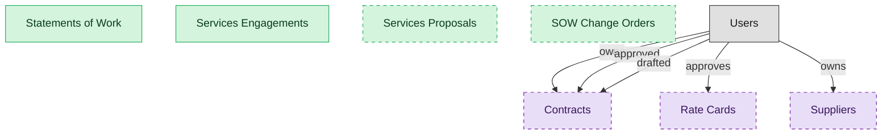

# Services Sourcing and Engagement

## 1. Overview

The pre-delivery surface: author the statement of work, take in services proposals, stand up the engagement against the supplier and the contract, and amend scope through change orders. Masters the SOW, the engagement, the proposal, and the change order; consumes the supplier, the contract, and rate cards from their owning domains.

## 2. Entity summary

| Name | data_object | Description |
| --- | --- | --- |
| Services Engagements | `services_engagements` | The active firm-level engagement that executes a statement of work: the spine milestones, deliverables, and invoices bind to, carrying the supplier, the contract reference, and the engagement-scoped scorecard. One supplier can hold several distinct engagements. |
| Services Proposals | `services_proposals` | Bids and proposals a firm submits against a specific statement of work, capturing the proposed scope, approach, and price for evaluation. Optional because some buyers run a SOW off a pre-awarded master agreement without a bid round. |
| SOW Change Orders | `sow_change_orders` | Amendments to an active statement of work that revise scope, schedule, deliverables, or price, tracked through approval so the SOW stays current. Optional because not every engagement amends. |
| Statements of Work | `statements_of_work` | The buyer-side statement of work that scopes outsourced services a firm will deliver: the deliverables, the schedule, the price basis, and the acceptance terms. The headline document the whole engagement hangs off, distinct from the underlying contract that governs it. |
| Contracts | `legal_contracts` | Contracts with counterparties or suppliers, covering type, value, key dates, governing law, and lifecycle from draft to terminated. |
| Rate Cards | `rate_cards` | Pre-agreed bill rates by role, geography, and supplier tier, driving consistent work-order pricing and accounts-payable matching. |
| Suppliers | `suppliers` | Vendor master records, holding legal name, tax id, addresses, payment terms, contacts, currency, status, and risk profile. |

## 3. Entities catalog

| # | data_object | canonical code | singular | plural | role | mastered in | mastered label | necessity | pattern flags | entity_type | write tier | notes |
| ---: | --- | --- | --- | --- | --- | --- | --- | --- | --- | --- | --- | --- |
| 1 | `services_engagements` | `services_engagements` | Services Engagement | Services Engagements | master | - | - | required | - | operational_workflow | `:manage` | - |
| 2 | `services_proposals` | `services_proposals` | Services Proposal | Services Proposals | master | - | - | optional | - | operational_workflow | `:manage` | - |
| 3 | `sow_change_orders` | `sow_change_orders` | SOW Change Order | SOW Change Orders | master | - | - | optional | single_approver | operational_workflow | `:manage` | - |
| 4 | `statements_of_work` | `statements_of_work` | Statement of Work | Statements of Work | master | - | - | required | - | operational_workflow | `:manage` | - |
| 5 | `legal_contracts` | `legal_contracts` | Contract | Contracts | consumer | `clm-repository` | Contract Repository | optional | personal_content, submit_lock | operational_workflow | `:manage` | - |
| 6 | `rate_cards` | `rate_cards` | Rate Card | Rate Cards | consumer | `cwm-worker-sourcing` | Worker Sourcing and Supplier Management | optional | single_approver | catalog | `:admin` | - |
| 7 | `suppliers` | `suppliers` | Supplier | Suppliers | consumer | `srm-supplier-lifecycle` | Supplier Lifecycle Management | optional | personal_content | operational_workflow | `:manage` | - |

## 4. Aliases and industry synonyms

_(none: no industry-scoped aliases for this scope)_

## 5. Relationships

### 5.1 Intra-scope edges

_(none: no relationships with both endpoints inside the scope)_

### 5.2 Built-in edges (`users` and other platform built-ins)

| from | verb | to | cardinality | necessity | owner_side | delete_mode | fk_format | notes |
| --- | --- | --- | --- | --- | --- | --- | --- | --- |
| `users` | owns | `legal_contracts` | one_to_many | optional | source | clear | reference | - |
| `users` | approved | `legal_contracts` | one_to_many | optional | source | clear | reference | - |
| `users` | drafted | `legal_contracts` | one_to_many | optional | source | clear | reference | - |
| `users` | approves | `rate_cards` | one_to_many | optional | source | clear | reference | - |
| `users` | owns | `suppliers` | one_to_many | optional | source | clear | reference | - |

### 5.3 Cross-scope edges

#### 5.3a Outbound from this scope's masters and contributors

_Edges this scope drives: the in-scope endpoint has `role` of `master` or `contributor`._

_(none: no outbound cross-scope edges from this scope's masters or contributors)_

#### 5.3b Context edges on embedded shells and consumed entities

_Edges the canonical owner drives, shown for context: the in-scope endpoint has `role` of `embedded_master`, `consumer`, or `derived`._

| from | verb | to | cardinality | necessity | delete_mode | fk_format | notes |
| --- | --- | --- | --- | --- | --- | --- | --- |
| `audit_findings` | updates | `suppliers` | many_to_many | optional | none | n/a | - |
| `in_house_legal_matters` | references | `legal_contracts` | many_to_many | optional | none | n/a | - |
| `legal_contracts` | governs | `customer_entitlements` | one_to_many | optional | none | n/a | - |
| `legal_contracts` | backs | `customer_subscriptions` | one_to_many | optional | none | n/a | - |
| `pim_products` | sourced_from | `suppliers` | many_to_many | optional | none | n/a | Supplier onboarding feeds attribute data into PIM; the product can have one primary supplier and many alternates. |
| `rate_cards` | prices | `contingent_timesheets` | one_to_many | required | none (required-if-present) | n/a | - |
| `contract_templates` | seeds | `legal_contracts` | one_to_many | optional | none | n/a | - |
| `legal_contracts` | contains | `contract_clauses` | one_to_many | optional | none | n/a | - |
| `legal_contracts` | imposes | `contract_obligations` | one_to_many | required | ⚠ audit: required composed child out of scope | n/a | - |
| `legal_contracts` | witnessed_by | `signature_records` | one_to_many | required | ⚠ audit: required composed child out of scope | n/a | - |
| `legal_contracts` | activates | `saas_subscriptions` | one_to_many | optional | none | n/a | - |
| `legal_contracts` | activates | `software_licenses` | one_to_many | optional | none | n/a | - |
| `sourcing_events` | originates | `legal_contracts` | one_to_many | optional | none | n/a | - |
| `legal_contracts` | triggers_creation_of | `purchase_orders` | one_to_many | optional | none | n/a | - |
| `legal_contracts` | triggers_review_in | `purchase_requisitions` | one_to_many | optional | none | n/a | - |
| `legal_contracts` | propagates_terms_to | `invoice_matches` | one_to_many | optional | none | n/a | - |
| `legal_contracts` | feeds_revrec_in | `revenue_recognition_records` | one_to_many | optional | none | n/a | - |
| `legal_contracts` | seeds | `service_projects` | one_to_many | optional | none | n/a | - |
| `legal_contracts` | renewal_warns | `crm_opportunities` | one_to_many | optional | none | n/a | - |
| `legal_contracts` | renewal_warns | `saas_subscriptions` | one_to_many | optional | none | n/a | - |
| `legal_contracts` | renewed_into | `customer_subscriptions` | one_to_many | optional | none | n/a | - |
| `legal_contracts` | seeds | `agency_jobs` | one_to_many | optional | none | n/a | - |
| `crm_opportunities` | drafts | `legal_contracts` | one_to_many | optional | none | n/a | - |
| `sales_quotes` | drafts | `legal_contracts` | one_to_many | optional | none | n/a | - |
| `contract_drafts` | drafts | `legal_contracts` | one_to_many | optional | none | n/a | - |
| `quote_discounts` | flows into | `legal_contracts` | one_to_many | optional | none | n/a | - |
| `commercial_leases` | flows into | `legal_contracts` | one_to_many | optional | none | n/a | - |
| `engagement_letters` | flows into | `legal_contracts` | one_to_many | optional | none | n/a | - |
| `staffing_suppliers` | publishes | `rate_cards` | one_to_many | required | ⚠ audit: required composed child out of scope | n/a | - |
| `suppliers` | reconciles | `staffing_suppliers` | one_to_many | optional | none | n/a | - |
| `suppliers` | undergoes | `supplier_onboardings` | one_to_many | required | ⚠ audit: required composed child out of scope | n/a | - |
| `suppliers` | holds | `supplier_qualifications` | one_to_many | optional | none | n/a | - |
| `suppliers` | holds | `supplier_certifications` | one_to_many | optional | none | n/a | - |
| `suppliers` | assessed_by | `supplier_risk_assessments` | one_to_many | optional | none | n/a | - |
| `suppliers` | rated_by | `supplier_scorecards` | one_to_many | optional | none | n/a | - |
| `suppliers` | enables | `sourcing_events` | one_to_many | optional | none | n/a | - |
| `suppliers` | propagates_bank_change_to | `payment_runs` | one_to_many | optional | none | n/a | - |
| `supplier_golden_records` | resolves to | `suppliers` | one_to_many | optional | none | n/a | - |
| `engineering_parts` | sourced_from | `suppliers` | many_to_many | optional | none | n/a | - |
| `suppliers` | submits | `product_compliance_declarations` | one_to_many | required | none (required-if-present) | n/a | - |
| `legal_contracts` | is amended by | `contract_amendments` | one_to_many | optional | none | n/a | - |
| `legal_contracts` | is renewed by | `contract_renewal_records` | one_to_many | optional | none | n/a | - |
| `legal_contracts` | is assessed by | `contract_risk_assessments` | one_to_many | optional | none | n/a | - |
| `contract_counterparties` | is party to | `legal_contracts` | one_to_many | optional | none | n/a | - |
| `legal_contracts` | has milestone | `contract_milestones` | one_to_many | optional | none | n/a | - |
| `legal_contracts` | has data protection addendum | `data_protection_addenda` | one_to_many | optional | none | n/a | - |
| `legal_contracts` | is negotiated in | `contract_negotiation_threads` | one_to_many | optional | none | n/a | - |

## 6. Cross-domain context

### 6.1 Master consumers (other modules / domains that embed this scope's masters)

_(none: no other module embeds this scope's masters; the canonical owners do.)_

### 6.2 Outbound handoffs (events this scope publishes)

_(none: no outbound handoffs whose payload is in this scope)_

### 6.3 Inbound handoffs (events this scope reacts to)

_(none: no inbound handoffs whose payload is in this scope)_

### 6.4 Master providers (modules / domains that own masters this scope embeds)

| data_object | role here | necessity | canonical owner(s) | slice notes |
| --- | --- | --- | --- | --- |
| `legal_contracts` | consumer | optional | CLM-REPOSITORY (CLM) | - |
| `rate_cards` | consumer | optional | CWM-WORKER-SOURCING (CWM) | - |
| `suppliers` | consumer | optional | SRM-SUPPLIER-LIFECYCLE (SRM) | - |

## 7. Lifecycle states

### `legal_contracts` (Contract)

_This scope holds `legal_contracts` as **consumer**; the canonical state machine is owned by `CLM-REPOSITORY`._

| order | state_name | initial? | terminal? | requires_permission? | derived gate | description |
| --- | --- | --- | --- | --- | --- | --- |
| 10 | `draft` | ✓ | - | - | - | Initial draft created in CLM-AUTHORING from a template, or received via inbound handoff from CPQ/sourcing. |
| 20 | `in_review` | - | - | - | - | Draft has been routed for internal review prior to counterparty exchange. |
| 30 | `in_negotiation` | - | - | - | - | Active counterparty negotiation with track-changes / redline exchange. |
| 40 | `approved` | - | - | ✓ | `clm-negotiation:approve_legal_contract` | Final negotiated text approved by all internal stakeholders; ready for signature. |
| 50 | `out_for_signature` | - | - | - | - | Signature envelope dispatched to all required signers. |
| 60 | `signed` | - | - | ✓ | `clm-repository:execute_legal_contract` | All signers have signed; contract is fully executed. |
| 70 | `active` | - | - | - | - | Effective date has passed; contract is in force. Default post-signature state. |
| 75 | `amended` | - | - | ✓ | `clm-repository:amend_legal_contract` | An amendment has been executed against this contract. Amendment is a separate record; this contract row reflects the amended terms going forward. |
| 80 | `expired` | - | ✓ | - | - | End date passed without renewal or termination. Terminal state. |
| 90 | `terminated` | - | ✓ | ✓ | `clm-repository:terminate_legal_contract` | Contract terminated before end date (by mutual consent, breach, or for-cause). Terminal state. |
| 100 | `renewed` | - | ✓ | ✓ | `clm-renewal:renew_legal_contract` | Renewed via a new contract record (or extended via amendment). The renewal is a separate record; this row is terminal. |

### `rate_cards` (Rate Card)

_This scope holds `rate_cards` as **consumer**; the canonical state machine is owned by `CWM-WORKER-SOURCING`._

| order | state_name | initial? | terminal? | requires_permission? | derived gate | description |
| --- | --- | --- | --- | --- | --- | --- |
| 10 | `draft` | ✓ | - | - | - | - |
| 20 | `published` | - | - | ✓ | `cwm-worker-sourcing:publish_rate_card` | - |
| 30 | `superseded` | - | - | - | - | - |
| 40 | `retired` | - | ✓ | ✓ | `cwm-worker-sourcing:retire_rate_card` | - |

## 8. Permissions and business rules (derived)

### 8.1 Permissions

| permission | tier | description | included in `:admin`? |
| --- | --- | --- | --- |
| `svcs-proc-engagement:read` | baseline-read | Read access to every entity in the module | ✓ |
| `svcs-proc-engagement:manage` | baseline-manage | Edit operational records | ✓ |
| `svcs-proc-engagement:admin` | baseline-admin | Edit reference data and inherit every workflow gate below | - |

### 8.2 Business rules

| rule_name | data_object | source flag | intent |
| --- | --- | --- | --- |
| `approve_sow_change_order_requires_approver` | `sow_change_orders` | has_single_approver | Exactly one explicit approver required; uses the module's approval gate (`svcs-proc-engagement:approve_sow_change_order` if surfaced as a lifecycle workflow gate). |

## 9. Roles, RACI, and responsibilities (derived)

_Baseline roles, the permission hierarchy, and RACI realization are DERIVED from this scope's entity-type write tiers + `process_raci`; none of it is stored in the catalog (the deployer provisions it from this blueprint)._

### 9.1 `SVCS-PROC-ENGAGEMENT`

**Baseline roles:**

| role | baseline grant |
| --- | --- |
| `svcs-proc-engagement_viewer` | `svcs-proc-engagement:read` |
| `svcs-proc-engagement_manager` | `svcs-proc-engagement:manage` |

**Permission hierarchy:**

| permission | includes |
| --- | --- |
| `svcs-proc-engagement:admin` | `svcs-proc-engagement:manage` |
| `svcs-proc-engagement:manage` | `svcs-proc-engagement:read` |

**RACI realization:**

_(none: no process_raci assignments wired to this module's gated processes yet)_

### 9.2 Functional ownership and default grants

_(none: no business_function_domains rows for this scope's domain)_
