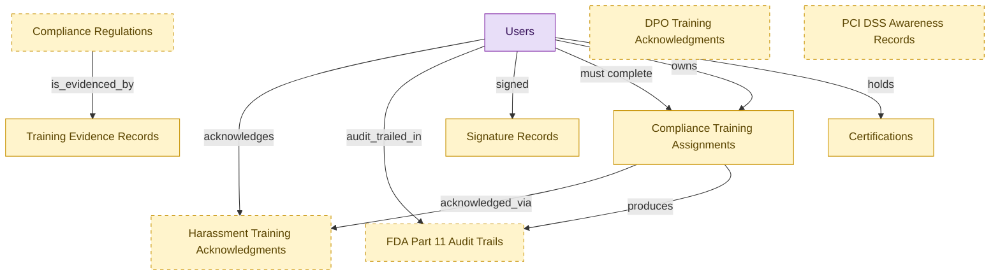

# Training Records (Compliance Documentation Starter)

## 1. Overview

Deployable starter kit for small and mid-market organizations that outsource training delivery to external vendors (EasyLlama, Traliant, Ethena, NAVEX, KnowBe4) and need to retain audit-ready evidence in their own catalog. Embeds compliance assignments, training evidence records, learner certifications, signature records, and per-regulation training records from the full LMS-COMPLIANCE-TRAINING and LMS-CREDENTIALS modules; deploys standalone without requiring the full LMS substrate. Buyer persona: HR Director or Compliance Officer at a 50 to 500 person organization. When the org later adopts the full LMS, embedded shells deterministically demote to consumer.

## 2. Entity summary

| Name | data_object | Description |
| --- | --- | --- |
| Certifications | `learner_certifications` | Issued credential against a worker (internal certification, vendor cert, regulatory cert) with issue date, expiry, issuing body, and renewal rules. Drives recertification campaigns. |
| Compliance Regulations | `compliance_regulations` | Tenant-scoped reference table of statutes a tenant is subject to (jurisdiction, citation, retention period). Each tenant activates only its applicable subset; the regulation field on training_evidence_records is an FK into this table, and the active rows gate which compliance evidence applies. |
| Compliance Training Assignments | `compliance_assignments` | Mandatory training assignment tied to a regulation, role, location, or hire-event (anti-harassment, AML, GDPR, OSHA, HIPAA). Carries due date, escalation policy, audit log. |
| DPO Training Acknowledgments | `dpo_training_acknowledgements` | Data-protection-officer training acknowledgment record (GDPR Art. 39). |
| FDA Part 11 Audit Trails | `fda_part11_audit_trails` | 21 CFR Part 11 audit trail row for GxP-relevant training; tamper-evident, retention-locked. |
| Harassment Training Acknowledgments | `harassment_training_acknowledgements` | Statutory acknowledgment of harassment training completion per CA SB-1343, NY 201-g, IL 2-109; carries signed timestamp and IP. |
| PCI DSS Awareness Records | `pci_dss_awareness_records` | Card-handler security-awareness training record (PCI DSS 12.6). |
| Signature Records | `signature_records` | E-signature envelope: signing audit trail, IP addresses, external e-signature provider envelope and document reference IDs, and the signed PDF artifact. Distinct from contracts, one contract may have many signature events (counterpart, amendment, renewal). |
| Training Evidence Records | `training_evidence_records` | Inspection-ready evidence package: signed roster, certificate hash, content version, signature record reference. Generated for regulator submission. |
| Users | `users` | Semantius platform-owned user table. Referenced from domain `data_objects` via `data_object_relationships` for assignee / author / approver / creator edges. Not surfaced in domain-level analytics (Signal 1/2 ignore `kind='platform_builtin'`). |

## 3. Entities catalog

| # | data_object | canonical code | singular | plural | role | mastered in | mastered label | necessity | pattern flags | entity_type | write tier | notes |
| ---: | --- | --- | --- | --- | --- | --- | --- | --- | --- | --- | --- | --- |
| 1 | `learner_certifications` | `learner_certifications` | Certification | Certifications | embedded_master | `lms-credentials` | Credentials, Badges and Continuing Education | required | personal_content, submit_lock | operational_workflow | `:manage` | - |
| 2 | `compliance_regulations` | `compliance_regulations` | Compliance Regulation | Compliance Regulations | embedded_master | `lms-compliance-training` | Compliance Training | optional | - | catalog | `:admin` | - |
| 3 | `compliance_assignments` | `compliance_assignments` | Compliance Training Assignment | Compliance Training Assignments | embedded_master | `lms-compliance-training` | Compliance Training | required | personal_content | operational_workflow | `:manage` | - |
| 4 | `dpo_training_acknowledgements` | `dpo_training_acknowledgements` | DPO Training Acknowledgment | DPO Training Acknowledgments | embedded_master | - | - | optional | personal_content | operational_record | `:manage` | - |
| 5 | `fda_part11_audit_trails` | `fda_part11_audit_trails` | FDA Part 11 Audit Trail | FDA Part 11 Audit Trails | embedded_master | `lms-compliance-training` | Compliance Training | optional | personal_content, submit_lock | operational_workflow | `:manage` | - |
| 6 | `harassment_training_acknowledgements` | `harassment_training_acknowledgements` | Harassment Training Acknowledgment | Harassment Training Acknowledgments | embedded_master | `lms-compliance-training` | Compliance Training | optional | personal_content, submit_lock | operational_workflow | `:manage` | - |
| 7 | `pci_dss_awareness_records` | `pci_dss_awareness_records` | PCI DSS Awareness Record | PCI DSS Awareness Records | embedded_master | - | - | optional | personal_content | operational_record | `:manage` | - |
| 8 | `signature_records` | `signature_records` | Signature Record | Signature Records | embedded_master | `clm-repository` | Contract Repository | required | personal_content, submit_lock | operational_workflow | `:manage` | - |
| 9 | `training_evidence_records` | `training_evidence_records` | Training Evidence Record | Training Evidence Records | embedded_master | `lms-compliance-training` | Compliance Training | required | personal_content, submit_lock | operational_workflow | `:manage` | - |
| 10 | `users` | `users` | User | Users | consumer | _(platform built-in)_ | _(platform built-in)_ | required | - | operational_record | `:manage` | - |

## 4. Aliases and industry synonyms

_(none: no industry-scoped aliases for this scope)_

## 5. Relationships

### 5.1 Intra-scope edges

| from | verb | to | cardinality | kind | necessity | owner_side | delete_mode | fk_format | notes |
| --- | --- | --- | --- | --- | --- | --- | --- | --- | --- |
| `compliance_assignments` | acknowledged_via | `harassment_training_acknowledgements` | one_to_many | reference | optional | target | clear | reference | - |
| `compliance_assignments` | produces | `fda_part11_audit_trails` | one_to_many | reference | optional | target | clear | reference | - |
| `compliance_regulations` | is_evidenced_by | `training_evidence_records` | one_to_many | reference | optional | target | clear | reference | - |

### 5.2 Built-in edges (`users` and other platform built-ins)

| from | verb | to | cardinality | necessity | owner_side | delete_mode | fk_format | notes |
| --- | --- | --- | --- | --- | --- | --- | --- | --- |
| `users` | acknowledges | `harassment_training_acknowledgements` | one_to_many | required | source | restrict | reference | - |
| `users` | audit_trailed_in | `fda_part11_audit_trails` | one_to_many | optional | source | clear | reference | - |
| `users` | signed | `signature_records` | one_to_many | optional | source | clear | reference | - |
| `users` | must complete | `compliance_assignments` | one_to_many | required | source | restrict | reference | - |
| `users` | owns | `compliance_assignments` | one_to_many | optional | source | clear | reference | - |
| `users` | holds | `learner_certifications` | one_to_many | required | source | restrict | reference | - |

### 5.3 Cross-scope edges

#### 5.3a Outbound from this scope's masters and contributors

_Edges this scope drives: the in-scope endpoint has `role` of `master` or `contributor`._

_(none: no outbound cross-scope edges from this scope's masters or contributors)_

#### 5.3b Context edges on embedded shells and consumed entities

_Edges the canonical owner drives, shown for context: the in-scope endpoint has `role` of `embedded_master`, `consumer`, or `derived`._

| from | verb | to | cardinality | necessity | delete_mode | fk_format | notes |
| --- | --- | --- | --- | --- | --- | --- | --- |
| `certification_definitions` | instantiated_as | `learner_certifications` | one_to_many | required | none (required-if-present) | n/a | - |
| `certificate_templates` | renders | `learner_certifications` | one_to_many | optional | none | n/a | - |
| `compliance_training_campaigns` | generates | `compliance_assignments` | one_to_many | required | ⚠ audit: required composed child out of scope | n/a | - |
| `compliance_assignments` | evidences | `compliance_audit_records` | one_to_many | optional | none | n/a | - |
| `compliance_audit_records` | rolled_into | `training_evidence_records` | one_to_many | optional | none | n/a | - |
| `training_evidence_records` | supplies | `regulator_filing_exports` | many_to_many | optional | none | n/a | - |
| `automated_enrollment_rules` | creates | `compliance_assignments` | one_to_many | optional | none | n/a | - |
| `compliance_assignments` | escalates_via | `manager_nudges` | one_to_many | optional | none | n/a | - |
| `legal_contracts` | witnessed_by | `signature_records` | one_to_many | required | ⚠ audit: required composed child out of scope | n/a | - |
| `courses` | fulfills | `compliance_assignments` | one_to_many | optional | none | n/a | - |
| `courses` | grants | `learner_certifications` | one_to_many | optional | none | n/a | - |
| `skill_profiles` | updated by | `learner_certifications` | one_to_many | optional | none | n/a | - |
| `hcm_positions` | requires | `compliance_assignments` | one_to_many | optional | none | n/a | - |
| `org_units` | sponsors | `compliance_assignments` | one_to_many | optional | none | n/a | - |
| `compliance_obligations` | tracked by | `compliance_assignments` | one_to_many | optional | none | n/a | - |
| `compliance_assignments` | triggers | `iga_provisioning_events` | one_to_many | optional | none | n/a | - |
| `employees` | reflected on | `compliance_assignments` | one_to_many | optional | none | n/a | - |
| `envelopes` | yields | `signature_records` | one_to_many | optional | none | n/a | - |

## 6. Cross-domain context

### 6.1 Master consumers (other modules / domains that embed this scope's masters)

_(none: no other module embeds this scope's masters; the canonical owners do.)_

### 6.2 Outbound handoffs (events this scope publishes)

| source module | target domain | target module | trigger_event | transition | payload | integration | friction | description |
| --- | --- | --- | --- | --- | --- | --- | --- | --- |
| LMS-COMPLIANCE-TRAINING | GRC | _(domain-level)_ | `compliance_assignment.completed` | _(lifecycle)_ | `compliance_assignments` | event_stream | low | - |
| LMS-COMPLIANCE-TRAINING | GRC | _(domain-level)_ | `compliance_assignment.due` | _(threshold)_ | `compliance_assignments` | event_stream | medium | GRC obligation tracker updates the per-employee compliance status to 'due' so the regulator-evidence dashboard reflects the impending breach risk. Drives audit-evidence reporting (e.g., Compliance Operations dashboard). |
| LMS-COMPLIANCE-TRAINING | GRC | _(domain-level)_ | `compliance_assignment.expired` | _(threshold)_ | `compliance_assignments` | event_stream | high | - |
| LMS-COMPLIANCE-TRAINING | GRC | _(domain-level)_ | `compliance_assignment.overdue` | _(threshold)_ | `compliance_assignments` | event_stream | high | Compliance training overdue is a control failure; GRC tracks obligation status, IGA may suspend high-risk access. |
| LMS-COMPLIANCE-TRAINING | GRC | _(domain-level)_ | `training_evidence_record.submitted` | _(lifecycle)_ | `training_evidence_records` | event_stream | low | - |
| LMS-COMPLIANCE-TRAINING | HRSD | HRSD-CASE-MGMT | `compliance_assignment.due` | _(threshold)_ | `compliance_assignments` | api_call | medium | HR Service Delivery opens (or updates) an employee-facing case/task with the impending obligation, deadline, and link to the assigned course. Failure mode: when an HRSD platform isn't deployed, the nudge falls back to direct email and the in-tool reminder. |
| LMS-COMPLIANCE-TRAINING | IGA | IGA-AUTO-PROVISIONING | `compliance_assignment.expired` | _(threshold)_ | `compliance_assignments` | api_call | high | - |
| LMS-COMPLIANCE-TRAINING | IGA | IGA-AUTO-PROVISIONING | `compliance_assignment.overdue` | _(threshold)_ | `compliance_assignments` | api_call | high | Severe overdue (PCI, HIPAA, SOX-relevant) may auto-suspend system access pending completion. Alert-without-feedback-loop common. |
| LMS-CREDENTIALS | IGA | IGA-AUTO-PROVISIONING | `learner_certification.expired` | _(threshold)_ | `learner_certifications` | api_call | high | - |
| LMS-CREDENTIALS | IGA | IGA-AUTO-PROVISIONING | `learner_certification.renewed` | _(lifecycle)_ | `learner_certifications` | api_call | medium | - |
| LMS-CREDENTIALS | IGA | IGA-AUTO-PROVISIONING | `learner_certification.revoked` | _(lifecycle)_ | `learner_certifications` | api_call | high | - |
| LMS-COMPLIANCE-TRAINING | HCM | HCM-LIFECYCLE-WORKFLOWS | `compliance_assignment.due` | _(threshold)_ | `compliance_assignments` | event_stream | medium | Compliance assignment due-date nudges to HCM-mastered manager/employee record. HCM surfaces the impending obligation on the employee profile and routes a reminder to the line manager. |
| LMS-COMPLIANCE-TRAINING | LMS | LMS-AUTOMATION | `compliance_assignment.overdue` | _(threshold)_ | `compliance_assignments` | lifecycle_progression | low | - |

### 6.3 Inbound handoffs (events this scope reacts to)

| target module | source domain | source module | trigger_event | transition | payload | integration | friction | description |
| --- | --- | --- | --- | --- | --- | --- | --- | --- |
| CLM-REPOSITORY | CLM | CLM-NEGOTIATION | `signature_record.completed` | _(state_change)_ | `signature_records` | lifecycle_progression | low | Signature envelope completion in negotiation hands the executed envelope to the repository for persistence. Intra-domain lifecycle progression; the signed document gets indexed and the linked legal_contract transitions out_for_signature -> signed. |

### 6.4 Master providers (modules / domains that own masters this scope embeds)

| data_object | role here | necessity | canonical owner(s) | slice notes |
| --- | --- | --- | --- | --- |
| `compliance_assignments` | embedded_master | required | LMS-COMPLIANCE-TRAINING (LMS) | - |
| `compliance_regulations` | embedded_master | optional | LMS-COMPLIANCE-TRAINING (LMS) | - |
| `dpo_training_acknowledgements` | embedded_master | optional | _(no canonical owner recorded)_ | - |
| `fda_part11_audit_trails` | embedded_master | optional | LMS-COMPLIANCE-TRAINING (LMS) | - |
| `harassment_training_acknowledgements` | embedded_master | optional | LMS-COMPLIANCE-TRAINING (LMS) | - |
| `learner_certifications` | embedded_master | required | LMS-CREDENTIALS (LMS) | - |
| `pci_dss_awareness_records` | embedded_master | optional | _(no canonical owner recorded)_ | - |
| `signature_records` | embedded_master | required | CLM-REPOSITORY (CLM) | - |
| `training_evidence_records` | embedded_master | required | LMS-COMPLIANCE-TRAINING (LMS) | - |
| `users` | consumer | required | _(platform built-in)_ | - |

## 7. Lifecycle states

### `compliance_assignments` (Compliance Training Assignment)

_This scope holds `compliance_assignments` as **embedded_master**; the canonical state machine is owned by `LMS-COMPLIANCE-TRAINING`._

| order | state_name | initial? | terminal? | requires_permission? | derived gate | description |
| --- | --- | --- | --- | --- | --- | --- |
| 1 | `assigned` | ✓ | - | - | - | Mandatory training assignment created for a learner with due date. |
| 2 | `in_progress` | - | - | - | - | Learner has started the underlying course or activity. |
| 3 | `completed` | - | ✓ | ✓ | `training-records-starter:complete` | Learner finished the assignment within the due window. |
| 4 | `overdue` | - | - | - | - | Due date passed without completion and escalation policy engaged. |
| 5 | `waived` | - | ✓ | ✓ | `training-records-starter:waive` | Assignment formally waived by compliance owner with audit reason. |
| 6 | `expired` | - | ✓ | ✓ | `training-records-starter:expire` | Assignment closed unmet at the regulatory deadline. |

### `fda_part11_audit_trails` (FDA Part 11 Audit Trail)

_This scope holds `fda_part11_audit_trails` as **embedded_master**; the canonical state machine is owned by `LMS-COMPLIANCE-TRAINING`._

| order | state_name | initial? | terminal? | requires_permission? | derived gate | description |
| --- | --- | --- | --- | --- | --- | --- |
| 1 | `recorded` | ✓ | - | - | - | - |
| 2 | `validated` | - | - | ✓ | `training-records-starter:validate` | - |
| 3 | `archived` | - | ✓ | ✓ | `training-records-starter:archive` | - |

### `harassment_training_acknowledgements` (Harassment Training Acknowledgment)

_This scope holds `harassment_training_acknowledgements` as **embedded_master**; the canonical state machine is owned by `LMS-COMPLIANCE-TRAINING`._

| order | state_name | initial? | terminal? | requires_permission? | derived gate | description |
| --- | --- | --- | --- | --- | --- | --- |
| 1 | `pending` | ✓ | - | - | - | - |
| 2 | `acknowledged` | - | - | ✓ | `training-records-starter:acknowledge` | - |
| 3 | `archived` | - | ✓ | ✓ | `training-records-starter:archive` | - |

### `learner_certifications` (Certification)

_This scope holds `learner_certifications` as **embedded_master**; the canonical state machine is owned by `LMS-CREDENTIALS`._

| order | state_name | initial? | terminal? | requires_permission? | derived gate | description |
| --- | --- | --- | --- | --- | --- | --- |
| 1 | `issued` | ✓ | - | ✓ | `training-records-starter:issue` | Credential awarded to the learner with issue and expiry dates. |
| 2 | `active` | - | - | - | - | Credential in force and valid for compliance or role requirements. |
| 3 | `renewing` | - | - | - | - | Recertification campaign engaged before expiry. |
| 4 | `renewed` | - | - | ✓ | `training-records-starter:renew` | Credential renewed with a fresh validity window. |
| 5 | `expired` | - | ✓ | - | - | Credential past its expiry date and no longer valid. |
| 6 | `revoked` | - | ✓ | ✓ | `training-records-starter:revoke` | Credential withdrawn by the issuing body or L&D for cause. |

### `signature_records` (Signature Record)

_This scope holds `signature_records` as **embedded_master**; the canonical state machine is owned by `CLM-REPOSITORY`._

| order | state_name | initial? | terminal? | requires_permission? | derived gate | description |
| --- | --- | --- | --- | --- | --- | --- |
| 10 | `pending` | ✓ | - | - | - | Signature envelope created but not yet dispatched. |
| 20 | `sent` | - | - | - | - | Envelope dispatched to first signer(s); awaiting first signature. |
| 30 | `in_progress` | - | - | - | - | One or more signers have signed; others remain. |
| 40 | `completed` | - | ✓ | - | - | All required signers have signed. The signed contract document is persisted. Terminal positive outcome. |
| 50 | `declined` | - | ✓ | - | - | A signer declined to sign. Envelope is terminal; a new envelope can be created if negotiation re-opens. |
| 60 | `voided` | - | ✓ | ✓ | `training-records-starter:void_signature_record` | Sender voided the envelope before all signers completed. Terminal. |

### `training_evidence_records` (Training Evidence Record)

_This scope holds `training_evidence_records` as **embedded_master**; the canonical state machine is owned by `LMS-COMPLIANCE-TRAINING`._

| order | state_name | initial? | terminal? | requires_permission? | derived gate | description |
| --- | --- | --- | --- | --- | --- | --- |
| 1 | `drafted` | ✓ | - | - | - | - |
| 2 | `finalized` | - | - | ✓ | `training-records-starter:finalize` | - |
| 3 | `submitted` | - | - | ✓ | `training-records-starter:submit` | - |
| 4 | `archived` | - | ✓ | ✓ | `training-records-starter:archive` | - |

## 8. Permissions and business rules (derived)

### 8.1 Permissions

| permission | tier | description | included in `:admin`? |
| --- | --- | --- | --- |
| `training-records-starter:read` | baseline-read | Read access to every entity in the module | ✓ |
| `training-records-starter:manage` | baseline-manage | Edit operational records | ✓ |
| `training-records-starter:admin` | baseline-admin | Edit reference data and inherit every workflow gate below | - |
| `training-records-starter:void_signature_record` | workflow-gate (lifecycle) | Transition `signature_records` into state `voided` | ✓ |
| `training-records-starter:issue` | workflow-gate (lifecycle) | Transition `learner_certifications` into state `issued` | ✓ |
| `training-records-starter:renew` | workflow-gate (lifecycle) | Transition `learner_certifications` into state `renewed` | ✓ |
| `training-records-starter:revoke` | workflow-gate (lifecycle) | Transition `learner_certifications` into state `revoked` | ✓ |
| `training-records-starter:complete` | workflow-gate (lifecycle) | Transition `compliance_assignments` into state `completed` | ✓ |
| `training-records-starter:waive` | workflow-gate (lifecycle) | Transition `compliance_assignments` into state `waived` | ✓ |
| `training-records-starter:expire` | workflow-gate (lifecycle) | Transition `compliance_assignments` into state `expired` | ✓ |
| `training-records-starter:finalize` | workflow-gate (lifecycle) | Transition `training_evidence_records` into state `finalized` | ✓ |
| `training-records-starter:submit` | workflow-gate (lifecycle) | Transition `training_evidence_records` into state `submitted` | ✓ |
| `training-records-starter:archive` | workflow-gate (lifecycle) | Transition `training_evidence_records` into state `archived` | ✓ |
| `training-records-starter:acknowledge` | workflow-gate (lifecycle) | Transition `harassment_training_acknowledgements` into state `acknowledged` | ✓ |
| `training-records-starter:validate` | workflow-gate (lifecycle) | Transition `fda_part11_audit_trails` into state `validated` | ✓ |
| `training-records-starter:view_all_compliance_training_assignments` | override (personal_content) | View all `compliance_assignments` rows beyond row-scope | ✓ |
| `training-records-starter:manage_all_compliance_training_assignments` | override (personal_content) | Manage all `compliance_assignments` rows beyond row-scope | ✓ |
| `training-records-starter:view_all_training_evidence_records` | override (personal_content) | View all `training_evidence_records` rows beyond row-scope | ✓ |
| `training-records-starter:manage_all_training_evidence_records` | override (personal_content) | Manage all `training_evidence_records` rows beyond row-scope | ✓ |
| `training-records-starter:submit_training_evidence_record` | override (submit_lock) | Submit and lock a `training_evidence_records` row (post-submit edits gated) | ✓ |
| `training-records-starter:view_all_signature_records` | override (personal_content) | View all `signature_records` rows beyond row-scope | ✓ |
| `training-records-starter:manage_all_signature_records` | override (personal_content) | Manage all `signature_records` rows beyond row-scope | ✓ |
| `training-records-starter:submit_signature_record` | override (submit_lock) | Submit and lock a `signature_records` row (post-submit edits gated) | ✓ |
| `training-records-starter:view_all_certifications` | override (personal_content) | View all `learner_certifications` rows beyond row-scope | ✓ |
| `training-records-starter:manage_all_certifications` | override (personal_content) | Manage all `learner_certifications` rows beyond row-scope | ✓ |
| `training-records-starter:submit_certification` | override (submit_lock) | Submit and lock a `learner_certifications` row (post-submit edits gated) | ✓ |
| `training-records-starter:view_all_harassment_training_acknowledgments` | override (personal_content) | View all `harassment_training_acknowledgements` rows beyond row-scope | ✓ |
| `training-records-starter:manage_all_harassment_training_acknowledgments` | override (personal_content) | Manage all `harassment_training_acknowledgements` rows beyond row-scope | ✓ |
| `training-records-starter:submit_harassment_training_acknowledgment` | override (submit_lock) | Submit and lock a `harassment_training_acknowledgements` row (post-submit edits gated) | ✓ |
| `training-records-starter:view_all_fda_part_11_audit_trails` | override (personal_content) | View all `fda_part11_audit_trails` rows beyond row-scope | ✓ |
| `training-records-starter:manage_all_fda_part_11_audit_trails` | override (personal_content) | Manage all `fda_part11_audit_trails` rows beyond row-scope | ✓ |
| `training-records-starter:submit_fda_part_11_audit_trail` | override (submit_lock) | Submit and lock a `fda_part11_audit_trails` row (post-submit edits gated) | ✓ |
| `training-records-starter:view_all_dpo_training_acknowledgments` | override (personal_content) | View all `dpo_training_acknowledgements` rows beyond row-scope | ✓ |
| `training-records-starter:manage_all_dpo_training_acknowledgments` | override (personal_content) | Manage all `dpo_training_acknowledgements` rows beyond row-scope | ✓ |
| `training-records-starter:view_all_pci_dss_awareness_records` | override (personal_content) | View all `pci_dss_awareness_records` rows beyond row-scope | ✓ |
| `training-records-starter:manage_all_pci_dss_awareness_records` | override (personal_content) | Manage all `pci_dss_awareness_records` rows beyond row-scope | ✓ |

### 8.2 Business rules

| rule_name | data_object | source flag | intent |
| --- | --- | --- | --- |
| `compliance_training_assignment_edit_scope` | `compliance_assignments` | has_personal_content | Row-scope by default; override via `training-records-starter:view_all_compliance_training_assignments` / `training-records-starter:manage_all_compliance_training_assignments` |
| `training_evidence_record_edit_scope` | `training_evidence_records` | has_personal_content | Row-scope by default; override via `training-records-starter:view_all_training_evidence_records` / `training-records-starter:manage_all_training_evidence_records` |
| `submit_restricted_to_training_evidence_record_owner` | `training_evidence_records` | has_submit_lock | Only the row's authoring user can submit; post-submit the row is read-only except via `training-records-starter:manage_all_training_evidence_records` |
| `signature_record_edit_scope` | `signature_records` | has_personal_content | Row-scope by default; override via `training-records-starter:view_all_signature_records` / `training-records-starter:manage_all_signature_records` |
| `submit_restricted_to_signature_record_owner` | `signature_records` | has_submit_lock | Only the row's authoring user can submit; post-submit the row is read-only except via `training-records-starter:manage_all_signature_records` |
| `certification_edit_scope` | `learner_certifications` | has_personal_content | Row-scope by default; override via `training-records-starter:view_all_certifications` / `training-records-starter:manage_all_certifications` |
| `submit_restricted_to_certification_owner` | `learner_certifications` | has_submit_lock | Only the row's authoring user can submit; post-submit the row is read-only except via `training-records-starter:manage_all_certifications` |
| `harassment_training_acknowledgment_edit_scope` | `harassment_training_acknowledgements` | has_personal_content | Row-scope by default; override via `training-records-starter:view_all_harassment_training_acknowledgments` / `training-records-starter:manage_all_harassment_training_acknowledgments` |
| `submit_restricted_to_harassment_training_acknowledgment_owner` | `harassment_training_acknowledgements` | has_submit_lock | Only the row's authoring user can submit; post-submit the row is read-only except via `training-records-starter:manage_all_harassment_training_acknowledgments` |
| `fda_part_11_audit_trail_edit_scope` | `fda_part11_audit_trails` | has_personal_content | Row-scope by default; override via `training-records-starter:view_all_fda_part_11_audit_trails` / `training-records-starter:manage_all_fda_part_11_audit_trails` |
| `submit_restricted_to_fda_part_11_audit_trail_owner` | `fda_part11_audit_trails` | has_submit_lock | Only the row's authoring user can submit; post-submit the row is read-only except via `training-records-starter:manage_all_fda_part_11_audit_trails` |
| `dpo_training_acknowledgment_edit_scope` | `dpo_training_acknowledgements` | has_personal_content | Row-scope by default; override via `training-records-starter:view_all_dpo_training_acknowledgments` / `training-records-starter:manage_all_dpo_training_acknowledgments` |
| `pci_dss_awareness_record_edit_scope` | `pci_dss_awareness_records` | has_personal_content | Row-scope by default; override via `training-records-starter:view_all_pci_dss_awareness_records` / `training-records-starter:manage_all_pci_dss_awareness_records` |

## 9. Roles, RACI, and responsibilities (derived)

_Baseline roles, the permission hierarchy, and RACI realization are DERIVED from this scope's entity-type write tiers + `process_raci`; none of it is stored in the catalog (the deployer provisions it from this blueprint)._

### 9.1 `TRAINING-RECORDS-STARTER`

**Baseline roles:**

| role | baseline grant |
| --- | --- |
| `training-records-starter_viewer` | `training-records-starter:read` |
| `training-records-starter_manager` | `training-records-starter:manage` |

**Permission hierarchy:**

| permission | includes |
| --- | --- |
| `training-records-starter:admin` | `training-records-starter:manage` |
| `training-records-starter:manage` | `training-records-starter:read` |
| `training-records-starter:admin` | `training-records-starter:void_signature_record` |
| `training-records-starter:admin` | `training-records-starter:issue` |
| `training-records-starter:admin` | `training-records-starter:renew` |
| `training-records-starter:admin` | `training-records-starter:revoke` |
| `training-records-starter:admin` | `training-records-starter:complete` |
| `training-records-starter:admin` | `training-records-starter:waive` |
| `training-records-starter:admin` | `training-records-starter:expire` |
| `training-records-starter:admin` | `training-records-starter:finalize` |
| `training-records-starter:admin` | `training-records-starter:submit` |
| `training-records-starter:admin` | `training-records-starter:archive` |
| `training-records-starter:admin` | `training-records-starter:acknowledge` |
| `training-records-starter:admin` | `training-records-starter:validate` |
| `training-records-starter:admin` | `training-records-starter:view_all_compliance_training_assignments` |
| `training-records-starter:admin` | `training-records-starter:manage_all_compliance_training_assignments` |
| `training-records-starter:admin` | `training-records-starter:view_all_training_evidence_records` |
| `training-records-starter:admin` | `training-records-starter:manage_all_training_evidence_records` |
| `training-records-starter:admin` | `training-records-starter:submit_training_evidence_record` |
| `training-records-starter:admin` | `training-records-starter:view_all_signature_records` |
| `training-records-starter:admin` | `training-records-starter:manage_all_signature_records` |
| `training-records-starter:admin` | `training-records-starter:submit_signature_record` |
| `training-records-starter:admin` | `training-records-starter:view_all_certifications` |
| `training-records-starter:admin` | `training-records-starter:manage_all_certifications` |
| `training-records-starter:admin` | `training-records-starter:submit_certification` |
| `training-records-starter:admin` | `training-records-starter:view_all_harassment_training_acknowledgments` |
| `training-records-starter:admin` | `training-records-starter:manage_all_harassment_training_acknowledgments` |
| `training-records-starter:admin` | `training-records-starter:submit_harassment_training_acknowledgment` |
| `training-records-starter:admin` | `training-records-starter:view_all_fda_part_11_audit_trails` |
| `training-records-starter:admin` | `training-records-starter:manage_all_fda_part_11_audit_trails` |
| `training-records-starter:admin` | `training-records-starter:submit_fda_part_11_audit_trail` |
| `training-records-starter:admin` | `training-records-starter:view_all_dpo_training_acknowledgments` |
| `training-records-starter:admin` | `training-records-starter:manage_all_dpo_training_acknowledgments` |
| `training-records-starter:admin` | `training-records-starter:view_all_pci_dss_awareness_records` |
| `training-records-starter:admin` | `training-records-starter:manage_all_pci_dss_awareness_records` |

**Processes wired:**

| process_key | process_name | PCF code | PCF ID | level | description |
| --- | --- | --- | --- | --- | --- |
| `manage_contracts` | Manage contracts | 4.2.3.4 | 10291 | 4 | Keeping contracts up-to-date with routine evaluation. Maintain order and discipline with the contracts in order to avoid any loss of information and mishaps. |
| `manage_examinations` | Manage examinations and certifications | 7.3.4.6 | 20125 | 4 | Managing identified training programs for employees. Engage with industries to provide certifications, administer certification test, and maintain active certification. |
| `train_employees_appropriate` | Train employees on appropriate regulatory requirements | 2.1.3.5.1 | 12772 | 5 | Conducting training and impart learning to existing and new employees. Training will relate to the most recent/enforced regulations of the business to meet Manage regulatory requirements [12771]. |

**RACI realization:**

| actor | kind | raci | process_key | realization |
| --- | --- | --- | --- | --- |
| `CONTRACT-OPS-SPECIALIST` | persona | responsible | `manage_contracts` | grant gates [training-records-starter:void_signature_record] + the gated entities' write tier |
| `CONTRACT-OPS-MANAGER` | persona | accountable | `manage_contracts` | approval gate |
| `LEGAL-COUNSEL` | persona | consulted | `manage_contracts` | advisory read grant |
| `LD-LEARNING-ADMIN` | persona | responsible | `manage_examinations` | grant gates [training-records-starter:issue] + the gated entities' write tier |
| `GRC-COMPLIANCE-TRAINING-MANAGER` | persona | accountable | `manage_examinations` | approval gate |
| `LD-INSTRUCTOR` | persona | consulted | `manage_examinations` | advisory read grant |
| `GRC-COMPLIANCE-TRAINING-MANAGER` | persona | responsible | `train_employees_appropriate` | grant gates [training-records-starter:complete, training-records-starter:submit] + the gated entities' write tier |
| `GRC-COMPLIANCE-TRAINING-MANAGER` | persona | accountable | `train_employees_appropriate` | approval gate |
| `PEOPLE-MANAGER` | persona | consulted | `train_employees_appropriate` | advisory read grant |
| `LEGAL-COMPLIANCE-SPECIALIST` | persona | informed | `train_employees_appropriate` | notification side effect (trigger_event / webhook_receiver) |

### 9.2 Functional ownership and default grants

| responsibility | business function | default role | default tier |
| --- | --- | --- | --- |
| owner | Learning and Development | `admin` | `:admin` |
| contributor | Governance, Risk and Compliance | `manage` | `:manage` |
| contributor | Legal | `manage` | `:manage` |
| consumer | Manufacturing Operations | `read` | `:read` |
| consumer | Sales | `read` | `:read` |
| consumer | Software Engineering | `read` | `:read` |
