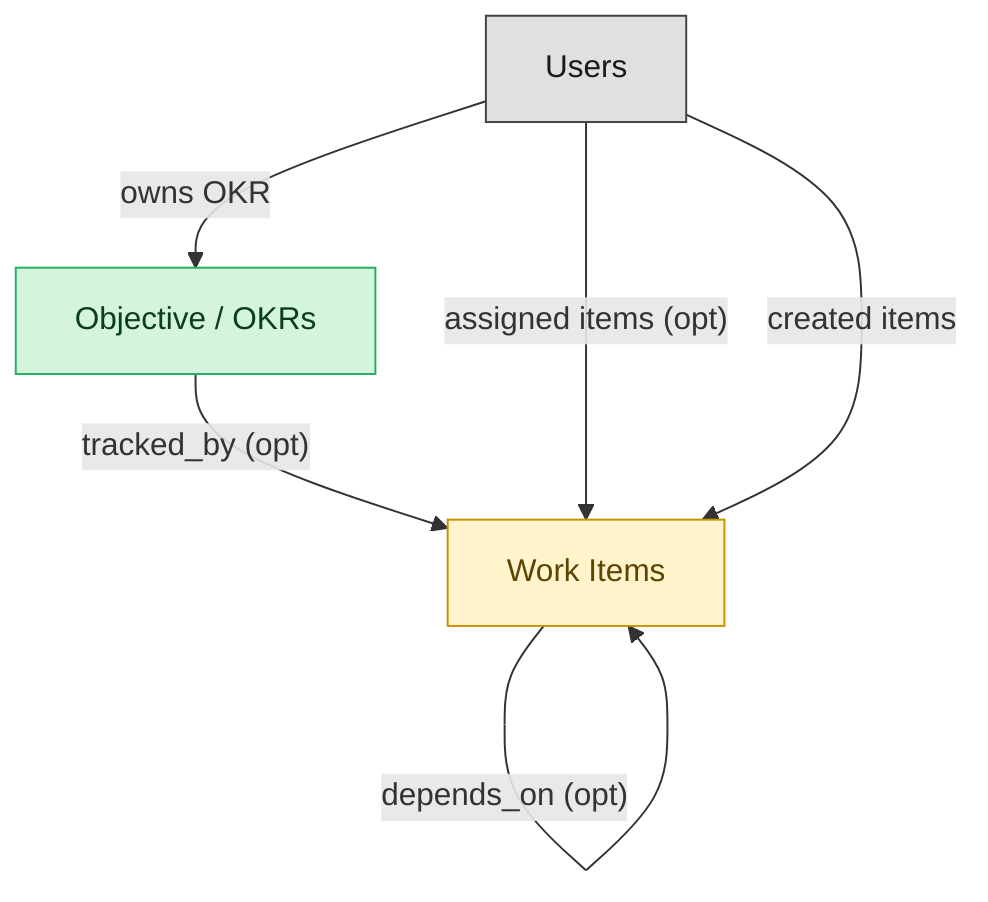

# Team-Execution Goals and OKRs

## 1. Overview

Team-execution OKR tracking surface: objectives with key results that link to work items for automatic progress rollup, weekly check-in cadences, scoring, and closure. Deploys alongside the task-execution module for full integration, or standalone with a thin embedded work-item shell for KR linking.

## 2. Entity summary

| Name | Description |
| --- | --- |
| Objective / OKRs | Hierarchical objective with measurable key results, weighted progress rollup from child objectives or linked work_items, owner accountability, and cadence (quarterly/annual). Mastered by three distinct domains: WORK-MGMT (team-level execution OKRs), SPM (strategic portfolio OKRs), TALENT-MGMT (individual performance-management OKRs). Same primitive, three different lifecycles and review processes - canonical Signal-1 multi-master. |
| Work Items | Atomic primitive in a work-management platform: task / item / card with owner, due date, status, priority, dependencies, subtasks, attachments, and comments. Same shape regardless of platform-specific terminology (task, item, row, card). |

## 3. Entities catalog

| # | data_object | role | mastered in | necessity | pattern flags | notes |
| ---: | --- | --- | --- | --- | --- | --- |
| 1 | `okr_objectives` (Objective / OKRs) | master | - | required | personal_content | - |
| 2 | `work_items` (Work Items) | embedded_master | `work-mgmt-task-exec` | required | - | - |

## 4. Aliases and industry synonyms

_(no industry-scoped aliases or non-synonym alias types loaded for this scope; generic synonyms are omitted as common knowledge.)_

## 5. Relationships

### 5.1 Intra-scope edges

| from | verb | to | cardinality | kind | necessity | owner_side | notes |
| --- | --- | --- | --- | --- | --- | --- | --- |
| `work_items` | depends_on | `work_items` | many_to_many | association | optional | source | - |
| `okr_objectives` | tracked_by | `work_items` | one_to_many | reference | optional | source | - |

### 5.2 Built-in edges (`users` and other platform built-ins)

| from | verb | to | cardinality | necessity | owner_side | notes |
| --- | --- | --- | --- | --- | --- | --- |
| `users` | assigned items | `work_items` | one_to_many | optional | source | - |
| `users` | created items | `work_items` | one_to_many | required | source | - |
| `users` | owns OKR | `okr_objectives` | one_to_many | required | source | - |

### 5.3 Cross-scope edges

| from | verb | to | cardinality | necessity | notes |
| --- | --- | --- | --- | --- | --- |
| `test_defects` | spawns | `work_items` | one_to_many | optional | - |
| `strategy_maps` | organizes | `okr_objectives` | one_to_many | optional | - |
| `okr_objectives` | advanced_by | `strategic_initiatives` | many_to_many | optional | - |
| `okr_objectives` | reviewed_in | `operating_reviews` | many_to_many | optional | - |
| `strategy_decisions` | affects | `okr_objectives` | many_to_many | optional | - |
| `action_plans` | spawns | `work_items` | one_to_many | optional | - |
| `work_projects` | contains | `work_items` | one_to_many | required | - |
| `work_automations` | drives | `work_items` | one_to_many | optional | - |
| `work_projects` | aligned_to | `okr_objectives` | many_to_many | optional | - |
| `work_items` | mirrors_to | `service_requests` | one_to_one | optional | - |
| `strategic_initiatives` | portfolio rollup from | `work_items` | one_to_many | optional | - |
| `performance_reviews` | evaluates | `okr_objectives` | one_to_many | optional | - |
| `performance_goals` | aligns_to | `okr_objectives` | many_to_many | optional | - |

## 6. Cross-domain context

### 6.1 Master consumers (other modules / domains that embed this scope's masters)

| data_object | other module / domain | role | necessity | notes |
| --- | --- | --- | --- | --- |
| `okr_objectives` | SEM-EXECUTION-TRACKING (Execution Tracking) - SEM | consumer | required | - |
| `okr_objectives` | SEM-OPERATING-RHYTHM (Operating Rhythm) - SEM | consumer | required | - |
| `okr_objectives` | SEM-STRATEGY-DEFINITION (Strategy Definition) - SEM | embedded_master | required | - |
| `okr_objectives` | SPM (Strategic Portfolio Management) | master | required | Strategic / portfolio-level OKRs aligned to investment decisions, multi-year horizons, exec scorecards. |
| `okr_objectives` | TALENT-PERFORMANCE-MGMT (Performance and Goal Management) - TALENT-MGMT | master | required | - |

### 6.2 Outbound handoffs (events this scope publishes)

_(no outbound `handoffs` whose payload is in this scope.)_

### 6.3 Inbound handoffs (events this scope reacts to)

| target module | source domain | source module | trigger_event | payload | integration | friction | description |
| --- | --- | --- | --- | --- | --- | --- | --- |
| WORK-MGMT-GOALS-OKR | SPM | _(domain-level)_ | `okr_objective.created` | `okr_objectives` | manual_handoff | high | Executive-level OKRs created in SPM (or in a slide deck, or an HCM perf system) need to cascade into team-level OKRs in the work-management tool. Almost universally manual: someone reads the corporate OKR and authors child OKRs in the WORK-MGMT goals module. The cascade gap is what dedicated OKR-platform vendors exist to close. |

### 6.4 Master providers (modules / domains that own masters this scope embeds)

| data_object | role here | necessity | canonical owner(s) | slice notes |
| --- | --- | --- | --- | --- |
| `work_items` | embedded_master | required | WORK-MGMT-TASK-EXEC (WORK-MGMT) | - |

## 7. Lifecycle states (per touched entity)

### `okr_objectives` (Objective / OKR)

| order | state_name | initial? | terminal? | requires_permission? | derived gate | description |
| --- | --- | --- | --- | --- | --- | --- |
| 1 | `drafted` | ✓ | - | - | - | Objective drafted by the owner. |
| 1 | `drafted` | ✓ | - | - | - | - |
| 2 | `committed` | - | - | ✓ | `talent-performance-mgmt:commit_okr_objective` | Owner and manager commit to the objective for the cycle. |
| 2 | `committed` | - | - | ✓ | `work-mgmt-goals-okr:commit_okr_objective` | - |
| 3 | `in_progress` | - | - | - | - | Objective is being pursued; key results updated. |
| 3 | `in_progress` | - | - | - | - | - |
| 4 | `graded` | - | - | ✓ | `talent-performance-mgmt:grade_okr_objective` | End-of-cycle score (0.0-1.0) recorded. |
| 4 | `scored` | - | - | ✓ | `work-mgmt-goals-okr:score_okr_objective` | - |
| 5 | `closed` | - | ✓ | - | - | - |
| 5 | `closed` | - | ✓ | - | - | Cycle closed; objective archived. |

### `work_items` (Work Item)

_This scope holds `work_items` as **embedded_master**; the canonical state machine is owned by `WORK-MGMT-TASK-EXEC`._

| order | state_name | initial? | terminal? | requires_permission? | derived gate | description |
| --- | --- | --- | --- | --- | --- | --- |
| 1 | `open` | ✓ | - | - | - | - |
| 2 | `in_progress` | - | - | - | - | - |
| 3 | `blocked` | - | - | - | - | - |
| 4 | `done` | - | ✓ | - | - | - |
| 5 | `cancelled` | - | ✓ | - | - | - |

## 8. Permissions and business rules (derived)

### 8.1 Permissions

| permission | tier | description | included in `:admin`? |
| --- | --- | --- | --- |
| `work-mgmt-goals-okr:read` | baseline-read | Read access to every entity in the module | ✓ |
| `work-mgmt-goals-okr:manage` | baseline-manage | Edit operational records | ✓ |
| `work-mgmt-goals-okr:admin` | baseline-admin | Edit reference data and inherit every workflow gate below | - |
| `work-mgmt-goals-okr:commit_okr_objective` | workflow-gate (lifecycle) | Transition `okr_objectives` into state `committed` | ✓ |
| `work-mgmt-goals-okr:score_okr_objective` | workflow-gate (lifecycle) | Transition `okr_objectives` into state `scored` | ✓ |
| `work-mgmt-goals-okr:view_all_objective_/_okrs` | override (personal_content) | View all `okr_objectives` rows beyond row-scope | ✓ |
| `work-mgmt-goals-okr:manage_all_objective_/_okrs` | override (personal_content) | Manage all `okr_objectives` rows beyond row-scope | ✓ |

### 8.2 Business rules

| rule_name | data_object | source flag | intent |
| --- | --- | --- | --- |
| `objective_/_okr_edit_scope` | `okr_objectives` | has_personal_content | Row-scope by default; override via `work-mgmt-goals-okr:view_all_objective_/_okrs` / `work-mgmt-goals-okr:manage_all_objective_/_okrs` |
