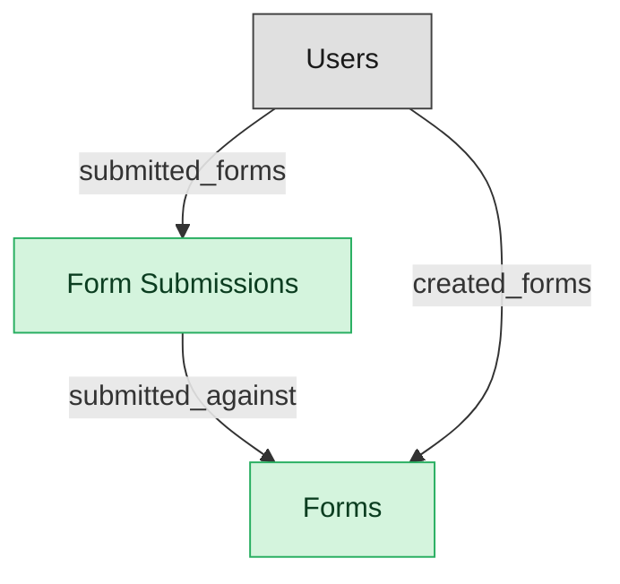

# Request Intake

## 1. Overview

Structured request-intake surface: form definitions, form submissions, routing rules. Pre-task surface that converts a submission into a work_item in the target TASK-EXEC project. Backs the WORK-INTAKE-FORMS capability with entities. Vendor reference: Asana Forms, Monday Forms, ClickUp Forms, Workfront Request Queues, Smartsheet Forms.

## 2. Entity summary

| Name | data_object | Description |
| --- | --- | --- |
| Form Submissions | `work_form_submissions` | Submitted instances of an intake form, carrying field values, submitter, and timestamp, and converting to a work item via routing rules. |
| Forms | `work_forms` | Structured intake form definitions, with field schema, validation, target project, and routing rules. |

## 3. Entities catalog

| # | data_object | canonical code | singular | plural | description | role | mastered in | mastered label | necessity | pattern flags | entity_type | write tier | notes |
| ---: | --- | --- | --- | --- | --- | --- | --- | --- | --- | --- | --- | --- | --- |
| 1 | `work_form_submissions` | `work_form_submissions` | Form Submission | Form Submissions | Submitted instance of a work_form. Carries field values, submitter, timestamp. Converts to a work_item via routing rules. May contain personal content from form fields (requester name/email). | master | - | - | required | personal_content | operational_workflow | `:manage` | - |
| 2 | `work_forms` | `work_forms` | Form | Forms | Structured intake form definition: schema (fields, validation), target project, routing rules. Asana Forms, Monday Forms, ClickUp Forms, Workfront Request Queues, Smartsheet Forms. | master | - | - | required | - | catalog | `:admin` | - |

## 4. Aliases and industry synonyms

_(none: no industry-scoped aliases for this scope)_

## 5. Relationships

### 5.1 Intra-scope edges

| from | verb | to | cardinality | kind | necessity | owner_side | delete_mode | fk_format | notes |
| --- | --- | --- | --- | --- | --- | --- | --- | --- | --- |
| `work_form_submissions` | submitted_against | `work_forms` | one_to_many | composition | required | target | cascade | parent | - |

### 5.2 Built-in edges (`users` and other platform built-ins)

| from | verb | to | cardinality | necessity | owner_side | delete_mode | fk_format | notes |
| --- | --- | --- | --- | --- | --- | --- | --- | --- |
| `users` | created_forms | `work_forms` | one_to_many | optional | source | clear | reference | - |
| `users` | submitted_forms | `work_form_submissions` | one_to_many | optional | source | clear | reference | - |

### 5.3 Cross-scope edges

#### 5.3a Outbound from this scope's masters and contributors

_Edges this scope drives: the in-scope endpoint has `role` of `master` or `contributor`._

| from | verb | to | cardinality | necessity | delete_mode | fk_format | notes |
| --- | --- | --- | --- | --- | --- | --- | --- |
| `work_form_submissions` | converts_to | `work_items` | one_to_many | optional | none | n/a | - |
| `work_forms` | routes_to | `work_projects` | one_to_many | optional | none | n/a | - |

#### 5.3b Context edges on embedded shells and consumed entities

_Edges the canonical owner drives, shown for context: the in-scope endpoint has `role` of `embedded_master`, `consumer`, or `derived`._

_(none: no context cross-scope edges on this scope's embedded shells or consumed entities)_

## 6. Cross-domain context

### 6.1 Master consumers (other modules / domains that embed this scope's masters)

_(none: no other module embeds this scope's masters; the canonical owners do.)_

### 6.2 Outbound handoffs (events this scope publishes)

_(none: no outbound handoffs whose payload is in this scope)_

### 6.3 Inbound handoffs (events this scope reacts to)

_(none: no inbound handoffs whose payload is in this scope)_

### 6.4 Master providers (modules / domains that own masters this scope embeds)

_(none: this scope embeds no masters owned elsewhere; every entity is mastered here)_

## 7. Lifecycle states

### `work_form_submissions` (Form Submission)

| order | state_name | initial? | terminal? | requires_permission? | derived gate | description |
| --- | --- | --- | --- | --- | --- | --- |
| 1 | `submitted` | ✓ | - | - | - | - |
| 2 | `triaged` | - | - | - | - | - |
| 3 | `converted` | - | ✓ | ✓ | `work-mgmt-intake:convert_form_submission` | - |
| 4 | `rejected` | - | ✓ | ✓ | `work-mgmt-intake:reject_form_submission` | - |

### `work_forms` (Form)

| order | state_name | initial? | terminal? | requires_permission? | derived gate | description |
| --- | --- | --- | --- | --- | --- | --- |
| 1 | `drafted` | ✓ | - | - | - | - |
| 2 | `published` | - | - | ✓ | `work-mgmt-intake:publish_work_form` | - |
| 3 | `archived` | - | ✓ | - | - | - |

## 8. Permissions and business rules (derived)

### 8.1 Permissions

| permission | tier | description | included in `:admin`? |
| --- | --- | --- | --- |
| `work-mgmt-intake:read` | baseline-read | Read access to every entity in the module | ✓ |
| `work-mgmt-intake:manage` | baseline-manage | Edit operational records | ✓ |
| `work-mgmt-intake:admin` | baseline-admin | Edit reference data and inherit every workflow gate below | - |
| `work-mgmt-intake:publish_work_form` | workflow-gate (lifecycle) | Transition `work_forms` into state `published` | ✓ |
| `work-mgmt-intake:convert_form_submission` | workflow-gate (lifecycle) | Transition `work_form_submissions` into state `converted` | ✓ |
| `work-mgmt-intake:reject_form_submission` | workflow-gate (lifecycle) | Transition `work_form_submissions` into state `rejected` | ✓ |
| `work-mgmt-intake:view_all_form_submissions` | override (personal_content) | View all `work_form_submissions` rows beyond row-scope | ✓ |
| `work-mgmt-intake:manage_all_form_submissions` | override (personal_content) | Manage all `work_form_submissions` rows beyond row-scope | ✓ |

### 8.2 Business rules

| rule_name | data_object | source flag | intent |
| --- | --- | --- | --- |
| `form_submission_edit_scope` | `work_form_submissions` | has_personal_content | Row-scope by default; override via `work-mgmt-intake:view_all_form_submissions` / `work-mgmt-intake:manage_all_form_submissions` |

## 9. Roles, RACI, and responsibilities (derived)

_Baseline roles, the permission hierarchy, and RACI realization are DERIVED from this scope's entity-type write tiers + `process_raci`; none of it is stored in the catalog (the deployer provisions it from this blueprint)._

### 9.1 `WORK-MGMT-INTAKE`

**Baseline roles:**

| role | baseline grant |
| --- | --- |
| `work-mgmt-intake_viewer` | `work-mgmt-intake:read` |
| `work-mgmt-intake_manager` | `work-mgmt-intake:manage` |
| `work-mgmt-intake_admin` | `work-mgmt-intake:admin` |

**Permission hierarchy:**

| permission | includes |
| --- | --- |
| `work-mgmt-intake:admin` | `work-mgmt-intake:manage` |
| `work-mgmt-intake:manage` | `work-mgmt-intake:read` |
| `work-mgmt-intake:admin` | `work-mgmt-intake:publish_work_form` |
| `work-mgmt-intake:admin` | `work-mgmt-intake:convert_form_submission` |
| `work-mgmt-intake:admin` | `work-mgmt-intake:reject_form_submission` |
| `work-mgmt-intake:admin` | `work-mgmt-intake:view_all_form_submissions` |
| `work-mgmt-intake:admin` | `work-mgmt-intake:manage_all_form_submissions` |

**RACI realization:**

_(none: no process_raci assignments wired to this module's gated processes yet)_

### 9.2 Functional ownership and default grants

| responsibility | business function | default role | default tier |
| --- | --- | --- | --- |
| owner | Business Operations | `admin` | `:admin` |
| contributor | Customer Success | `manage` | `:manage` |
| contributor | Marketing | `manage` | `:manage` |
| contributor | Product Management | `manage` | `:manage` |
| consumer | Sales | `read` | `:read` |
