# Task and Project Execution

## 1. Overview

Cross-functional task and project execution surface: work items with owners, due dates, dependencies, statuses, and assignments; project containers with timelines, dashboards, and board views; user-authored automation rules that fire on item state changes. The deployable substrate every team-based work-management product orbits.

## 2. Entity summary

| Name | Description |
| --- | --- |
| Work Automations | Trigger-action rule defined per board/project: status change, due date, assignment, form submission as triggers; multi-step actions with conditions, time delays, and external integrations. The user-authored behavior layer on top of the data primitives. |
| Work Items | Atomic primitive in a work-management platform: task / item / card with owner, due date, status, priority, dependencies, subtasks, attachments, and comments. Same shape regardless of platform-specific terminology (task, item, row, card). |
| Work Projects | Container of work_items, regardless of platform-specific terminology (project, board, sheet, space/list). Has timeline, status, owner, members, dashboards, and embedded views. |
| Business Value Assessments | Scoring model for prioritising portfolio items: NPV, strategic alignment, risk, dependencies, resource constraints. Ranked backlog. |
| Engagement Action Plans | Team or manager action commitment in response to engagement_drivers result. Tracked to closure; recurring failure to act is itself an engagement signal. |
| Extracted Business Rules | Declarative rule inferred from event-log patterns: conditional activity orderings, forbidden sequences, timing constraints, resource allocations, decision thresholds. Captures hidden control logic. |
| Feature Requests | Customer request for new capability; input to the prioritisation workflow. |
| No-Code Automations | Record-triggered workflow / scheduled job / external API call defined in the no-code platform. |
| Opportunities | Active sales deal - stage, amount, close date, probability, products/SKUs, competitor, decision criteria. Drives CPQ quote generation and closed-won triggers downstream subscription activation. |
| Portfolios | Container for strategic initiatives grouped by business unit, product line, or cost center; aggregate KPIs and investment rules. |
| Process Simulation Runs | A single execution of a process simulation scenario (Monte Carlo or discrete-event) against a business_process_model, with inputs (resource pools, cost/time variables), outputs (throughput, bottleneck nodes), and run metadata. |
| Product Releases | Versioned software release; bundles features and defines delivery date and scope. |
| Product Roadmaps | Timeline view of features grouped by release, product, or theme. Marquee PROD-MGMT capability. |
| Project Assignments | Worker-to-project allocation with role, bill rate, cost rate, planned hours, period. Drives utilisation and resource-availability reporting. |
| Project Tasks | Decomposed unit of work inside a project: scope, dependencies, estimated hours, status. Drives time entry tagging and Earned Value calculation. |
| Pull / Merge Requests | Code-change proposal targeting a branch in a source_repository: author, base/head branches, title, description, status (open / merged / closed), reviewers, approval count, CI status, merged-at timestamp. The review-cycle artifact. |
| Strategic Initiatives | Multi-quarter / annual program aligned to corporate strategy; bundles related projects, has executive sponsor and benefits realisation plan. |
| Test Defects | Defect discovered during testing; distinct from ITSM incidents. Carries reproduction steps, environment context, severity, priority, assigned developer, status, root cause. |
| Webhook Subscriptions | Event subscription: source_system, event_type, target_recipe, retry_policy, filter_logic. |

```mermaid
flowchart TD
  classDef master fill:#d4f4dd,stroke:#27ae60,color:#0b3d20;
  classDef consumer fill:#e8def8,stroke:#7b1fa2,color:#3a155d;
  classDef platform_builtin fill:#e0e0e0,stroke:#424242,color:#1a1a1a;
  work_items["Work Items"]
  work_projects["Work Projects"]
  work_automations["Work Automations"]
  crm_opportunities["Opportunities"]
  strategic_initiatives["Strategic Initiatives"]
  strategic_portfolios["Portfolios"]
  action_plans["Engagement Action Plans"]
  nocode_automations["No-Code Automations"]
  business_rules_extracted["Extracted Business Rules"]
  webhook_subscriptions["Webhook Subscriptions"]
  pull_requests["Pull / Merge Requests"]
  test_defects["Test Defects"]
  process_simulation_runs["Process Simulation Runs"]
  business_value_assessments["Business Value Assessments"]
  project_tasks["Project Tasks"]
  product_roadmaps["Product Roadmaps"]
  feature_requests["Feature Requests"]
  product_releases["Product Releases"]
  project_assignments["Project Assignments"]
  users["Users"]
  test_defects -->|"spawns (opt)"| work_items
  action_plans -->|"spawns (opt)"| work_items
  work_items -->|"depends_on (opt)"| work_items
  work_projects -->|"contains"| work_items
  work_automations -->|"drives (opt)"| work_items
  work_automations -->|"applies_to (opt)"| work_projects
  strategic_initiatives -->|"portfolio rollup from (opt)"| work_items
  work_automations -->|"rolls_up_into (opt)"| strategic_portfolios
  work_automations -->|"feeds (opt)"| project_tasks
  work_automations -->|"mirrors_to (opt)"| product_roadmaps
  project_tasks -->|"performed_by (opt)"| project_assignments
  users -->|"owns defect (opt)"| test_defects
  users -->|"owns"| action_plans
  action_plans -->|"is_assigned_to (opt)"| users
  users -->|"assigned items (opt)"| work_items
  users -->|"created items"| work_items
  users -->|"owns projects"| work_projects
  users -->|"authored automations"| work_automations
  users -->|"owns"| crm_opportunities
  users -->|"assigned_to (opt)"| project_tasks
  users -->|"staffed_on"| project_assignments
  class work_items master;
  class work_projects master;
  class work_automations master;
  class crm_opportunities consumer;
  class strategic_initiatives consumer;
  class strategic_portfolios consumer;
  class action_plans consumer;
  class nocode_automations consumer;
  class business_rules_extracted consumer;
  class webhook_subscriptions consumer;
  class pull_requests consumer;
  class test_defects consumer;
  class process_simulation_runs consumer;
  class business_value_assessments consumer;
  class project_tasks consumer;
  class product_roadmaps consumer;
  class feature_requests consumer;
  class product_releases consumer;
  class project_assignments consumer;
  class users platform_builtin;
  style crm_opportunities stroke-dasharray:5 5;
  style strategic_initiatives stroke-dasharray:5 5;
  style strategic_portfolios stroke-dasharray:5 5;
  style action_plans stroke-dasharray:5 5;
  style nocode_automations stroke-dasharray:5 5;
  style business_rules_extracted stroke-dasharray:5 5;
  style webhook_subscriptions stroke-dasharray:5 5;
  style pull_requests stroke-dasharray:5 5;
  style test_defects stroke-dasharray:5 5;
  style process_simulation_runs stroke-dasharray:5 5;
  style business_value_assessments stroke-dasharray:5 5;
  style project_tasks stroke-dasharray:5 5;
  style product_roadmaps stroke-dasharray:5 5;
  style feature_requests stroke-dasharray:5 5;
  style product_releases stroke-dasharray:5 5;
  style project_assignments stroke-dasharray:5 5;
```

## 3. Entities catalog

| # | data_object | role | mastered in | necessity | pattern flags | notes |
| ---: | --- | --- | --- | --- | --- | --- |
| 1 | `work_automations` (Work Automations) | master | - | required | - | - |
| 2 | `work_items` (Work Items) | master | - | required | - | - |
| 3 | `work_projects` (Work Projects) | master | - | required | - | - |
| 4 | `business_value_assessments` (Business Value Assessments) | consumer | `SPM` _(domain-level, not modularized)_ | optional | - | - |
| 5 | `action_plans` (Engagement Action Plans) | consumer | `emp-exp-action-planning` | optional | - | - |
| 6 | `business_rules_extracted` (Extracted Business Rules) | consumer | `PROC-MIN` _(domain-level, not modularized)_ | optional | - | - |
| 7 | `feature_requests` (Feature Requests) | consumer | `pm-discovery` | optional | - | - |
| 8 | `nocode_automations` (No-Code Automations) | consumer | `NCDB` _(domain-level, not modularized)_ | optional | - | - |
| 9 | `crm_opportunities` (Opportunities) | consumer | `crm-pipeline-mgt` | optional | - | - |
| 10 | `strategic_portfolios` (Portfolios) | consumer | `SPM` _(domain-level, not modularized)_ | optional | - | - |
| 11 | `process_simulation_runs` (Process Simulation Runs) | consumer | `BPA` _(domain-level, not modularized)_ | optional | - | - |
| 12 | `product_releases` (Product Releases) | consumer | `pm-roadmap-delivery` | optional | - | - |
| 13 | `product_roadmaps` (Product Roadmaps) | consumer | `pm-roadmap-delivery` | optional | - | - |
| 14 | `project_assignments` (Project Assignments) | consumer | `psa-resource-mgmt` | optional | - | - |
| 15 | `project_tasks` (Project Tasks) | consumer | `psa-project-delivery` | optional | - | - |
| 16 | `pull_requests` (Pull / Merge Requests) | consumer | `VSDP` _(domain-level, not modularized)_ | optional | - | - |
| 17 | `strategic_initiatives` (Strategic Initiatives) | consumer | `sem-execution-tracking` | optional | - | - |
| 18 | `test_defects` (Test Defects) | consumer | `TEST-MGMT` _(domain-level, not modularized)_ | optional | - | - |
| 19 | `webhook_subscriptions` (Webhook Subscriptions) | consumer | `IPAAS` _(domain-level, not modularized)_ | optional | - | - |

## 4. Aliases and industry synonyms

_(no industry-scoped aliases or non-synonym alias types loaded for this scope; generic synonyms are omitted as common knowledge.)_

## 5. Relationships

### 5.1 Intra-scope edges

| from | verb | to | cardinality | kind | necessity | owner_side | notes |
| --- | --- | --- | --- | --- | --- | --- | --- |
| `test_defects` | spawns | `work_items` | one_to_many | reference | optional | source | - |
| `action_plans` | spawns | `work_items` | one_to_many | reference | optional | source | - |
| `work_items` | depends_on | `work_items` | many_to_many | association | optional | source | - |
| `work_projects` | contains | `work_items` | one_to_many | composition | required | source | - |
| `work_automations` | drives | `work_items` | one_to_many | reference | optional | source | - |
| `work_automations` | applies_to | `work_projects` | many_to_many | association | optional | target | - |
| `strategic_initiatives` | portfolio rollup from | `work_items` | one_to_many | reference | optional | target | - |
| `work_automations` | rolls_up_into | `strategic_portfolios` | many_to_many | reference | optional | source | - |
| `work_automations` | feeds | `project_tasks` | many_to_many | reference | optional | source | - |
| `work_automations` | mirrors_to | `product_roadmaps` | many_to_many | reference | optional | source | - |
| `project_tasks` | performed_by | `project_assignments` | many_to_many | association | optional | target | - |

### 5.2 Built-in edges (`users` and other platform built-ins)

| from | verb | to | cardinality | necessity | owner_side | notes |
| --- | --- | --- | --- | --- | --- | --- |
| `users` | owns defect | `test_defects` | one_to_many | optional | source | - |
| `users` | owns | `action_plans` | one_to_many | required | source | - |
| `action_plans` | is_assigned_to | `users` | many_to_many | optional | target | - |
| `users` | assigned items | `work_items` | one_to_many | optional | source | - |
| `users` | created items | `work_items` | one_to_many | required | source | - |
| `users` | owns projects | `work_projects` | one_to_many | required | source | - |
| `users` | authored automations | `work_automations` | one_to_many | required | source | - |
| `users` | owns | `crm_opportunities` | one_to_many | required | source | - |
| `users` | assigned_to | `project_tasks` | many_to_many | optional | target | - |
| `users` | staffed_on | `project_assignments` | one_to_many | required | target | - |

### 5.3 Cross-scope edges

| from | verb | to | cardinality | necessity | notes |
| --- | --- | --- | --- | --- | --- |
| `test_runs` | raises | `test_defects` | one_to_many | optional | - |
| `customers` | flags_churn_risk_on | `crm_opportunities` | one_to_many | optional | - |
| `crm_opportunities` | is activity context for | `customer_cases` | one_to_many | optional | - |
| `test_defects` | escalates_to | `service_incidents` | one_to_many | optional | - |
| `test_defects` | surfaces_from | `ci_pipeline_runs` | many_to_many | optional | - |
| `crm_opportunities` | opens | `customer_cases` | one_to_many | optional | - |
| `customers` | impacted_by | `product_releases` | many_to_many | optional | - |
| `legal_contracts` | renewal_warns | `crm_opportunities` | one_to_many | optional | - |
| `okr_objectives` | advanced_by | `strategic_initiatives` | many_to_many | optional | - |
| `strategic_initiatives` | reviewed_in | `operating_reviews` | many_to_many | optional | - |
| `strategy_decisions` | affects | `strategic_initiatives` | many_to_many | optional | - |
| `engagement_drivers` | triggers | `action_plans` | one_to_many | optional | - |
| `org_units` | owns | `action_plans` | one_to_many | optional | - |
| `crm_opportunities` | drafts | `legal_contracts` | one_to_many | optional | - |
| `okr_objectives` | tracked_by | `work_items` | one_to_many | optional | - |
| `work_projects` | aligned_to | `okr_objectives` | many_to_many | optional | - |
| `work_items` | mirrors_to | `service_requests` | one_to_one | optional | - |
| `work_automations` | propagates_to | `service_requests` | many_to_many | optional | - |
| `work_projects` | closes_into | `service_projects` | one_to_one | optional | - |
| `work_automations` | posts_to | `chat_channels` | many_to_many | optional | - |
| `customers` | has_opportunities | `crm_opportunities` | one_to_many | required | - |
| `crm_opportunities` | converted_from_lead | `crm_leads` | one_to_many | optional | - |
| `pipeline_stages` | tracks | `crm_opportunities` | one_to_many | required | - |
| `crm_opportunities` | involves_contacts | `crm_contacts` | many_to_many | optional | - |
| `crm_opportunities` | has_activities | `sales_activities` | one_to_many | optional | - |
| `service_projects` | contains | `project_tasks` | one_to_many | required | - |
| `service_projects` | staffs | `project_assignments` | one_to_many | required | - |
| `project_assignments` | requires_skills_from | `resource_skill_inventories` | many_to_many | optional | - |
| `project_resource_allocations` | confirms_into | `project_assignments` | one_to_many | optional | - |

## 6. Cross-domain context

### 6.1 Master consumers (other modules / domains that embed this scope's masters)

| data_object | other module / domain | role | necessity | notes |
| --- | --- | --- | --- | --- |
| `work_automations` | PM-ROADMAP-DELIVERY (Roadmap, Release, and Strategy) - PROD-MGMT | consumer | optional | - |
| `work_items` | SPM (Strategic Portfolio Management) | consumer | required | Portfolio dashboards roll up project/work_item completion as input to portfolio status and strategy-execution alignment. |
| `work_items` | WORK-MGMT-GOALS-OKR (Team-Execution Goals and OKRs) - WORK-MGMT | embedded_master | required | - |
| `work_projects` | PSA-PROJECT-DELIVERY (Project Delivery) - PSA | consumer | optional | - |

### 6.2 Outbound handoffs (events this scope publishes)

| source module | target domain | target module | trigger_event | payload | integration | friction | description |
| --- | --- | --- | --- | --- | --- | --- | --- |
| WORK-MGMT-TASK-EXEC | ITSM | _(domain-level)_ | `work_automation.triggered` | `work_automations` | event_stream | low | Work-item automations linked to IT tickets propagate status changes to ITSM. |
| WORK-MGMT-TASK-EXEC | ITSM | _(domain-level)_ | `work_item.status_changed` | `work_items` | api_call | high | Cross-functional WORK-MGMT items intersect with IT support requests: a marketing project task ('IT-provision new SaaS') needs to be linked to an ITSM request, with status mirrored both ways. Bidirectional sync is bespoke; off-the-shelf WORK-MGMT-to-ITSM connectors exist but require careful per-team configuration. |
| WORK-MGMT-TASK-EXEC | SPM | _(domain-level)_ | `work_item.completed` | `work_items` | batch_sync | medium | Work-management platforms publish task-completion data to portfolio dashboards in SPM tools. The portfolio rollup powers strategy-to-execution dashboards and OKR progress (via okr_objectives.key_results linking down to work_items). Nightly sync is the common pattern; richer real-time integrations exist but are vendor-specific. |
| WORK-MGMT-TASK-EXEC | SPM | _(domain-level)_ | `work_automation.triggered` | `work_automations` | batch_sync | medium | Aggregated work-automation outcomes feed SPM portfolio rollup. |
| WORK-MGMT-TASK-EXEC | PSA | _(domain-level)_ | `work_automation.triggered` | `work_automations` | event_stream | low | Automation-driven task transitions feed PSA for utilization and billable-hour tracking. |
| WORK-MGMT-TASK-EXEC | PSA | PSA-PROJECT-DELIVERY | `work_project.completed` | `work_projects` | batch_sync | medium | Services orgs running delivery in WORK-MGMT close a project and need utilization, billable hours, and milestone-based revenue recognition to roll up into PSA. Nightly sync of project status + hours is the common pattern; richer real-time integration exists but is uncommon. |
| WORK-MGMT-TASK-EXEC | WSC | _(domain-level)_ | `work_automation.triggered` | `work_automations` | api_call | low | Automations post status updates and task notifications into workstream collaboration channels. |
| WORK-MGMT-TASK-EXEC | PROD-MGMT | PM-ROADMAP-DELIVERY | `work_automation.disabled` | `work_automations` | event_stream | low | A WORK-MGMT automation rule has been disabled. PROD-MGMT subscribers stop reacting to its downstream effects (e.g. auto-creation of feature_request linkages from incoming work_items). |
| WORK-MGMT-TASK-EXEC | PROD-MGMT | PM-ROADMAP-DELIVERY | `work_automation.triggered` | `work_automations` | event_stream | medium | Engineering team automations mirror into product-management roadmap tracking. |

### 6.3 Inbound handoffs (events this scope reacts to)

| target module | source domain | source module | trigger_event | payload | integration | friction | description |
| --- | --- | --- | --- | --- | --- | --- | --- |
| WORK-MGMT-TASK-EXEC | IPAAS | _(domain-level)_ | `webhook_subscription.delivery_failed` | `webhook_subscriptions` | api_call | medium | Webhook delivery failures create tasks for integration owners to investigate. |
| WORK-MGMT-TASK-EXEC | PSA | PSA-PROJECT-DELIVERY | `project_task.completed` | `project_tasks` | event_stream | low | PSA task completion mirrors into the WORK-MGMT board to keep team-level views current. |
| WORK-MGMT-TASK-EXEC | SPM | _(domain-level)_ | `demand_intake.approved` | `strategic_initiatives` | api_call | high | SPM creates work_projects + kickoff work_items for charter and resourcing. |
| WORK-MGMT-TASK-EXEC | CRM | CRM-PIPELINE-MGT | `crm_opportunity.closed_won` | `crm_opportunities` | api_call | high | Sales closes a deal in CRM; delivery / Customer Success spin up a kickoff project in their work-management tool. Custom iPaaS automations or hand-built webhooks bridge the two; payload mapping (opportunity products to project tasks, account stakeholders to project members) is bespoke per org. |
| WORK-MGMT-TASK-EXEC | SPM | _(domain-level)_ | `strategic_portfolio.rebalanced` | `strategic_portfolios` | batch_sync | high | Re-prioritisation cascades to project priority updates; high-touch validation. |
| WORK-MGMT-TASK-EXEC | PROD-MGMT | PM-ROADMAP-DELIVERY | `product_release.rolled_back` | `product_releases` | event_stream | medium | A product release is rolled back in PROD-MGMT (post-ship regression or incident). WORK-MGMT subscribers reopen the work_items that tracked the release and spawn remediation tasks. Failure mode: remediation tasks may not be scoped correctly if the rollback reason isn't propagated. |
| WORK-MGMT-TASK-EXEC | PROD-MGMT | PM-ROADMAP-DELIVERY | `product_release.shipped` | `product_releases` | event_stream | low | A product release ships in PROD-MGMT. WORK-MGMT subscribers close the work_items that tracked release-prep tasks and surface release notes against the project board. |
| WORK-MGMT-TASK-EXEC | PSA | PSA-RESOURCE-MGMT | `project_assignment.released` | `project_assignments` | event_stream | low | A project assignment is released in PSA (consultant rolls off or capacity is freed). WORK-MGMT subscribers may close or reassign the work_items that were owned by the released assignee. Failure mode: orphaned work_items if the release event is missed and no reassignment happens. |
| WORK-MGMT-TASK-EXEC | TEST-MGMT | _(domain-level)_ | `test_defect.created` | `test_defects` | event_stream | low | New defects materialize as work items on the engineering team's board for triage and fix. |
| WORK-MGMT-TASK-EXEC | BPA | _(domain-level)_ | `process_simulation_run.bottleneck_identified` | `process_simulation_runs` | event_stream | medium | Bottleneck findings spawn improvement tasks in WORK-MGMT. |
| WORK-MGMT-TASK-EXEC | NCDB | _(domain-level)_ | `nocode_automation.triggered` | `nocode_automations` | api_call | low | No-code automation creates a work item in the WORK-MGMT platform when its trigger fires. |
| WORK-MGMT-TASK-EXEC | SPM | _(domain-level)_ | `business_value_assessment.completed` | `business_value_assessments` | event_stream | medium | Approved initiatives cascade into team-level work items in WORK-MGMT. |
| WORK-MGMT-TASK-EXEC | PROD-MGMT | PM-ROADMAP-DELIVERY | `product_roadmap.published` | `product_roadmaps` | event_stream | low | A new or updated product roadmap is published in PROD-MGMT. WORK-MGMT subscribers create work_projects or sub-projects representing the new roadmap initiatives so cross-functional teams can begin execution tracking. |
| WORK-MGMT-TASK-EXEC | EMP-EXP | EMP-EXP-ACTION-PLANNING | `action_plan.created` | `action_plans` | api_call | medium | Engagement action plans often tracked as work items in WORK-MGMT for execution visibility. |
| WORK-MGMT-TASK-EXEC | PSA | PSA-RESOURCE-MGMT | `project_assignment.confirmed` | `project_assignments` | event_stream | low | PSA seeds the WORK-MGMT project board with the newly-assigned resource so day-to-day task tracking can begin. |
| WORK-MGMT-TASK-EXEC | VSDP | _(domain-level)_ | `pull_request.merged` | `pull_requests` | event_stream | low | PR merges transition the linked work item to a completed state in the team's WORK-MGMT board. |
| WORK-MGMT-TASK-EXEC | EMP-EXP | EMP-EXP-ACTION-PLANNING | `action_plan.completed` | `action_plans` | api_call | medium | An engagement action plan transitions to completed in EMP-EXP. Subscribers in WORK-MGMT close the work_items that tracked each action item and roll up completion for reporting. Failure mode: action items may be closed in EMP-EXP without the linked work_items being closed in WORK-MGMT, leaving stale tasks. |
| WORK-MGMT-TASK-EXEC | PROC-MIN | _(domain-level)_ | `business_rule_extracted.identified` | `business_rules_extracted` | manual_handoff | medium | Extracted business rule routed for analyst validation and possible codification. |
| WORK-MGMT-TASK-EXEC | PROD-MGMT | PM-ROADMAP-DELIVERY | `product_roadmap.item_promoted` | `product_roadmaps` | event_stream | medium | Promoting a roadmap item to now/next must create the corresponding delivery work in WORK-MGMT; manual handoff here is one of the most-cited PROD↔ENG pain points. |
| WORK-MGMT-TASK-EXEC | PROD-MGMT | PM-DISCOVERY | `feature_request.upvoted_threshold` | `feature_requests` | event_stream | medium | Once demand-signal crosses the prioritisation threshold, an engineering work item / epic is created in WORK-MGMT. Many teams still do this by hand. |
| WORK-MGMT-TASK-EXEC | PROD-MGMT | PM-ROADMAP-DELIVERY | `product_release.planned` | `product_releases` | event_stream | low | WORK-MGMT creates the delivery workstream / release train for the planned release, with the scope and target date hydrated from PROD-MGMT. |

### 6.4 Master providers (modules / domains that own masters this scope embeds)

| data_object | role here | necessity | canonical owner(s) | slice notes |
| --- | --- | --- | --- | --- |
| `action_plans` | consumer | optional | EMP-EXP-ACTION-PLANNING (EMP-EXP) | - |
| `business_rules_extracted` | consumer | optional | PROC-MIN (Process Mining) | - |
| `business_value_assessments` | consumer | optional | SPM (Strategic Portfolio Management) | - |
| `crm_opportunities` | consumer | optional | CRM-PIPELINE-MGT (CRM) | - |
| `feature_requests` | consumer | optional | PM-DISCOVERY (PROD-MGMT) | - |
| `nocode_automations` | consumer | optional | NCDB (No-Code Database) | - |
| `process_simulation_runs` | consumer | optional | BPA (Business Process Architecture) | - |
| `product_releases` | consumer | optional | PM-ROADMAP-DELIVERY (PROD-MGMT) | - |
| `product_roadmaps` | consumer | optional | PM-ROADMAP-DELIVERY (PROD-MGMT) | - |
| `project_assignments` | consumer | optional | PSA-RESOURCE-MGMT (PSA) | - |
| `project_tasks` | consumer | optional | PSA-PROJECT-DELIVERY (PSA) | - |
| `pull_requests` | consumer | optional | VSDP (Value Stream Delivery Platform) | - |
| `strategic_initiatives` | consumer | optional | SEM-EXECUTION-TRACKING (SEM), SPM (Strategic Portfolio Management) | - |
| `strategic_portfolios` | consumer | optional | SPM (Strategic Portfolio Management) | - |
| `test_defects` | consumer | optional | TEST-MGMT (Test Management) | - |
| `webhook_subscriptions` | consumer | optional | IPAAS (Integration Platform as a Service) | - |

## 7. Lifecycle states (per touched entity)

### `action_plans` (Engagement Action Plan)

_This scope holds `action_plans` as **consumer**; the canonical state machine is owned by `EMP-EXP-ACTION-PLANNING`._

| order | state_name | initial? | terminal? | requires_permission? | derived gate | description |
| --- | --- | --- | --- | --- | --- | --- |
| 10 | `open` | ✓ | - | - | - | - |
| 20 | `in_progress` | - | - | - | - | - |
| 30 | `completed` | - | ✓ | ✓ | `emp-exp-action-planning:complete_action_plan` | - |
| 40 | `archived` | - | ✓ | - | - | - |

### `crm_opportunities` (Opportunity)

_This scope holds `crm_opportunities` as **consumer**; the canonical state machine is owned by `CRM-PIPELINE-MGT`._

| order | state_name | initial? | terminal? | requires_permission? | derived gate | description |
| --- | --- | --- | --- | --- | --- | --- |
| 1 | `open` | ✓ | - | - | - | Opportunity created and being scoped. |
| 2 | `qualified` | - | - | - | - | Opportunity has passed qualification and entered active pursuit. |
| 3 | `proposal` | - | - | - | - | Proposal or quote has been delivered to the prospect. |
| 4 | `negotiation` | - | - | - | - | Commercial terms are being negotiated with the prospect. |
| 5 | `won` | - | ✓ | ✓ | `crm-pipeline-mgt:close_won` | Deal closed-won; triggers downstream subscription activation. |
| 6 | `lost` | - | ✓ | - | - | Deal closed-lost; opportunity terminated without revenue. |

### `feature_requests` (Feature Request)

_This scope holds `feature_requests` as **consumer**; the canonical state machine is owned by `PM-DISCOVERY`._

| order | state_name | initial? | terminal? | requires_permission? | derived gate | description |
| --- | --- | --- | --- | --- | --- | --- |
| 1 | `new` | ✓ | - | - | - | Feature request just captured; awaiting triage. |
| 2 | `triaged` | - | - | - | - | Request has been reviewed and deemed in-scope for the product. |
| 3 | `prioritized` | - | - | - | - | Request has been ranked relative to other backlog items. |
| 4 | `accepted` | - | ✓ | ✓ | `pm-discovery:accepted_feature_request` | Request has been accepted; converted to a product_feature row. |
| 5 | `rejected` | - | ✓ | ✓ | `pm-discovery:rejected_feature_request` | Request will not be built; rationale captured. |
| 6 | `archived` | - | ✓ | - | - | Old or duplicate request; out of consideration for filtering. |

### `product_releases` (Product Release)

_This scope holds `product_releases` as **consumer**; the canonical state machine is owned by `PM-ROADMAP-DELIVERY`._

| order | state_name | initial? | terminal? | requires_permission? | derived gate | description |
| --- | --- | --- | --- | --- | --- | --- |
| 1 | `planned` | ✓ | - | - | - | Release plan exists with target date and feature set. |
| 2 | `in_progress` | - | - | - | - | Release work in flight; features merging in. |
| 3 | `shipped` | - | ✓ | ✓ | `pm-roadmap-delivery:shipped_product_release` | Release has gone live to the target audience. |
| 4 | `rolled_back` | - | ✓ | ✓ | `pm-roadmap-delivery:rolled_back_product_release` | Release was pulled after shipping due to defects or business reasons. |
| 5 | `cancelled` | - | ✓ | ✓ | `pm-roadmap-delivery:cancelled_product_release` | Release was cancelled before shipping. |

### `product_roadmaps` (Product Roadmap)

_This scope holds `product_roadmaps` as **consumer**; the canonical state machine is owned by `PM-ROADMAP-DELIVERY`._

| order | state_name | initial? | terminal? | requires_permission? | derived gate | description |
| --- | --- | --- | --- | --- | --- | --- |
| 1 | `draft` | ✓ | - | - | - | Roadmap is being authored; not visible to wider audiences. |
| 2 | `published` | - | - | ✓ | `pm-roadmap-delivery:published_product_roadmap` | Roadmap version is published; visible to the configured audience. |
| 3 | `archived` | - | ✓ | - | - | Roadmap version is superseded; kept for historical reference. |

### `project_assignments` (Project Assignment)

_This scope holds `project_assignments` as **consumer**; the canonical state machine is owned by `PSA-RESOURCE-MGMT`._

| order | state_name | initial? | terminal? | requires_permission? | derived gate | description |
| --- | --- | --- | --- | --- | --- | --- |
| 1 | `proposed` | ✓ | - | - | - | Resource manager has nominated a consultant for a role on the project; awaiting confirmation. |
| 2 | `confirmed` | - | - | ✓ | `psa-resource-mgmt:confirm_project_assignment` | Resource committed to the project at a stated allocation; HCM capacity decremented; WORK-MGMT seat created. |
| 3 | `active` | - | - | - | - | Resource is actively delivering on the assignment; hours flowing through time entries. |
| 4 | `released` | - | ✓ | ✓ | `psa-resource-mgmt:release_project_assignment` | Resource has rolled off (planned end, early release, scope change). Capacity returned to HCM bench. |

### `project_tasks` (Project Task)

_This scope holds `project_tasks` as **consumer**; the canonical state machine is owned by `PSA-PROJECT-DELIVERY`._

| order | state_name | initial? | terminal? | requires_permission? | derived gate | description |
| --- | --- | --- | --- | --- | --- | --- |
| 1 | `not_started` | ✓ | - | - | - | Task created on the project plan; not yet picked up. |
| 2 | `in_progress` | - | - | ✓ | `psa-project-delivery:start_project_task` | Assignee has begun work on the task. |
| 3 | `blocked` | - | - | ✓ | `psa-project-delivery:block_project_task` | Task cannot proceed: upstream dependency, approval, or external input outstanding. |
| 4 | `completed` | - | ✓ | ✓ | `psa-project-delivery:complete_project_task` | Task delivered; rolls into milestone progress. |
| 5 | `cancelled` | - | ✓ | ✓ | `psa-project-delivery:cancel_project_task` | Task abandoned (scope change, descope, redundancy). |

### `strategic_initiatives` (Strategic Initiative)

_This scope holds `strategic_initiatives` as **consumer**; the canonical state machine is owned by `SEM-EXECUTION-TRACKING`._

| order | state_name | initial? | terminal? | requires_permission? | derived gate | description |
| --- | --- | --- | --- | --- | --- | --- |
| 1 | `proposed` | ✓ | - | - | - | Initiative is drafted by a strategy-office contributor; not yet funded or scheduled. |
| 2 | `approved` | - | - | ✓ | `sem-execution-tracking:approve_strategic_initiative` | Initiative cleared by the operating-rhythm review; budget and owner confirmed. Publishes strategic_initiative.approved. |
| 3 | `in_progress` | - | - | - | - | Execution underway; status, milestones, and benefits realisation updated against the initiative. |
| 4 | `cancelled` | - | ✓ | ✓ | `sem-execution-tracking:cancel_strategic_initiative` | Initiative withdrawn before completion (deprioritised, blocked, or rolled into another initiative). Publishes strategic_initiative.cancelled. |
| 4 | `completed` | - | ✓ | ✓ | `sem-execution-tracking:complete_strategic_initiative` | Benefits realised or scope fully delivered. Publishes strategic_initiative.completed. |

### `work_automations` (Work Automation)

| order | state_name | initial? | terminal? | requires_permission? | derived gate | description |
| --- | --- | --- | --- | --- | --- | --- |
| 1 | `drafted` | ✓ | - | - | - | - |
| 2 | `enabled` | - | - | ✓ | `work-mgmt-task-exec:enable_work_automation` | - |
| 3 | `disabled` | - | - | ✓ | `work-mgmt-task-exec:disable_work_automation` | - |
| 4 | `archived` | - | ✓ | - | - | - |

### `work_items` (Work Item)

| order | state_name | initial? | terminal? | requires_permission? | derived gate | description |
| --- | --- | --- | --- | --- | --- | --- |
| 1 | `open` | ✓ | - | - | - | - |
| 2 | `in_progress` | - | - | - | - | - |
| 3 | `blocked` | - | - | - | - | - |
| 4 | `done` | - | ✓ | - | - | - |
| 5 | `cancelled` | - | ✓ | - | - | - |

### `work_projects` (Work Project)

| order | state_name | initial? | terminal? | requires_permission? | derived gate | description |
| --- | --- | --- | --- | --- | --- | --- |
| 1 | `planning` | ✓ | - | - | - | - |
| 2 | `active` | - | - | - | - | - |
| 3 | `on_hold` | - | - | - | - | - |
| 4 | `completed` | - | ✓ | ✓ | `work-mgmt-task-exec:complete_work_project` | - |
| 5 | `archived` | - | ✓ | - | - | - |

## 8. Permissions and business rules (derived)

### 8.1 Permissions

| permission | tier | description | included in `:admin`? |
| --- | --- | --- | --- |
| `work-mgmt-task-exec:read` | baseline-read | Read access to every entity in the module | ✓ |
| `work-mgmt-task-exec:manage` | baseline-manage | Edit operational records | ✓ |
| `work-mgmt-task-exec:admin` | baseline-admin | Edit reference data and inherit every workflow gate below | - |
| `work-mgmt-task-exec:complete_work_project` | workflow-gate (lifecycle) | Transition `work_projects` into state `completed` | ✓ |
| `work-mgmt-task-exec:enable_work_automation` | workflow-gate (lifecycle) | Transition `work_automations` into state `enabled` | ✓ |
| `work-mgmt-task-exec:disable_work_automation` | workflow-gate (lifecycle) | Transition `work_automations` into state `disabled` | ✓ |

### 8.2 Business rules

_(no flag-derived business rules.)_
