# Task and Project Execution

## 1. Overview

Cross-functional task and project execution surface: work items with owners, due dates, dependencies, statuses, and assignments; project containers with timelines, dashboards, and board views; user-authored automation rules that fire on item state changes. The deployable substrate every team-based work-management product orbits.

## 2. Entity summary

| Name | data_object | Description |
| --- | --- | --- |
| Approval Chains | `work_approval_chains` | Ordered or parallel sets of approval steps that gate a work item or project transition. |
| Approval Steps | `work_approval_steps` | Single approval gates on a work item or project, performed by a designated approver, with states pending, approved, rejected, or expired. |
| Custom Field Values | `work_custom_field_values` | Per-work-item values for a custom field, one value per item and field. |
| Custom Fields | `work_custom_fields` | User-defined fields attached to a project or workspace, typed as text, number, date, select, and more, applying to all items in scope. |
| Item Attachments | `work_item_attachments` | Files or external links attached to a work item. |
| Item Comments | `work_item_comments` | Threaded comments on a work item, which may include personal or sensitive content. |
| Item Tag Assignments | `work_item_tags` | Assignments linking work items to tags, where existence asserts the tag is applied. |
| Milestones | `work_milestones` | Zero-duration gates within a project marking a meaningful transition, distinguished from regular items by passed or missed semantics. |
| Project Templates | `work_project_templates` | Reusable project blueprints with seeded sections, items, custom fields, and automations. |
| Proofing Annotations | `proofing_annotations` | Markup comments placed on a region of a proof during review, with the reviewer, location, and resolution state. |
| Proofing Sessions | `proofing_sessions` | Review-and-approval cycles on a creative asset or document, where reviewers mark up the proof and decide to approve or request changes. |
| Sections | `work_sections` | Containers within a project that group work items for board and list views. |
| Tags | `work_tags` | Free-form labels attached to work items for cross-cutting categorization such as priority, theme, or status. |
| Task Templates | `work_task_templates` | Reusable work-item blueprints with seeded assignee role, due-date offset, subtasks, and custom field defaults. |
| Work Automations | `work_automations` | Trigger-action rules defined per board or project, with triggers like status change or assignment driving multi-step conditional actions. |
| Work Dashboards | `work_dashboards` | Saved, shareable cross-project dashboards composed of widgets that summarize work progress, workload, and goal status. |
| Work Dependencies | `work_dependencies` | Typed dependencies between two work items, linking predecessor and successor with finish-to-start, start-to-start, finish-to-finish, or start-to-finish type. |
| Work Items | `work_items` | Atomic tasks, items, or cards in a work-management tool, with owner, due date, status, priority, dependencies, subtasks, attachments, and comments. |
| Work Portfolios | `work_portfolios` | Team-level groupings of related projects for cross-project status roll-up. |
| Work Projects | `work_projects` | Containers of work items (project, board, sheet, or space), with timeline, status, owner, members, dashboards, and embedded views. |
| Work Status Updates | `work_status_updates` | Logged status-change events on a work item or project, capturing the prior status, new status, who changed it, and when. |
| Work Statuses | `work_statuses` | Configurable status values in a project or team status taxonomy, with category (not started, in progress, done) and display order. |
| Work Time Entries | `work_time_entries` | Non-billable time logged against a work item for effort tracking and capacity reporting. |
| Work Views | `work_views` | Saved, named, shareable board, list, timeline, or calendar views of work items, with persisted filters, grouping, and sort. |
| Workloads | `work_user_workloads` | Per-user, per-period sums of allocated effort across work items, compared against a capacity ceiling. |
| Business Value Assessments | `business_value_assessments` | Scoring models for prioritizing portfolio items by value, strategic alignment, risk, and dependencies, producing a ranked backlog. |
| Engagement Action Plans | `action_plans` | Team or manager commitments to act on engagement survey results, tracked through to closure. |
| Feature Requests | `feature_requests` | Customer requests for new capabilities, feeding the product prioritization workflow. |
| Opportunities | `crm_opportunities` | Active sales deals, tracking stage, amount, close date, probability, products, competitor, and decision criteria. |
| Portfolios | `strategic_portfolios` | Containers grouping strategic initiatives by business unit, product line, or cost center, with aggregate KPIs and investment rules. |
| Product Releases | `product_releases` | Versioned software releases that bundle a set of features and define the delivery date and scope. |
| Product Roadmaps | `product_roadmaps` | Timeline views of planned features grouped by release, product, or theme. |
| Project Assignments | `project_assignments` | Allocations of a worker to a project, with role, bill rate, cost rate, planned hours, and period, driving utilization and availability reporting. |
| Project Tasks | `project_tasks` | Decomposed units of work within a project, with scope, dependencies, estimated hours, and status, used for time tracking and earned-value calculation. |
| Strategic Initiatives | `strategic_initiatives` | Multi-quarter programs aligned to corporate strategy, bundling related projects with an executive sponsor and benefits plan. |

```mermaid
flowchart TD
  classDef master fill:#d4f4dd,stroke:#27ae60,color:#0b3d20;
  classDef consumer fill:#e8def8,stroke:#7b1fa2,color:#3a155d;
  classDef platform_builtin fill:#e0e0e0,stroke:#424242,color:#1a1a1a;
  work_items["Work Items"]
  work_projects["Work Projects"]
  work_automations["Work Automations"]
  crm_opportunities["Opportunities"]
  strategic_initiatives["Strategic Initiatives"]
  strategic_portfolios["Portfolios"]
  action_plans["Engagement Action Plans"]
  business_value_assessments["Business Value Assessments"]
  project_tasks["Project Tasks"]
  product_roadmaps["Product Roadmaps"]
  feature_requests["Feature Requests"]
  product_releases["Product Releases"]
  project_assignments["Project Assignments"]
  work_dependencies["Work Dependencies"]
  work_milestones["Milestones"]
  work_approval_steps["Approval Steps"]
  work_approval_chains["Approval Chains"]
  work_user_workloads["Workloads"]
  work_custom_fields["Custom Fields"]
  work_custom_field_values["Custom Field Values"]
  work_sections["Sections"]
  work_project_templates["Project Templates"]
  work_task_templates["Task Templates"]
  work_tags["Tags"]
  work_item_tags["Item Tag Assignments"]
  work_item_comments["Item Comments"]
  work_item_attachments["Item Attachments"]
  proofing_sessions["Proofing Sessions"]
  proofing_annotations["Proofing Annotations"]
  work_dashboards["Work Dashboards"]
  work_views["Work Views"]
  work_time_entries["Work Time Entries"]
  work_portfolios["Work Portfolios"]
  work_statuses["Work Statuses"]
  work_status_updates["Work Status Updates"]
  users["Users"]
  work_dependencies -->|"blocks"| work_items
  work_milestones -->|"belongs_to"| work_projects
  work_approval_steps -->|"belongs_to"| work_approval_chains
  work_approval_chains -->|"gates"| work_items
  work_approval_chains -->|"gates_project"| work_projects
  work_user_workloads -->|"rolls_up"| work_items
  work_custom_fields -->|"applies_to"| work_projects
  work_custom_field_values -->|"valued_for"| work_custom_fields
  work_custom_field_values -->|"set_on"| work_items
  work_sections -->|"belongs_to"| work_projects
  work_items -->|"placed_in"| work_sections
  work_project_templates -->|"seeds"| work_projects
  work_task_templates -->|"seeds_item"| work_items
  work_item_tags -->|"references_tag"| work_tags
  work_item_tags -->|"tagged_on"| work_items
  work_item_comments -->|"belongs_to"| work_items
  work_item_attachments -->|"belongs_to"| work_items
  action_plans -->|"spawns"| work_items
  work_items -->|"depends_on"| work_items
  work_projects -->|"contains"| work_items
  work_automations -->|"drives"| work_items
  work_automations -->|"applies_to"| work_projects
  strategic_initiatives -->|"portfolio rollup from"| work_items
  work_automations -->|"rolls_up_into"| strategic_portfolios
  work_automations -->|"feeds"| project_tasks
  work_automations -->|"mirrors_to"| product_roadmaps
  project_tasks -->|"performed_by"| project_assignments
  strategic_portfolios -->|"groups"| strategic_initiatives
  strategic_initiatives -->|"evaluated_by"| business_value_assessments
  proofing_sessions -->|"belongs_to"| work_items
  proofing_annotations -->|"belongs_to"| proofing_sessions
  work_dashboards -->|"summarizes"| work_projects
  work_views -->|"scopes"| work_projects
  work_time_entries -->|"logged_against"| work_items
  work_portfolios -->|"groups"| work_projects
  work_statuses -->|"is_status_of"| work_items
  work_status_updates -->|"records_change_on"| work_items
  product_releases -->|"owned by"| users
  product_roadmaps -->|"owned by"| users
  feature_requests -->|"submitted by"| users
  users -->|"owns_milestones"| work_milestones
  users -->|"approves_steps"| work_approval_steps
  users -->|"initiated_chains"| work_approval_chains
  users -->|"created_custom_fields"| work_custom_fields
  users -->|"created_sections"| work_sections
  users -->|"authored_project_templates"| work_project_templates
  users -->|"authored_task_templates"| work_task_templates
  users -->|"authored_comments"| work_item_comments
  users -->|"uploaded_attachments"| work_item_attachments
  users -->|"owns"| action_plans
  action_plans -->|"is_assigned_to"| users
  users -->|"assigned items"| work_items
  users -->|"created items"| work_items
  users -->|"owns projects"| work_projects
  users -->|"authored automations"| work_automations
  users -->|"owns"| crm_opportunities
  users -->|"assigned_to"| project_tasks
  users -->|"staffed_on"| project_assignments
  users -->|"owns"| strategic_portfolios
  users -->|"assesses"| business_value_assessments
  users -->|"approves"| business_value_assessments
  users -->|"owns_proofing_sessions"| proofing_sessions
  users -->|"authored_annotations"| proofing_annotations
  users -->|"owns_dashboards"| work_dashboards
  users -->|"owns_views"| work_views
  users -->|"logged_time"| work_time_entries
  users -->|"owns_portfolios"| work_portfolios
  users -->|"made_status_updates"| work_status_updates
  class work_items master;
  class work_projects master;
  class work_automations master;
  class crm_opportunities consumer;
  class strategic_initiatives consumer;
  class strategic_portfolios consumer;
  class action_plans consumer;
  class business_value_assessments consumer;
  class project_tasks consumer;
  class product_roadmaps consumer;
  class feature_requests consumer;
  class product_releases consumer;
  class project_assignments consumer;
  class work_dependencies master;
  class work_milestones master;
  class work_approval_steps master;
  class work_approval_chains master;
  class work_user_workloads master;
  class work_custom_fields master;
  class work_custom_field_values master;
  class work_sections master;
  class work_project_templates master;
  class work_task_templates master;
  class work_tags master;
  class work_item_tags master;
  class work_item_comments master;
  class work_item_attachments master;
  class proofing_sessions master;
  class proofing_annotations master;
  class work_dashboards master;
  class work_views master;
  class work_time_entries master;
  class work_portfolios master;
  class work_statuses master;
  class work_status_updates master;
  class users platform_builtin;
  style crm_opportunities stroke-dasharray:5 5;
  style strategic_initiatives stroke-dasharray:5 5;
  style strategic_portfolios stroke-dasharray:5 5;
  style action_plans stroke-dasharray:5 5;
  style business_value_assessments stroke-dasharray:5 5;
  style project_tasks stroke-dasharray:5 5;
  style product_roadmaps stroke-dasharray:5 5;
  style feature_requests stroke-dasharray:5 5;
  style product_releases stroke-dasharray:5 5;
  style project_assignments stroke-dasharray:5 5;
  style proofing_sessions stroke-dasharray:5 5;
  style proofing_annotations stroke-dasharray:5 5;
  style work_dashboards stroke-dasharray:5 5;
  style work_views stroke-dasharray:5 5;
  style work_time_entries stroke-dasharray:5 5;
  style work_portfolios stroke-dasharray:5 5;
  style work_statuses stroke-dasharray:5 5;
  style work_status_updates stroke-dasharray:5 5;
```

## 3. Entities catalog

| # | data_object | canonical code | singular | plural | description | role | mastered in | mastered label | necessity | pattern flags | entity_type | write tier | notes |
| ---: | --- | --- | --- | --- | --- | --- | --- | --- | --- | --- | --- | --- | --- |
| 1 | `work_approval_chains` | `work_approval_chains` | Approval Chain | Approval Chains | Ordered or parallel set of work_approval_steps gating a work_item or work_project transition. Backs the APPROVAL-WORKFLOW capability (cross-cutting; this is the WORK-MGMT realization). | master | - | - | required | - | catalog | `:admin` | - |
| 2 | `work_approval_steps` | `work_approval_steps` | Approval Step | Approval Steps | Single approval gate on a work_item or work_project, performed by a designated approver. Belongs to a work_approval_chain. Per-step states: pending / approved / rejected / expired. | master | - | - | required | single_approver | operational_workflow | `:manage` | - |
| 3 | `work_custom_field_values` | `work_custom_field_values` | Custom Field Value | Custom Field Values | Per-work_item value for a work_custom_field. Junction-style master: tuple (work_item, work_custom_field, value). Monday column_values, Asana custom_field_values, Smartsheet cells. | master | - | - | required | - | junction | `:admin` | - |
| 4 | `work_custom_fields` | `work_custom_fields` | Custom Field | Custom Fields | User-defined field attached to a work_project or workspace, typed (text, number, date, select, etc.). Applies to all work_items in scope. Monday columns / Asana custom fields / ClickUp custom fields / Workfront / Smartsheet column types. | master | - | - | required | - | catalog | `:admin` | - |
| 5 | `work_item_attachments` | `work_item_attachments` | Item Attachment | Item Attachments | File or external link attached to a work_item. May reference embedded content or platform-managed storage. | master | - | - | required | - | operational_record | `:manage` | - |
| 6 | `work_item_comments` | `work_item_comments` | Item Comment | Item Comments | Threaded comment on a work_item. Asana stories / Monday updates / ClickUp comments / Workfront updates / Smartsheet conversations. May include personal or sensitive content. | master | - | - | required | personal_content | operational_record | `:manage` | - |
| 7 | `work_item_tags` | `work_item_tags` | Item Tag Assignment | Item Tag Assignments | Junction master between work_items and work_tags. Carries no qualifier of its own; existence asserts the tag is applied. | master | - | - | required | - | junction | `:admin` | - |
| 8 | `work_milestones` | `work_milestones` | Milestone | Milestones | Zero-duration gate within a work_project marking a meaningful transition. Distinct from a regular work_item by gate semantics (passed/missed). Asana, Monday, ClickUp, Workfront, Smartsheet all model. | master | - | - | required | - | operational_record | `:manage` | - |
| 9 | `work_project_templates` | `work_project_templates` | Project Template | Project Templates | Reusable work_project blueprint with seeded sections, items, custom fields, and automations. Universal across all 5 flagships; central to enterprise rollout patterns. | master | - | - | required | - | catalog | `:admin` | - |
| 10 | `proofing_annotations` | `proofing_annotations` | Proofing Annotation | Proofing Annotations | Markup comment placed on a region of a proof during a proofing session, with the reviewer, location, and resolution state. | master | - | - | optional | - | operational_record | `:manage` | - |
| 11 | `proofing_sessions` | `proofing_sessions` | Proofing Session | Proofing Sessions | Review-and-approval cycle on a creative asset or document attached to a work item. Reviewers mark up the proof and decide approve or request-changes; backs the creative-review capability. | master | - | - | optional | single_approver | operational_workflow | `:manage` | - |
| 12 | `work_sections` | `work_sections` | Section | Sections | Container within a work_project that groups work_items for board/list views. Asana sections / Monday groups / ClickUp statuses-as-columns / Workfront statuses / Smartsheet parent rows. | master | - | - | required | - | catalog | `:admin` | - |
| 13 | `work_tags` | `work_tags` | Tag | Tags | Free-form label attached to work_items for cross-cutting categorization (priority, theme, status). Many-to-many to work_items via work_item_tags. | master | - | - | required | - | catalog | `:admin` | - |
| 14 | `work_task_templates` | `work_task_templates` | Task Template | Task Templates | Reusable work_item blueprint with seeded assignee role, due-date offset, subtasks, and custom field defaults. Used for recurring or templated work creation. | master | - | - | required | - | catalog | `:admin` | - |
| 15 | `work_automations` | `work_automations` | Work Automation | Work Automations | Trigger-action rule defined per board/project: status change, due date, assignment, form submission as triggers; multi-step actions with conditions, time delays, and external integrations. The user-authored behavior layer on top of the data primitives. | master | - | - | required | - | catalog | `:admin` | - |
| 16 | `work_dashboards` | `work_dashboards` | Work Dashboard | Work Dashboards | Saved, shareable cross-project dashboard composed of configurable widgets that summarize work progress, workload, and goal status. Backs the cross-project dashboards capability. | master | - | - | optional | - | catalog | `:admin` | - |
| 17 | `work_dependencies` | `work_dependencies` | Work Dependency | Work Dependencies | Typed dependency between two work_items: predecessor/successor with type (FS finish-to-start, SS start-to-start, FF finish-to-finish, SF start-to-finish). Backs the WORK-DEPS-SCHED capability. Modeled by Asana, Monday, ClickUp, Workfront, Smartsheet. | master | - | - | required | - | junction | `:manage` | - |
| 18 | `work_items` | `work_items` | Work Item | Work Items | Atomic primitive in a work-management platform: task / item / card with owner, due date, status, priority, dependencies, subtasks, attachments, and comments. Same shape regardless of platform-specific terminology (task, item, row, card). | master | - | - | required | - | operational_workflow | `:manage` | - |
| 19 | `work_portfolios` | `work_portfolios` | Work Portfolio | Work Portfolios | Team-level grouping of related projects for cross-project status roll-up. Distinct from the top-down strategic portfolio mastered in the strategic-portfolio domain. | master | - | - | optional | - | catalog | `:admin` | - |
| 20 | `work_projects` | `work_projects` | Work Project | Work Projects | Container of work_items, regardless of platform-specific terminology (project, board, sheet, space/list). Has timeline, status, owner, members, dashboards, and embedded views. | master | - | - | required | submit_lock | operational_workflow | `:manage` | - |
| 21 | `work_status_updates` | `work_status_updates` | Work Status Update | Work Status Updates | Logged status-change event on a work item or project capturing the prior status, the new status, who changed it, and when. | master | - | - | optional | - | operational_record | `:manage` | - |
| 22 | `work_statuses` | `work_statuses` | Work Status | Work Statuses | Configurable status value in a project's or team's status taxonomy, with its category (not started, in progress, done) and display order. | master | - | - | optional | - | catalog | `:admin` | - |
| 23 | `work_time_entries` | `work_time_entries` | Work Time Entry | Work Time Entries | Non-billable time logged against a work item for effort tracking and capacity reporting. Billable worklog with rate, utilization, and invoice stays mastered in the services-billing domain and is consumed, not re-mastered, here. | master | - | - | optional | personal_content | operational_record | `:manage` | - |
| 24 | `work_views` | `work_views` | Work View | Work Views | Saved, named, shareable board / list / timeline / calendar view of work items with persisted filters, grouping, and sort. A configuration record, not a per-user UI toggle. | master | - | - | optional | - | catalog | `:admin` | - |
| 25 | `work_user_workloads` | `work_user_workloads` | Workload | Workloads | Per-user, per-period sum of allocated effort on work_items, with capacity ceiling. Backs the WORK-CAPACITY capability. Continuous-numeric, not state-driven. May expose individual workload. | master | - | - | required | - | computed | read-only | - |
| 26 | `business_value_assessments` | `business_value_assessments` | Business Value Assessment | Business Value Assessments | Scoring model for prioritizing portfolio items: NPV, strategic alignment, risk, dependencies, resource constraints. Ranked backlog. | consumer | `spm-demand-mgmt` | Demand and Value Management | optional | submit_lock, single_approver | operational_workflow | `:manage` | - |
| 27 | `action_plans` | `action_plans` | Engagement Action Plan | Engagement Action Plans | Team or manager action commitment in response to engagement_drivers result. Tracked to closure; recurring failure to act is itself an engagement signal. | consumer | `emp-exp-action-planning` | Action Planning | optional | - | operational_workflow | `:manage` | - |
| 28 | `feature_requests` | `feature_requests` | Feature Request | Feature Requests | Customer request for new capability; input to the prioritization workflow. | consumer | `pm-discovery` | Product Discovery and Prioritization | optional | personal_content | operational_workflow | `:manage` | - |
| 29 | `crm_opportunities` | `crm_opportunities` | Opportunity | Opportunities | Active sales deal - stage, amount, close date, probability, products/SKUs, competitor, decision criteria. Drives CPQ quote generation and closed-won triggers downstream subscription activation. | consumer | `crm-pipeline-mgt` | Opportunity and Pipeline Management | optional | personal_content, single_approver | operational_workflow | `:manage` | - |
| 30 | `strategic_portfolios` | `strategic_portfolios` | Portfolio | Portfolios | Container for strategic initiatives grouped by business unit, product line, or cost center; aggregate KPIs and investment rules. | consumer | `spm-portfolio-planning` | Portfolio Planning | optional | - | operational_workflow | `:manage` | - |
| 31 | `product_releases` | `product_releases` | Product Release | Product Releases | Versioned software release; bundles features and defines delivery date and scope. | consumer | `pm-roadmap-delivery` | Roadmap, Release, and Strategy | optional | submit_lock | operational_workflow | `:manage` | - |
| 32 | `product_roadmaps` | `product_roadmaps` | Product Roadmap | Product Roadmaps | Timeline view of features grouped by release, product, or theme. Marquee PROD-MGMT capability. | consumer | `pm-roadmap-delivery` | Roadmap, Release, and Strategy | optional | submit_lock | operational_workflow | `:manage` | - |
| 33 | `project_assignments` | `project_assignments` | Project Assignment | Project Assignments | Worker-to-project allocation with role, bill rate, cost rate, planned hours, period. Drives utilization and resource-availability reporting. | consumer | `psa-resource-mgmt` | Resource Management | optional | - | operational_workflow | `:manage` | - |
| 34 | `project_tasks` | `project_tasks` | Project Task | Project Tasks | Decomposed unit of work inside a project: scope, dependencies, estimated hours, status. Drives time entry tagging and Earned Value calculation. | consumer | `psa-project-delivery` | Project Delivery | optional | - | operational_workflow | `:manage` | - |
| 35 | `strategic_initiatives` | `strategic_initiatives` | Strategic Initiative | Strategic Initiatives | Multi-quarter / annual program aligned to corporate strategy; bundles related projects, has executive sponsor and benefits realization plan. | consumer | `sem-execution-tracking` | Execution Tracking | optional | - | operational_workflow | `:manage` | - |

## 4. Aliases and industry synonyms

_(none: no industry-scoped aliases for this scope)_

## 5. Relationships

### 5.1 Intra-scope edges

| from | verb | to | cardinality | kind | necessity | owner_side | delete_mode | fk_format | notes |
| --- | --- | --- | --- | --- | --- | --- | --- | --- | --- |
| `work_dependencies` | blocks | `work_items` | many_to_many | association | required | source | restrict | reference | - |
| `work_milestones` | belongs_to | `work_projects` | one_to_many | composition | required | target | cascade | parent | - |
| `work_approval_steps` | belongs_to | `work_approval_chains` | one_to_many | composition | required | target | cascade | parent | - |
| `work_approval_chains` | gates | `work_items` | many_to_many | reference | optional | source | clear | reference | - |
| `work_approval_chains` | gates_project | `work_projects` | many_to_many | reference | optional | source | clear | reference | - |
| `work_user_workloads` | rolls_up | `work_items` | many_to_many | reference | required | source | restrict | reference | - |
| `work_custom_fields` | applies_to | `work_projects` | one_to_many | reference | optional | source | clear | reference | - |
| `work_custom_field_values` | valued_for | `work_custom_fields` | one_to_many | composition | required | target | cascade | parent | - |
| `work_custom_field_values` | set_on | `work_items` | one_to_many | composition | required | target | cascade | parent | - |
| `work_sections` | belongs_to | `work_projects` | one_to_many | composition | required | target | cascade | parent | - |
| `work_items` | placed_in | `work_sections` | one_to_many | reference | optional | target | clear | reference | - |
| `work_project_templates` | seeds | `work_projects` | one_to_many | reference | optional | source | clear | reference | - |
| `work_task_templates` | seeds_item | `work_items` | one_to_many | reference | optional | source | clear | reference | - |
| `work_item_tags` | references_tag | `work_tags` | one_to_many | composition | required | target | cascade | parent | - |
| `work_item_tags` | tagged_on | `work_items` | one_to_many | composition | required | target | cascade | parent | - |
| `work_item_comments` | belongs_to | `work_items` | one_to_many | composition | required | target | cascade | parent | - |
| `work_item_attachments` | belongs_to | `work_items` | one_to_many | composition | required | target | cascade | parent | - |
| `action_plans` | spawns | `work_items` | one_to_many | reference | optional | source | clear | reference | - |
| `work_items` | depends_on | `work_items` | many_to_many | association | optional | source | clear | reference | - |
| `work_projects` | contains | `work_items` | one_to_many | composition | required | source | cascade | parent | - |
| `work_automations` | drives | `work_items` | one_to_many | reference | optional | source | clear | reference | - |
| `work_automations` | applies_to | `work_projects` | many_to_many | association | optional | target | clear | reference | - |
| `strategic_initiatives` | portfolio rollup from | `work_items` | one_to_many | reference | optional | target | clear | reference | - |
| `work_automations` | rolls_up_into | `strategic_portfolios` | many_to_many | reference | optional | source | clear | reference | - |
| `work_automations` | feeds | `project_tasks` | many_to_many | reference | optional | source | clear | reference | - |
| `work_automations` | mirrors_to | `product_roadmaps` | many_to_many | reference | optional | source | clear | reference | - |
| `project_tasks` | performed_by | `project_assignments` | many_to_many | association | optional | target | clear | reference | - |
| `strategic_portfolios` | groups | `strategic_initiatives` | one_to_many | association | optional | source | clear | reference | - |
| `strategic_initiatives` | evaluated_by | `business_value_assessments` | one_to_many | reference | optional | source | clear | reference | - |
| `proofing_sessions` | belongs_to | `work_items` | one_to_many | composition | required | target | cascade | parent | - |
| `proofing_annotations` | belongs_to | `proofing_sessions` | one_to_many | composition | required | target | cascade | parent | - |
| `work_dashboards` | summarizes | `work_projects` | many_to_many | reference | optional | source | clear | reference | - |
| `work_views` | scopes | `work_projects` | one_to_many | reference | optional | target | clear | reference | - |
| `work_time_entries` | logged_against | `work_items` | one_to_many | composition | required | target | cascade | parent | - |
| `work_portfolios` | groups | `work_projects` | one_to_many | association | optional | source | clear | reference | - |
| `work_statuses` | is_status_of | `work_items` | one_to_many | reference | optional | source | clear | reference | - |
| `work_status_updates` | records_change_on | `work_items` | one_to_many | composition | required | target | cascade | parent | - |

### 5.2 Built-in edges (`users` and other platform built-ins)

| from | verb | to | cardinality | necessity | owner_side | delete_mode | fk_format | notes |
| --- | --- | --- | --- | --- | --- | --- | --- | --- |
| `product_releases` | owned by | `users` | many_to_many | optional | source | clear | reference | - |
| `product_roadmaps` | owned by | `users` | many_to_many | optional | source | clear | reference | - |
| `feature_requests` | submitted by | `users` | many_to_many | optional | source | clear | reference | - |
| `users` | owns_milestones | `work_milestones` | one_to_many | optional | source | clear | reference | - |
| `users` | approves_steps | `work_approval_steps` | one_to_many | optional | source | clear | reference | - |
| `users` | initiated_chains | `work_approval_chains` | one_to_many | optional | source | clear | reference | - |
| `users` | created_custom_fields | `work_custom_fields` | one_to_many | optional | source | clear | reference | - |
| `users` | created_sections | `work_sections` | one_to_many | optional | source | clear | reference | - |
| `users` | authored_project_templates | `work_project_templates` | one_to_many | optional | source | clear | reference | - |
| `users` | authored_task_templates | `work_task_templates` | one_to_many | optional | source | clear | reference | - |
| `users` | authored_comments | `work_item_comments` | one_to_many | optional | source | clear | reference | - |
| `users` | uploaded_attachments | `work_item_attachments` | one_to_many | optional | source | clear | reference | - |
| `users` | owns | `action_plans` | one_to_many | required | source | restrict | reference | - |
| `action_plans` | is_assigned_to | `users` | many_to_many | optional | target | clear | reference | - |
| `users` | assigned items | `work_items` | one_to_many | optional | source | clear | reference | - |
| `users` | created items | `work_items` | one_to_many | required | source | restrict | reference | - |
| `users` | owns projects | `work_projects` | one_to_many | required | source | restrict | reference | - |
| `users` | authored automations | `work_automations` | one_to_many | required | source | restrict | reference | - |
| `users` | owns | `crm_opportunities` | one_to_many | required | source | restrict | reference | - |
| `users` | assigned_to | `project_tasks` | many_to_many | optional | target | clear | reference | - |
| `users` | staffed_on | `project_assignments` | one_to_many | required | target | restrict | reference | - |
| `users` | owns | `strategic_portfolios` | one_to_many | required | source | restrict | reference | - |
| `users` | assesses | `business_value_assessments` | one_to_many | required | source | restrict | reference | - |
| `users` | approves | `business_value_assessments` | one_to_many | optional | source | clear | reference | - |
| `users` | owns_proofing_sessions | `proofing_sessions` | one_to_many | optional | source | clear | reference | - |
| `users` | authored_annotations | `proofing_annotations` | one_to_many | optional | source | clear | reference | - |
| `users` | owns_dashboards | `work_dashboards` | one_to_many | optional | source | clear | reference | - |
| `users` | owns_views | `work_views` | one_to_many | optional | source | clear | reference | - |
| `users` | logged_time | `work_time_entries` | one_to_many | optional | source | clear | reference | - |
| `users` | owns_portfolios | `work_portfolios` | one_to_many | optional | source | clear | reference | - |
| `users` | made_status_updates | `work_status_updates` | one_to_many | optional | source | clear | reference | - |

### 5.3 Cross-scope edges

#### 5.3a Outbound from this scope's masters and contributors

_Edges this scope drives: the in-scope endpoint has `role` of `master` or `contributor`._

| from | verb | to | cardinality | necessity | delete_mode | fk_format | notes |
| --- | --- | --- | --- | --- | --- | --- | --- |
| `test_defects` | spawns | `work_items` | one_to_many | optional | none | n/a | - |
| `work_form_submissions` | converts_to | `work_items` | one_to_many | optional | none | n/a | - |
| `work_forms` | routes_to | `work_projects` | one_to_many | optional | none | n/a | - |
| `okr_objectives` | tracked_by | `work_items` | one_to_many | optional | none | n/a | - |
| `work_projects` | aligned_to | `okr_objectives` | many_to_many | optional | none | n/a | - |
| `work_items` | mirrors_to | `service_requests` | one_to_one | optional | none | n/a | - |
| `work_automations` | propagates_to | `service_requests` | many_to_many | optional | none | n/a | - |
| `work_projects` | closes_into | `service_projects` | one_to_one | optional | none | n/a | - |
| `work_automations` | posts_to | `chat_channels` | many_to_many | optional | none | n/a | - |
| `intranet_content_inventory_records` | spawns improvement | `work_items` | one_to_many | optional | none | n/a | - |
| `marketing_plan_lines` | is delivered by | `work_items` | one_to_many | optional | none | n/a | - |
| `marketing_plan_lines` | is delivered by | `work_projects` | one_to_many | optional | none | n/a | - |
| `work_goal_links` | links | `work_items` | one_to_many | required | none (required-if-present) | n/a | - |

#### 5.3b Context edges on embedded shells and consumed entities

_Edges the canonical owner drives, shown for context: the in-scope endpoint has `role` of `embedded_master`, `consumer`, or `derived`._

| from | verb | to | cardinality | necessity | delete_mode | fk_format | notes |
| --- | --- | --- | --- | --- | --- | --- | --- |
| `customers` | flags_churn_risk_on | `crm_opportunities` | one_to_many | optional | none | n/a | - |
| `crm_opportunities` | is activity context for | `customer_cases` | one_to_many | optional | none | n/a | - |
| `deal_risk_scores` | scores | `crm_opportunities` | one_to_many | optional | none | n/a | - |
| `revenue_forecasts` | forecasts | `crm_opportunities` | one_to_many | optional | none | n/a | - |
| `captured_activities` | attributed_to | `crm_opportunities` | one_to_many | optional | none | n/a | - |
| `crm_opportunities` | opens | `customer_cases` | one_to_many | optional | none | n/a | - |
| `customers` | impacted_by | `product_releases` | many_to_many | optional | none | n/a | - |
| `legal_contracts` | renewal_warns | `crm_opportunities` | one_to_many | optional | none | n/a | - |
| `okr_objectives` | advanced_by | `strategic_initiatives` | many_to_many | optional | none | n/a | - |
| `strategic_initiatives` | reviewed_in | `operating_reviews` | many_to_many | optional | none | n/a | - |
| `strategy_decisions` | affects | `strategic_initiatives` | many_to_many | optional | none | n/a | - |
| `engagement_drivers` | triggers | `action_plans` | one_to_many | optional | none | n/a | - |
| `org_units` | owns | `action_plans` | one_to_many | optional | none | n/a | - |
| `crm_opportunities` | drafts | `legal_contracts` | one_to_many | optional | none | n/a | - |
| `customers` | has_opportunities | `crm_opportunities` | one_to_many | required | none (required-if-present) | n/a | - |
| `crm_opportunities` | converted_from_lead | `crm_leads` | one_to_many | optional | none | n/a | - |
| `pipeline_stages` | tracks | `crm_opportunities` | one_to_many | required | none (required-if-present) | n/a | - |
| `crm_opportunities` | involves_contacts | `crm_contacts` | many_to_many | optional | none | n/a | - |
| `crm_opportunities` | has_activities | `sales_activities` | one_to_many | optional | none | n/a | - |
| `service_projects` | contains | `project_tasks` | one_to_many | required | ⚠ audit: required composed child out of scope | n/a | - |
| `service_projects` | staffs | `project_assignments` | one_to_many | required | ⚠ audit: required composed child out of scope | n/a | - |
| `project_assignments` | requires_skills_from | `resource_skill_inventories` | many_to_many | optional | none | n/a | - |
| `project_resource_allocations` | confirms_into | `project_assignments` | one_to_many | optional | none | n/a | - |
| `demand_intake_requests` | becomes | `strategic_initiatives` | one_to_one | optional | none | n/a | - |
| `strategic_initiatives` | delivered_through | `roadmap_items` | one_to_many | optional | none | n/a | - |
| `strategic_initiatives` | staffed_by | `resource_allocations` | one_to_many | optional | none | n/a | - |
| `dependency_chains` | links | `strategic_initiatives` | many_to_many | optional | none | n/a | - |
| `strategic_initiatives` | tracked_by | `benefits_tracking_records` | one_to_many | optional | none | n/a | - |

## 6. Cross-domain context

### 6.1 Master consumers (other modules / domains that embed this scope's masters)

| data_object | other module / domain | role | necessity | notes |
| --- | --- | --- | --- | --- |
| `work_automations` | PM-ROADMAP-DELIVERY (Roadmap, Release, and Strategy) - PROD-MGMT | consumer | optional | - |
| `work_automations` | WSC-CHANNELS-CONVERSATIONS (Channels and Conversations) - WSC | consumer | optional | - |
| `work_items` | INTGOV-GOVERNANCE (Ownership, Lifecycle and Planning) - INTRANET-GOV | embedded_master | optional | - |
| `work_items` | MRM-PLANNING (Marketing Planning and Calendar) - MRM | consumer | optional | - |
| `work_items` | PM-ROADMAP-DELIVERY (Roadmap, Release, and Strategy) - PROD-MGMT | consumer | optional | - |
| `work_items` | SPM-RESOURCE-CAPACITY (Resource and Capacity Planning) - SPM | consumer | optional | - |
| `work_items` | WORK-MGMT-GOALS-OKR (Team-Execution Goals and OKRs) - WORK-MGMT | embedded_master | required | - |
| `work_projects` | MRM-PLANNING (Marketing Planning and Calendar) - MRM | consumer | optional | - |
| `work_projects` | PSA-PROJECT-DELIVERY (Project Delivery) - PSA | consumer | optional | - |

### 6.2 Outbound handoffs (events this scope publishes)

| source module | target domain | target module | trigger_event | transition | payload | integration | friction | description |
| --- | --- | --- | --- | --- | --- | --- | --- | --- |
| WORK-MGMT-TASK-EXEC | SPM | _(domain-level)_ | `work_automation.triggered` | _(signal)_ | `work_automations` | batch_sync | medium | Aggregated work-automation outcomes feed SPM portfolio rollup. |
| WORK-MGMT-TASK-EXEC | SPM | _(domain-level)_ | `work_item.completed` | `in_progress` → `done` _(lifecycle)_ | `work_items` | batch_sync | medium | Work-management platforms publish task-completion data to portfolio dashboards in SPM tools. The portfolio rollup powers strategy-to-execution dashboards and OKR progress (via okr_objectives.key_results linking down to work_items). Nightly sync is the common pattern; richer real-time integrations exist but are vendor-specific. |
| WORK-MGMT-TASK-EXEC | SPM | _(domain-level)_ | `work_project.completed` | `active` → `completed` _(lifecycle)_ | `work_projects` | api_call | medium | WM work_project completion feeds SPM portfolio rollup (project closure as a milestone in the strategic portfolio). target_domain_module_id NULL because SPM is not yet modularized. |
| WORK-MGMT-TASK-EXEC | PSA | _(domain-level)_ | `work_automation.triggered` | _(signal)_ | `work_automations` | event_stream | low | Automation-driven task transitions feed PSA for utilization and billable-hour tracking. |
| WORK-MGMT-TASK-EXEC | PSA | PSA-PROJECT-DELIVERY | `work_item.completed` | `in_progress` → `done` _(lifecycle)_ | `work_items` | api_call | low | When WM is the work tracker for a PSA-managed delivery, work_item completion closes the loop on PSA-side time / utilization accounting. Pairs with the existing PSA -> WM project_task.completed inbound for the bidirectional sync pattern. |
| WORK-MGMT-TASK-EXEC | PSA | PSA-PROJECT-DELIVERY | `work_project.completed` | `active` → `completed` _(lifecycle)_ | `work_projects` | batch_sync | medium | Services orgs running delivery in WORK-MGMT close a project and need utilization, billable hours, and milestone-based revenue recognition to roll up into PSA. Nightly sync of project status + hours is the common pattern; richer real-time integration exists but is uncommon. |
| WORK-MGMT-TASK-EXEC | WSC | WSC-CHANNELS-CONVERSATIONS | `work_automation.triggered` | _(signal)_ | `work_automations` | api_call | low | Automations post status updates and task notifications into workstream collaboration channels. |
| WORK-MGMT-TASK-EXEC | PROD-MGMT | PM-ROADMAP-DELIVERY | `work_automation.disabled` | `enabled` → `disabled` _(lifecycle)_ | `work_automations` | event_stream | low | A WORK-MGMT automation rule has been disabled. PROD-MGMT subscribers stop reacting to its downstream effects (e.g. auto-creation of feature_request linkages from incoming work_items). |
| WORK-MGMT-TASK-EXEC | PROD-MGMT | PM-ROADMAP-DELIVERY | `work_automation.triggered` | _(signal)_ | `work_automations` | event_stream | medium | Engineering team automations mirror into product-management roadmap tracking. |
| WORK-MGMT-TASK-EXEC | PROD-MGMT | PM-ROADMAP-DELIVERY | `work_item.completed` | `in_progress` → `done` _(lifecycle)_ | `work_items` | api_call | medium | WM work_item completion updates PROD-MGMT roadmap progress when items are linked to feature_requests or product_releases. Most product-mgmt tools (Aha, Productboard, Roadmunk) integrate via this signal but each integration is bespoke - friction is the mapping between work_item id and roadmap_item id. |
| WORK-MGMT-TASK-EXEC | WORK-MGMT | WORK-MGMT-GOALS-OKR | `work_automation.triggered` | _(signal)_ | `work_automations` | event_stream | low | Automation rules can drive OKR check-in updates or auto-progress KRs based on work_item events. Eventful (out-of-process at runtime) because automation execution decouples from the caller. |
| WORK-MGMT-TASK-EXEC | WORK-MGMT | WORK-MGMT-GOALS-OKR | `work_item.completed` | `in_progress` → `done` _(lifecycle)_ | `work_items` | lifecycle_progression | low | Terminal completion of a work item is the strongest progress signal - drives KR closure recalculation and triggers KR-fully-met evaluations on linked objectives. |
| WORK-MGMT-TASK-EXEC | WORK-MGMT | WORK-MGMT-GOALS-OKR | `work_item.status_changed` | `any` → `any` _(lifecycle)_ | `work_items` | lifecycle_progression | low | Work item status change triggers KR progress recalculation in GOALS-OKR for any objective that has linked the item to a key result. In-process FK + state read; no message moves. |

### 6.3 Inbound handoffs (events this scope reacts to)

| target module | source domain | source module | trigger_event | transition | payload | integration | friction | description |
| --- | --- | --- | --- | --- | --- | --- | --- | --- |
| WORK-MGMT-TASK-EXEC | SPM | SPM-DEMAND-MGMT | `business_value_assessment.completed` | `approved` _(lifecycle)_ | `business_value_assessments` | event_stream | medium | Approved initiatives cascade into team-level work items in WORK-MGMT. |
| WORK-MGMT-TASK-EXEC | SPM | SPM-DEMAND-MGMT | `demand_intake.approved` | `screened` → `approved` _(state_change)_ | `strategic_initiatives` | api_call | high | SPM creates work_projects + kickoff work_items for charter and resourcing. |
| WORK-MGMT-TASK-EXEC | SPM | SPM-PORTFOLIO-PLANNING | `strategic_portfolio.rebalanced` | `active` → `active` _(state_change)_ | `strategic_portfolios` | batch_sync | high | Re-prioritization cascades to project priority updates; high-touch validation. |
| WORK-MGMT-TASK-EXEC | EMP-EXP | EMP-EXP-ACTION-PLANNING | `action_plan.completed` | _(state_change)_ | `action_plans` | api_call | medium | An engagement action plan transitions to completed in EMP-EXP. Subscribers in WORK-MGMT close the work_items that tracked each action item and roll up completion for reporting. Failure mode: action items may be closed in EMP-EXP without the linked work_items being closed in WORK-MGMT, leaving stale tasks. |
| WORK-MGMT-TASK-EXEC | EMP-EXP | EMP-EXP-ACTION-PLANNING | `action_plan.created` | _(state_change)_ | `action_plans` | api_call | medium | Engagement action plans often tracked as work items in WORK-MGMT for execution visibility. |
| WORK-MGMT-TASK-EXEC | PSA | PSA-PROJECT-DELIVERY | `project_task.completed` | _(lifecycle)_ | `project_tasks` | event_stream | low | PSA task completion mirrors into the WORK-MGMT board to keep team-level views current. |
| WORK-MGMT-TASK-EXEC | PSA | PSA-RESOURCE-MGMT | `project_assignment.confirmed` | _(state_change)_ | `project_assignments` | event_stream | low | PSA seeds the WORK-MGMT project board with the newly-assigned resource so day-to-day task tracking can begin. |
| WORK-MGMT-TASK-EXEC | PSA | PSA-RESOURCE-MGMT | `project_assignment.released` | _(state_change)_ | `project_assignments` | event_stream | low | A project assignment is released in PSA (consultant rolls off or capacity is freed). WORK-MGMT subscribers may close or reassign the work_items that were owned by the released assignee. Failure mode: orphaned work_items if the release event is missed and no reassignment happens. |
| WORK-MGMT-TASK-EXEC | CRM | CRM-PIPELINE-MGT | `crm_opportunity.closed_won` | _(state_change)_ | `crm_opportunities` | api_call | high | Sales closes a deal in CRM; delivery / Customer Success spin up a kickoff project in their work-management tool. Custom iPaaS automations or hand-built webhooks bridge the two; payload mapping (opportunity products to project tasks, account stakeholders to project members) is bespoke per org. |
| WORK-MGMT-TASK-EXEC | PROD-MGMT | PM-DISCOVERY | `feature_request.upvoted_threshold` | _(threshold)_ | `feature_requests` | event_stream | medium | Once demand-signal crosses the prioritization threshold, an engineering work item / epic is created in WORK-MGMT. Many teams still do this by hand. |
| WORK-MGMT-TASK-EXEC | PROD-MGMT | PM-ROADMAP-DELIVERY | `product_release.planned` | _(lifecycle)_ | `product_releases` | event_stream | low | WORK-MGMT creates the delivery workstream / release train for the planned release, with the scope and target date hydrated from PROD-MGMT. |
| WORK-MGMT-TASK-EXEC | PROD-MGMT | PM-ROADMAP-DELIVERY | `product_release.rolled_back` | _(state_change)_ | `product_releases` | event_stream | medium | A product release is rolled back in PROD-MGMT (post-ship regression or incident). WORK-MGMT subscribers reopen the work_items that tracked the release and spawn remediation tasks. Failure mode: remediation tasks may not be scoped correctly if the rollback reason isn't propagated. |
| WORK-MGMT-TASK-EXEC | PROD-MGMT | PM-ROADMAP-DELIVERY | `product_release.shipped` | _(lifecycle)_ | `product_releases` | event_stream | low | A product release ships in PROD-MGMT. WORK-MGMT subscribers close the work_items that tracked release-prep tasks and surface release notes against the project board. |
| WORK-MGMT-TASK-EXEC | PROD-MGMT | PM-ROADMAP-DELIVERY | `product_roadmap.item_promoted` | _(state_change)_ | `product_roadmaps` | event_stream | medium | Promoting a roadmap item to now/next must create the corresponding delivery work in WORK-MGMT; manual handoff here is one of the most-cited PROD↔ENG pain points. |
| WORK-MGMT-TASK-EXEC | PROD-MGMT | PM-ROADMAP-DELIVERY | `product_roadmap.published` | _(lifecycle)_ | `product_roadmaps` | event_stream | low | A new or updated product roadmap is published in PROD-MGMT. WORK-MGMT subscribers create work_projects or sub-projects representing the new roadmap initiatives so cross-functional teams can begin execution tracking. |
| WORK-MGMT-TASK-EXEC | WORK-MGMT | WORK-MGMT-INTAKE | `work_form_submission.converted` | `triaged` → `converted` _(lifecycle)_ | `work_items` | lifecycle_progression | low | A converted intake form submission spawns a work item in the task-execution module under the routed project. |
| WORK-MGMT-TASK-EXEC | INTRANET-GOV | INTGOV-GOVERNANCE | `intranet_content_attestation.flagged_stale` | `pending` → `flagged_stale` _(state_change)_ | `work_items` | api_call | medium | When content is flagged stale during recertification, an improvement work item is created in Work Management for remediation. |
| WORK-MGMT-TASK-EXEC | MRM | MRM-PLANNING | `marketing_plan_line.scheduled` | `scheduled` _(state_change)_ | `work_items` | api_call | medium | When a plan line is scheduled on the marketing calendar, the delivery work is handed to work-management as tasks and projects. Payload: the work item that delivers the plan line. |

### 6.4 Master providers (modules / domains that own masters this scope embeds)

| data_object | role here | necessity | canonical owner(s) | slice notes |
| --- | --- | --- | --- | --- |
| `action_plans` | consumer | optional | EMP-EXP-ACTION-PLANNING (EMP-EXP) | - |
| `business_value_assessments` | consumer | optional | SPM-DEMAND-MGMT (SPM) | - |
| `crm_opportunities` | consumer | optional | CRM-PIPELINE-MGT (CRM) | - |
| `feature_requests` | consumer | optional | PM-DISCOVERY (PROD-MGMT) | - |
| `product_releases` | consumer | optional | PM-ROADMAP-DELIVERY (PROD-MGMT) | - |
| `product_roadmaps` | consumer | optional | PM-ROADMAP-DELIVERY (PROD-MGMT) | - |
| `project_assignments` | consumer | optional | PSA-RESOURCE-MGMT (PSA) | - |
| `project_tasks` | consumer | optional | PSA-PROJECT-DELIVERY (PSA) | - |
| `strategic_initiatives` | consumer | optional | SEM-EXECUTION-TRACKING (SEM) | - |
| `strategic_portfolios` | consumer | optional | SPM-PORTFOLIO-PLANNING (SPM) | - |

## 7. Lifecycle states

### `action_plans` (Engagement Action Plan)

_This scope holds `action_plans` as **consumer**; the canonical state machine is owned by `EMP-EXP-ACTION-PLANNING`._

| order | state_name | initial? | terminal? | requires_permission? | derived gate | description |
| --- | --- | --- | --- | --- | --- | --- |
| 10 | `open` | ✓ | - | - | - | - |
| 20 | `in_progress` | - | - | - | - | - |
| 30 | `completed` | - | ✓ | ✓ | `emp-exp-action-planning:complete_action_plan` | - |
| 40 | `archived` | - | ✓ | - | - | - |

### `business_value_assessments` (Business Value Assessment)

_This scope holds `business_value_assessments` as **consumer**; the canonical state machine is owned by `SPM-DEMAND-MGMT`._

| order | state_name | initial? | terminal? | requires_permission? | derived gate | description |
| --- | --- | --- | --- | --- | --- | --- |
| 1 | `draft` | ✓ | - | - | - | - |
| 2 | `submitted` | - | - | - | - | - |
| 3 | `approved` | - | ✓ | ✓ | `spm-demand-mgmt:approve_business_value_assessment` | - |

### `crm_opportunities` (Opportunity)

_This scope holds `crm_opportunities` as **consumer**; the canonical state machine is owned by `CRM-PIPELINE-MGT`._

| order | state_name | initial? | terminal? | requires_permission? | derived gate | description |
| --- | --- | --- | --- | --- | --- | --- |
| 1 | `open` | ✓ | - | - | - | Opportunity created and being scoped. |
| 2 | `qualified` | - | - | - | - | Opportunity has passed qualification and entered active pursuit. |
| 3 | `proposal` | - | - | - | - | Proposal or quote has been delivered to the prospect. |
| 4 | `negotiation` | - | - | - | - | Commercial terms are being negotiated with the prospect. |
| 5 | `won` | - | ✓ | ✓ | `crm-pipeline-mgt:close_won` | Deal closed-won; triggers downstream subscription activation. |
| 6 | `lost` | - | ✓ | - | - | Deal closed-lost; opportunity terminated without revenue. |

### `feature_requests` (Feature Request)

_This scope holds `feature_requests` as **consumer**; the canonical state machine is owned by `PM-DISCOVERY`._

| order | state_name | initial? | terminal? | requires_permission? | derived gate | description |
| --- | --- | --- | --- | --- | --- | --- |
| 1 | `new` | ✓ | - | - | - | Feature request just captured; awaiting triage. |
| 2 | `triaged` | - | - | - | - | Request has been reviewed and deemed in-scope for the product. |
| 3 | `prioritized` | - | - | - | - | Request has been ranked relative to other backlog items. |
| 4 | `accepted` | - | ✓ | ✓ | `pm-discovery:accepted_feature_request` | Request has been accepted; converted to a product_feature row. |
| 5 | `rejected` | - | ✓ | ✓ | `pm-discovery:rejected_feature_request` | Request will not be built; rationale captured. |
| 6 | `archived` | - | ✓ | - | - | Old or duplicate request; out of consideration for filtering. |

### `product_releases` (Product Release)

_This scope holds `product_releases` as **consumer**; the canonical state machine is owned by `PM-ROADMAP-DELIVERY`._

| order | state_name | initial? | terminal? | requires_permission? | derived gate | description |
| --- | --- | --- | --- | --- | --- | --- |
| 1 | `planned` | ✓ | - | - | - | Release plan exists with target date and feature set. |
| 2 | `in_progress` | - | - | - | - | Release work in flight; features merging in. |
| 3 | `shipped` | - | ✓ | ✓ | `pm-roadmap-delivery:shipped_product_release` | Release has gone live to the target audience. |
| 4 | `rolled_back` | - | ✓ | ✓ | `pm-roadmap-delivery:rolled_back_product_release` | Release was pulled after shipping due to defects or business reasons. |
| 5 | `canceled` | - | ✓ | ✓ | `pm-roadmap-delivery:canceled_product_release` | Release was canceled before shipping. |

### `product_roadmaps` (Product Roadmap)

_This scope holds `product_roadmaps` as **consumer**; the canonical state machine is owned by `PM-ROADMAP-DELIVERY`._

| order | state_name | initial? | terminal? | requires_permission? | derived gate | description |
| --- | --- | --- | --- | --- | --- | --- |
| 1 | `draft` | ✓ | - | - | - | Roadmap is being authored; not visible to wider audiences. |
| 2 | `published` | - | - | ✓ | `pm-roadmap-delivery:published_product_roadmap` | Roadmap version is published; visible to the configured audience. |
| 3 | `archived` | - | ✓ | - | - | Roadmap version is superseded; kept for historical reference. |

### `project_assignments` (Project Assignment)

_This scope holds `project_assignments` as **consumer**; the canonical state machine is owned by `PSA-RESOURCE-MGMT`._

| order | state_name | initial? | terminal? | requires_permission? | derived gate | description |
| --- | --- | --- | --- | --- | --- | --- |
| 1 | `proposed` | ✓ | - | - | - | Resource manager has nominated a consultant for a role on the project; awaiting confirmation. |
| 2 | `confirmed` | - | - | ✓ | `psa-resource-mgmt:confirm_project_assignment` | Resource committed to the project at a stated allocation; HCM capacity decremented; WORK-MGMT seat created. |
| 3 | `active` | - | - | - | - | Resource is actively delivering on the assignment; hours flowing through time entries. |
| 4 | `released` | - | ✓ | ✓ | `psa-resource-mgmt:release_project_assignment` | Resource has rolled off (planned end, early release, scope change). Capacity returned to HCM bench. |

### `project_tasks` (Project Task)

_This scope holds `project_tasks` as **consumer**; the canonical state machine is owned by `PSA-PROJECT-DELIVERY`._

| order | state_name | initial? | terminal? | requires_permission? | derived gate | description |
| --- | --- | --- | --- | --- | --- | --- |
| 1 | `not_started` | ✓ | - | - | - | Task created on the project plan; not yet picked up. |
| 2 | `in_progress` | - | - | ✓ | `psa-project-delivery:start_project_task` | Assignee has begun work on the task. |
| 3 | `blocked` | - | - | ✓ | `psa-project-delivery:block_project_task` | Task cannot proceed: upstream dependency, approval, or external input outstanding. |
| 4 | `completed` | - | ✓ | ✓ | `psa-project-delivery:complete_project_task` | Task delivered; rolls into milestone progress. |
| 5 | `canceled` | - | ✓ | ✓ | `psa-project-delivery:cancel_project_task` | Task abandoned (scope change, descope, redundancy). |

### `proofing_sessions` (Proofing Session)

| order | state_name | initial? | terminal? | requires_permission? | derived gate | description |
| --- | --- | --- | --- | --- | --- | --- |
| 1 | `open` | ✓ | - | - | - | - |
| 2 | `in_review` | - | - | - | - | - |
| 3 | `changes_requested` | - | - | - | - | - |
| 4 | `approved` | - | ✓ | ✓ | `work-mgmt-task-exec:approve_proofing_session` | - |
| 5 | `rejected` | - | ✓ | ✓ | `work-mgmt-task-exec:reject_proofing_session` | - |

### `strategic_initiatives` (Strategic Initiative)

_This scope holds `strategic_initiatives` as **consumer**; the canonical state machine is owned by `SEM-EXECUTION-TRACKING`._

| order | state_name | initial? | terminal? | requires_permission? | derived gate | description |
| --- | --- | --- | --- | --- | --- | --- |
| 1 | `proposed` | ✓ | - | - | - | Initiative is drafted by a strategy-office contributor; not yet funded or scheduled. |
| 2 | `approved` | - | - | ✓ | `sem-execution-tracking:approve_strategic_initiative` | Initiative cleared by the operating-rhythm review; budget and owner confirmed. Publishes strategic_initiative.approved. |
| 3 | `in_progress` | - | - | - | - | Execution underway; status, milestones, and benefits realization updated against the initiative. |
| 4 | `completed` | - | ✓ | ✓ | `sem-execution-tracking:complete_strategic_initiative` | Benefits realized or scope fully delivered. Publishes strategic_initiative.completed. |
| 5 | `canceled` | - | ✓ | ✓ | `sem-execution-tracking:cancel_strategic_initiative` | Initiative withdrawn before completion (deprioritized, blocked, or rolled into another initiative). Publishes strategic_initiative.canceled. |

### `strategic_portfolios` (Portfolio)

_This scope holds `strategic_portfolios` as **consumer**; the canonical state machine is owned by `SPM-PORTFOLIO-PLANNING`._

| order | state_name | initial? | terminal? | requires_permission? | derived gate | description |
| --- | --- | --- | --- | --- | --- | --- |
| 1 | `proposed` | ✓ | - | - | - | - |
| 2 | `active` | - | - | ✓ | `spm-portfolio-planning:activate_strategic_portfolio` | - |
| 3 | `under_review` | - | - | - | - | - |
| 4 | `sunset` | - | ✓ | ✓ | `spm-portfolio-planning:retire_strategic_portfolio` | - |

### `work_approval_chains` (Approval Chain)

| order | state_name | initial? | terminal? | requires_permission? | derived gate | description |
| --- | --- | --- | --- | --- | --- | --- |
| 1 | `initiated` | ✓ | - | - | - | - |
| 2 | `in_progress` | - | - | - | - | - |
| 3 | `approved` | - | ✓ | ✓ | `work-mgmt-task-exec:approve_chain` | - |
| 4 | `rejected` | - | ✓ | ✓ | `work-mgmt-task-exec:reject_chain` | - |
| 5 | `canceled` | - | ✓ | ✓ | `work-mgmt-task-exec:cancel_approval_chain` | - |

### `work_approval_steps` (Approval Step)

| order | state_name | initial? | terminal? | requires_permission? | derived gate | description |
| --- | --- | --- | --- | --- | --- | --- |
| 1 | `pending` | ✓ | - | - | - | - |
| 2 | `approved` | - | ✓ | ✓ | `work-mgmt-task-exec:approve_step` | - |
| 3 | `rejected` | - | ✓ | ✓ | `work-mgmt-task-exec:reject_step` | - |
| 4 | `expired` | - | ✓ | - | - | - |

### `work_automations` (Work Automation)

| order | state_name | initial? | terminal? | requires_permission? | derived gate | description |
| --- | --- | --- | --- | --- | --- | --- |
| 1 | `drafted` | ✓ | - | - | - | - |
| 2 | `enabled` | - | - | ✓ | `work-mgmt-task-exec:enable_work_automation` | - |
| 3 | `disabled` | - | - | ✓ | `work-mgmt-task-exec:disable_work_automation` | - |
| 4 | `archived` | - | ✓ | - | - | - |

### `work_items` (Work Item)

| order | state_name | initial? | terminal? | requires_permission? | derived gate | description |
| --- | --- | --- | --- | --- | --- | --- |
| 1 | `open` | ✓ | - | - | - | - |
| 2 | `in_progress` | - | - | - | - | - |
| 3 | `blocked` | - | - | - | - | - |
| 4 | `done` | - | ✓ | - | - | - |
| 5 | `canceled` | - | ✓ | ✓ | `work-mgmt-task-exec:cancel_work_item` | - |

### `work_milestones` (Milestone)

| order | state_name | initial? | terminal? | requires_permission? | derived gate | description |
| --- | --- | --- | --- | --- | --- | --- |
| 1 | `open` | ✓ | - | - | - | - |
| 2 | `reached` | - | ✓ | ✓ | `work-mgmt-task-exec:reach_work_milestone` | - |
| 3 | `missed` | - | ✓ | ✓ | `work-mgmt-task-exec:miss_work_milestone` | - |

### `work_project_templates` (Project Template)

| order | state_name | initial? | terminal? | requires_permission? | derived gate | description |
| --- | --- | --- | --- | --- | --- | --- |
| 1 | `drafted` | ✓ | - | - | - | - |
| 2 | `published` | - | - | ✓ | `work-mgmt-task-exec:publish_project_template` | - |
| 3 | `archived` | - | ✓ | - | - | - |

### `work_projects` (Work Project)

| order | state_name | initial? | terminal? | requires_permission? | derived gate | description |
| --- | --- | --- | --- | --- | --- | --- |
| 1 | `planning` | ✓ | - | - | - | - |
| 2 | `active` | - | - | - | - | - |
| 3 | `on_hold` | - | - | - | - | - |
| 4 | `completed` | - | ✓ | ✓ | `work-mgmt-task-exec:complete_work_project` | - |
| 5 | `archived` | - | ✓ | - | - | - |

### `work_task_templates` (Task Template)

| order | state_name | initial? | terminal? | requires_permission? | derived gate | description |
| --- | --- | --- | --- | --- | --- | --- |
| 1 | `drafted` | ✓ | - | - | - | - |
| 2 | `published` | - | - | ✓ | `work-mgmt-task-exec:publish_task_template` | - |
| 3 | `archived` | - | ✓ | - | - | - |

## 8. Permissions and business rules (derived)

### 8.1 Permissions

| permission | tier | description | included in `:admin`? |
| --- | --- | --- | --- |
| `work-mgmt-task-exec:read` | baseline-read | Read access to every entity in the module | ✓ |
| `work-mgmt-task-exec:manage` | baseline-manage | Edit operational records | ✓ |
| `work-mgmt-task-exec:admin` | baseline-admin | Edit reference data and inherit every workflow gate below | - |
| `work-mgmt-task-exec:cancel_work_item` | workflow-gate (lifecycle) | Transition `work_items` into state `canceled` | ✓ |
| `work-mgmt-task-exec:complete_work_project` | workflow-gate (lifecycle) | Transition `work_projects` into state `completed` | ✓ |
| `work-mgmt-task-exec:enable_work_automation` | workflow-gate (lifecycle) | Transition `work_automations` into state `enabled` | ✓ |
| `work-mgmt-task-exec:disable_work_automation` | workflow-gate (lifecycle) | Transition `work_automations` into state `disabled` | ✓ |
| `work-mgmt-task-exec:reach_work_milestone` | workflow-gate (lifecycle) | Transition `work_milestones` into state `reached` | ✓ |
| `work-mgmt-task-exec:miss_work_milestone` | workflow-gate (lifecycle) | Transition `work_milestones` into state `missed` | ✓ |
| `work-mgmt-task-exec:approve_step` | workflow-gate (lifecycle) | Transition `work_approval_steps` into state `approved` | ✓ |
| `work-mgmt-task-exec:reject_step` | workflow-gate (lifecycle) | Transition `work_approval_steps` into state `rejected` | ✓ |
| `work-mgmt-task-exec:approve_chain` | workflow-gate (lifecycle) | Transition `work_approval_chains` into state `approved` | ✓ |
| `work-mgmt-task-exec:reject_chain` | workflow-gate (lifecycle) | Transition `work_approval_chains` into state `rejected` | ✓ |
| `work-mgmt-task-exec:cancel_approval_chain` | workflow-gate (lifecycle) | Transition `work_approval_chains` into state `canceled` | ✓ |
| `work-mgmt-task-exec:publish_project_template` | workflow-gate (lifecycle) | Transition `work_project_templates` into state `published` | ✓ |
| `work-mgmt-task-exec:publish_task_template` | workflow-gate (lifecycle) | Transition `work_task_templates` into state `published` | ✓ |
| `work-mgmt-task-exec:approve_proofing_session` | workflow-gate (lifecycle) | Transition `proofing_sessions` into state `approved` | ✓ |
| `work-mgmt-task-exec:reject_proofing_session` | workflow-gate (lifecycle) | Transition `proofing_sessions` into state `rejected` | ✓ |
| `work-mgmt-task-exec:submit_work_project` | override (submit_lock) | Submit and lock a `work_projects` row (post-submit edits gated) | ✓ |
| `work-mgmt-task-exec:view_all_item_comments` | override (personal_content) | View all `work_item_comments` rows beyond row-scope | ✓ |
| `work-mgmt-task-exec:manage_all_item_comments` | override (personal_content) | Manage all `work_item_comments` rows beyond row-scope | ✓ |
| `work-mgmt-task-exec:view_all_work_time_entries` | override (personal_content) | View all `work_time_entries` rows beyond row-scope | ✓ |
| `work-mgmt-task-exec:manage_all_work_time_entries` | override (personal_content) | Manage all `work_time_entries` rows beyond row-scope | ✓ |

### 8.2 Business rules

| rule_name | data_object | source flag | intent |
| --- | --- | --- | --- |
| `submit_restricted_to_work_project_owner` | `work_projects` | has_submit_lock | Only the row's authoring user can submit; post-submit the row is read-only except via `work-mgmt-task-exec:manage_all_work_projects` |
| `approve_approval_step_requires_approver` | `work_approval_steps` | has_single_approver | Exactly one explicit approver required; uses the module's approval gate (`work-mgmt-task-exec:approve_step`). |
| `item_comment_edit_scope` | `work_item_comments` | has_personal_content | Row-scope by default; override via `work-mgmt-task-exec:view_all_item_comments` / `work-mgmt-task-exec:manage_all_item_comments` |
| `approve_proofing_session_requires_approver` | `proofing_sessions` | has_single_approver | Exactly one explicit approver required; uses the module's approval gate (`work-mgmt-task-exec:approve_proofing_session` if surfaced as a lifecycle workflow gate). |
| `work_time_entry_edit_scope` | `work_time_entries` | has_personal_content | Row-scope by default; override via `work-mgmt-task-exec:view_all_work_time_entries` / `work-mgmt-task-exec:manage_all_work_time_entries` |

## 9. Roles, RACI, and responsibilities (derived)

_Baseline roles, the permission hierarchy, and RACI realization are DERIVED from this scope's entity-type write tiers + `process_raci`; none of it is stored in the catalog (the deployer provisions it from this blueprint)._

### 9.1 `WORK-MGMT-TASK-EXEC`

**Baseline roles:**

| role | baseline grant |
| --- | --- |
| `work-mgmt-task-exec_viewer` | `work-mgmt-task-exec:read` |
| `work-mgmt-task-exec_manager` | `work-mgmt-task-exec:manage` |
| `work-mgmt-task-exec_admin` | `work-mgmt-task-exec:admin` |

**Permission hierarchy:**

| permission | includes |
| --- | --- |
| `work-mgmt-task-exec:admin` | `work-mgmt-task-exec:manage` |
| `work-mgmt-task-exec:manage` | `work-mgmt-task-exec:read` |
| `work-mgmt-task-exec:admin` | `work-mgmt-task-exec:cancel_work_item` |
| `work-mgmt-task-exec:admin` | `work-mgmt-task-exec:complete_work_project` |
| `work-mgmt-task-exec:admin` | `work-mgmt-task-exec:enable_work_automation` |
| `work-mgmt-task-exec:admin` | `work-mgmt-task-exec:disable_work_automation` |
| `work-mgmt-task-exec:admin` | `work-mgmt-task-exec:reach_work_milestone` |
| `work-mgmt-task-exec:admin` | `work-mgmt-task-exec:miss_work_milestone` |
| `work-mgmt-task-exec:admin` | `work-mgmt-task-exec:approve_step` |
| `work-mgmt-task-exec:admin` | `work-mgmt-task-exec:reject_step` |
| `work-mgmt-task-exec:admin` | `work-mgmt-task-exec:approve_chain` |
| `work-mgmt-task-exec:admin` | `work-mgmt-task-exec:reject_chain` |
| `work-mgmt-task-exec:admin` | `work-mgmt-task-exec:cancel_approval_chain` |
| `work-mgmt-task-exec:admin` | `work-mgmt-task-exec:publish_project_template` |
| `work-mgmt-task-exec:admin` | `work-mgmt-task-exec:publish_task_template` |
| `work-mgmt-task-exec:admin` | `work-mgmt-task-exec:approve_proofing_session` |
| `work-mgmt-task-exec:admin` | `work-mgmt-task-exec:reject_proofing_session` |
| `work-mgmt-task-exec:admin` | `work-mgmt-task-exec:submit_work_project` |
| `work-mgmt-task-exec:admin` | `work-mgmt-task-exec:view_all_item_comments` |
| `work-mgmt-task-exec:admin` | `work-mgmt-task-exec:manage_all_item_comments` |
| `work-mgmt-task-exec:admin` | `work-mgmt-task-exec:view_all_work_time_entries` |
| `work-mgmt-task-exec:admin` | `work-mgmt-task-exec:manage_all_work_time_entries` |

**Processes wired:**

| process_key | process_name | PCF code | PCF ID | level | description |
| --- | --- | --- | --- | --- | --- |
| `manage_projects` | Manage projects | 13.2.3 | 16410 | 3 | Establishing the scope of the projects. Create plans for implementing the projects. Initiate projects. Review and report project performance to management. Close projects. |

**RACI realization:**

| actor | kind | raci | process_key | realization |
| --- | --- | --- | --- | --- |
| `OPERATIONS-WORK-CONTRIBUTOR` | persona | responsible | `manage_projects` | grant gates [work-mgmt-task-exec:cancel_work_item, work-mgmt-task-exec:complete_work_project] + the gated entities' write tier |
| `OPERATIONS-WORK-PROGRAM-LEAD` | persona | accountable | `manage_projects` | approval gate |

### 9.2 Functional ownership and default grants

| responsibility | business function | default role | default tier |
| --- | --- | --- | --- |
| owner | Business Operations | `admin` | `:admin` |
| contributor | Customer Success | `manage` | `:manage` |
| contributor | Marketing | `manage` | `:manage` |
| contributor | Product Management | `manage` | `:manage` |
| consumer | Sales | `read` | `:read` |
