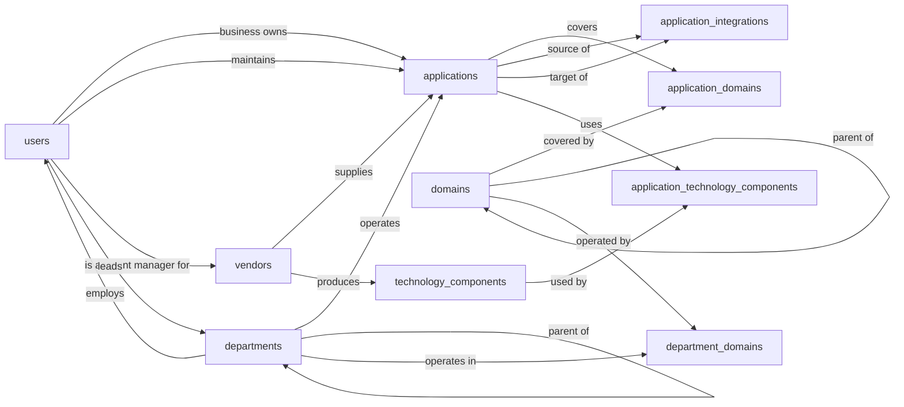

# APM (Application Portfolio Management) — Semantic Model

## 1. Overview

This Application Portfolio Management model gives an organization a single inventory of every application in use, from SaaS subscriptions and packaged point solutions to internally built systems, alongside who owns each one, what it costs annually, where it sits in its lifecycle, and which functional domains and departments depend on it. Records support both day-to-day operations (find an owner, check a vendor, trace a data integration) and portfolio rationalization (identify duplicate capability coverage, plan retirements, run TIME-style invest/migrate/eliminate decisions). The model also tracks app-to-app integrations and the technology stack underpinning internally built systems.

## 2. Entity summary

| # | Table name | Singular label | Purpose |
|---|---|---|---|
| 1 | `applications` | Application | Central portfolio record: every app, system, or solution being tracked |
| 2 | `domains` | Domain | Catalog of functional domains an app can cover (CRM, ITSM, ITAM, ATS, ERP, HRIS, CMS, ...) |
| 3 | `application_domains` | Application Domain | M:N junction linking applications to the domains they cover |
| 4 | `vendors` | Vendor | Providers of SaaS or commercial off-the-shelf software |
| 5 | `users` | User | People in the portfolio: business owners, technical owners, stewards, account managers |
| 6 | `departments` | Department | Organizational units that own or primarily consume applications |
| 7 | `department_domains` | Department Domain | M:N junction linking departments to the domains they operate in |
| 8 | `application_integrations` | Application Integration | Directed data flows between two applications (source → target) |
| 9 | `technology_components` | Technology Component | Reusable tech-stack elements (databases, languages, frameworks) underpinning internal apps |
| 10 | `application_technology_components` | Application Technology | M:N junction linking applications to the technology components they use |

### Entity-relationship diagram



## 3. Entities

### 3.1 `applications` — Application

**Plural label:** Applications
**Label column:** `application_name`
**Audit log:** yes
**Description:** One record per application, system, or solution in the portfolio. Used for inventory, ownership tracking, lifecycle management, cost rollups, and TIME-style rationalization decisions.

**Fields**

| Field name | Format | Required | Label | Reference / Notes |
|---|---|---|---|---|
| `application_name` | `string` | yes | Application Name | unique; label_column |
| `application_code` | `string` | no | Short Code | unique short identifier, e.g. `SF-CRM` |
| `description` | `text` | no | Description |  |
| `application_type` | `enum` | yes | Application Type | values: `point_solution`, `internal_system`, `platform`, `custom_built`; default: `"point_solution"` |
| `deployment_model` | `enum` | yes | Deployment Model | values: `saas`, `on_prem`, `hybrid`, `paas`, `iaas`; default: `"saas"` |
| `lifecycle_stage` | `enum` | yes | Lifecycle Stage | values: `plan`, `evaluate`, `pilot`, `active`, `phase_out`, `retired`; default: `"plan"` |
| `time_classification` | `enum` | no | TIME Assessment | values: `tolerate`, `invest`, `migrate`, `eliminate` |
| `go_live_date` | `date` | no | Go-Live Date | required when `lifecycle_stage` is `active`, `phase_out`, or `retired` |
| `phase_out_start_date` | `date` | no | Phase-Out Start Date | required when `lifecycle_stage` is `phase_out` or `retired` |
| `retirement_date` | `date` | no | Retirement Date | required when `lifecycle_stage` is `retired` |
| `vendor_id` | `reference` | no | Vendor | → `vendors` (N:1); null for purely internal builds; relationship_label: "supplies" |
| `business_owner_id` | `reference` | no | Business Owner | → `users` (N:1); relationship_label: "business owns" |
| `technical_owner_id` | `reference` | no | Technical Owner | → `users` (N:1); relationship_label: "maintains" |
| `primary_department_id` | `reference` | no | Primary Department | → `departments` (N:1); relationship_label: "operates" |
| `application_url` | `url` | no | Application URL |  |
| `documentation_url` | `url` | no | Documentation URL |  |
| `annual_cost_amount` | `number` | no | Annual Cost | precision 2; total yearly cost (license + infrastructure + support) in the organization's reporting currency |
| `notes` | `text` | no | Notes |  |

**Relationships**

- An `application` may be supplied by one `vendor` (N:1, optional). Internally built apps have no vendor.
- An `application` may have one business `owner` (a `user`) and one technical `owner` (a `user`), distinct FK fields.
- An `application` is primarily operated by one `department` (N:1, optional).
- An `application` covers one or many `domains` through the `application_domains` junction (M:N).
- An `application` uses one or many `technology_components` through the `application_technology_components` junction (M:N).
- An `application` may participate in many `application_integrations` as source or as target.

**Validation rules**

```json
[
  {
    "code": "lifecycle_dates_ordered",
    "message": "Lifecycle dates must be ordered: go-live date <= phase-out start date <= retirement date.",
    "description": "Each later lifecycle date must not precede the earlier one. Checks are skipped when later dates are null.",
    "jsonlogic": {
      "and": [
        {
          "or": [
            {"==": [{"var": "go_live_date"}, null]},
            {"==": [{"var": "phase_out_start_date"}, null]},
            {"<=": [{"var": "go_live_date"}, {"var": "phase_out_start_date"}]}
          ]
        },
        {
          "or": [
            {"==": [{"var": "phase_out_start_date"}, null]},
            {"==": [{"var": "retirement_date"}, null]},
            {"<=": [{"var": "phase_out_start_date"}, {"var": "retirement_date"}]}
          ]
        }
      ]
    }
  },
  {
    "code": "go_live_required_when_active_or_later",
    "message": "Go-live date must be set once the application is active, phasing out, or retired.",
    "description": "An application past evaluate/pilot has a recorded go-live date.",
    "jsonlogic": {
      "or": [
        {"!": {"in": [{"var": "lifecycle_stage"}, ["active", "phase_out", "retired"]]}},
        {"!=": [{"var": "go_live_date"}, null]}
      ]
    }
  },
  {
    "code": "phase_out_only_when_phase_out_or_later",
    "message": "Phase-out start date may only be set once the application is phasing out or retired.",
    "description": "Prevents recording a sunset date for an app that has not entered phase-out.",
    "jsonlogic": {
      "or": [
        {"==": [{"var": "phase_out_start_date"}, null]},
        {"in": [{"var": "lifecycle_stage"}, ["phase_out", "retired"]]}
      ]
    }
  },
  {
    "code": "phase_out_required_when_phase_out_or_retired",
    "message": "Phase-out start date must be set once the application is phasing out or retired.",
    "description": "Apps in phase_out or retired stages have a recorded phase-out start.",
    "jsonlogic": {
      "or": [
        {"!": {"in": [{"var": "lifecycle_stage"}, ["phase_out", "retired"]]}},
        {"!=": [{"var": "phase_out_start_date"}, null]}
      ]
    }
  },
  {
    "code": "retirement_only_when_retired",
    "message": "Retirement date may only be set when the application is retired.",
    "description": "Prevents recording a retirement date for a still-active app.",
    "jsonlogic": {
      "or": [
        {"==": [{"var": "retirement_date"}, null]},
        {"==": [{"var": "lifecycle_stage"}, "retired"]}
      ]
    }
  },
  {
    "code": "retirement_required_when_retired",
    "message": "Retirement date must be set when the application is retired.",
    "description": "A retired application has a recorded retirement date.",
    "jsonlogic": {
      "or": [
        {"!=": [{"var": "lifecycle_stage"}, "retired"]},
        {"!=": [{"var": "retirement_date"}, null]}
      ]
    }
  },
  {
    "code": "retired_is_one_way",
    "message": "A retired application cannot be moved back to an earlier lifecycle stage.",
    "description": "Retirement is terminal. Reintroducing a sunset app requires deliberate analyst action (delete and recreate, or override).",
    "jsonlogic": {
      "or": [
        {"==": [{"var": "$old"}, null]},
        {"!=": [{"var": "$old.lifecycle_stage"}, "retired"]},
        {"==": [{"var": "lifecycle_stage"}, "retired"]}
      ]
    }
  },
  {
    "code": "annual_cost_non_negative",
    "message": "Annual cost cannot be negative.",
    "description": "Total cost of ownership is recorded as a non-negative monetary amount.",
    "jsonlogic": {
      "or": [
        {"==": [{"var": "annual_cost_amount"}, null]},
        {">=": [{"var": "annual_cost_amount"}, 0]}
      ]
    }
  }
]
```

---

### 3.2 `domains` — Domain

**Plural label:** Domains
**Label column:** `domain_name`
**Audit log:** no
**Description:** The catalog of functional/system-type domains an application can cover (CRM, ITSM, ITAM, ATS, ERP, HRIS, CMS, ...). Self-referential to support a hierarchy (e.g. ITSM as a parent with Incident Management, Problem Management, Change Management as children).

**Fields**

| Field name | Format | Required | Label | Reference / Notes |
|---|---|---|---|---|
| `domain_name` | `string` | yes | Domain Name | unique; label_column |
| `domain_code` | `string` | no | Code | unique short identifier, e.g. `CRM`, `ITSM` |
| `description` | `text` | no | Description |  |
| `parent_domain_id` | `reference` | no | Parent Domain | → `domains` (N:1); self-reference for hierarchy; relationship_label: "parent of" |

**Relationships**

- A `domain` may have one `parent_domain` and many child `domains` (N:1 self-reference).
- A `domain` is covered by many `applications` through the `application_domains` junction (M:N).
- A `domain` is operated in by many `departments` through the `department_domains` junction (M:N).

---

### 3.3 `application_domains` — Application Domain

**Plural label:** Application Domains
**Label column:** `application_domain_label`
**Audit log:** no
**Description:** Junction table connecting each application to the domain(s) it covers. Coverage level distinguishes primary, secondary, and partial coverage so portfolio reports can highlight overlaps and gaps.

**Fields**

| Field name | Format | Required | Label | Reference / Notes |
|---|---|---|---|---|
| `application_domain_label` | `string` | yes | Coverage Label | label_column; caller populates as `"{application_name} / {domain_name}"` |
| `application_id` | `parent` | yes | Application | ↳ `applications` (N:1, cascade); relationship_label: "covers" |
| `domain_id` | `parent` | yes | Domain | ↳ `domains` (N:1, cascade); relationship_label: "covered by" |
| `coverage_level` | `enum` | no | Coverage Level | values: `primary`, `secondary`, `partial` |
| `notes` | `text` | no | Notes |  |

**Relationships**

- An `application_domain` row belongs to one `application` and one `domain` (both N:1, cascade on parent delete).
- Together with `applications` and `domains`, this junction realizes the M:N "applications cover domains" relationship.

---

### 3.4 `vendors` — Vendor

**Plural label:** Vendors
**Label column:** `vendor_name`
**Audit log:** yes
**Description:** Providers of SaaS subscriptions, commercial off-the-shelf software, or commercial technology components. One record per legal vendor entity.

**Fields**

| Field name | Format | Required | Label | Reference / Notes |
|---|---|---|---|---|
| `vendor_name` | `string` | yes | Vendor Name | unique; label_column |
| `vendor_url` | `url` | no | Website |  |
| `vendor_type` | `enum` | no | Vendor Type | values: `software_provider`, `system_integrator`, `consultancy`, `hosting_provider`, `other` |
| `headquarters_country` | `string` | no | HQ Country |  |
| `support_email` | `email` | no | Support Email |  |
| `account_manager_id` | `reference` | no | Account Manager | → `users` (N:1); internal user who manages the vendor relationship; relationship_label: "is account manager for" |
| `notes` | `text` | no | Notes |  |

**Relationships**

- A `vendor` may have one internal `account_manager` (a `user`, N:1, optional).
- A `vendor` supplies many `applications` (1:N, via `applications.vendor_id`).
- A `vendor` produces many `technology_components` (1:N, via `technology_components.vendor_id`).

---

### 3.5 `users` — User

**Plural label:** Users
**Label column:** `full_name`
**Audit log:** yes
**Description:** People referenced by the portfolio: business owners, technical owners, account managers, department heads. Self-contained in the model so it can be deployed standalone; reconciled against Semantius's built-in `users` table at deploy time.

**Fields**

| Field name | Format | Required | Label | Reference / Notes |
|---|---|---|---|---|
| `full_name` | `string` | yes | Full Name | label_column |
| `email_address` | `email` | yes | Email | unique |
| `job_title` | `string` | no | Job Title |  |
| `department_id` | `reference` | no | Department | → `departments` (N:1); relationship_label: "employs" |
| `is_active` | `boolean` | yes | Active | default: `"true"` |

**Relationships**

- A `user` belongs to at most one `department` (N:1, optional).
- A `user` may business-own many `applications` and may technically-own many `applications` (two distinct 1:N relationships via `applications.business_owner_id` and `applications.technical_owner_id`).
- A `user` may lead many `departments` as their head (1:N, via `departments.head_user_id`).
- A `user` may be the account manager for many `vendors` (1:N, via `vendors.account_manager_id`).

---

### 3.6 `departments` — Department

**Plural label:** Departments
**Label column:** `department_name`
**Audit log:** no
**Description:** Organizational units that own or primarily consume applications. Self-referential to support an org hierarchy (e.g. Engineering as parent of Frontend, Backend, Platform).

**Fields**

| Field name | Format | Required | Label | Reference / Notes |
|---|---|---|---|---|
| `department_name` | `string` | yes | Department Name | unique; label_column |
| `department_code` | `string` | no | Code | unique short identifier |
| `description` | `text` | no | Description |  |
| `parent_department_id` | `reference` | no | Parent Department | → `departments` (N:1); self-reference for org hierarchy; relationship_label: "parent of" |
| `head_user_id` | `reference` | no | Department Head | → `users` (N:1); relationship_label: "leads" |

**Relationships**

- A `department` may have one `parent_department` and many child `departments` (N:1 self-reference).
- A `department` may have one `head_user` (a `user`, N:1, optional).
- A `department` employs many `users` (1:N, via `users.department_id`).
- A `department` primarily operates many `applications` (1:N, via `applications.primary_department_id`).
- A `department` operates in many `domains` through the `department_domains` junction (M:N).

---

### 3.7 `department_domains` — Department Domain

**Plural label:** Department Domains
**Label column:** `department_domain_label`
**Audit log:** no
**Description:** Junction table connecting each department to the domain(s) it operates in. Responsibility type distinguishes primary owner, contributor, and consumer roles so the same domain can be shared across departments without ambiguity.

**Fields**

| Field name | Format | Required | Label | Reference / Notes |
|---|---|---|---|---|
| `department_domain_label` | `string` | yes | Responsibility Label | label_column; caller populates as `"{department_name} / {domain_name}"` |
| `department_id` | `parent` | yes | Department | ↳ `departments` (N:1, cascade); relationship_label: "operates in" |
| `domain_id` | `parent` | yes | Domain | ↳ `domains` (N:1, cascade); relationship_label: "operated by" |
| `responsibility_type` | `enum` | no | Responsibility | values: `owner`, `contributor`, `consumer` |

**Relationships**

- A `department_domain` row belongs to one `department` and one `domain` (both N:1, cascade on parent delete).
- Together with `departments` and `domains`, this junction realizes the M:N "departments operate in domains" relationship.

---

### 3.8 `application_integrations` — Application Integration

**Plural label:** Application Integrations
**Label column:** `integration_name`
**Audit log:** yes
**Description:** Directed data flows between two applications. Captures the integration technology, direction, and data sensitivity so the portfolio can be analyzed for tightly coupled apps, high-risk data movement, and retirement blast radius.

**Fields**

| Field name | Format | Required | Label | Reference / Notes |
|---|---|---|---|---|
| `integration_name` | `string` | yes | Integration Name | label_column |
| `source_application_id` | `reference` | yes | Source Application | → `applications` (N:1); relationship_label: "source of" |
| `target_application_id` | `reference` | yes | Target Application | → `applications` (N:1); relationship_label: "target of" |
| `integration_type` | `enum` | no | Integration Type | values: `api`, `file_transfer`, `database`, `message_queue`, `etl`, `manual`, `other` |
| `integration_direction` | `enum` | yes | Direction | values: `one_way`, `bidirectional`; default: `"one_way"` |
| `data_classification` | `enum` | no | Data Sensitivity | values: `public`, `internal`, `confidential`, `restricted`, `pii` |
| `description` | `text` | no | Description |  |
| `is_active` | `boolean` | yes | Active | default: `"true"` |

**Relationships**

- An `application_integration` references one source `application` and one target `application` (both N:1, required).
- The source and target must differ (see Validation rules).

**Validation rules**

```json
[
  {
    "code": "source_target_differ",
    "message": "An integration's source and target applications must be different.",
    "description": "An application cannot integrate with itself; a self-integration is a modeling error and would corrupt blast-radius analysis.",
    "jsonlogic": {
      "!=": [{"var": "source_application_id"}, {"var": "target_application_id"}]
    }
  }
]
```

---

### 3.9 `technology_components` — Technology Component

**Plural label:** Technology Components
**Label column:** `technology_name`
**Audit log:** no
**Description:** Reusable tech-stack elements (databases, programming languages, frameworks, runtimes, operating systems, middleware, web servers) used by internally built applications. Tracks lifecycle status so the org can flag deprecated or prohibited technologies that should be migrated off.

**Fields**

| Field name | Format | Required | Label | Reference / Notes |
|---|---|---|---|---|
| `technology_name` | `string` | yes | Technology Name | unique; label_column |
| `technology_category` | `enum` | no | Category | values: `programming_language`, `database`, `framework`, `runtime`, `operating_system`, `middleware`, `web_server`, `other` |
| `vendor_id` | `reference` | no | Vendor | → `vendors` (N:1); null for open-source; relationship_label: "produces" |
| `current_version` | `string` | no | Current Version |  |
| `lifecycle_status` | `enum` | no | Lifecycle Status | values: `emerging`, `current`, `deprecated`, `prohibited` |
| `end_of_life_date` | `date` | no | End-of-Life Date |  |
| `notes` | `text` | no | Notes |  |

**Relationships**

- A `technology_component` may be produced by one `vendor` (N:1, optional).
- A `technology_component` is used by many `applications` through the `application_technology_components` junction (M:N).

---

### 3.10 `application_technology_components` — Application Technology

**Plural label:** Application Technologies
**Label column:** `application_technology_label`
**Audit log:** no
**Description:** Junction table connecting each application to the technology component(s) it uses. `version_used` captures the actual version this application runs on, which may lag behind the component's `current_version`.

**Fields**

| Field name | Format | Required | Label | Reference / Notes |
|---|---|---|---|---|
| `application_technology_label` | `string` | yes | Application Technology Label | label_column; caller populates as `"{application_name} / {technology_name}"` |
| `application_id` | `parent` | yes | Application | ↳ `applications` (N:1, cascade); relationship_label: "uses" |
| `technology_component_id` | `parent` | yes | Technology Component | ↳ `technology_components` (N:1, cascade); relationship_label: "used by" |
| `version_used` | `string` | no | Version Used | actual version used by this app (may differ from the component's `current_version`) |
| `usage_notes` | `text` | no | Usage Notes |  |

**Relationships**

- An `application_technology_components` row belongs to one `application` and one `technology_component` (both N:1, cascade on parent delete).
- Together with `applications` and `technology_components`, this junction realizes the M:N "applications use technologies" relationship.

## 4. Relationship summary

| From | Field | To | Cardinality | Kind | Delete behavior |
|---|---|---|---|---|---|
| `applications` | `vendor_id` | `vendors` | N:1 | reference | clear |
| `applications` | `business_owner_id` | `users` | N:1 | reference | clear |
| `applications` | `technical_owner_id` | `users` | N:1 | reference | clear |
| `applications` | `primary_department_id` | `departments` | N:1 | reference | clear |
| `domains` | `parent_domain_id` | `domains` | N:1 | reference | clear |
| `application_domains` | `application_id` | `applications` | N:1 | parent (junction) | cascade |
| `application_domains` | `domain_id` | `domains` | N:1 | parent (junction) | cascade |
| `vendors` | `account_manager_id` | `users` | N:1 | reference | clear |
| `users` | `department_id` | `departments` | N:1 | reference | clear |
| `departments` | `parent_department_id` | `departments` | N:1 | reference | clear |
| `departments` | `head_user_id` | `users` | N:1 | reference | clear |
| `department_domains` | `department_id` | `departments` | N:1 | parent (junction) | cascade |
| `department_domains` | `domain_id` | `domains` | N:1 | parent (junction) | cascade |
| `application_integrations` | `source_application_id` | `applications` | N:1 | reference | clear |
| `application_integrations` | `target_application_id` | `applications` | N:1 | reference | clear |
| `technology_components` | `vendor_id` | `vendors` | N:1 | reference | clear |
| `application_technology_components` | `application_id` | `applications` | N:1 | parent (junction) | cascade |
| `application_technology_components` | `technology_component_id` | `technology_components` | N:1 | parent (junction) | cascade |

## 5. Enumerations

### 5.1 `applications.application_type`
- `point_solution`
- `internal_system`
- `platform`
- `custom_built`

### 5.2 `applications.deployment_model`
- `saas`
- `on_prem`
- `hybrid`
- `paas`
- `iaas`

### 5.3 `applications.lifecycle_stage`
- `plan`
- `evaluate`
- `pilot`
- `active`
- `phase_out`
- `retired`

### 5.4 `applications.time_classification`
- `tolerate`
- `invest`
- `migrate`
- `eliminate`

### 5.5 `application_domains.coverage_level`
- `primary`
- `secondary`
- `partial`

### 5.6 `vendors.vendor_type`
- `software_provider`
- `system_integrator`
- `consultancy`
- `hosting_provider`
- `other`

### 5.7 `department_domains.responsibility_type`
- `owner`
- `contributor`
- `consumer`

### 5.8 `application_integrations.integration_type`
- `api`
- `file_transfer`
- `database`
- `message_queue`
- `etl`
- `manual`
- `other`

### 5.9 `application_integrations.integration_direction`
- `one_way`
- `bidirectional`

### 5.10 `application_integrations.data_classification`
- `public`
- `internal`
- `confidential`
- `restricted`
- `pii`

### 5.11 `technology_components.technology_category`
- `programming_language`
- `database`
- `framework`
- `runtime`
- `operating_system`
- `middleware`
- `web_server`
- `other`

### 5.12 `technology_components.lifecycle_status`
- `emerging`
- `current`
- `deprecated`
- `prohibited`

## 6. Cross-model link suggestions

| From | To | Verb | Cardinality | Delete |
|---|---|---|---|---|
| `business_capabilities` | `domains` | groups | N:1 | clear |
| `capability_roadmaps` | `applications` | is planned by | N:1 | clear |
| `vendor_contracts` | `applications` | is covered by | N:1 | clear |
| `app_entitlements` | `applications` | is entitled by | N:1 | clear |
| `positions` | `departments` | houses | N:1 | clear |
| `licenses` | `applications` | is licensed by | N:1 | clear |
| `software_assets` | `applications` | is deployed by | N:1 | clear |
| `configuration_items` | `applications` | is implemented by | N:1 | clear |
| `incidents` | `applications` | is affected by | N:1 | clear |
| `problems` | `applications` | is the subject of | N:1 | clear |
| `changes` | `applications` | is targeted by | N:1 | clear |
| `projects` | `applications` | is in scope of | N:1 | clear |
| `applications` | `cost_centers` | funds | N:1 | clear |
| `cost_allocations` | `applications` | is charged via | N:1 | clear |
| `risks` | `applications` | carries | N:1 | clear |
| `data_objects` | `applications` | owns | N:1 | clear |
| `data_objects` | `application_integrations` | carries | N:1 | clear |
| `process_steps` | `applications` | hosts | N:1 | clear |

## 7. Open questions

### 7.1 🔴 Decisions needed (blockers)

None.

### 7.2 🟡 Future considerations (deferred scope)

- Should total cost of ownership be expanded from the single `annual_cost_amount` field into multiple cost categories (license, infrastructure, support, customization, training), or stay as a single rolled-up total with deeper breakdown deferred to a sibling Budgeting model?
- Should the `domains` hierarchy and the `departments` hierarchy enforce cycle prevention at the database level (preventing a node from becoming its own ancestor), or trust the application layer? Row-level JsonLogic cannot detect multi-step cycles.
- Should junction-pair uniqueness be enforced at the database level for `application_domains` (`application_id`, `domain_id`), `department_domains` (`department_id`, `domain_id`), and `application_technology_components` (`application_id`, `technology_component_id`)? Currently caller-responsibility.
- Should an `application_categories` axis be added separately from `domains` for organizations that want both a capability map (CRM, ITSM, ATS as functional buckets) and a software-product taxonomy (e.g. ServiceNow categorized as both ITSM and ITAM at once)?
- Should the TIME assessment carry a `last_assessed_at` date and a `last_assessed_by_user_id` reference, so reviewers can see how stale a TIME rating is?
- Should `application_integrations` track data flow volume, frequency, or SLA characteristics for capacity planning and resilience analysis?
- Should `lifecycle_stage = retired` be reversible (re-introduction of a sunset application) instead of the current one-way transition? The current rule blocks moves back from `retired`.
- Once a sibling ITAM or Technology Standards model is deployed, should `technology_components` be deprecated in this module in favor of the sibling model's canonical tech inventory, or retained as a portfolio-local cache?
- Should `vendor_id` on `applications` become an M:N relationship to support apps supplied jointly by multiple vendors (e.g. prime contractor + sub-vendor arrangements)?
- Should `application_integrations` model an intermediate `integration_endpoints` entity to capture per-side technical details (endpoint URL, auth method, schema), or keep integrations as flat source-target pairs?

## 8. Implementation notes for the downstream agent

1. Create one module named `apm` (the module name **must** equal the `system_slug` from the front-matter, do not invent a different module slug here) and two baseline permissions (`apm:read`, `apm:manage`) before any entity.
2. Create entities in the order given in §2, parents before children: `domains`, `vendors`, `users`, `departments`, `applications`, `application_domains`, `department_domains`, `application_integrations`, `technology_components`, `application_technology_components`.
3. For each entity, set `label_column` to the snake_case field marked as label_column in §3, pass `module_id`, `view_permission`, `edit_permission`. Do **not** manually create `id`, `created_at`, `updated_at`, or the auto-label field.
4. For each field in §3, pass `table_name`, `field_name`, `format`, `title` (the Label column), and for `reference`/`parent` fields also `reference_table` and a `reference_delete_mode` consistent with §4. Persist the `relationship_label: "<verb>"` annotation from §3 onto the FK field. Persist the `validation_rules` blocks on `applications` and `application_integrations` byte-for-byte via the entity-create call.
5. **Fix up each entity's auto-created label-column field title.** `create_entity` auto-creates a field whose `field_name` equals the entity's `label_column`, with `title` defaulting to `singular_label`. For every entity whose §3 field table specifies a Label for the label_column row that differs from `singular_label`, follow up with `update_field` to set the correct title. The `update_field` `id` is the **composite string** `"{table_name}.{field_name}"` (e.g. `"applications.application_name"`, `"vendors.vendor_name"`, `"users.full_name"`, `"departments.department_name"`, `"domains.domain_name"`, `"technology_components.technology_name"`, `"application_integrations.integration_name"`, and the junction labels `"application_domains.application_domain_label"`, `"department_domains.department_domain_label"`, `"application_technology_components.application_technology_label"`), passed as a **string, not an integer**, or the update will fail.
6. **Deduplicate against Semantius built-in tables.** This model is self-contained and declares `users` (and may overlap with built-in `departments`, `roles`, `permissions`). For each declared entity, read Semantius first: if a built-in already covers it, skip the create and reuse the built-in as the `reference_table` target. Optionally add missing fields to the built-in only if the model requires them (additive, low-risk changes only).
7. **Apply §6 cross-model link suggestions.** After the model's own creates and the built-in dedup pass, walk the §6 hint table. For each row, look up the `To` concept in the live catalog: when a single entity matches, propose an additive `create_field` on `From` using the auto-generated `<target_singular>_id` field name with the row's `Verb` as `relationship_label` and `Delete` as `reference_delete_mode`; when several candidates match, batch a single user confirmation; when no candidate matches, skip silently. All §6 changes are strictly additive.
8. After creation, spot-check that `label_column` on each entity resolves to a real field, that all `reference_table` targets exist, and that the `validation_rules` blocks on `applications` and `application_integrations` are stored and evaluable.
