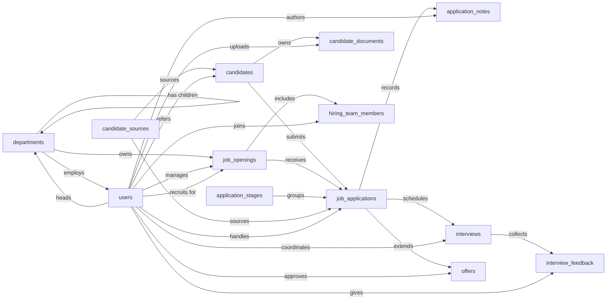

# Applicant Tracking System — Semantic Model

## 1. Overview

An applicant tracking system used by an in-house recruiting team to manage open job requisitions, the candidates considered for them, and the full hiring funnel from application through interviews to offer. Primary users are recruiters, hiring managers, and interviewers; the system records who applied for what, where they are in the pipeline, what feedback interviewers gave, and what offers were extended and accepted.

## 2. Entity summary

| # | Table name | Singular label | Purpose |
|---|---|---|---|
| 1 | `departments` | Department | Organizational units that own job openings (e.g. Engineering, Sales). Supports an optional parent–child hierarchy. |
| 2 | `job_openings` | Job Opening | A specific role being hired for, with status, hiring team, headcount, and target start date. |
| 3 | `application_stages` | Application Stage | Configurable pipeline steps (e.g. New, Phone Screen, On-site, Offer, Hired, Rejected) with order and category. |
| 4 | `candidate_sources` | Candidate Source | Where candidates come from (job board, referral, agency, inbound, sourced). |
| 5 | `candidates` | Candidate | A person in the talent pool. Exists independently of any specific job application. |
| 6 | `job_applications` | Job Application | A candidate applying to a specific job opening — the central pipeline record. |
| 7 | `candidate_documents` | Candidate Document | Resumes, cover letters, portfolios, work samples attached to a candidate. |
| 8 | `application_notes` | Application Note | Comment thread on an application — recruiter and hiring-manager observations. |
| 9 | `interviews` | Interview | A scheduled interview event tied to an application (kind, time, location/URL). |
| 10 | `interview_feedback` | Interview Feedback | Scorecard from one interviewer for one interview — rating, recommendation, notes. |
| 11 | `offers` | Offer | A formal offer extended to a candidate for a job — terms, status, candidate response. |
| 12 | `hiring_team_members` | Hiring Team Member | Junction: a user assigned to a job opening with a role (recruiter, hiring manager, interviewer, coordinator). |
| 13 | `users` | User | System users (recruiters, hiring managers, interviewers, coordinators). Modeled for self-containment; deployer dedupes against the Semantius built-in. |

### Entity-relationship diagram

## 3. Entities

### 3.1 `departments` — Department

**Plural label:** Departments
**Label column:** `department_name`
**Audit log:** no
**Description:** An organizational unit that owns one or more job openings. Supports an optional parent–child hierarchy so business units can contain sub-teams.

**Fields**

| Field name | Format | Required | Label | Reference / Notes |
|---|---|---|---|---|
| `department_name` | `string` | yes | Department Name | label_column; unique |
| `department_code` | `string` | no | Code | unique (e.g. `ENG`, `SALES`) |
| `parent_department_id` | `reference` | no | Parent Department | → `departments` (N:1), self-reference for hierarchy, relationship_label: "has children" |
| `head_user_id` | `reference` | no | Department Head | → `users` (N:1), relationship_label: "heads" |

**Relationships**

- A `department` may have a `parent_department` and many child `departments` (1:N self-reference, optional).
- A `department` may be headed by one `user` (N:1, optional).
- A `department` owns many `job_openings` (1:N, via `job_openings.department_id`).
- Many `users` may belong to a `department` (1:N, via `users.department_id`).

---

### 3.2 `job_openings` — Job Opening

**Plural label:** Job Openings
**Label column:** `job_title`
**Audit log:** yes  _(status changes and salary band updates are subject to dispute; keep a history)_
**Description:** A specific position the company is hiring for. Created in draft, opened for applications, then transitions through `on_hold` / `filled` / `closed` / `cancelled`. Has one hiring manager and an optional lead recruiter; additional team members are tracked via `hiring_team_members`.

**Fields**

| Field name | Format | Required | Label | Reference / Notes |
|---|---|---|---|---|
| `job_title` | `string` | yes | Job Title | label_column |
| `job_code` | `string` | no | Requisition Code | unique (e.g. `ENG-2026-014`) |
| `department_id` | `reference` | yes | Department | → `departments` (N:1, restrict), relationship_label: "owns" |
| `hiring_manager_id` | `reference` | yes | Hiring Manager | → `users` (N:1, restrict), relationship_label: "manages" |
| `recruiter_id` | `reference` | no | Lead Recruiter | → `users` (N:1, clear), relationship_label: "recruits for" |
| `employment_type` | `enum` | yes | Employment Type | values: `full_time`, `part_time`, `contract`, `internship`, `temporary` |
| `work_arrangement` | `enum` | yes | Work Arrangement | values: `onsite`, `remote`, `hybrid` |
| `location` | `string` | no | Location | |
| `status` | `enum` | yes | Status | values: `draft`, `open`, `on_hold`, `filled`, `closed`, `cancelled` |
| `headcount` | `integer` | yes | Headcount | how many to hire |
| `opened_at` | `date` | no | Opened | |
| `target_start_date` | `date` | no | Target Start Date | |
| `filled_at` | `date` | no | Filled | |
| `salary_min` | `number` | no | Salary Min | precision 2; monetary |
| `salary_max` | `number` | no | Salary Max | precision 2; monetary |
| `salary_currency` | `string` | no | Currency | ISO 4217 code (e.g. `USD`) |
| `job_description` | `html` | no | Description | rich-text role description |
| `job_requirements` | `text` | no | Requirements | required experience, skills, etc. |

**Relationships**

- A `job_opening` belongs to one `department` (N:1, required, restrict).
- A `job_opening` has one `hiring_manager` user (N:1, required, restrict) and optionally one lead `recruiter` user (N:1, optional, clear).
- A `job_opening` receives many `job_applications` (1:N, via `job_applications.job_opening_id`, restrict — applications must be archived before a job can be deleted).
- A `job_opening` has many `hiring_team_members` (1:N, via the `hiring_team_members` junction).

---

### 3.3 `application_stages` — Application Stage

**Plural label:** Application Stages
**Label column:** `stage_name`
**Audit log:** no
**Description:** A configurable step in the application pipeline. Stages are shared across all job openings (single global pipeline assumption — see §6.1). `stage_order` controls sort; `stage_category` groups stages so reports and downstream logic can reason about pipeline phase without parsing names.

**Fields**

| Field name | Format | Required | Label | Reference / Notes |
|---|---|---|---|---|
| `stage_name` | `string` | yes | Stage Name | label_column; unique |
| `stage_order` | `integer` | yes | Order | sort order in the pipeline |
| `stage_category` | `enum` | yes | Category | values: `pre_screen`, `screening`, `interview`, `offer`, `hired`, `rejected` |
| `is_active` | `boolean` | yes | Active | default `true` |
| `description` | `text` | no | Description | |

**Relationships**

- An `application_stage` may be the current stage of many `job_applications` (1:N, via `job_applications.current_stage_id`, restrict — stages cannot be deleted while in use).

---

### 3.4 `candidate_sources` — Candidate Source

**Plural label:** Candidate Sources
**Label column:** `source_name`
**Audit log:** no
**Description:** A named source from which candidates and applications originate, used for sourcing analytics. Examples: "LinkedIn Jobs", "Employee Referral Program", "Acme Recruiting Agency".

**Fields**

| Field name | Format | Required | Label | Reference / Notes |
|---|---|---|---|---|
| `source_name` | `string` | yes | Source Name | label_column; unique |
| `source_type` | `enum` | yes | Source Type | values: `job_board`, `referral`, `agency`, `inbound`, `sourced`, `social_media`, `career_site`, `event`, `other` |
| `is_active` | `boolean` | yes | Active | default `true` |
| `description` | `text` | no | Description | |

**Relationships**

- A `candidate_source` may be the source of many `candidates` (1:N, via `candidates.source_id`, clear).
- A `candidate_source` may be the source of many `job_applications` (1:N, via `job_applications.source_id`, clear) — the application can be tagged with a different source than the candidate (e.g. candidate originally sourced from LinkedIn, but applied via referral for this specific role).

---

### 3.5 `candidates` — Candidate

**Plural label:** Candidates
**Label column:** `full_name`
**Audit log:** yes  _(personal data subject to GDPR / data-subject access requests; preserve a change history)_
**Description:** A person in the talent pool. A candidate exists independently of any specific job and may have multiple `job_applications` over time. Identity is loosely keyed on `email_address` (unique when present) — duplicates are detected at the recruiter's discretion.

**Fields**

| Field name | Format | Required | Label | Reference / Notes |
|---|---|---|---|---|
| `full_name` | `string` | yes | Full Name | label_column |
| `first_name` | `string` | no | First Name | |
| `last_name` | `string` | no | Last Name | |
| `email_address` | `email` | no | Email | unique |
| `phone_number` | `string` | no | Phone | |
| `linkedin_url` | `url` | no | LinkedIn | |
| `current_employer` | `string` | no | Current Employer | |
| `current_job_title` | `string` | no | Current Job Title | |
| `location_city` | `string` | no | City | |
| `location_country` | `string` | no | Country | |
| `source_id` | `reference` | no | Source | → `candidate_sources` (N:1, clear), relationship_label: "sources" |
| `referrer_user_id` | `reference` | no | Referred By | → `users` (N:1, clear) — the employee who made the referral, when source is a referral, relationship_label: "refers" |
| `candidate_status` | `enum` | yes | Candidate Status | values: `active`, `hired`, `archived`, `do_not_contact` |
| `notes` | `text` | no | Notes | candidate-level notes (vs application-level) |

**Relationships**

- A `candidate` may originate from one `candidate_source` (N:1, optional, clear).
- A `candidate` may be referred by one `user` (N:1, optional, clear).
- A `candidate` owns many `job_applications` (1:N, via `job_applications.candidate_id`, cascade — deleting a candidate wipes their applications, supporting GDPR erasure).
- A `candidate` owns many `candidate_documents` (1:N, via `candidate_documents.candidate_id`, cascade).

---

### 3.6 `job_applications` — Job Application

**Plural label:** Job Applications
**Label column:** `application_label`
**Audit log:** yes  _(stage transitions and status changes are central to the audit trail of a hiring decision)_
**Description:** The central pipeline record — a specific candidate applying to a specific job opening, currently sitting at one application stage. Created when a candidate applies (or when a recruiter pulls them into a role) and progresses through stages until terminal status (`hired`, `rejected`, `withdrawn`).

**Fields**

| Field name | Format | Required | Label | Reference / Notes |
|---|---|---|---|---|
| `application_label` | `string` | yes | Application | label_column; caller composes on insert (e.g. `"{candidate.full_name} → {job_opening.job_title}"`) |
| `candidate_id` | `parent` | yes | Candidate | ↳ `candidates` (N:1, cascade), relationship_label: "submits" |
| `job_opening_id` | `reference` | yes | Job Opening | → `job_openings` (N:1, restrict) — preserves history if a job is closed, relationship_label: "receives" |
| `current_stage_id` | `reference` | yes | Current Stage | → `application_stages` (N:1, restrict), relationship_label: "groups" |
| `status` | `enum` | yes | Status | values: `active`, `hired`, `rejected`, `withdrawn`, `on_hold` |
| `source_id` | `reference` | no | Source | → `candidate_sources` (N:1, clear), relationship_label: "sources" |
| `applied_at` | `date-time` | yes | Applied At | |
| `assigned_recruiter_id` | `reference` | no | Assigned Recruiter | → `users` (N:1, clear), relationship_label: "handles" |
| `rejection_reason` | `enum` | no | Rejection Reason | values: `not_qualified`, `withdrew`, `position_filled`, `no_show`, `salary_mismatch`, `location_mismatch`, `culture_fit`, `other` |
| `rejected_at` | `date-time` | no | Rejected At | |
| `hired_at` | `date-time` | no | Hired At | |

**Relationships**

- A `job_application` belongs to one `candidate` as its parent (N:1, required, cascade — owning lifecycle).
- A `job_application` references one `job_opening` (N:1, required, restrict — historical applications survive a job closure).
- A `job_application` is currently at one `application_stage` (N:1, required, restrict).
- A `job_application` may originate from one `candidate_source` (N:1, optional, clear).
- A `job_application` may be assigned to one `user` recruiter (N:1, optional, clear).
- A `job_application` has many `application_notes`, `interviews`, and `offers` (1:N, all cascade except `offers` which is `restrict` — see §3.11).

---

### 3.7 `candidate_documents` — Candidate Document

**Plural label:** Candidate Documents
**Label column:** `document_label`
**Audit log:** no
**Description:** A document attached to a candidate — resume, cover letter, portfolio, work sample, certification, or reference letter. Stored as a URL pointing to file storage; the model does not own the binary itself.

**Fields**

| Field name | Format | Required | Label | Reference / Notes |
|---|---|---|---|---|
| `document_label` | `string` | yes | Document | label_column; caller composes (e.g. `"Resume — Jane Doe"`) |
| `candidate_id` | `parent` | yes | Candidate | ↳ `candidates` (N:1, cascade), relationship_label: "owns" |
| `document_type` | `enum` | yes | Document Type | values: `resume`, `cover_letter`, `portfolio`, `work_sample`, `certification`, `reference_letter`, `other` |
| `file_url` | `url` | yes | File URL | external storage URL |
| `file_name` | `string` | no | File Name | original uploaded filename |
| `uploaded_at` | `date-time` | yes | Uploaded At | |
| `uploaded_by_user_id` | `reference` | no | Uploaded By | → `users` (N:1, clear), relationship_label: "uploads" |

**Relationships**

- A `candidate_document` belongs to one `candidate` as its parent (N:1, required, cascade — documents are wiped if the candidate is erased).
- A `candidate_document` may be uploaded by one `user` (N:1, optional, clear).

---

### 3.8 `application_notes` — Application Note

**Plural label:** Application Notes
**Label column:** `note_subject`
**Audit log:** no
**Description:** A note left on an application — a recruiter or hiring-manager observation, decision rationale, or coordination message. Visibility controls who can read the note (whole hiring team vs. recruiters only vs. publicly visible to the candidate).

**Fields**

| Field name | Format | Required | Label | Reference / Notes |
|---|---|---|---|---|
| `note_subject` | `string` | yes | Subject | label_column; short summary line |
| `application_id` | `parent` | yes | Application | ↳ `job_applications` (N:1, cascade), relationship_label: "records" |
| `author_user_id` | `reference` | yes | Author | → `users` (N:1, restrict) — preserves authorship audit trail, relationship_label: "authors" |
| `note_body` | `text` | yes | Note | |
| `visibility` | `enum` | yes | Visibility | values: `hiring_team`, `recruiter_only`, `public` |
| `noted_at` | `date-time` | yes | Noted At | |

**Relationships**

- An `application_note` belongs to one `job_application` as its parent (N:1, required, cascade).
- An `application_note` is authored by one `user` (N:1, required, restrict — author cannot be deleted while their notes exist).

---

### 3.9 `interviews` — Interview

**Plural label:** Interviews
**Label column:** `interview_label`
**Audit log:** no
**Description:** A scheduled interview event for a specific application. May involve one or more interviewers (each captured as their own `interview_feedback` row). Status transitions from `scheduled` through `completed` / `cancelled` / `no_show` / `rescheduled`.

**Fields**

| Field name | Format | Required | Label | Reference / Notes |
|---|---|---|---|---|
| `interview_label` | `string` | yes | Interview | label_column; caller composes (e.g. `"Tech Phone Screen — Jane Doe"`) |
| `application_id` | `parent` | yes | Application | ↳ `job_applications` (N:1, cascade), relationship_label: "schedules" |
| `interview_kind` | `enum` | yes | Kind | values: `phone_screen`, `video_call`, `onsite`, `technical`, `take_home`, `panel`, `final`, `reference_check` |
| `scheduled_start` | `date-time` | yes | Start | |
| `scheduled_end` | `date-time` | yes | End | |
| `location` | `string` | no | Location | physical location for `onsite` interviews |
| `meeting_url` | `url` | no | Meeting URL | video-call link |
| `status` | `enum` | yes | Status | values: `scheduled`, `completed`, `cancelled`, `no_show`, `rescheduled` |
| `coordinator_user_id` | `reference` | no | Coordinator | → `users` (N:1, clear), relationship_label: "coordinates" |

**Relationships**

- An `interview` belongs to one `job_application` as its parent (N:1, required, cascade).
- An `interview` may be coordinated by one `user` (N:1, optional, clear).
- An `interview` has many `interview_feedback` rows — one per interviewer (1:N, via `interview_feedback.interview_id`, cascade).

---

### 3.10 `interview_feedback` — Interview Feedback

**Plural label:** Interview Feedback
**Label column:** `feedback_label`
**Audit log:** yes  _(scorecards are decision evidence; preserve change history)_
**Description:** One interviewer's scorecard for one interview. An interview can have multiple feedback rows when multiple people attended (e.g. a panel). `is_submitted` distinguishes a draft scorecard from a finalized one.

**Fields**

| Field name | Format | Required | Label | Reference / Notes |
|---|---|---|---|---|
| `feedback_label` | `string` | yes | Feedback | label_column; caller composes (e.g. `"Alex Kim — Tech Phone Screen for Jane Doe"`) |
| `interview_id` | `parent` | yes | Interview | ↳ `interviews` (N:1, cascade), relationship_label: "collects" |
| `interviewer_user_id` | `reference` | yes | Interviewer | → `users` (N:1, restrict) — preserves authorship, relationship_label: "gives" |
| `overall_rating` | `enum` | no | Overall Rating | values: `strong_yes`, `yes`, `lean_yes`, `lean_no`, `no`, `strong_no` |
| `recommendation` | `enum` | no | Recommendation | values: `advance`, `hold`, `reject` |
| `strengths` | `text` | no | Strengths | |
| `concerns` | `text` | no | Concerns | |
| `detailed_notes` | `text` | no | Detailed Notes | |
| `is_submitted` | `boolean` | yes | Submitted | default `false` |
| `submitted_at` | `date-time` | no | Submitted At | populated when `is_submitted` flips to `true` |

**Relationships**

- An `interview_feedback` belongs to one `interview` as its parent (N:1, required, cascade).
- An `interview_feedback` is authored by one `user` interviewer (N:1, required, restrict — the interviewer cannot be deleted while feedback exists).

---

### 3.11 `offers` — Offer

**Plural label:** Offers
**Label column:** `offer_label`
**Audit log:** yes  _(offers are commitments — preserve full change history of terms, status, and approvals)_
**Description:** A formal offer extended to a candidate for a specific application. Goes through `draft` → `pending_approval` → `approved` → `sent`, then `accepted` / `declined` / `rescinded` / `expired`. An application typically has at most one active offer; the model uses `restrict` so an offer is never silently lost when an application is cleaned up.

**Fields**

| Field name | Format | Required | Label | Reference / Notes |
|---|---|---|---|---|
| `offer_label` | `string` | yes | Offer | label_column; caller composes (e.g. `"Offer — Jane Doe — Senior Engineer"`) |
| `application_id` | `reference` | yes | Application | → `job_applications` (N:1, restrict), relationship_label: "extends" |
| `status` | `enum` | yes | Status | values: `draft`, `pending_approval`, `approved`, `sent`, `accepted`, `declined`, `rescinded`, `expired` |
| `base_salary` | `number` | yes | Base Salary | precision 2; monetary |
| `salary_currency` | `string` | yes | Currency | ISO 4217 code |
| `bonus_target` | `number` | no | Bonus Target | annual on-target bonus; precision 2; monetary |
| `equity_amount` | `string` | no | Equity | free-text (shares, RSU value, percentages vary) |
| `start_date` | `date` | no | Start Date | proposed start date |
| `offer_extended_at` | `date-time` | no | Extended At | timestamp the offer was sent to the candidate |
| `offer_expires_at` | `date-time` | no | Expires At | |
| `candidate_response` | `enum` | yes | Candidate Response | values: `pending`, `accepted`, `declined`, `no_response` |
| `responded_at` | `date-time` | no | Responded At | |
| `approver_user_id` | `reference` | no | Approver | → `users` (N:1, clear), relationship_label: "approves" |

**Relationships**

- An `offer` references one `job_application` (N:1, required, restrict — preserves the offer record even if cleanup of the application is attempted).
- An `offer` may have one approving `user` (N:1, optional, clear).

---

### 3.12 `hiring_team_members` — Hiring Team Member

**Plural label:** Hiring Team Members
**Label column:** `team_member_label`
**Audit log:** no
**Description:** Junction associating a `user` with a `job_opening` in a specific role (recruiter, hiring manager, interviewer, coordinator, executive sponsor). A user can sit on many openings; an opening can have many team members in the same or different roles. The hiring manager and lead recruiter on `job_openings` are summary FKs for the most-common case; this junction holds the full team and additional roles.

**Fields**

| Field name | Format | Required | Label | Reference / Notes |
|---|---|---|---|---|
| `team_member_label` | `string` | yes | Team Member | label_column; caller composes (e.g. `"Alex Kim — Hiring Manager — Senior Engineer"`) |
| `job_opening_id` | `parent` | yes | Job Opening | ↳ `job_openings` (N:1, cascade), relationship_label: "includes" |
| `user_id` | `parent` | yes | User | ↳ `users` (N:1, cascade), relationship_label: "joins" |
| `team_role` | `enum` | yes | Role | values: `recruiter`, `hiring_manager`, `interviewer`, `coordinator`, `executive_sponsor` |
| `assigned_at` | `date-time` | yes | Assigned At | |
| `is_active` | `boolean` | yes | Active | default `true` — set `false` to remove from team without deleting history |

**Relationships**

- A `hiring_team_member` belongs to one `job_opening` and one `user`, both as parents (cascade on either side).
- `users` ↔ `job_openings` is many-to-many through this junction.

---

### 3.13 `users` — User

**Plural label:** Users
**Label column:** `display_name`
**Audit log:** no
**Description:** A system user — recruiter, hiring manager, interviewer, or coordinator. **Modeled here for self-containment.** Semantius ships a built-in `users` table; the deployer reuses the built-in and only adds any of the fields below that the built-in lacks. All other entities reference this table via `reference_table: "users"`.

**Fields**

| Field name | Format | Required | Label | Reference / Notes |
|---|---|---|---|---|
| `display_name` | `string` | yes | Display Name | label_column |
| `email_address` | `email` | yes | Email | unique |
| `first_name` | `string` | no | First Name | |
| `last_name` | `string` | no | Last Name | |
| `job_title` | `string` | no | Job Title | this user's own job title at the company |
| `department_id` | `reference` | no | Department | → `departments` (N:1, clear), relationship_label: "employs" |
| `is_active` | `boolean` | yes | Active | default `true` |

**Relationships**

- A `user` may belong to one `department` (N:1, optional, clear).
- A `user` may head one or more `departments` (1:N, via `departments.head_user_id`).
- A `user` may be the hiring manager, lead recruiter, assigned recruiter, coordinator, interviewer, author, uploader, or approver across many other entities — see §4 for the full edge list.
- `users` ↔ `job_openings` is many-to-many through `hiring_team_members`.

---

## 4. Relationship summary

| From | Field | To | Cardinality | Kind | Delete behavior |
|---|---|---|---|---|---|
| `departments` | `parent_department_id` | `departments` | N:1 | reference | clear |
| `departments` | `head_user_id` | `users` | N:1 | reference | clear |
| `users` | `department_id` | `departments` | N:1 | reference | clear |
| `job_openings` | `department_id` | `departments` | N:1 | reference | restrict |
| `job_openings` | `hiring_manager_id` | `users` | N:1 | reference | restrict |
| `job_openings` | `recruiter_id` | `users` | N:1 | reference | clear |
| `candidates` | `source_id` | `candidate_sources` | N:1 | reference | clear |
| `candidates` | `referrer_user_id` | `users` | N:1 | reference | clear |
| `job_applications` | `candidate_id` | `candidates` | N:1 | parent | cascade |
| `job_applications` | `job_opening_id` | `job_openings` | N:1 | reference | restrict |
| `job_applications` | `current_stage_id` | `application_stages` | N:1 | reference | restrict |
| `job_applications` | `source_id` | `candidate_sources` | N:1 | reference | clear |
| `job_applications` | `assigned_recruiter_id` | `users` | N:1 | reference | clear |
| `candidate_documents` | `candidate_id` | `candidates` | N:1 | parent | cascade |
| `candidate_documents` | `uploaded_by_user_id` | `users` | N:1 | reference | clear |
| `application_notes` | `application_id` | `job_applications` | N:1 | parent | cascade |
| `application_notes` | `author_user_id` | `users` | N:1 | reference | restrict |
| `interviews` | `application_id` | `job_applications` | N:1 | parent | cascade |
| `interviews` | `coordinator_user_id` | `users` | N:1 | reference | clear |
| `interview_feedback` | `interview_id` | `interviews` | N:1 | parent | cascade |
| `interview_feedback` | `interviewer_user_id` | `users` | N:1 | reference | restrict |
| `offers` | `application_id` | `job_applications` | N:1 | reference | restrict |
| `offers` | `approver_user_id` | `users` | N:1 | reference | clear |
| `hiring_team_members` | `job_opening_id` | `job_openings` | N:1 | parent (junction) | cascade |
| `hiring_team_members` | `user_id` | `users` | N:1 | parent (junction) | cascade |

## 5. Enumerations

### 5.1 `job_openings.employment_type`
- `full_time`
- `part_time`
- `contract`
- `internship`
- `temporary`

### 5.2 `job_openings.work_arrangement`
- `onsite`
- `remote`
- `hybrid`

### 5.3 `job_openings.status`
- `draft`
- `open`
- `on_hold`
- `filled`
- `closed`
- `cancelled`

### 5.4 `application_stages.stage_category`
- `pre_screen`
- `screening`
- `interview`
- `offer`
- `hired`
- `rejected`

### 5.5 `candidate_sources.source_type`
- `job_board`
- `referral`
- `agency`
- `inbound`
- `sourced`
- `social_media`
- `career_site`
- `event`
- `other`

### 5.6 `candidates.candidate_status`
- `active`
- `hired`
- `archived`
- `do_not_contact`

### 5.7 `job_applications.status`
- `active`
- `hired`
- `rejected`
- `withdrawn`
- `on_hold`

### 5.8 `job_applications.rejection_reason`
- `not_qualified`
- `withdrew`
- `position_filled`
- `no_show`
- `salary_mismatch`
- `location_mismatch`
- `culture_fit`
- `other`

### 5.9 `candidate_documents.document_type`
- `resume`
- `cover_letter`
- `portfolio`
- `work_sample`
- `certification`
- `reference_letter`
- `other`

### 5.10 `application_notes.visibility`
- `hiring_team`
- `recruiter_only`
- `public`

### 5.11 `interviews.interview_kind`
- `phone_screen`
- `video_call`
- `onsite`
- `technical`
- `take_home`
- `panel`
- `final`
- `reference_check`

### 5.12 `interviews.status`
- `scheduled`
- `completed`
- `cancelled`
- `no_show`
- `rescheduled`

### 5.13 `interview_feedback.overall_rating`
- `strong_yes`
- `yes`
- `lean_yes`
- `lean_no`
- `no`
- `strong_no`

### 5.14 `interview_feedback.recommendation`
- `advance`
- `hold`
- `reject`

### 5.15 `offers.status`
- `draft`
- `pending_approval`
- `approved`
- `sent`
- `accepted`
- `declined`
- `rescinded`
- `expired`

### 5.16 `offers.candidate_response`
- `pending`
- `accepted`
- `declined`
- `no_response`

### 5.17 `hiring_team_members.team_role`
- `recruiter`
- `hiring_manager`
- `interviewer`
- `coordinator`
- `executive_sponsor`

## 6. Open questions

### 6.1 🔴 Decisions needed (blockers)

None.

### 6.2 🟡 Future considerations (deferred scope)

- Should `application_stages` be per-job-opening rather than global, so different role types (engineering vs sales vs executive) can have different pipelines? Adding a `job_pipelines` link entity and a `pipeline_id` on `job_openings` would model this cleanly.
- Should candidates be linked to a structured `skills` taxonomy (M:N via `candidate_skills`), or is the unstructured `notes` field sufficient for v1?
- Should rejection reasons be promoted from an enum to a configurable lookup table (`rejection_reasons`) if recruiters want to add custom reasons over time?
- Should email and calendar integration produce an `application_activities` / `email_messages` log so all candidate communication is captured against the application? Out of scope for v1.
- Should offer approval be modeled as a multi-step approval workflow (e.g. an `offer_approvals` entity with one row per approver) rather than a single `approver_user_id` and `pending_approval` status?
- Should `salary_currency` be promoted from a free-text ISO code to a lookup table or enum once the company hires across multiple geographies?
- Should the model track GDPR consent and retention dates explicitly on `candidates` (e.g. `consent_given_at`, `retention_expires_at`) so automated purging is possible?

## 7. Implementation notes for the downstream agent

1. Create one module named `applicant_tracking` (the module name **must** equal the `system_slug` from the front-matter — do not rename) and two baseline permissions (`applicant_tracking:read`, `applicant_tracking:manage`) before any entity.
2. Create entities in dependency order — referenced entities first. Suggested order:
   1. `users` (deduped against built-in — see step 6)
   2. `departments` (self-references and references `users`; create the entity, then add the self-ref FK after the entity exists)
   3. `application_stages`
   4. `candidate_sources`
   5. `candidates`
   6. `job_openings`
   7. `job_applications`
   8. `candidate_documents`
   9. `application_notes`
   10. `interviews`
   11. `interview_feedback`
   12. `offers`
   13. `hiring_team_members`
3. For each entity: set `label_column` to the snake_case field marked as label in §3, pass `module_id`, `view_permission: "applicant_tracking:read"`, `edit_permission: "applicant_tracking:manage"`. Set `audit_log: true` on `job_openings`, `candidates`, `job_applications`, `interview_feedback`, and `offers` (per §3). Do **not** manually create `id`, `created_at`, `updated_at`, or the auto-label field.
4. For each field in §3: pass `table_name`, `field_name`, `format`, `title` (the Label column), and for `reference`/`parent` fields also `reference_table` and a `reference_delete_mode` consistent with §4. The §3 `Required` column is analyst intent; the platform manages nullability internally and does not need a per-field flag. Pass `enum_values` for every `enum` field, taken from §5. Set `unique_value: true` on `departments.department_name`, `departments.department_code`, `job_openings.job_code`, `application_stages.stage_name`, `candidate_sources.source_name`, `candidates.email_address`, and `users.email_address`.
5. **Fix up each entity's auto-created label-column field title.** `create_entity` auto-creates a field whose `field_name` equals the entity's `label_column` and whose `title` defaults to `singular_label`. For most entities in this model, the §3 Label of the label_column field differs from `singular_label` and the title must be patched with `update_field`. The `update_field` `id` is the **composite string** `"{table_name}.{field_name}"` — pass it as a **string**, not an integer. Required updates:
   - `"departments.department_name"` → title `"Department Name"`
   - `"job_openings.job_title"` → title `"Job Title"`
   - `"application_stages.stage_name"` → title `"Stage Name"`
   - `"candidate_sources.source_name"` → title `"Source Name"`
   - `"candidates.full_name"` → title `"Full Name"`
   - `"job_applications.application_label"` → title `"Application"`
   - `"candidate_documents.document_label"` → title `"Document"`
   - `"application_notes.note_subject"` → title `"Subject"`
   - `"interview_feedback.feedback_label"` → title `"Feedback"`
   - `"hiring_team_members.team_member_label"` → title `"Team Member"`
   - `"users.display_name"` → title `"Display Name"`
   - (`interviews.interview_label` and `offers.offer_label` already match `singular_label` "Interview" / "Offer" — no fixup needed.)
6. **Deduplicate against Semantius built-in tables.** This model declares `users` for self-containment. Semantius ships a built-in `users` table — read it first; if it exists, **skip the create** and reuse the built-in as the `reference_table` target everywhere this model points to `users`. Optionally add any of the §3.13 fields the built-in lacks (`display_name`, `email_address`, `first_name`, `last_name`, `job_title`, `department_id`, `is_active`) — additive low-risk only. Do not attempt to recreate `users`. The `departments`, `roles`, `permissions`, etc. listed in §3 are not Semantius built-ins and should be created normally.
7. After creation, spot-check that `label_column` on each entity resolves to a real field, that all `reference_table` targets exist, that the `parent_department_id` self-reference on `departments` was successfully added after the entity was created, and that the two junction FKs on `hiring_team_members` resolve correctly.
