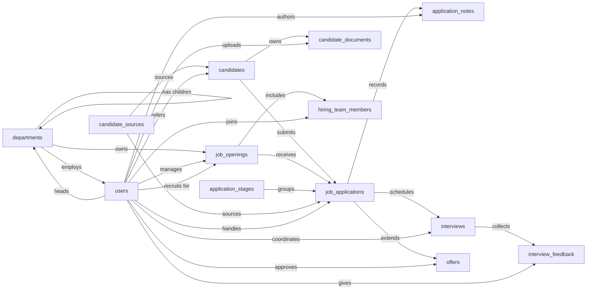

# ATS, Semantic Model

## 1. Overview

An applicant tracking system used by an in-house recruiting team to manage open job requisitions, the candidates considered for them, and the full hiring funnel from application through interviews to offer. Primary users are recruiters, hiring managers, and interviewers; the system records who applied for what, where they are in the pipeline, what feedback interviewers gave, and what offers were extended and accepted.

## 2. Entity summary

| # | Table name | Singular label | Purpose |
|---|---|---|---|
| 1 | `users` | User | System users (recruiters, hiring managers, interviewers, coordinators). |
| 2 | `departments` | Department | Organizational units that own job openings (e.g. Engineering, Sales). Supports an optional parent-child hierarchy. |
| 3 | `job_openings` | Job Opening | A specific role being hired for, with status, hiring team, headcount, and target start date. |
| 4 | `application_stages` | Application Stage | Configurable pipeline steps (e.g. New, Phone Screen, On-site, Offer, Hired, Rejected) with order and category. |
| 5 | `candidate_sources` | Candidate Source | Where candidates come from (job board, referral, agency, inbound, sourced). |
| 6 | `candidates` | Candidate | A person in the talent pool. Exists independently of any specific job application. |
| 7 | `job_applications` | Job Application | A candidate applying to a specific job opening; the central pipeline record. |
| 8 | `candidate_documents` | Candidate Document | Resumes, cover letters, portfolios, work samples attached to a candidate. |
| 9 | `application_notes` | Application Note | Comment thread on an application; recruiter and hiring-manager observations. |
| 10 | `interviews` | Interview | A scheduled interview event tied to an application (kind, time, location/URL). |
| 11 | `interview_feedback` | Interview Feedback | Scorecard from one interviewer for one interview; rating, recommendation, notes. |
| 12 | `offers` | Offer | A formal offer extended to a candidate for a job; terms, status, candidate response. |
| 13 | `hiring_team_members` | Hiring Team Member | Junction: a user assigned to a job opening with a role (recruiter, hiring manager, interviewer, coordinator). |

### Entity-relationship diagram



### Permissions summary

| Permission | Type | Description | Used by | Hierarchy parent |
|---|---|---|---|---|
| `ats:read` | baseline-read | Read access to every entity in the module. | every entity (`view_permission`) | `ats:manage` |
| `ats:manage` | baseline-manage | Write access to operational entities; default `edit_permission` for entities not annotated `admin`. | `users`, `job_openings`, `candidates`, `job_applications`, `candidate_documents`, `application_notes`, `interviews`, `interview_feedback`, `offers`, `hiring_team_members` (`edit_permission`) | `ats:admin` |
| `ats:admin` | baseline-admin | Write access to reference / config entities AND rollup target for workflow permissions. | `departments`, `application_stages`, `candidate_sources` (`edit_permission`); rolled up under for `ats:approve_offer`, `ats:manage_all_notes`, `ats:manage_all_feedback` | — |
| `ats:approve_offer` | workflow | Gates the `offers.status` value_changed → `approved` transition (the budget-commitment authorization event). Granted to hiring leaders and recruiting directors with offer-approval authority. | `offers` rule `approve_offer_requires_approver_permission` | `ats:admin` |
| `ats:manage_all_notes` | workflow | Elevated override for editing or deleting an `application_notes` row authored by another user. Granted to HR partners and hiring leads who occasionally redact or correct another author's note. | `application_notes` rule `edit_restricted_to_author_or_manager` | `ats:admin` |
| `ats:manage_all_feedback` | workflow | Elevated override for flipping `interview_feedback.is_submitted` on a scorecard owned by another interviewer. Granted to HR / RecOps who must occasionally finalize a scorecard the original interviewer cannot submit themselves. | `interview_feedback` rule `submit_feedback_restricted_to_interviewer` | `ats:admin` |

The three workflow permissions deliberately roll up under `ats:admin`, not `ats:manage`. If they rolled up under `ats:manage`, every recruiter holding the baseline `manage` permission would automatically inherit offer-approval authority and the two manager-overrides, defeating the family-12 / family-13 conditional gates.

## 3. Entities

### 3.1 `users`, User

**Plural label:** Users
**Label column:** `display_name`
**Audit log:** no
**Description:** A system user: recruiter, hiring manager, interviewer, or coordinator. All other entities reference this table for actor and ownership fields.

**Fields**

| Field name | Format | Required | Label | Description | Reference / Notes |
|---|---|---|---|---|---|
| `display_name` | `string` | yes | Display Name |  | label_column |
| `email_address` | `email` | yes | Email |  | unique |
| `first_name` | `string` | no | First Name |  |  |
| `last_name` | `string` | no | Last Name |  |  |
| `job_title` | `string` | no | Job Title | This user's own job title at the company |  |
| `department_id` | `reference` | no | Department |  | → `departments` (N:1, clear), relationship_label: "employs" |
| `is_active` | `boolean` | yes | Active |  | default: "true" |

**Relationships**

- A `user` may belong to one `department` (N:1, optional, clear).
- A `user` may head one or more `departments` (1:N, via `departments.head_user_id`).
- A `user` may be the hiring manager, lead recruiter, assigned recruiter, coordinator, interviewer, author, uploader, or approver across many other entities; see §4 for the full edge list.
- `users` ↔ `job_openings` is many-to-many through `hiring_team_members`.

---

### 3.2 `departments`, Department

**Plural label:** Departments
**Label column:** `department_name`
**Audit log:** no
**Edit permission:** admin
**Description:** An organizational unit that owns one or more job openings. Supports an optional parent-child hierarchy so business units can contain sub-teams.

**Fields**

| Field name | Format | Required | Label | Description | Reference / Notes |
|---|---|---|---|---|---|
| `department_name` | `string` | yes | Department Name |  | label_column; unique |
| `department_code` | `string` | no | Code | Short code, e.g. ENG, SALES | unique |
| `parent_department_id` | `reference` | no | Parent Department |  | → `departments` (N:1, clear), relationship_label: "has children" |
| `head_user_id` | `reference` | no | Department Head |  | → `users` (N:1, clear), relationship_label: "heads" |

**Relationships**

- A `department` may have a `parent_department` and many child `departments` (1:N self-reference, optional).
- A `department` may be headed by one `user` (N:1, optional).
- A `department` owns many `job_openings` (1:N, via `job_openings.department_id`).
- Many `users` may belong to a `department` (1:N, via `users.department_id`).

**Validation rules**

```json
[
  {
    "code": "parent_not_self",
    "message": "A department cannot reference itself as its parent.",
    "description": "A department's parent must be a different row; self-referential parents create degenerate hierarchies.",
    "jsonlogic": {
      "or": [
        {"==": [{"var": "parent_department_id"}, null]},
        {"!=": [{"var": "parent_department_id"}, {"var": "id"}]}
      ]
    }
  }
]
```

---

### 3.3 `job_openings`, Job Opening

**Plural label:** Job Openings
**Label column:** `job_title`
**Audit log:** yes  _(status changes and salary band updates are subject to dispute; keep a history)_
**Description:** A specific position the company is hiring for. Created in draft, opened for applications, then transitions through `on_hold` / `filled` / `closed` / `cancelled`. Has one hiring manager and an optional lead recruiter; additional team members are tracked via `hiring_team_members`.

**Fields**

| Field name | Format | Required | Label | Description | Reference / Notes |
|---|---|---|---|---|---|
| `job_title` | `string` | yes | Job Title |  | label_column |
| `job_code` | `string` | no | Requisition Code | Requisition code, e.g. ENG-2026-014 | unique |
| `department_id` | `reference` | yes | Department |  | → `departments` (N:1, restrict), relationship_label: "owns" |
| `hiring_manager_id` | `reference` | yes | Hiring Manager |  | → `users` (N:1, restrict), relationship_label: "manages" |
| `recruiter_id` | `reference` | no | Lead Recruiter |  | → `users` (N:1, clear), relationship_label: "recruits for" |
| `employment_type` | `enum` | yes | Employment Type |  | values: `full_time`, `part_time`, `contract`, `internship`, `temporary`; default: "full_time" |
| `work_arrangement` | `enum` | yes | Work Arrangement |  | values: `onsite`, `remote`, `hybrid`; default: "onsite" |
| `location` | `string` | no | Location |  |  |
| `status` | `enum` | yes | Status |  | values: `draft`, `open`, `on_hold`, `filled`, `closed`, `cancelled`; default: "draft" |
| `headcount` | `integer` | yes | Headcount | Number of positions to hire under this requisition | default: "1" |
| `opened_at` | `date` | no | Opened |  |  |
| `target_start_date` | `date` | no | Target Start Date |  |  |
| `filled_at` | `date` | no | Filled |  |  |
| `salary_min` | `number` | no | Salary Min |  | precision: 2 |
| `salary_max` | `number` | no | Salary Max |  | precision: 2 |
| `job_description` | `html` | no | Description |  |  |
| `job_requirements` | `text` | no | Requirements | Required experience and skills |  |

**Relationships**

- A `job_opening` belongs to one `department` (N:1, required, restrict).
- A `job_opening` has one `hiring_manager` user (N:1, required, restrict) and optionally one lead `recruiter` user (N:1, optional, clear).
- A `job_opening` receives many `job_applications` (1:N, via `job_applications.job_opening_id`, restrict; applications survive job closure).
- A `job_opening` has many `hiring_team_members` (1:N, via the `hiring_team_members` junction).

**Validation rules**

```json
[
  {
    "code": "headcount_positive",
    "message": "Headcount must be at least 1.",
    "description": "A requisition opens to hire at least one person; zero-headcount reqs are meaningless.",
    "jsonlogic": {">=": [{"var": "headcount"}, 1]}
  },
  {
    "code": "salary_min_non_negative",
    "message": "Salary minimum must be at least 0.",
    "description": "Salary minimum is a monetary amount and cannot be negative.",
    "jsonlogic": {
      "or": [
        {"==": [{"var": "salary_min"}, null]},
        {">=": [{"var": "salary_min"}, 0]}
      ]
    }
  },
  {
    "code": "salary_max_non_negative",
    "message": "Salary maximum must be at least 0.",
    "description": "Salary maximum is a monetary amount and cannot be negative.",
    "jsonlogic": {
      "or": [
        {"==": [{"var": "salary_max"}, null]},
        {">=": [{"var": "salary_max"}, 0]}
      ]
    }
  },
  {
    "code": "salary_band_ordered",
    "message": "Salary minimum cannot exceed salary maximum.",
    "description": "When both ends of the salary band are set, the minimum must not exceed the maximum.",
    "jsonlogic": {
      "or": [
        {"==": [{"var": "salary_min"}, null]},
        {"==": [{"var": "salary_max"}, null]},
        {"<=": [{"var": "salary_min"}, {"var": "salary_max"}]}
      ]
    }
  },
  {
    "code": "opened_before_filled",
    "message": "Filled date cannot precede opened date.",
    "description": "A requisition must be opened before it can be filled.",
    "jsonlogic": {
      "or": [
        {"==": [{"var": "opened_at"}, null]},
        {"==": [{"var": "filled_at"}, null]},
        {"<=": [{"var": "opened_at"}, {"var": "filled_at"}]}
      ]
    }
  },
  {
    "code": "opened_before_target_start",
    "message": "Target start date cannot precede opened date.",
    "description": "A requisition's target start should not be earlier than the date the requisition was opened.",
    "jsonlogic": {
      "or": [
        {"==": [{"var": "opened_at"}, null]},
        {"==": [{"var": "target_start_date"}, null]},
        {"<=": [{"var": "opened_at"}, {"var": "target_start_date"}]}
      ]
    }
  },
  {
    "code": "filled_status_requires_filled_at",
    "message": "A filled requisition must have a filled date.",
    "description": "Once a requisition reaches the `filled` status, the fill date is required for reporting and audit.",
    "jsonlogic": {
      "or": [
        {"!=": [{"var": "status"}, "filled"]},
        {"!=": [{"var": "filled_at"}, null]}
      ]
    }
  },
  {
    "code": "non_draft_requires_opened_at",
    "message": "A requisition that has left draft must have an opened date.",
    "description": "Any non-draft status implies the requisition has been opened, so the opened date is required.",
    "jsonlogic": {
      "or": [
        {"==": [{"var": "status"}, "draft"]},
        {"!=": [{"var": "opened_at"}, null]}
      ]
    }
  }
]
```

---

### 3.4 `application_stages`, Application Stage

**Plural label:** Application Stages
**Label column:** `stage_name`
**Audit log:** no
**Edit permission:** admin
**Description:** A configurable step in the application pipeline. Stages are shared across all job openings (single global pipeline assumption; see §7.2). `stage_order` controls sort; `stage_category` groups stages so reports and downstream logic can reason about pipeline phase without parsing names.

**Fields**

| Field name | Format | Required | Label | Description | Reference / Notes |
|---|---|---|---|---|---|
| `stage_name` | `string` | yes | Stage Name |  | label_column; unique |
| `stage_order` | `integer` | yes | Order | Sort order in the pipeline (ascending) | unique |
| `stage_category` | `enum` | yes | Category |  | values: `pre_screen`, `screening`, `interview`, `offer`, `hired`, `rejected`; default: "pre_screen" |
| `is_active` | `boolean` | yes | Active |  | default: "true" |
| `description` | `text` | no | Description |  |  |

**Relationships**

- An `application_stage` may be the current stage of many `job_applications` (1:N, via `job_applications.current_stage_id`, restrict; stages cannot be deleted while in use).

---

### 3.5 `candidate_sources`, Candidate Source

**Plural label:** Candidate Sources
**Label column:** `source_name`
**Audit log:** no
**Edit permission:** admin
**Description:** A named source from which candidates and applications originate, used for sourcing analytics. Examples: "LinkedIn Jobs", "Employee Referral Program", "Acme Recruiting Agency".

**Fields**

| Field name | Format | Required | Label | Description | Reference / Notes |
|---|---|---|---|---|---|
| `source_name` | `string` | yes | Source Name |  | label_column; unique |
| `source_type` | `enum` | yes | Source Type |  | values: `job_board`, `referral`, `agency`, `inbound`, `sourced`, `social_media`, `career_site`, `event`, `other`; default: "inbound" |
| `is_active` | `boolean` | yes | Active |  | default: "true" |
| `description` | `text` | no | Description |  |  |

**Relationships**

- A `candidate_source` may be the source of many `candidates` (1:N, via `candidates.source_id`, clear).
- A `candidate_source` may be the source of many `job_applications` (1:N, via `job_applications.source_id`, clear); the application can be tagged with a different source than the candidate (e.g. candidate originally sourced from LinkedIn, but applied via referral for this specific role).

---

### 3.6 `candidates`, Candidate

**Plural label:** Candidates
**Label column:** `full_name`
**Audit log:** yes  _(personal data subject to GDPR / data-subject access requests; preserve a change history)_
**Description:** A person in the talent pool. A candidate exists independently of any specific job and may have multiple `job_applications` over time. Identity is loosely keyed on `email_address` (unique when present); duplicates are detected at the recruiter's discretion.

**Fields**

| Field name | Format | Required | Label | Description | Reference / Notes |
|---|---|---|---|---|---|
| `full_name` | `string` | yes | Full Name |  | label_column |
| `first_name` | `string` | no | First Name |  |  |
| `last_name` | `string` | no | Last Name |  |  |
| `email_address` | `email` | no | Email |  | unique |
| `phone_number` | `string` | no | Phone |  |  |
| `linkedin_url` | `url` | no | LinkedIn |  |  |
| `current_employer` | `string` | no | Current Employer |  |  |
| `current_job_title` | `string` | no | Current Job Title |  |  |
| `location_city` | `string` | no | City |  |  |
| `location_country` | `string` | no | Country |  |  |
| `source_id` | `reference` | no | Source |  | → `candidate_sources` (N:1, clear), relationship_label: "sources" |
| `referrer_user_id` | `reference` | no | Referred By | Employee who made the referral, when source is a referral | → `users` (N:1, clear), relationship_label: "refers" |
| `candidate_status` | `enum` | yes | Candidate Status |  | values: `active`, `hired`, `archived`, `do_not_contact`; default: "active" |
| `notes` | `text` | no | Notes | Candidate-level notes (vs. application-level) |  |

**Relationships**

- A `candidate` may originate from one `candidate_source` (N:1, optional, clear).
- A `candidate` may be referred by one `user` (N:1, optional, clear).
- A `candidate` owns many `job_applications` (1:N, via `job_applications.candidate_id`, cascade; deleting a candidate wipes their applications, supporting GDPR erasure).
- A `candidate` owns many `candidate_documents` (1:N, via `candidate_documents.candidate_id`, cascade).

---

### 3.7 `job_applications`, Job Application

**Plural label:** Job Applications
**Label column:** `application_label`
**Audit log:** yes  _(stage transitions and status changes are central to the audit trail of a hiring decision)_
**Description:** The central pipeline record: a specific candidate applying to a specific job opening, currently sitting at one application stage. Created when a candidate applies (or when a recruiter pulls them into a role) and progresses through stages until terminal status (`hired`, `rejected`, `withdrawn`). Applications survive job closure (the `job_opening_id` reference uses `restrict`). The `application_label` label column is caller-composed on insert, e.g. `"{candidate.full_name} → {job_opening.job_title}"`.

**Fields**

| Field name | Format | Required | Label | Description | Reference / Notes |
|---|---|---|---|---|---|
| `application_label` | `string` | yes | Application |  | label_column |
| `candidate_id` | `parent` | yes | Candidate |  | ↳ `candidates` (N:1, cascade), relationship_label: "submits" |
| `job_opening_id` | `reference` | yes | Job Opening |  | → `job_openings` (N:1, restrict), relationship_label: "receives" |
| `current_stage_id` | `reference` | yes | Current Stage |  | → `application_stages` (N:1, restrict), relationship_label: "groups" |
| `status` | `enum` | yes | Status |  | values: `active`, `hired`, `rejected`, `withdrawn`, `on_hold`; default: "active" |
| `source_id` | `reference` | no | Source |  | → `candidate_sources` (N:1, clear), relationship_label: "sources" |
| `applied_at` | `date-time` | yes | Applied At |  |  |
| `assigned_recruiter_id` | `reference` | no | Assigned Recruiter |  | → `users` (N:1, clear), relationship_label: "handles" |
| `rejection_reason` | `enum` | no | Rejection Reason |  | values: `not_qualified`, `withdrew`, `position_filled`, `no_show`, `salary_mismatch`, `location_mismatch`, `culture_fit`, `other` |
| `rejected_at` | `date-time` | no | Rejected At |  |  |
| `hired_at` | `date-time` | no | Hired At |  |  |

**Relationships**

- A `job_application` belongs to one `candidate` as its parent (N:1, required, cascade; owning lifecycle).
- A `job_application` references one `job_opening` (N:1, required, restrict; historical applications survive a job closure).
- A `job_application` is currently at one `application_stage` (N:1, required, restrict).
- A `job_application` may originate from one `candidate_source` (N:1, optional, clear).
- A `job_application` may be assigned to one `user` recruiter (N:1, optional, clear).
- A `job_application` has many `application_notes`, `interviews`, and `offers` linked back via FK (1:N for each; see §4 for the per-FK delete mode).

**Validation rules**

```json
[
  {
    "code": "rejected_status_requires_rejected_at",
    "message": "A rejected application must have a rejected date.",
    "description": "Once an application's status is `rejected`, the rejected timestamp is required for the audit trail.",
    "jsonlogic": {
      "or": [
        {"!=": [{"var": "status"}, "rejected"]},
        {"!=": [{"var": "rejected_at"}, null]}
      ]
    }
  },
  {
    "code": "hired_status_requires_hired_at",
    "message": "A hired application must have a hired date.",
    "description": "Once an application's status is `hired`, the hired timestamp is required for downstream onboarding and HRIS handoff.",
    "jsonlogic": {
      "or": [
        {"!=": [{"var": "status"}, "hired"]},
        {"!=": [{"var": "hired_at"}, null]}
      ]
    }
  },
  {
    "code": "rejection_reason_only_when_rejected",
    "message": "Rejection reason can only be set when status is rejected.",
    "description": "A rejection reason has no meaning on an active, hired, withdrawn, or on-hold application.",
    "jsonlogic": {
      "or": [
        {"==": [{"var": "rejection_reason"}, null]},
        {"==": [{"var": "status"}, "rejected"]}
      ]
    }
  },
  {
    "code": "rejection_reason_required_when_rejected",
    "message": "A rejected application must record a rejection reason.",
    "description": "When status is `rejected`, a rejection_reason is required for the audit trail; paired with `rejection_reason_only_when_rejected`.",
    "jsonlogic": {
      "or": [
        {"!=": [{"var": "status"}, "rejected"]},
        {"!=": [{"var": "rejection_reason"}, null]}
      ]
    }
  },
  {
    "code": "rejected_at_only_when_rejected",
    "message": "rejected_at can only be set when status is rejected.",
    "description": "A rejected timestamp on an active, hired, withdrawn, or on-hold application is meaningless and breaks reporting on rejection times.",
    "jsonlogic": {
      "or": [
        {"==": [{"var": "rejected_at"}, null]},
        {"==": [{"var": "status"}, "rejected"]}
      ]
    }
  },
  {
    "code": "hired_at_only_when_hired",
    "message": "hired_at can only be set when status is hired.",
    "description": "A hired timestamp on an active, rejected, withdrawn, or on-hold application is meaningless and breaks reporting on hire times.",
    "jsonlogic": {
      "or": [
        {"==": [{"var": "hired_at"}, null]},
        {"==": [{"var": "status"}, "hired"]}
      ]
    }
  },
  {
    "code": "applied_before_rejected",
    "message": "Rejected date cannot precede applied date.",
    "description": "A rejection event must follow the application event in time.",
    "jsonlogic": {
      "or": [
        {"==": [{"var": "rejected_at"}, null]},
        {"<=": [{"var": "applied_at"}, {"var": "rejected_at"}]}
      ]
    }
  },
  {
    "code": "applied_before_hired",
    "message": "Hired date cannot precede applied date.",
    "description": "A hire event must follow the application event in time.",
    "jsonlogic": {
      "or": [
        {"==": [{"var": "hired_at"}, null]},
        {"<=": [{"var": "applied_at"}, {"var": "hired_at"}]}
      ]
    }
  }
]
```

---

### 3.8 `candidate_documents`, Candidate Document

**Plural label:** Candidate Documents
**Label column:** `document_label`
**Audit log:** no
**Description:** A document attached to a candidate: resume, cover letter, portfolio, work sample, certification, or reference letter. Stored as a URL pointing to file storage; the model does not own the binary itself. The `document_label` label column is caller-composed on insert (e.g. `"Resume, Jane Doe"`).

**Fields**

| Field name | Format | Required | Label | Description | Reference / Notes |
|---|---|---|---|---|---|
| `document_label` | `string` | yes | Document |  | label_column |
| `candidate_id` | `parent` | yes | Candidate |  | ↳ `candidates` (N:1, cascade), relationship_label: "owns" |
| `document_type` | `enum` | yes | Document Type |  | values: `resume`, `cover_letter`, `portfolio`, `work_sample`, `certification`, `reference_letter`, `other`; default: "resume" |
| `file_url` | `url` | yes | File URL | External storage URL; the model does not own the binary |  |
| `file_name` | `string` | no | File Name | Original uploaded filename |  |
| `uploaded_at` | `date-time` | yes | Uploaded At |  |  |
| `uploaded_by_user_id` | `reference` | no | Uploaded By |  | → `users` (N:1, clear), relationship_label: "uploads" |

**Relationships**

- A `candidate_document` belongs to one `candidate` as its parent (N:1, required, cascade; documents are wiped if the candidate is erased).
- A `candidate_document` may be uploaded by one `user` (N:1, optional, clear).

---

### 3.9 `application_notes`, Application Note

**Plural label:** Application Notes
**Label column:** `note_subject`
**Audit log:** no
**Description:** A note left on an application: a personal recruiter or hiring-manager observation, decision rationale, or coordination message. Visibility controls who can read the note (whole hiring team vs. recruiters only vs. publicly visible to the candidate). Notes are author-owned: only the original author may edit or delete their own note, with a manager override available for HR / hiring leads who hold the `ats:manage_all_notes` permission. The FK to `job_applications` is `reference + cascade`: the cascade-delete behavior is preserved (when an application is removed, its notes go with it), and the `reference` shape declaration acknowledges that note ownership is per-author, not shared with the parent application's permission scope.

**Fields**

| Field name | Format | Required | Label | Description | Reference / Notes |
|---|---|---|---|---|---|
| `note_subject` | `string` | yes | Subject |  | label_column |
| `application_id` | `reference` | yes | Application |  | → `job_applications` (N:1, cascade), relationship_label: "records" |
| `author_user_id` | `reference` | yes | Author |  | → `users` (N:1, restrict), relationship_label: "authors" |
| `note_body` | `text` | yes | Note |  |  |
| `visibility` | `enum` | yes | Visibility |  | values: `hiring_team`, `recruiter_only`, `public`; default: "hiring_team" |
| `noted_at` | `date-time` | yes | Noted At |  |  |

**Relationships**

- An `application_note` references one `job_application` (N:1, required, cascade; cascade behavior preserved, see §3 description).
- An `application_note` is authored by one `user` (N:1, required, restrict; author cannot be deleted while their notes exist).

**Validation rules**

```json
[
  {
    "code": "edit_restricted_to_author_or_manager",
    "message": "Only the note's original author or a user with the manage-all-notes permission can edit or delete this note.",
    "description": "Notes are personal commentary. The author owns their own edits; anyone else needs the elevated `ats:manage_all_notes` permission, which is granted to hiring leads and HR partners. INSERT is unrestricted (anyone with edit_permission may create new notes); the gate only applies on UPDATE / DELETE. The `or` short-circuits on the cheap owner check, so `require_permission` is only invoked when the caller is not the original author.",
    "jsonlogic": {
      "if": [
        {"==": [{"var": "$old"}, null]},
        true,
        {
          "or": [
            {"==": [{"var": "$old.author_user_id"}, {"var": "$user_id"}]},
            {"require_permission": "ats:manage_all_notes"}
          ]
        }
      ]
    }
  },
  {
    "code": "author_immutable_after_first_save",
    "message": "The note's author cannot be reassigned after the note is created.",
    "description": "Authorship is the basis for the family-13 owner check; allowing the author field to change would let an editor reassign authorship to themselves to bypass the manager-override gate. The author is set on INSERT and frozen thereafter.",
    "jsonlogic": {
      "or": [
        {"==": [{"var": "$old"}, null]},
        {"==": [{"var": "author_user_id"}, {"var": "$old.author_user_id"}]}
      ]
    }
  }
]
```

---

### 3.10 `interviews`, Interview

**Plural label:** Interviews
**Label column:** `interview_label`
**Audit log:** no
**Description:** A scheduled interview event for a specific application. May involve one or more interviewers (each captured as their own `interview_feedback` row). Status transitions from `scheduled` through `completed` / `cancelled` / `no_show` / `rescheduled`. The `interview_label` label column is caller-composed on insert (e.g. `"Tech Phone Screen, Jane Doe"`).

**Fields**

| Field name | Format | Required | Label | Description | Reference / Notes |
|---|---|---|---|---|---|
| `interview_label` | `string` | yes | Interview |  | label_column |
| `application_id` | `parent` | yes | Application |  | ↳ `job_applications` (N:1, cascade), relationship_label: "schedules" |
| `interview_kind` | `enum` | yes | Kind |  | values: `phone_screen`, `video_call`, `onsite`, `technical`, `take_home`, `panel`, `final`, `reference_check`; default: "phone_screen" |
| `scheduled_start` | `date-time` | yes | Start |  |  |
| `scheduled_end` | `date-time` | yes | End |  |  |
| `location` | `string` | no | Location | Physical location for onsite interviews |  |
| `meeting_url` | `url` | no | Meeting URL | Video-call link for remote interviews |  |
| `status` | `enum` | yes | Status |  | values: `scheduled`, `completed`, `cancelled`, `no_show`, `rescheduled`; default: "scheduled" |
| `coordinator_user_id` | `reference` | no | Coordinator |  | → `users` (N:1, clear), relationship_label: "coordinates" |

**Relationships**

- An `interview` belongs to one `job_application` as its parent (N:1, required, cascade).
- An `interview` may be coordinated by one `user` (N:1, optional, clear).
- An `interview` has many `interview_feedback` rows, one per interviewer (1:N, via `interview_feedback.interview_id`, cascade).

**Validation rules**

```json
[
  {
    "code": "scheduled_start_before_end",
    "message": "Scheduled end cannot precede scheduled start.",
    "description": "An interview's end timestamp must follow its start.",
    "jsonlogic": {"<=": [{"var": "scheduled_start"}, {"var": "scheduled_end"}]}
  }
]
```

---

### 3.11 `interview_feedback`, Interview Feedback

**Plural label:** Interview Feedback
**Label column:** `feedback_label`
**Audit log:** yes  _(scorecards are decision evidence; preserve change history)_
**Description:** One interviewer's scorecard for one interview. An interview can have multiple feedback rows when multiple people attended (e.g. a panel). `is_submitted` distinguishes a draft scorecard from a finalized one; only the assigned interviewer (or a user holding `ats:manage_all_feedback`) may flip it. The `feedback_label` label column is caller-composed on insert (e.g. `"Alex Kim, Tech Phone Screen for Jane Doe"`). The FK to `interviews` is `reference + cascade`: the cascade-delete behavior is preserved (when an interview is removed, its scorecards go with it), and the `reference` shape declaration acknowledges that scorecard ownership is per-interviewer, not shared with the parent interview's permission scope.

**Fields**

| Field name | Format | Required | Label | Description | Reference / Notes |
|---|---|---|---|---|---|
| `feedback_label` | `string` | yes | Feedback |  | label_column |
| `interview_id` | `reference` | yes | Interview |  | → `interviews` (N:1, cascade), relationship_label: "collects" |
| `interviewer_user_id` | `reference` | yes | Interviewer |  | → `users` (N:1, restrict), relationship_label: "gives" |
| `overall_rating` | `enum` | no | Overall Rating |  | values: `strong_yes`, `yes`, `lean_yes`, `lean_no`, `no`, `strong_no` |
| `recommendation` | `enum` | no | Recommendation |  | values: `advance`, `hold`, `reject` |
| `strengths` | `text` | no | Strengths |  |  |
| `concerns` | `text` | no | Concerns |  |  |
| `detailed_notes` | `text` | no | Detailed Notes |  |  |
| `is_submitted` | `boolean` | yes | Submitted |  | default: "false" |
| `submitted_at` | `date-time` | no | Submitted At |  |  |

**Relationships**

- An `interview_feedback` references one `interview` (N:1, required, cascade; cascade behavior preserved, see §3 description).
- An `interview_feedback` is authored by one `user` interviewer (N:1, required, restrict; the interviewer cannot be deleted while feedback exists).

**Validation rules**

```json
[
  {
    "code": "submitted_at_required_when_submitted",
    "message": "A submitted scorecard must have a submitted_at timestamp.",
    "description": "Once `is_submitted` is true, the submission timestamp is required for the audit trail.",
    "jsonlogic": {
      "or": [
        {"!=": [{"var": "is_submitted"}, true]},
        {"!=": [{"var": "submitted_at"}, null]}
      ]
    }
  },
  {
    "code": "submitted_at_only_when_submitted",
    "message": "submitted_at can only be set when the scorecard is submitted.",
    "description": "A submission timestamp on a draft scorecard is meaningless and breaks reporting on submission times.",
    "jsonlogic": {
      "or": [
        {"==": [{"var": "submitted_at"}, null]},
        {"==": [{"var": "is_submitted"}, true]}
      ]
    }
  },
  {
    "code": "submit_feedback_restricted_to_interviewer",
    "message": "Only the assigned interviewer or a user with manage-all-feedback can change the submission status of this scorecard.",
    "description": "Scorecards are per-interviewer decision evidence. The static `edit_permission` (`ats:manage`) lets the team see and draft scorecards, but the transition into `is_submitted = true` (and any later unsubmit) is the audit-trail lock event and must be performed by the original interviewer, or by HR / RecOps holding the elevated `ats:manage_all_feedback` permission. `value_changed` scopes the gate to the moment `is_submitted` flips so unrelated edits on a draft scorecard remain operational; the `if` falls back to `true` when the flag is not changing. `$old` is the prior row state so we authenticate against the originally-assigned interviewer, not a freshly-rewritten one (the companion `interviewer_immutable_after_first_save` rule prevents that rewrite from happening in the first place).",
    "jsonlogic": {
      "if": [
        {"value_changed": "is_submitted"},
        {
          "or": [
            {"==": [{"var": "$old.interviewer_user_id"}, {"var": "$user_id"}]},
            {"require_permission": "ats:manage_all_feedback"}
          ]
        },
        true
      ]
    }
  },
  {
    "code": "interviewer_immutable_after_first_save",
    "message": "The scorecard's interviewer cannot be reassigned after the scorecard is created.",
    "description": "Interviewer identity is the basis for the submit gate above; allowing the field to change would let an editor reassign authorship to themselves to bypass the elevated permission check. The interviewer is set on INSERT and frozen thereafter.",
    "jsonlogic": {
      "or": [
        {"==": [{"var": "$old"}, null]},
        {"==": [{"var": "interviewer_user_id"}, {"var": "$old.interviewer_user_id"}]}
      ]
    }
  }
]
```

---

### 3.12 `offers`, Offer

**Plural label:** Offers
**Label column:** `offer_label`
**Audit log:** yes  _(offers are commitments; preserve full change history of terms, status, and approvals)_
**Description:** A formal offer extended to a candidate for a specific application. Goes through `draft` → `pending_approval` → `approved` → `sent`, then `accepted` / `declined` / `rescinded` / `expired`. An application typically has at most one active offer; the model uses `restrict` so an offer is never silently lost when an application is cleaned up. The `offer_label` label column is caller-composed on insert (e.g. `"Offer, Jane Doe, Senior Engineer"`).

**Fields**

| Field name | Format | Required | Label | Description | Reference / Notes |
|---|---|---|---|---|---|
| `offer_label` | `string` | yes | Offer |  | label_column |
| `application_id` | `reference` | yes | Application |  | → `job_applications` (N:1, restrict), relationship_label: "extends" |
| `status` | `enum` | yes | Status |  | values: `draft`, `pending_approval`, `approved`, `sent`, `accepted`, `declined`, `rescinded`, `expired`; default: "draft" |
| `base_salary` | `number` | yes | Base Salary |  | precision: 2 |
| `bonus_target` | `number` | no | Bonus Target | Annual on-target bonus | precision: 2 |
| `equity_amount` | `string` | no | Equity | Free-text, shares, RSU value, percentages vary |  |
| `start_date` | `date` | no | Start Date | Proposed start date of employment |  |
| `offer_extended_at` | `date-time` | no | Extended At | Timestamp the offer was sent to the candidate |  |
| `offer_expires_at` | `date-time` | no | Expires At |  |  |
| `candidate_response` | `enum` | yes | Candidate Response |  | values: `pending`, `accepted`, `declined`, `no_response`; default: "pending" |
| `responded_at` | `date-time` | no | Responded At |  |  |
| `approver_user_id` | `reference` | no | Approver |  | → `users` (N:1, clear), relationship_label: "approves" |

**Relationships**

- An `offer` references one `job_application` (N:1, required, restrict; preserves the offer record even if cleanup of the application is attempted).
- An `offer` may have one approving `user` (N:1, optional, clear).

**Validation rules**

```json
[
  {
    "code": "base_salary_non_negative",
    "message": "Base salary must be at least 0.",
    "description": "Base salary is a monetary amount and cannot be negative.",
    "jsonlogic": {">=": [{"var": "base_salary"}, 0]}
  },
  {
    "code": "bonus_target_non_negative",
    "message": "Bonus target must be at least 0.",
    "description": "Bonus target is a monetary amount and cannot be negative.",
    "jsonlogic": {
      "or": [
        {"==": [{"var": "bonus_target"}, null]},
        {">=": [{"var": "bonus_target"}, 0]}
      ]
    }
  },
  {
    "code": "post_draft_status_requires_extended_at",
    "message": "Sent or completed offers must have an offer_extended_at timestamp.",
    "description": "Once an offer reaches `sent` or beyond, the extended timestamp is required for the audit trail.",
    "jsonlogic": {
      "or": [
        {"in": [{"var": "status"}, ["draft", "pending_approval", "approved"]]},
        {"!=": [{"var": "offer_extended_at"}, null]}
      ]
    }
  },
  {
    "code": "extended_at_only_when_post_draft",
    "message": "offer_extended_at can only be set once the offer is sent or further along.",
    "description": "An extended timestamp on a draft, pending-approval, or approved offer is premature and meaningless.",
    "jsonlogic": {
      "or": [
        {"==": [{"var": "offer_extended_at"}, null]},
        {"in": [{"var": "status"}, ["sent", "accepted", "declined", "rescinded", "expired"]]}
      ]
    }
  },
  {
    "code": "responded_at_required_when_responded",
    "message": "Responded offers must have a responded_at timestamp.",
    "description": "Once the candidate has responded (accepted, declined, or no-response), the response timestamp is required.",
    "jsonlogic": {
      "or": [
        {"==": [{"var": "candidate_response"}, "pending"]},
        {"!=": [{"var": "responded_at"}, null]}
      ]
    }
  },
  {
    "code": "responded_at_only_when_responded",
    "message": "responded_at can only be set when the candidate has responded.",
    "description": "A response timestamp on a pending response is meaningless.",
    "jsonlogic": {
      "or": [
        {"==": [{"var": "responded_at"}, null]},
        {"!=": [{"var": "candidate_response"}, "pending"]}
      ]
    }
  },
  {
    "code": "extended_before_expires",
    "message": "offer_expires_at cannot precede offer_extended_at.",
    "description": "An offer cannot expire before it was extended.",
    "jsonlogic": {
      "or": [
        {"==": [{"var": "offer_extended_at"}, null]},
        {"==": [{"var": "offer_expires_at"}, null]},
        {"<=": [{"var": "offer_extended_at"}, {"var": "offer_expires_at"}]}
      ]
    }
  },
  {
    "code": "extended_before_responded",
    "message": "responded_at cannot precede offer_extended_at.",
    "description": "A candidate cannot respond to an offer before it was extended.",
    "jsonlogic": {
      "or": [
        {"==": [{"var": "offer_extended_at"}, null]},
        {"==": [{"var": "responded_at"}, null]},
        {"<=": [{"var": "offer_extended_at"}, {"var": "responded_at"}]}
      ]
    }
  },
  {
    "code": "approve_offer_requires_approver_permission",
    "message": "Only users with the offer-approver permission can mark an offer approved.",
    "description": "Moving an offer into `approved` is the budget-commitment step (a signed-off salary, equity, and start-date package). The static `edit_permission` (`ats:manage`) lets the whole recruiting team draft and route offers through `pending_approval`; this family-12 rule layers an authorization gate on the specific status flip into `approved`. `value_changed` scopes the gate to the moment of transition (otherwise every update of an already-approved offer would re-trigger the check), and `require_permission` throws when the caller lacks `ats:approve_offer`, surfacing this rule's message to the user. The `true` fallback is mandatory: when the trigger condition is false (status didn't move into approved), the rule must still pass.",
    "jsonlogic": {
      "if": [
        {
          "and": [
            {"value_changed": "status"},
            {"==": [{"var": "status"}, "approved"]}
          ]
        },
        {"require_permission": "ats:approve_offer"},
        true
      ]
    }
  },
  {
    "code": "approver_user_id_required_when_approved",
    "message": "An approved offer must record which user approved it.",
    "description": "The approver_user_id field captures who approved the offer for the audit trail. Once status reaches `approved` (or any further state), the field must be populated. Paired with the family-12 gate above: the platform enforces the permission check on the transition, this rule enforces that the resulting record carries the approver identity.",
    "jsonlogic": {
      "or": [
        {"in": [{"var": "status"}, ["draft", "pending_approval"]]},
        {"!=": [{"var": "approver_user_id"}, null]}
      ]
    }
  }
]
```

---

### 3.13 `hiring_team_members`, Hiring Team Member

**Plural label:** Hiring Team Members
**Label column:** `team_member_label`
**Audit log:** no
**Description:** Junction associating a `user` with a `job_opening` in a specific role (recruiter, hiring manager, interviewer, coordinator, executive sponsor). A user can sit on many openings; an opening can have many team members in the same or different roles. The hiring manager and lead recruiter on `job_openings` are summary FKs for the most-common case; this junction holds the full team and additional roles. The `team_member_label` label column is caller-composed on insert (e.g. `"Alex Kim, Hiring Manager, Senior Engineer"`).

**Fields**

| Field name | Format | Required | Label | Description | Reference / Notes |
|---|---|---|---|---|---|
| `team_member_label` | `string` | yes | Team Member |  | label_column |
| `job_opening_id` | `parent` | yes | Job Opening |  | ↳ `job_openings` (N:1, cascade), relationship_label: "includes" |
| `user_id` | `parent` | yes | User |  | ↳ `users` (N:1, cascade), relationship_label: "joins" |
| `team_role` | `enum` | yes | Role |  | values: `recruiter`, `hiring_manager`, `interviewer`, `coordinator`, `executive_sponsor`; default: "interviewer" |
| `assigned_at` | `date-time` | yes | Assigned At |  |  |
| `is_active` | `boolean` | yes | Active | Set false to remove from the team without deleting history | default: "true" |

**Relationships**

- A `hiring_team_member` belongs to one `job_opening` and one `user`, both as parents (cascade on either side).
- `users` ↔ `job_openings` is many-to-many through this junction.

---

## 4. Relationship summary

| From | Field | To | Cardinality | Kind | Delete behavior |
|---|---|---|---|---|---|
| `users` | `department_id` | `departments` | N:1 | reference | clear |
| `departments` | `parent_department_id` | `departments` | N:1 | reference | clear |
| `departments` | `head_user_id` | `users` | N:1 | reference | clear |
| `job_openings` | `department_id` | `departments` | N:1 | reference | restrict |
| `job_openings` | `hiring_manager_id` | `users` | N:1 | reference | restrict |
| `job_openings` | `recruiter_id` | `users` | N:1 | reference | clear |
| `candidates` | `source_id` | `candidate_sources` | N:1 | reference | clear |
| `candidates` | `referrer_user_id` | `users` | N:1 | reference | clear |
| `job_applications` | `candidate_id` | `candidates` | N:1 | parent | cascade |
| `job_applications` | `job_opening_id` | `job_openings` | N:1 | reference | restrict |
| `job_applications` | `current_stage_id` | `application_stages` | N:1 | reference | restrict |
| `job_applications` | `source_id` | `candidate_sources` | N:1 | reference | clear |
| `job_applications` | `assigned_recruiter_id` | `users` | N:1 | reference | clear |
| `candidate_documents` | `candidate_id` | `candidates` | N:1 | parent | cascade |
| `candidate_documents` | `uploaded_by_user_id` | `users` | N:1 | reference | clear |
| `application_notes` | `application_id` | `job_applications` | N:1 | reference | cascade |
| `application_notes` | `author_user_id` | `users` | N:1 | reference | restrict |
| `interviews` | `application_id` | `job_applications` | N:1 | parent | cascade |
| `interviews` | `coordinator_user_id` | `users` | N:1 | reference | clear |
| `interview_feedback` | `interview_id` | `interviews` | N:1 | reference | cascade |
| `interview_feedback` | `interviewer_user_id` | `users` | N:1 | reference | restrict |
| `offers` | `application_id` | `job_applications` | N:1 | reference | restrict |
| `offers` | `approver_user_id` | `users` | N:1 | reference | clear |
| `hiring_team_members` | `job_opening_id` | `job_openings` | N:1 | parent (junction) | cascade |
| `hiring_team_members` | `user_id` | `users` | N:1 | parent (junction) | cascade |

## 5. Enumerations

### 5.1 `job_openings.employment_type`
- `full_time`
- `part_time`
- `contract`
- `internship`
- `temporary`

### 5.2 `job_openings.work_arrangement`
- `onsite`
- `remote`
- `hybrid`

### 5.3 `job_openings.status`
- `draft`
- `open`
- `on_hold`
- `filled`
- `closed`
- `cancelled`

### 5.4 `application_stages.stage_category`
- `pre_screen`
- `screening`
- `interview`
- `offer`
- `hired`
- `rejected`

### 5.5 `candidate_sources.source_type`
- `job_board`
- `referral`
- `agency`
- `inbound`
- `sourced`
- `social_media`
- `career_site`
- `event`
- `other`

### 5.6 `candidates.candidate_status`
- `active`
- `hired`
- `archived`
- `do_not_contact`

### 5.7 `job_applications.status`
- `active`
- `hired`
- `rejected`
- `withdrawn`
- `on_hold`

### 5.8 `job_applications.rejection_reason`
- `not_qualified`
- `withdrew`
- `position_filled`
- `no_show`
- `salary_mismatch`
- `location_mismatch`
- `culture_fit`
- `other`

### 5.9 `candidate_documents.document_type`
- `resume`
- `cover_letter`
- `portfolio`
- `work_sample`
- `certification`
- `reference_letter`
- `other`

### 5.10 `application_notes.visibility`
- `hiring_team`
- `recruiter_only`
- `public`

### 5.11 `interviews.interview_kind`
- `phone_screen`
- `video_call`
- `onsite`
- `technical`
- `take_home`
- `panel`
- `final`
- `reference_check`

### 5.12 `interviews.status`
- `scheduled`
- `completed`
- `cancelled`
- `no_show`
- `rescheduled`

### 5.13 `interview_feedback.overall_rating`
- `strong_yes`
- `yes`
- `lean_yes`
- `lean_no`
- `no`
- `strong_no`

### 5.14 `interview_feedback.recommendation`
- `advance`
- `hold`
- `reject`

### 5.15 `offers.status`
- `draft`
- `pending_approval`
- `approved`
- `sent`
- `accepted`
- `declined`
- `rescinded`
- `expired`

### 5.16 `offers.candidate_response`
- `pending`
- `accepted`
- `declined`
- `no_response`

### 5.17 `hiring_team_members.team_role`
- `recruiter`
- `hiring_manager`
- `interviewer`
- `coordinator`
- `executive_sponsor`

## 6. Cross-model link suggestions

| From | To | Verb | Cardinality | Delete |
|---|---|---|---|---|
| `job_openings` | `positions` | scopes | N:1 | clear |
| `job_openings` | `salary_bands` | anchors | N:1 | clear |
| `offers` | `salary_bands` | anchors | N:1 | clear |
| `employees` | `candidates` | is the source for | N:1 | clear |
| `employees` | `job_applications` | is the source for | N:1 | clear |
| `employees` | `offers` | is the source for | N:1 | clear |
| `onboarding_cases` | `job_applications` | triggers | N:1 | clear |
| `onboarding_cases` | `offers` | triggers | N:1 | clear |
| `checks` | `job_applications` | is screened by | N:1 | clear |
| `checks` | `candidates` | is screened by | N:1 | clear |

Outbound rows (FK lives on this model's side):
- `job_openings → positions` adds `job_openings.position_id` when `workforce_planning` is deployed, linking a requisition to the approved headcount slot it consumes.
- `job_openings → salary_bands` adds `job_openings.salary_band_id` when `compensation_management` is deployed, anchoring the requisition to a canonical pay band. The inline `salary_min` / `salary_max` fields stay populated as a denormalized reference for the standalone case.
- `offers → salary_bands` adds `offers.salary_band_id` when `compensation_management` is deployed, anchoring the offer's terms to a canonical pay band.

Inbound rows (FK lives on the sibling's side, points back at this model):
- `employees → candidates` adds `employees.source_candidate_id` on `hris.employees` when HRIS is deployed, preserving the candidate-to-employee chain across rehires.
- `employees → job_applications` adds `employees.source_application_id` on `hris.employees` when HRIS is deployed, preserving the application-of-record audit trail.
- `employees → offers` adds `employees.source_offer_id` on `hris.employees`, preserving the offer-of-record on the employee.
- `onboarding_cases → job_applications` and `onboarding_cases → offers` add `source_application_id` and `source_offer_id` on `onboarding.onboarding_cases` so onboarding can pre-populate from the application of record.
- `checks → job_applications` and `checks → candidates` add `application_id` and `candidate_id` on `background_check.checks`. The application FK is the primary anchor; the candidate FK exists because some checks (continuous monitoring) outlive a single application.

`departments` and `users` overlaps with HRIS and Identity & Access are name collisions, not §6 rows. The deployer detects them at deploy time by inspecting the live catalog and offers merge / rename decisions to the user. Identity & Access carries no §6 row because the sibling shape extends `users` upward (groups, sessions, role_assignments) rather than referencing `users` from new tables that warrant ATS-side hints.

## 7. Open questions

### 7.1 🔴 Decisions needed (blockers)

None.

### 7.2 🟡 Future considerations (deferred scope)

- Should `application_stages` be per-job-opening rather than global, so different role types (engineering vs sales vs executive) can have different pipelines? Adding a `job_pipelines` link entity and a `pipeline_id` on `job_openings` would model this cleanly.
- Should candidates be linked to a structured `skills` taxonomy (M:N via `candidate_skills`), or is the unstructured `notes` field sufficient for v1?
- Should rejection reasons be promoted from an enum to a configurable lookup table (`rejection_reasons`) if recruiters want to add custom reasons over time?
- Should email and calendar integration produce an `application_activities` / `email_messages` log so all candidate communication is captured against the application?
- Should offer approval be modeled as a multi-step approval workflow (e.g. an `offer_approvals` entity with one row per approver) rather than a single `approver_user_id` and `pending_approval` status?
- Currency is deferred for v1 (single-currency assumption; `salary_min`, `salary_max`, `base_salary`, `bonus_target` are unitless amounts). Should currency be reintroduced as a free-text ISO 4217 code, an enum, or an FK to a `currencies` lookup once the company hires in multiple currencies? When Compensation Management is deployed, the deploy-time link to `salary_bands` (§6) carries the band's currency, which may be sufficient without an inline column.
- Should the model track GDPR consent and retention dates explicitly on `candidates` (e.g. `consent_given_at`, `retention_expires_at`) so automated purging is possible?
- Is `job_openings.status` reaching `filled`, `closed`, or `cancelled` truly one-way, or do orgs reopen requisitions often enough that a state-transition rule would be wrong? Currently treated as reversible (no transition rule emitted); the audit log captures any reversal.
- Is `job_applications.status` reaching `hired`, `rejected`, or `withdrawn` truly one-way, or do recruiters reverse decisions often enough that a transition rule would be wrong? Currently treated as reversible; the audit log captures any reversal.
- Is `offers.status` reaching `accepted`, `declined`, `rescinded`, or `expired` truly one-way, or are rescinded offers re-extended after renegotiation often enough that a transition rule would be wrong? Currently treated as reversible; the audit log captures any reversal.
- Is `interview_feedback.is_submitted` truly set-once, or do interviewers edit submitted scorecards often enough that a transition rule would be wrong? The new `submit_feedback_restricted_to_interviewer` rule controls *who* may flip the flag (the assigned interviewer or `ats:manage_all_feedback`), but does not freeze the flag once true. Currently treated as reversible by an authorized actor; the audit log captures any change.
- Is `candidates.candidate_status` reaching `hired`, `archived`, or `do_not_contact` truly one-way, or do recruiters reverse these often enough that a transition rule would be wrong? Currently treated as reversible; the audit log captures any reversal.
- Is `interviews.status` reaching `completed`, `cancelled`, or `no_show` truly one-way, or do coordinators reverse these often enough that a transition rule would be wrong? Currently treated as reversible; the audit log captures any reversal.
- Should `offers.status` and `offers.candidate_response` be required to agree (e.g. `status='accepted'` ⇔ `candidate_response='accepted'`)? Currently a workflow convention, not enforced; the audit log captures any divergence.
- Should `(hiring_team_members.job_opening_id, user_id, team_role)` be enforced unique to prevent duplicate role assignments? Currently a recruiter-discipline matter.
- `application_notes.application_id` and `interview_feedback.interview_id` use `reference + cascade`: cascade-on-parent-delete is preserved (so an application or interview cleanup wipes its dependent rows), and the `reference` shape declaration acknowledges that note authorship and scorecard authorship have their own per-row permission scope distinct from the parent's static `edit_permission`. The deployer will flag this combination as 🟡 high-risk on every audit pass; the trade-off is intentional. If the audit-trail value of orphan-preserving notes or scorecards ever outweighs the operational simplicity of cascade, flip either or both to `reference + restrict` (parent delete blocked until decision evidence is explicitly removed).

## 8. Implementation notes for the downstream agent

1. **Create the module and all permissions.** Create one module named `ats` (the module name **must** equal the `system_slug` from the front-matter; do not rename). Then iterate the §2 Permissions summary table top-to-bottom: for each row, call `create_permission` with the `Permission` cell and the `Description` cell. After all permissions exist, iterate the table again: for each row whose `Hierarchy parent` cell is non-`—`, call `create_permission_hierarchy` so the parent includes the row's permission. The hierarchy chain that results: `ats:admin` includes `ats:manage` includes `ats:read` (baseline tier rollup), plus `ats:admin` includes each of `ats:approve_offer`, `ats:manage_all_notes`, `ats:manage_all_feedback` (workflow rollup). The workflow permissions deliberately do **not** roll up under `ats:manage`; if they did, every baseline manager would automatically inherit offer-approval authority, the manager-override on notes, and the manager-override on scorecards, defeating the conditional gates.
2. **Create entities in dependency order.** Referenced entities first. Suggested order:
   1. `users` (deduped against built-in; see step 6)
   2. `departments` (self-references and references `users`; create the entity, then add the self-ref FK after the entity exists)
   3. `application_stages`
   4. `candidate_sources`
   5. `candidates`
   6. `job_openings`
   7. `job_applications`
   8. `candidate_documents`
   9. `application_notes`
   10. `interviews`
   11. `interview_feedback`
   12. `offers`
   13. `hiring_team_members`
3. **Per-entity create parameters.** Set `label_column` to the snake_case field marked as label in §3, pass `module_id`, `view_permission: "ats:read"`, and `edit_permission` per the §3 annotation: `ats:admin` for entities whose §3 carries `**Edit permission:** admin` (`departments`, `application_stages`, `candidate_sources`), and `ats:manage` for every other entity. Set `audit_log: true` on `job_openings`, `candidates`, `job_applications`, `interview_feedback`, and `offers` (per §3). Pass the `validation_rules` block from §3 byte-for-byte for entities that declare one (`departments`, `job_openings`, `job_applications`, `application_notes`, `interviews`, `interview_feedback`, `offers`). The `application_notes`, `interview_feedback`, and `offers` blocks invoke the platform-extension JsonLogic operators `value_changed` and `require_permission`; they reference the workflow permissions (`ats:approve_offer`, `ats:manage_all_notes`, `ats:manage_all_feedback`) created in step 1, so step 1 must complete before any entity carrying those rules is written. Do **not** manually create `id`, `created_at`, `updated_at`, or the auto-label field.
4. **Per-field create parameters.** For each field in §3: pass `table_name`, `field_name`, `format`, `title` (the Label column), the `description` cell (passed verbatim to `create_field`'s `description` parameter), and for `reference`/`parent` fields also `reference_table` and a `reference_delete_mode` consistent with §4. The §3 `Required` column is analyst intent; the platform manages nullability internally and does not need a per-field flag. Pass `enum_values` for every `enum` field, taken from §5. Apply `default: "<value>"` annotations from §3 Notes verbatim, in particular `job_openings.headcount` must be created with `default: "1"` so a fresh form does not open prefilled with `0` and fail the `headcount_positive` rule. Set `unique_value: true` on `departments.department_name`, `departments.department_code`, `job_openings.job_code`, `application_stages.stage_name`, `application_stages.stage_order`, `candidate_sources.source_name`, `candidates.email_address`, and `users.email_address`.
5. **Fix up each entity's auto-created label-column field title.** `create_entity` auto-creates a field whose `field_name` equals the entity's `label_column` and whose `title` defaults to `singular_label`. For most entities in this model, the §3 Label of the label_column field differs from `singular_label` and the title must be patched with `update_field`. The `update_field` `id` is the **composite string** `"{table_name}.{field_name}"`; pass it as a **string**, not an integer. Required updates:
   - `"users.display_name"` → title `"Display Name"`
   - `"departments.department_name"` → title `"Department Name"`
   - `"job_openings.job_title"` → title `"Job Title"`
   - `"application_stages.stage_name"` → title `"Stage Name"`
   - `"candidate_sources.source_name"` → title `"Source Name"`
   - `"candidates.full_name"` → title `"Full Name"`
   - `"job_applications.application_label"` → title `"Application"`
   - `"candidate_documents.document_label"` → title `"Document"`
   - `"application_notes.note_subject"` → title `"Subject"`
   - `"interview_feedback.feedback_label"` → title `"Feedback"`
   - `"hiring_team_members.team_member_label"` → title `"Team Member"`
   - (`interviews.interview_label` and `offers.offer_label` already match `singular_label` "Interview" / "Offer"; no fixup needed.)
6. **Deduplicate against Semantius built-in tables.** This model declares `users` for self-containment. Semantius ships a built-in `users` table; read it first; if it exists, **skip the create** and reuse the built-in as the `reference_table` target everywhere this model points to `users`. Optionally add any of the §3.1 fields the built-in lacks (`display_name`, `email_address`, `first_name`, `last_name`, `job_title`, `department_id`, `is_active`); additive low-risk only. Do not attempt to recreate `users`. The `departments`, `application_stages`, `candidate_sources`, etc. listed in §3 are not Semantius built-ins and should be created normally. If a `departments` built-in exists in another deployed module (e.g. HRIS), the deployer's name-collision flow will surface the merge / rename decision.
7. **Apply §6 cross-model link suggestions.** After the model's own creates and the built-in dedup pass, walk the §6 hint table. For each row, look up the `To` concept in the live catalog: when a single entity matches, propose an additive `create_field` on `From` using the auto-generated `<target_singular>_id` field name with the row's `Verb` as `relationship_label` and `Delete` as `reference_delete_mode`; when several candidates match, batch a single user confirmation; when no candidate matches, skip silently. All §6 changes are strictly additive (new optional FK columns).
8. **Spot-check after creation.** Confirm that `label_column` on each entity resolves to a real field, that all `reference_table` targets exist, that the `parent_department_id` self-reference on `departments` was successfully added after the entity was created, and that the two junction FKs on `hiring_team_members` resolve correctly.
