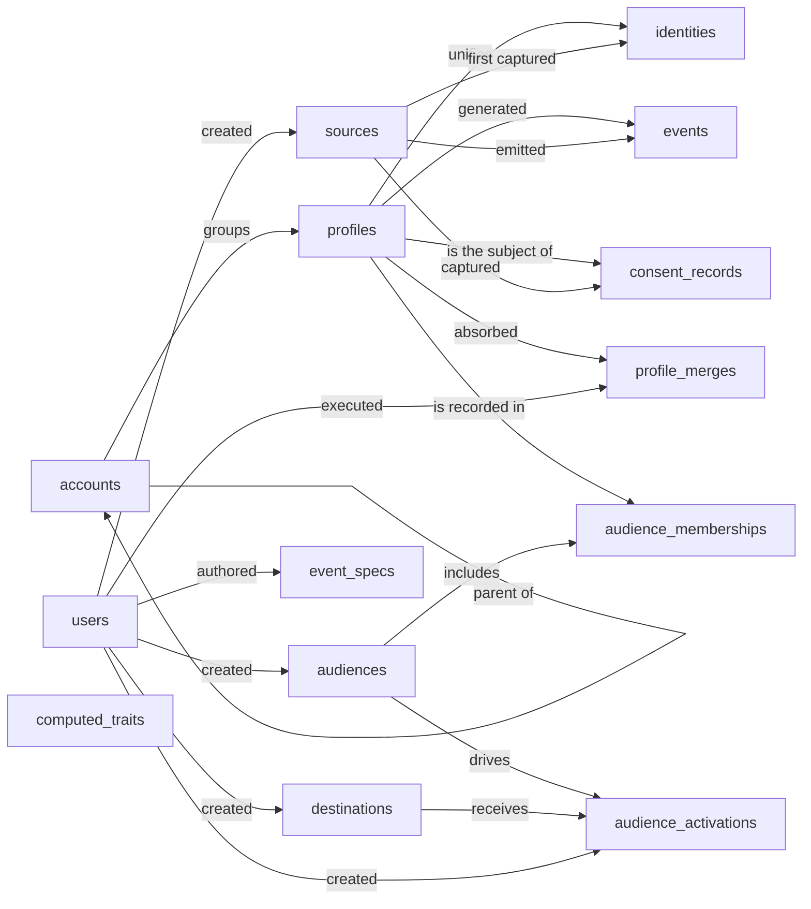

# Customer Data Platform, Semantic Model

## 1. Overview

A Customer Data Platform ingests behavioral and attribute data about customers from many inbound sources, resolves multiple identifiers to a single unified profile, organizes profiles into rule-based audiences, and activates those audiences out to downstream destinations such as ad platforms, email, and the warehouse. Operators (internal users) configure sources, audiences, computed traits, and activations; profile consent state per purpose is tracked separately for compliance. Volumes are skewed: events and identities are high-throughput, while profiles, audiences, and configuration entities are low-cardinality and edited deliberately.

## 2. Entity summary

| # | Table name | Singular label | Purpose |
|---|---|---|---|
| 1 | `profiles` | Profile | The unified customer record (golden record), one row per resolved person |
| 2 | `identities` | Identity | Individual identifiers (email, device_id, anonymous_id, user_id) tied to a profile; the identity-resolution graph |
| 3 | `accounts` | Account | B2B company record; profiles can belong to one |
| 4 | `events` | Event | Behavioral events (track, page, screen, identify) ingested from sources |
| 5 | `computed_traits` | Computed Trait | Derived-trait *definitions* (lifetime_value, recency, etc.); values are written into `profiles.custom_traits` |
| 6 | `audiences` | Audience | Defined customer segments with rule logic |
| 7 | `audience_memberships` | Audience Membership | Junction: which profiles are currently in which audiences |
| 8 | `sources` | Source | Inbound data sources (web SDK, mobile SDK, server, CRM, ad platform) |
| 9 | `destinations` | Destination | Outbound activation targets (ads, email, warehouse, analytics) |
| 10 | `audience_activations` | Audience Activation | Junction: which audiences are pushed to which destinations |
| 11 | `consent_records` | Consent Record | Consent state per profile per purpose (marketing, analytics, etc.) |
| 12 | `users` | User | Internal CDP operators (admins, analysts) |
| 13 | `event_specs` | Event Spec | Tracking-plan-style schema definitions for events; soft-joined to `events` by name |
| 14 | `profile_merges` | Profile Merge | Audit record of an identity-resolution merge between two profiles |

### Entity-relationship diagram



## 3. Entities

### 3.1 `profiles` — Profile

**Plural label:** Profiles
**Label column:** `profile_label`
**Audit log:** yes
**Description:** The unified customer record. One row per resolved person, populated by identity resolution across `identities`. Holds canonical attributes plus a flexible `custom_traits` JSON payload for declared and computed traits.

**Fields**

| Field name | Format | Required | Label | Reference / Notes |
|---|---|---|---|---|
| `profile_label` | `string` | yes | Profile Name | label_column; populated as best display name (full name, primary email fallback) |
| `first_name` | `string` | no | First Name | |
| `last_name` | `string` | no | Last Name | |
| `primary_email` | `email` | no | Primary Email | unique |
| `primary_phone` | `string` | no | Primary Phone | E.164 format |
| `account_id` | `reference` | no | Account | → `accounts` (N:1, clear), relationship_label: "groups" |
| `lifecycle_stage` | `enum` | yes | Lifecycle Stage | values: `anonymous`, `lead`, `prospect`, `customer`, `churned`; default: "anonymous" |
| `first_seen_at` | `date-time` | no | First Seen At | |
| `last_seen_at` | `date-time` | no | Last Seen At | |
| `country` | `string` | no | Country | ISO 3166-1 alpha-2 |
| `timezone` | `string` | no | Timezone | IANA name (e.g. `Europe/Berlin`) |
| `locale` | `string` | no | Locale | BCP-47 |
| `custom_traits` | `json` | no | Custom Traits | flexible payload, including computed trait values |

**Relationships**

- A `profile` may belong to one `account` (N:1, optional, clear on delete).
- A `profile` has many `identities` (1:N, parent of identities, cascade).
- A `profile` has many `events` (1:N, via `events.profile_id`, clear on delete).
- A `profile` has many `consent_records` (1:N, parent of consent_records, cascade).
- A `profile` may be the surviving record for many `profile_merges` (1:N, via `profile_merges.surviving_profile_id`, restrict).
- `profile` ↔ `audience` is many-to-many through the `audience_memberships` junction.

**Validation rules**

```json
[
  {
    "code": "first_seen_at_immutable",
    "message": "first_seen_at cannot change once set.",
    "description": "First-seen is a permanent provenance timestamp; mutating it would corrupt the customer's lifecycle history.",
    "jsonlogic": { "or": [
      { "==": [{ "var": "$old" }, null] },
      { "==": [{ "var": "$old.first_seen_at" }, null] },
      { "==": [{ "var": "first_seen_at" }, { "var": "$old.first_seen_at" }] }
    ]}
  },
  {
    "code": "last_seen_at_after_first_seen_at",
    "message": "last_seen_at must be at or after first_seen_at when both are set.",
    "description": "Recency cannot precede provenance.",
    "jsonlogic": { "or": [
      { "==": [{ "var": "first_seen_at" }, null] },
      { "==": [{ "var": "last_seen_at" }, null] },
      { ">=": [{ "var": "last_seen_at" }, { "var": "first_seen_at" }] }
    ]}
  }
]
```

---

### 3.2 `identities` — Identity

**Plural label:** Identities
**Label column:** `identity_label`
**Audit log:** no
**Description:** A single identifier (email, device_id, user_id, etc.) observed in an inbound source and tied to a `profile`. The collection of identities for a profile is the identity-resolution graph; the platform maintains it as new identifiers are observed.

**Fields**

| Field name | Format | Required | Label | Reference / Notes |
|---|---|---|---|---|
| `identity_label` | `string` | yes | Identity | label_column; populated as `"{identity_type}: {identity_value}"` |
| `identity_type` | `enum` | yes | Identity Type | values: `anonymous_id`, `user_id`, `email`, `phone`, `device_id`, `advertising_id`, `external_id`; default: "anonymous_id" |
| `identity_value` | `string` | yes | Identity Value | the actual identifier string |
| `profile_id` | `parent` | yes | Profile | ↳ `profiles` (N:1, cascade), relationship_label: "unifies" |
| `source_id` | `reference` | no | First Seen In Source | → `sources` (N:1, clear), relationship_label: "first captured" |
| `first_seen_at` | `date-time` | no | First Seen At | |
| `last_seen_at` | `date-time` | no | Last Seen At | |
| `is_primary` | `boolean` | no | Is Primary | one primary per `identity_type` per profile |

**Relationships**

- An `identity` belongs to one `profile` (N:1, required, parent, cascade on delete).
- An `identity` may cite one `source` where it was first seen (N:1, optional, clear on delete).

**Validation rules**

```json
[
  {
    "code": "identity_value_immutable",
    "message": "identity_value cannot change after insert.",
    "description": "The actual identifier captured from a source is the row's identity; editing it would silently rewrite history.",
    "jsonlogic": { "or": [
      { "==": [{ "var": "$old" }, null] },
      { "==": [{ "var": "identity_value" }, { "var": "$old.identity_value" }] }
    ]}
  },
  {
    "code": "last_seen_at_after_first_seen_at",
    "message": "last_seen_at must be at or after first_seen_at when both are set.",
    "description": "Recency cannot precede provenance.",
    "jsonlogic": { "or": [
      { "==": [{ "var": "first_seen_at" }, null] },
      { "==": [{ "var": "last_seen_at" }, null] },
      { ">=": [{ "var": "last_seen_at" }, { "var": "first_seen_at" }] }
    ]}
  }
]
```

---

### 3.3 `accounts` — Account

**Plural label:** Accounts
**Label column:** `account_name`
**Audit log:** yes
**Description:** A B2B company record. Profiles can belong to an account; accounts can themselves nest under a parent account (e.g. subsidiary to parent).

**Fields**

| Field name | Format | Required | Label | Reference / Notes |
|---|---|---|---|---|
| `account_name` | `string` | yes | Account Name | label_column |
| `domain` | `string` | no | Primary Domain | |
| `industry` | `string` | no | Industry | |
| `employee_count` | `integer` | no | Employee Count | |
| `annual_revenue` | `number` | no | Annual Revenue | precision: 2 |
| `country` | `string` | no | Country | ISO 3166-1 alpha-2 |
| `lifecycle_stage` | `enum` | yes | Lifecycle Stage | values: `prospect`, `customer`, `churned`; default: "prospect" |
| `parent_account_id` | `reference` | no | Parent Account | → `accounts` (N:1, self-reference, clear), relationship_label: "parent of" |

**Relationships**

- An `account` may have one parent `account` (N:1, self-reference, optional, clear on delete).
- An `account` may have many child `accounts` (1:N, via `accounts.parent_account_id`).
- An `account` has many `profiles` (1:N, via `profiles.account_id`).

**Validation rules**

```json
[
  {
    "code": "employee_count_non_negative",
    "message": "employee_count cannot be negative.",
    "description": "Counts are non-negative.",
    "jsonlogic": { "or": [
      { "==": [{ "var": "employee_count" }, null] },
      { ">=": [{ "var": "employee_count" }, 0] }
    ]}
  },
  {
    "code": "annual_revenue_non_negative",
    "message": "annual_revenue cannot be negative.",
    "description": "Currency amounts are non-negative for this field.",
    "jsonlogic": { "or": [
      { "==": [{ "var": "annual_revenue" }, null] },
      { ">=": [{ "var": "annual_revenue" }, 0] }
    ]}
  },
  {
    "code": "parent_account_no_self_loop",
    "message": "An account cannot be its own parent.",
    "description": "Direct self-loop guard. Deeper cycles are not detectable in row-level JsonLogic and stay an application concern.",
    "jsonlogic": { "or": [
      { "==": [{ "var": "parent_account_id" }, null] },
      { "!=": [{ "var": "parent_account_id" }, { "var": "id" }] }
    ]}
  }
]
```

---

### 3.4 `events` — Event

**Plural label:** Events
**Label column:** `event_name`
**Audit log:** no
**Description:** A single behavioral event ingested from a source. The dominant high-volume entity in the platform. Events may arrive before identity resolution, in which case `profile_id` is null and `anonymous_id` carries the client identifier until resolution catches up.

**Fields**

| Field name | Format | Required | Label | Reference / Notes |
|---|---|---|---|---|
| `event_name` | `string` | yes | Event Name | label_column, e.g. `"Order Completed"`; soft-joined to `event_specs.event_name` |
| `event_type` | `enum` | yes | Event Type | values: `track`, `page`, `screen`, `identify`, `group`, `alias`; default: "track" |
| `profile_id` | `reference` | no | Profile | → `profiles` (N:1, clear); null until identity resolution; relationship_label: "generated" |
| `anonymous_id` | `string` | no | Anonymous ID | pre-identification client ID |
| `source_id` | `reference` | yes | Source | → `sources` (N:1, restrict), relationship_label: "emitted" |
| `occurred_at` | `date-time` | yes | Occurred At | client timestamp |
| `received_at` | `date-time` | yes | Received At | server timestamp |
| `session_id` | `string` | no | Session ID | |
| `properties` | `json` | no | Properties | event payload |
| `context` | `json` | no | Context | device, OS, IP, user-agent |

**Relationships**

- An `event` is emitted by one `source` (N:1, required, restrict; sources cannot be deleted while events reference them).
- An `event` may resolve to one `profile` (N:1, optional, clear on delete).

**Validation rules**

```json
[
  {
    "code": "occurred_at_le_received_at",
    "message": "occurred_at (client time) must be at or before received_at (server time).",
    "description": "An event cannot be received before it occurred. Catches client clock skew at insert.",
    "jsonlogic": { "<=": [{ "var": "occurred_at" }, { "var": "received_at" }] }
  },
  {
    "code": "event_name_immutable",
    "message": "event_name cannot change after insert.",
    "description": "Renaming an ingested event silently breaks downstream queries that filter by name.",
    "jsonlogic": { "or": [
      { "==": [{ "var": "$old" }, null] },
      { "==": [{ "var": "event_name" }, { "var": "$old.event_name" }] }
    ]}
  },
  {
    "code": "received_at_immutable",
    "message": "received_at cannot change after insert.",
    "description": "Server-stamped at ingestion; should never be edited.",
    "jsonlogic": { "or": [
      { "==": [{ "var": "$old" }, null] },
      { "==": [{ "var": "received_at" }, { "var": "$old.received_at" }] }
    ]}
  },
  {
    "code": "profile_id_resolution_only_forward",
    "message": "profile_id can be set from null but cannot be changed once resolved.",
    "description": "Late identity resolution is allowed (null becomes a profile id). Reassigning a resolved event to a different profile is not.",
    "jsonlogic": { "or": [
      { "==": [{ "var": "$old" }, null] },
      { "==": [{ "var": "$old.profile_id" }, null] },
      { "==": [{ "var": "profile_id" }, { "var": "$old.profile_id" }] }
    ]}
  }
]
```

---

### 3.5 `computed_traits` — Computed Trait

**Plural label:** Computed Traits
**Label column:** `trait_name`
**Audit log:** yes
**Description:** A *definition* of a derived attribute (e.g. `lifetime_value`, `days_since_last_purchase`). The platform evaluates the definition on the configured cadence and writes the resulting value into the matching profile's `custom_traits` JSON. This entity does not store per-profile values directly.

**Fields**

| Field name | Format | Required | Label | Reference / Notes |
|---|---|---|---|---|
| `trait_name` | `string` | yes | Trait Name | label_column; unique; e.g. `"lifetime_value"`; used as the JSON key in `profiles.custom_traits` |
| `display_label` | `string` | no | Display Label | human-friendly name |
| `description` | `text` | no | Description | |
| `data_type` | `enum` | yes | Data Type | values: `string`, `number`, `boolean`, `date`, `datetime`, `list`; default: "string" |
| `definition` | `text` | yes | Definition | SQL or rule expression |
| `compute_frequency` | `enum` | yes | Compute Frequency | values: `on_demand`, `realtime`, `hourly`, `daily`, `weekly`; default: "on_demand" |
| `last_computed_at` | `date-time` | no | Last Computed At | |
| `is_active` | `boolean` | yes | Is Active | |

**Relationships**

- `computed_traits` is a standalone definition table; it does not link to other entities. Computed values land in `profiles.custom_traits`.

**Validation rules**

```json
[
  {
    "code": "trait_name_immutable",
    "message": "trait_name cannot change after insert.",
    "description": "trait_name is the JSON key in profiles.custom_traits; renaming would orphan every existing value.",
    "jsonlogic": { "or": [
      { "==": [{ "var": "$old" }, null] },
      { "==": [{ "var": "trait_name" }, { "var": "$old.trait_name" }] }
    ]}
  },
  {
    "code": "data_type_immutable",
    "message": "data_type cannot change after insert.",
    "description": "Switching the type of an existing trait silently corrupts every value already written into custom_traits.",
    "jsonlogic": { "or": [
      { "==": [{ "var": "$old" }, null] },
      { "==": [{ "var": "data_type" }, { "var": "$old.data_type" }] }
    ]}
  }
]
```

---

### 3.6 `audiences` — Audience

**Plural label:** Audiences
**Label column:** `audience_name`
**Audit log:** yes
**Description:** A defined customer segment with rule logic. Membership is materialized in `audience_memberships`. An audience can be activated to one or more destinations via `audience_activations`.

**Fields**

| Field name | Format | Required | Label | Reference / Notes |
|---|---|---|---|---|
| `audience_name` | `string` | yes | Audience Name | label_column |
| `description` | `text` | no | Description | |
| `audience_type` | `enum` | yes | Audience Type | values: `rule_based`, `sql`, `lookalike`, `manual`; default: "rule_based" |
| `definition` | `text` | yes | Definition | rule logic (JSON) or SQL |
| `status` | `enum` | yes | Status | values: `draft`, `active`, `paused`, `archived`; default: "draft" |
| `profile_count` | `integer` | no | Profile Count | denormalized current size |
| `refresh_frequency` | `enum` | yes | Refresh Frequency | values: `on_demand`, `realtime`, `hourly`, `daily`; default: "on_demand" |
| `last_computed_at` | `date-time` | no | Last Computed At | |
| `created_by_user_id` | `reference` | no | Created By | → `users` (N:1, clear), relationship_label: "created" |

**Relationships**

- An `audience` was created by one `user` (N:1, optional, clear on delete).
- `audience` ↔ `profile` is many-to-many through the `audience_memberships` junction.
- `audience` ↔ `destination` is many-to-many through the `audience_activations` junction.

**Validation rules**

```json
[
  {
    "code": "audience_type_immutable",
    "message": "audience_type cannot change after insert.",
    "description": "audience_type fundamentally changes how the audience is evaluated (rule engine vs SQL vs lookalike). Switching it after profiles have been admitted would silently invalidate membership.",
    "jsonlogic": { "or": [
      { "==": [{ "var": "$old" }, null] },
      { "==": [{ "var": "audience_type" }, { "var": "$old.audience_type" }] }
    ]}
  },
  {
    "code": "profile_count_non_negative",
    "message": "profile_count cannot be negative.",
    "description": "Counts are non-negative.",
    "jsonlogic": { "or": [
      { "==": [{ "var": "profile_count" }, null] },
      { ">=": [{ "var": "profile_count" }, 0] }
    ]}
  }
]
```

---

### 3.7 `audience_memberships` — Audience Membership

**Plural label:** Audience Memberships
**Label column:** `membership_label`
**Audit log:** no
**Description:** Junction recording which profiles are members of which audiences at a given time. High churn on realtime audiences. A populated `left_at` means the profile has dropped out; the row is retained for history rather than deleted. `is_active` is computed from `left_at`.

**Fields**

| Field name | Format | Required | Label | Reference / Notes |
|---|---|---|---|---|
| `membership_label` | `string` | yes | Membership | label_column; populated by the caller as `"{audience_name} / {profile_label}"` on create (FK traversal is not available in row-level JsonLogic) |
| `audience_id` | `parent` | yes | Audience | ↳ `audiences` (N:1, cascade), relationship_label: "includes" |
| `profile_id` | `parent` | yes | Profile | ↳ `profiles` (N:1, cascade), relationship_label: "is recorded in" |
| `joined_at` | `date-time` | yes | Joined At | |
| `left_at` | `date-time` | no | Left At | null while still a member |
| `is_active` | `boolean` | yes | Is Active | computed: `left_at IS NULL`; caller-supplied values are overwritten |

**Relationships**

- A `membership` belongs to one `audience` (N:1, required, parent, cascade on delete).
- A `membership` belongs to one `profile` (N:1, required, parent, cascade on delete).

**Computed fields**

```json
[
  {
    "name": "is_active",
    "description": "True iff the membership has not yet been left.",
    "jsonlogic": { "==": [{ "var": "left_at" }, null] }
  }
]
```

**Validation rules**

```json
[
  {
    "code": "audience_id_immutable",
    "message": "audience_id cannot change after insert.",
    "description": "A membership is the (audience, profile) tuple itself; reassignment would silently move the row.",
    "jsonlogic": { "or": [
      { "==": [{ "var": "$old" }, null] },
      { "==": [{ "var": "audience_id" }, { "var": "$old.audience_id" }] }
    ]}
  },
  {
    "code": "profile_id_immutable",
    "message": "profile_id cannot change after insert.",
    "description": "Same as audience_id; the membership tuple is fixed.",
    "jsonlogic": { "or": [
      { "==": [{ "var": "$old" }, null] },
      { "==": [{ "var": "profile_id" }, { "var": "$old.profile_id" }] }
    ]}
  },
  {
    "code": "joined_at_immutable",
    "message": "joined_at cannot change after insert.",
    "description": "Joined timestamp is set on first creation and pinned.",
    "jsonlogic": { "or": [
      { "==": [{ "var": "$old" }, null] },
      { "==": [{ "var": "joined_at" }, { "var": "$old.joined_at" }] }
    ]}
  },
  {
    "code": "left_at_after_joined_at",
    "message": "left_at must be at or after joined_at.",
    "description": "A membership cannot end before it began.",
    "jsonlogic": { "or": [
      { "==": [{ "var": "left_at" }, null] },
      { ">=": [{ "var": "left_at" }, { "var": "joined_at" }] }
    ]}
  }
]
```

---

### 3.8 `sources` — Source

**Plural label:** Sources
**Label column:** `source_name`
**Audit log:** yes
**Description:** An inbound data source, a configured channel through which events and identity data flow into the CDP. Each source has a `write_key` used by the SDK or server-side caller to authenticate ingestion.

**Fields**

| Field name | Format | Required | Label | Reference / Notes |
|---|---|---|---|---|
| `source_name` | `string` | yes | Source Name | label_column |
| `source_type` | `enum` | yes | Source Type | values: `web_sdk`, `mobile_sdk_ios`, `mobile_sdk_android`, `server`, `cloud_app`, `warehouse`, `file_upload`, `http_api`; default: "web_sdk" |
| `write_key` | `string` | yes | Write Key | unique; ingestion auth token; rotatable |
| `description` | `text` | no | Description | |
| `is_active` | `boolean` | yes | Is Active | |
| `last_event_received_at` | `date-time` | no | Last Event Received | |
| `event_count` | `integer` | no | Event Count | denormalized |
| `created_by_user_id` | `reference` | no | Created By | → `users` (N:1, clear), relationship_label: "created" |

**Relationships**

- A `source` emits many `events` (1:N, via `events.source_id`, restrict).
- A `source` may have first seen many `identities` (1:N, via `identities.source_id`, clear).
- A `source` may have captured many `consent_records` (1:N, via `consent_records.source_id`, clear).
- A `source` may have been created by one `user` (N:1, optional, clear on delete).

**Validation rules**

```json
[
  {
    "code": "source_type_immutable",
    "message": "source_type cannot change after insert.",
    "description": "source_type defines the ingestion path (SDK vs server vs warehouse). Changing it after events have arrived would silently misclassify all of them.",
    "jsonlogic": { "or": [
      { "==": [{ "var": "$old" }, null] },
      { "==": [{ "var": "source_type" }, { "var": "$old.source_type" }] }
    ]}
  },
  {
    "code": "event_count_non_negative",
    "message": "event_count cannot be negative.",
    "description": "Counts are non-negative.",
    "jsonlogic": { "or": [
      { "==": [{ "var": "event_count" }, null] },
      { ">=": [{ "var": "event_count" }, 0] }
    ]}
  }
]
```

---

### 3.9 `destinations` — Destination

**Plural label:** Destinations
**Label column:** `destination_name`
**Audit log:** yes
**Description:** An outbound activation target, a downstream tool that receives audience data from the CDP (ad platform, ESP, warehouse, etc.). Configuration is stored as JSON; secrets are managed by the platform's secret store, not in this entity.

**Fields**

| Field name | Format | Required | Label | Reference / Notes |
|---|---|---|---|---|
| `destination_name` | `string` | yes | Destination Name | label_column |
| `destination_type` | `enum` | yes | Destination Type | values: `advertising`, `email`, `sms`, `push`, `analytics`, `warehouse`, `crm`, `custom_webhook`; default: "advertising" |
| `vendor` | `string` | no | Vendor | e.g. `"Meta Ads"`, `"Salesforce"` |
| `configuration` | `json` | no | Configuration | non-secret connection settings |
| `is_active` | `boolean` | yes | Is Active | |
| `last_sync_at` | `date-time` | no | Last Sync At | |
| `sync_status` | `enum` | no | Sync Status | values: `idle`, `syncing`, `error` |
| `created_by_user_id` | `reference` | no | Created By | → `users` (N:1, clear), relationship_label: "created" |

**Relationships**

- `destination` ↔ `audience` is many-to-many through the `audience_activations` junction.
- A `destination` may have been created by one `user` (N:1, optional, clear on delete).

**Validation rules**

```json
[
  {
    "code": "destination_type_immutable",
    "message": "destination_type cannot change after insert.",
    "description": "destination_type defines the API/SDK contract; changing it would silently break every active activation.",
    "jsonlogic": { "or": [
      { "==": [{ "var": "$old" }, null] },
      { "==": [{ "var": "destination_type" }, { "var": "$old.destination_type" }] }
    ]}
  }
]
```

---

### 3.10 `audience_activations` — Audience Activation

**Plural label:** Audience Activations
**Label column:** `activation_label`
**Audit log:** yes
**Description:** Junction defining that a specific audience is being pushed to a specific destination on a specific cadence. Holds the field-mapping payload, sync mode, and last-sync state.

**Fields**

| Field name | Format | Required | Label | Reference / Notes |
|---|---|---|---|---|
| `activation_label` | `string` | yes | Activation | label_column; populated by the caller as `"{audience_name} → {destination_name}"` on create (FK traversal is not available in row-level JsonLogic) |
| `audience_id` | `parent` | yes | Audience | ↳ `audiences` (N:1, cascade), relationship_label: "drives" |
| `destination_id` | `parent` | yes | Destination | ↳ `destinations` (N:1, cascade), relationship_label: "receives" |
| `sync_mode` | `enum` | yes | Sync Mode | values: `incremental`, `full_resync`, `mirror`; default: "incremental" |
| `sync_frequency` | `enum` | yes | Sync Frequency | values: `on_demand`, `realtime`, `hourly`, `daily`; default: "on_demand" |
| `field_mappings` | `json` | no | Field Mappings | profile field to destination field |
| `is_active` | `boolean` | yes | Is Active | |
| `last_sync_at` | `date-time` | no | Last Sync At | |
| `last_sync_status` | `enum` | yes | Last Sync Status | values: `pending`, `success`, `partial`, `failed`; default: "pending" (correct state for a never-run activation) |
| `created_by_user_id` | `reference` | no | Created By | → `users` (N:1, clear), relationship_label: "created" |

**Relationships**

- An `activation` belongs to one `audience` (N:1, required, parent, cascade on delete).
- An `activation` belongs to one `destination` (N:1, required, parent, cascade on delete).
- An `activation` may have been created by one `user` (N:1, optional, clear on delete).

**Validation rules**

```json
[
  {
    "code": "audience_id_immutable",
    "message": "audience_id cannot change after insert.",
    "description": "Activation identity is the (audience, destination) tuple; reassigning the audience would silently rewrite history.",
    "jsonlogic": { "or": [
      { "==": [{ "var": "$old" }, null] },
      { "==": [{ "var": "audience_id" }, { "var": "$old.audience_id" }] }
    ]}
  },
  {
    "code": "destination_id_immutable",
    "message": "destination_id cannot change after insert.",
    "description": "Same as audience_id; the activation tuple is fixed.",
    "jsonlogic": { "or": [
      { "==": [{ "var": "$old" }, null] },
      { "==": [{ "var": "destination_id" }, { "var": "$old.destination_id" }] }
    ]}
  }
]
```

---

### 3.11 `consent_records` — Consent Record

**Plural label:** Consent Records
**Label column:** `consent_label`
**Audit log:** yes
**Description:** A consent state for a single profile, purpose, and (optionally) jurisdiction. Append-only by design: new consent events do not overwrite, they create a new row so the full consent history is preserved for compliance audits.

**Fields**

| Field name | Format | Required | Label | Reference / Notes |
|---|---|---|---|---|
| `consent_label` | `string` | yes | Consent | label_column; populated by the caller as `"{profile_label} / {consent_purpose} / {status}"` on create (FK traversal is not available in row-level JsonLogic) |
| `profile_id` | `parent` | yes | Profile | ↳ `profiles` (N:1, cascade), relationship_label: "is the subject of" |
| `consent_purpose` | `enum` | yes | Purpose | values: `marketing`, `analytics`, `advertising`, `personalization`, `sale_of_data`, `all`; default: "marketing" |
| `status` | `enum` | yes | Status | values: `unknown`, `granted`, `denied`, `withdrawn`; default: "unknown" (explicit consent must be set deliberately) |
| `source_id` | `reference` | no | Captured In Source | → `sources` (N:1, clear), relationship_label: "captured" |
| `jurisdiction` | `string` | no | Jurisdiction | e.g. `GDPR-EU`, `CCPA-CA` |
| `granted_at` | `date-time` | no | Granted At | |
| `withdrawn_at` | `date-time` | no | Withdrawn At | |
| `expires_at` | `date-time` | no | Expires At | |
| `consent_text` | `text` | no | Consent Text | shown to user at capture time |

**Relationships**

- A `consent_record` belongs to one `profile` (N:1, required, parent, cascade on delete). Cascade is the deliberate default to support GDPR / CCPA right-to-be-forgotten: when a profile is forgotten, its consent rows are removed with it. Operators whose primary regime is retention-heavy (e.g. financial-services consent retention obligations) can override the FK to `restrict` at deploy time and adopt a soft-delete pattern on `profiles` instead.
- A `consent_record` may cite one `source` where it was captured (N:1, optional, clear on delete).

**Validation rules**

```json
[
  {
    "code": "record_is_insert_only",
    "message": "Consent records are append-only; create a new record instead of editing.",
    "description": "Per the entity description, consent state changes are captured as new rows so the full history is preserved for compliance.",
    "jsonlogic": { "==": [{ "var": "$old" }, null] }
  },
  {
    "code": "granted_at_required_when_granted",
    "message": "granted_at must be set when status is granted.",
    "description": "A granted consent without a granted_at timestamp cannot be audited.",
    "jsonlogic": { "or": [
      { "!=": [{ "var": "status" }, "granted"] },
      { "!=": [{ "var": "granted_at" }, null] }
    ]}
  },
  {
    "code": "withdrawn_at_required_when_withdrawn",
    "message": "withdrawn_at must be set when status is withdrawn.",
    "description": "Symmetric to granted_at; a withdrawal without a timestamp cannot be audited.",
    "jsonlogic": { "or": [
      { "!=": [{ "var": "status" }, "withdrawn"] },
      { "!=": [{ "var": "withdrawn_at" }, null] }
    ]}
  },
  {
    "code": "expires_at_after_granted_at",
    "message": "expires_at must be at or after granted_at when both are set.",
    "description": "Consent cannot expire before it was granted.",
    "jsonlogic": { "or": [
      { "==": [{ "var": "expires_at" }, null] },
      { "==": [{ "var": "granted_at" }, null] },
      { ">=": [{ "var": "expires_at" }, { "var": "granted_at" }] }
    ]}
  }
]
```

---

### 3.12 `users` — User

**Plural label:** Users
**Label column:** `user_name`
**Audit log:** yes
**Description:** An internal CDP operator (admin, analyst, marketer). Distinct from `profiles`, which are the customers tracked by the platform. The downstream deployer will deduplicate this against the Semantius built-in `users` table.

**Fields**

| Field name | Format | Required | Label | Reference / Notes |
|---|---|---|---|---|
| `user_name` | `string` | yes | Display Name | label_column |
| `email` | `email` | yes | Email | unique |
| `first_name` | `string` | no | First Name | |
| `last_name` | `string` | no | Last Name | |
| `is_active` | `boolean` | yes | Is Active | |
| `last_login_at` | `date-time` | no | Last Login At | |

**Relationships**

- A `user` may have created many `audiences` (1:N, via `audiences.created_by_user_id`).
- A `user` may have created many `sources` (1:N, via `sources.created_by_user_id`).
- A `user` may have created many `destinations` (1:N, via `destinations.created_by_user_id`).
- A `user` may have created many `audience_activations` (1:N, via `audience_activations.created_by_user_id`).
- A `user` may have authored many `event_specs` (1:N, via `event_specs.created_by_user_id`).
- A `user` may have executed many `profile_merges` (1:N, via `profile_merges.merged_by_user_id`).
- Role assignments and permissions use the Semantius platform-native `roles` / `user_roles` mechanism, not modeled as custom entities here.

---

### 3.13 `event_specs` — Event Spec

**Plural label:** Event Specs
**Label column:** `event_name`
**Audit log:** yes
**Description:** Tracking-plan-style schema definition for an event. The platform matches incoming `events.event_name` against this table by name (soft join, no FK) and validates the event `properties` payload against `properties_schema` when a spec exists. Events with no matching spec are accepted as "unplanned" and flagged on the source.

**Fields**

| Field name | Format | Required | Label | Reference / Notes |
|---|---|---|---|---|
| `event_name` | `string` | yes | Event Name | label_column; unique; matches `events.event_name` |
| `description` | `text` | no | Description | |
| `event_type` | `enum` | yes | Event Type | values: `track`, `page`, `screen`, `identify`, `group`, `alias`; default: "track" |
| `properties_schema` | `json` | no | Properties Schema | JSON Schema for expected `events.properties` shape |
| `version` | `string` | no | Version | semver of the spec, e.g. `"1.2.0"` |
| `is_active` | `boolean` | yes | Is Active | inactive specs no longer enforce on ingestion |
| `last_validated_event_at` | `date-time` | no | Last Validated Event At | |
| `created_by_user_id` | `reference` | no | Created By | → `users` (N:1, clear), relationship_label: "authored" |

**Relationships**

- An `event_spec` may have been authored by one `user` (N:1, optional, clear on delete).
- The link to `events` is a soft join by `event_name`; there is no FK column on either side so events can be ingested before their spec exists and specs can be authored after the first events arrive.

**Validation rules**

```json
[
  {
    "code": "event_name_immutable",
    "message": "event_name cannot change after insert.",
    "description": "event_name is the soft-join key to events; renaming would orphan every event already classified under the old name.",
    "jsonlogic": { "or": [
      { "==": [{ "var": "$old" }, null] },
      { "==": [{ "var": "event_name" }, { "var": "$old.event_name" }] }
    ]}
  },
  {
    "code": "event_type_immutable",
    "message": "event_type cannot change after insert.",
    "description": "event_type is part of the spec's identity; changing it would silently reclassify every matching event.",
    "jsonlogic": { "or": [
      { "==": [{ "var": "$old" }, null] },
      { "==": [{ "var": "event_type" }, { "var": "$old.event_type" }] }
    ]}
  }
]
```

---

### 3.14 `profile_merges` — Profile Merge

**Plural label:** Profile Merges
**Label column:** `merge_label`
**Audit log:** yes
**Description:** Audit record of an identity-resolution merge. The obsolete profile is removed from `profiles`; this table preserves the merge trail (which surviving profile absorbed which obsolete identifier, when, by whom, why). One row per merge event. No FK to the obsolete profile (it no longer exists), only a snapshot of its UUID and label. Append-only by design.

**Fields**

| Field name | Format | Required | Label | Reference / Notes |
|---|---|---|---|---|
| `merge_label` | `string` | yes | Merge | label_column; computed from the two snapshot fields below |
| `surviving_profile_id` | `reference` | yes | Surviving Profile | → `profiles` (N:1, restrict), relationship_label: "absorbed" |
| `surviving_profile_label_snapshot` | `string` | yes | Surviving Profile Name | snapshot of the surviving profile's label at merge time, so the audit row stays meaningful even if the surviving profile's label later changes |
| `obsolete_profile_uuid` | `uuid` | yes | Obsolete Profile UUID | the deleted profile's id, retained for audit |
| `obsolete_profile_label_snapshot` | `string` | yes | Obsolete Profile Name | snapshot of the obsolete profile's label at merge time |
| `merged_at` | `date-time` | yes | Merged At | |
| `merge_reason` | `enum` | yes | Merge Reason | values: `automatic_resolution`, `manual_admin`, `data_correction`; default: "automatic_resolution" |
| `identities_moved_count` | `integer` | yes | Identities Moved | denormalized; ≥ 1 |
| `events_relinked_count` | `integer` | yes | Events Relinked | denormalized; ≥ 0 |
| `merge_metadata` | `json` | no | Merge Metadata | per-field conflict-resolution choices, identities moved list, etc. |
| `merged_by_user_id` | `reference` | no | Merged By | → `users` (N:1, clear), relationship_label: "executed" (null when automatic) |

**Relationships**

- A `profile_merge` cites one surviving `profile` (N:1, required, restrict; the audit row blocks deletion of a profile that has merge history).
- A `profile_merge` may have been executed by one `user` (N:1, optional, clear on delete).
- The obsolete profile is intentionally not an FK: at merge time the obsolete row is removed; only its UUID and label are retained as snapshot fields.

**Computed fields**

```json
[
  {
    "name": "merge_label",
    "description": "Composite from the two snapshot fields on this row (no FK traversal needed).",
    "jsonlogic": { "cat": [
      { "var": "obsolete_profile_label_snapshot" },
      " → ",
      { "var": "surviving_profile_label_snapshot" }
    ]}
  }
]
```

**Validation rules**

```json
[
  {
    "code": "record_is_insert_only",
    "message": "Profile merges are an audit log; rows cannot be edited after insert.",
    "description": "The merge already happened; editing the audit row would corrupt history.",
    "jsonlogic": { "==": [{ "var": "$old" }, null] }
  },
  {
    "code": "identities_moved_count_at_least_one",
    "message": "A merge must move at least one identity (otherwise it is not a merge).",
    "description": "The smallest meaningful merge collapses one identity from the obsolete profile into the surviving one.",
    "jsonlogic": { ">=": [{ "var": "identities_moved_count" }, 1] }
  },
  {
    "code": "events_relinked_count_non_negative",
    "message": "events_relinked_count cannot be negative.",
    "description": "Counts are non-negative.",
    "jsonlogic": { ">=": [{ "var": "events_relinked_count" }, 0] }
  }
]
```

---

## 4. Relationship summary

| From | Field | To | Cardinality | Kind | Delete behavior |
|---|---|---|---|---|---|
| `profiles` | `account_id` | `accounts` | N:1 | reference | clear |
| `accounts` | `parent_account_id` | `accounts` | N:1 | reference | clear |
| `identities` | `profile_id` | `profiles` | N:1 | parent | cascade |
| `identities` | `source_id` | `sources` | N:1 | reference | clear |
| `events` | `profile_id` | `profiles` | N:1 | reference | clear |
| `events` | `source_id` | `sources` | N:1 | reference | restrict |
| `audience_memberships` | `audience_id` | `audiences` | N:1 | parent (junction) | cascade |
| `audience_memberships` | `profile_id` | `profiles` | N:1 | parent (junction) | cascade |
| `audience_activations` | `audience_id` | `audiences` | N:1 | parent (junction) | cascade |
| `audience_activations` | `destination_id` | `destinations` | N:1 | parent (junction) | cascade |
| `audience_activations` | `created_by_user_id` | `users` | N:1 | reference | clear |
| `audiences` | `created_by_user_id` | `users` | N:1 | reference | clear |
| `sources` | `created_by_user_id` | `users` | N:1 | reference | clear |
| `destinations` | `created_by_user_id` | `users` | N:1 | reference | clear |
| `consent_records` | `profile_id` | `profiles` | N:1 | parent | cascade |
| `consent_records` | `source_id` | `sources` | N:1 | reference | clear |
| `event_specs` | `created_by_user_id` | `users` | N:1 | reference | clear |
| `profile_merges` | `surviving_profile_id` | `profiles` | N:1 | reference | restrict |
| `profile_merges` | `merged_by_user_id` | `users` | N:1 | reference | clear |

## 5. Enumerations

### 5.1 `profiles.lifecycle_stage`
- `anonymous`
- `lead`
- `prospect`
- `customer`
- `churned`

### 5.2 `accounts.lifecycle_stage`
- `prospect`
- `customer`
- `churned`

### 5.3 `identities.identity_type`
- `anonymous_id`
- `user_id`
- `email`
- `phone`
- `device_id`
- `advertising_id`
- `external_id`

### 5.4 `events.event_type`
- `track`
- `page`
- `screen`
- `identify`
- `group`
- `alias`

### 5.5 `computed_traits.data_type`
- `string`
- `number`
- `boolean`
- `date`
- `datetime`
- `list`

### 5.6 `computed_traits.compute_frequency`
- `on_demand`
- `realtime`
- `hourly`
- `daily`
- `weekly`

### 5.7 `audiences.audience_type`
- `rule_based`
- `sql`
- `lookalike`
- `manual`

### 5.8 `audiences.status`
- `draft`
- `active`
- `paused`
- `archived`

### 5.9 `audiences.refresh_frequency`
- `on_demand`
- `realtime`
- `hourly`
- `daily`

### 5.10 `sources.source_type`
- `web_sdk`
- `mobile_sdk_ios`
- `mobile_sdk_android`
- `server`
- `cloud_app`
- `warehouse`
- `file_upload`
- `http_api`

### 5.11 `destinations.destination_type`
- `advertising`
- `email`
- `sms`
- `push`
- `analytics`
- `warehouse`
- `crm`
- `custom_webhook`

### 5.12 `destinations.sync_status`
- `idle`
- `syncing`
- `error`

### 5.13 `audience_activations.sync_mode`
- `incremental`
- `full_resync`
- `mirror`

### 5.14 `audience_activations.sync_frequency`
- `on_demand`
- `realtime`
- `hourly`
- `daily`

### 5.15 `audience_activations.last_sync_status`
- `pending`
- `success`
- `partial`
- `failed`

### 5.16 `consent_records.consent_purpose`
- `marketing`
- `analytics`
- `advertising`
- `personalization`
- `sale_of_data`
- `all`

### 5.17 `consent_records.status`
- `unknown`
- `granted`
- `denied`
- `withdrawn`

### 5.18 `event_specs.event_type`
- `track`
- `page`
- `screen`
- `identify`
- `group`
- `alias`

### 5.19 `profile_merges.merge_reason`
- `automatic_resolution`
- `manual_admin`
- `data_correction`

## 6. Cross-model link suggestions

The CDP is the canonical customer master in this enterprise architecture. Sibling modules typically host their own person/company records that should resolve back to the CDP's unified `profiles` and `accounts` rather than duplicate them. The deployer applies each row when the `From` table later arrives in the catalog; rows whose source table is not present are silently skipped.

| From | To | Verb | Cardinality | Delete |
|---|---|---|---|---|
| `contacts` | `profiles` | unifies | N:1 | clear |
| `companies` | `accounts` | consolidates | N:1 | clear |
| `campaigns` | `audiences` | powers | N:1 | clear |
| `journeys` | `audiences` | seeds | N:1 | clear |
| `cohorts` | `audiences` | feeds | N:1 | clear |
| `data_subject_requests` | `profiles` | is the subject of | N:1 | clear |
| `customers` | `profiles` | unifies | N:1 | clear |
| `orders` | `profiles` | placed | N:1 | clear |
| `carts` | `profiles` | owns | N:1 | clear |
| `tickets` | `profiles` | raised | N:1 | clear |

Notes:

- `contacts → profiles` and `companies → accounts` are the inbound CRM links. When a CRM module is deployed (Salesforce-style or HubSpot-style), each CRM contact / company should carry an FK back to the unified CDP record so sales activity resolves to the same person and company that marketing sees.
- `campaigns → audiences` and `journeys → audiences` are the inbound marketing-automation links. A campaign or a journey should target a real CDP audience rather than a standalone segment list.
- `cohorts → audiences` is the inbound product-analytics link. A product analytics tool's cohort frequently sources from or mirrors a CDP audience. Confidence is moderate (some product analytics tools maintain independent cohort definitions); the row is cheap because the deployer skips silently when no `cohorts` table exists.
- `data_subject_requests → profiles` is the inbound privacy-and-consent-management link. A DSAR/DSR is filed by or about a specific customer profile.
- `customers → profiles`, `orders → profiles`, and `carts → profiles` are the inbound e-commerce links. The e-commerce customer record resolves to the unified CDP profile; orders and carts reference the buying profile.
- `tickets → profiles` is the inbound helpdesk link. A support ticket is raised by a customer profile.
- The `users` entity is intentionally not in §6. It is shared master data that the deployer reconciles via its built-in name-collision flow against the Semantius platform `users` table, not via a cross-model FK hint. The same is true of helpdesk `agents`, who are platform users.
- Identity & Access and Data Warehouse appear in `related_domains` but have no §6 rows. Identity & Access typically extends `users` upward (groups, sessions) rather than referencing CDP entities laterally. Data Warehouse integration is via raw event ETL, not FK.

## 7. Open questions

### 7.1 🔴 Decisions needed (blockers)

None.

### 7.2 🟡 Future considerations (deferred scope)

- Should `profiles.lifecycle_stage` and `accounts.lifecycle_stage` enforce a one-way transition into `churned`, or stay reversible to support customer re-acquisition? Currently reversible by design; no transition rule emitted. If the business decides churn is permanent, promote to a `$old`-based transition rule.
- Should `audiences.status = archived` be one-way, or stay reversible (un-archive flag)? Currently reversible by design; no transition rule emitted.
- Should `computed_traits` values be stored in a dedicated `profile_trait_values` junction (profile_id, trait_id, value, computed_at) instead of inside `profiles.custom_traits` JSON? The JSON approach is simpler but limits per-trait history, time-series querying, and trait-level access control.
- Should `sessions` be modeled as a first-class entity, or stay derived from `events.session_id`? A dedicated entity helps if session-level metrics (duration, page count, exit page) become a primary product surface.
- Should `audiences.definition` evolve into a structured rule entity (predicate trees with their own table) once the rule complexity outgrows free-text JSON/SQL? Trade-off: structured rules enable a visual builder; free-text is faster to ship.
- Should `consent_records` track consent for *anonymous* identities (pre-profile resolution), and if so, how should those records re-attach to the resolved profile after identification?
- Should `accounts` support more than one parent (a many-to-many parent/child graph) to model conglomerates and matrix structures, instead of the current single self-reference?
- Should `destinations.configuration` be split into a dedicated `destination_credentials` entity once the platform needs richer secret rotation / connection-test history per destination?
- Should `events` have a denormalized `account_id` for fast B2B segmentation, or always be reached through `events.profile_id → profiles.account_id`? The denormalization helps query performance but adds write-time consistency cost.
- Should the soft join between `events.event_name` and `event_specs.event_name` be promoted to a hard FK once the tracking plan is mature enough that unplanned events should be rejected at ingestion?
- Should `event_specs` carry a per-spec versioning history (each schema change as a new row keyed by `event_name + version`), or stay one row per event name with an evolving `version` field?
- Should `profile_merges` be reversible, with a "split" operation that re-creates the obsolete profile from the audit snapshot? Currently merges are one-way.

## 8. Implementation notes for the downstream agent

A short checklist for the agent who will materialize this model in Semantius (or equivalent):

1. Create one module named `cdp` and two baseline permissions (`cdp:read`, `cdp:manage`) before any entity.
2. Create entities in dependency order (parents before children that reference them):
   1. `users`, reuse Semantius built-in if present.
   2. `accounts` (self-reference; create entity, add `parent_account_id` field after).
   3. `sources`
   4. `destinations`
   5. `profiles`
   6. `identities`
   7. `events`
   8. `computed_traits`
   9. `audiences`
   10. `audience_memberships`
   11. `audience_activations`
   12. `consent_records`
   13. `event_specs`
   14. `profile_merges`
3. For each entity: set `label_column` to the snake_case field marked as label in §3, pass `module_id`, `view_permission: "cdp:read"`, `edit_permission: "cdp:manage"`. Pass the `audit_log` value from §3. Pass any `computed_fields` and `validation_rules` arrays from §3 byte-for-byte to `create_entity`. Do **not** manually create `id`, `created_at`, `updated_at`, or the auto-label field.
4. For each field in §3: pass `table_name`, `field_name`, `format`, `title` (the Label column), and for `reference`/`parent` fields also `reference_table`, `reference_delete_mode` consistent with §4, and the `relationship_label` value from the Notes column. For `enum` fields, pass `enum_values` matching §5 in the listed order and pass the explicit `default_value` from the Notes column where one is declared. For `accounts.annual_revenue` pass `format: "number"` and `precision: 2`.
5. **Fix up each entity's auto-created label-column field title.** `create_entity` auto-creates a field whose `field_name` equals the entity's `label_column`, and its `title` defaults to `singular_label`. Where the §3 Label for the label_column row differs from `singular_label`, follow up with `update_field` to set the correct title, passing the composite string id `"{table_name}.{field_name}"` (as a **string**, not an integer). Specifically:
   - `profiles.profile_label` → title `"Profile Name"`
   - `accounts.account_name` → title `"Account Name"`
   - `events.event_name` → title `"Event Name"`
   - `computed_traits.trait_name` → title `"Trait Name"`
   - `audiences.audience_name` → title `"Audience Name"`
   - `audience_memberships.membership_label` → title `"Membership"`
   - `sources.source_name` → title `"Source Name"`
   - `destinations.destination_name` → title `"Destination Name"`
   - `audience_activations.activation_label` → title `"Activation"`
   - `consent_records.consent_label` → title `"Consent"`
   - `users.user_name` → title `"Display Name"`
   - `event_specs.event_name` → title `"Event Name"`
   - `profile_merges.merge_label` → title `"Merge"`
   (`identities.identity_label` matches `singular_label` "Identity"; no fixup needed.)
6. **Deduplicate `users` against the Semantius built-in.** This model declares `users`, which already exists in Semantius as a built-in. Read Semantius first: if the built-in covers the field set, **skip the create** and reuse the built-in as the `reference_table` target (e.g. `audiences.created_by_user_id` → `reference_table: "users"`). Only add missing fields to the built-in if the model requires them (additive only). Roles, permissions, and user-role assignments are handled entirely by the platform's native `roles` / `permissions` / `user_roles` tables; this model does not declare any of them.
7. **Apply §6 cross-model link suggestions.** After the model's own creates and the built-in dedup pass, walk the §6 hint table. For each row, look up the `From` table in the live catalog: when it exists, propose an additive `create_field` on `From` using the auto-generated `<target_singular>_id` field name (e.g. `profile_id` for target `profiles`), with the row's `Verb` as `relationship_label` and `Delete` as `reference_delete_mode`; when several candidate sources match, batch a single user confirmation; when no candidate matches, skip silently. All ten §6 rows are inbound (the FK lands on the sibling's table when the sibling is deployed) and strictly additive.
8. After creation, populate junction `*_label` fields (`membership_label`, `activation_label`, `consent_label`) on insert as the documented composite strings (e.g. `"{audience_name} / {profile_label}"`) so the auto-wired label resolves to a meaningful value. `merge_label` on `profile_merges` is computed by the platform from `obsolete_profile_label_snapshot` and `surviving_profile_label_snapshot`; the caller does not populate it.
9. After creation, spot-check that `label_column` on each entity resolves to a real field and that all `reference_table` targets exist.
