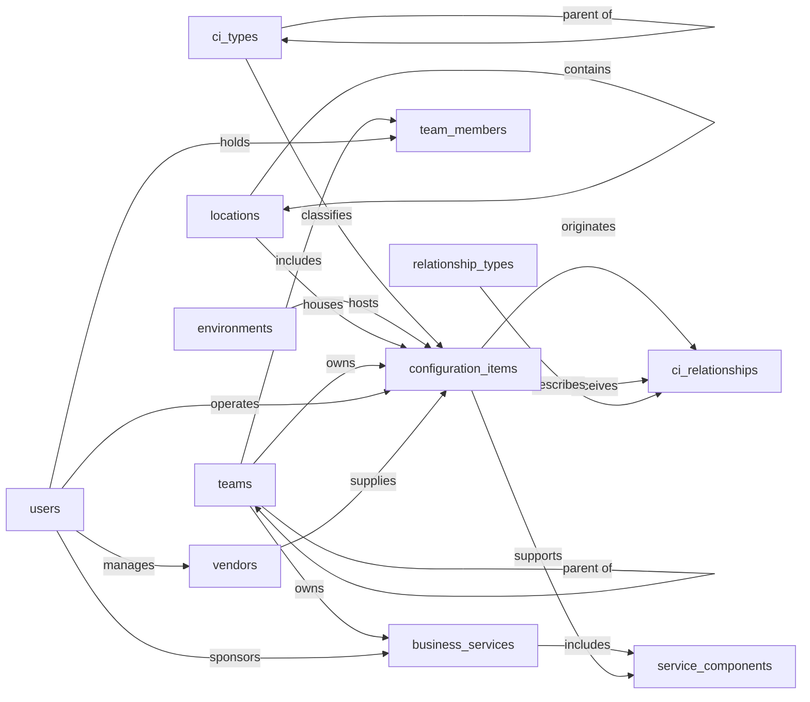

# CMDB, Semantic Model

## 1. Overview

A Configuration Management Database (CMDB) for an IT Operations team. The model catalogs every tracked thing in the IT estate (servers, applications, databases, network devices, services), classifies them by type, records typed directional relationships between them, and ties them to the business services they support, the environments they run in, the locations that house them, and the teams and vendors responsible for them. Scope is CMDB-proper: change requests, incidents, asset procurement, and software licensing are deliberately left to neighboring ITSM modules that can reference these CIs by foreign key.

## 2. Entity summary

| # | Table name | Singular label | Purpose |
|---|---|---|---|
| 1 | `configuration_items` | Configuration Item | Any tracked thing in the IT estate (server, app, database, network device, service) |
| 2 | `ci_types` | CI Type | Classification of CIs (Server, Application, Database, NetworkDevice), with parent/child hierarchy |
| 3 | `relationship_types` | Relationship Type | Catalog of allowed link verbs (`depends_on`, `hosts`, `runs_on`, `part_of`, `connects_to`) |
| 4 | `ci_relationships` | CI Relationship | Typed directional link between two CIs (source to target) |
| 5 | `business_services` | Business Service | A logical service offered to the business that one or more CIs support |
| 6 | `service_components` | Service Component | M:N junction recording which CIs make up a business service |
| 7 | `environments` | Environment | Lifecycle context (Production, Staging, Dev, QA, DR) |
| 8 | `locations` | Location | Physical site, datacenter, region, or cloud region (hierarchical) |
| 9 | `teams` | Team | Support or ownership group responsible for CIs and services |
| 10 | `vendors` | Vendor | Hardware, software, or service provider that supplies CIs |
| 11 | `users` | User | Operators, CI owners, and team members (deduplicated against the Semantius built-in `users` table at deploy-time) |
| 12 | `team_members` | Team Member | M:N junction linking users to the teams they belong to, with role |

### Entity-relationship diagram

## 3. Entities

### 3.1 `configuration_items` — Configuration Item

**Plural label:** Configuration Items
**Label column:** `ci_name`
**Audit log:** yes  _(CIs are subject to compliance review; INSERT/UPDATE/DELETE history matters)_
**Description:** A single tracked thing in the IT estate. Created when a CI is first provisioned, ordered, or discovered by a scanner; retired through `lifecycle_state` rather than deletion so links from incidents and changes remain resolvable.

**Fields**

| Field name | Format | Required | Label | Reference / Notes |
|---|---|---|---|---|
| `ci_name` | `string` | yes | CI Name | label_column; the display name (e.g. `prod-web-01`, `Salesforce Production`) |
| `ci_code` | `string` | yes | Asset Tag | unique; external asset-tag or stable identifier |
| `ci_type_id` | `reference` | yes | Type | → `ci_types` (N:1, restrict), `relationship_label: "classifies"` |
| `environment_id` | `reference` | no | Environment | → `environments` (N:1, clear), `relationship_label: "hosts"` |
| `location_id` | `reference` | no | Location | → `locations` (N:1, clear), `relationship_label: "houses"` |
| `owner_team_id` | `reference` | no | Owner Team | → `teams` (N:1, clear), `relationship_label: "owns"` |
| `technical_owner_user_id` | `reference` | no | Technical Owner | → `users` (N:1, clear), `relationship_label: "operates"` |
| `vendor_id` | `reference` | no | Vendor | → `vendors` (N:1, clear), `relationship_label: "supplies"` |
| `lifecycle_state` | `enum` | yes | Lifecycle State | values: `planned`, `ordered`, `in_stock`, `deployed`, `in_use`, `in_maintenance`, `retired`, `decommissioned`. default: `in_use` (most discovered or imported CIs are already running; auto-default `planned` would be wrong) |
| `operational_status` | `enum` | yes | Operational Status | values: `operational`, `degraded`, `non_operational`, `unknown`. default: `operational` (auto-default `operational` is the same as the override here, but stated explicitly to lock in intent) |
| `description` | `text` | no | Description | searchable |
| `hostname` | `string` | no | Hostname | DNS or short hostname; promoted out of `attributes` because most CI types use it |
| `ip_address` | `string` | no | IP Address | primary IPv4 or IPv6; additional IPs go in `attributes` |
| `serial_number` | `string` | no | Serial Number | hardware serial or cloud instance ID |
| `attributes` | `json` | no | Type-Specific Attributes | bag for type-specific data (CPU count, version, region, license key) |
| `first_discovered_at` | `date-time` | no | First Discovered | when this CI first appeared in any source |
| `last_verified_at` | `date-time` | no | Last Verified | last time a discovery source confirmed this CI exists |

**Relationships**

- A `configuration_item` belongs to one `ci_type` (N:1, required, restrict on delete).
- A `configuration_item` may run in one `environment`, sit in one `location`, be owned by one `team`, be operated by one `user`, and be supplied by one `vendor` (all N:1, optional, clear on delete).
- A `configuration_item` may participate in many `ci_relationships` as either source or target (1:N).
- A `configuration_item` ↔ `business_service` is many-to-many through the `service_components` junction.

---

### 3.2 `ci_types` — CI Type

**Plural label:** CI Types
**Label column:** `type_name`
**Audit log:** no
**Description:** A classification node for configuration items. Self-referencing parent supports a hierarchy (e.g. `Server` → `Virtual Server` → `Container Host`).

**Fields**

| Field name | Format | Required | Label | Reference / Notes |
|---|---|---|---|---|
| `type_name` | `string` | yes | Type Name | label_column (e.g. `Virtual Server`, `Web Application`) |
| `type_code` | `string` | yes | Type Code | unique; short snake_case (e.g. `virtual_server`) |
| `parent_type_id` | `reference` | no | Parent Type | → `ci_types` (N:1, clear, self-ref), `relationship_label: "parent of"` |
| `description` | `text` | no | Description | what kinds of CIs belong to this type |
| `icon_url` | `url` | no | Icon | icon for this type in the UI |
| `is_active` | `boolean` | yes | Active | default: `true` (auto-default `false` would hide every new type by mistake) |

**Relationships**

- A `ci_type` may be the parent of many other `ci_types` (1:N self-reference, optional, clear on delete).
- A `ci_type` may classify many `configuration_items` (1:N, restrict on delete to prevent orphaning live CIs).

---

### 3.3 `relationship_types` — Relationship Type

**Plural label:** Relationship Types
**Label column:** `relationship_name`
**Audit log:** no
**Description:** Catalog of allowed verbs that can link two CIs. Lets the operator team curate the set of relationship semantics centrally.

**Fields**

| Field name | Format | Required | Label | Reference / Notes |
|---|---|---|---|---|
| `relationship_name` | `string` | yes | Relationship Name | label_column (e.g. `Depends On`) |
| `relationship_code` | `string` | yes | Relationship Code | unique; the verb (e.g. `depends_on`, `hosts`, `runs_on`, `part_of`, `connects_to`) |
| `inverse_name` | `string` | no | Inverse Name | the inverse verb shown when traversing the link the other way (e.g. `Depends On` ↔ `Supports`) |
| `description` | `text` | no | Description | when to use this relationship |
| `is_active` | `boolean` | yes | Active | default: `true` |

**Relationships**

- A `relationship_type` may describe many `ci_relationships` (1:N, restrict on delete).

---

### 3.4 `ci_relationships` — CI Relationship

**Plural label:** CI Relationships
**Label column:** `relationship_label_text`
**Audit log:** yes  _(relationship topology is dispute-prone and worth a change history)_
**Description:** A typed directional link between two configuration items. The shape `(source, type, target)` with optional criticality lets the model capture impact-analysis topology (which CIs depend on which) without committing to graph storage.

**Fields**

| Field name | Format | Required | Label | Reference / Notes |
|---|---|---|---|---|
| `relationship_label_text` | `string` | yes | Display | label_column; the **caller populates** this on insert as `"{source.ci_name} {relationship_code} {target.ci_name}"` (junction tables need a dedicated string label, not a FK) |
| `source_ci_id` | `reference` | yes | Source CI | → `configuration_items` (N:1, restrict), `relationship_label: "originates"` |
| `target_ci_id` | `reference` | yes | Target CI | → `configuration_items` (N:1, restrict), `relationship_label: "receives"` |
| `relationship_type_id` | `reference` | yes | Type | → `relationship_types` (N:1, restrict), `relationship_label: "describes"` |
| `criticality` | `enum` | yes | Criticality | values: `low`, `medium`, `high`, `critical`. default: `medium` |
| `description` | `text` | no | Description | optional context for this specific link |
| `last_verified_at` | `date-time` | no | Last Verified | when this relationship was last confirmed by a discovery scan or human review |

**Relationships**

- A `ci_relationship` references one source `configuration_item` and one target `configuration_item` (both N:1, required, restrict on delete so live links cannot be orphaned).
- A `ci_relationship` is described by one `relationship_type` (N:1, required, restrict on delete).

---

### 3.5 `business_services` — Business Service

**Plural label:** Business Services
**Label column:** `service_name`
**Audit log:** yes  _(service definitions inform SLAs and incident scope; history matters)_
**Description:** A logical service the IT estate delivers to the business (e.g. `Customer Portal`, `Payroll`, `Internal Email`). One business service is supported by many configuration items via the `service_components` junction.

**Fields**

| Field name | Format | Required | Label | Reference / Notes |
|---|---|---|---|---|
| `service_name` | `string` | yes | Service Name | label_column |
| `service_code` | `string` | yes | Service Code | unique |
| `description` | `text` | no | Description | searchable |
| `service_owner_team_id` | `reference` | no | Owner Team | → `teams` (N:1, clear), `relationship_label: "owns"` |
| `business_owner_user_id` | `reference` | no | Business Sponsor | → `users` (N:1, clear), `relationship_label: "sponsors"` |
| `criticality` | `enum` | yes | Criticality | values: `low`, `medium`, `high`, `mission_critical`. default: `medium` |
| `service_status` | `enum` | yes | Service Status | values: `planning`, `active`, `deprecated`, `retired`. default: `active` (most services in a CMDB are live; auto-default `planning` would be wrong) |
| `sla_tier` | `enum` | no | SLA Tier | values: `bronze`, `silver`, `gold`, `platinum` |

**Relationships**

- A `business_service` may be owned by one `team` and sponsored by one `user` (both N:1, optional, clear on delete).
- A `business_service` ↔ `configuration_item` is many-to-many through the `service_components` junction.

---

### 3.6 `service_components` — Service Component

**Plural label:** Service Components
**Label column:** `component_label`
**Audit log:** no
**Description:** Junction recording that a configuration item contributes to a business service, with a role qualifier so the same CI can be `primary` in one service and `dependency` in another.

**Fields**

| Field name | Format | Required | Label | Reference / Notes |
|---|---|---|---|---|
| `component_label` | `string` | yes | Display | label_column; **caller populates** as `"{service.service_name} / {ci.ci_name}"` |
| `business_service_id` | `parent` | yes | Business Service | ↳ `business_services` (N:1, cascade), `relationship_label: "includes"` |
| `configuration_item_id` | `parent` | yes | CI | ↳ `configuration_items` (N:1, cascade), `relationship_label: "supports"` |
| `component_role` | `enum` | yes | Component Role | values: `primary`, `secondary`, `dependency`, `redundant`. default: `primary` |

**Relationships**

- A `service_component` belongs to one `business_service` and one `configuration_item` (both N:1, required, cascade on delete; deleting either parent removes the junction row).

---

### 3.7 `environments` — Environment

**Plural label:** Environments
**Label column:** `environment_name`
**Audit log:** no
**Description:** Lifecycle context for a CI. Drives change-control rules and reporting (e.g. only `is_production = true` environments require change approval).

**Fields**

| Field name | Format | Required | Label | Reference / Notes |
|---|---|---|---|---|
| `environment_name` | `string` | yes | Environment Name | label_column |
| `environment_code` | `string` | yes | Environment Code | unique (e.g. `PROD`, `STG`, `DEV`, `QA`, `DR`) |
| `description` | `text` | no | Description | |
| `is_production` | `boolean` | yes | Production | true if this environment counts as production for change-control purposes |
| `environment_order` | `integer` | yes | Sort Order | for promotion-order sorting (e.g. DEV=1, QA=2, STG=3, PROD=4) |

**Relationships**

- An `environment` may host many `configuration_items` (1:N, optional from the CI side, clear on delete).

---

### 3.8 `locations` — Location

**Plural label:** Locations
**Label column:** `location_name`
**Audit log:** no
**Description:** A physical site, datacenter, office, or cloud region where CIs live. Self-referencing parent supports nesting (e.g. region contains datacenter contains rack room).

**Fields**

| Field name | Format | Required | Label | Reference / Notes |
|---|---|---|---|---|
| `location_name` | `string` | yes | Location Name | label_column |
| `location_code` | `string` | yes | Location Code | unique |
| `location_type` | `enum` | yes | Location Type | values: `datacenter`, `office`, `cloud_region`, `colocation`, `remote_site`. default: `datacenter` |
| `parent_location_id` | `reference` | no | Parent Location | → `locations` (N:1, clear, self-ref), `relationship_label: "contains"` |
| `address_line` | `string` | no | Address | street address |
| `city` | `string` | no | City | |
| `region` | `string` | no | Region or State | |
| `country` | `string` | no | Country | ISO 3166-1 alpha-2 (e.g. `US`, `DE`) |
| `timezone` | `string` | no | Timezone | IANA timezone (e.g. `Europe/Berlin`) |

**Relationships**

- A `location` may be the parent of many other `locations` (1:N self-reference, optional, clear on delete).
- A `location` may house many `configuration_items` (1:N, optional from the CI side, clear on delete).

---

### 3.9 `teams` — Team

**Plural label:** Teams
**Label column:** `team_name`
**Audit log:** no
**Description:** A support or ownership group. Hierarchical via `parent_team_id` so org-chart roll-ups work. Members are recorded in the `team_members` junction; the team lead is identified by `role_in_team = lead` on a membership row rather than a direct FK on the team, to avoid the redundancy of two sources of truth.

**Fields**

| Field name | Format | Required | Label | Reference / Notes |
|---|---|---|---|---|
| `team_name` | `string` | yes | Team Name | label_column |
| `team_code` | `string` | yes | Team Code | unique |
| `description` | `text` | no | Description | |
| `parent_team_id` | `reference` | no | Parent Team | → `teams` (N:1, clear, self-ref), `relationship_label: "parent of"` |
| `email_alias` | `email` | no | Team Email | distribution list or ticket-routing alias |

**Relationships**

- A `team` may be the parent of many other `teams` (1:N self-reference, optional, clear on delete).
- A `team` may own many `configuration_items` and many `business_services` (1:N each, optional from the child side).
- A `team` ↔ `user` is many-to-many through the `team_members` junction.

---

### 3.10 `vendors` — Vendor

**Plural label:** Vendors
**Label column:** `vendor_name`
**Audit log:** yes
**Description:** A hardware, software, SaaS, services, cloud, or telecom provider. Many CIs reference a vendor; a vendor can have an internal account-manager user assigned.

**Fields**

| Field name | Format | Required | Label | Reference / Notes |
|---|---|---|---|---|
| `vendor_name` | `string` | yes | Vendor Name | label_column |
| `vendor_code` | `string` | yes | Vendor Code | unique |
| `vendor_type` | `enum` | yes | Vendor Type | values: `hardware`, `software`, `saas`, `services`, `cloud_provider`, `telecom`, `other`. default: `software` |
| `description` | `text` | no | Description | |
| `website` | `url` | no | Website | |
| `support_email` | `email` | no | Support Email | |
| `support_phone` | `string` | no | Support Phone | |
| `account_manager_user_id` | `reference` | no | Account Manager | → `users` (N:1, clear), `relationship_label: "manages"` |
| `vendor_status` | `enum` | yes | Vendor Status | values: `active`, `inactive`, `under_review`, `blacklisted`. default: `active` |

**Relationships**

- A `vendor` may supply many `configuration_items` (1:N, optional from the CI side, clear on delete).
- A `vendor` may be managed by one `user` as the internal account manager (N:1, optional, clear on delete).

---

### 3.11 `users` — User

**Plural label:** Users
**Label column:** `full_name`
**Audit log:** no
**Description:** A person known to the CMDB: operators, CI technical owners, business sponsors, vendor account managers, and team members. Self-contained per the modeling rules. The deployer is expected to deduplicate this entity against Semantius's built-in `users` table at deploy-time and reuse the built-in (only adding fields the built-in does not already cover).

**Fields**

| Field name | Format | Required | Label | Reference / Notes |
|---|---|---|---|---|
| `full_name` | `string` | yes | Full Name | label_column |
| `email` | `email` | yes | Email | unique |
| `job_title` | `string` | no | Job Title | |
| `user_status` | `enum` | yes | User Status | values: `active`, `inactive`, `suspended`. default: `active` |
| `timezone` | `string` | no | Timezone | IANA timezone |

**Relationships**

- A `user` may be the technical owner of many `configuration_items`, the business sponsor of many `business_services`, and the account manager of many `vendors` (each 1:N, optional from the child side).
- A `user` ↔ `team` is many-to-many through the `team_members` junction.

---

### 3.12 `team_members` — Team Member

**Plural label:** Team Members
**Label column:** `member_label`
**Audit log:** no
**Description:** Junction recording that a user is a member of a team, with a role qualifier (`member`, `lead`, `deputy`, `oncall`). Replaces a direct `team_lead_user_id` FK on `teams` to avoid two sources of truth.

**Fields**

| Field name | Format | Required | Label | Reference / Notes |
|---|---|---|---|---|
| `member_label` | `string` | yes | Display | label_column; **caller populates** as `"{user.full_name} - {team.team_name}"` |
| `team_id` | `parent` | yes | Team | ↳ `teams` (N:1, cascade), `relationship_label: "includes"` |
| `user_id` | `parent` | yes | User | ↳ `users` (N:1, cascade), `relationship_label: "holds"` |
| `role_in_team` | `enum` | yes | Role in Team | values: `member`, `lead`, `deputy`, `oncall`. default: `member` |
| `joined_at` | `date` | no | Joined | when the user joined the team |

**Relationships**

- A `team_member` belongs to one `team` and one `user` (both N:1, required, cascade on delete).

## 4. Relationship summary

| From | Field | To | Cardinality | Kind | Delete behavior |
|---|---|---|---|---|---|
| `configuration_items` | `ci_type_id` | `ci_types` | N:1 | reference | restrict |
| `configuration_items` | `environment_id` | `environments` | N:1 | reference | clear |
| `configuration_items` | `location_id` | `locations` | N:1 | reference | clear |
| `configuration_items` | `owner_team_id` | `teams` | N:1 | reference | clear |
| `configuration_items` | `technical_owner_user_id` | `users` | N:1 | reference | clear |
| `configuration_items` | `vendor_id` | `vendors` | N:1 | reference | clear |
| `ci_types` | `parent_type_id` | `ci_types` | N:1 | reference | clear |
| `ci_relationships` | `source_ci_id` | `configuration_items` | N:1 | reference | restrict |
| `ci_relationships` | `target_ci_id` | `configuration_items` | N:1 | reference | restrict |
| `ci_relationships` | `relationship_type_id` | `relationship_types` | N:1 | reference | restrict |
| `service_components` | `business_service_id` | `business_services` | N:1 | parent | cascade |
| `service_components` | `configuration_item_id` | `configuration_items` | N:1 | parent | cascade |
| `business_services` | `service_owner_team_id` | `teams` | N:1 | reference | clear |
| `business_services` | `business_owner_user_id` | `users` | N:1 | reference | clear |
| `locations` | `parent_location_id` | `locations` | N:1 | reference | clear |
| `teams` | `parent_team_id` | `teams` | N:1 | reference | clear |
| `vendors` | `account_manager_user_id` | `users` | N:1 | reference | clear |
| `team_members` | `team_id` | `teams` | N:1 | parent | cascade |
| `team_members` | `user_id` | `users` | N:1 | parent | cascade |

M:N relationships expressed via junctions:
- `business_services` ↔ `configuration_items` via `service_components`
- `teams` ↔ `users` via `team_members`
- `configuration_items` ↔ `configuration_items` via `ci_relationships` (typed self-graph)

## 5. Enumerations

### 5.1 `configuration_items.lifecycle_state`
- `planned`
- `ordered`
- `in_stock`
- `deployed`
- `in_use`
- `in_maintenance`
- `retired`
- `decommissioned`

### 5.2 `configuration_items.operational_status`
- `operational`
- `degraded`
- `non_operational`
- `unknown`

### 5.3 `ci_relationships.criticality`
- `low`
- `medium`
- `high`
- `critical`

### 5.4 `business_services.criticality`
- `low`
- `medium`
- `high`
- `mission_critical`

### 5.5 `business_services.service_status`
- `planning`
- `active`
- `deprecated`
- `retired`

### 5.6 `business_services.sla_tier`
- `bronze`
- `silver`
- `gold`
- `platinum`

### 5.7 `service_components.component_role`
- `primary`
- `secondary`
- `dependency`
- `redundant`

### 5.8 `locations.location_type`
- `datacenter`
- `office`
- `cloud_region`
- `colocation`
- `remote_site`

### 5.9 `vendors.vendor_type`
- `hardware`
- `software`
- `saas`
- `services`
- `cloud_provider`
- `telecom`
- `other`

### 5.10 `vendors.vendor_status`
- `active`
- `inactive`
- `under_review`
- `blacklisted`

### 5.11 `team_members.role_in_team`
- `member`
- `lead`
- `deputy`
- `oncall`

### 5.12 `users.user_status`
- `active`
- `inactive`
- `suspended`

## 6. Open questions

### 6.1 🔴 Decisions needed (blockers)

None.

### 6.2 🟡 Future considerations (deferred scope)

- Should `configuration_items.attributes` (currently a free-form JSON bag) be promoted to a normalized `ci_type_attribute_definitions` plus `ci_attribute_values` model so type-specific attributes can be queried, validated, and indexed? Trigger: when operators routinely filter or report on attribute values across CIs of the same type.
- Should a `discovery_sources` entity be added to record which scanner, agent, or import job contributed each CI and each relationship? Trigger: when more than one discovery source feeds the CMDB and conflicts must be reconciled.
- Should `vendor_type` and `location_type` be promoted from enums to lookup tables once the value sets need to evolve frequently or carry their own metadata (icons, default settings)? (`relationship_types` is already a lookup table per §3.3.)
- Should `team_members` carry `left_at` (and a status) so historical membership can be audited, instead of being deleted on offboarding? Trigger: when HR or compliance needs an audit trail of who was on which team and when.
- Should `ci_relationships.criticality` be promoted from a four-value enum to a numeric blast-radius score (e.g. 1 to 5 or 1 to 100) for quantitative impact analysis? Trigger: when impact-analysis tooling needs ordinal arithmetic over criticality values.
- Should `configuration_items.hostname` and `configuration_items.ip_address` be made unique (perhaps scoped by `environment_id`)? Today only `ci_code` is unique; duplicates on hostname or IP are allowed. Trigger: when discovery-source dedup needs uniqueness enforcement at the DB level.

## 7. Implementation notes for the downstream agent

A short checklist for the agent who will materialize this model in Semantius:

1. Create one module named `cmdb` (matches the front-matter `system_slug` exactly) and two baseline permissions, `cmdb:read` and `cmdb:manage`, before any entity.
2. Create entities in the order given in §2. The lookup-style entities (`ci_types`, `relationship_types`, `environments`, `locations`, `teams`, `vendors`, `users`) should be created before the entities that reference them. `ci_relationships`, `service_components`, and `team_members` come last because they reference earlier entities on both sides.
3. For each entity: set `label_column` to the snake_case field marked as label_column in §3, pass `module_id`, `view_permission: "cmdb:read"`, `edit_permission: "cmdb:manage"`. Do not manually create `id`, `created_at`, `updated_at`, or the auto-generated label field. Set `audit_log: true` on `configuration_items`, `ci_relationships`, `business_services`, and `vendors` as called out in their §3 sub-sections.
4. For each field in §3: pass `table_name`, `field_name`, `format`, `title` (the Label column), and for `reference` and `parent` fields also `reference_table`, `reference_delete_mode` consistent with §4, and `relationship_label` (the verb annotated in the Notes column). For required enum fields, set `default_value` explicitly when the §3 row specifies a default that differs from the auto-default of `enum_values[0]`.
5. **Fix up each entity's auto-created label-column field title.** `create_entity` auto-creates a field whose `field_name` equals the entity's `label_column` and whose `title` defaults to `singular_label`. Many entities in this model have a label_column whose §3 Label is more specific than the entity's `singular_label` (for example, entity `configuration_items` with `singular_label: "Configuration Item"` and `label_column: "ci_name"` yields an auto-field `configuration_items.ci_name` with title `"Configuration Item"`; the §3 Label is `"CI Name"`). For every such case, follow up with `update_field` to set the correct title. The `update_field` `id` is the **composite string** `"{table_name}.{field_name}"` (e.g. `"configuration_items.ci_name"`, `"ci_types.type_name"`, `"vendors.vendor_name"`); pass it as a string, not an integer, or the update will fail. Apply the fixup to: `configuration_items.ci_name` (`CI Name`), `ci_types.type_name` (`Type Name`), `relationship_types.relationship_name` (`Relationship Name`), `ci_relationships.relationship_label_text` (`Display`), `business_services.service_name` (`Service Name`), `service_components.component_label` (`Display`), `environments.environment_name` (`Environment Name`), `locations.location_name` (`Location Name`), `teams.team_name` (`Team Name`), `vendors.vendor_name` (`Vendor Name`), `users.full_name` (`Full Name`), `team_members.member_label` (`Display`).
6. **Deduplicate against Semantius built-in tables.** This model is self-contained and declares `users`, which already exists as a Semantius built-in. Read Semantius first: if the built-in `users` table covers the fields in §3.11, skip the `create_entity` call and reuse the built-in as the `reference_table` target for every FK that points to `users`. If any §3.11 fields are missing on the built-in (e.g. `job_title`, `timezone`), add them additively with `create_field` against the built-in `users` table only if the model genuinely requires them.
7. After creation, spot-check that `label_column` on each entity resolves to a real field, that all `reference_table` targets exist, and that the `relationship_label` on every FK matches §3 byte-for-byte.

## 8. Related domains

This model declares the sibling modules CMDB participates in so the deployer can reconcile foreign keys, exposed entities, and master-data ownership across modules at deploy-time. Slugs match each sibling's `system_slug`. If a sibling is not deployed, its contract is dormant and triggers no action.

### 8.1 `itsm` (peer)

ITSM (incident, problem, change management) is a downstream consumer of CMDB topology.

- **Exposes:** `configuration_items`, `business_services`. ITSM records FK back to these so tickets resolve to live CIs and to the services they affect.
- **Expects on sibling:** when `itsm` is deployed, FKs of the shape `itsm.incidents.affected_ci_id`, `itsm.problems.root_cause_ci_id`, and `itsm.change_requests.affected_ci_id`, all pointing at `cmdb.configuration_items` with `reference_delete_mode: restrict` so an open ticket cannot orphan a CI.
- **Defers to sibling:** none.

### 8.2 `software_asset_management` (peer)

SAM tracks installed software products and license entitlements; it consumes CMDB host inventory.

- **Exposes:** `configuration_items`, `vendors`.
- **Expects on sibling:** when `software_asset_management` is deployed, `software_asset_management.software_installs.host_ci_id` points at `cmdb.configuration_items`, and `software_asset_management.software_licenses.vendor_id` points at `cmdb.vendors`.
- **Defers to sibling:** none. The §6.2 deferred-scope note about adding `software_installs` and `software_licenses` directly to this CMDB is superseded by this contract: SAM owns those entities, CMDB exposes the inventory they reference.

### 8.3 `itam` (peer)

ITAM (IT Asset Management) tracks hardware-asset lifecycle (procurement, depreciation, disposal, warranty) and is distinct from CMDB's operational topology view. When both are deployed, ITAM hardware records and CMDB CIs typically pair 1:1 for physical assets while CIs that aren't physical (logical apps, business services, cloud-tenant CIs) have no ITAM counterpart.

- **Exposes:** `configuration_items`, `vendors`. ITAM links its hardware records to the operating CI and to the supplying vendor.
- **Expects on sibling:** when `itam` is deployed, `itam.hardware_assets.ci_id` points at `cmdb.configuration_items` with `reference_delete_mode: clear` (an asset can outlive its operational CI in the asset register), and `itam.hardware_assets.vendor_id` points at `cmdb.vendors`.
- **Defers to sibling:** none. If the org decides ITAM owns the canonical asset master, a future iteration may flip this to defer hardware-style CIs to ITAM; for now CMDB stays operational-topology-canonical.

### 8.4 `monitoring` (peer)

Monitoring (alerting, observability, synthetic checks) consumes CMDB topology so that alerts and checks resolve to live CIs and so that incident runbooks know which team owns the affected service.

- **Exposes:** `configuration_items`, `business_services`.
- **Expects on sibling:** when `monitoring` is deployed, FKs of the shape `monitoring.checks.target_ci_id`, `monitoring.alerts.affected_ci_id`, and (optionally) `monitoring.alerts.affected_service_id` pointing at `cmdb.configuration_items` and `cmdb.business_services` with `reference_delete_mode: restrict` so an active alert cannot orphan its target.
- **Defers to sibling:** none.

### 8.5 `vendor_management` (upstream master)

When a dedicated vendor management module is deployed, it owns the canonical vendor master and the CMDB-local `vendors` entity is deduplicated against it.

- **Exposes:** none.
- **Expects on sibling:** none.
- **Defers to sibling:** `vendors`. At deploy-time, if `vendor_management.vendors` exists, skip the `create_entity` for the local `vendors` (the same dedup pattern §7 step 6 applies to `users`) and rewire `configuration_items.vendor_id` and any other vendor FKs to the sibling's table. CMDB-specific fields not present on the sibling's `vendors` are added additively with `create_field`.

### 8.6 `identity_and_access` (upstream master)

When an identity and access management module is deployed, it owns canonical user and team rosters.

- **Exposes:** none.
- **Expects on sibling:** none.
- **Defers to sibling:** `users` and `teams`. The `users` defer is already called out in §7 step 6 and applies whether the sibling is `identity_and_access` or the Semantius built-in `users` table. `teams` follows the same pattern: if `identity_and_access.teams` exists, skip creating the local `teams` entity, rewire the team FKs (`configuration_items.owner_team_id`, `business_services.service_owner_team_id`, `team_members.team_id`), and add any CMDB-specific team fields additively.
