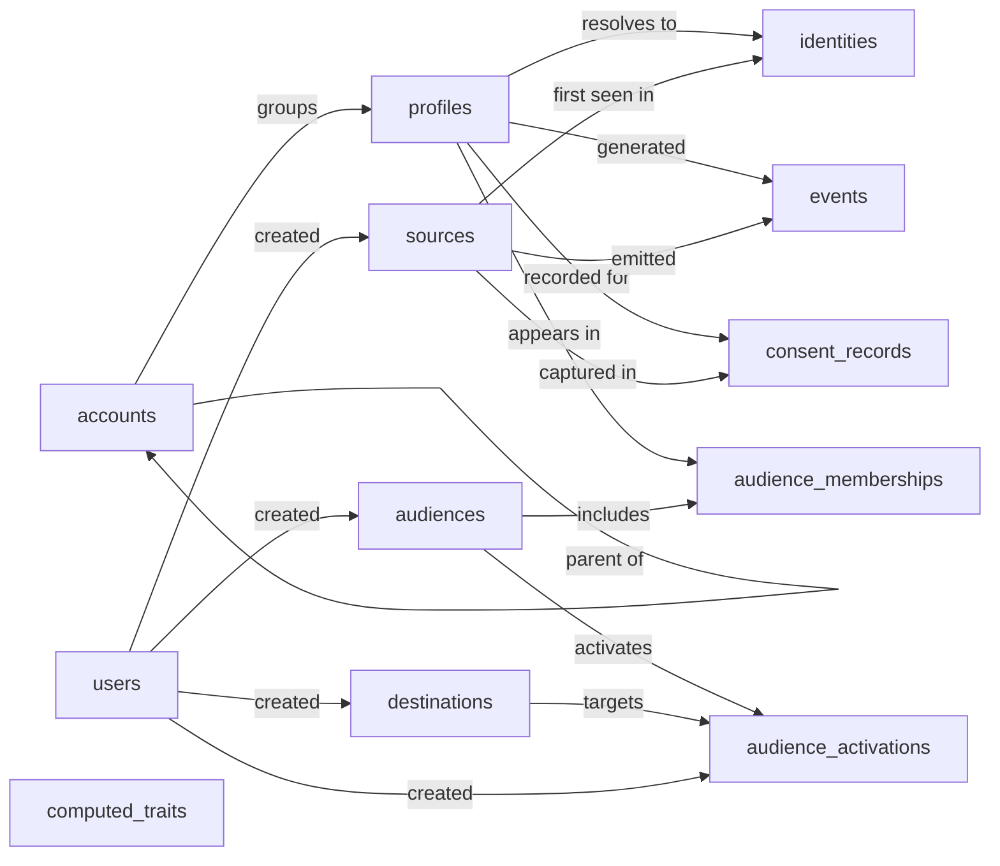

# Customer Data Platform — Semantic Model

## 1. Overview

A Customer Data Platform (CDP) ingests behavioral and attribute data about customers from many inbound sources, resolves multiple identifiers to a single unified `profile`, organises profiles into rule-based `audiences`, and activates those audiences out to downstream `destinations` (ads, email, warehouse). Operators (`users`) configure sources, audiences, computed traits, and activations; profile consent state per purpose is tracked separately for compliance. Volumes are skewed: events and identities are high-throughput; profiles, audiences, and configuration entities are low-cardinality and edited deliberately.

## 2. Entity summary

| # | Table name | Singular label | Purpose |
|---|---|---|---|
| 1 | `profiles` | Profile | The unified customer record (golden record), one row per resolved person |
| 2 | `identities` | Identity | Individual identifiers (email, device_id, anonymous_id, user_id) tied to a profile; the identity-resolution graph |
| 3 | `accounts` | Account | B2B company record; profiles can belong to one |
| 4 | `events` | Event | Behavioral events (track, page, screen, identify) ingested from sources |
| 5 | `computed_traits` | Computed Trait | Derived-trait *definitions* (lifetime_value, recency, etc.); values are written into `profiles.custom_traits` |
| 6 | `audiences` | Audience | Defined customer segments with rule logic |
| 7 | `audience_memberships` | Audience Membership | Junction: which profiles are currently in which audiences |
| 8 | `sources` | Source | Inbound data sources (web SDK, mobile SDK, server, CRM, ad platform) |
| 9 | `destinations` | Destination | Outbound activation targets (ads, email, warehouse, analytics) |
| 10 | `audience_activations` | Audience Activation | Junction: which audiences are pushed to which destinations |
| 11 | `consent_records` | Consent Record | Consent state per profile per purpose (marketing, analytics, etc.) |
| 12 | `users` | User | Internal CDP operators (admins, analysts) |

### Entity-relationship diagram

## 3. Entities

### 3.1 `profiles` — Profile

**Plural label:** Profiles
**Label column:** `profile_label`
**Audit log:** yes
**Description:** The unified customer record. One row per resolved person, populated by identity resolution across `identities`. Holds canonical attributes plus a flexible `custom_traits` JSON payload for declared and computed traits.

**Fields**

| Field name | Format | Required | Label | Reference / Notes |
|---|---|---|---|---|
| `profile_label` | `string` | yes | Profile Name | label_column; populated as best display name (full name, primary email fallback) |
| `first_name` | `string` | no | First Name | |
| `last_name` | `string` | no | Last Name | |
| `primary_email` | `email` | no | Primary Email | unique |
| `primary_phone` | `string` | no | Primary Phone | E.164 format |
| `account_id` | `reference` | no | Account | → `accounts` (N:1, clear), relationship_label: "groups" |
| `lifecycle_stage` | `enum` | yes | Lifecycle Stage | values: `anonymous`, `lead`, `prospect`, `customer`, `churned` |
| `first_seen_at` | `date-time` | no | First Seen At | |
| `last_seen_at` | `date-time` | no | Last Seen At | |
| `country` | `string` | no | Country | ISO 3166-1 alpha-2 |
| `timezone` | `string` | no | Timezone | IANA name (e.g. `Europe/Berlin`) |
| `locale` | `string` | no | Locale | BCP-47 |
| `custom_traits` | `json` | no | Custom Traits | flexible payload, including computed trait values |

**Relationships**

- A `profile` may belong to one `account` (N:1, optional, clear on delete).
- A `profile` has many `identities` (1:N, parent of identities, cascade).
- A `profile` has many `events` (1:N, via `events.profile_id`, clear on delete).
- A `profile` has many `consent_records` (1:N, parent of consent_records, cascade).
- `profile` ↔ `audience` is many-to-many through the `audience_memberships` junction.

---

### 3.2 `identities` — Identity

**Plural label:** Identities
**Label column:** `identity_label`
**Audit log:** no
**Description:** A single identifier (email, device_id, user_id, etc.) observed in an inbound source and tied to a `profile`. The collection of identities for a profile is the identity-resolution graph; the platform maintains it as new identifiers are observed.

**Fields**

| Field name | Format | Required | Label | Reference / Notes |
|---|---|---|---|---|
| `identity_label` | `string` | yes | Identity | label_column; populated as `"{identity_type}: {identity_value}"` |
| `identity_type` | `enum` | yes | Identity Type | values: `anonymous_id`, `user_id`, `email`, `phone`, `device_id`, `advertising_id`, `external_id` |
| `identity_value` | `string` | yes | Identity Value | the actual identifier string |
| `profile_id` | `parent` | yes | Profile | ↳ `profiles` (N:1, cascade), relationship_label: "resolves to" |
| `source_id` | `reference` | no | First Seen In Source | → `sources` (N:1, clear), relationship_label: "first seen in" |
| `first_seen_at` | `date-time` | no | First Seen At | |
| `last_seen_at` | `date-time` | no | Last Seen At | |
| `is_primary` | `boolean` | no | Is Primary | one primary per `identity_type` per profile |

**Relationships**

- An `identity` belongs to one `profile` (N:1, required, parent, cascade on delete).
- An `identity` may cite one `source` where it was first seen (N:1, optional, clear on delete).

---

### 3.3 `accounts` — Account

**Plural label:** Accounts
**Label column:** `account_name`
**Audit log:** yes
**Description:** A B2B company record. Profiles can belong to an account; accounts can themselves nest under a parent account (e.g. subsidiary → parent).

**Fields**

| Field name | Format | Required | Label | Reference / Notes |
|---|---|---|---|---|
| `account_name` | `string` | yes | Account Name | label_column |
| `domain` | `string` | no | Primary Domain | |
| `industry` | `string` | no | Industry | |
| `employee_count` | `integer` | no | Employee Count | |
| `annual_revenue` | `number` | no | Annual Revenue | precision: 2 |
| `country` | `string` | no | Country | ISO 3166-1 alpha-2 |
| `lifecycle_stage` | `enum` | yes | Lifecycle Stage | values: `prospect`, `customer`, `churned` |
| `parent_account_id` | `reference` | no | Parent Account | → `accounts` (N:1, self-reference, clear), relationship_label: "parent of" |

**Relationships**

- An `account` may have one parent `account` (N:1, self-reference, optional, clear on delete).
- An `account` may have many child `accounts` (1:N, via `accounts.parent_account_id`).
- An `account` has many `profiles` (1:N, via `profiles.account_id`).

---

### 3.4 `events` — Event

**Plural label:** Events
**Label column:** `event_name`
**Audit log:** no
**Description:** A single behavioral event ingested from a source. The dominant high-volume entity in the platform. Events may arrive before identity resolution, in which case `profile_id` is null and `anonymous_id` carries the client identifier until resolution catches up.

**Fields**

| Field name | Format | Required | Label | Reference / Notes |
|---|---|---|---|---|
| `event_name` | `string` | yes | Event Name | label_column, e.g. `"Order Completed"` |
| `event_type` | `enum` | yes | Event Type | values: `track`, `page`, `screen`, `identify`, `group`, `alias` |
| `profile_id` | `reference` | no | Profile | → `profiles` (N:1, clear); null until identity resolution; relationship_label: "generated" |
| `anonymous_id` | `string` | no | Anonymous ID | pre-identification client ID |
| `source_id` | `reference` | yes | Source | → `sources` (N:1, restrict), relationship_label: "emitted" |
| `occurred_at` | `date-time` | yes | Occurred At | client timestamp |
| `received_at` | `date-time` | yes | Received At | server timestamp |
| `session_id` | `string` | no | Session ID | |
| `properties` | `json` | no | Properties | event payload |
| `context` | `json` | no | Context | device, OS, IP, user-agent |

**Relationships**

- An `event` is emitted by one `source` (N:1, required, restrict; sources cannot be deleted while events reference them).
- An `event` may resolve to one `profile` (N:1, optional, clear on delete).

---

### 3.5 `computed_traits` — Computed Trait

**Plural label:** Computed Traits
**Label column:** `trait_name`
**Audit log:** yes
**Description:** A *definition* of a derived attribute (e.g. `lifetime_value`, `days_since_last_purchase`). The platform evaluates the definition on the configured cadence and writes the resulting value into the matching profile's `custom_traits` JSON. This entity does not store per-profile values directly.

**Fields**

| Field name | Format | Required | Label | Reference / Notes |
|---|---|---|---|---|
| `trait_name` | `string` | yes | Trait Name | label_column; unique; e.g. `"lifetime_value"` |
| `display_label` | `string` | no | Display Label | human-friendly name |
| `description` | `text` | no | Description | |
| `data_type` | `enum` | yes | Data Type | values: `string`, `number`, `boolean`, `date`, `datetime`, `list` |
| `definition` | `text` | yes | Definition | SQL or rule expression |
| `compute_frequency` | `enum` | yes | Compute Frequency | values: `on_demand`, `realtime`, `hourly`, `daily`, `weekly`; default: "on_demand" |
| `last_computed_at` | `date-time` | no | Last Computed At | |
| `is_active` | `boolean` | yes | Is Active | |

**Relationships**

- `computed_traits` is a standalone definition table; it does not link to other entities. Computed values land in `profiles.custom_traits`.

---

### 3.6 `audiences` — Audience

**Plural label:** Audiences
**Label column:** `audience_name`
**Audit log:** yes
**Description:** A defined customer segment with rule logic. Membership is materialised in `audience_memberships`. An audience can be activated to one or more destinations via `audience_activations`.

**Fields**

| Field name | Format | Required | Label | Reference / Notes |
|---|---|---|---|---|
| `audience_name` | `string` | yes | Audience Name | label_column |
| `description` | `text` | no | Description | |
| `audience_type` | `enum` | yes | Audience Type | values: `rule_based`, `sql`, `lookalike`, `manual` |
| `definition` | `text` | yes | Definition | rule logic (JSON) or SQL |
| `status` | `enum` | yes | Status | values: `draft`, `active`, `paused`, `archived` |
| `profile_count` | `integer` | no | Profile Count | denormalized current size |
| `refresh_frequency` | `enum` | yes | Refresh Frequency | values: `on_demand`, `realtime`, `hourly`, `daily`; default: "on_demand" |
| `last_computed_at` | `date-time` | no | Last Computed At | |
| `created_by_user_id` | `reference` | no | Created By | → `users` (N:1, clear), relationship_label: "created" |

**Relationships**

- An `audience` was created by one `user` (N:1, optional, clear on delete).
- `audience` ↔ `profile` is many-to-many through the `audience_memberships` junction.
- `audience` ↔ `destination` is many-to-many through the `audience_activations` junction.

---

### 3.7 `audience_memberships` — Audience Membership

**Plural label:** Audience Memberships
**Label column:** `membership_label`
**Audit log:** no
**Description:** Junction recording which profiles are members of which audiences at a given time. High churn on realtime audiences. `is_active = false` and a populated `left_at` mean the profile has dropped out; the row is retained for history rather than deleted.

**Fields**

| Field name | Format | Required | Label | Reference / Notes |
|---|---|---|---|---|
| `membership_label` | `string` | yes | Membership | label_column; populated as `"{audience_name} / {profile_label}"` on create |
| `audience_id` | `parent` | yes | Audience | ↳ `audiences` (N:1, cascade), relationship_label: "includes" |
| `profile_id` | `parent` | yes | Profile | ↳ `profiles` (N:1, cascade), relationship_label: "appears in" |
| `joined_at` | `date-time` | yes | Joined At | |
| `left_at` | `date-time` | no | Left At | null while still a member |
| `is_active` | `boolean` | yes | Is Active | |

**Relationships**

- A `membership` belongs to one `audience` (N:1, required, parent, cascade on delete).
- A `membership` belongs to one `profile` (N:1, required, parent, cascade on delete).

---

### 3.8 `sources` — Source

**Plural label:** Sources
**Label column:** `source_name`
**Audit log:** yes
**Description:** An inbound data source, a configured channel through which events and identity data flow into the CDP. Each source has a `write_key` used by the SDK or server-side caller to authenticate ingestion.

**Fields**

| Field name | Format | Required | Label | Reference / Notes |
|---|---|---|---|---|
| `source_name` | `string` | yes | Source Name | label_column |
| `source_type` | `enum` | yes | Source Type | values: `web_sdk`, `mobile_sdk_ios`, `mobile_sdk_android`, `server`, `cloud_app`, `warehouse`, `file_upload`, `http_api` |
| `write_key` | `string` | yes | Write Key | unique; ingestion auth token |
| `description` | `text` | no | Description | |
| `is_active` | `boolean` | yes | Is Active | |
| `last_event_received_at` | `date-time` | no | Last Event Received | |
| `event_count` | `integer` | no | Event Count | denormalized |
| `created_by_user_id` | `reference` | no | Created By | → `users` (N:1, clear), relationship_label: "created" |

**Relationships**

- A `source` emits many `events` (1:N, via `events.source_id`, restrict).
- A `source` may have first seen many `identities` (1:N, via `identities.source_id`, clear).
- A `source` may have captured many `consent_records` (1:N, via `consent_records.source_id`, clear).
- A `source` may have been created by one `user` (N:1, optional, clear on delete).

---

### 3.9 `destinations` — Destination

**Plural label:** Destinations
**Label column:** `destination_name`
**Audit log:** yes
**Description:** An outbound activation target, a downstream tool that receives audience data from the CDP (ad platform, ESP, warehouse, etc.). Configuration is stored as JSON; secrets are managed by the platform's secret store, not in this entity.

**Fields**

| Field name | Format | Required | Label | Reference / Notes |
|---|---|---|---|---|
| `destination_name` | `string` | yes | Destination Name | label_column |
| `destination_type` | `enum` | yes | Destination Type | values: `advertising`, `email`, `sms`, `push`, `analytics`, `warehouse`, `crm`, `custom_webhook` |
| `vendor` | `string` | no | Vendor | e.g. `"Meta Ads"`, `"Salesforce"` |
| `configuration` | `json` | no | Configuration | non-secret connection settings |
| `is_active` | `boolean` | yes | Is Active | |
| `last_sync_at` | `date-time` | no | Last Sync At | |
| `sync_status` | `enum` | no | Sync Status | values: `idle`, `syncing`, `error` |
| `created_by_user_id` | `reference` | no | Created By | → `users` (N:1, clear), relationship_label: "created" |

**Relationships**

- `destination` ↔ `audience` is many-to-many through the `audience_activations` junction.
- A `destination` may have been created by one `user` (N:1, optional, clear on delete).

---

### 3.10 `audience_activations` — Audience Activation

**Plural label:** Audience Activations
**Label column:** `activation_label`
**Audit log:** yes
**Description:** Junction defining that a specific audience is being pushed to a specific destination on a specific cadence. Holds the field-mapping payload, sync mode, and last-sync state.

**Fields**

| Field name | Format | Required | Label | Reference / Notes |
|---|---|---|---|---|
| `activation_label` | `string` | yes | Activation | label_column; populated as `"{audience_name} → {destination_name}"` on create |
| `audience_id` | `parent` | yes | Audience | ↳ `audiences` (N:1, cascade), relationship_label: "activates" |
| `destination_id` | `parent` | yes | Destination | ↳ `destinations` (N:1, cascade), relationship_label: "targets" |
| `sync_mode` | `enum` | yes | Sync Mode | values: `incremental`, `full_resync`, `mirror`; default: "incremental" |
| `sync_frequency` | `enum` | yes | Sync Frequency | values: `on_demand`, `realtime`, `hourly`, `daily`; default: "on_demand" |
| `field_mappings` | `json` | no | Field Mappings | profile field → destination field |
| `is_active` | `boolean` | yes | Is Active | |
| `last_sync_at` | `date-time` | no | Last Sync At | |
| `last_sync_status` | `enum` | yes | Last Sync Status | values: `pending`, `success`, `partial`, `failed`; default: "pending" (correct state for a never-run activation) |
| `created_by_user_id` | `reference` | no | Created By | → `users` (N:1, clear), relationship_label: "created" |

**Relationships**

- An `activation` belongs to one `audience` (N:1, required, parent, cascade on delete).
- An `activation` belongs to one `destination` (N:1, required, parent, cascade on delete).
- An `activation` may have been created by one `user` (N:1, optional, clear on delete).

---

### 3.11 `consent_records` — Consent Record

**Plural label:** Consent Records
**Label column:** `consent_label`
**Audit log:** yes
**Description:** A consent state for a single profile, purpose, and (optionally) jurisdiction. New consent events do not overwrite, they append a new record so the full consent history is preserved for compliance audits.

**Fields**

| Field name | Format | Required | Label | Reference / Notes |
|---|---|---|---|---|
| `consent_label` | `string` | yes | Consent | label_column; populated as `"{profile_label} / {consent_purpose} / {status}"` on create |
| `profile_id` | `parent` | yes | Profile | ↳ `profiles` (N:1, cascade), relationship_label: "recorded for" |
| `consent_purpose` | `enum` | yes | Purpose | values: `marketing`, `analytics`, `advertising`, `personalization`, `sale_of_data`, `all` |
| `status` | `enum` | yes | Status | values: `unknown`, `granted`, `denied`, `withdrawn`; default: "unknown" (explicit consent must be set deliberately) |
| `source_id` | `reference` | no | Captured In Source | → `sources` (N:1, clear), relationship_label: "captured in" |
| `jurisdiction` | `string` | no | Jurisdiction | e.g. `GDPR-EU`, `CCPA-CA` |
| `granted_at` | `date-time` | no | Granted At | |
| `withdrawn_at` | `date-time` | no | Withdrawn At | |
| `expires_at` | `date-time` | no | Expires At | |
| `consent_text` | `text` | no | Consent Text | shown to user at capture time |

**Relationships**

- A `consent_record` belongs to one `profile` (N:1, required, parent, cascade on delete). Cascade is the deliberate default to support GDPR / CCPA right-to-be-forgotten: when a profile is forgotten, its consent rows are removed with it. Operators whose primary regime is retention-heavy (e.g. financial-services consent retention obligations) can override the FK to `restrict` at deploy time and adopt a soft-delete pattern on `profiles` instead.
- A `consent_record` may cite one `source` where it was captured (N:1, optional, clear on delete).

---

### 3.12 `users` — User

**Plural label:** Users
**Label column:** `user_name`
**Audit log:** yes
**Description:** An internal CDP operator (admin, analyst, marketer). Distinct from `profiles`, which are the customers tracked by the platform. The downstream deployer will deduplicate this against the Semantius built-in `users` table.

**Fields**

| Field name | Format | Required | Label | Reference / Notes |
|---|---|---|---|---|
| `user_name` | `string` | yes | Display Name | label_column |
| `email` | `email` | yes | Email | unique |
| `first_name` | `string` | no | First Name | |
| `last_name` | `string` | no | Last Name | |
| `is_active` | `boolean` | yes | Is Active | |
| `last_login_at` | `date-time` | no | Last Login At | |

**Relationships**

- A `user` may have created many `audiences` (1:N, via `audiences.created_by_user_id`).
- A `user` may have created many `sources` (1:N, via `sources.created_by_user_id`).
- A `user` may have created many `destinations` (1:N, via `destinations.created_by_user_id`).
- A `user` may have created many `audience_activations` (1:N, via `audience_activations.created_by_user_id`).
- Role assignments and permissions use the Semantius platform-native `roles` / `user_roles` mechanism — not modeled as custom entities here.

---

## 4. Relationship summary

| From | Field | To | Cardinality | Kind | Delete behavior |
|---|---|---|---|---|---|
| `profiles` | `account_id` | `accounts` | N:1 | reference | clear |
| `accounts` | `parent_account_id` | `accounts` | N:1 | reference | clear |
| `identities` | `profile_id` | `profiles` | N:1 | parent | cascade |
| `identities` | `source_id` | `sources` | N:1 | reference | clear |
| `events` | `profile_id` | `profiles` | N:1 | reference | clear |
| `events` | `source_id` | `sources` | N:1 | reference | restrict |
| `audience_memberships` | `audience_id` | `audiences` | N:1 | parent (junction) | cascade |
| `audience_memberships` | `profile_id` | `profiles` | N:1 | parent (junction) | cascade |
| `audience_activations` | `audience_id` | `audiences` | N:1 | parent (junction) | cascade |
| `audience_activations` | `destination_id` | `destinations` | N:1 | parent (junction) | cascade |
| `audience_activations` | `created_by_user_id` | `users` | N:1 | reference | clear |
| `audiences` | `created_by_user_id` | `users` | N:1 | reference | clear |
| `sources` | `created_by_user_id` | `users` | N:1 | reference | clear |
| `destinations` | `created_by_user_id` | `users` | N:1 | reference | clear |
| `consent_records` | `profile_id` | `profiles` | N:1 | parent | cascade |
| `consent_records` | `source_id` | `sources` | N:1 | reference | clear |

## 5. Enumerations

### 5.1 `profiles.lifecycle_stage`
- `anonymous`
- `lead`
- `prospect`
- `customer`
- `churned`

### 5.2 `accounts.lifecycle_stage`
- `prospect`
- `customer`
- `churned`

### 5.3 `identities.identity_type`
- `anonymous_id`
- `user_id`
- `email`
- `phone`
- `device_id`
- `advertising_id`
- `external_id`

### 5.4 `events.event_type`
- `track`
- `page`
- `screen`
- `identify`
- `group`
- `alias`

### 5.5 `computed_traits.data_type`
- `string`
- `number`
- `boolean`
- `date`
- `datetime`
- `list`

### 5.6 `computed_traits.compute_frequency`
- `on_demand`
- `realtime`
- `hourly`
- `daily`
- `weekly`

### 5.7 `audiences.audience_type`
- `rule_based`
- `sql`
- `lookalike`
- `manual`

### 5.8 `audiences.status`
- `draft`
- `active`
- `paused`
- `archived`

### 5.9 `audiences.refresh_frequency`
- `on_demand`
- `realtime`
- `hourly`
- `daily`

### 5.10 `sources.source_type`
- `web_sdk`
- `mobile_sdk_ios`
- `mobile_sdk_android`
- `server`
- `cloud_app`
- `warehouse`
- `file_upload`
- `http_api`

### 5.11 `destinations.destination_type`
- `advertising`
- `email`
- `sms`
- `push`
- `analytics`
- `warehouse`
- `crm`
- `custom_webhook`

### 5.12 `destinations.sync_status`
- `idle`
- `syncing`
- `error`

### 5.13 `audience_activations.sync_mode`
- `incremental`
- `full_resync`
- `mirror`

### 5.14 `audience_activations.sync_frequency`
- `on_demand`
- `realtime`
- `hourly`
- `daily`

### 5.15 `audience_activations.last_sync_status`
- `pending`
- `success`
- `partial`
- `failed`

### 5.16 `consent_records.consent_purpose`
- `marketing`
- `analytics`
- `advertising`
- `personalization`
- `sale_of_data`
- `all`

### 5.17 `consent_records.status`
- `unknown`
- `granted`
- `denied`
- `withdrawn`

## 6. Open questions

### 6.1 🔴 Decisions needed (blockers)

*None. All previously open questions have been resolved; see §6.3 for the resolution log.*

### 6.2 🟡 Future considerations (deferred scope)

- Should `computed_traits` values be stored in a dedicated `profile_trait_values` junction (profile_id, trait_id, value, computed_at) instead of inside `profiles.custom_traits` JSON? The JSON approach is simpler but limits per-trait history, time-series querying, and trait-level access control.
- Should `sessions` be modeled as a first-class entity, or stay derived from `events.session_id`? A dedicated entity helps if session-level metrics (duration, page count, exit page) become a primary product surface.
- Should `audiences.definition` evolve into a structured rule entity (predicate trees with their own table) once the rule complexity outgrows free-text JSON/SQL? Trade-off: structured rules enable a visual builder; free-text is faster to ship.
- Should `consent_records` track consent for *anonymous* identities (pre-profile resolution), and if so, how should those records re-attach to the resolved profile after identification?
- Should `accounts` support more than one parent (a many-to-many parent/child graph) to model conglomerates and matrix structures, instead of the current single self-reference?
- Should `destinations.configuration` be split into a dedicated `destination_credentials` entity once the platform needs richer secret rotation / connection-test history per destination?
- Should `events` have a denormalized `account_id` for fast B2B segmentation, or always be reached through `events.profile_id → profiles.account_id`? The denormalization helps query performance but adds write-time consistency cost.
- Should `consent_records.granted_at` / `withdrawn_at` be enforced as write-time invariants tied to `status` (granted_at required when `status = granted`, withdrawn_at required when `status = withdrawn`)? Semantius cannot enforce conditional-required declaratively, so this is currently an implementer convention. Worth promoting to a check constraint or trigger if compliance audits start flagging missing timestamps.

### 6.3 ✅ Resolved decisions

- **`consent_records.profile_id` cascades on profile delete.** GDPR / CCPA right-to-be-forgotten is the dominant compliance pressure for a CDP, and retaining consent records for a person who no longer exists in the platform is internally inconsistent. Operators in retention-heavy regimes (e.g. regulated financial services) can override the FK to `restrict` at deploy time and adopt a soft-delete pattern on `profiles` instead. Resolved 2026-05-04.

## 7. Implementation notes for the downstream agent

A short checklist for the agent who will materialise this model in Semantius (or equivalent):

1. Create one module named `customer_data_platform` and two baseline permissions (`customer_data_platform:read`, `customer_data_platform:manage`) before any entity.
2. Create entities in dependency order (parents before children that reference them):
   1. `users` — reuse Semantius built-in if present.
   2. `accounts` (self-reference; create entity, add `parent_account_id` field after).
   3. `sources`
   4. `destinations`
   5. `profiles`
   6. `identities`
   7. `events`
   8. `computed_traits`
   9. `audiences`
   10. `audience_memberships`
   11. `audience_activations`
   12. `consent_records`
3. For each entity: set `label_column` to the snake_case field marked as label in §3, pass `module_id`, `view_permission: "customer_data_platform:read"`, `edit_permission: "customer_data_platform:manage"`. Do **not** manually create `id`, `created_at`, `updated_at`, or the auto-label field.
4. For each field in §3: pass `table_name`, `field_name`, `format`, `title` (the Label column), and for `reference`/`parent` fields also `reference_table`, `reference_delete_mode` consistent with §4, and the `relationship_label` value from the Notes column. For `enum` fields, pass `enum_values` matching §5 in the listed order (the first value is the auto-default for required enums). For `accounts.annual_revenue` pass `format: "number"` and `precision: 2`.
5. **Fix up each entity's auto-created label-column field title.** `create_entity` auto-creates a field whose `field_name` equals the entity's `label_column`, and its `title` defaults to `singular_label`. Where the §3 Label for the label_column row differs from `singular_label`, follow up with `update_field` to set the correct title — passing the composite string id `"{table_name}.{field_name}"` (as a **string**, not an integer). Specifically:
   - `profiles.profile_label` → title `"Profile Name"`
   - `identities.identity_label` → title `"Identity"`
   - `events.event_name` → title `"Event Name"`
   - `computed_traits.trait_name` → title `"Trait Name"`
   - `audiences.audience_name` → title `"Audience Name"`
   - `audience_memberships.membership_label` → title `"Membership"`
   - `sources.source_name` → title `"Source Name"`
   - `destinations.destination_name` → title `"Destination Name"`
   - `audience_activations.activation_label` → title `"Activation"`
   - `consent_records.consent_label` → title `"Consent"`
   - `accounts.account_name` → title `"Account Name"`
   - `users.user_name` → title `"Display Name"`
6. **Deduplicate `users` against the Semantius built-in.** This model declares `users`, which already exists in Semantius as a built-in. Read Semantius first: if the built-in covers the field set, **skip the create** and reuse the built-in as the `reference_table` target (e.g. `audiences.created_by_user_id` → `reference_table: "users"`). Only add missing fields to the built-in if the model requires them (additive only). Roles, permissions, and user-role assignments are handled entirely by the platform's native `roles` / `permissions` / `user_roles` tables — this model does not declare any of them.
7. After creation, populate junction `*_label` fields (`membership_label`, `activation_label`, `consent_label`) on insert as the documented composite strings (e.g. `"{audience_name} / {profile_label}"`) so the auto-wired label resolves to a meaningful value.
8. After creation, spot-check that `label_column` on each entity resolves to a real field and that all `reference_table` targets exist.

## 8. Related domains

The CDP is the canonical customer master in this enterprise architecture. The siblings below are declared so the deployer can reconcile shared entities additively when those modules later arrive (or are already present).

### crm

- **Exposes**: `profiles`, `accounts` — the canonical person/company master that a CRM module's contact/company records should link back to rather than duplicate.
- **Expects on sibling**: `crm.contacts.profile_id → profiles`, `crm.companies.account_id → accounts` when CRM is deployed, so that sales activity records resolve to the unified profile.
- **Defers to sibling**: none. The CDP is upstream of the CRM for identity; it does not defer customer master to it.

### marketing_automation

- **Exposes**: `audiences`, `audience_memberships`, `audience_activations` — segment definitions and membership state that a marketing-automation / messaging module consumes for campaign targeting.
- **Expects on sibling**: `marketing_automation.campaigns.audience_id → audiences` when deployed, so campaigns target real CDP audiences instead of standalone segment lists.
- **Defers to sibling**: none.

### identity_and_access

- **Exposes**: none. `users` is declared in this model only for self-containment; the canonical owner is `identity_and_access` when present.
- **Expects on sibling**: none.
- **Defers to sibling**: `users`. When `identity_and_access` is deployed, the deployer reuses its built-in `users` table as the `reference_table` target for every `created_by_user_id` FK in this model and skips creating a local copy. Roles, permissions, and user-role assignments are owned by the Semantius platform-native tables (`roles`, `permissions`, `user_roles`) regardless of whether `identity_and_access` is deployed.
