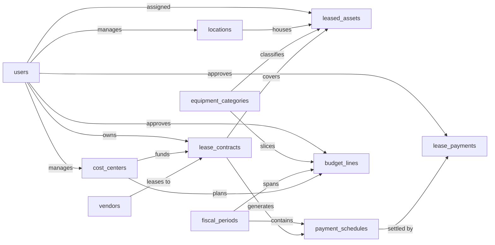

# Equipment Lease Management — Semantic Model

## 1. Overview

A lessee-side system for tracking equipment lease contracts with vendors, the individual assets they cover, the planned and actual payment streams they generate, and the budgets against which those payments are measured. Users are finance analysts, contract owners, and cost-center managers who need to answer questions like "what is our total lease obligation next quarter?", "which contracts are over budget?", and "which assets are still under lease and where are they deployed?". The data model is platform-agnostic; budgeting is modeled at the cost-center / fiscal-period grain so variance analysis against actual payments is straightforward downstream.

## 2. Entity summary

| # | Table name | Singular label | Purpose |
|---|---|---|---|
| 1 | `vendors` | Vendor | Lessor companies the organization leases equipment from |
| 2 | `equipment_categories` | Equipment Category | Classification of leased equipment (IT hardware, vehicles, copiers, machinery) |
| 3 | `locations` | Location | Physical sites where leased equipment is deployed |
| 4 | `cost_centers` | Cost Center | Internal org units (departments, projects) to which lease costs are charged |
| 5 | `users` | User | Employees who own, approve, or administer lease contracts |
| 6 | `lease_contracts` | Lease Contract | Master legal agreement with a vendor covering one or more leased assets |
| 7 | `leased_assets` | Leased Asset | Individual piece of equipment covered by a lease contract |
| 8 | `payment_schedules` | Payment Schedule | Planned periodic payment obligation generated from contract terms |
| 9 | `lease_payments` | Lease Payment | Actual payment posted/invoiced against a scheduled obligation |
| 10 | `fiscal_periods` | Fiscal Period | Budget calendar unit (fiscal month, quarter, or year) |
| 11 | `budget_lines` | Budget Line | Planned lease spend for a cost center in a fiscal period (optionally per category) |

### Entity-relationship diagram

## 3. Entities

### 3.1 `vendors` — Vendor

**Plural label:** Vendors
**Label column:** `vendor_name`
**Description:** A lessor company from which the organization rents equipment. One vendor can be counterparty to many lease contracts over time.

**Fields**

| Field name | Format | Required | Label | Reference / Notes |
|---|---|---|---|---|
| `vendor_name` | `string` | yes | Vendor Name | label_column |
| `vendor_code` | `string` | no | Vendor Code | unique, short internal code |
| `contact_email` | `email` | no | Contact Email | |
| `contact_phone` | `string` | no | Contact Phone | |
| `website` | `url` | no | Website | |
| `address_line` | `string` | no | Address | |
| `city` | `string` | no | City | |
| `country` | `string` | no | Country | ISO 3166 alpha-2 suggested |
| `vendor_status` | `enum` | yes | Status | values: `active`, `inactive` |
| `notes` | `text` | no | Notes | |

**Relationships**

- A `vendor` is the counterparty for many `lease_contracts` (1:N, via `lease_contracts.vendor_id`, restrict on delete).

---

### 3.2 `equipment_categories` — Equipment Category

**Plural label:** Equipment Categories
**Label column:** `category_name`
**Description:** A classification bucket for leased equipment (e.g. IT Hardware, Vehicles, Copiers, Machinery). Used for slicing budgets and reporting.

**Fields**

| Field name | Format | Required | Label | Reference / Notes |
|---|---|---|---|---|
| `category_name` | `string` | yes | Category Name | label_column, unique |
| `description` | `text` | no | Description | |

**Relationships**

- An `equipment_category` classifies many `leased_assets` (1:N, via `leased_assets.equipment_category_id`, restrict on delete).
- An `equipment_category` optionally slices many `budget_lines` (1:N, via `budget_lines.equipment_category_id`, clear on delete).

---

### 3.3 `locations` — Location

**Plural label:** Locations
**Label column:** `location_name`
**Description:** A physical site (office, warehouse, field location) where leased equipment is deployed. Enables asset-location reporting and physical inventory reconciliation.

**Fields**

| Field name | Format | Required | Label | Reference / Notes |
|---|---|---|---|---|
| `location_name` | `string` | yes | Location Name | label_column |
| `location_code` | `string` | no | Location Code | unique |
| `address_line` | `string` | no | Address | |
| `city` | `string` | no | City | |
| `state_region` | `string` | no | State/Region | |
| `postal_code` | `string` | no | Postal Code | |
| `country` | `string` | no | Country | |
| `site_manager_id` | `reference` | no | Site Manager | → `users` (N:1), clear on delete |

**Relationships**

- A `location` is managed by at most one `user` (N:1, optional, clear on delete).
- A `location` houses many `leased_assets` (1:N, via `leased_assets.location_id`, clear on delete).

---

### 3.4 `cost_centers` — Cost Center

**Plural label:** Cost Centers
**Label column:** `cost_center_name`
**Description:** An internal organizational unit (department, project, business unit) against which lease costs are charged and budgets are planned. Every lease contract is funded by exactly one cost center (primary allocation).

**Fields**

| Field name | Format | Required | Label | Reference / Notes |
|---|---|---|---|---|
| `cost_center_name` | `string` | yes | Cost Center Name | label_column |
| `cost_center_code` | `string` | yes | Cost Center Code | unique |
| `department` | `string` | no | Department | |
| `description` | `text` | no | Description | |
| `manager_id` | `reference` | no | Manager | → `users` (N:1), clear on delete |
| `cost_center_status` | `enum` | yes | Status | values: `active`, `inactive` |

**Relationships**

- A `cost_center` is managed by at most one `user` (N:1, optional, clear on delete).
- A `cost_center` funds many `lease_contracts` (1:N, via `lease_contracts.primary_cost_center_id`, restrict on delete).
- A `cost_center` plans many `budget_lines` (1:N, via `budget_lines.cost_center_id`, restrict on delete).

---

### 3.5 `users` — User

**Plural label:** Users
**Label column:** `full_name`
**Description:** An employee who owns, approves, or administers lease contracts, assets, payments, or budgets. Included for model completeness; the deployer will deduplicate against the Semantius built-in `users` table at implementation time.

**Fields**

| Field name | Format | Required | Label | Reference / Notes |
|---|---|---|---|---|
| `full_name` | `string` | yes | Full Name | label_column |
| `email` | `email` | yes | Email | unique |
| `employee_id` | `string` | no | Employee ID | unique |
| `department` | `string` | no | Department | |
| `user_status` | `enum` | yes | Status | values: `active`, `inactive` |

**Relationships**

- A `user` may manage many `locations` (1:N, via `locations.site_manager_id`, clear).
- A `user` may manage many `cost_centers` (1:N, via `cost_centers.manager_id`, clear).
- A `user` may own many `lease_contracts` (1:N, via `lease_contracts.contract_owner_id`, restrict).
- A `user` may have many `leased_assets` deployed to them (1:N, via `leased_assets.deployed_to_user_id`, clear).
- A `user` may approve many `lease_payments` (1:N, via `lease_payments.approved_by_user_id`, clear).
- A `user` may approve many `budget_lines` (1:N, via `budget_lines.approved_by_user_id`, clear).

---

### 3.6 `lease_contracts` — Lease Contract

**Plural label:** Lease Contracts
**Label column:** `contract_number`
**Description:** The master legal agreement with a vendor covering one or more leased assets, with a fixed term, payment schedule, and commercial terms. One contract generates many payment schedules and owns many leased assets.

**Fields**

| Field name | Format | Required | Label | Reference / Notes |
|---|---|---|---|---|
| `contract_number` | `string` | yes | Contract Number | label_column, unique, e.g. `LC-2026-0042` |
| `contract_title` | `string` | no | Title | human description, e.g. "IT fleet refresh 2026" |
| `vendor_id` | `reference` | yes | Vendor | → `vendors` (N:1), restrict |
| `primary_cost_center_id` | `reference` | yes | Cost Center | → `cost_centers` (N:1), restrict |
| `contract_owner_id` | `reference` | yes | Contract Owner | → `users` (N:1), restrict |
| `contract_status` | `enum` | yes | Status | values: `draft`, `active`, `expired`, `terminated`, `renewed` |
| `lease_type` | `enum` | yes | Lease Type | values: `operating`, `finance`, `short_term` (ASC 842 classification) |
| `commencement_date` | `date` | yes | Commencement Date | |
| `end_date` | `date` | yes | End Date | |
| `term_months` | `integer` | yes | Term (Months) | |
| `currency_code` | `string` | yes | Currency | ISO 4217, e.g. `USD` |
| `monthly_payment_amount` | `float` | no | Monthly Payment | base monthly rent |
| `total_contract_value` | `float` | no | Total Contract Value | sum of all scheduled payments over the term |
| `payment_frequency` | `enum` | yes | Payment Frequency | values: `monthly`, `quarterly`, `semi_annual`, `annual` |
| `auto_renewal` | `boolean` | yes | Auto Renewal | |
| `renewal_notice_days` | `integer` | no | Renewal Notice (Days) | days before end_date required to opt out |
| `signed_date` | `date` | no | Signed Date | |
| `notes` | `text` | no | Notes | |

**Relationships**

- A `lease_contract` is with one `vendor` (N:1, required, restrict).
- A `lease_contract` is funded by one `cost_center` (N:1, required, restrict).
- A `lease_contract` is owned by one `user` (N:1, required, restrict).
- A `lease_contract` covers many `leased_assets` (1:N, ownership, cascade on delete).
- A `lease_contract` generates many `payment_schedules` (1:N, ownership, cascade on delete).

---

### 3.7 `leased_assets` — Leased Asset

**Plural label:** Leased Assets
**Label column:** `asset_tag`
**Description:** An individual piece of equipment covered by a lease contract, with a serial number and deployed location. Created in the context of a contract and cascaded-deleted when the contract is removed.

**Fields**

| Field name | Format | Required | Label | Reference / Notes |
|---|---|---|---|---|
| `asset_tag` | `string` | yes | Asset Tag | label_column, unique |
| `asset_description` | `string` | yes | Description | |
| `lease_contract_id` | `parent` | yes | Lease Contract | ↳ `lease_contracts` (N:1, cascade) |
| `equipment_category_id` | `reference` | yes | Category | → `equipment_categories` (N:1), restrict |
| `location_id` | `reference` | no | Location | → `locations` (N:1), clear |
| `manufacturer` | `string` | no | Manufacturer | |
| `model` | `string` | no | Model | |
| `serial_number` | `string` | no | Serial Number | unique |
| `acquisition_cost` | `float` | no | Acquisition Cost | fair value at lease start (ROU asset basis) |
| `monthly_rent_amount` | `float` | no | Monthly Rent | asset's share of contract payment |
| `condition_status` | `enum` | yes | Condition | values: `new`, `good`, `fair`, `poor`, `retired` |
| `deployed_to_user_id` | `reference` | no | Deployed To | → `users` (N:1), clear |
| `decommission_date` | `date` | no | Decommission Date | |
| `notes` | `text` | no | Notes | |

**Relationships**

- A `leased_asset` belongs to one `lease_contract` (N:1, required, cascade on delete).
- A `leased_asset` is classified as one `equipment_category` (N:1, required, restrict).
- A `leased_asset` may be housed at one `location` (N:1, optional, clear).
- A `leased_asset` may be deployed to one `user` (N:1, optional, clear).

---

### 3.8 `payment_schedules` — Payment Schedule

**Plural label:** Payment Schedules
**Label column:** `schedule_reference`
**Description:** A planned periodic payment obligation generated from a lease contract's terms. The set of schedules for a contract represents the full planned cash-out over the lease term. Each schedule row is settled by zero or more actual lease payments.

**Fields**

| Field name | Format | Required | Label | Reference / Notes |
|---|---|---|---|---|
| `schedule_reference` | `string` | yes | Schedule Reference | label_column — caller populates, e.g. `LC-2026-0042 / 2026-03` |
| `lease_contract_id` | `parent` | yes | Lease Contract | ↳ `lease_contracts` (N:1, cascade) |
| `fiscal_period_id` | `reference` | no | Fiscal Period | → `fiscal_periods` (N:1), clear |
| `payment_number` | `integer` | yes | Payment # | 1-based sequence within the contract |
| `scheduled_date` | `date` | yes | Scheduled Date | |
| `scheduled_amount` | `float` | yes | Scheduled Amount | |
| `currency_code` | `string` | yes | Currency | ISO 4217 |
| `schedule_status` | `enum` | yes | Status | values: `pending`, `invoiced`, `paid`, `overdue`, `waived` |
| `notes` | `text` | no | Notes | |

**Relationships**

- A `payment_schedule` belongs to one `lease_contract` (N:1, required, cascade on delete).
- A `payment_schedule` may fall in one `fiscal_period` (N:1, optional, clear).
- A `payment_schedule` is settled by many `lease_payments` (1:N, via `lease_payments.payment_schedule_id`, restrict on delete).

---

### 3.9 `lease_payments` — Lease Payment

**Plural label:** Lease Payments
**Label column:** `payment_reference`
**Description:** An actual payment posted or invoiced against a scheduled obligation. Used to compute actual-vs-planned variance and to track settlement of the contract's cash schedule.

**Fields**

| Field name | Format | Required | Label | Reference / Notes |
|---|---|---|---|---|
| `payment_reference` | `string` | yes | Payment Reference | label_column, unique, e.g. voucher or AP posting number |
| `payment_schedule_id` | `reference` | yes | Payment Schedule | → `payment_schedules` (N:1), restrict |
| `payment_date` | `date` | yes | Payment Date | actual posting date |
| `payment_amount` | `float` | yes | Amount | |
| `currency_code` | `string` | yes | Currency | ISO 4217 |
| `payment_method` | `enum` | yes | Payment Method | values: `ach`, `wire`, `check`, `credit_card`, `other` |
| `invoice_number` | `string` | no | Invoice Number | vendor invoice number |
| `approved_by_user_id` | `reference` | no | Approved By | → `users` (N:1), clear |
| `notes` | `text` | no | Notes | |

**Relationships**

- A `lease_payment` settles one `payment_schedule` (N:1, required, restrict on delete of the schedule).
- A `lease_payment` may be approved by one `user` (N:1, optional, clear).

---

### 3.10 `fiscal_periods` — Fiscal Period

**Plural label:** Fiscal Periods
**Label column:** `period_name`
**Description:** A budget-calendar unit — a fiscal month, quarter, half-year, or year. Budget lines and payment schedules are assigned to fiscal periods to enable period-level roll-ups and variance analysis.

**Fields**

| Field name | Format | Required | Label | Reference / Notes |
|---|---|---|---|---|
| `period_name` | `string` | yes | Period Name | label_column, unique, e.g. `2026-Q1`, `2026-03` |
| `period_type` | `enum` | yes | Period Type | values: `month`, `quarter`, `half_year`, `year` |
| `fiscal_year` | `integer` | yes | Fiscal Year | |
| `start_date` | `date` | yes | Start Date | |
| `end_date` | `date` | yes | End Date | |
| `is_closed` | `boolean` | yes | Closed | when true, blocks further edits to budget_lines assigned to this period (enforced in application logic) |

**Relationships**

- A `fiscal_period` contains many `payment_schedules` (1:N, via `payment_schedules.fiscal_period_id`, clear).
- A `fiscal_period` spans many `budget_lines` (1:N, via `budget_lines.fiscal_period_id`, restrict).

---

### 3.11 `budget_lines` — Budget Line

**Plural label:** Budget Lines
**Label column:** `budget_line_label`
**Description:** Planned lease spend for a cost center in a fiscal period, optionally broken down by equipment category. The plan-side input to variance reporting against actual lease payments.

**Fields**

| Field name | Format | Required | Label | Reference / Notes |
|---|---|---|---|---|
| `budget_line_label` | `string` | yes | Budget Line | label_column — caller populates, e.g. `CC-100 / 2026-Q1 / IT hardware` |
| `cost_center_id` | `reference` | yes | Cost Center | → `cost_centers` (N:1), restrict |
| `fiscal_period_id` | `reference` | yes | Fiscal Period | → `fiscal_periods` (N:1), restrict |
| `equipment_category_id` | `reference` | no | Category | → `equipment_categories` (N:1), clear — optional category slice |
| `planned_amount` | `float` | yes | Planned Amount | |
| `currency_code` | `string` | yes | Currency | ISO 4217 |
| `budget_status` | `enum` | yes | Status | values: `draft`, `approved`, `locked` |
| `approved_by_user_id` | `reference` | no | Approved By | → `users` (N:1), clear |
| `approved_at` | `date-time` | no | Approved At | |
| `notes` | `text` | no | Notes | |

**Relationships**

- A `budget_line` is planned against one `cost_center` (N:1, required, restrict).
- A `budget_line` spans one `fiscal_period` (N:1, required, restrict).
- A `budget_line` may be sliced by one `equipment_category` (N:1, optional, clear).
- A `budget_line` may be approved by one `user` (N:1, optional, clear).

> **Uniqueness note:** the tuple `(cost_center_id, fiscal_period_id, equipment_category_id)` should be unique at the app layer. Semantius does not support composite unique constraints declaratively — the implementer must enforce this in application logic or via a database trigger. Tracked in §6.2.

---

## 4. Relationship summary

| From | Field | To | Cardinality | Kind | Delete behavior |
|---|---|---|---|---|---|
| `locations` | `site_manager_id` | `users` | N:1 | reference | clear |
| `cost_centers` | `manager_id` | `users` | N:1 | reference | clear |
| `lease_contracts` | `vendor_id` | `vendors` | N:1 | reference | restrict |
| `lease_contracts` | `primary_cost_center_id` | `cost_centers` | N:1 | reference | restrict |
| `lease_contracts` | `contract_owner_id` | `users` | N:1 | reference | restrict |
| `leased_assets` | `lease_contract_id` | `lease_contracts` | N:1 | parent | cascade |
| `leased_assets` | `equipment_category_id` | `equipment_categories` | N:1 | reference | restrict |
| `leased_assets` | `location_id` | `locations` | N:1 | reference | clear |
| `leased_assets` | `deployed_to_user_id` | `users` | N:1 | reference | clear |
| `payment_schedules` | `lease_contract_id` | `lease_contracts` | N:1 | parent | cascade |
| `payment_schedules` | `fiscal_period_id` | `fiscal_periods` | N:1 | reference | clear |
| `lease_payments` | `payment_schedule_id` | `payment_schedules` | N:1 | reference | restrict |
| `lease_payments` | `approved_by_user_id` | `users` | N:1 | reference | clear |
| `budget_lines` | `cost_center_id` | `cost_centers` | N:1 | reference | restrict |
| `budget_lines` | `fiscal_period_id` | `fiscal_periods` | N:1 | reference | restrict |
| `budget_lines` | `equipment_category_id` | `equipment_categories` | N:1 | reference | clear |
| `budget_lines` | `approved_by_user_id` | `users` | N:1 | reference | clear |

## 5. Enumerations

### 5.1 `vendors.vendor_status`
- `active`
- `inactive`

### 5.2 `cost_centers.cost_center_status`
- `active`
- `inactive`

### 5.3 `users.user_status`
- `active`
- `inactive`

### 5.4 `lease_contracts.contract_status`
- `draft`
- `active`
- `expired`
- `terminated`
- `renewed`

### 5.5 `lease_contracts.lease_type`
- `operating`
- `finance`
- `short_term`

### 5.6 `lease_contracts.payment_frequency`
- `monthly`
- `quarterly`
- `semi_annual`
- `annual`

### 5.7 `leased_assets.condition_status`
- `new`
- `good`
- `fair`
- `poor`
- `retired`

### 5.8 `payment_schedules.schedule_status`
- `pending`
- `invoiced`
- `paid`
- `overdue`
- `waived`

### 5.9 `lease_payments.payment_method`
- `ach`
- `wire`
- `check`
- `credit_card`
- `other`

### 5.10 `fiscal_periods.period_type`
- `month`
- `quarter`
- `half_year`
- `year`

### 5.11 `budget_lines.budget_status`
- `draft`
- `approved`
- `locked`

## 6. Open questions

### 6.1 🔴 Decisions needed (blockers)

None.

### 6.2 🟡 Future considerations (deferred scope)

- Should a `cost_allocations` junction entity be introduced to split a single lease contract's cost across multiple cost centers on a percentage basis, replacing the current single `primary_cost_center_id` field on `lease_contracts`?
- Should lease modifications (ASC 842 remeasurement events — term extensions, payment changes, scope changes) be tracked as their own `lease_amendments` entity, or left to the audit log of `lease_contracts`?
- Should scanned contract PDFs, amendments, and supporting documents be tracked as a `contract_documents` entity with polymorphic links to `lease_contracts` and `leased_assets`?
- Should an asset-level cost-center override (`leased_assets.cost_center_id`) be introduced for cases where one asset on a shared contract is charged to a different cost center than the contract's primary?
- Should multi-currency handling gain explicit FX-rate snapshots and reporting-currency conversions, or is the current per-row `currency_code` string sufficient?
- Should `cost_centers` and `equipment_categories` support parent-child hierarchies for drill-down reporting, rather than the current flat structure?
- Should renewal options and purchase options on a contract be modeled as their own `contract_options` entity with exercise/expiry fields, rather than the current `auto_renewal` / `renewal_notice_days` scalars?
- Should the composite uniqueness on `budget_lines` (`cost_center_id`, `fiscal_period_id`, `equipment_category_id`) be enforced by a database-level trigger or unique index, rather than only in application logic?
- Should approval workflows (multi-step sign-off) on `lease_contracts` and `budget_lines` be modeled as their own approval-routing entities, rather than the single `approved_by_user_id` / `approved_at` pair?

## 7. Implementation notes for the downstream agent

1. Create one module named `lease_management` and two baseline permissions (`lease_management:read`, `lease_management:manage`) before any entity.
2. Create entities in the order given in §2 — `vendors`, `equipment_categories`, `locations`, `cost_centers`, `users`, then `lease_contracts`, `leased_assets`, `payment_schedules`, `lease_payments`, `fiscal_periods`, `budget_lines` — so that every `reference_table` target already exists when each entity is created. Note: `users` has FK dependencies on it from `locations` and `cost_centers`, so if those are created first, their `site_manager_id` / `manager_id` fields must be added after `users` exists — create the fields in a second pass, or create `users` first and add its (non-FK) fields.
3. For each entity: set `label_column` to the snake_case field marked as label in §3, pass `module_id`, `view_permission`, `edit_permission`. Do **not** manually create `id`, `created_at`, `updated_at`, or the auto-label field.
4. For each field in §3: pass `table_name`, `field_name`, `format`, `title` (the Label column), `is_nullable` (inverse of Required), and for `reference`/`parent` fields also `reference_table` and a `reference_delete_mode` consistent with §4.
5. **Deduplicate against Semantius built-in tables.** This model is self-contained and declares `users`, which already exists in Semantius as a built-in. Read Semantius first: if the built-in `users` covers the domain needs, **skip the create** and reuse the built-in as the `reference_table` target — do not attempt to recreate. Optionally add missing fields (`full_name`, `employee_id`, `department`, `user_status`) to the built-in `users` entity only if the built-in does not already provide equivalents (additive, low-risk changes only).
6. `payment_schedules.schedule_reference` and `budget_lines.budget_line_label` are caller-populated string labels — no platform auto-population. On record creation, callers should compose a readable value (e.g. `"{contract_number} / {period_name}"` for schedules; `"{cost_center_code} / {period_name} / {category_name}"` for budget lines).
7. Enforce composite uniqueness on `budget_lines` (`cost_center_id`, `fiscal_period_id`, `equipment_category_id`) in application logic until a database-level constraint is added (see §6.2).
8. After creation, spot-check that `label_column` on each entity resolves to a real string field and that all `reference_table` targets exist.
