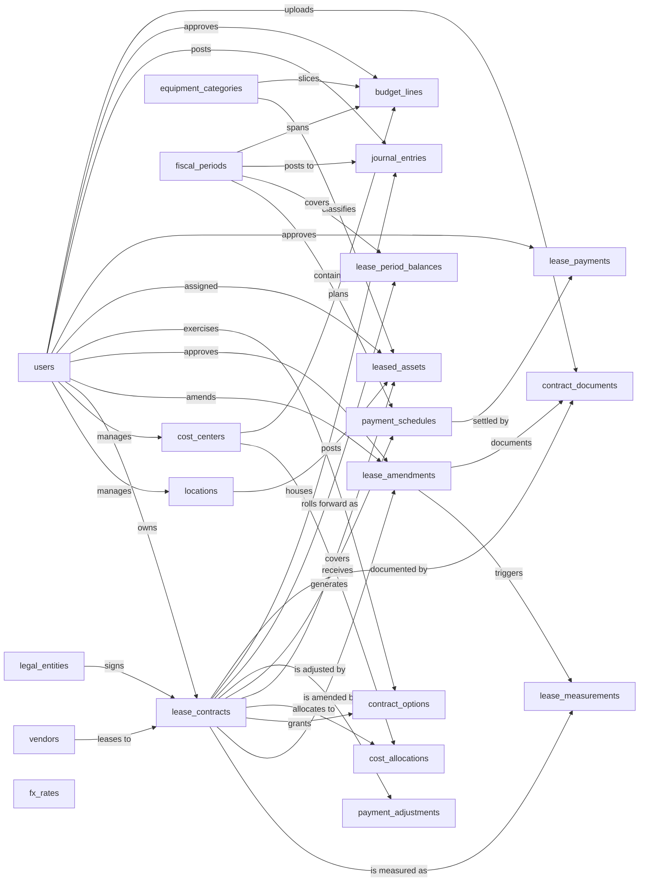

# Equipment Lease Management — Semantic Model

## 1. Overview

A lessee-side system for the full lifecycle of equipment lease contracts: master agreements with vendors, the assets they cover, the planned and actual payment streams they generate, ASC 842 / IFRS 16 / GASB 87 measurement and accounting (right-of-use asset and lease liability roll-forward, journal entries), modification and remeasurement events, renewal and purchase options, multi-cost-center allocation, multi-currency translation, and budget planning against fiscal periods. Built for finance, accounting, treasury, and asset-owning teams who need a single source of truth from contract execution through general ledger posting.

## 2. Entity summary

| # | Table name | Singular label | Purpose |
|---|---|---|---|
| 1 | `vendors` | Vendor | Lessor companies the organization leases equipment from |
| 2 | `equipment_categories` | Equipment Category | Classification of leased equipment (IT hardware, vehicles, copiers, machinery) |
| 3 | `users` | User | Employees who own, approve, or administer leases, assets, payments, budgets |
| 4 | `locations` | Location | Physical sites where leased equipment is deployed |
| 5 | `cost_centers` | Cost Center | Internal org units (departments, projects) against which lease costs are charged |
| 6 | `legal_entities` | Legal Entity | Reporting entity (legal company / subsidiary) that signs the contract |
| 7 | `lease_contracts` | Lease Contract | Master legal agreement with a vendor covering one or more leased assets |
| 8 | `lease_measurements` | Lease Measurement | ASC 842 / IFRS 16 / GASB 87 classification + initial / remeasurement (discount rate, ROU and liability values) |
| 9 | `lease_amendments` | Lease Amendment | Modification event (term extension, payment change, scope change, partial termination) triggering remeasurement |
| 10 | `contract_options` | Contract Option | Renewal, purchase, termination, or extension option with strike price, exercise window, and likelihood |
| 11 | `cost_allocations` | Cost Allocation | Junction splitting a contract's cost across cost centers by percentage over a date range |
| 12 | `leased_assets` | Leased Asset | Individual piece of equipment covered by a contract |
| 13 | `payment_schedules` | Payment Schedule | Planned periodic payment obligation generated from contract terms |
| 14 | `payment_adjustments` | Payment Adjustment | CPI escalation, step rent, or variable-payment rule that modifies scheduled amounts over time |
| 15 | `lease_payments` | Lease Payment | Actual payment posted or invoiced against a scheduled obligation |
| 16 | `lease_period_balances` | Lease Period Balance | Per-contract per-period ROU asset and lease liability roll-forward |
| 17 | `journal_entries` | Journal Entry | Monthly accounting entries derived from leases (ROU amortization, interest, lease expense, cash payment) |
| 18 | `fiscal_periods` | Fiscal Period | Budget and accounting calendar unit (month, quarter, half-year, year) |
| 19 | `budget_lines` | Budget Line | Planned lease spend for a cost center / fiscal period / category |
| 20 | `fx_rates` | FX Rate | Currency conversion rate for a (from-currency, to-currency, as-of-date) tuple, used for reporting-currency translation |
| 21 | `contract_documents` | Contract Document | File metadata for signed contracts, amendments, schedules, and supporting documents |

### Entity-relationship diagram



## 3. Entities

### 3.1 `vendors` — Vendor

**Plural label:** Vendors
**Label column:** `vendor_name`
**Description:** A lessor company from which the organization rents equipment. One vendor can be counterparty to many lease contracts over time.

**Fields**

| Field name | Format | Required | Label | Reference / Notes |
|---|---|---|---|---|
| `vendor_name` | `string` | yes | Vendor Name | label_column |
| `vendor_code` | `string` | no | Vendor Code | unique, short internal code |
| `contact_email` | `email` | no | Contact Email | |
| `contact_phone` | `string` | no | Contact Phone | |
| `website` | `url` | no | Website | |
| `address_line` | `string` | no | Address | |
| `city` | `string` | no | City | |
| `country` | `string` | no | Country | ISO 3166 alpha-2 suggested |
| `vendor_status` | `enum` | yes | Status | values: `active`, `inactive`; default: "active" |
| `notes` | `text` | no | Notes | |

**Relationships**

- A `vendor` is the counterparty for many `lease_contracts` (1:N, via `lease_contracts.vendor_id`, restrict on delete).

---

### 3.2 `equipment_categories` — Equipment Category

**Plural label:** Equipment Categories
**Label column:** `category_name`
**Description:** A classification bucket for leased equipment (e.g. IT Hardware, Vehicles, Copiers, Machinery). Used for slicing budgets and reporting.

**Fields**

| Field name | Format | Required | Label | Reference / Notes |
|---|---|---|---|---|
| `category_name` | `string` | yes | Category Name | label_column, unique |
| `description` | `text` | no | Description | |

**Relationships**

- An `equipment_category` classifies many `leased_assets` (1:N, via `leased_assets.equipment_category_id`, restrict on delete).
- An `equipment_category` optionally slices many `budget_lines` (1:N, via `budget_lines.equipment_category_id`, clear on delete).

---

### 3.3 `users` — User

**Plural label:** Users
**Label column:** `full_name`
**Description:** An employee who owns, approves, or administers lease contracts, assets, payments, amendments, options, journal entries, or budgets. Modeled in full for self-containment; the implementing platform may already provide a built-in equivalent.

**Fields**

| Field name | Format | Required | Label | Reference / Notes |
|---|---|---|---|---|
| `full_name` | `string` | yes | Full Name | label_column |
| `email` | `email` | yes | Email | unique |
| `employee_id` | `string` | no | Employee ID | unique |
| `department` | `string` | no | Department | |
| `user_status` | `enum` | yes | Status | values: `active`, `inactive`; default: "active" |

**Relationships**

- A `user` may manage many `locations` (1:N, via `locations.site_manager_id`, clear).
- A `user` may manage many `cost_centers` (1:N, via `cost_centers.manager_id`, clear).
- A `user` may own many `lease_contracts` (1:N, via `lease_contracts.contract_owner_id`, restrict).
- A `user` may amend many `lease_amendments` (1:N, via `lease_amendments.amended_by_user_id`, clear).
- A `user` may approve many `lease_amendments` (1:N, via `lease_amendments.approved_by_user_id`, clear).
- A `user` may exercise many `contract_options` (1:N, via `contract_options.exercised_by_user_id`, clear).
- A `user` may have many `leased_assets` deployed to them (1:N, via `leased_assets.deployed_to_user_id`, clear).
- A `user` may approve many `lease_payments` (1:N, via `lease_payments.approved_by_user_id`, clear).
- A `user` may post many `journal_entries` (1:N, via `journal_entries.posted_by_user_id`, clear).
- A `user` may approve many `budget_lines` (1:N, via `budget_lines.approved_by_user_id`, clear).
- A `user` may upload many `contract_documents` (1:N, via `contract_documents.uploaded_by_user_id`, clear).

---

### 3.4 `locations` — Location

**Plural label:** Locations
**Label column:** `location_name`
**Description:** A physical site (office, warehouse, field location) where leased equipment is deployed. Enables asset-location reporting and physical inventory reconciliation.

**Fields**

| Field name | Format | Required | Label | Reference / Notes |
|---|---|---|---|---|
| `location_name` | `string` | yes | Location Name | label_column |
| `location_code` | `string` | no | Location Code | unique |
| `address_line` | `string` | no | Address | |
| `city` | `string` | no | City | |
| `state_region` | `string` | no | State/Region | |
| `postal_code` | `string` | no | Postal Code | |
| `country` | `string` | no | Country | |
| `site_manager_id` | `reference` | no | Site Manager | → `users` (N:1), clear on delete, relationship_label: "manages" |

**Relationships**

- A `location` is managed by at most one `user` (N:1, optional, clear on delete).
- A `location` houses many `leased_assets` (1:N, via `leased_assets.location_id`, clear on delete).

---

### 3.5 `cost_centers` — Cost Center

**Plural label:** Cost Centers
**Label column:** `cost_center_name`
**Description:** An internal organizational unit (department, project, business unit) against which lease costs are charged and budgets are planned. A contract's cost can be split across multiple cost centers via the `cost_allocations` junction.

**Fields**

| Field name | Format | Required | Label | Reference / Notes |
|---|---|---|---|---|
| `cost_center_name` | `string` | yes | Cost Center Name | label_column |
| `cost_center_code` | `string` | yes | Cost Center Code | unique |
| `department` | `string` | no | Department | |
| `description` | `text` | no | Description | |
| `manager_id` | `reference` | no | Manager | → `users` (N:1), clear on delete, relationship_label: "manages" |
| `cost_center_status` | `enum` | yes | Status | values: `active`, `inactive`; default: "active" |

**Relationships**

- A `cost_center` is managed by at most one `user` (N:1, optional, clear on delete).
- A `cost_center` receives allocations from many `lease_contracts` via `cost_allocations` (M:N junction).
- A `cost_center` plans many `budget_lines` (1:N, via `budget_lines.cost_center_id`, restrict on delete).

---

### 3.6 `legal_entities` — Legal Entity

**Plural label:** Legal Entities
**Label column:** `legal_entity_name`
**Description:** A legal company, subsidiary, branch, or joint venture that is the contracting party on a lease. Drives reporting-entity grouping, functional-currency assignment, and statutory disclosures.

**Fields**

| Field name | Format | Required | Label | Reference / Notes |
|---|---|---|---|---|
| `legal_entity_name` | `string` | yes | Legal Entity Name | label_column |
| `legal_entity_code` | `string` | yes | Code | unique, e.g. `ACME-US` |
| `country` | `string` | no | Country | ISO 3166 alpha-2 |
| `functional_currency` | `string` | yes | Functional Currency | ISO 4217 |
| `reporting_currency` | `string` | no | Reporting Currency | ISO 4217; null = same as functional |
| `entity_type` | `enum` | yes | Entity Type | values: `parent`, `subsidiary`, `branch`, `joint_venture`; default: "subsidiary" |
| `legal_entity_status` | `enum` | yes | Status | values: `active`, `inactive`; default: "active" |
| `notes` | `text` | no | Notes | |

**Relationships**

- A `legal_entity` signs many `lease_contracts` (1:N, via `lease_contracts.legal_entity_id`, restrict on delete).

---

### 3.7 `lease_contracts` — Lease Contract

**Plural label:** Lease Contracts
**Label column:** `contract_number`
**Audit log:** yes
**Description:** The master legal agreement with a vendor covering one or more leased assets, with a fixed term, payment schedule, and commercial terms. One contract generates many payment schedules, owns many leased assets, and may carry options, amendments, and remeasurements over its life.

**Fields**

| Field name | Format | Required | Label | Reference / Notes |
|---|---|---|---|---|
| `contract_number` | `string` | yes | Contract Number | label_column, unique, e.g. `LC-2026-0042` |
| `contract_title` | `string` | no | Title | human description, e.g. "IT fleet refresh 2026" |
| `vendor_id` | `reference` | yes | Vendor | → `vendors` (N:1), restrict, relationship_label: "leases to" |
| `legal_entity_id` | `reference` | yes | Legal Entity | → `legal_entities` (N:1), restrict, relationship_label: "signs" |
| `contract_owner_id` | `reference` | yes | Contract Owner | → `users` (N:1), restrict, relationship_label: "owns" |
| `contract_status` | `enum` | yes | Status | values: `draft`, `active`, `expired`, `terminated`, `renewed`, `bought_out`; default: "draft" |
| `commencement_date` | `date` | yes | Commencement Date | |
| `end_date` | `date` | yes | End Date | |
| `term_months` | `integer` | yes | Term (Months) | |
| `currency_code` | `string` | yes | Currency | ISO 4217 |
| `monthly_payment_amount` | `number` | no | Monthly Payment | base monthly rent, precision: 2 |
| `total_contract_value` | `number` | no | Total Contract Value | sum of all scheduled payments over the term, precision: 2 |
| `payment_frequency` | `enum` | yes | Payment Frequency | values: `monthly`, `quarterly`, `semi_annual`, `annual`; default: "monthly" |
| `payment_timing` | `enum` | yes | Payment Timing | values: `in_advance`, `in_arrears`; default: "in_advance" |
| `signed_date` | `date` | no | Signed Date | |
| `notes` | `text` | no | Notes | |

**Relationships**

- A `lease_contract` is with one `vendor` (N:1, required, restrict).
- A `lease_contract` is signed by one `legal_entity` (N:1, required, restrict).
- A `lease_contract` is owned by one `user` (N:1, required, restrict).
- A `lease_contract` is allocated across many `cost_centers` via `cost_allocations` (M:N junction).
- A `lease_contract` covers many `leased_assets` (1:N, ownership, cascade on delete).
- A `lease_contract` is measured as many `lease_measurements` (1:N, ownership, cascade — initial plus one per remeasurement event).
- A `lease_contract` is amended by many `lease_amendments` (1:N, ownership, cascade).
- A `lease_contract` grants many `contract_options` (1:N, ownership, cascade).
- A `lease_contract` generates many `payment_schedules` (1:N, ownership, cascade on delete).
- A `lease_contract` is adjusted by many `payment_adjustments` (1:N, ownership, cascade).
- A `lease_contract` rolls forward as many `lease_period_balances` (1:N, ownership, cascade).
- A `lease_contract` posts many `journal_entries` (1:N, via `journal_entries.lease_contract_id`, restrict — JEs survive contract deletion as audit trail).
- A `lease_contract` is documented by many `contract_documents` (1:N, ownership, cascade).

**Validation rules**

```json
[
  {
    "code": "contract_dates_ordered",
    "message": "End date must be on or after the commencement date.",
    "description": "End date must be on or after commencement date.",
    "jsonlogic": {">=": [{"var": "end_date"}, {"var": "commencement_date"}]}
  },
  {
    "code": "term_months_positive",
    "message": "Term (months) must be 1 or greater.",
    "description": "Lease term must be at least one month.",
    "jsonlogic": {">=": [{"var": "term_months"}, 1]}
  },
  {
    "code": "monthly_payment_non_negative",
    "message": "Monthly payment amount must be 0 or greater.",
    "description": "Monthly payment amount cannot be negative.",
    "jsonlogic": {"or": [{"==": [{"var": "monthly_payment_amount"}, null]}, {">=": [{"var": "monthly_payment_amount"}, 0]}]}
  },
  {
    "code": "total_contract_value_non_negative",
    "message": "Total contract value must be 0 or greater.",
    "description": "Total contract value cannot be negative.",
    "jsonlogic": {"or": [{"==": [{"var": "total_contract_value"}, null]}, {">=": [{"var": "total_contract_value"}, 0]}]}
  },
  {
    "code": "contract_terminal_is_one_way",
    "message": "Cannot change contract status: contract is in a terminal state.",
    "description": "Once a contract reaches expired, terminated, renewed, or bought_out, the status cannot change.",
    "jsonlogic": {"or": [
      {"==": [{"var": "$old"}, null]},
      {"!": {"in": [{"var": "$old.contract_status"}, ["expired", "terminated", "renewed", "bought_out"]]}},
      {"==": [{"var": "contract_status"}, {"var": "$old.contract_status"}]}
    ]}
  }
]
```

---

### 3.8 `lease_measurements` — Lease Measurement

**Plural label:** Lease Measurements
**Label column:** `measurement_reference`
**Audit log:** yes
**Description:** A point-in-time accounting measurement of a lease under a specific GAAP standard: classification (operating / finance / short-term), discount rate, initial right-of-use asset, initial lease liability, and any prepayments or incentives. The first measurement per contract is the initial recognition; subsequent measurements are triggered by amendments that require remeasurement (term change, scope change, payment change, reassessment).

**Fields**

| Field name | Format | Required | Label | Reference / Notes |
|---|---|---|---|---|
| `measurement_reference` | `string` | yes | Measurement Reference | label_column, caller-populated, e.g. `LC-2026-0042 / initial` or `LC-2026-0042 / remeasurement A1` |
| `lease_contract_id` | `parent` | yes | Lease Contract | ↳ `lease_contracts` (N:1, cascade), relationship_label: "is measured as" |
| `lease_amendment_id` | `reference` | no | Triggering Amendment | → `lease_amendments` (N:1), clear, relationship_label: "triggers"; null for initial measurement |
| `measurement_type` | `enum` | yes | Measurement Type | values: `initial`, `remeasurement`, `modification`; default: "initial" |
| `effective_date` | `date` | yes | Effective Date | |
| `lease_classification` | `enum` | yes | Classification | values: `operating`, `finance`, `short_term`; default: "operating" |
| `gaap_standard` | `enum` | yes | GAAP Standard | values: `asc_842`, `ifrs_16`, `gasb_87`; default: "asc_842" |
| `discount_rate` | `number` | yes | Discount Rate (%) | precision: 6, annual rate as percentage |
| `discount_rate_basis` | `enum` | yes | Rate Basis | values: `ibr`, `implicit_rate`, `risk_free`; default: "ibr" |
| `remaining_term_months` | `integer` | yes | Remaining Term (Months) | |
| `initial_rou_asset_amount` | `number` | yes | Initial ROU Asset | precision: 2 |
| `initial_lease_liability_amount` | `number` | yes | Initial Lease Liability | precision: 2 |
| `prepaid_amount` | `number` | no | Prepaid Rents | precision: 2 |
| `initial_direct_costs` | `number` | no | Initial Direct Costs | precision: 2 |
| `lease_incentives` | `number` | no | Lease Incentives | precision: 2 |
| `currency_code` | `string` | yes | Currency | ISO 4217 |
| `notes` | `text` | no | Notes | |

**Relationships**

- A `lease_measurement` belongs to one `lease_contract` (N:1, required, cascade on delete).
- A `lease_measurement` may be triggered by one `lease_amendment` (N:1, optional, clear); null for the initial measurement.

**Validation rules**

```json
[
  {
    "code": "amendment_required_when_not_initial",
    "message": "Non-initial measurements require a triggering lease amendment.",
    "description": "Non-initial measurements must reference the triggering amendment.",
    "jsonlogic": {"or": [{"==": [{"var": "measurement_type"}, "initial"]}, {"!=": [{"var": "lease_amendment_id"}, null]}]}
  },
  {
    "code": "amendment_forbidden_when_initial",
    "message": "Initial measurements cannot reference a triggering amendment.",
    "description": "Initial measurements must not reference an amendment.",
    "jsonlogic": {"or": [{"!=": [{"var": "measurement_type"}, "initial"]}, {"==": [{"var": "lease_amendment_id"}, null]}]}
  },
  {
    "code": "discount_rate_non_negative",
    "message": "Discount rate must be 0 or greater.",
    "description": "Discount rate must be non-negative.",
    "jsonlogic": {">=": [{"var": "discount_rate"}, 0]}
  },
  {
    "code": "remaining_term_positive",
    "message": "Remaining term must be 1 month or greater.",
    "description": "Remaining term must be at least one month.",
    "jsonlogic": {">=": [{"var": "remaining_term_months"}, 1]}
  },
  {
    "code": "initial_rou_non_negative",
    "message": "Initial ROU asset amount must be 0 or greater.",
    "description": "Initial ROU asset cannot be negative.",
    "jsonlogic": {">=": [{"var": "initial_rou_asset_amount"}, 0]}
  },
  {
    "code": "initial_liability_non_negative",
    "message": "Initial lease liability amount must be 0 or greater.",
    "description": "Initial lease liability cannot be negative.",
    "jsonlogic": {">=": [{"var": "initial_lease_liability_amount"}, 0]}
  }
]
```

---

### 3.9 `lease_amendments` — Lease Amendment

**Plural label:** Lease Amendments
**Label column:** `amendment_number`
**Audit log:** yes
**Description:** A formal modification to an existing lease contract: term extension or reduction, payment change, scope increase or decrease, partial or full termination, or reassessment. Triggers a follow-up `lease_measurement` when the amendment qualifies for remeasurement under the applicable GAAP standard.

**Fields**

| Field name | Format | Required | Label | Reference / Notes |
|---|---|---|---|---|
| `amendment_number` | `string` | yes | Amendment Number | label_column, unique, e.g. `LC-2026-0042 / A1` |
| `lease_contract_id` | `parent` | yes | Lease Contract | ↳ `lease_contracts` (N:1, cascade), relationship_label: "is amended by" |
| `amendment_type` | `enum` | yes | Amendment Type | values: `term_extension`, `term_reduction`, `payment_change`, `scope_increase`, `scope_decrease`, `partial_termination`, `full_termination`, `reassessment`; default: "payment_change" |
| `effective_date` | `date` | yes | Effective Date | |
| `description` | `text` | no | Description | |
| `triggers_remeasurement` | `boolean` | yes | Triggers Remeasurement | |
| `amended_by_user_id` | `reference` | no | Amended By | → `users` (N:1), clear, relationship_label: "amends" |
| `approved_by_user_id` | `reference` | no | Approved By | → `users` (N:1), clear, relationship_label: "approves" |
| `approved_at` | `date-time` | no | Approved At | |
| `amendment_status` | `enum` | yes | Status | values: `draft`, `approved`, `applied`, `rejected`; default: "draft" |
| `notes` | `text` | no | Notes | |

**Relationships**

- A `lease_amendment` belongs to one `lease_contract` (N:1, required, cascade on delete).
- A `lease_amendment` may trigger one or more `lease_measurements` (1:N, via `lease_measurements.lease_amendment_id`, clear).
- A `lease_amendment` may be related to many `contract_documents` (1:N, via `contract_documents.lease_amendment_id`, clear).

**Validation rules**

```json
[
  {
    "code": "approved_at_required_when_approved",
    "message": "Approved-at timestamp is required when amendment is approved or applied.",
    "description": "Approved-at timestamp is required once status reaches approved or applied.",
    "jsonlogic": {"or": [{"!": {"in": [{"var": "amendment_status"}, ["approved", "applied"]]}}, {"!=": [{"var": "approved_at"}, null]}]}
  },
  {
    "code": "approved_by_required_when_approved",
    "message": "Approver is required when amendment is approved or applied.",
    "description": "Approver is required once status reaches approved or applied.",
    "jsonlogic": {"or": [{"!": {"in": [{"var": "amendment_status"}, ["approved", "applied"]]}}, {"!=": [{"var": "approved_by_user_id"}, null]}]}
  },
  {
    "code": "applied_is_terminal",
    "message": "Cannot change status: amendment has already been applied.",
    "description": "Once an amendment is applied, status cannot change.",
    "jsonlogic": {"or": [
      {"==": [{"var": "$old"}, null]},
      {"!=": [{"var": "$old.amendment_status"}, "applied"]},
      {"==": [{"var": "amendment_status"}, "applied"]}
    ]}
  },
  {
    "code": "rejected_is_terminal",
    "message": "Cannot change status: amendment has already been rejected.",
    "description": "Once an amendment is rejected, status cannot change.",
    "jsonlogic": {"or": [
      {"==": [{"var": "$old"}, null]},
      {"!=": [{"var": "$old.amendment_status"}, "rejected"]},
      {"==": [{"var": "amendment_status"}, "rejected"]}
    ]}
  }
]
```

---

### 3.10 `contract_options` — Contract Option

**Plural label:** Contract Options
**Label column:** `option_reference`
**Audit log:** yes
**Description:** A contractual right granted to the lessee or lessor: renewal of term, purchase of the asset at a strike price, early termination at a fee, or extension. Each option carries an exercise window, a likelihood assessment (for ASC 842 measurement inclusion), and a status that records whether the option was exercised, expired, or waived.

**Fields**

| Field name | Format | Required | Label | Reference / Notes |
|---|---|---|---|---|
| `option_reference` | `string` | yes | Option Reference | label_column, caller-populated, e.g. `LC-2026-0042 / Renewal Option 1` |
| `lease_contract_id` | `parent` | yes | Lease Contract | ↳ `lease_contracts` (N:1, cascade), relationship_label: "grants" |
| `option_type` | `enum` | yes | Option Type | values: `renewal`, `purchase`, `termination`, `extension`; default: "renewal" |
| `exercise_window_start` | `date` | yes | Exercise Window Start | |
| `exercise_window_end` | `date` | yes | Exercise Window End | |
| `notice_period_days` | `integer` | no | Notice Period (Days) | |
| `strike_amount` | `number` | no | Strike Amount | precision: 2; purchase price or termination fee |
| `currency_code` | `string` | no | Currency | ISO 4217 |
| `term_extension_months` | `integer` | no | Term Extension (Months) | for renewal/extension options |
| `exercise_likelihood` | `enum` | yes | Exercise Likelihood | values: `reasonably_certain`, `possible`, `unlikely`; default: "possible"; ASC 842 includes `reasonably_certain` options in measurement |
| `exercise_status` | `enum` | yes | Status | values: `pending`, `exercised`, `expired`, `waived`; default: "pending" |
| `exercised_at` | `date` | no | Exercised At | |
| `exercised_by_user_id` | `reference` | no | Exercised By | → `users` (N:1), clear, relationship_label: "exercises" |
| `notes` | `text` | no | Notes | |

**Relationships**

- A `contract_option` belongs to one `lease_contract` (N:1, required, cascade on delete).
- A `contract_option` may be exercised by one `user` (N:1, optional, clear).

**Validation rules**

```json
[
  {
    "code": "exercise_window_ordered",
    "message": "Exercise window end date must be on or after the start date.",
    "description": "Exercise window end must be on or after start.",
    "jsonlogic": {">=": [{"var": "exercise_window_end"}, {"var": "exercise_window_start"}]}
  },
  {
    "code": "notice_period_non_negative",
    "message": "Notice period (days) must be 0 or greater.",
    "description": "Notice period days cannot be negative.",
    "jsonlogic": {"or": [{"==": [{"var": "notice_period_days"}, null]}, {">=": [{"var": "notice_period_days"}, 0]}]}
  },
  {
    "code": "strike_amount_non_negative",
    "message": "Strike amount must be 0 or greater.",
    "description": "Strike amount cannot be negative.",
    "jsonlogic": {"or": [{"==": [{"var": "strike_amount"}, null]}, {">=": [{"var": "strike_amount"}, 0]}]}
  },
  {
    "code": "term_extension_positive",
    "message": "Term extension (months) must be 1 or greater.",
    "description": "Term extension must be at least one month when set.",
    "jsonlogic": {"or": [{"==": [{"var": "term_extension_months"}, null]}, {">=": [{"var": "term_extension_months"}, 1]}]}
  },
  {
    "code": "exercised_at_required_when_exercised",
    "message": "Exercised-at date is required when option status is exercised.",
    "description": "Exercised-at date is required when option is exercised.",
    "jsonlogic": {"or": [{"!=": [{"var": "exercise_status"}, "exercised"]}, {"!=": [{"var": "exercised_at"}, null]}]}
  },
  {
    "code": "exercised_by_required_when_exercised",
    "message": "Exerciser is required when option status is exercised.",
    "description": "Exerciser is required when option is exercised.",
    "jsonlogic": {"or": [{"!=": [{"var": "exercise_status"}, "exercised"]}, {"!=": [{"var": "exercised_by_user_id"}, null]}]}
  },
  {
    "code": "exercise_terminal_is_one_way",
    "message": "Cannot change exercise status: option is in a terminal state.",
    "description": "Once an option is exercised, expired, or waived, status cannot change.",
    "jsonlogic": {"or": [
      {"==": [{"var": "$old"}, null]},
      {"!": {"in": [{"var": "$old.exercise_status"}, ["exercised", "expired", "waived"]]}},
      {"==": [{"var": "exercise_status"}, {"var": "$old.exercise_status"}]}
    ]}
  }
]
```

---

### 3.11 `cost_allocations` — Cost Allocation

**Plural label:** Cost Allocations
**Label column:** `cost_allocation_label`
**Description:** Junction entity that splits a lease contract's cost across one or more cost centers by percentage over a date range. Replaces a flat single-cost-center field on `lease_contracts` and supports allocation changes over the contract life.

**Fields**

| Field name | Format | Required | Label | Reference / Notes |
|---|---|---|---|---|
| `cost_allocation_label` | `string` | yes | Cost Allocation | label_column, caller-populated, e.g. `LC-2026-0042 / CC-100 / 60%` |
| `lease_contract_id` | `parent` | yes | Lease Contract | ↳ `lease_contracts` (N:1, cascade), relationship_label: "allocates to" |
| `cost_center_id` | `parent` | yes | Cost Center | ↳ `cost_centers` (N:1, cascade), relationship_label: "receives" |
| `allocation_percentage` | `number` | yes | Allocation % | precision: 4 |
| `effective_from` | `date` | yes | Effective From | |
| `effective_to` | `date` | no | Effective To | null = current |
| `notes` | `text` | no | Notes | |

**Relationships**

- A `cost_allocation` belongs to one `lease_contract` (N:1, required, cascade on delete).
- A `cost_allocation` belongs to one `cost_center` (N:1, required, cascade on delete).

**Validation rules**

```json
[
  {
    "code": "allocation_percentage_in_range",
    "message": "Allocation percentage must be greater than 0 and at most 100.",
    "description": "Allocation percentage must be in the range (0, 100].",
    "jsonlogic": {"and": [{">": [{"var": "allocation_percentage"}, 0]}, {"<=": [{"var": "allocation_percentage"}, 100]}]}
  },
  {
    "code": "effective_dates_ordered",
    "message": "Effective-to date must be on or after the effective-from date.",
    "description": "Effective-to must be on or after effective-from when both are set.",
    "jsonlogic": {"or": [{"==": [{"var": "effective_to"}, null]}, {">=": [{"var": "effective_to"}, {"var": "effective_from"}]}]}
  }
]
```

> **Cross-row constraint not enforced here.** The sum of `allocation_percentage` across all current allocations for a single `lease_contract_id` should equal 100. JsonLogic cannot enforce cross-row aggregates; the implementer must enforce this in application logic or via a database trigger. Tracked in §7.2.

---

### 3.12 `leased_assets` — Leased Asset

**Plural label:** Leased Assets
**Label column:** `asset_tag`
**Audit log:** yes
**Description:** An individual piece of equipment covered by a lease contract, with a serial number and deployed location. Created in the context of a contract and cascaded-deleted when the contract is removed.

**Fields**

| Field name | Format | Required | Label | Reference / Notes |
|---|---|---|---|---|
| `asset_tag` | `string` | yes | Asset Tag | label_column, unique |
| `asset_description` | `string` | yes | Description | |
| `lease_contract_id` | `parent` | yes | Lease Contract | ↳ `lease_contracts` (N:1, cascade), relationship_label: "covers" |
| `equipment_category_id` | `reference` | yes | Category | → `equipment_categories` (N:1), restrict, relationship_label: "classifies" |
| `location_id` | `reference` | no | Location | → `locations` (N:1), clear, relationship_label: "houses" |
| `manufacturer` | `string` | no | Manufacturer | |
| `model` | `string` | no | Model | |
| `serial_number` | `string` | no | Serial Number | unique |
| `fair_value_at_commencement` | `number` | no | Fair Value at Commencement | precision: 2; ASC 842 fair value used as ROU asset basis |
| `monthly_rent_amount` | `number` | no | Monthly Rent | asset's share of contract payment, precision: 2 |
| `condition_status` | `enum` | yes | Condition | values: `new`, `good`, `fair`, `poor`, `retired`; default: "new" |
| `deployed_to_user_id` | `reference` | no | Deployed To | → `users` (N:1), clear, relationship_label: "assigned" |
| `in_service_date` | `date` | no | In-Service Date | |
| `decommission_date` | `date` | no | Decommission Date | |
| `notes` | `text` | no | Notes | |

**Relationships**

- A `leased_asset` belongs to one `lease_contract` (N:1, required, cascade on delete).
- A `leased_asset` is classified as one `equipment_category` (N:1, required, restrict).
- A `leased_asset` may be housed at one `location` (N:1, optional, clear).
- A `leased_asset` may be deployed to one `user` (N:1, optional, clear).

**Validation rules**

```json
[
  {
    "code": "fair_value_non_negative",
    "message": "Fair value at commencement must be 0 or greater.",
    "description": "Fair value at commencement cannot be negative.",
    "jsonlogic": {"or": [{"==": [{"var": "fair_value_at_commencement"}, null]}, {">=": [{"var": "fair_value_at_commencement"}, 0]}]}
  },
  {
    "code": "monthly_rent_non_negative",
    "message": "Monthly rent amount must be 0 or greater.",
    "description": "Monthly rent amount cannot be negative.",
    "jsonlogic": {"or": [{"==": [{"var": "monthly_rent_amount"}, null]}, {">=": [{"var": "monthly_rent_amount"}, 0]}]}
  },
  {
    "code": "service_dates_ordered",
    "message": "Decommission date must be on or after the in-service date.",
    "description": "Decommission date must be on or after in-service date when both are set.",
    "jsonlogic": {"or": [
      {"==": [{"var": "in_service_date"}, null]},
      {"==": [{"var": "decommission_date"}, null]},
      {">=": [{"var": "decommission_date"}, {"var": "in_service_date"}]}
    ]}
  },
  {
    "code": "retired_is_terminal",
    "message": "Cannot change condition: asset has been retired.",
    "description": "Once an asset is retired, condition status cannot change.",
    "jsonlogic": {"or": [
      {"==": [{"var": "$old"}, null]},
      {"!=": [{"var": "$old.condition_status"}, "retired"]},
      {"==": [{"var": "condition_status"}, "retired"]}
    ]}
  }
]
```

---

### 3.13 `payment_schedules` — Payment Schedule

**Plural label:** Payment Schedules
**Label column:** `schedule_reference`
**Audit log:** yes
**Description:** A planned periodic payment obligation generated from a lease contract's terms. The set of schedules for a contract represents the full planned cash-out over the lease term. Each schedule row is settled by zero or more actual lease payments.

**Fields**

| Field name | Format | Required | Label | Reference / Notes |
|---|---|---|---|---|
| `schedule_reference` | `string` | yes | Schedule Reference | label_column, caller-populated, e.g. `LC-2026-0042 / 2026-03` |
| `lease_contract_id` | `parent` | yes | Lease Contract | ↳ `lease_contracts` (N:1, cascade), relationship_label: "generates" |
| `fiscal_period_id` | `reference` | no | Fiscal Period | → `fiscal_periods` (N:1), clear, relationship_label: "contains" |
| `payment_number` | `integer` | yes | Payment # | 1-based sequence within the contract |
| `scheduled_date` | `date` | yes | Scheduled Date | |
| `scheduled_amount` | `number` | yes | Scheduled Amount | precision: 2; base amount before any adjustments |
| `adjusted_amount` | `number` | no | Adjusted Amount | precision: 2; effective amount after `payment_adjustments` applied; null when base amount stands |
| `currency_code` | `string` | yes | Currency | ISO 4217 |
| `schedule_status` | `enum` | yes | Status | values: `pending`, `invoiced`, `paid`, `overdue`, `waived`; default: "pending" |
| `notes` | `text` | no | Notes | |

**Relationships**

- A `payment_schedule` belongs to one `lease_contract` (N:1, required, cascade on delete).
- A `payment_schedule` may fall in one `fiscal_period` (N:1, optional, clear).
- A `payment_schedule` is settled by many `lease_payments` (1:N, via `lease_payments.payment_schedule_id`, restrict on delete).

**Validation rules**

```json
[
  {
    "code": "payment_number_positive",
    "message": "Payment number must be 1 or greater.",
    "description": "Payment number is a 1-based sequence within the contract.",
    "jsonlogic": {">=": [{"var": "payment_number"}, 1]}
  },
  {
    "code": "scheduled_amount_non_negative",
    "message": "Scheduled amount must be 0 or greater.",
    "description": "Scheduled amount cannot be negative.",
    "jsonlogic": {">=": [{"var": "scheduled_amount"}, 0]}
  },
  {
    "code": "adjusted_amount_non_negative",
    "message": "Adjusted amount must be 0 or greater.",
    "description": "Adjusted amount cannot be negative when set.",
    "jsonlogic": {"or": [{"==": [{"var": "adjusted_amount"}, null]}, {">=": [{"var": "adjusted_amount"}, 0]}]}
  },
  {
    "code": "paid_is_terminal",
    "message": "Cannot change status: schedule has already been paid.",
    "description": "Once a schedule is marked paid, status cannot change.",
    "jsonlogic": {"or": [
      {"==": [{"var": "$old"}, null]},
      {"!=": [{"var": "$old.schedule_status"}, "paid"]},
      {"==": [{"var": "schedule_status"}, "paid"]}
    ]}
  },
  {
    "code": "waived_is_terminal",
    "message": "Cannot change status: schedule has already been waived.",
    "description": "Once a schedule is waived, status cannot change.",
    "jsonlogic": {"or": [
      {"==": [{"var": "$old"}, null]},
      {"!=": [{"var": "$old.schedule_status"}, "waived"]},
      {"==": [{"var": "schedule_status"}, "waived"]}
    ]}
  }
]
```

---

### 3.14 `payment_adjustments` — Payment Adjustment

**Plural label:** Payment Adjustments
**Label column:** `adjustment_reference`
**Description:** A rule that modifies scheduled payment amounts over a date range: CPI escalation (indexed annual increases), step rent (predetermined increases at set dates), percentage rent (turnover-based), fair-market reset (re-index at periodic milestones), or fixed increase. Some adjustment types trigger remeasurement under IFRS 16 / ASC 842 and result in a follow-up `lease_amendment` and `lease_measurement`.

**Fields**

| Field name | Format | Required | Label | Reference / Notes |
|---|---|---|---|---|
| `adjustment_reference` | `string` | yes | Adjustment Reference | label_column, caller-populated, e.g. `LC-2026-0042 / CPI 2027` |
| `lease_contract_id` | `parent` | yes | Lease Contract | ↳ `lease_contracts` (N:1, cascade), relationship_label: "is adjusted by" |
| `adjustment_type` | `enum` | yes | Adjustment Type | values: `cpi_escalation`, `step_rent`, `percentage_rent`, `fair_market_reset`, `fixed_increase`; default: "cpi_escalation" |
| `effective_from` | `date` | yes | Effective From | |
| `effective_to` | `date` | no | Effective To | null = end of contract |
| `adjustment_basis` | `enum` | yes | Basis | values: `percent`, `fixed_amount`, `index_value`; default: "percent" |
| `adjustment_value` | `number` | yes | Value | precision: 6 |
| `index_name` | `string` | no | Index Name | e.g. `CPI-U`, `RPI` |
| `floor_value` | `number` | no | Floor (%) | precision: 6 |
| `ceiling_value` | `number` | no | Ceiling (%) | precision: 6 |
| `triggers_remeasurement` | `boolean` | yes | Triggers Remeasurement | |
| `notes` | `text` | no | Notes | |

**Relationships**

- A `payment_adjustment` belongs to one `lease_contract` (N:1, required, cascade on delete).

**Validation rules**

```json
[
  {
    "code": "adjustment_dates_ordered",
    "message": "Effective-to date must be on or after the effective-from date.",
    "description": "Effective-to must be on or after effective-from when both are set.",
    "jsonlogic": {"or": [{"==": [{"var": "effective_to"}, null]}, {">=": [{"var": "effective_to"}, {"var": "effective_from"}]}]}
  },
  {
    "code": "floor_ceiling_ordered",
    "message": "Ceiling value must be greater than or equal to the floor value.",
    "description": "Ceiling value must be ≥ floor value when both are set.",
    "jsonlogic": {"or": [
      {"==": [{"var": "floor_value"}, null]},
      {"==": [{"var": "ceiling_value"}, null]},
      {">=": [{"var": "ceiling_value"}, {"var": "floor_value"}]}
    ]}
  }
]
```

---

### 3.15 `lease_payments` — Lease Payment

**Plural label:** Lease Payments
**Label column:** `payment_reference`
**Audit log:** yes
**Description:** An actual payment posted or invoiced against a scheduled obligation. For finance leases, the payment is split into a principal component (reduces lease liability) and an interest component (recognized as interest expense). Used to compute actual-vs-planned variance and to track settlement of the contract's cash schedule.

**Fields**

| Field name | Format | Required | Label | Reference / Notes |
|---|---|---|---|---|
| `payment_reference` | `string` | yes | Payment Reference | label_column, unique, e.g. voucher or AP posting number |
| `payment_schedule_id` | `reference` | yes | Payment Schedule | → `payment_schedules` (N:1), restrict, relationship_label: "settled by" |
| `payment_date` | `date` | yes | Payment Date | actual posting date |
| `payment_amount` | `number` | yes | Amount | precision: 2 |
| `currency_code` | `string` | yes | Currency | ISO 4217 |
| `payment_method` | `enum` | yes | Payment Method | values: `ach`, `wire`, `check`, `credit_card`, `other`; default: "ach" |
| `principal_amount` | `number` | no | Principal | precision: 2; finance-lease principal portion |
| `interest_amount` | `number` | no | Interest | precision: 2; finance-lease interest portion |
| `invoice_number` | `string` | no | Invoice Number | vendor invoice number |
| `approved_by_user_id` | `reference` | no | Approved By | → `users` (N:1), clear, relationship_label: "approves" |
| `notes` | `text` | no | Notes | |

**Relationships**

- A `lease_payment` settles one `payment_schedule` (N:1, required, restrict on delete of the schedule).
- A `lease_payment` may be approved by one `user` (N:1, optional, clear).

**Validation rules**

```json
[
  {
    "code": "payment_amount_non_negative",
    "message": "Payment amount must be 0 or greater.",
    "description": "Payment amount cannot be negative.",
    "jsonlogic": {">=": [{"var": "payment_amount"}, 0]}
  },
  {
    "code": "principal_non_negative",
    "message": "Principal amount must be 0 or greater.",
    "description": "Principal amount cannot be negative when set.",
    "jsonlogic": {"or": [{"==": [{"var": "principal_amount"}, null]}, {">=": [{"var": "principal_amount"}, 0]}]}
  },
  {
    "code": "interest_non_negative",
    "message": "Interest amount must be 0 or greater.",
    "description": "Interest amount cannot be negative when set.",
    "jsonlogic": {"or": [{"==": [{"var": "interest_amount"}, null]}, {">=": [{"var": "interest_amount"}, 0]}]}
  },
  {
    "code": "principal_plus_interest_equals_amount",
    "message": "Principal + interest must equal the payment amount.",
    "description": "When both principal and interest are set (finance lease), they must sum to the payment amount.",
    "jsonlogic": {"or": [
      {"==": [{"var": "principal_amount"}, null]},
      {"==": [{"var": "interest_amount"}, null]},
      {"==": [{"+": [{"var": "principal_amount"}, {"var": "interest_amount"}]}, {"var": "payment_amount"}]}
    ]}
  }
]
```

---

### 3.16 `lease_period_balances` — Lease Period Balance

**Plural label:** Lease Period Balances
**Label column:** `balance_reference`
**Audit log:** yes
**Description:** Per-contract per-period roll-forward of the right-of-use asset and lease liability balances. ROU rolls forward as opening minus amortization; liability rolls forward as opening plus interest accrued minus payments applied. Closing balances are computed from the four input columns and stored for reporting performance.

**Fields**

| Field name | Format | Required | Label | Reference / Notes |
|---|---|---|---|---|
| `balance_reference` | `string` | yes | Balance Reference | label_column, caller-populated, e.g. `LC-2026-0042 / 2026-03` |
| `lease_contract_id` | `parent` | yes | Lease Contract | ↳ `lease_contracts` (N:1, cascade), relationship_label: "rolls forward as" |
| `fiscal_period_id` | `reference` | yes | Fiscal Period | → `fiscal_periods` (N:1), restrict, relationship_label: "covers" |
| `period_start_date` | `date` | yes | Period Start | |
| `period_end_date` | `date` | yes | Period End | |
| `rou_opening_balance` | `number` | yes | ROU Opening | precision: 2 |
| `rou_amortization` | `number` | yes | ROU Amortization | precision: 2 |
| `rou_closing_balance` | `number` | yes | ROU Closing | precision: 2; computed = opening − amortization |
| `liability_opening_balance` | `number` | yes | Liability Opening | precision: 2 |
| `liability_interest_accrued` | `number` | yes | Interest Accrued | precision: 2 |
| `liability_payments_applied` | `number` | yes | Payments Applied | precision: 2 |
| `liability_closing_balance` | `number` | yes | Liability Closing | precision: 2; computed = opening + interest − payments |
| `currency_code` | `string` | yes | Currency | ISO 4217 |

**Relationships**

- A `lease_period_balance` belongs to one `lease_contract` (N:1, required, cascade on delete).
- A `lease_period_balance` covers one `fiscal_period` (N:1, required, restrict).

**Computed fields**

```json
[
  {
    "name": "rou_closing_balance",
    "description": "ROU closing = ROU opening − ROU amortization for the period.",
    "jsonlogic": {"-": [{"var": "rou_opening_balance"}, {"var": "rou_amortization"}]}
  },
  {
    "name": "liability_closing_balance",
    "description": "Liability closing = liability opening + interest accrued − payments applied.",
    "jsonlogic": {"-": [{"+": [{"var": "liability_opening_balance"}, {"var": "liability_interest_accrued"}]}, {"var": "liability_payments_applied"}]}
  }
]
```

**Validation rules**

```json
[
  {
    "code": "balance_dates_ordered",
    "message": "Period end date must be on or after the period start date.",
    "description": "Period end must be on or after period start.",
    "jsonlogic": {">=": [{"var": "period_end_date"}, {"var": "period_start_date"}]}
  },
  {
    "code": "rou_opening_non_negative",
    "message": "ROU opening balance must be 0 or greater.",
    "description": "ROU opening balance cannot be negative.",
    "jsonlogic": {">=": [{"var": "rou_opening_balance"}, 0]}
  },
  {
    "code": "rou_amortization_non_negative",
    "message": "ROU amortization must be 0 or greater.",
    "description": "ROU amortization cannot be negative.",
    "jsonlogic": {">=": [{"var": "rou_amortization"}, 0]}
  },
  {
    "code": "amortization_within_opening",
    "message": "ROU amortization cannot exceed the opening balance.",
    "description": "ROU amortization cannot exceed the period's opening balance (would drive closing balance negative).",
    "jsonlogic": {"<=": [{"var": "rou_amortization"}, {"var": "rou_opening_balance"}]}
  },
  {
    "code": "liability_opening_non_negative",
    "message": "Liability opening balance must be 0 or greater.",
    "description": "Lease liability opening balance cannot be negative.",
    "jsonlogic": {">=": [{"var": "liability_opening_balance"}, 0]}
  },
  {
    "code": "liability_interest_non_negative",
    "message": "Interest accrued must be 0 or greater.",
    "description": "Interest accrued cannot be negative.",
    "jsonlogic": {">=": [{"var": "liability_interest_accrued"}, 0]}
  },
  {
    "code": "liability_payments_non_negative",
    "message": "Payments applied must be 0 or greater.",
    "description": "Payments applied cannot be negative.",
    "jsonlogic": {">=": [{"var": "liability_payments_applied"}, 0]}
  }
]
```

---

### 3.17 `journal_entries` — Journal Entry

**Plural label:** Journal Entries
**Label column:** `entry_reference`
**Audit log:** yes
**Description:** Monthly accounting entries derived from leases: ROU asset amortization, lease-liability interest accrual, lease-expense recognition, cash-payment posting, remeasurement adjustments, and termination clean-up. Each entry is a single debit/credit pair with an amount and currency; double-entry balance is enforced at the application or GL-export layer.

**Fields**

| Field name | Format | Required | Label | Reference / Notes |
|---|---|---|---|---|
| `entry_reference` | `string` | yes | Entry Reference | label_column, unique, caller-populated |
| `lease_contract_id` | `reference` | yes | Lease Contract | → `lease_contracts` (N:1), restrict, relationship_label: "posts" |
| `fiscal_period_id` | `reference` | yes | Fiscal Period | → `fiscal_periods` (N:1), restrict, relationship_label: "posts to" |
| `entry_date` | `date` | yes | Entry Date | |
| `entry_type` | `enum` | yes | Entry Type | values: `rou_amortization`, `interest_accrual`, `cash_payment`, `lease_expense`, `remeasurement`, `termination`; default: "lease_expense" |
| `debit_account` | `string` | yes | Debit GL Account | GL account code |
| `credit_account` | `string` | yes | Credit GL Account | GL account code |
| `amount` | `number` | yes | Amount | precision: 2 |
| `currency_code` | `string` | yes | Currency | ISO 4217 |
| `entry_status` | `enum` | yes | Status | values: `draft`, `posted`, `reversed`; default: "draft" |
| `posted_at` | `date-time` | no | Posted At | |
| `posted_by_user_id` | `reference` | no | Posted By | → `users` (N:1), clear, relationship_label: "posts" |
| `description` | `text` | no | Description | |

**Relationships**

- A `journal_entry` is generated by one `lease_contract` (N:1, required, restrict — JEs survive contract deletion as audit trail).
- A `journal_entry` posts to one `fiscal_period` (N:1, required, restrict).
- A `journal_entry` may be posted by one `user` (N:1, optional, clear).

**Validation rules**

```json
[
  {
    "code": "amount_positive",
    "message": "Amount must be greater than zero.",
    "description": "Journal entry amount must be greater than zero; debit/credit direction is conveyed by the account fields.",
    "jsonlogic": {">": [{"var": "amount"}, 0]}
  },
  {
    "code": "debit_credit_different",
    "message": "Debit and credit accounts must differ.",
    "description": "Debit and credit accounts cannot be the same.",
    "jsonlogic": {"!=": [{"var": "debit_account"}, {"var": "credit_account"}]}
  },
  {
    "code": "posted_at_required_when_posted",
    "message": "Posted-at timestamp is required when entry status is posted or reversed.",
    "description": "Posted-at timestamp is required when entry is posted or reversed.",
    "jsonlogic": {"or": [{"!": {"in": [{"var": "entry_status"}, ["posted", "reversed"]]}}, {"!=": [{"var": "posted_at"}, null]}]}
  },
  {
    "code": "posted_by_required_when_posted",
    "message": "Posted-by user is required when entry status is posted or reversed.",
    "description": "Poster is required when entry is posted or reversed.",
    "jsonlogic": {"or": [{"!": {"in": [{"var": "entry_status"}, ["posted", "reversed"]]}}, {"!=": [{"var": "posted_by_user_id"}, null]}]}
  },
  {
    "code": "no_unposting",
    "message": "Cannot return a posted entry to draft.",
    "description": "Once an entry is posted, it cannot return to draft (only forward to reversed).",
    "jsonlogic": {"or": [
      {"==": [{"var": "$old"}, null]},
      {"!=": [{"var": "$old.entry_status"}, "posted"]},
      {"in": [{"var": "entry_status"}, ["posted", "reversed"]]}
    ]}
  },
  {
    "code": "reversed_is_terminal",
    "message": "Cannot change status: entry has been reversed.",
    "description": "Once an entry is reversed, status cannot change.",
    "jsonlogic": {"or": [
      {"==": [{"var": "$old"}, null]},
      {"!=": [{"var": "$old.entry_status"}, "reversed"]},
      {"==": [{"var": "entry_status"}, "reversed"]}
    ]}
  }
]
```

---

### 3.18 `fiscal_periods` — Fiscal Period

**Plural label:** Fiscal Periods
**Label column:** `period_name`
**Audit log:** yes
**Description:** A budget-and-accounting calendar unit (fiscal month, quarter, half-year, or year). Budget lines, payment schedules, and journal entries are assigned to fiscal periods to enable period-level roll-ups and variance analysis. A closed period blocks further posting.

**Fields**

| Field name | Format | Required | Label | Reference / Notes |
|---|---|---|---|---|
| `period_name` | `string` | yes | Period Name | label_column, unique, e.g. `2026-Q1`, `2026-03` |
| `period_type` | `enum` | yes | Period Type | values: `month`, `quarter`, `half_year`, `year`; default: "month" |
| `fiscal_year` | `integer` | yes | Fiscal Year | |
| `start_date` | `date` | yes | Start Date | |
| `end_date` | `date` | yes | End Date | |
| `is_closed` | `boolean` | yes | Closed | when true, blocks further posting / edits to records assigned to this period (enforced in application logic and via the `closed_is_terminal` rule) |

**Relationships**

- A `fiscal_period` contains many `payment_schedules` (1:N, via `payment_schedules.fiscal_period_id`, clear).
- A `fiscal_period` covers many `lease_period_balances` (1:N, via `lease_period_balances.fiscal_period_id`, restrict).
- A `fiscal_period` posts many `journal_entries` (1:N, via `journal_entries.fiscal_period_id`, restrict).
- A `fiscal_period` spans many `budget_lines` (1:N, via `budget_lines.fiscal_period_id`, restrict).

**Validation rules**

```json
[
  {
    "code": "period_dates_ordered",
    "message": "End date must be on or after the start date.",
    "description": "Period end date must be on or after period start date.",
    "jsonlogic": {">=": [{"var": "end_date"}, {"var": "start_date"}]}
  },
  {
    "code": "closed_is_terminal",
    "message": "A closed fiscal period cannot be reopened.",
    "description": "Once a period is closed, it cannot be reopened (would invalidate posted entries).",
    "jsonlogic": {"or": [
      {"==": [{"var": "$old"}, null]},
      {"!=": [{"var": "$old.is_closed"}, true]},
      {"==": [{"var": "is_closed"}, true]}
    ]}
  }
]
```

---

### 3.19 `budget_lines` — Budget Line

**Plural label:** Budget Lines
**Label column:** `budget_line_label`
**Audit log:** yes
**Description:** Planned lease spend for a cost center in a fiscal period, optionally broken down by equipment category. The plan-side input to variance reporting against actual lease payments and journal entries.

**Fields**

| Field name | Format | Required | Label | Reference / Notes |
|---|---|---|---|---|
| `budget_line_label` | `string` | yes | Budget Line | label_column, caller-populated, e.g. `CC-100 / 2026-Q1 / IT hardware` |
| `cost_center_id` | `reference` | yes | Cost Center | → `cost_centers` (N:1), restrict, relationship_label: "plans" |
| `fiscal_period_id` | `reference` | yes | Fiscal Period | → `fiscal_periods` (N:1), restrict, relationship_label: "spans" |
| `equipment_category_id` | `reference` | no | Category | → `equipment_categories` (N:1), clear, optional category slice, relationship_label: "slices" |
| `planned_amount` | `number` | yes | Planned Amount | precision: 2 |
| `currency_code` | `string` | yes | Currency | ISO 4217 |
| `budget_status` | `enum` | yes | Status | values: `draft`, `approved`, `locked`; default: "draft" |
| `approved_by_user_id` | `reference` | no | Approved By | → `users` (N:1), clear, relationship_label: "approves" |
| `approved_at` | `date-time` | no | Approved At | |
| `notes` | `text` | no | Notes | |

**Relationships**

- A `budget_line` is planned against one `cost_center` (N:1, required, restrict).
- A `budget_line` spans one `fiscal_period` (N:1, required, restrict).
- A `budget_line` may be sliced by one `equipment_category` (N:1, optional, clear).
- A `budget_line` may be approved by one `user` (N:1, optional, clear).

**Validation rules**

```json
[
  {
    "code": "planned_amount_non_negative",
    "message": "Planned amount must be 0 or greater.",
    "description": "Planned amount cannot be negative.",
    "jsonlogic": {">=": [{"var": "planned_amount"}, 0]}
  },
  {
    "code": "approved_at_required_when_approved",
    "message": "Approved-at is required when budget line is approved or locked.",
    "description": "Approved-at timestamp is required when status reaches approved or locked.",
    "jsonlogic": {"or": [{"!": {"in": [{"var": "budget_status"}, ["approved", "locked"]]}}, {"!=": [{"var": "approved_at"}, null]}]}
  },
  {
    "code": "approved_by_required_when_approved",
    "message": "Approver is required when budget line is approved or locked.",
    "description": "Approver is required when status reaches approved or locked.",
    "jsonlogic": {"or": [{"!": {"in": [{"var": "budget_status"}, ["approved", "locked"]]}}, {"!=": [{"var": "approved_by_user_id"}, null]}]}
  },
  {
    "code": "locked_is_terminal",
    "message": "Cannot change status: budget line is locked.",
    "description": "A locked budget line cannot change status.",
    "jsonlogic": {"or": [
      {"==": [{"var": "$old"}, null]},
      {"!=": [{"var": "$old.budget_status"}, "locked"]},
      {"==": [{"var": "budget_status"}, "locked"]}
    ]}
  }
]
```

> **Uniqueness note:** the tuple `(cost_center_id, fiscal_period_id, equipment_category_id)` should be unique at the app layer. Composite unique constraints are not declarable here. Tracked in §7.2.

---

### 3.20 `fx_rates` — FX Rate

**Plural label:** FX Rates
**Label column:** `rate_reference`
**Description:** A currency conversion rate for a (from-currency, to-currency, as-of-date) tuple, used for translating lease payments, balances, and budgets into a reporting currency. Multiple rate types (spot, period-average, period-end, budgeted) coexist for the same currency pair on the same date.

**Fields**

| Field name | Format | Required | Label | Reference / Notes |
|---|---|---|---|---|
| `rate_reference` | `string` | yes | Rate Reference | label_column, caller-populated, e.g. `USD/EUR / 2026-03-01 / spot` |
| `from_currency` | `string` | yes | From Currency | ISO 4217 |
| `to_currency` | `string` | yes | To Currency | ISO 4217 |
| `rate_date` | `date` | yes | Rate Date | |
| `exchange_rate` | `number` | yes | Exchange Rate | precision: 8 |
| `rate_type` | `enum` | yes | Rate Type | values: `spot`, `average`, `period_end`, `budgeted`; default: "spot" |
| `rate_source` | `string` | no | Source | e.g. `ECB`, `internal treasury` |

**Relationships**

- `fx_rates` is a reference table with no FK relationships in this model; lookups are by the (`from_currency`, `to_currency`, `rate_date`, `rate_type`) tuple.

**Validation rules**

```json
[
  {
    "code": "exchange_rate_positive",
    "message": "Exchange rate must be greater than zero.",
    "description": "Exchange rate must be strictly positive.",
    "jsonlogic": {">": [{"var": "exchange_rate"}, 0]}
  },
  {
    "code": "different_currencies",
    "message": "From-currency and to-currency must be different.",
    "description": "From-currency and to-currency must differ (a self-rate is meaningless).",
    "jsonlogic": {"!=": [{"var": "from_currency"}, {"var": "to_currency"}]}
  }
]
```

> **Uniqueness note:** the tuple `(from_currency, to_currency, rate_date, rate_type)` should be unique at the app layer. Tracked in §7.2.

---

### 3.21 `contract_documents` — Contract Document

**Plural label:** Contract Documents
**Label column:** `document_name`
**Description:** File metadata for signed master agreements, amendments, schedules, statements of work, insurance certificates, and return receipts associated with a lease contract or a specific amendment. The actual file payload is stored in object storage; this entity captures the URL, name, type, and provenance.

**Fields**

| Field name | Format | Required | Label | Reference / Notes |
|---|---|---|---|---|
| `document_name` | `string` | yes | Document Name | label_column |
| `document_type` | `enum` | yes | Document Type | values: `master_agreement`, `amendment`, `schedule`, `sow`, `insurance_certificate`, `return_receipt`, `other`; default: "master_agreement" |
| `lease_contract_id` | `parent` | yes | Lease Contract | ↳ `lease_contracts` (N:1, cascade), relationship_label: "documented by" |
| `lease_amendment_id` | `reference` | no | Related Amendment | → `lease_amendments` (N:1), clear, relationship_label: "documents" |
| `file_url` | `url` | yes | File URL | |
| `file_size_bytes` | `integer` | no | File Size (bytes) | |
| `mime_type` | `string` | no | MIME Type | |
| `uploaded_at` | `date-time` | no | Uploaded At | |
| `uploaded_by_user_id` | `reference` | no | Uploaded By | → `users` (N:1), clear, relationship_label: "uploads" |
| `notes` | `text` | no | Notes | |

**Relationships**

- A `contract_document` belongs to one `lease_contract` (N:1, required, cascade on delete).
- A `contract_document` may relate to one `lease_amendment` (N:1, optional, clear).
- A `contract_document` may be uploaded by one `user` (N:1, optional, clear).

**Validation rules**

```json
[
  {
    "code": "file_size_non_negative",
    "message": "File size (bytes) must be 0 or greater.",
    "description": "File size cannot be negative when set.",
    "jsonlogic": {"or": [{"==": [{"var": "file_size_bytes"}, null]}, {">=": [{"var": "file_size_bytes"}, 0]}]}
  }
]
```

---

## 4. Relationship summary

| From | Field | To | Cardinality | Kind | Delete behavior |
|---|---|---|---|---|---|
| `locations` | `site_manager_id` | `users` | N:1 | reference | clear |
| `cost_centers` | `manager_id` | `users` | N:1 | reference | clear |
| `lease_contracts` | `vendor_id` | `vendors` | N:1 | reference | restrict |
| `lease_contracts` | `legal_entity_id` | `legal_entities` | N:1 | reference | restrict |
| `lease_contracts` | `contract_owner_id` | `users` | N:1 | reference | restrict |
| `lease_measurements` | `lease_contract_id` | `lease_contracts` | N:1 | parent | cascade |
| `lease_measurements` | `lease_amendment_id` | `lease_amendments` | N:1 | reference | clear |
| `lease_amendments` | `lease_contract_id` | `lease_contracts` | N:1 | parent | cascade |
| `lease_amendments` | `amended_by_user_id` | `users` | N:1 | reference | clear |
| `lease_amendments` | `approved_by_user_id` | `users` | N:1 | reference | clear |
| `contract_options` | `lease_contract_id` | `lease_contracts` | N:1 | parent | cascade |
| `contract_options` | `exercised_by_user_id` | `users` | N:1 | reference | clear |
| `cost_allocations` | `lease_contract_id` | `lease_contracts` | N:1 | parent (junction) | cascade |
| `cost_allocations` | `cost_center_id` | `cost_centers` | N:1 | parent (junction) | cascade |
| `leased_assets` | `lease_contract_id` | `lease_contracts` | N:1 | parent | cascade |
| `leased_assets` | `equipment_category_id` | `equipment_categories` | N:1 | reference | restrict |
| `leased_assets` | `location_id` | `locations` | N:1 | reference | clear |
| `leased_assets` | `deployed_to_user_id` | `users` | N:1 | reference | clear |
| `payment_schedules` | `lease_contract_id` | `lease_contracts` | N:1 | parent | cascade |
| `payment_schedules` | `fiscal_period_id` | `fiscal_periods` | N:1 | reference | clear |
| `payment_adjustments` | `lease_contract_id` | `lease_contracts` | N:1 | parent | cascade |
| `lease_payments` | `payment_schedule_id` | `payment_schedules` | N:1 | reference | restrict |
| `lease_payments` | `approved_by_user_id` | `users` | N:1 | reference | clear |
| `lease_period_balances` | `lease_contract_id` | `lease_contracts` | N:1 | parent | cascade |
| `lease_period_balances` | `fiscal_period_id` | `fiscal_periods` | N:1 | reference | restrict |
| `journal_entries` | `lease_contract_id` | `lease_contracts` | N:1 | reference | restrict |
| `journal_entries` | `fiscal_period_id` | `fiscal_periods` | N:1 | reference | restrict |
| `journal_entries` | `posted_by_user_id` | `users` | N:1 | reference | clear |
| `budget_lines` | `cost_center_id` | `cost_centers` | N:1 | reference | restrict |
| `budget_lines` | `fiscal_period_id` | `fiscal_periods` | N:1 | reference | restrict |
| `budget_lines` | `equipment_category_id` | `equipment_categories` | N:1 | reference | clear |
| `budget_lines` | `approved_by_user_id` | `users` | N:1 | reference | clear |
| `contract_documents` | `lease_contract_id` | `lease_contracts` | N:1 | parent | cascade |
| `contract_documents` | `lease_amendment_id` | `lease_amendments` | N:1 | reference | clear |
| `contract_documents` | `uploaded_by_user_id` | `users` | N:1 | reference | clear |

## 5. Enumerations

### 5.1 `vendors.vendor_status`
- `active`
- `inactive`

### 5.2 `users.user_status`
- `active`
- `inactive`

### 5.3 `cost_centers.cost_center_status`
- `active`
- `inactive`

### 5.4 `legal_entities.entity_type`
- `parent`
- `subsidiary`
- `branch`
- `joint_venture`

### 5.5 `legal_entities.legal_entity_status`
- `active`
- `inactive`

### 5.6 `lease_contracts.contract_status`
- `draft`
- `active`
- `expired`
- `terminated`
- `renewed`
- `bought_out`

### 5.7 `lease_contracts.payment_frequency`
- `monthly`
- `quarterly`
- `semi_annual`
- `annual`

### 5.8 `lease_contracts.payment_timing`
- `in_advance`
- `in_arrears`

### 5.9 `lease_measurements.measurement_type`
- `initial`
- `remeasurement`
- `modification`

### 5.10 `lease_measurements.lease_classification`
- `operating`
- `finance`
- `short_term`

### 5.11 `lease_measurements.gaap_standard`
- `asc_842`
- `ifrs_16`
- `gasb_87`

### 5.12 `lease_measurements.discount_rate_basis`
- `ibr`
- `implicit_rate`
- `risk_free`

### 5.13 `lease_amendments.amendment_type`
- `term_extension`
- `term_reduction`
- `payment_change`
- `scope_increase`
- `scope_decrease`
- `partial_termination`
- `full_termination`
- `reassessment`

### 5.14 `lease_amendments.amendment_status`
- `draft`
- `approved`
- `applied`
- `rejected`

### 5.15 `contract_options.option_type`
- `renewal`
- `purchase`
- `termination`
- `extension`

### 5.16 `contract_options.exercise_likelihood`
- `reasonably_certain`
- `possible`
- `unlikely`

### 5.17 `contract_options.exercise_status`
- `pending`
- `exercised`
- `expired`
- `waived`

### 5.18 `leased_assets.condition_status`
- `new`
- `good`
- `fair`
- `poor`
- `retired`

### 5.19 `payment_schedules.schedule_status`
- `pending`
- `invoiced`
- `paid`
- `overdue`
- `waived`

### 5.20 `payment_adjustments.adjustment_type`
- `cpi_escalation`
- `step_rent`
- `percentage_rent`
- `fair_market_reset`
- `fixed_increase`

### 5.21 `payment_adjustments.adjustment_basis`
- `percent`
- `fixed_amount`
- `index_value`

### 5.22 `lease_payments.payment_method`
- `ach`
- `wire`
- `check`
- `credit_card`
- `other`

### 5.23 `journal_entries.entry_type`
- `rou_amortization`
- `interest_accrual`
- `cash_payment`
- `lease_expense`
- `remeasurement`
- `termination`

### 5.24 `journal_entries.entry_status`
- `draft`
- `posted`
- `reversed`

### 5.25 `fiscal_periods.period_type`
- `month`
- `quarter`
- `half_year`
- `year`

### 5.26 `budget_lines.budget_status`
- `draft`
- `approved`
- `locked`

### 5.27 `fx_rates.rate_type`
- `spot`
- `average`
- `period_end`
- `budgeted`

### 5.28 `contract_documents.document_type`
- `master_agreement`
- `amendment`
- `schedule`
- `sow`
- `insurance_certificate`
- `return_receipt`
- `other`

## 6. Cross-model link suggestions

Hints for the deployer: additive FKs to propose if and when these targets land in the catalog. Rows whose target does not exist at deploy time are silently skipped. Shared-master-data overlaps (`vendors`, `users`, `fx_rates`) are intentionally not listed here; the deployer's name-collision flow handles them at deploy time.

| From | To | Verb | Cardinality | Delete |
|---|---|---|---|---|
| `purchase_orders` | `lease_contracts` | is fulfilled by | N:1 | clear |
| `vendor_invoices` | `payment_schedules` | is settled by | N:1 | clear |
| `lease_payments` | `vendor_invoices` | is settled by | N:1 | clear |
| `journal_entries` | `gl_accounts` | is debited by | N:1 | restrict |
| `journal_entries` | `gl_accounts` | is credited by | N:1 | restrict |
| `gl_postings` | `journal_entries` | posts as | N:1 | restrict |
| `fixed_assets` | `leased_assets` | is registered as | 1:1 | clear |
| `hardware_assets` | `leased_assets` | is mirrored by | 1:1 | clear |
| `budget_lines` | `budgets` | contains | N:1 | clear |
| `lease_contracts` | `contracts` | is specialized as | N:1 | clear |
| `cash_forecasts` | `payment_schedules` | is forecast by | N:1 | clear |

**Direction notes.** `purchase_orders → lease_contracts`, `vendor_invoices → payment_schedules`, `gl_postings → journal_entries`, `fixed_assets → leased_assets`, `hardware_assets → leased_assets`, and `cash_forecasts → payment_schedules` are **inbound**: the FK column lands on the sibling's table when the sibling later arrives. `lease_payments → vendor_invoices`, `journal_entries → gl_accounts` (debit and credit), `budget_lines → budgets`, and `lease_contracts → contracts` are **outbound**: the FK column lands on this model's table when the sibling target exists in the catalog. Two outbound rows on `journal_entries → gl_accounts` are intentional and represent the debit-side and credit-side FKs; the deployer differentiates by `relationship_label`.

## 7. Open questions

### 7.1 🔴 Decisions needed (blockers)

None.

### 7.2 🟡 Future considerations (deferred scope)

- Should the sum-of-`allocation_percentage` per (`lease_contract_id`, current period) constraint be enforced by a database-level trigger or by application logic, since cross-row aggregates cannot be expressed in record-level rules?
- Should the composite uniqueness on `budget_lines` (`cost_center_id`, `fiscal_period_id`, `equipment_category_id`) be enforced by a database-level unique index rather than application logic?
- Should the composite uniqueness on `fx_rates` (`from_currency`, `to_currency`, `rate_date`, `rate_type`) be enforced by a database-level unique index rather than application logic?
- Should approval workflows on `lease_contracts`, `lease_amendments`, and `budget_lines` be modeled as their own multi-step approval-routing entities, rather than the current single-approver `approved_by_user_id` / `approved_at` pair?
- Should `cost_centers` and `equipment_categories` support parent-child hierarchies for drill-down reporting, rather than the current flat structure?
- Should a `critical_dates` entity be introduced to alert on contract end dates, option exercise windows, and notice-period deadlines, rather than computing reminders on the fly from `lease_contracts.end_date` and `contract_options.exercise_window_start/end`?
- Should sub-leasing and sale-leaseback relationships (where the lessee re-leases to a third party, or sells then leases back) be modeled as their own `subleases` entity with parent-lease and child-lease references?
- Should `contract_documents` support polymorphic linkage to additional sources (`contract_options`, `payment_adjustments`) rather than the current `lease_contract_id` + optional `lease_amendment_id` shape?
- Should fair-value reassessment events (annual or trigger-based) on `leased_assets` be tracked as their own `asset_reassessments` entity rather than a free-text update to `fair_value_at_commencement`?
- Should `legal_entities` support parent-child grouping (legal-entity-group, intermediate holding companies) for consolidated reporting, rather than the flat structure?
- Should sustainability / ESG metadata (carbon footprint per leased asset, end-of-life recyclability) be tracked on `leased_assets` or a sibling `asset_sustainability_metrics` entity?

## 8. Implementation notes for the downstream agent

1. Create one module named `equipment_lease_management` and two baseline permissions (`equipment_lease_management:read`, `equipment_lease_management:manage`) before any entity. The module name and permission prefix must match the front-matter `system_slug` exactly.
2. Create entities in dependency order so every `reference_table` target exists at create time. Recommended order: `vendors`, `equipment_categories`, `users`, `legal_entities`, `fiscal_periods`, `fx_rates`, `locations`, `cost_centers`, `lease_contracts`, `lease_amendments`, `lease_measurements`, `contract_options`, `cost_allocations`, `leased_assets`, `payment_schedules`, `payment_adjustments`, `lease_payments`, `lease_period_balances`, `journal_entries`, `budget_lines`, `contract_documents`. Note `lease_amendments` is created **before** `lease_measurements` because measurements optionally reference amendments.
3. For each entity: set `label_column` to the snake_case field marked as label_column in §3, pass `module_id`, `view_permission` (`equipment_lease_management:read`), `edit_permission` (`equipment_lease_management:manage`). Pass `audit_log: true` for entities marked `Audit log: yes` in §3 (lease_contracts, lease_measurements, lease_amendments, contract_options, leased_assets, payment_schedules, lease_payments, lease_period_balances, journal_entries, fiscal_periods, budget_lines). Do **not** manually create `id`, `created_at`, `updated_at`, or the auto-label field.
4. For each field in §3: pass `table_name`, `field_name`, `format`, `title` (the Label column), `is_nullable` (inverse of Required), and for `reference`/`parent` fields also `reference_table`, a `reference_delete_mode` consistent with §4, and the `relationship_label` verb from the §3 Notes annotation (e.g. `"leases to"`, `"signs"`, `"is measured as"`, `"grants"`). For monetary fields (`format: number`) include the `precision` value from the §3 Notes (typically `2`; `4` for `cost_allocations.allocation_percentage`; `6` for rates and indexed adjustments; `8` for `fx_rates.exchange_rate`). For required enums, pass the explicit `default` value from the §3 Notes (`default: "<value>"` annotation) rather than relying on the platform's `enum_values[0]` auto-fallback.
5. **Deduplicate against the Semantius built-in `users` table, additive only.** Before creating `users`, call `read_entity` filtering on `table_name=eq.users`. If the built-in exists, **skip `create_entity`** and reuse the built-in as the `reference_table` target for every FK in this model that points at `users`. Then, for each domain field declared in §3.3 (`full_name`, `email`, `employee_id`, `department`, `user_status`), call `read_field` on the built-in `users` table to check whether an equivalent already exists. Only add a field if no equivalent is present. Never overwrite, rename, or delete fields on the built-in `users` table; additive changes only.
6. **Label-column title fixup.** When `create_entity` runs, Semantius auto-creates a field whose name equals `label_column` and whose `title` defaults to `singular_label`. For the entities below, the §3 Label diverges from `singular_label` (a deliberate plural/singular symmetry pattern: `singular_label` stays the bare singular for grammatical symmetry with `plural_label`; the more specific field-level title goes on the label column). After each `create_entity`, follow up with `update_field` using the composite string id `"{table_name}.{field_name}"` (passed as a string, not an integer) to set the correct title:
   - `vendors.vendor_name` → title `"Vendor Name"`
   - `equipment_categories.category_name` → title `"Category Name"`
   - `users.full_name` → title `"Full Name"` *(only if §8 step 5 added this field; if reusing an existing built-in field, leave its title alone)*
   - `locations.location_name` → title `"Location Name"`
   - `cost_centers.cost_center_name` → title `"Cost Center Name"`
   - `legal_entities.legal_entity_name` → title `"Legal Entity Name"`
   - `lease_contracts.contract_number` → title `"Contract Number"`
   - `lease_measurements.measurement_reference` → title `"Measurement Reference"`
   - `lease_amendments.amendment_number` → title `"Amendment Number"`
   - `contract_options.option_reference` → title `"Option Reference"`
   - `leased_assets.asset_tag` → title `"Asset Tag"`
   - `payment_schedules.schedule_reference` → title `"Schedule Reference"`
   - `payment_adjustments.adjustment_reference` → title `"Adjustment Reference"`
   - `lease_payments.payment_reference` → title `"Payment Reference"`
   - `lease_period_balances.balance_reference` → title `"Balance Reference"`
   - `journal_entries.entry_reference` → title `"Entry Reference"`
   - `fiscal_periods.period_name` → title `"Period Name"`
   - `fx_rates.rate_reference` → title `"Rate Reference"`
   - `contract_documents.document_name` → title `"Document Name"`

   `cost_allocations.cost_allocation_label` and `budget_lines.budget_line_label` do **not** need a fixup; their §3 Labels (`"Cost Allocation"` and `"Budget Line"`) match their `singular_label` values.
7. **Caller-populated label columns.** `lease_measurements.measurement_reference`, `contract_options.option_reference`, `cost_allocations.cost_allocation_label`, `payment_schedules.schedule_reference`, `payment_adjustments.adjustment_reference`, `lease_period_balances.balance_reference`, `journal_entries.entry_reference`, `fx_rates.rate_reference`, and `budget_lines.budget_line_label` are caller-populated string labels with no platform auto-population. On record creation, callers should compose readable values (e.g. `"{contract_number} / initial"` for measurements; `"{contract_number} / Renewal Option 1"` for options; `"{contract_number} / {cost_center_code} / {percentage}%"` for allocations; `"{from_currency}/{to_currency} / {rate_date} / {rate_type}"` for FX rates).
8. **Pass `computed_fields` and `validation_rules` blocks byte-for-byte from §3.** Each entity that carries one or both blocks has them as fenced JSON arrays in §3. The deployer copies these to `create_entity` (and `update_entity` for updates) without re-formatting. The platform evaluates `validation_rules` on every INSERT/UPDATE and overwrites caller-supplied values for any field listed as a `computed_fields[].name` (currently `lease_period_balances.rou_closing_balance` and `lease_period_balances.liability_closing_balance`).
9. **Enforce app-layer constraints** documented in §7.2 until database-level options are added: sum-of-`allocation_percentage` per current `(lease_contract_id, period)` equals 100; composite uniqueness on `budget_lines` (`cost_center_id`, `fiscal_period_id`, `equipment_category_id`); composite uniqueness on `fx_rates` (`from_currency`, `to_currency`, `rate_date`, `rate_type`).
10. **Apply §6 cross-model link suggestions** after the model's own creates and the built-in dedup pass. Walk the §6 hint table; for each row, look up the `To` concept in the live catalog. When a single entity matches, propose an additive `create_field` on `From` using the auto-generated `<target_singular>_id` field name with the row's `Verb` as `relationship_label` and `Delete` as `reference_delete_mode`. When several candidates match, batch a single user confirmation. When no candidate matches, skip silently. The two `journal_entries → gl_accounts` rows produce two distinct FK fields differentiated by `relationship_label` (`"is debited by"` and `"is credited by"`); use distinct `field_name`s such as `debit_gl_account_id` and `credit_gl_account_id`.
11. After creation, spot-check that `label_column` on each entity resolves to a real string field, that all `reference_table` targets exist, that all monetary fields are `format: number` (not `float`/`double`), that every FK has its `relationship_label` set, and that the two computed fields on `lease_period_balances` are wired so caller-supplied values are overwritten on write.
