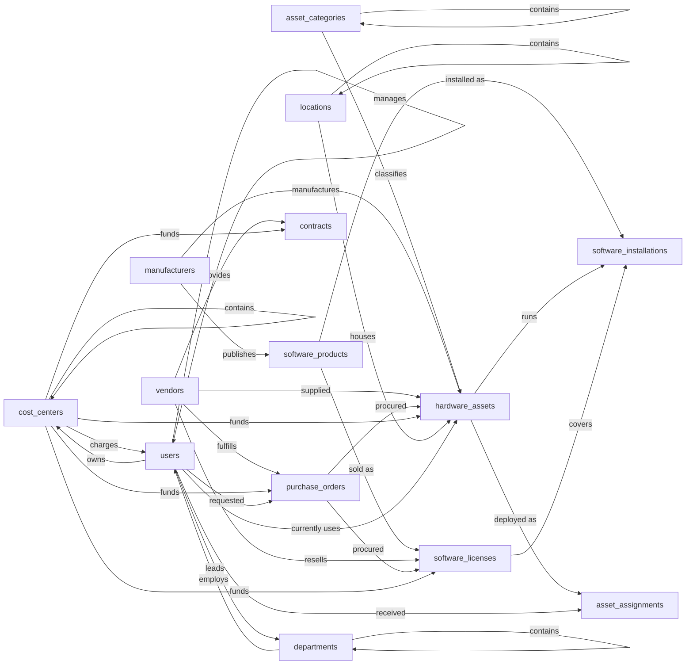

# IT Asset Management, Semantic Model

## 1. Overview

IT Asset Management (ITAM) tracks the hardware, software, and licenses an organization owns or leases, who has them, where they live, what they cost, and which contracts cover them. The model serves IT asset managers (lifecycle, audit, end-of-life), finance (cost tracking, depreciation, chargeback), and procurement (vendor records, purchase orders). Maintenance and incident handling are deliberately deferred to a sibling ITSM module, so this model carries warranty/contract metadata but not service tickets.

## 2. Entity summary

| # | Table name | Singular label | Purpose |
|---|---|---|---|
| 1 | `asset_categories` | Asset Category | Taxonomy for hardware items (laptop, server, monitor, mobile phone, network equipment, etc.) |
| 2 | `manufacturers` | Manufacturer | Companies that make the hardware or publish the software (Dell, Apple, Microsoft, Adobe) |
| 3 | `vendors` | Vendor | Suppliers we purchase from and partners that resell or provide support (CDW, Insight, direct) |
| 4 | `locations` | Location | Physical places where assets live: offices, data centers, warehouses, remote homes, in-transit |
| 5 | `cost_centers` | Cost Center | Financial buckets used for chargeback (Engineering, Sales-EU, Shared Services, etc.) |
| 6 | `departments` | Department | Organizational units that employees belong to (IT, Finance, Sales, Engineering) |
| 7 | `users` | User | People who can be assigned hardware or named-user licenses (employees, contractors) |
| 8 | `hardware_assets` | Hardware Asset | Physical IT items tracked by asset tag and serial number (laptops, servers, monitors, phones) |
| 9 | `software_products` | Software Product | Catalog of software titles tracked in this ITAM (Microsoft 365, Adobe Creative Cloud, AutoCAD) |
| 10 | `software_licenses` | Software License | Entitlements purchased for a software product: type, seats, validity window, cost |
| 11 | `software_installations` | Software Installation | Junction recording which software product is installed on which hardware asset, against which license |
| 12 | `asset_assignments` | Asset Assignment | History of who held a hardware asset, when, and why the assignment ended |
| 13 | `contracts` | Contract | Agreements covering assets: warranty, support, maintenance, SLA, MSA, lease |
| 14 | `purchase_orders` | Purchase Order | Procurement records: what was bought, from whom, when, at what total cost |

### Entity-relationship diagram

## 3. Entities

### 3.1 `asset_categories`, Asset Category

**Plural label:** Asset Categories
**Label column:** `category_name`
**Audit log:** no
**Description:** Hierarchical taxonomy for hardware items so reports can group by type (Laptops, Monitors, Network Equipment, Peripherals, etc.). Categories can nest (Computers > Laptops > Ultrabooks).

**Fields**

| Field name | Format | Required | Label | Reference / Notes |
|---|---|---|---|---|
| `category_name` | `string` | yes | Category Name | unique; label_column |
| `parent_category_id` | `reference` | no | Parent Category | → `asset_categories` (N:1), relationship_label: "contains"; for hierarchies |
| `description` | `text` | no | Description | |

**Relationships**

- An `asset_category` may have many child `asset_categories` (1:N self-reference, via `parent_category_id`).
- An `asset_category` classifies many `hardware_assets` (1:N, via `hardware_assets.asset_category_id`).

---

### 3.2 `manufacturers`, Manufacturer

**Plural label:** Manufacturers
**Label column:** `manufacturer_name`
**Audit log:** no
**Description:** The company that physically makes a hardware item or publishes a software product. Kept separate from `vendors`, because the maker (Dell) is often different from the seller (CDW) and the support provider (a third party).

**Fields**

| Field name | Format | Required | Label | Reference / Notes |
|---|---|---|---|---|
| `manufacturer_name` | `string` | yes | Manufacturer Name | unique; label_column |
| `support_url` | `url` | no | Support URL | |
| `support_phone` | `string` | no | Support Phone | |
| `support_email` | `email` | no | Support Email | |
| `headquarters_country` | `string` | no | Headquarters Country | |

**Relationships**

- A `manufacturer` manufactures many `hardware_assets` (1:N, via `hardware_assets.manufacturer_id`).
- A `manufacturer` publishes many `software_products` (1:N, via `software_products.manufacturer_id`).

---

### 3.3 `vendors`, Vendor

**Plural label:** Vendors
**Label column:** `vendor_name`
**Audit log:** no
**Description:** Suppliers and partners we transact with: hardware resellers, software resellers, managed service providers, distributors. The same legal entity can act as multiple types over time.

**Fields**

| Field name | Format | Required | Label | Reference / Notes |
|---|---|---|---|---|
| `vendor_name` | `string` | yes | Vendor Name | unique; label_column |
| `vendor_type` | `enum` | yes | Vendor Type | values: `reseller`, `manufacturer_direct`, `distributor`, `msp`; default: "reseller" |
| `account_number` | `string` | no | Our Account Number | our account number with this vendor |
| `contact_email` | `email` | no | Contact Email | |
| `contact_phone` | `string` | no | Contact Phone | |
| `website_url` | `url` | no | Website | |
| `is_active` | `boolean` | yes | Active | default: TRUE (auto-default would be FALSE, wrong for new vendors) |

**Relationships**

- A `vendor` supplied many `hardware_assets` (1:N, via `hardware_assets.vendor_id`).
- A `vendor` resells many `software_licenses` (1:N, via `software_licenses.vendor_id`).
- A `vendor` provides many `contracts` (1:N, via `contracts.vendor_id`).
- A `vendor` fulfills many `purchase_orders` (1:N, via `purchase_orders.vendor_id`).

---

### 3.4 `locations`, Location

**Plural label:** Locations
**Label column:** `location_name`
**Audit log:** no
**Description:** Physical places where hardware lives. Hierarchical so a building can contain floors, and a floor can contain rooms or stockrooms.

**Fields**

| Field name | Format | Required | Label | Reference / Notes |
|---|---|---|---|---|
| `location_name` | `string` | yes | Location Name | label_column |
| `location_type` | `enum` | yes | Location Type | values: `office`, `data_center`, `warehouse`, `remote`, `in_transit`, `retired`; default: "office" |
| `address_line_1` | `string` | no | Address Line 1 | |
| `address_line_2` | `string` | no | Address Line 2 | |
| `city` | `string` | no | City | |
| `state_or_region` | `string` | no | State or Region | |
| `postal_code` | `string` | no | Postal Code | |
| `country` | `string` | no | Country | |
| `parent_location_id` | `reference` | no | Parent Location | → `locations` (N:1), relationship_label: "contains" |

**Relationships**

- A `location` may have many child `locations` (1:N self-reference, via `parent_location_id`).
- A `location` houses many `hardware_assets` (1:N, via `hardware_assets.current_location_id`).

---

### 3.5 `cost_centers`, Cost Center

**Plural label:** Cost Centers
**Label column:** `cost_center_code`
**Audit log:** yes
**Description:** Financial buckets that asset and license costs roll up to for chargeback reporting. Hierarchical so departments can roll cost centers up into rollup groups. Independent of `departments` because the two often do not match 1:1.

**Fields**

| Field name | Format | Required | Label | Reference / Notes |
|---|---|---|---|---|
| `cost_center_code` | `string` | yes | Code | unique; label_column; e.g. "ENG-001" |
| `cost_center_name` | `string` | yes | Name | |
| `owner_user_id` | `reference` | no | Owner | → `users` (N:1), relationship_label: "owns" |
| `parent_cost_center_id` | `reference` | no | Parent Cost Center | → `cost_centers` (N:1), relationship_label: "contains" |
| `is_active` | `boolean` | yes | Active | default: TRUE |

**Relationships**

- A `cost_center` may have many child `cost_centers` (1:N self-reference, via `parent_cost_center_id`).
- A `cost_center` charges many `users` (1:N, via `users.cost_center_id`).
- A `cost_center` funds many `hardware_assets`, `software_licenses`, `contracts`, and `purchase_orders` (1:N each).

---

### 3.6 `departments`, Department

**Plural label:** Departments
**Label column:** `department_name`
**Audit log:** no
**Description:** Organizational units employees belong to. Hierarchical so sub-departments can roll up. Lightweight by design, because a deployed `hris` sibling module owns the canonical org structure if present (see §8).

**Fields**

| Field name | Format | Required | Label | Reference / Notes |
|---|---|---|---|---|
| `department_name` | `string` | yes | Department Name | unique; label_column |
| `department_code` | `string` | no | Department Code | unique; e.g. "ENG", "SALES-EU" |
| `manager_user_id` | `reference` | no | Manager | → `users` (N:1), relationship_label: "leads" |
| `parent_department_id` | `reference` | no | Parent Department | → `departments` (N:1), relationship_label: "contains" |
| `is_active` | `boolean` | yes | Active | default: TRUE |

**Relationships**

- A `department` may have many child `departments` (1:N self-reference, via `parent_department_id`).
- A `department` employs many `users` (1:N, via `users.department_id`).
- A `user` leads many `departments` as their manager (1:N, via `departments.manager_user_id`).

---

### 3.7 `users`, User

**Plural label:** Users
**Label column:** `full_name`
**Audit log:** no
**Description:** People who can be assigned hardware or named-user software licenses. Includes employees and contractors. The `users` table name matches the Semantius built-in so the deployer can deduplicate at deploy-time and reuse the existing table; the fields below are the additive set this model needs.

**Fields**

| Field name | Format | Required | Label | Reference / Notes |
|---|---|---|---|---|
| `full_name` | `string` | yes | Full Name | label_column |
| `user_email` | `email` | yes | Email | unique |
| `employee_id` | `string` | no | Employee ID | unique |
| `job_title` | `string` | no | Job Title | |
| `department_id` | `reference` | no | Department | → `departments` (N:1), relationship_label: "employs" |
| `cost_center_id` | `reference` | no | Cost Center | → `cost_centers` (N:1), relationship_label: "charges" |
| `manager_user_id` | `reference` | no | Manager | → `users` (N:1), relationship_label: "manages" |
| `employment_status` | `enum` | yes | Employment Status | values: `active`, `on_leave`, `terminated`, `contractor`; default: "active" |
| `start_date` | `date` | no | Start Date | |
| `end_date` | `date` | no | End Date | |

**Relationships**

- A `user` belongs to one `department` (N:1, via `department_id`).
- A `user` may charge to one `cost_center` (N:1, via `cost_center_id`).
- A `user` reports to one other `user` as manager (N:1 self-reference, via `manager_user_id`).
- A `user` may currently use many `hardware_assets` (denormalized, 1:N via `hardware_assets.current_user_id`).
- A `user` received many `asset_assignments` over time (1:N, via `asset_assignments.assigned_user_id`).
- A `user` requested many `purchase_orders` (1:N, via `purchase_orders.requester_user_id`).

---

### 3.8 `hardware_assets`, Hardware Asset

**Plural label:** Hardware Assets
**Label column:** `asset_tag`
**Audit log:** yes
**Description:** Every physical IT item tracked: laptops, desktops, servers, monitors, mobile phones, tablets, network gear, peripherals. Each row is identified by a unique internal asset tag and ideally a manufacturer serial number. Denormalized `current_user_id` and `current_location_id` are kept here for fast lookups; canonical assignment history lives in `asset_assignments`.

**Fields**

| Field name | Format | Required | Label | Reference / Notes |
|---|---|---|---|---|
| `asset_tag` | `string` | yes | Asset Tag | unique; label_column; internal tracking number |
| `serial_number` | `string` | no | Serial Number | unique |
| `asset_status` | `enum` | yes | Status | values: `in_stock`, `deployed`, `in_repair`, `retired`, `lost`, `disposed`; default: "in_stock" |
| `asset_category_id` | `reference` | yes | Category | → `asset_categories` (N:1), relationship_label: "classifies" |
| `manufacturer_id` | `reference` | yes | Manufacturer | → `manufacturers` (N:1), relationship_label: "manufactures" |
| `model_name` | `string` | yes | Model Name | e.g. "MacBook Pro 14 M3" |
| `model_number` | `string` | no | Model Number | manufacturer SKU |
| `vendor_id` | `reference` | no | Vendor | → `vendors` (N:1), relationship_label: "supplied" |
| `purchase_order_id` | `reference` | no | Purchase Order | → `purchase_orders` (N:1), relationship_label: "procured" |
| `purchase_date` | `date` | no | Purchase Date | |
| `purchase_cost` | `number` | no | Purchase Cost | precision: 2; acquisition cost |
| `current_book_value` | `number` | no | Current Book Value | precision: 2 |
| `depreciation_method` | `enum` | yes | Depreciation Method | values: `straight_line`, `declining_balance`, `none`; default: "straight_line" |
| `useful_life_months` | `integer` | no | Useful Life (months) | |
| `cost_center_id` | `reference` | no | Cost Center | → `cost_centers` (N:1), relationship_label: "funds" |
| `current_location_id` | `reference` | no | Current Location | → `locations` (N:1), relationship_label: "houses" |
| `current_user_id` | `reference` | no | Current User | → `users` (N:1), relationship_label: "currently uses"; denormalized, canonical history is `asset_assignments` |
| `warranty_end_date` | `date` | no | Warranty End Date | |
| `end_of_life_date` | `date` | no | End-of-Life Date | |
| `last_audited_at` | `date-time` | no | Last Audited | |
| `notes` | `text` | no | Notes | |

**Relationships**

- A `hardware_asset` belongs to one `asset_category` (N:1, restrict on delete).
- A `hardware_asset` was made by one `manufacturer` (N:1, restrict on delete).
- A `hardware_asset` was supplied by zero or one `vendor` (N:1, clear on delete).
- A `hardware_asset` was procured via zero or one `purchase_order` (N:1, clear on delete).
- A `hardware_asset` is funded by zero or one `cost_center` (N:1, clear on delete).
- A `hardware_asset` lives at zero or one `location` (N:1, clear on delete).
- A `hardware_asset` is currently used by zero or one `user` (N:1, clear on delete; denormalized).
- A `hardware_asset` runs many `software_installations` (1:N, cascade on delete).
- A `hardware_asset` was deployed as many `asset_assignments` over time (1:N, cascade on delete).

---

### 3.9 `software_products`, Software Product

**Plural label:** Software Products
**Label column:** `product_name`
**Audit log:** no
**Description:** The catalog of software titles this ITAM tracks. One entry per logical product (Microsoft 365, Adobe Creative Cloud, AutoCAD), independent of how many licenses or installs exist for it.

**Fields**

| Field name | Format | Required | Label | Reference / Notes |
|---|---|---|---|---|
| `product_name` | `string` | yes | Product Name | label_column |
| `manufacturer_id` | `reference` | yes | Publisher | → `manufacturers` (N:1), relationship_label: "publishes" |
| `product_version` | `string` | no | Version | |
| `product_type` | `enum` | yes | Product Type | values: `saas`, `subscription`, `perpetual`, `open_source`; default: "subscription" |
| `is_managed` | `boolean` | yes | Managed | default: TRUE; whether actively license-tracked |
| `description` | `text` | no | Description | |

**Relationships**

- A `software_product` is published by one `manufacturer` (N:1, restrict on delete).
- A `software_product` is sold as many `software_licenses` (1:N, restrict on delete on the license side).
- A `software_product` is installed as many `software_installations` (1:N, restrict on delete on the install side).

---

### 3.10 `software_licenses`, Software License

**Plural label:** Software Licenses
**Label column:** `license_name`
**Audit log:** yes
**Description:** A purchased entitlement for a software product. Captures license type, seats purchased, validity window, and cost. Each license can be drawn against by zero or more `software_installations` (the consumption side).

**Fields**

| Field name | Format | Required | Label | Reference / Notes |
|---|---|---|---|---|
| `license_name` | `string` | yes | License Name | label_column; e.g. "MS 365 E5, 100 seats Q1 2026" |
| `software_product_id` | `reference` | yes | Software Product | → `software_products` (N:1), relationship_label: "sold as" |
| `license_key` | `string` | no | License Key | sensitive, populate carefully |
| `vendor_id` | `reference` | no | Vendor | → `vendors` (N:1), relationship_label: "resells" |
| `purchase_order_id` | `reference` | no | Purchase Order | → `purchase_orders` (N:1), relationship_label: "procured" |
| `license_type` | `enum` | yes | License Type | values: `per_user`, `per_device`, `concurrent`, `site`, `enterprise`; default: "per_user" |
| `seats_purchased` | `integer` | yes | Seats Purchased | default: 1 |
| `seats_in_use` | `integer` | no | Seats In Use | denormalized count of active `software_installations` |
| `license_cost` | `number` | no | License Cost (Total) | precision: 2 |
| `annual_cost` | `number` | no | Annual Cost | precision: 2 |
| `cost_center_id` | `reference` | no | Cost Center | → `cost_centers` (N:1), relationship_label: "funds" |
| `start_date` | `date` | no | Start Date | |
| `end_date` | `date` | no | End Date | |
| `auto_renew` | `boolean` | yes | Auto-Renew | default: FALSE |
| `license_status` | `enum` | yes | Status | values: `pending`, `active`, `expired`, `cancelled`; default: "pending" |

**Relationships**

- A `software_license` covers one `software_product` (N:1, restrict on delete).
- A `software_license` was sold by zero or one `vendor` (N:1, clear on delete).
- A `software_license` was procured via zero or one `purchase_order` (N:1, clear on delete).
- A `software_license` is funded by zero or one `cost_center` (N:1, clear on delete).
- A `software_license` covers many `software_installations` (1:N, clear on delete on the install side).

---

### 3.11 `software_installations`, Software Installation

**Plural label:** Software Installations
**Label column:** `installation_label`
**Audit log:** no
**Description:** A junction recording that a specific software product is installed on a specific hardware asset, optionally consuming a seat from a license. The dedicated `installation_label` field exists because junctions need a non-FK string to serve as the human-readable label; populate it as "{product_name} on {asset_tag}" at create time.

**Fields**

| Field name | Format | Required | Label | Reference / Notes |
|---|---|---|---|---|
| `installation_label` | `string` | yes | Installation | label_column; populate as "{product_name} on {asset_tag}" |
| `software_product_id` | `reference` | yes | Software Product | → `software_products` (N:1), relationship_label: "installed as" |
| `hardware_asset_id` | `parent` | yes | Hardware Asset | ↳ `hardware_assets` (N:1, cascade), relationship_label: "runs" |
| `software_license_id` | `reference` | no | License Consumed | → `software_licenses` (N:1), relationship_label: "covers" |
| `installed_version` | `string` | no | Installed Version | |
| `installed_at` | `date-time` | no | Installed At | |
| `uninstalled_at` | `date` | no | Uninstalled At | |
| `installation_status` | `enum` | yes | Status | values: `installed`, `uninstalled`, `suspended`; default: "installed" |

**Relationships**

- A `software_installation` belongs to one `hardware_asset` (N:1 parent, cascade on delete).
- A `software_installation` records one `software_product` (N:1, restrict on delete).
- A `software_installation` may consume one `software_license` (N:1, clear on delete).

---

### 3.12 `asset_assignments`, Asset Assignment

**Plural label:** Asset Assignments
**Label column:** `assignment_label`
**Audit log:** yes
**Description:** A historical record of one hardware asset being assigned to one user, with start and end timestamps. Acts as the canonical "who had what when" log; drives chargeback and audit. The dedicated `assignment_label` field exists because junctions need a non-FK string label; populate it as "{full_name}, {asset_tag} ({assigned_at:date})".

**Fields**

| Field name | Format | Required | Label | Reference / Notes |
|---|---|---|---|---|
| `assignment_label` | `string` | yes | Assignment | label_column; populate as "{full_name}, {asset_tag} ({assigned_at:date})" |
| `hardware_asset_id` | `parent` | yes | Hardware Asset | ↳ `hardware_assets` (N:1, cascade), relationship_label: "deployed as" |
| `assigned_user_id` | `reference` | yes | Assigned To | → `users` (N:1, restrict), relationship_label: "received" |
| `assigned_at` | `date-time` | yes | Assigned At | auto-default: CURRENT_TIMESTAMP |
| `returned_at` | `date-time` | no | Returned At | |
| `return_reason` | `enum` | no | Return Reason | values: `returned`, `transferred`, `lost`, `damaged`, `retired`, `replaced` |
| `assignment_status` | `enum` | yes | Status | values: `active`, `returned`; default: "active" |
| `notes` | `text` | no | Notes | |

**Relationships**

- An `asset_assignment` belongs to one `hardware_asset` (N:1 parent, cascade on delete).
- An `asset_assignment` was given to one `user` (N:1, restrict on delete to preserve history).

---

### 3.13 `contracts`, Contract

**Plural label:** Contracts
**Label column:** `contract_number`
**Audit log:** yes
**Description:** Agreements covering one or more assets: warranty, support, maintenance, MSA, SLA, lease. The model keeps the contract record and its lifecycle here; deeper service-level reporting belongs in an ITSM sibling.

**Fields**

| Field name | Format | Required | Label | Reference / Notes |
|---|---|---|---|---|
| `contract_number` | `string` | yes | Contract Number | unique; label_column |
| `contract_name` | `string` | yes | Contract Name | |
| `contract_type` | `enum` | yes | Contract Type | values: `warranty`, `support`, `maintenance`, `lease`, `msa`, `sla`; default: "support" |
| `vendor_id` | `reference` | yes | Vendor | → `vendors` (N:1, restrict), relationship_label: "provides" |
| `cost_center_id` | `reference` | no | Cost Center | → `cost_centers` (N:1), relationship_label: "funds" |
| `start_date` | `date` | yes | Start Date | UI-required; nullable at DB level per platform rule |
| `end_date` | `date` | yes | End Date | UI-required; nullable at DB level per platform rule |
| `auto_renew` | `boolean` | yes | Auto-Renew | default: FALSE |
| `contract_value` | `number` | no | Contract Value | precision: 2 |
| `annual_cost` | `number` | no | Annual Cost | precision: 2 |
| `contract_status` | `enum` | yes | Status | values: `draft`, `active`, `expired`, `cancelled`, `in_renewal`; default: "draft" |
| `notes` | `text` | no | Notes | |

**Relationships**

- A `contract` is provided by one `vendor` (N:1, restrict on delete).
- A `contract` is funded by zero or one `cost_center` (N:1, clear on delete).

---

### 3.14 `purchase_orders`, Purchase Order

**Plural label:** Purchase Orders
**Label column:** `po_number`
**Audit log:** yes
**Description:** A procurement record for hardware, software, or services. Lightweight in this model: links one PO to its vendor, requester, and totals; line-item granularity is deliberately deferred (see §6.2). Hardware assets and software licenses each link back to their PO directly.

**Fields**

| Field name | Format | Required | Label | Reference / Notes |
|---|---|---|---|---|
| `po_number` | `string` | yes | PO Number | unique; label_column |
| `vendor_id` | `reference` | yes | Vendor | → `vendors` (N:1, restrict), relationship_label: "fulfills" |
| `cost_center_id` | `reference` | no | Cost Center | → `cost_centers` (N:1), relationship_label: "funds" |
| `requester_user_id` | `reference` | no | Requester | → `users` (N:1), relationship_label: "requested" |
| `order_date` | `date` | yes | Order Date | UI-required; nullable at DB level per platform rule |
| `expected_delivery_date` | `date` | no | Expected Delivery | |
| `received_date` | `date` | no | Received Date | |
| `subtotal_amount` | `number` | no | Subtotal | precision: 2 |
| `tax_amount` | `number` | no | Tax | precision: 2 |
| `total_amount` | `number` | yes | Total | precision: 2 |
| `currency_code` | `string` | yes | Currency | ISO 4217 (USD, EUR, GBP); default: "USD" |
| `po_status` | `enum` | yes | Status | values: `draft`, `submitted`, `approved`, `ordered`, `partially_received`, `received`, `cancelled`; default: "draft" |
| `notes` | `text` | no | Notes | |

**Relationships**

- A `purchase_order` is fulfilled by one `vendor` (N:1, restrict on delete).
- A `purchase_order` is funded by zero or one `cost_center` (N:1, clear on delete).
- A `purchase_order` was requested by zero or one `user` (N:1, clear on delete).
- A `purchase_order` procured many `hardware_assets` and `software_licenses` (1:N each, clear on delete on the child side).

## 4. Relationship summary

| From | Field | To | Cardinality | Kind | Delete behavior |
|---|---|---|---|---|---|
| `asset_categories` | `parent_category_id` | `asset_categories` | N:1 | reference | clear |
| `locations` | `parent_location_id` | `locations` | N:1 | reference | clear |
| `cost_centers` | `parent_cost_center_id` | `cost_centers` | N:1 | reference | clear |
| `cost_centers` | `owner_user_id` | `users` | N:1 | reference | clear |
| `departments` | `parent_department_id` | `departments` | N:1 | reference | clear |
| `departments` | `manager_user_id` | `users` | N:1 | reference | clear |
| `users` | `department_id` | `departments` | N:1 | reference | clear |
| `users` | `cost_center_id` | `cost_centers` | N:1 | reference | clear |
| `users` | `manager_user_id` | `users` | N:1 | reference | clear |
| `hardware_assets` | `asset_category_id` | `asset_categories` | N:1 | reference | restrict |
| `hardware_assets` | `manufacturer_id` | `manufacturers` | N:1 | reference | restrict |
| `hardware_assets` | `vendor_id` | `vendors` | N:1 | reference | clear |
| `hardware_assets` | `purchase_order_id` | `purchase_orders` | N:1 | reference | clear |
| `hardware_assets` | `cost_center_id` | `cost_centers` | N:1 | reference | clear |
| `hardware_assets` | `current_location_id` | `locations` | N:1 | reference | clear |
| `hardware_assets` | `current_user_id` | `users` | N:1 | reference | clear |
| `software_products` | `manufacturer_id` | `manufacturers` | N:1 | reference | restrict |
| `software_licenses` | `software_product_id` | `software_products` | N:1 | reference | restrict |
| `software_licenses` | `vendor_id` | `vendors` | N:1 | reference | clear |
| `software_licenses` | `purchase_order_id` | `purchase_orders` | N:1 | reference | clear |
| `software_licenses` | `cost_center_id` | `cost_centers` | N:1 | reference | clear |
| `software_installations` | `hardware_asset_id` | `hardware_assets` | N:1 | parent | cascade |
| `software_installations` | `software_product_id` | `software_products` | N:1 | reference | restrict |
| `software_installations` | `software_license_id` | `software_licenses` | N:1 | reference | clear |
| `asset_assignments` | `hardware_asset_id` | `hardware_assets` | N:1 | parent | cascade |
| `asset_assignments` | `assigned_user_id` | `users` | N:1 | reference | restrict |
| `contracts` | `vendor_id` | `vendors` | N:1 | reference | restrict |
| `contracts` | `cost_center_id` | `cost_centers` | N:1 | reference | clear |
| `purchase_orders` | `vendor_id` | `vendors` | N:1 | reference | restrict |
| `purchase_orders` | `cost_center_id` | `cost_centers` | N:1 | reference | clear |
| `purchase_orders` | `requester_user_id` | `users` | N:1 | reference | clear |

## 5. Enumerations

### 5.1 `vendors.vendor_type`
- `reseller`
- `manufacturer_direct`
- `distributor`
- `msp`

### 5.2 `locations.location_type`
- `office`
- `data_center`
- `warehouse`
- `remote`
- `in_transit`
- `retired`

### 5.3 `users.employment_status`
- `active`
- `on_leave`
- `terminated`
- `contractor`

### 5.4 `hardware_assets.asset_status`
- `in_stock`
- `deployed`
- `in_repair`
- `retired`
- `lost`
- `disposed`

### 5.5 `hardware_assets.depreciation_method`
- `straight_line`
- `declining_balance`
- `none`

### 5.6 `software_products.product_type`
- `saas`
- `subscription`
- `perpetual`
- `open_source`

### 5.7 `software_licenses.license_type`
- `per_user`
- `per_device`
- `concurrent`
- `site`
- `enterprise`

### 5.8 `software_licenses.license_status`
- `pending`
- `active`
- `expired`
- `cancelled`

### 5.9 `software_installations.installation_status`
- `installed`
- `uninstalled`
- `suspended`

### 5.10 `asset_assignments.return_reason`
- `returned`
- `transferred`
- `lost`
- `damaged`
- `retired`
- `replaced`

### 5.11 `asset_assignments.assignment_status`
- `active`
- `returned`

### 5.12 `contracts.contract_type`
- `warranty`
- `support`
- `maintenance`
- `lease`
- `msa`
- `sla`

### 5.13 `contracts.contract_status`
- `draft`
- `active`
- `expired`
- `cancelled`
- `in_renewal`

### 5.14 `purchase_orders.po_status`
- `draft`
- `submitted`
- `approved`
- `ordered`
- `partially_received`
- `received`
- `cancelled`

## 6. Open questions

### 6.1 🔴 Decisions needed (blockers)

None.

### 6.2 🟡 Future considerations (deferred scope)

- Should `current_user_id` on `hardware_assets` and `seats_in_use` on `software_licenses` remain materialized fields, or be replaced with computed/view-backed projections once the platform supports them, to eliminate drift risk versus `asset_assignments` and `software_installations` as the canonical sources?
- Should `purchase_order_lines` be added as a separate entity to support multi-asset POs, partial receipts at line level, and per-line discounts/tax, when the simpler one-PO-to-many-assets model becomes too coarse?
- Should `software_assignments` (user ↔ license) be added when named-user SaaS licenses (Adobe, Salesforce, Figma) need explicit per-user entitlement tracking, instead of relying on `software_installations` to imply consumption?
- Should `maintenance_records` be reintroduced inside ITAM as a lightweight service log if the organization decides to keep service history alongside assets rather than fully delegating to the ITSM sibling?
- Should `cost_centers` and `departments` be merged into a single `org_units` entity if the organization adopts a unified org-and-finance hierarchy, or kept distinct because finance-driven cost centers and HR-driven departments evolve independently?
- Should asset auto-discovery (network scan, MDM agent ingest) be modeled with a separate `discovery_records` entity to capture raw discovery events before they are reconciled into `hardware_assets`?
- Should `depreciation_method`, `current_book_value`, `useful_life_months`, and `purchase_cost` be dropped from `hardware_assets` and read instead from the linked `fixed_assets.asset_records` row when a fixed-asset accounting module is deployed alongside ITAM?

## 7. Implementation notes for the downstream agent

A short checklist for the agent who will materialize this model in Semantius:

1. Create one module named `itam` (the module name **must** equal the `system_slug` from the front-matter, do not invent a different module slug here) and two baseline permissions (`itam:read`, `itam:manage`) before any entity.
2. Create entities in the order given in §2, entities referenced by others first. Note that `users` will be deduplicated against the Semantius built-in (see step 6).
3. For each entity: set `label_column` to the snake_case field marked as label_column in §3, pass `module_id`, `view_permission`, `edit_permission`, and `audit_log` (true for `cost_centers`, `hardware_assets`, `software_licenses`, `asset_assignments`, `contracts`, `purchase_orders`; false elsewhere). Do not manually create `id`, `created_at`, `updated_at`, or the auto-label field.
4. For each field in §3: pass `table_name`, `field_name`, `format`, `title` (the Label column), and for `reference`/`parent` fields also `reference_table`, a `reference_delete_mode` consistent with §4, and the `relationship_label` annotated in §3 Notes. Pair `format: "number"` with `precision: 2` for every monetary field.
5. **Fix up each entity's auto-created label-column field title.** `create_entity` auto-creates a field whose `field_name` equals the entity's `label_column`, and its `title` defaults to `singular_label`. Every entity in this model has a §3 Label on the label_column row that differs from `singular_label` (e.g. entity `vendors` with `singular_label: "Vendor"` and label_column `vendor_name` should display as `"Vendor Name"`). For each affected entity, follow up with `update_field` using the composite string id `"{table_name}.{field_name}"` (e.g. `"vendors.vendor_name"`, passed as a string not an integer) to set the correct title. Apply this for: `asset_categories.category_name`, `manufacturers.manufacturer_name`, `vendors.vendor_name`, `locations.location_name`, `cost_centers.cost_center_code`, `departments.department_name`, `users.full_name`, `hardware_assets.asset_tag`, `software_products.product_name`, `software_licenses.license_name`, `software_installations.installation_label`, `asset_assignments.assignment_label`, `contracts.contract_number`, `purchase_orders.po_number`.
6. **Deduplicate against Semantius built-in tables.** This model declares `users` for self-containment. The Semantius built-in `users` table already exists, so skip the local `create_entity` for `users` and reuse the built-in as the `reference_table` target for every FK in this model that points at `users`. Optionally add the model's missing fields (`employee_id`, `job_title`, `department_id`, `cost_center_id`, `manager_user_id`, `employment_status`, `start_date`, `end_date`) to the built-in only if they are not already present, additive only.
7. **Reconcile against related modules (§8).** Walk the front-matter `related_models` array. For each sibling slug already deployed: apply **Defers to sibling** entries the same way as built-in dedup (skip the local create, rewire FKs); propose **Expects on sibling** entries as additive FKs on the sibling's tables (always user-confirmed, never auto-applied); index **Exposes** entries for future sibling deploys. All cross-module changes are additive only; declines persist on sibling module metadata so the same proposal does not reappear on every redeploy.
8. After creation, spot-check that `label_column` on each entity resolves to a real field, that all `reference_table` targets exist, and that every monetary field has `precision: 2`.

## 8. Related domains

This model is one atomic piece of a broader enterprise model. The entries below tell the deployer which sibling modules to look for, what entities are shared with each, and what cross-module FKs to propose so the deployed schema closes silos instead of duplicating master data. Each sub-section uses three keys (Exposes, Expects on sibling, Defers to sibling).

### 8.1 `itsm`, IT Service Management

**Relationship:** peer (downstream consumer of asset data; ITAM owns the asset, ITSM owns the ticket).

**Exposes:** `hardware_assets`, `software_installations` (the configuration items that ITSM tickets are raised against).

**Expects on sibling:**
- `itsm.incidents.affected_asset_id → itam.hardware_assets` (N:1, clear); allows incidents to point at the affected device.
- `itsm.changes.affected_asset_id → itam.hardware_assets` (N:1, clear); allows change requests to scope by asset.
- `itsm.problems.affected_asset_id → itam.hardware_assets` (N:1, clear); allows problem records to link to the asset.

**Defers to sibling:**
- none. ITAM does not duplicate ticket/incident records; service history and break/fix workflows are owned wholly by `itsm`.

### 8.2 `cmdb`, Configuration Management Database

**Relationship:** peer (downstream consumer; CMDB models the logical configuration item, ITAM owns the physical asset record).

**Exposes:** `hardware_assets` (the physical record CIs anchor to).

**Expects on sibling:**
- `cmdb.configuration_items.hardware_asset_id → itam.hardware_assets` (N:1, clear); lets a CI anchor to the underlying physical asset.
- `cmdb.configuration_items.software_installation_id → itam.software_installations` (N:1, clear); lets a software-class CI anchor to its install record.

**Defers to sibling:**
- none. ITAM tracks the physical asset; CMDB owns the logical CI graph (relationships, services, dependencies). When both are deployed, ITSM links to CMDB CIs and CMDB CIs link back to ITAM assets via the FKs above.

### 8.3 `software_asset_management`, Software Asset Management

**Relationship:** peer (downstream consumer of license and installation data; SAM does the deep entitlement math, ITAM holds the operational records).

**Exposes:** `software_products`, `software_licenses`, `software_installations` (SAM reads these as the source of truth for the effective license position).

**Expects on sibling:**
- `software_asset_management.entitlement_positions.software_license_id → itam.software_licenses` (N:1, restrict); SAM's reconciled position rows reference the underlying license.
- `software_asset_management.compliance_findings.software_product_id → itam.software_products` (N:1, restrict); SAM's audit/compliance findings reference the product.

**Defers to sibling:**
- none. ITAM keeps the basic license register; if SAM later needs to extend `software_licenses` with deeper metric fields (PVU, vCPU, named-user assignments), those should be proposed as additive extensions on the ITAM table rather than duplicated.

### 8.4 `fixed_assets`, Fixed Asset Accounting

**Relationship:** peer (downstream consumer; fixed_assets owns the accounting view of an asset, ITAM owns the operational record).

**Exposes:** `hardware_assets`.

**Expects on sibling:**
- `fixed_assets.asset_records.hardware_asset_id → itam.hardware_assets` (N:1, restrict); the finance asset record anchors to the operational hardware record.

**Defers to sibling:**
- none. ITAM keeps `depreciation_method`, `current_book_value`, `useful_life_months`, and `purchase_cost` on `hardware_assets` as a self-contained operational baseline. If the organization wants `fixed_assets` to own the canonical depreciation schedule, those fields can be deferred additively at deploy time, see §6.2.

### 8.5 `hris`, Human Resources Information System

**Relationship:** upstream (canonical owner of employee and org-structure data when deployed).

**Exposes:** none. ITAM consumes from HRIS, it does not expose org records back.

**Expects on sibling:** none.

**Defers to sibling:**
- `itam.users` should be reused from `hris.employees` if deployed. The deployer should skip creating the local table and rewire every FK in this model that points at `users`. Any ITAM-specific fields not present on the HRIS table (`employee_id`, `job_title`, `department_id`, `cost_center_id`, `manager_user_id`, `employment_status`, `start_date`, `end_date`) should be proposed as additive extensions.
- `itam.departments` should be reused from `hris.departments` if deployed. The deployer should skip the local table and rewire `users.department_id` and `departments.parent_department_id` to the HRIS table.

### 8.6 `org_management`, Organizational and Financial Hierarchy

**Relationship:** upstream (canonical owner of cost-center hierarchies when deployed; alternative or complement to `hris`).

**Exposes:** none.

**Expects on sibling:** none.

**Defers to sibling:**
- `itam.cost_centers` should be reused from `org_management.cost_centers` if deployed. The deployer should skip the local table and rewire every FK in this model that points at `cost_centers`. Any ITAM-specific fields not present on the org_management table should be proposed as additive extensions.

### 8.7 `contract_management`, Contract Lifecycle Management

**Relationship:** upstream (canonical owner of contracts and contract lifecycle when deployed).

**Exposes:** none.

**Expects on sibling:** none.

**Defers to sibling:**
- `itam.contracts` should be reused from `contract_management.contracts` if deployed. The deployer should skip the local table and rewire every FK in this model that points at `contracts`. ITAM-specific contract types (`warranty`, `lease`, `sla`) and the `auto_renew` / `annual_cost` fields should be proposed as additive `enum_values` and column extensions on the CLM table if missing.

### 8.8 `procurement`, Procurement and Vendor Management

**Relationship:** upstream (canonical owner of vendor master and purchase-order workflow when deployed).

**Exposes:** none.

**Expects on sibling:** none.

**Defers to sibling:**
- `itam.vendors` should be reused from `procurement.vendors` if deployed. The deployer should skip the local table and rewire every FK in this model that points at `vendors`.
- `itam.purchase_orders` should be reused from `procurement.purchase_orders` if deployed. The deployer should skip the local table and rewire every FK in this model that points at `purchase_orders`. ITAM-specific fields (`requester_user_id`, `currency_code`) should be proposed as additive extensions if missing.
