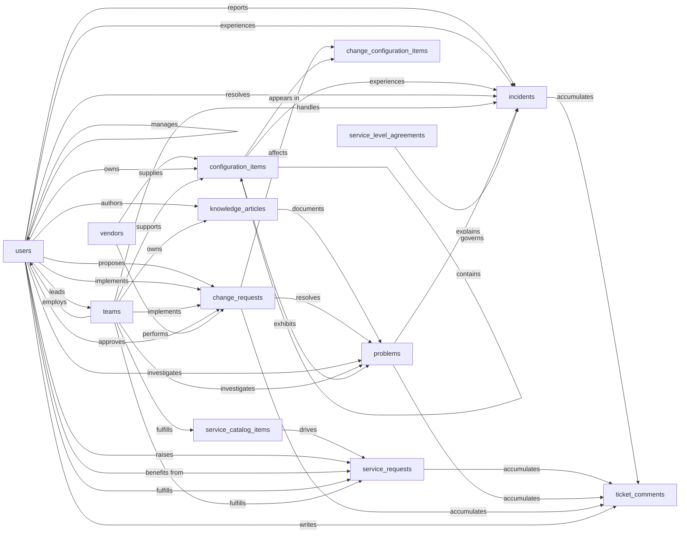

# IT Service Management — Semantic Model

## 1. Overview

An IT Service Management (ITSM) system that captures the four core ITIL processes (incident, problem, change, service request) on top of a configuration management database (CMDB) and a service catalog. Used by IT support agents, engineers, change managers, and end users across an organization. The system answers questions like "what is broken right now", "what caused the recurring printer outages last quarter", "what changes are scheduled for tonight's maintenance window", and "how do I request a new laptop".

## 2. Entity summary

| # | Table name | Singular label | Purpose |
|---|---|---|---|
| 1 | `users` | User | Everyone in the system: end users who raise tickets, IT agents who resolve them, managers who approve changes. |
| 2 | `teams` | Team | IT support groups and queues that own categories of work (Service Desk, Network, DBA, Security). |
| 3 | `vendors` | Vendor | External providers (hardware OEMs, SaaS vendors, MSPs) referenced from CIs and changes. |
| 4 | `configuration_items` | Configuration Item | The CMDB: every hardware, software, or service component IT manages and that incidents and changes reference. |
| 5 | `service_catalog_items` | Service Catalog Item | Definitions of standard requestable services (new laptop, VPN access, software install). |
| 6 | `service_requests` | Service Request | Instances of a user requesting a catalog item, with its own approval and fulfillment lifecycle. |
| 7 | `incidents` | Incident | Unplanned interruptions or quality degradations in a service. |
| 8 | `problems` | Problem | Underlying root causes that explain one or more incidents. |
| 9 | `change_requests` | Change Request | Planned additions, modifications, or removals affecting CIs, with risk, schedule, and approval. |
| 10 | `change_configuration_items` | Change CI | Junction: which CIs are affected by a given change request (M:N). |
| 11 | `knowledge_articles` | Knowledge Article | Documented solutions, runbooks, FAQs, known errors used for self-service and agent reference. |
| 12 | `service_level_agreements` | Service Level Agreement | Response and resolution time targets keyed off ticket type and priority. |
| 13 | `ticket_comments` | Ticket Comment | Public replies and internal work-notes on incidents, service requests, problems, and changes. |

### Entity-relationship diagram

## 3. Entities

### 3.1 `users` — User

**Plural label:** Users
**Label column:** `user_name`  _(the human-identifying field; auto-wired by Semantius)_
**Audit log:** no
**Description:** A person who interacts with the ITSM system: an end user raising tickets, an IT agent resolving them, or a manager approving changes. The `is_agent` flag distinguishes IT staff from regular users.

**Fields**

| Field name | Format | Required | Label | Reference / Notes |
|---|---|---|---|---|
| `user_name` | `string` | yes | Full Name | label_column |
| `email` | `email` | yes | Email | unique |
| `employee_id` | `string` | no | Employee ID | |
| `job_title` | `string` | no | Job Title | |
| `department` | `string` | no | Department | |
| `primary_team_id` | `reference` | no | Primary Team | → `teams` (N:1), relationship_label: "employs" |
| `manager_user_id` | `reference` | no | Manager | → `users` (N:1, self-ref), relationship_label: "manages" |
| `is_agent` | `boolean` | yes | Is IT Agent | auto-default `FALSE` |
| `is_active` | `boolean` | yes | Active | default: "true" |
| `phone` | `string` | no | Phone | |
| `location` | `string` | no | Location | |

**Relationships**

- A `user` may belong to one primary `team` (N:1, optional, clear on team delete).
- A `user` may report to one manager `user` (N:1, self-ref, optional, clear on manager delete).

### 3.2 `teams` — Team

**Plural label:** Teams
**Label column:** `team_name`
**Audit log:** no
**Description:** An IT support group or queue that owns a category of work. Teams pick up tickets, fulfill catalog items, support CIs, and own knowledge articles.

**Fields**

| Field name | Format | Required | Label | Reference / Notes |
|---|---|---|---|---|
| `team_name` | `string` | yes | Team Name | label_column, unique |
| `description` | `text` | no | Description | |
| `team_lead_user_id` | `reference` | no | Team Lead | → `users` (N:1), relationship_label: "leads" |
| `email_alias` | `email` | no | Team Email | |
| `is_active` | `boolean` | yes | Active | default: "true" |

**Relationships**

- A `team` may have one lead `user` (N:1, optional, clear on user delete).
- A `team` may have many `users` as members via `users.primary_team_id` (1:N).

### 3.3 `vendors` — Vendor

**Plural label:** Vendors
**Label column:** `vendor_name`
**Audit log:** yes
**Description:** An external provider that supplies CIs (hardware, software, SaaS) or performs changes. Used for asset attribution, support escalation, and contract context.

**Fields**

| Field name | Format | Required | Label | Reference / Notes |
|---|---|---|---|---|
| `vendor_name` | `string` | yes | Vendor Name | label_column, unique |
| `vendor_type` | `enum` | yes | Vendor Type | values: `hardware`, `software`, `saas`, `telco`, `msp`, `other`; default: "software" |
| `contact_name` | `string` | no | Primary Contact | |
| `contact_email` | `email` | no | Contact Email | |
| `contact_phone` | `string` | no | Contact Phone | |
| `website` | `url` | no | Website | |
| `support_url` | `url` | no | Support Portal URL | |
| `account_number` | `string` | no | Account Number | |
| `is_active` | `boolean` | yes | Active | default: "true" |

**Relationships**

- A `vendor` may supply many `configuration_items` (1:N, via `configuration_items.vendor_id`).
- A `vendor` may perform many `change_requests` (1:N, via `change_requests.vendor_id`).

### 3.4 `configuration_items` — Configuration Item

**Plural label:** Configuration Items
**Label column:** `ci_name`
**Audit log:** yes
**Description:** A hardware, software, or service component tracked in the CMDB. CIs are the targets of incidents (something is broken on this CI) and changes (this CI is being modified).

**Fields**

| Field name | Format | Required | Label | Reference / Notes |
|---|---|---|---|---|
| `ci_name` | `string` | yes | Name | label_column, unique |
| `ci_type` | `enum` | yes | Type | values: `service`, `application`, `database`, `server`, `workstation`, `laptop`, `network_device`, `license`, `other`; default: "service" |
| `environment` | `enum` | yes | Environment | values: `production`, `staging`, `development`, `test`, `dr`; default: "production" |
| `status` | `enum` | yes | Status | values: `planned`, `in_stock`, `deployed`, `in_maintenance`, `retired`; default: "planned" |
| `serial_number` | `string` | no | Serial Number | |
| `asset_tag` | `string` | no | Asset Tag | |
| `ip_address` | `string` | no | IP Address | |
| `hostname` | `string` | no | Hostname | |
| `vendor_id` | `reference` | no | Vendor | → `vendors` (N:1), relationship_label: "supplies" |
| `owner_user_id` | `reference` | no | Business Owner | → `users` (N:1), relationship_label: "owns" |
| `support_team_id` | `reference` | no | Support Team | → `teams` (N:1), relationship_label: "supports" |
| `parent_ci_id` | `reference` | no | Parent CI | → `configuration_items` (N:1, self-ref), relationship_label: "contains" |
| `location` | `string` | no | Location | |
| `purchase_date` | `date` | no | Purchase Date | |
| `warranty_expires_at` | `date` | no | Warranty Expiration | |
| `description` | `text` | no | Description | |

**Relationships**

- A `configuration_item` may be supplied by one `vendor` (N:1, optional, clear on vendor delete).
- A `configuration_item` may be owned by one business-owner `user` (N:1, optional, clear).
- A `configuration_item` may be supported by one `team` (N:1, optional, clear).
- A `configuration_item` may have one parent `configuration_item` (N:1, self-ref, optional, clear), forming a service-component hierarchy.
- A `configuration_item` may be referenced by many `incidents`, `problems`, and `change_configuration_items` rows.

### 3.5 `service_catalog_items` — Service Catalog Item

**Plural label:** Service Catalog Items
**Label column:** `catalog_item_name`
**Audit log:** yes
**Description:** A definition of a standard requestable service (new laptop, VPN access, software install). End users browse the catalog and raise service requests against these items.

**Fields**

| Field name | Format | Required | Label | Reference / Notes |
|---|---|---|---|---|
| `catalog_item_name` | `string` | yes | Name | label_column, unique |
| `short_description` | `string` | no | Short Description | |
| `description` | `text` | no | Full Description | |
| `category` | `enum` | yes | Category | values: `hardware`, `software`, `access`, `telecom`, `facilities`, `hr_services`, `other`; default: "software" |
| `delivery_team_id` | `reference` | no | Delivery Team | → `teams` (N:1), relationship_label: "fulfills" |
| `target_delivery_days` | `integer` | no | Target Delivery (Days) | |
| `requires_approval` | `boolean` | yes | Requires Approval | auto-default `FALSE` |
| `price` | `number` | no | Price | precision: 2 (monetary) |
| `is_active` | `boolean` | yes | Active | default: "true" |

**Relationships**

- A `service_catalog_item` may be fulfilled by one delivery `team` (N:1, optional, clear).
- A `service_catalog_item` may drive many `service_requests` (1:N, via `service_requests.catalog_item_id`, restrict on delete).

### 3.6 `service_requests` — Service Request

**Plural label:** Service Requests
**Label column:** `request_number`
**Audit log:** yes
**Description:** An instance of a user requesting a catalog item. Has its own approval, fulfillment, and closure lifecycle, separate from incidents.

**Fields**

| Field name | Format | Required | Label | Reference / Notes |
|---|---|---|---|---|
| `request_number` | `string` | yes | Request Number | label_column, unique (e.g. `SR-00001`) |
| `catalog_item_id` | `reference` | yes | Catalog Item | → `service_catalog_items` (N:1), relationship_label: "drives" |
| `requested_by_user_id` | `reference` | yes | Requested By | → `users` (N:1), relationship_label: "raises" |
| `requested_for_user_id` | `reference` | no | Requested For | → `users` (N:1), relationship_label: "benefits from" |
| `assigned_to_user_id` | `reference` | no | Assigned To | → `users` (N:1), relationship_label: "fulfills" |
| `assigned_team_id` | `reference` | no | Assigned Team | → `teams` (N:1), relationship_label: "fulfills" |
| `short_description` | `string` | yes | Short Description | |
| `description` | `text` | no | Description | |
| `status` | `enum` | yes | Status | values: `new`, `approval_pending`, `approved`, `in_progress`, `fulfilled`, `closed`, `cancelled`; default: "new" |
| `priority` | `enum` | yes | Priority | values: `p4_low`, `p3_normal`, `p2_high`, `p1_critical`; default: "p3_normal" |
| `requested_at` | `date-time` | yes | Requested At | |
| `approved_at` | `date-time` | no | Approved At | |
| `fulfilled_at` | `date-time` | no | Fulfilled At | |
| `closed_at` | `date-time` | no | Closed At | |
| `due_date` | `date` | no | Due Date | |

**Relationships**

- A `service_request` is for exactly one `service_catalog_item` (N:1, required, restrict on delete).
- A `service_request` is raised by one requester `user` (N:1, required, clear on delete).
- A `service_request` may be raised on behalf of one beneficiary `user` (N:1, optional, clear).
- A `service_request` may be assigned to one `user` and one `team` (N:1 each, optional, clear).
- A `service_request` accumulates many `ticket_comments` (1:N, via `ticket_comments.service_request_id`, cascade on delete).

### 3.7 `incidents` — Incident

**Plural label:** Incidents
**Label column:** `incident_number`
**Audit log:** yes
**Description:** An unplanned interruption or quality degradation in a service. Reported by a user (or detected by monitoring), assigned to a team, resolved by an agent, optionally rolled up to a problem if a recurring root cause is suspected.

**Fields**

| Field name | Format | Required | Label | Reference / Notes |
|---|---|---|---|---|
| `incident_number` | `string` | yes | Incident Number | label_column, unique (e.g. `INC-00001`) |
| `short_description` | `string` | yes | Short Description | |
| `description` | `text` | no | Description | |
| `reported_by_user_id` | `reference` | yes | Reported By | → `users` (N:1), relationship_label: "reports" |
| `affected_user_id` | `reference` | no | Affected User | → `users` (N:1), relationship_label: "experiences" |
| `affected_configuration_item_id` | `reference` | no | Affected CI | → `configuration_items` (N:1), relationship_label: "experiences" |
| `assigned_to_user_id` | `reference` | no | Assigned To | → `users` (N:1), relationship_label: "resolves" |
| `assigned_team_id` | `reference` | no | Assigned Team | → `teams` (N:1), relationship_label: "handles" |
| `problem_id` | `reference` | no | Related Problem | → `problems` (N:1), relationship_label: "explains" |
| `impact` | `enum` | yes | Impact | values: `low`, `medium`, `high`; default: "medium" |
| `urgency` | `enum` | yes | Urgency | values: `low`, `medium`, `high`; default: "medium" |
| `priority` | `enum` | yes | Priority | values: `p4_low`, `p3_normal`, `p2_high`, `p1_critical`; default: "p3_normal" |
| `status` | `enum` | yes | Status | values: `new`, `assigned`, `in_progress`, `on_hold`, `resolved`, `closed`, `cancelled`; default: "new" |
| `resolution_category` | `enum` | no | Resolution Category | values: `solved`, `workaround`, `duplicate`, `no_fault_found`, `user_error`, `configuration_change` |
| `resolution_notes` | `text` | no | Resolution Notes | |
| `reported_at` | `date-time` | yes | Reported At | |
| `resolved_at` | `date-time` | no | Resolved At | |
| `closed_at` | `date-time` | no | Closed At | |
| `sla_id` | `reference` | no | Applied SLA | → `service_level_agreements` (N:1), relationship_label: "governs" |
| `sla_response_due_at` | `date-time` | no | Response Due | |
| `sla_resolution_due_at` | `date-time` | no | Resolution Due | |
| `sla_breached` | `boolean` | yes | SLA Breached | auto-default `FALSE` |

**Relationships**

- An `incident` is reported by one `user` (N:1, required, clear on delete).
- An `incident` may concern one affected `user` and one affected `configuration_item` (N:1 each, optional, clear).
- An `incident` may be assigned to one `user` and one `team` (N:1 each, optional, clear).
- An `incident` may roll up to one `problem` (N:1, optional, clear).
- An `incident` may be governed by one `service_level_agreement` (N:1, optional, clear).
- An `incident` accumulates many `ticket_comments` (1:N, cascade on delete).

### 3.8 `problems` — Problem

**Plural label:** Problems
**Label column:** `problem_number`
**Audit log:** yes
**Description:** An underlying root cause that explains one or more incidents. Investigated by a team, optionally documented in a known-error knowledge article, and ultimately resolved by a change request.

**Fields**

| Field name | Format | Required | Label | Reference / Notes |
|---|---|---|---|---|
| `problem_number` | `string` | yes | Problem Number | label_column, unique (e.g. `PRB-00001`) |
| `short_description` | `string` | yes | Short Description | |
| `description` | `text` | no | Description | |
| `root_cause` | `text` | no | Root Cause | |
| `workaround` | `text` | no | Workaround | |
| `known_error_article_id` | `reference` | no | Known-Error Article | → `knowledge_articles` (N:1), relationship_label: "documents" |
| `resolution_change_request_id` | `reference` | no | Resolved By Change | → `change_requests` (N:1), relationship_label: "resolves" |
| `assigned_to_user_id` | `reference` | no | Assigned To | → `users` (N:1), relationship_label: "investigates" |
| `assigned_team_id` | `reference` | no | Assigned Team | → `teams` (N:1), relationship_label: "investigates" |
| `affected_configuration_item_id` | `reference` | no | Affected CI | → `configuration_items` (N:1), relationship_label: "exhibits" |
| `priority` | `enum` | yes | Priority | values: `p4_low`, `p3_normal`, `p2_high`, `p1_critical`; default: "p3_normal" |
| `status` | `enum` | yes | Status | values: `new`, `investigating`, `root_cause_known`, `workaround_available`, `resolved`, `closed`; default: "new" |
| `opened_at` | `date-time` | yes | Opened At | |
| `resolved_at` | `date-time` | no | Resolved At | |
| `closed_at` | `date-time` | no | Closed At | |

**Relationships**

- A `problem` may be documented by one `knowledge_article` (N:1, optional, clear).
- A `problem` may be resolved by one `change_request` (N:1, optional, clear).
- A `problem` may be assigned to one `user` and one `team` (N:1 each, optional, clear).
- A `problem` may concern one affected `configuration_item` (N:1, optional, clear).
- A `problem` may explain many `incidents` (1:N, via `incidents.problem_id`, clear on delete).
- A `problem` accumulates many `ticket_comments` (1:N, cascade on delete).

### 3.9 `change_requests` — Change Request

**Plural label:** Change Requests
**Label column:** `change_number`
**Audit log:** yes
**Description:** A planned addition, modification, or removal affecting one or more CIs. Carries risk and impact assessments, an implementation plan, a rollback plan, an approver, and scheduled execution windows.

**Fields**

| Field name | Format | Required | Label | Reference / Notes |
|---|---|---|---|---|
| `change_number` | `string` | yes | Change Number | label_column, unique (e.g. `CHG-00001`) |
| `short_description` | `string` | yes | Short Description | |
| `description` | `text` | no | Description | |
| `change_type` | `enum` | yes | Change Type | values: `standard`, `normal`, `emergency`; default: "normal" |
| `risk` | `enum` | yes | Risk Level | values: `low`, `medium`, `high`; default: "medium" |
| `impact` | `enum` | yes | Impact | values: `low`, `medium`, `high`; default: "medium" |
| `status` | `enum` | yes | Status | values: `draft`, `approval_pending`, `approved`, `scheduled`, `in_progress`, `implemented`, `review`, `closed`, `cancelled`, `failed`; default: "draft" |
| `requested_by_user_id` | `reference` | yes | Requested By | → `users` (N:1), relationship_label: "proposes" |
| `assigned_to_user_id` | `reference` | no | Assigned To | → `users` (N:1), relationship_label: "implements" |
| `assigned_team_id` | `reference` | no | Assigned Team | → `teams` (N:1), relationship_label: "implements" |
| `approver_user_id` | `reference` | no | Approver | → `users` (N:1), relationship_label: "approves" |
| `vendor_id` | `reference` | no | Vendor | → `vendors` (N:1), relationship_label: "performs" |
| `planned_start_at` | `date-time` | no | Planned Start | |
| `planned_end_at` | `date-time` | no | Planned End | |
| `actual_start_at` | `date-time` | no | Actual Start | |
| `actual_end_at` | `date-time` | no | Actual End | |
| `implementation_plan` | `text` | no | Implementation Plan | |
| `rollback_plan` | `text` | no | Rollback Plan | |
| `test_plan` | `text` | no | Test Plan | |
| `post_implementation_notes` | `text` | no | Post-Implementation Notes | |

**Relationships**

- A `change_request` is proposed by one requester `user` (N:1, required, clear on delete).
- A `change_request` may be assigned to one implementer `user` and one `team` (N:1 each, optional, clear).
- A `change_request` may be approved by one approver `user` (N:1, optional, clear).
- A `change_request` may be performed by one external `vendor` (N:1, optional, clear).
- A `change_request` may resolve many `problems` (1:N, via `problems.resolution_change_request_id`, clear on delete).
- A `change_request` ↔ `configuration_items` is many-to-many through the `change_configuration_items` junction (cascade on delete).
- A `change_request` accumulates many `ticket_comments` (1:N, cascade on delete).

### 3.10 `change_configuration_items` — Change CI

**Plural label:** Change CIs
**Label column:** `change_ci_label`
**Audit log:** no
**Description:** Junction table linking a `change_request` to each `configuration_item` it affects, with a role qualifier (primary target, dependency, downstream, witness). The junction is created and destroyed with the change request.

**Fields**

| Field name | Format | Required | Label | Reference / Notes |
|---|---|---|---|---|
| `change_ci_label` | `string` | yes | Label | label_column. Caller populates as `"{change_number} / {ci_name}"` on create. |
| `change_request_id` | `parent` | yes | Change Request | → `change_requests` (N:1), relationship_label: "affects" |
| `configuration_item_id` | `parent` | yes | Configuration Item | → `configuration_items` (N:1), relationship_label: "appears in" |
| `impact_role` | `enum` | yes | Impact Role | values: `primary`, `dependency`, `downstream`, `witness`; default: "primary" |

**Relationships**

- A `change_configuration_item` belongs to exactly one `change_request` (N:1, required, cascade on delete).
- A `change_configuration_item` references exactly one `configuration_item` (N:1, required, cascade on delete).

### 3.11 `knowledge_articles` — Knowledge Article

**Plural label:** Knowledge Articles
**Label column:** `article_title`
**Audit log:** yes
**Description:** A documented solution, runbook, FAQ, or known-error write-up. Used by end users for self-service and by agents during ticket handling. Articles have a publication lifecycle (draft, in_review, published, archived).

**Fields**

| Field name | Format | Required | Label | Reference / Notes |
|---|---|---|---|---|
| `article_title` | `string` | yes | Title | label_column, unique |
| `article_number` | `string` | yes | Article Number | unique (e.g. `KB-00001`) |
| `summary` | `text` | no | Summary | |
| `body` | `html` | yes | Body | |
| `article_type` | `enum` | yes | Article Type | values: `how_to`, `troubleshooting`, `faq`, `known_error`, `policy`, `runbook`; default: "how_to" |
| `status` | `enum` | yes | Status | values: `draft`, `in_review`, `published`, `archived`; default: "draft" |
| `author_user_id` | `reference` | yes | Author | → `users` (N:1), relationship_label: "authors" |
| `owning_team_id` | `reference` | no | Owning Team | → `teams` (N:1), relationship_label: "owns" |
| `visibility` | `enum` | yes | Visibility | values: `internal`, `customer`, `public`; default: "internal" |
| `published_at` | `date-time` | no | Published At | |
| `review_due_at` | `date` | no | Review Due | |
| `view_count` | `integer` | yes | View Count | auto-default `0` |
| `tags` | `array` | no | Tags | array of strings |

**Relationships**

- A `knowledge_article` is authored by one `user` (N:1, required, clear on delete).
- A `knowledge_article` may be owned by one `team` (N:1, optional, clear).
- A `knowledge_article` may document many `problems` as a known-error reference (1:N, via `problems.known_error_article_id`, clear on delete).

### 3.12 `service_level_agreements` — Service Level Agreement

**Plural label:** Service Level Agreements
**Label column:** `sla_name`
**Audit log:** yes
**Description:** A response and resolution time target that applies to incidents (and potentially other ticket types) matching a given ticket type and priority. The implementing system uses these to compute SLA due timestamps and breach flags on each ticket.

**Fields**

| Field name | Format | Required | Label | Reference / Notes |
|---|---|---|---|---|
| `sla_name` | `string` | yes | Name | label_column, unique |
| `description` | `text` | no | Description | |
| `ticket_type` | `enum` | yes | Ticket Type | values: `incident`, `service_request`, `problem`, `change_request`; default: "incident" |
| `priority` | `enum` | yes | Priority | values: `p4_low`, `p3_normal`, `p2_high`, `p1_critical`; default: "p3_normal" |
| `response_target_minutes` | `integer` | yes | Response Target (Minutes) | |
| `resolution_target_minutes` | `integer` | yes | Resolution Target (Minutes) | |
| `business_hours_only` | `boolean` | yes | Business Hours Only | auto-default `FALSE` |
| `is_active` | `boolean` | yes | Active | default: "true" |
| `effective_from` | `date` | no | Effective From | |
| `effective_until` | `date` | no | Effective Until | |

**Relationships**

- A `service_level_agreement` may govern many `incidents` (1:N, via `incidents.sla_id`, clear on delete).

### 3.13 `ticket_comments` — Ticket Comment

**Plural label:** Ticket Comments
**Label column:** `ticket_comment_label`
**Audit log:** yes
**Description:** A reply or work-note attached to exactly one ticket of any of the four ticket types. The `ticket_type` discriminator names which of the four FK columns is populated (caller invariant; not enforced at the database level in this model).

**Fields**

| Field name | Format | Required | Label | Reference / Notes |
|---|---|---|---|---|
| `ticket_comment_label` | `string` | yes | Label | label_column. Caller populates as `"{ticket_type}-{ticket_number} #{seq}"` on create. |
| `ticket_type` | `enum` | yes | Ticket Type | values: `incident`, `service_request`, `problem`, `change_request`; default: "incident" |
| `incident_id` | `reference` | no | Incident | → `incidents` (N:1), relationship_label: "accumulates" |
| `service_request_id` | `reference` | no | Service Request | → `service_requests` (N:1), relationship_label: "accumulates" |
| `problem_id` | `reference` | no | Problem | → `problems` (N:1), relationship_label: "accumulates" |
| `change_request_id` | `reference` | no | Change Request | → `change_requests` (N:1), relationship_label: "accumulates" |
| `author_user_id` | `reference` | yes | Author | → `users` (N:1), relationship_label: "writes" |
| `body` | `text` | yes | Body | |
| `visibility` | `enum` | yes | Visibility | values: `public`, `internal`; default: "internal" |
| `posted_at` | `date-time` | yes | Posted At | |

**Relationships**

- A `ticket_comment` belongs to exactly one parent ticket. Caller invariant: exactly one of `incident_id`, `service_request_id`, `problem_id`, `change_request_id` is set, matching the value of `ticket_type`. The DB allows nulls on each individually; enforcement is application-level (see §6.1).
- A `ticket_comment` is written by one author `user` (N:1, required, clear on delete).
- A `ticket_comment` cascades on delete with whichever ticket parent owns it.

## 4. Relationship summary

| From | Field | To | Cardinality | Kind | Delete behavior |
|---|---|---|---|---|---|
| `users` | `primary_team_id` | `teams` | N:1 | reference | clear |
| `users` | `manager_user_id` | `users` | N:1 (self) | reference | clear |
| `teams` | `team_lead_user_id` | `users` | N:1 | reference | clear |
| `configuration_items` | `vendor_id` | `vendors` | N:1 | reference | clear |
| `configuration_items` | `owner_user_id` | `users` | N:1 | reference | clear |
| `configuration_items` | `support_team_id` | `teams` | N:1 | reference | clear |
| `configuration_items` | `parent_ci_id` | `configuration_items` | N:1 (self) | reference | clear |
| `service_catalog_items` | `delivery_team_id` | `teams` | N:1 | reference | clear |
| `service_requests` | `catalog_item_id` | `service_catalog_items` | N:1 | reference | restrict |
| `service_requests` | `requested_by_user_id` | `users` | N:1 | reference | clear |
| `service_requests` | `requested_for_user_id` | `users` | N:1 | reference | clear |
| `service_requests` | `assigned_to_user_id` | `users` | N:1 | reference | clear |
| `service_requests` | `assigned_team_id` | `teams` | N:1 | reference | clear |
| `incidents` | `reported_by_user_id` | `users` | N:1 | reference | clear |
| `incidents` | `affected_user_id` | `users` | N:1 | reference | clear |
| `incidents` | `affected_configuration_item_id` | `configuration_items` | N:1 | reference | clear |
| `incidents` | `assigned_to_user_id` | `users` | N:1 | reference | clear |
| `incidents` | `assigned_team_id` | `teams` | N:1 | reference | clear |
| `incidents` | `problem_id` | `problems` | N:1 | reference | clear |
| `incidents` | `sla_id` | `service_level_agreements` | N:1 | reference | clear |
| `problems` | `known_error_article_id` | `knowledge_articles` | N:1 | reference | clear |
| `problems` | `resolution_change_request_id` | `change_requests` | N:1 | reference | clear |
| `problems` | `assigned_to_user_id` | `users` | N:1 | reference | clear |
| `problems` | `assigned_team_id` | `teams` | N:1 | reference | clear |
| `problems` | `affected_configuration_item_id` | `configuration_items` | N:1 | reference | clear |
| `change_requests` | `requested_by_user_id` | `users` | N:1 | reference | clear |
| `change_requests` | `assigned_to_user_id` | `users` | N:1 | reference | clear |
| `change_requests` | `assigned_team_id` | `teams` | N:1 | reference | clear |
| `change_requests` | `approver_user_id` | `users` | N:1 | reference | clear |
| `change_requests` | `vendor_id` | `vendors` | N:1 | reference | clear |
| `change_configuration_items` | `change_request_id` | `change_requests` | N:1 | parent (junction) | cascade |
| `change_configuration_items` | `configuration_item_id` | `configuration_items` | N:1 | parent (junction) | cascade |
| `knowledge_articles` | `author_user_id` | `users` | N:1 | reference | clear |
| `knowledge_articles` | `owning_team_id` | `teams` | N:1 | reference | clear |
| `ticket_comments` | `incident_id` | `incidents` | N:1 | reference | cascade |
| `ticket_comments` | `service_request_id` | `service_requests` | N:1 | reference | cascade |
| `ticket_comments` | `problem_id` | `problems` | N:1 | reference | cascade |
| `ticket_comments` | `change_request_id` | `change_requests` | N:1 | reference | cascade |
| `ticket_comments` | `author_user_id` | `users` | N:1 | reference | clear |

`change_requests` ↔ `configuration_items` is M:N realised by the `change_configuration_items` junction (two N:1 rows above).

## 5. Enumerations

### 5.1 `vendors.vendor_type`
- `hardware`
- `software`
- `saas`
- `telco`
- `msp`
- `other`

### 5.2 `configuration_items.ci_type`
- `service`
- `application`
- `database`
- `server`
- `workstation`
- `laptop`
- `network_device`
- `license`
- `other`

### 5.3 `configuration_items.environment`
- `production`
- `staging`
- `development`
- `test`
- `dr`

### 5.4 `configuration_items.status`
- `planned`
- `in_stock`
- `deployed`
- `in_maintenance`
- `retired`

### 5.5 `service_catalog_items.category`
- `hardware`
- `software`
- `access`
- `telecom`
- `facilities`
- `hr_services`
- `other`

### 5.6 `service_requests.status`
- `new`
- `approval_pending`
- `approved`
- `in_progress`
- `fulfilled`
- `closed`
- `cancelled`

### 5.7 Ticket priority _(shared by `service_requests.priority`, `incidents.priority`, `problems.priority`, `service_level_agreements.priority`)_
- `p4_low`
- `p3_normal`
- `p2_high`
- `p1_critical`

### 5.8 Three-level severity _(shared by `incidents.impact`, `incidents.urgency`, `change_requests.risk`, `change_requests.impact`)_
- `low`
- `medium`
- `high`

### 5.9 `incidents.status`
- `new`
- `assigned`
- `in_progress`
- `on_hold`
- `resolved`
- `closed`
- `cancelled`

### 5.10 `incidents.resolution_category`
- `solved`
- `workaround`
- `duplicate`
- `no_fault_found`
- `user_error`
- `configuration_change`

### 5.11 `problems.status`
- `new`
- `investigating`
- `root_cause_known`
- `workaround_available`
- `resolved`
- `closed`

### 5.12 `change_requests.change_type`
- `standard`
- `normal`
- `emergency`

### 5.13 `change_requests.status`
- `draft`
- `approval_pending`
- `approved`
- `scheduled`
- `in_progress`
- `implemented`
- `review`
- `closed`
- `cancelled`
- `failed`

### 5.14 `change_configuration_items.impact_role`
- `primary`
- `dependency`
- `downstream`
- `witness`

### 5.15 `knowledge_articles.article_type`
- `how_to`
- `troubleshooting`
- `faq`
- `known_error`
- `policy`
- `runbook`

### 5.16 `knowledge_articles.status`
- `draft`
- `in_review`
- `published`
- `archived`

### 5.17 `knowledge_articles.visibility`
- `internal`
- `customer`
- `public`

### 5.18 Ticket type _(shared by `service_level_agreements.ticket_type`, `ticket_comments.ticket_type`)_
- `incident`
- `service_request`
- `problem`
- `change_request`

### 5.19 `ticket_comments.visibility`
- `public`
- `internal`

## 6. Open questions

### 6.1 🔴 Decisions needed (blockers)

- How should the `ticket_comments` polymorphic invariant ("exactly one of `incident_id`, `service_request_id`, `problem_id`, `change_request_id` is set, matching `ticket_type`") be enforced? Options: (a) application-level only, accepting that direct DB writes can violate it; (b) a database `CHECK` constraint added by the implementer outside the semantic-model deployer; (c) split `ticket_comments` into four type-specific comment tables to remove the polymorphism entirely. The current model assumes (a); confirm before implementation.

### 6.2 🟡 Future considerations (deferred scope)

- Should `users` ↔ `teams` be modeled as M:N via a `team_memberships` junction so a user can belong to multiple support groups, or is the current single `primary_team_id` sufficient?
- Should `incidents` ↔ `configuration_items` be M:N (multiple impacted CIs per incident) via an `incident_configuration_items` junction, or is one primary `affected_configuration_item_id` enough?
- Should `service_catalog_items.category` (and similar flat enums) be promoted to a hierarchical `categories` lookup table if the taxonomy needs grow?
- Should `attachments` become a first-class polymorphic entity attached to tickets and articles, or stay as a platform-level concern outside this model?
- Should `releases` and `deployments` be added to bundle multiple change_requests into a coordinated release window?
- Should `cab_meetings` (Change Advisory Board) be a first-class entity tracking which meeting approved which change_requests, or is the per-change `approver_user_id` enough?
- Should SLA matching support more dimensions (category, customer segment, business-hours window definitions per region) than the current `(ticket_type, priority)` key plus single `business_hours_only` flag?
- Should `incidents.priority` be a stored field (current model) or computed deterministically from `impact` × `urgency`? If computed, the field becomes derived and the priority enum lives only as a display vocabulary.
- Should CI dependencies be richer than the single `parent_ci_id` self-reference, e.g. a `ci_relationships` entity capturing typed links (depends_on, runs_on, communicates_with) between configuration_items?
- Should `incident_tasks` and `change_tasks` be added as work-breakdown sub-entities, or is the parent-ticket-plus-comments pattern sufficient?
- Should `problems` carry a workaround-effectiveness assessment or per-incident-cost rollup for prioritization?

## 7. Implementation notes for the downstream agent

1. Create one module named `itsm` (the module name **must** equal the `system_slug` from the front-matter, do not invent a different module slug here) and two baseline permissions (`itsm:read`, `itsm:manage`) before any entity.
2. Create entities in §2 order: entities referenced by others first. Concretely: `users` → `teams` → `vendors` → `configuration_items` → `service_catalog_items` → `service_level_agreements` → `knowledge_articles` → `problems` → `change_requests` → `incidents` → `service_requests` → `change_configuration_items` → `ticket_comments`. (Some FKs are mutually referential between `incidents` ↔ `problems` and `problems` ↔ `change_requests` ↔ `knowledge_articles`; create the entity first with non-FK fields, then add the FK fields once both targets exist.)
3. For each entity: set `label_column` to the snake_case field marked as label in §3, pass `module_id`, `view_permission` (`itsm:read`), `edit_permission` (`itsm:manage`). Do **not** manually create `id`, `created_at`, `updated_at`, or the auto-label field.
4. For each field in §3: pass `table_name`, `field_name`, `format`, `title` (the Label column), and for `reference`/`parent` fields also `reference_table` and a `reference_delete_mode` consistent with the §4 Delete behavior column. Persist the `relationship_label` annotation on each FK field so navigation breadcrumbs and ER docs render the verb. (The §3 `Required` column is analyst intent; the platform manages nullability internally and does not need a per-field flag.)
5. **Fix up each entity's auto-created label-column field title.** `create_entity` auto-creates a field whose `field_name` equals the entity's `label_column`, and its `title` defaults to `singular_label`. Several entities in this model have label_column titles that differ from `singular_label`:
   - `users.user_name` → title `"Full Name"` (not `"User"`)
   - `configuration_items.ci_name` → title `"Name"` (not `"Configuration Item"`)
   - `service_catalog_items.catalog_item_name` → title `"Name"` (not `"Service Catalog Item"`)
   - `service_requests.request_number` → title `"Request Number"` (matches singular form, but explicit fixup is safe)
   - `incidents.incident_number` → title `"Incident Number"`
   - `problems.problem_number` → title `"Problem Number"`
   - `change_requests.change_number` → title `"Change Number"`
   - `change_configuration_items.change_ci_label` → title `"Label"` (not `"Change CI"`)
   - `knowledge_articles.article_title` → title `"Title"` (not `"Knowledge Article"`)
   - `service_level_agreements.sla_name` → title `"Name"` (not `"Service Level Agreement"`)
   - `ticket_comments.ticket_comment_label` → title `"Label"` (not `"Ticket Comment"`)
   - `vendors.vendor_name` → title `"Vendor Name"` (not `"Vendor"`)
   - `teams.team_name` → title `"Team Name"` (not `"Team"`)

   For each, follow up `create_entity` with `update_field` using the composite **string** id `"{table_name}.{field_name}"` (e.g. `"vendors.vendor_name"`, `"configuration_items.ci_name"`). Pass the id as a string, not an integer, or the update will fail.
6. **Deduplicate against Semantius built-in tables.** This model is self-contained and declares `users`, which already exists in Semantius as a built-in. For `users`, **skip the create** and reuse the built-in as the `reference_table` target for every FK that points at `users`. Add the domain-specific fields (`is_agent`, `primary_team_id`, `manager_user_id`, `employee_id`, `job_title`, `department`, `location`, `phone`) to the built-in only if missing (additive, low-risk). If `roles`, `permissions`, or other built-ins overlap with anything below, apply the same dedup rule.
7. **Reconcile against related modules (§8).** After this model's own creates and the built-in dedup pass, walk the front-matter `related_models` array. For each sibling slug already deployed (`cmdb`, `software_asset_management`, `itam`, `monitoring`, `vendor_management`, `identity_and_access`), walk its §8 sub-section: apply **Defers to sibling** entries the same way as built-in dedup (skip the local create and rewire FKs), and propose **Expects on sibling** entries as additive FKs on the sibling's tables (always user-confirmed, never auto-applied). **Exposes** entries are informational and indexed for future sibling deploys. All cross-module changes are additive only; declines persist on sibling module metadata so the same proposal does not reappear on every redeploy.
8. **Populate label values for junction-style entities.** `change_configuration_items.change_ci_label` and `ticket_comments.ticket_comment_label` are not auto-derivable from a single column. Callers (UIs, scripts, integrations) must populate these on insert: for `change_configuration_items` use `"{change_number} / {ci_name}"`; for `ticket_comments` use `"{ticket_type}-{ticket_number} #{seq}"` where `seq` is a 1-based per-ticket counter. Document this contract in the deployer notes so downstream tooling does not leave the label blank.
9. After creation, spot-check that `label_column` on each entity resolves to a real field, that all `reference_table` targets exist, and that the four nullable FKs on `ticket_comments` correctly point at four different ticket-type tables.

## 8. Related domains

### 8.1 `cmdb` — Configuration Management Database

**Relationship:** upstream (canonical owner of CI master data when deployed).

**Exposes:** none (this model is the consumer of CMDB data, not the producer).

**Expects on sibling:**
- none (this model does not propose new FKs on `cmdb`'s tables; it only reuses CMDB's `configuration_items` table).

**Defers to sibling:**
- `itsm.configuration_items` should be reused from `cmdb.configuration_items` if that module is deployed. The deployer should skip creating the local `configuration_items` table and rewire every FK in this model that points at it (`incidents.affected_configuration_item_id`, `problems.affected_configuration_item_id`, `change_configuration_items.configuration_item_id`, `configuration_items.parent_ci_id` self-ref). ITSM-specific fields on the local model that the canonical CMDB likely already has (vendor_id, owner_user_id, support_team_id, ci_type, environment, status, asset_tag, serial_number, hostname, ip_address, location, purchase_date, warranty_expires_at) should overlap; any non-overlapping fields the deployer detects should be proposed as additive extensions on the CMDB's `configuration_items` table.

### 8.2 `vendor_management` — Vendor Management

**Relationship:** upstream (canonical owner of vendor master data when deployed).

**Exposes:** none.

**Expects on sibling:**
- none.

**Defers to sibling:**
- `itsm.vendors` should be reused from `vendor_management.vendors` if that module is deployed. The deployer should skip creating the local `vendors` table and rewire `configuration_items.vendor_id` and `change_requests.vendor_id`. Domain-specific fields on the local model (vendor_type, contact_name, contact_email, contact_phone, website, support_url, account_number, is_active) should be proposed as additive extensions on the canonical `vendors` table if they are not already present.

### 8.3 `identity_and_access` — Identity and Access Management

**Relationship:** upstream (canonical owner of user and access-control master data when deployed, beyond the Semantius built-in `users`).

**Exposes:** none.

**Expects on sibling:**
- none.

**Defers to sibling:**
- `itsm.users` should be reused from `identity_and_access.users` if that module is deployed (taking precedence over the Semantius built-in dedup). The deployer should skip creating the local `users` table and rewire every FK that points at users (`users.primary_team_id` does not point at users; the user FKs are: `users.manager_user_id`, `teams.team_lead_user_id`, `service_requests.requested_by_user_id`, `service_requests.requested_for_user_id`, `service_requests.assigned_to_user_id`, `incidents.reported_by_user_id`, `incidents.affected_user_id`, `incidents.assigned_to_user_id`, `problems.assigned_to_user_id`, `change_requests.requested_by_user_id`, `change_requests.assigned_to_user_id`, `change_requests.approver_user_id`, `knowledge_articles.author_user_id`, `ticket_comments.author_user_id`, `configuration_items.owner_user_id`). ITSM-specific fields (is_agent, employee_id, job_title, department, location, phone) should be proposed as additive extensions on the IAM-owned users table.

### 8.4 `software_asset_management` — Software Asset Management

**Relationship:** downstream peer (SAM tracks software installs and licenses on top of the CIs this model exposes).

**Exposes:** `configuration_items` (SAM cross-links its install records back to ITSM's CI table).

**Expects on sibling:**
- `software_asset_management.software_installs.host_configuration_item_id → itsm.configuration_items` (N:1, clear), so each software install is anchored to the CI it runs on. The deployer's CMDB dedup pass will automatically retarget this FK to `cmdb.configuration_items` when the cmdb module is also deployed.

**Defers to sibling:**
- none.

### 8.5 `itam` — IT Asset Management

**Relationship:** peer (canonical owner of hardware-asset lifecycle, cost, depreciation, and disposal when deployed; complementary to CMDB which owns logical service architecture).

**Exposes:** `configuration_items` (ITAM cross-links its hardware-asset records back to ITSM's CI table for the hardware subset).

**Expects on sibling:**
- `itam.hardware_assets.linked_configuration_item_id → itsm.configuration_items` (N:1, clear), so each hardware asset is anchored to the CI that represents it in service-management terms. The CMDB dedup pass automatically retargets this FK to `cmdb.configuration_items` when cmdb is deployed.

**Defers to sibling:**
- none.

### 8.6 `monitoring` — Infrastructure Monitoring

**Relationship:** upstream peer (monitoring tools detect outages and auto-create incidents in this model).

**Exposes:** `incidents` (monitoring tools record which incident an alert spawned).

**Expects on sibling:**
- `monitoring.alerts.created_incident_id → itsm.incidents` (N:1, clear), so each monitoring alert that escalated to a ticket records the incident it created.

**Defers to sibling:**
- none.
