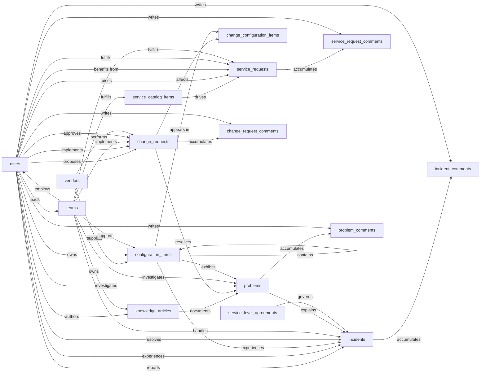

# IT Service Management — Semantic Model

## 1. Overview

An IT Service Management system that captures the four core ITIL processes (incident, problem, change, and service request) on top of a configuration management database and a service catalog. Used by IT support agents, engineers, change managers, and end users across an organization. The system answers questions like "what is broken right now", "what caused the recurring printer outages last quarter", "what changes are scheduled for tonight's maintenance window", and "how do I request a new laptop".

## 2. Entity summary

| # | Table name | Singular label | Purpose |
|---|---|---|---|
| 1 | `users` | User | Identity for everyone in the system: end users who raise tickets, IT agents who resolve them, managers who approve changes. |
| 2 | `teams` | Team | IT support groups and queues that own categories of work (Service Desk, Network, DBA, Security). |
| 3 | `vendors` | Vendor | External providers (hardware OEMs, SaaS vendors, MSPs) referenced from CIs and changes. |
| 4 | `configuration_items` | Configuration Item | The CMDB: every hardware, software, or service component IT manages and that incidents and changes reference. |
| 5 | `service_catalog_items` | Service Catalog Item | Definitions of standard requestable services (new laptop, VPN access, software install). |
| 6 | `service_requests` | Service Request | Instances of a user requesting a catalog item, with its own approval and fulfillment lifecycle. |
| 7 | `incidents` | Incident | Unplanned interruptions or quality degradations in a service. |
| 8 | `problems` | Problem | Underlying root causes that explain one or more incidents. |
| 9 | `change_requests` | Change Request | Planned additions, modifications, or removals affecting CIs, with risk, schedule, and approval. |
| 10 | `change_configuration_items` | Change CI | Junction: which CIs are affected by a given change request (M:N). |
| 11 | `knowledge_articles` | Knowledge Article | Documented solutions, runbooks, FAQs, and known errors used for self-service and agent reference. |
| 12 | `service_level_agreements` | Service Level Agreement | Response and resolution time targets keyed off ticket type and priority. |
| 13 | `incident_comments` | Incident Comment | Public replies and internal work-notes attached to an incident. |
| 14 | `service_request_comments` | Service Request Comment | Public replies and internal work-notes attached to a service request. |
| 15 | `problem_comments` | Problem Comment | Public replies and internal work-notes attached to a problem. |
| 16 | `change_request_comments` | Change Request Comment | Public replies and internal work-notes attached to a change request. |

### Entity-relationship diagram



## 3. Entities

### 3.1 `users` — User

**Plural label:** Users
**Label column:** `user_name`
**Audit log:** no
**Description:** A person who interacts with the ITSM system. The `is_agent` flag distinguishes IT staff (who resolve tickets, implement changes, author articles) from regular end users. Identity-only here; employment context (manager, department, position, contact details) lives in adjacent HR and identity systems.

**Fields**

| Field name | Format | Required | Label | Reference / Notes |
|---|---|---|---|---|
| `user_name` | `string` | yes | Full Name | label_column |
| `email` | `email` | yes | Email | unique |
| `is_agent` | `boolean` | yes | Is IT Agent | auto-default `FALSE` |
| `primary_team_id` | `reference` | no | Primary Team | → `teams` (N:1), relationship_label: "employs" |
| `is_active` | `boolean` | yes | Active | default: "true" |

**Relationships**

- A `user` may belong to one primary `team` (N:1, optional, clear on team delete).

### 3.2 `teams` — Team

**Plural label:** Teams
**Label column:** `team_name`
**Audit log:** no
**Description:** An IT support group or queue that owns a category of work. Teams pick up tickets, fulfill catalog items, support CIs, and own knowledge articles.

**Fields**

| Field name | Format | Required | Label | Reference / Notes |
|---|---|---|---|---|
| `team_name` | `string` | yes | Team Name | label_column, unique |
| `description` | `text` | no | Description | |
| `team_lead_user_id` | `reference` | no | Team Lead | → `users` (N:1), relationship_label: "leads" |
| `email_alias` | `email` | no | Team Email | |
| `is_active` | `boolean` | yes | Active | default: "true" |

**Relationships**

- A `team` may have one lead `user` (N:1, optional, clear on user delete).
- A `team` may have many `users` as members via `users.primary_team_id` (1:N).

### 3.3 `vendors` — Vendor

**Plural label:** Vendors
**Label column:** `vendor_name`
**Audit log:** yes
**Description:** An external provider that supplies CIs (hardware, software, SaaS) or performs changes. Used for asset attribution, support escalation, and contract context.

**Fields**

| Field name | Format | Required | Label | Reference / Notes |
|---|---|---|---|---|
| `vendor_name` | `string` | yes | Vendor Name | label_column, unique |
| `vendor_type` | `enum` | yes | Vendor Type | values: `hardware`, `software`, `saas`, `telco`, `msp`, `other`; default: "software" |
| `contact_name` | `string` | no | Primary Contact | |
| `contact_email` | `email` | no | Contact Email | |
| `contact_phone` | `string` | no | Contact Phone | |
| `website` | `url` | no | Website | |
| `support_url` | `url` | no | Support Portal URL | |
| `account_number` | `string` | no | Account Number | |
| `is_active` | `boolean` | yes | Active | default: "true" |

**Relationships**

- A `vendor` may supply many `configuration_items` (1:N, via `configuration_items.vendor_id`).
- A `vendor` may perform many `change_requests` (1:N, via `change_requests.vendor_id`).

### 3.4 `configuration_items` — Configuration Item

**Plural label:** Configuration Items
**Label column:** `ci_name`
**Audit log:** yes
**Description:** A hardware, software, or service component tracked in the CMDB. CIs are the targets of incidents (something is broken on this CI) and changes (this CI is being modified). Once a CI reaches `retired` status it does not return to an active status. Warranty expiration cannot precede the purchase date.

**Fields**

| Field name | Format | Required | Label | Reference / Notes |
|---|---|---|---|---|
| `ci_name` | `string` | yes | Name | label_column, unique |
| `ci_type` | `enum` | yes | Type | values: `service`, `application`, `database`, `server`, `workstation`, `laptop`, `network_device`, `license`, `other`; default: "service" |
| `environment` | `enum` | yes | Environment | values: `production`, `staging`, `development`, `test`, `dr`; default: "production" |
| `status` | `enum` | yes | Status | values: `planned`, `in_stock`, `deployed`, `in_maintenance`, `retired`; default: "planned" |
| `serial_number` | `string` | no | Serial Number | |
| `asset_tag` | `string` | no | Asset Tag | |
| `ip_address` | `string` | no | IP Address | |
| `hostname` | `string` | no | Hostname | |
| `vendor_id` | `reference` | no | Vendor | → `vendors` (N:1), relationship_label: "supplies" |
| `owner_user_id` | `reference` | no | Business Owner | → `users` (N:1), relationship_label: "owns" |
| `support_team_id` | `reference` | no | Support Team | → `teams` (N:1), relationship_label: "supports" |
| `parent_ci_id` | `reference` | no | Parent CI | → `configuration_items` (N:1, self-ref), relationship_label: "contains" |
| `location` | `string` | no | Location | |
| `purchase_date` | `date` | no | Purchase Date | |
| `warranty_expires_at` | `date` | no | Warranty Expiration | |
| `description` | `text` | no | Description | |

**Relationships**

- A `configuration_item` may be supplied by one `vendor` (N:1, optional, clear on vendor delete).
- A `configuration_item` may be owned by one business-owner `user` (N:1, optional, clear).
- A `configuration_item` may be supported by one `team` (N:1, optional, clear).
- A `configuration_item` may have one parent `configuration_item` (N:1, self-ref, optional, clear), forming a service-component hierarchy.
- A `configuration_item` may be referenced by many `incidents`, `problems`, and `change_configuration_items` rows.

**Validation rules**

```json
[
  {"code": "warranty_after_purchase", "description": "Warranty expiration cannot precede the purchase date.", "message": "Warranty expiration must be on or after the purchase date.", "logic": {"or": [{"==": [{"var": "purchase_date"}, null]}, {"==": [{"var": "warranty_expires_at"}, null]}, {">=": [{"var": "warranty_expires_at"}, {"var": "purchase_date"}]}]}},
  {"code": "retired_is_terminal", "description": "A retired CI cannot return to an active status.", "message": "Retired configuration items cannot be moved back to an active status.", "logic": {"or": [{"==": [{"var": "$old"}, null]}, {"!=": [{"var": "$old.status"}, "retired"]}, {"==": [{"var": "status"}, "retired"]}]}}
]
```

### 3.5 `service_catalog_items` — Service Catalog Item

**Plural label:** Service Catalog Items
**Label column:** `catalog_item_name`
**Audit log:** yes
**Description:** A definition of a standard requestable service (new laptop, VPN access, software install). End users browse the catalog and raise service requests against these items. Price and target delivery days cannot be negative.

**Fields**

| Field name | Format | Required | Label | Reference / Notes |
|---|---|---|---|---|
| `catalog_item_name` | `string` | yes | Name | label_column, unique |
| `short_description` | `string` | no | Short Description | |
| `description` | `text` | no | Full Description | |
| `category` | `enum` | yes | Category | values: `hardware`, `software`, `access`, `telecom`, `facilities`, `hr_services`, `other`; default: "software" |
| `delivery_team_id` | `reference` | no | Delivery Team | → `teams` (N:1), relationship_label: "fulfills" |
| `target_delivery_days` | `integer` | no | Target Delivery (Days) | |
| `requires_approval` | `boolean` | yes | Requires Approval | auto-default `FALSE` |
| `price` | `number` | no | Price | precision: 2 (monetary) |
| `is_active` | `boolean` | yes | Active | default: "true" |

**Relationships**

- A `service_catalog_item` may be fulfilled by one delivery `team` (N:1, optional, clear).
- A `service_catalog_item` may drive many `service_requests` (1:N, via `service_requests.catalog_item_id`, restrict on delete).

**Validation rules**

```json
[
  {"code": "delivery_days_non_negative", "description": "Target delivery days cannot be negative.", "message": "Target delivery days must be zero or greater.", "logic": {"or": [{"==": [{"var": "target_delivery_days"}, null]}, {">=": [{"var": "target_delivery_days"}, 0]}]}},
  {"code": "price_non_negative", "description": "Catalog item price cannot be negative.", "message": "Price must be zero or greater.", "logic": {"or": [{"==": [{"var": "price"}, null]}, {">=": [{"var": "price"}, 0]}]}}
]
```

### 3.6 `service_requests` — Service Request

**Plural label:** Service Requests
**Label column:** `request_number`
**Audit log:** yes
**Description:** An instance of a user requesting a catalog item. Has its own approval, fulfillment, and closure lifecycle, separate from incidents. Closure timestamps may only be set once the request reaches a terminal status, and date orderings (requested → fulfilled, requested → closed) cannot be inverted.

**Fields**

| Field name | Format | Required | Label | Reference / Notes |
|---|---|---|---|---|
| `request_number` | `string` | yes | Request Number | label_column, unique (e.g. `SR-00001`) |
| `catalog_item_id` | `reference` | yes | Catalog Item | → `service_catalog_items` (N:1), relationship_label: "drives" |
| `requested_by_user_id` | `reference` | yes | Requested By | → `users` (N:1), relationship_label: "raises" |
| `requested_for_user_id` | `reference` | no | Requested For | → `users` (N:1), relationship_label: "benefits from" |
| `assigned_to_user_id` | `reference` | no | Assigned To | → `users` (N:1), relationship_label: "fulfills" |
| `assigned_team_id` | `reference` | no | Assigned Team | → `teams` (N:1), relationship_label: "fulfills" |
| `short_description` | `string` | yes | Short Description | |
| `description` | `text` | no | Description | |
| `status` | `enum` | yes | Status | values: `new`, `approval_pending`, `approved`, `in_progress`, `fulfilled`, `closed`, `cancelled`; default: "new" |
| `priority` | `enum` | no | Priority | values: `p4_low`, `p3_normal`, `p2_high`, `p1_critical`; default: "p3_normal" |
| `requested_at` | `date-time` | yes | Requested At | |
| `approved_at` | `date-time` | no | Approved At | |
| `fulfilled_at` | `date-time` | no | Fulfilled At | |
| `closed_at` | `date-time` | no | Closed At | |
| `due_date` | `date` | no | Due Date | |

**Relationships**

- A `service_request` is for exactly one `service_catalog_item` (N:1, required, restrict on delete).
- A `service_request` is raised by one requester `user` (N:1, required, clear on delete).
- A `service_request` may be raised on behalf of one beneficiary `user` (N:1, optional, clear).
- A `service_request` may be assigned to one `user` and one `team` (N:1 each, optional, clear).
- A `service_request` accumulates many `service_request_comments` (1:N, cascade on delete via `format: parent`).

**Validation rules**

```json
[
  {"code": "closed_at_only_when_terminal", "description": "closed_at populated only on terminal statuses.", "message": "Closed timestamp may only be set when status is closed or cancelled.", "logic": {"or": [{"==": [{"var": "closed_at"}, null]}, {"in": [{"var": "status"}, ["closed", "cancelled"]]}]}},
  {"code": "closed_required_when_closed", "description": "A closed status implies closed_at is recorded.", "message": "Closed timestamp is required once status is closed.", "logic": {"or": [{"!=": [{"var": "status"}, "closed"]}, {"!=": [{"var": "closed_at"}, null]}]}},
  {"code": "fulfilled_after_requested", "description": "Fulfilled timestamp cannot precede requested timestamp.", "message": "Fulfilled timestamp must be on or after requested timestamp.", "logic": {"or": [{"==": [{"var": "fulfilled_at"}, null]}, {">=": [{"var": "fulfilled_at"}, {"var": "requested_at"}]}]}},
  {"code": "closed_after_requested", "description": "Closed timestamp cannot precede requested timestamp.", "message": "Closed timestamp must be on or after requested timestamp.", "logic": {"or": [{"==": [{"var": "closed_at"}, null]}, {">=": [{"var": "closed_at"}, {"var": "requested_at"}]}]}}
]
```

### 3.7 `incidents` — Incident

**Plural label:** Incidents
**Label column:** `incident_number`
**Audit log:** yes
**Description:** An unplanned interruption or quality degradation in a service. Reported by a user (or detected by monitoring), assigned to a team, resolved by an agent, optionally rolled up to a problem if a recurring root cause is suspected. Resolution and closure timestamps may only be set once status reaches the matching terminal state, and timestamp orderings (reported → resolved → closed) cannot be inverted.

**Fields**

| Field name | Format | Required | Label | Reference / Notes |
|---|---|---|---|---|
| `incident_number` | `string` | yes | Incident Number | label_column, unique (e.g. `INC-00001`) |
| `short_description` | `string` | yes | Short Description | |
| `description` | `text` | no | Description | |
| `reported_by_user_id` | `reference` | yes | Reported By | → `users` (N:1), relationship_label: "reports" |
| `affected_user_id` | `reference` | no | Affected User | → `users` (N:1), relationship_label: "experiences" |
| `affected_configuration_item_id` | `reference` | no | Affected CI | → `configuration_items` (N:1), relationship_label: "experiences" |
| `assigned_to_user_id` | `reference` | no | Assigned To | → `users` (N:1), relationship_label: "resolves" |
| `assigned_team_id` | `reference` | no | Assigned Team | → `teams` (N:1), relationship_label: "handles" |
| `problem_id` | `reference` | no | Related Problem | → `problems` (N:1), relationship_label: "explains" |
| `impact` | `enum` | yes | Impact | values: `low`, `medium`, `high`; default: "medium" |
| `urgency` | `enum` | yes | Urgency | values: `low`, `medium`, `high`; default: "medium" |
| `priority` | `enum` | yes | Priority | values: `p4_low`, `p3_normal`, `p2_high`, `p1_critical`; default: "p3_normal" |
| `status` | `enum` | yes | Status | values: `new`, `assigned`, `in_progress`, `on_hold`, `resolved`, `closed`, `cancelled`; default: "new" |
| `resolution_category` | `enum` | no | Resolution Category | values: `solved`, `workaround`, `duplicate`, `no_fault_found`, `user_error`, `configuration_change` |
| `resolution_notes` | `text` | no | Resolution Notes | |
| `reported_at` | `date-time` | yes | Reported At | |
| `resolved_at` | `date-time` | no | Resolved At | |
| `closed_at` | `date-time` | no | Closed At | |
| `sla_id` | `reference` | no | Applied SLA | → `service_level_agreements` (N:1), relationship_label: "governs" |
| `sla_response_due_at` | `date-time` | no | Response Due | |
| `sla_resolution_due_at` | `date-time` | no | Resolution Due | |
| `sla_breached` | `boolean` | yes | SLA Breached | auto-default `FALSE` |

**Relationships**

- An `incident` is reported by one `user` (N:1, required, clear on delete).
- An `incident` may concern one affected `user` and one affected `configuration_item` (N:1 each, optional, clear).
- An `incident` may be assigned to one `user` and one `team` (N:1 each, optional, clear).
- An `incident` may roll up to one `problem` (N:1, optional, clear).
- An `incident` may be governed by one `service_level_agreement` (N:1, optional, clear).
- An `incident` accumulates many `incident_comments` (1:N, cascade on delete via `format: parent`).

**Validation rules**

```json
[
  {"code": "resolved_only_when_resolved_or_closed", "description": "resolved_at populated only on resolved or closed.", "message": "Resolved timestamp may only be set when status is resolved or closed.", "logic": {"or": [{"==": [{"var": "resolved_at"}, null]}, {"in": [{"var": "status"}, ["resolved", "closed"]]}]}},
  {"code": "resolved_required_when_resolved", "description": "A resolved status implies resolved_at is recorded.", "message": "Resolved timestamp is required once status is resolved.", "logic": {"or": [{"!=": [{"var": "status"}, "resolved"]}, {"!=": [{"var": "resolved_at"}, null]}]}},
  {"code": "closed_at_only_when_terminal", "description": "closed_at populated only on terminal statuses.", "message": "Closed timestamp may only be set when status is closed or cancelled.", "logic": {"or": [{"==": [{"var": "closed_at"}, null]}, {"in": [{"var": "status"}, ["closed", "cancelled"]]}]}},
  {"code": "closed_required_when_closed", "description": "A closed status implies closed_at is recorded.", "message": "Closed timestamp is required once status is closed.", "logic": {"or": [{"!=": [{"var": "status"}, "closed"]}, {"!=": [{"var": "closed_at"}, null]}]}},
  {"code": "resolved_after_reported", "description": "Resolved cannot precede reported.", "message": "Resolved timestamp must be on or after reported timestamp.", "logic": {"or": [{"==": [{"var": "resolved_at"}, null]}, {">=": [{"var": "resolved_at"}, {"var": "reported_at"}]}]}},
  {"code": "closed_after_resolved", "description": "Closed cannot precede resolved.", "message": "Closed timestamp must be on or after resolved timestamp.", "logic": {"or": [{"==": [{"var": "closed_at"}, null]}, {"==": [{"var": "resolved_at"}, null]}, {">=": [{"var": "closed_at"}, {"var": "resolved_at"}]}]}}
]
```

### 3.8 `problems` — Problem

**Plural label:** Problems
**Label column:** `problem_number`
**Audit log:** yes
**Description:** An underlying root cause that explains one or more incidents. Investigated by a team, optionally documented in a known-error knowledge article, and ultimately resolved by a change request. Resolution and closure timestamps may only be set on the matching terminal status; openings cannot post-date resolutions.

**Fields**

| Field name | Format | Required | Label | Reference / Notes |
|---|---|---|---|---|
| `problem_number` | `string` | yes | Problem Number | label_column, unique (e.g. `PRB-00001`) |
| `short_description` | `string` | yes | Short Description | |
| `description` | `text` | no | Description | |
| `root_cause` | `text` | no | Root Cause | |
| `workaround` | `text` | no | Workaround | |
| `known_error_article_id` | `reference` | no | Known-Error Article | → `knowledge_articles` (N:1), relationship_label: "documents" |
| `resolution_change_request_id` | `reference` | no | Resolved By Change | → `change_requests` (N:1), relationship_label: "resolves" |
| `assigned_to_user_id` | `reference` | no | Assigned To | → `users` (N:1), relationship_label: "investigates" |
| `assigned_team_id` | `reference` | no | Assigned Team | → `teams` (N:1), relationship_label: "investigates" |
| `affected_configuration_item_id` | `reference` | no | Affected CI | → `configuration_items` (N:1), relationship_label: "exhibits" |
| `priority` | `enum` | yes | Priority | values: `p4_low`, `p3_normal`, `p2_high`, `p1_critical`; default: "p3_normal" |
| `status` | `enum` | yes | Status | values: `new`, `investigating`, `root_cause_known`, `workaround_available`, `resolved`, `closed`; default: "new" |
| `opened_at` | `date-time` | yes | Opened At | |
| `resolved_at` | `date-time` | no | Resolved At | |
| `closed_at` | `date-time` | no | Closed At | |

**Relationships**

- A `problem` may be documented by one `knowledge_article` (N:1, optional, clear).
- A `problem` may be resolved by one `change_request` (N:1, optional, clear).
- A `problem` may be assigned to one `user` and one `team` (N:1 each, optional, clear).
- A `problem` may concern one affected `configuration_item` (N:1, optional, clear).
- A `problem` may explain many `incidents` (1:N, via `incidents.problem_id`, clear on delete).
- A `problem` accumulates many `problem_comments` (1:N, cascade on delete via `format: parent`).

**Validation rules**

```json
[
  {"code": "resolved_only_when_resolved_or_closed", "description": "resolved_at populated only on resolved or closed.", "message": "Resolved timestamp may only be set when status is resolved or closed.", "logic": {"or": [{"==": [{"var": "resolved_at"}, null]}, {"in": [{"var": "status"}, ["resolved", "closed"]]}]}},
  {"code": "closed_at_only_when_closed", "description": "closed_at populated only on closed.", "message": "Closed timestamp may only be set when status is closed.", "logic": {"or": [{"==": [{"var": "closed_at"}, null]}, {"==": [{"var": "status"}, "closed"]}]}},
  {"code": "resolved_after_opened", "description": "Resolved cannot precede opened.", "message": "Resolved timestamp must be on or after opened timestamp.", "logic": {"or": [{"==": [{"var": "resolved_at"}, null]}, {">=": [{"var": "resolved_at"}, {"var": "opened_at"}]}]}},
  {"code": "closed_after_opened", "description": "Closed cannot precede opened.", "message": "Closed timestamp must be on or after opened timestamp.", "logic": {"or": [{"==": [{"var": "closed_at"}, null]}, {">=": [{"var": "closed_at"}, {"var": "opened_at"}]}]}}
]
```

### 3.9 `change_requests` — Change Request

**Plural label:** Change Requests
**Label column:** `change_number`
**Audit log:** yes
**Description:** A planned addition, modification, or removal affecting one or more CIs. Carries risk and impact assessments, an implementation plan, a rollback plan, an approver, and scheduled execution windows. Planned start/end and actual start/end ordering must hold. Closed, cancelled, and failed are terminal states a change request cannot leave.

**Fields**

| Field name | Format | Required | Label | Reference / Notes |
|---|---|---|---|---|
| `change_number` | `string` | yes | Change Number | label_column, unique (e.g. `CHG-00001`) |
| `short_description` | `string` | yes | Short Description | |
| `description` | `text` | no | Description | |
| `change_type` | `enum` | yes | Change Type | values: `standard`, `normal`, `emergency`; default: "normal" |
| `risk` | `enum` | yes | Risk Level | values: `low`, `medium`, `high`; default: "medium" |
| `impact` | `enum` | yes | Impact | values: `low`, `medium`, `high`; default: "medium" |
| `status` | `enum` | yes | Status | values: `draft`, `approval_pending`, `approved`, `scheduled`, `in_progress`, `implemented`, `review`, `closed`, `cancelled`, `failed`; default: "draft" |
| `requested_by_user_id` | `reference` | yes | Requested By | → `users` (N:1), relationship_label: "proposes" |
| `assigned_to_user_id` | `reference` | no | Assigned To | → `users` (N:1), relationship_label: "implements" |
| `assigned_team_id` | `reference` | no | Assigned Team | → `teams` (N:1), relationship_label: "implements" |
| `approver_user_id` | `reference` | no | Approver | → `users` (N:1), relationship_label: "approves" |
| `vendor_id` | `reference` | no | Vendor | → `vendors` (N:1), relationship_label: "performs" |
| `planned_start_at` | `date-time` | no | Planned Start | |
| `planned_end_at` | `date-time` | no | Planned End | |
| `actual_start_at` | `date-time` | no | Actual Start | |
| `actual_end_at` | `date-time` | no | Actual End | |
| `implementation_plan` | `text` | no | Implementation Plan | |
| `rollback_plan` | `text` | no | Rollback Plan | |
| `test_plan` | `text` | no | Test Plan | |
| `post_implementation_notes` | `text` | no | Post-Implementation Notes | |

**Relationships**

- A `change_request` is proposed by one requester `user` (N:1, required, clear on delete).
- A `change_request` may be assigned to one implementer `user` and one `team` (N:1 each, optional, clear).
- A `change_request` may be approved by one approver `user` (N:1, optional, clear).
- A `change_request` may be performed by one external `vendor` (N:1, optional, clear).
- A `change_request` may resolve many `problems` (1:N, via `problems.resolution_change_request_id`, clear on delete).
- A `change_request` ↔ `configuration_items` is many-to-many through the `change_configuration_items` junction (cascade on delete).
- A `change_request` accumulates many `change_request_comments` (1:N, cascade on delete via `format: parent`).

**Validation rules**

```json
[
  {"code": "planned_dates_ordered", "description": "Planned end cannot precede planned start.", "message": "Planned end must be on or after planned start.", "logic": {"or": [{"==": [{"var": "planned_start_at"}, null]}, {"==": [{"var": "planned_end_at"}, null]}, {">=": [{"var": "planned_end_at"}, {"var": "planned_start_at"}]}]}},
  {"code": "actual_dates_ordered", "description": "Actual end cannot precede actual start.", "message": "Actual end must be on or after actual start.", "logic": {"or": [{"==": [{"var": "actual_start_at"}, null]}, {"==": [{"var": "actual_end_at"}, null]}, {">=": [{"var": "actual_end_at"}, {"var": "actual_start_at"}]}]}},
  {"code": "terminal_status_one_way", "description": "Closed, cancelled, and failed are terminal change states.", "message": "Closed, cancelled, or failed change requests cannot be reopened.", "logic": {"or": [{"==": [{"var": "$old"}, null]}, {"!": {"in": [{"var": "$old.status"}, ["closed", "cancelled", "failed"]]}}, {"==": [{"var": "status"}, {"var": "$old.status"}]}]}}
]
```

### 3.10 `change_configuration_items` — Change CI

**Plural label:** Change CIs
**Label column:** `change_ci_label`
**Audit log:** no
**Description:** Junction table linking a `change_request` to each `configuration_item` it affects, with a role qualifier (primary target, dependency, downstream, witness). The junction is created and destroyed with the change request.

**Fields**

| Field name | Format | Required | Label | Reference / Notes |
|---|---|---|---|---|
| `change_ci_label` | `string` | yes | Label | label_column. Caller populates as `"{change_number} / {ci_name}"` on create. |
| `change_request_id` | `parent` | yes | Change Request | → `change_requests` (N:1), relationship_label: "affects" |
| `configuration_item_id` | `parent` | yes | Configuration Item | → `configuration_items` (N:1), relationship_label: "appears in" |
| `impact_role` | `enum` | yes | Impact Role | values: `primary`, `dependency`, `downstream`, `witness`; default: "primary" |

**Relationships**

- A `change_configuration_item` belongs to exactly one `change_request` (N:1, required, cascade on delete).
- A `change_configuration_item` references exactly one `configuration_item` (N:1, required, cascade on delete). Whether `configuration_item` deletion should cascade through the junction (current model) or be blocked (`restrict`) while change history exists is tracked in §7.2.

### 3.11 `knowledge_articles` — Knowledge Article

**Plural label:** Knowledge Articles
**Label column:** `article_title`
**Audit log:** yes
**Description:** A documented solution, runbook, FAQ, or known-error write-up. Used by end users for self-service and by agents during ticket handling. Articles have a publication lifecycle (draft, in_review, published, archived). View counts cannot be negative; archival is a one-way state.

**Fields**

| Field name | Format | Required | Label | Reference / Notes |
|---|---|---|---|---|
| `article_title` | `string` | yes | Title | label_column, unique |
| `article_number` | `string` | yes | Article Number | unique (e.g. `KB-00001`) |
| `summary` | `text` | no | Summary | |
| `body` | `html` | yes | Body | |
| `article_type` | `enum` | yes | Article Type | values: `how_to`, `troubleshooting`, `faq`, `known_error`, `policy`, `runbook`; default: "how_to" |
| `status` | `enum` | yes | Status | values: `draft`, `in_review`, `published`, `archived`; default: "draft" |
| `author_user_id` | `reference` | yes | Author | → `users` (N:1), relationship_label: "authors" |
| `owning_team_id` | `reference` | no | Owning Team | → `teams` (N:1), relationship_label: "owns" |
| `visibility` | `enum` | yes | Visibility | values: `internal`, `customer`, `public`; default: "internal" |
| `published_at` | `date-time` | no | Published At | |
| `review_due_at` | `date` | no | Review Due | |
| `view_count` | `integer` | yes | View Count | auto-default `0` |
| `tags` | `array` | no | Tags | array of strings |

**Relationships**

- A `knowledge_article` is authored by one `user` (N:1, required, clear on delete).
- A `knowledge_article` may be owned by one `team` (N:1, optional, clear).
- A `knowledge_article` may document many `problems` as a known-error reference (1:N, via `problems.known_error_article_id`, clear on delete).

**Validation rules**

```json
[
  {"code": "view_count_non_negative", "description": "View count cannot be negative.", "message": "View count must be zero or greater.", "logic": {">=": [{"var": "view_count"}, 0]}},
  {"code": "published_at_only_when_published_or_archived", "description": "published_at populated only when status is published or archived.", "message": "Published timestamp may only be set when status is published or archived.", "logic": {"or": [{"==": [{"var": "published_at"}, null]}, {"in": [{"var": "status"}, ["published", "archived"]]}]}},
  {"code": "published_required_when_published", "description": "A published status implies published_at is recorded.", "message": "Published timestamp is required once status is published.", "logic": {"or": [{"!=": [{"var": "status"}, "published"]}, {"!=": [{"var": "published_at"}, null]}]}},
  {"code": "archived_is_terminal", "description": "Archived articles cannot return to draft, in_review, or published.", "message": "Archived articles cannot be unarchived.", "logic": {"or": [{"==": [{"var": "$old"}, null]}, {"!=": [{"var": "$old.status"}, "archived"]}, {"==": [{"var": "status"}, "archived"]}]}}
]
```

### 3.12 `service_level_agreements` — Service Level Agreement

**Plural label:** Service Level Agreements
**Label column:** `sla_name`
**Audit log:** yes
**Description:** A response and resolution time target that applies to incidents (and potentially other ticket types) matching a given ticket type and priority. The implementing system uses these to compute SLA due timestamps and breach flags on each ticket. Both targets are positive; resolution target cannot be tighter than response target; effective-from and effective-until orderings hold.

**Fields**

| Field name | Format | Required | Label | Reference / Notes |
|---|---|---|---|---|
| `sla_name` | `string` | yes | Name | label_column, unique |
| `description` | `text` | no | Description | |
| `ticket_type` | `enum` | yes | Ticket Type | values: `incident`, `service_request`, `problem`, `change_request`; default: "incident" |
| `priority` | `enum` | yes | Priority | values: `p4_low`, `p3_normal`, `p2_high`, `p1_critical`; default: "p3_normal" |
| `response_target_minutes` | `integer` | yes | Response Target (Minutes) | |
| `resolution_target_minutes` | `integer` | yes | Resolution Target (Minutes) | |
| `business_hours_only` | `boolean` | yes | Business Hours Only | auto-default `FALSE` |
| `is_active` | `boolean` | yes | Active | default: "true" |
| `effective_from` | `date` | no | Effective From | |
| `effective_until` | `date` | no | Effective Until | |

**Relationships**

- A `service_level_agreement` may govern many `incidents` (1:N, via `incidents.sla_id`, clear on delete).

**Validation rules**

```json
[
  {"code": "response_target_positive", "description": "Response target must be a positive number of minutes.", "message": "Response target minutes must be greater than zero.", "logic": {">": [{"var": "response_target_minutes"}, 0]}},
  {"code": "resolution_target_positive", "description": "Resolution target must be a positive number of minutes.", "message": "Resolution target minutes must be greater than zero.", "logic": {">": [{"var": "resolution_target_minutes"}, 0]}},
  {"code": "resolution_at_least_response", "description": "Resolution target cannot be tighter than response target.", "message": "Resolution target must be at least as long as response target.", "logic": {">=": [{"var": "resolution_target_minutes"}, {"var": "response_target_minutes"}]}},
  {"code": "effective_dates_ordered", "description": "Effective until cannot precede effective from.", "message": "Effective until must be on or after effective from.", "logic": {"or": [{"==": [{"var": "effective_from"}, null]}, {"==": [{"var": "effective_until"}, null]}, {">=": [{"var": "effective_until"}, {"var": "effective_from"}]}]}}
]
```

### 3.13 `incident_comments` — Incident Comment

**Plural label:** Incident Comments
**Label column:** `incident_comment_label`
**Audit log:** yes
**Description:** A reply or work-note attached to exactly one incident. Cascades natively when the parent incident is deleted via `format: parent`.

**Fields**

| Field name | Format | Required | Label | Reference / Notes |
|---|---|---|---|---|
| `incident_comment_label` | `string` | yes | Label | label_column. Caller populates as `"{incident_number} #{seq}"` on create, where `seq` is a 1-based per-incident counter. |
| `incident_id` | `parent` | yes | Incident | → `incidents` (N:1), relationship_label: "accumulates" |
| `author_user_id` | `reference` | yes | Author | → `users` (N:1), relationship_label: "writes" |
| `body` | `text` | no | Body | |
| `visibility` | `enum` | yes | Visibility | values: `public`, `internal`; default: "internal" |
| `posted_at` | `date-time` | yes | Posted At | |

**Relationships**

- An `incident_comment` belongs to exactly one `incident` (N:1, required, cascade on delete).
- An `incident_comment` is written by one author `user` (N:1, required, clear on delete).

### 3.14 `service_request_comments` — Service Request Comment

**Plural label:** Service Request Comments
**Label column:** `service_request_comment_label`
**Audit log:** yes
**Description:** A reply or work-note attached to exactly one service request. Cascades natively when the parent service request is deleted via `format: parent`.

**Fields**

| Field name | Format | Required | Label | Reference / Notes |
|---|---|---|---|---|
| `service_request_comment_label` | `string` | yes | Label | label_column. Caller populates as `"{request_number} #{seq}"` on create, where `seq` is a 1-based per-request counter. |
| `service_request_id` | `parent` | yes | Service Request | → `service_requests` (N:1), relationship_label: "accumulates" |
| `author_user_id` | `reference` | yes | Author | → `users` (N:1), relationship_label: "writes" |
| `body` | `text` | no | Body | |
| `visibility` | `enum` | yes | Visibility | values: `public`, `internal`; default: "internal" |
| `posted_at` | `date-time` | yes | Posted At | |

**Relationships**

- A `service_request_comment` belongs to exactly one `service_request` (N:1, required, cascade on delete).
- A `service_request_comment` is written by one author `user` (N:1, required, clear on delete).

### 3.15 `problem_comments` — Problem Comment

**Plural label:** Problem Comments
**Label column:** `problem_comment_label`
**Audit log:** yes
**Description:** A reply or work-note attached to exactly one problem. Cascades natively when the parent problem is deleted via `format: parent`.

**Fields**

| Field name | Format | Required | Label | Reference / Notes |
|---|---|---|---|---|
| `problem_comment_label` | `string` | yes | Label | label_column. Caller populates as `"{problem_number} #{seq}"` on create, where `seq` is a 1-based per-problem counter. |
| `problem_id` | `parent` | yes | Problem | → `problems` (N:1), relationship_label: "accumulates" |
| `author_user_id` | `reference` | yes | Author | → `users` (N:1), relationship_label: "writes" |
| `body` | `text` | no | Body | |
| `visibility` | `enum` | yes | Visibility | values: `public`, `internal`; default: "internal" |
| `posted_at` | `date-time` | yes | Posted At | |

**Relationships**

- A `problem_comment` belongs to exactly one `problem` (N:1, required, cascade on delete).
- A `problem_comment` is written by one author `user` (N:1, required, clear on delete).

### 3.16 `change_request_comments` — Change Request Comment

**Plural label:** Change Request Comments
**Label column:** `change_request_comment_label`
**Audit log:** yes
**Description:** A reply or work-note attached to exactly one change request. Cascades natively when the parent change request is deleted via `format: parent`.

**Fields**

| Field name | Format | Required | Label | Reference / Notes |
|---|---|---|---|---|
| `change_request_comment_label` | `string` | yes | Label | label_column. Caller populates as `"{change_number} #{seq}"` on create, where `seq` is a 1-based per-change counter. |
| `change_request_id` | `parent` | yes | Change Request | → `change_requests` (N:1), relationship_label: "accumulates" |
| `author_user_id` | `reference` | yes | Author | → `users` (N:1), relationship_label: "writes" |
| `body` | `text` | no | Body | |
| `visibility` | `enum` | yes | Visibility | values: `public`, `internal`; default: "internal" |
| `posted_at` | `date-time` | yes | Posted At | |

**Relationships**

- A `change_request_comment` belongs to exactly one `change_request` (N:1, required, cascade on delete).
- A `change_request_comment` is written by one author `user` (N:1, required, clear on delete).

## 4. Relationship summary

| From | Field | To | Cardinality | Kind | Delete behavior |
|---|---|---|---|---|---|
| `users` | `primary_team_id` | `teams` | N:1 | reference | clear |
| `teams` | `team_lead_user_id` | `users` | N:1 | reference | clear |
| `configuration_items` | `vendor_id` | `vendors` | N:1 | reference | clear |
| `configuration_items` | `owner_user_id` | `users` | N:1 | reference | clear |
| `configuration_items` | `support_team_id` | `teams` | N:1 | reference | clear |
| `configuration_items` | `parent_ci_id` | `configuration_items` | N:1 (self) | reference | clear |
| `service_catalog_items` | `delivery_team_id` | `teams` | N:1 | reference | clear |
| `service_requests` | `catalog_item_id` | `service_catalog_items` | N:1 | reference | restrict |
| `service_requests` | `requested_by_user_id` | `users` | N:1 | reference | clear |
| `service_requests` | `requested_for_user_id` | `users` | N:1 | reference | clear |
| `service_requests` | `assigned_to_user_id` | `users` | N:1 | reference | clear |
| `service_requests` | `assigned_team_id` | `teams` | N:1 | reference | clear |
| `incidents` | `reported_by_user_id` | `users` | N:1 | reference | clear |
| `incidents` | `affected_user_id` | `users` | N:1 | reference | clear |
| `incidents` | `affected_configuration_item_id` | `configuration_items` | N:1 | reference | clear |
| `incidents` | `assigned_to_user_id` | `users` | N:1 | reference | clear |
| `incidents` | `assigned_team_id` | `teams` | N:1 | reference | clear |
| `incidents` | `problem_id` | `problems` | N:1 | reference | clear |
| `incidents` | `sla_id` | `service_level_agreements` | N:1 | reference | clear |
| `problems` | `known_error_article_id` | `knowledge_articles` | N:1 | reference | clear |
| `problems` | `resolution_change_request_id` | `change_requests` | N:1 | reference | clear |
| `problems` | `assigned_to_user_id` | `users` | N:1 | reference | clear |
| `problems` | `assigned_team_id` | `teams` | N:1 | reference | clear |
| `problems` | `affected_configuration_item_id` | `configuration_items` | N:1 | reference | clear |
| `change_requests` | `requested_by_user_id` | `users` | N:1 | reference | clear |
| `change_requests` | `assigned_to_user_id` | `users` | N:1 | reference | clear |
| `change_requests` | `assigned_team_id` | `teams` | N:1 | reference | clear |
| `change_requests` | `approver_user_id` | `users` | N:1 | reference | clear |
| `change_requests` | `vendor_id` | `vendors` | N:1 | reference | clear |
| `change_configuration_items` | `change_request_id` | `change_requests` | N:1 | parent (junction) | cascade |
| `change_configuration_items` | `configuration_item_id` | `configuration_items` | N:1 | parent (junction) | cascade |
| `knowledge_articles` | `author_user_id` | `users` | N:1 | reference | clear |
| `knowledge_articles` | `owning_team_id` | `teams` | N:1 | reference | clear |
| `incident_comments` | `incident_id` | `incidents` | N:1 | parent | cascade |
| `incident_comments` | `author_user_id` | `users` | N:1 | reference | clear |
| `service_request_comments` | `service_request_id` | `service_requests` | N:1 | parent | cascade |
| `service_request_comments` | `author_user_id` | `users` | N:1 | reference | clear |
| `problem_comments` | `problem_id` | `problems` | N:1 | parent | cascade |
| `problem_comments` | `author_user_id` | `users` | N:1 | reference | clear |
| `change_request_comments` | `change_request_id` | `change_requests` | N:1 | parent | cascade |
| `change_request_comments` | `author_user_id` | `users` | N:1 | reference | clear |

`change_requests` ↔ `configuration_items` is M:N realised by the `change_configuration_items` junction (two N:1 rows above).

## 5. Enumerations

### 5.1 `vendors.vendor_type`
- `hardware`
- `software`
- `saas`
- `telco`
- `msp`
- `other`

### 5.2 `configuration_items.ci_type`
- `service`
- `application`
- `database`
- `server`
- `workstation`
- `laptop`
- `network_device`
- `license`
- `other`

### 5.3 `configuration_items.environment`
- `production`
- `staging`
- `development`
- `test`
- `dr`

### 5.4 `configuration_items.status`
- `planned`
- `in_stock`
- `deployed`
- `in_maintenance`
- `retired`

### 5.5 `service_catalog_items.category`
- `hardware`
- `software`
- `access`
- `telecom`
- `facilities`
- `hr_services`
- `other`

### 5.6 `service_requests.status`
- `new`
- `approval_pending`
- `approved`
- `in_progress`
- `fulfilled`
- `closed`
- `cancelled`

### 5.7 Ticket priority _(shared by `service_requests.priority`, `incidents.priority`, `problems.priority`, `service_level_agreements.priority`)_
- `p4_low`
- `p3_normal`
- `p2_high`
- `p1_critical`

### 5.8 Three-level severity _(shared by `incidents.impact`, `incidents.urgency`, `change_requests.risk`, `change_requests.impact`)_
- `low`
- `medium`
- `high`

### 5.9 `incidents.status`
- `new`
- `assigned`
- `in_progress`
- `on_hold`
- `resolved`
- `closed`
- `cancelled`

### 5.10 `incidents.resolution_category`
- `solved`
- `workaround`
- `duplicate`
- `no_fault_found`
- `user_error`
- `configuration_change`

### 5.11 `problems.status`
- `new`
- `investigating`
- `root_cause_known`
- `workaround_available`
- `resolved`
- `closed`

### 5.12 `change_requests.change_type`
- `standard`
- `normal`
- `emergency`

### 5.13 `change_requests.status`
- `draft`
- `approval_pending`
- `approved`
- `scheduled`
- `in_progress`
- `implemented`
- `review`
- `closed`
- `cancelled`
- `failed`

### 5.14 `change_configuration_items.impact_role`
- `primary`
- `dependency`
- `downstream`
- `witness`

### 5.15 `knowledge_articles.article_type`
- `how_to`
- `troubleshooting`
- `faq`
- `known_error`
- `policy`
- `runbook`

### 5.16 `knowledge_articles.status`
- `draft`
- `in_review`
- `published`
- `archived`

### 5.17 `knowledge_articles.visibility`
- `internal`
- `customer`
- `public`

### 5.18 `service_level_agreements.ticket_type`
- `incident`
- `service_request`
- `problem`
- `change_request`

### 5.19 Comment visibility _(shared by `incident_comments.visibility`, `service_request_comments.visibility`, `problem_comments.visibility`, `change_request_comments.visibility`)_
- `public`
- `internal`

## 6. Cross-model link suggestions

The hint table below describes FKs that *could* exist between this model's entities and entities owned by other modules. The deployer reads each row, looks up the `To` concept in the live catalog at deploy time, and proposes an additive FK only when the target is actually deployed. Targets that are missing are silently skipped; targets that match multiple candidates surface a single confirmation widget. Entries are hints, not contracts.

Rows are split into **inbound** (FK lives on a sibling table that does not exist in this model; created on the sibling at its deploy time) and **outbound** (FK lives on one of this model's tables; created here when the target sibling is deployed).

| From | To | Verb | Cardinality | Delete |
|---|---|---|---|---|
| `ci_relationships` | `configuration_items` | links | N:1 | clear |
| `discovery_sources` | `configuration_items` | discovers | N:1 | clear |
| `hardware_assets` | `configuration_items` | is tracked as | N:1 | clear |
| `software_installs` | `configuration_items` | hosts | N:1 | clear |
| `service_catalog_items` | `software_licenses` | provisions | N:1 | clear |
| `alerts` | `incidents` | consolidates | N:1 | clear |
| `incidents` | `outages` | encompasses | N:1 | clear |
| `monitoring_metrics` | `configuration_items` | is measured by | N:1 | clear |
| `employees` | `users` | is the account of | N:1 | clear |
| `risk_assessments` | `change_requests` | is assessed by | N:1 | clear |
| `risk_assessments` | `configuration_items` | is assessed for | N:1 | clear |
| `compliance_controls` | `configuration_items` | is governed by | N:1 | clear |
| `audit_events` | `configuration_items` | is audited by | N:1 | clear |
| `change_requests` | `vendor_contracts` | governs | N:1 | clear |
| `change_requests` | `releases` | bundles | N:1 | clear |
| `change_requests` | `features` | is implemented by | N:1 | clear |
| `change_requests` | `projects` | scopes | N:1 | clear |
| `service_catalog_items` | `products` | is offered as | N:1 | clear |
| `knowledge_articles` | `products` | is documented by | N:1 | clear |
| `users` | `positions` | is held by | N:1 | clear |

The inbound rows above name tables that live on sibling modules (CMDB `ci_relationships` / `discovery_sources`, ITAM `hardware_assets`, SAM `software_installs` / `software_licenses`, Monitoring `alerts` / `monitoring_metrics`, Service Operations `outages`, HRIS `employees`, Risk Management `risk_assessments`, Compliance `compliance_controls`, Audit `audit_events`). The outbound rows name tables this model would FK into when their owning sibling is deployed (Vendor Management `vendor_contracts`, Product Roadmap `releases` / `features`, Project Management `projects`, PIM `products`, Workforce Planning `positions`). The deployer's CMDB dedup pass automatically retargets `configuration_items` rows when the `cmdb` module is also deployed.

Entity-overlap dedup for shared-master-data tables (`users` against the platform built-in or Identity & Access, `vendors` against Vendor Management, `configuration_items` against CMDB) is handled by the deployer's name-collision flow at deploy time and is not declared here.

## 7. Open questions

### 7.1 🔴 Decisions needed (blockers)

None.

### 7.2 🟡 Future considerations (deferred scope)

- Should `users` ↔ `teams` be modeled as M:N via a `team_memberships` junction so a user can belong to multiple support groups, or is the current single `primary_team_id` sufficient?
- Should `incidents` ↔ `configuration_items` be M:N (multiple impacted CIs per incident) via an `incident_configuration_items` junction, or is one primary `affected_configuration_item_id` enough?
- Should `service_catalog_items.category` (and similar flat enums) be promoted to a hierarchical `categories` lookup table if the taxonomy needs grow?
- Should `attachments` become a first-class polymorphic entity attached to tickets and articles, or stay as a platform-level concern outside this model?
- Should `releases` and `deployments` be added to bundle multiple `change_requests` into a coordinated release window, or is the cross-model link to Product Roadmap `releases` sufficient?
- Should `cab_meetings` (Change Advisory Board) be a first-class entity tracking which meeting approved which `change_requests`, or is the per-change `approver_user_id` enough?
- Should SLA matching support more dimensions (category, customer segment, business-hours window definitions per region) than the current `(ticket_type, priority)` key plus single `business_hours_only` flag?
- Should `incidents.priority` be a stored field (current model) or computed deterministically from `impact` × `urgency`? If computed, the field becomes derived and the priority enum lives only as a display vocabulary.
- Should CI dependencies be richer than the single `parent_ci_id` self-reference, e.g. a `ci_relationships` entity capturing typed links (`depends_on`, `runs_on`, `communicates_with`) between configuration_items?
- Should `incident_tasks` and `change_tasks` be added as work-breakdown sub-entities, or is the parent-ticket-plus-comments pattern sufficient?
- Should `problems` carry a workaround-effectiveness assessment or per-incident-cost rollup for prioritization?
- Should deletion of a `configuration_item` cascade through `change_configuration_items` (the current model) or be `restrict`-ed while change history references the CI? `restrict` preserves audit trail at the cost of a heavier delete UX; `cascade` cleans up junction rows but loses the reference from historical changes.

## 8. Implementation notes for the downstream agent

1. Create one module named `itsm` (the module name **must** equal the `system_slug` from the front-matter, do not invent a different module slug here) and two baseline permissions (`itsm:read`, `itsm:manage`) before any entity.
2. Create entities in §2 order: entities referenced by others first. Concretely: `users` → `teams` → `vendors` → `configuration_items` → `service_catalog_items` → `service_level_agreements` → `knowledge_articles` → `problems` → `change_requests` → `incidents` → `service_requests` → `change_configuration_items` → `incident_comments` → `service_request_comments` → `problem_comments` → `change_request_comments`. Some FKs are mutually referential between `incidents` ↔ `problems` and `problems` ↔ `change_requests` ↔ `knowledge_articles`; create the entity first with non-FK fields, then add the FK fields once both targets exist.
3. For each entity: set `label_column` to the snake_case field marked as label in §3, pass `module_id`, `view_permission` (`itsm:read`), `edit_permission` (`itsm:manage`). Do **not** manually create `id`, `created_at`, `updated_at`, or the auto-label field.
4. For each field in §3: pass `table_name`, `field_name`, `format`, `title` (the Label column), and for `reference`/`parent` fields also `reference_table` and a `reference_delete_mode` consistent with the §4 Delete behavior column. Persist the `relationship_label` annotation on each FK field so navigation breadcrumbs and ER docs render the verb. Persist the `validation_rules` JSON arrays from §3 verbatim on the corresponding entities.
5. **Fix up each entity's auto-created label-column field title.** `create_entity` auto-creates a field whose `field_name` equals the entity's `label_column`, and its `title` defaults to `singular_label`. The following label-column titles differ from `singular_label` and must be updated:
   - `users.user_name` → title `"Full Name"` (not `"User"`)
   - `teams.team_name` → title `"Team Name"` (not `"Team"`)
   - `vendors.vendor_name` → title `"Vendor Name"` (not `"Vendor"`)
   - `configuration_items.ci_name` → title `"Name"` (not `"Configuration Item"`)
   - `service_catalog_items.catalog_item_name` → title `"Name"` (not `"Service Catalog Item"`)
   - `service_requests.request_number` → title `"Request Number"` (not `"Service Request"`)
   - `incidents.incident_number` → title `"Incident Number"` (not `"Incident"`)
   - `problems.problem_number` → title `"Problem Number"` (not `"Problem"`)
   - `change_requests.change_number` → title `"Change Number"` (not `"Change Request"`)
   - `change_configuration_items.change_ci_label` → title `"Label"` (not `"Change CI"`)
   - `knowledge_articles.article_title` → title `"Title"` (not `"Knowledge Article"`)
   - `service_level_agreements.sla_name` → title `"Name"` (not `"Service Level Agreement"`)
   - `incident_comments.incident_comment_label` → title `"Label"` (not `"Incident Comment"`)
   - `service_request_comments.service_request_comment_label` → title `"Label"` (not `"Service Request Comment"`)
   - `problem_comments.problem_comment_label` → title `"Label"` (not `"Problem Comment"`)
   - `change_request_comments.change_request_comment_label` → title `"Label"` (not `"Change Request Comment"`)

   For each, follow up `create_entity` with `update_field` using the composite **string** id `"{table_name}.{field_name}"` (e.g. `"vendors.vendor_name"`, `"configuration_items.ci_name"`). Pass the id as a string, not an integer, or the update will fail.
6. **Deduplicate against Semantius built-in tables.** This model is self-contained and declares `users`, which already exists in Semantius as a built-in. For `users`, **skip the create** and reuse the built-in as the `reference_table` target for every FK that points at `users`. Add the domain-specific fields (`is_agent`, `primary_team_id`) to the built-in only if missing (additive, low-risk). If `roles`, `permissions`, or other built-ins overlap with anything below, apply the same dedup rule.
7. **Apply §6 cross-model link hints.** After this model's own creates and the built-in dedup pass, walk the §6 hint table. For each row, look up the `To` table in the live catalog: when it is deployed, propose the FK on the row's `From` table (always user-confirmed, never auto-applied) using the row's verb, cardinality, and delete behavior; when it is missing or ambiguous across multiple candidates, silently skip or surface a single confirmation widget. Cross-module changes are additive only; declines persist on the sibling module so the same proposal does not reappear on every redeploy. Entity-overlap dedup against Semantius built-ins and other already-deployed sibling tables (the `users` / `vendors` / `configuration_items` overlaps with Identity & Access, Vendor Management, and CMDB) is performed by the deployer's name-collision flow at deploy time and does not need to be pre-declared here.
8. **Populate label values for junction-style and child entities.** `change_configuration_items.change_ci_label` and the four `*_comment_label` fields are not auto-derivable from a single column. Callers (UIs, scripts, integrations) must populate these on insert: for `change_configuration_items` use `"{change_number} / {ci_name}"`; for each comment table use `"{ticket_number} #{seq}"` where `seq` is a 1-based per-ticket counter. Document this contract in the deployer notes so downstream tooling does not leave the label blank.
9. **Comment cascades are native.** Every comment table's parent FK uses `format: parent` with `cascade` delete behavior. When a parent ticket is deleted, the platform removes its comments without application-layer cleanup.
10. After creation, spot-check that `label_column` on each entity resolves to a real field, that all `reference_table` targets exist, that `format: parent` FKs on the comment tables resolve to the correct parent ticket table, and that each `validation_rules` block was persisted on its entity.
