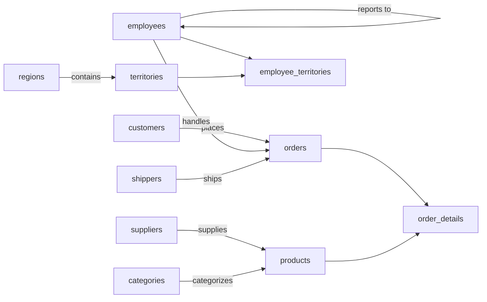

# Northwind — Semantic Model

## 1. Overview

The Northwind sample database models the trading operations of a fictional specialty-foods company. It tracks the products the company buys from suppliers and sells to customers, the orders those customers place, the employees who process the orders, and the shippers who deliver them. Sales territories and regions are also modeled, along with which employees are assigned to which territories.

## 2. Entity summary

| # | Table name | Singular label | Purpose |
|---|---|---|---|
| 1 | `regions` | Region | Top-level sales regions grouping territories. |
| 2 | `categories` | Category | Product categorization used across the catalog. |
| 3 | `customers` | Customer | Companies that place orders. |
| 4 | `employees` | Employee | Staff who process orders and are assigned to territories. |
| 5 | `suppliers` | Supplier | Vendors that provide products. |
| 6 | `products` | Product | Catalog items sold to customers. |
| 7 | `shippers` | Shipper | Carrier companies that deliver orders. |
| 8 | `orders` | Order | Customer purchase orders with shipping details. |
| 9 | `territories` | Territory | Sales territories grouped under regions. |
| 10 | `employee_territories` | Employee Territory | Junction linking employees to territories (M:N). |
| 11 | `order_details` | Order Detail | Line items within an order (junction linking orders to products). |

### Entity-relationship diagram

## 3. Entities

### 3.1 `regions` — Region

**Plural label:** Regions
**Label column:** `region_description`  _(the human-identifying field; auto-wired by Semantius)_
**Description:** Sales territories and geographic regions. Serves as the top-level grouping for territories.

**Fields**

| Field name | Format | Required | Label | Reference / Notes |
|---|---|---|---|---|
| `region_description` | `text` | yes | Region | label_column, searchable |

**Relationships**

- A `regions` row may have many `territories` records (1:N, via `territories.region_id`).

---

### 3.2 `categories` — Category

**Plural label:** Categories
**Label column:** `category_name`
**Description:** Product categories used to group items in the catalog.

**Fields**

| Field name | Format | Required | Label | Reference / Notes |
|---|---|---|---|---|
| `category_name` | `text` | yes | Category | label_column, searchable |
| `description` | `text` | yes | Description | Description of the product category; searchable |

**Relationships**

- A `categories` row may have many `products` records (1:N, via `products.category_id`).

---

### 3.3 `customers` — Customer

**Plural label:** Customers
**Label column:** `company_name`
**Description:** Customer companies that place orders, with contact and address details.

**Fields**

| Field name | Format | Required | Label | Reference / Notes |
|---|---|---|---|---|
| `company_name` | `text` | yes | Customer | label_column, searchable |
| `customer_id` | `text` | yes | Customer ID | unique, searchable; short code identifying the customer |
| `contact_name` | `text` | yes | Contact Name | searchable |
| `contact_title` | `text` | yes | Contact Title | Job title of the primary contact |
| `address` | `text` | yes | Street Address | |
| `city` | `text` | yes | City | searchable |
| `region` | `text` | no | Region | State or province |
| `postal_code` | `text` | yes | Postal Code | Postal or ZIP code |
| `country` | `text` | yes | Country | searchable |
| `phone` | `text` | yes | Phone | Primary phone number |
| `fax` | `text` | no | Fax | |

**Relationships**

- A `customers` row may have many `orders` records (1:N, via `orders.customer_id`).

---

### 3.4 `employees` — Employee

**Plural label:** Employees
**Label column:** `last_name`
**Description:** Staff records covering personal, contact, and reporting-structure details.

**Fields**

| Field name | Format | Required | Label | Reference / Notes |
|---|---|---|---|---|
| `last_name` | `text` | yes | Employee | label_column, searchable |
| `first_name` | `text` | yes | First Name | searchable |
| `title` | `text` | yes | Title | Job title |
| `title_of_courtesy` | `text` | no | Title of Courtesy | Courtesy title (Mr., Ms., Dr., etc.) |
| `birth_date` | `date` | no | Birth Date | |
| `hire_date` | `date` | yes | Hire Date | defaults to CURRENT_DATE |
| `address` | `text` | yes | Street Address | |
| `city` | `text` | yes | City | searchable |
| `region` | `text` | no | Region | State or province |
| `postal_code` | `text` | yes | Postal Code | Postal or ZIP code |
| `country` | `text` | yes | Country | searchable |
| `home_phone` | `text` | yes | Home Phone | |
| `extension` | `text` | no | Extension | Phone extension |
| `notes` | `text` | no | Notes | |
| `photo_path` | `text` | no | Photo Path | |
| `reports_to` | `reference` | no | Reports To | → `employees` (N:1, restrict); self-ref for reporting hierarchy |

**Relationships**

- An `employees` row may have an optional manager that is itself an `employees` row (N:1 self-reference, via `reports_to`).
- An `employees` row may have many `orders` records (1:N, via `orders.employee_id`).
- `employees` ↔ `territories` is many-to-many through the `employee_territories` junction table.

---

### 3.5 `suppliers` — Supplier

**Plural label:** Suppliers
**Label column:** `company_name`
**Description:** Vendor companies that supply products to the catalog.

**Fields**

| Field name | Format | Required | Label | Reference / Notes |
|---|---|---|---|---|
| `company_name` | `text` | yes | Supplier | label_column, searchable |
| `contact_name` | `text` | yes | Contact Name | searchable |
| `contact_title` | `text` | yes | Contact Title | Job title of the primary contact |
| `address` | `text` | yes | Street Address | |
| `city` | `text` | yes | City | searchable |
| `region` | `text` | no | Region | State or province |
| `postal_code` | `text` | yes | Postal Code | Postal or ZIP code |
| `country` | `text` | yes | Country | searchable |
| `phone` | `text` | yes | Phone | Primary phone number |
| `fax` | `text` | no | Fax | |
| `homepage` | `text` | no | Homepage | Supplier website URL |

**Relationships**

- A `suppliers` row may have many `products` records (1:N, via `products.supplier_id`).

---

### 3.6 `products` — Product

**Plural label:** Products
**Label column:** `product_name`
**Description:** Catalog items the company sells, including stock levels, pricing, and supplier/category links.

**Fields**

| Field name | Format | Required | Label | Reference / Notes |
|---|---|---|---|---|
| `product_name` | `text` | yes | Product | label_column, searchable |
| `supplier_id` | `reference` | yes | Supplier | → `suppliers` (N:1, restrict); supplier providing this product |
| `category_id` | `reference` | yes | Category | → `categories` (N:1, restrict); category this product belongs to |
| `quantity_per_unit` | `text` | yes | Quantity Per Unit | Quantity and unit of measure per package |
| `unit_price` | `float` | yes | Unit Price | defaults to 0.0 |
| `units_in_stock` | `int32` | yes | Units In Stock | defaults to 0; current stock quantity |
| `units_on_order` | `int32` | yes | Units On Order | defaults to 0; quantity currently on order from supplier |
| `reorder_level` | `int32` | yes | Reorder Level | defaults to 0; minimum stock level before reordering |
| `discontinued` | `boolean` | yes | Discontinued | defaults to FALSE; whether the product is discontinued |

**Relationships**

- A `products` row belongs to one `suppliers` (N:1, required, restrict on delete).
- A `products` row belongs to one `categories` (N:1, required, restrict on delete).
- `products` ↔ `orders` is many-to-many through the `order_details` junction table.

---

### 3.7 `shippers` — Shipper

**Plural label:** Shippers
**Label column:** `company_name`
**Description:** Carrier companies used to deliver orders.

**Fields**

| Field name | Format | Required | Label | Reference / Notes |
|---|---|---|---|---|
| `company_name` | `text` | yes | Shipper | label_column, searchable |
| `phone` | `text` | yes | Phone | |

**Relationships**

- A `shippers` row may have many `orders` records (1:N, via `orders.ship_via`).

---

### 3.8 `orders` — Order

**Plural label:** Orders
**Label column:** `ship_name`
**Description:** Customer purchase orders, including who placed and handled each one, shipping address, and delivery dates.

**Fields**

| Field name | Format | Required | Label | Reference / Notes |
|---|---|---|---|---|
| `ship_name` | `text` | yes | Order | label_column, searchable |
| `customer_id` | `reference` | yes | Customer | → `customers` (N:1, restrict); customer who placed the order |
| `employee_id` | `reference` | yes | Employee | → `employees` (N:1, restrict); employee who handled the order |
| `ship_via` | `reference` | yes | Shipped Via | → `shippers` (N:1, restrict); shipper used for this order |
| `ship_address` | `text` | yes | Ship Address | |
| `ship_city` | `text` | yes | Ship City | searchable |
| `ship_region` | `text` | no | Ship Region | State or province for shipment |
| `ship_postal_code` | `text` | yes | Ship Postal Code | |
| `ship_country` | `text` | yes | Ship Country | searchable |
| `freight` | `float` | yes | Freight | defaults to 0.0; freight cost for the order |
| `order_date` | `date` | yes | Order Date | defaults to CURRENT_DATE |
| `required_date` | `date` | yes | Required Date | defaults to CURRENT_DATE |
| `shipped_date` | `date` | no | Shipped Date | |

**Relationships**

- An `orders` row belongs to one `customers` (N:1, required, restrict on delete).
- An `orders` row belongs to one `employees` (N:1, required, restrict on delete).
- An `orders` row belongs to one `shippers` (N:1, required, restrict on delete).
- An `orders` row has many `order_details` records (1:N, via `order_details.order_id`).

---

### 3.9 `territories` — Territory

**Plural label:** Territories
**Label column:** `territory_description`
**Description:** Sales territories within regions. Each territory belongs to exactly one region and can be assigned to multiple employees.

**Fields**

| Field name | Format | Required | Label | Reference / Notes |
|---|---|---|---|---|
| `territory_description` | `text` | yes | Territory | label_column, searchable |
| `territory_id` | `text` | yes | Territory ID | unique, searchable; short code identifying the territory |
| `region_id` | `reference` | yes | Region | → `regions` (N:1, restrict); region this territory belongs to |

**Relationships**

- A `territories` row belongs to one `regions` (N:1, required, restrict on delete).
- `territories` ↔ `employees` is many-to-many through the `employee_territories` junction table.

---

### 3.10 `employee_territories` — Employee Territory

**Plural label:** Employee Territories
**Label column:** `label`  _(auto-generated generic label; no domain-level identifier on this junction)_
**Description:** Links employees to the territories they have been assigned to. Pure M:N junction.

**Fields**

| Field name | Format | Required | Label | Reference / Notes |
|---|---|---|---|---|
| `employee_id` | `parent` | yes | Employee | ↳ `employees` (N:1, restrict); reference to the employee |
| `territory_id` | `parent` | yes | Territory | ↳ `territories` (N:1, restrict); reference to the territory |

**Relationships**

- A junction row belongs to one `employees` and one `territories` (both parent FKs, required). Together these represent the M:N relationship between employees and territories.

---

### 3.11 `order_details` — Order Detail

**Plural label:** Order Details
**Label column:** `label`  _(auto-generated generic label; no domain-level identifier on this junction)_
**Description:** Line items within an order — which product was ordered, at what price, quantity, and discount. Junction between orders and products with additional line-level attributes.

**Fields**

| Field name | Format | Required | Label | Reference / Notes |
|---|---|---|---|---|
| `order_id` | `parent` | yes | Order | ↳ `orders` (N:1, restrict); reference to the order |
| `product_id` | `parent` | yes | Product | ↳ `products` (N:1, restrict); reference to the product |
| `unit_price` | `float` | yes | Unit Price | defaults to 0.0; actual price per unit charged on this order |
| `quantity` | `int32` | yes | Quantity | defaults to 0; number of units ordered |
| `discount` | `float` | yes | Discount | defaults to 0.0; discount rate applied to this line item |

**Relationships**

- An `order_details` row belongs to one `orders` (N:1, required, restrict on delete).
- An `order_details` row belongs to one `products` (N:1, required, restrict on delete).
- Together, the pair of parent FKs models the M:N relationship between orders and products, enriched with line-level pricing data.

## 4. Relationship summary

| From | Field | To | Cardinality | Kind | Delete behavior |
|---|---|---|---|---|---|
| `employees` | `reports_to` | `employees` | N:1 | reference (self) | restrict |
| `products` | `supplier_id` | `suppliers` | N:1 | reference | restrict |
| `products` | `category_id` | `categories` | N:1 | reference | restrict |
| `orders` | `customer_id` | `customers` | N:1 | reference | restrict |
| `orders` | `employee_id` | `employees` | N:1 | reference | restrict |
| `orders` | `ship_via` | `shippers` | N:1 | reference | restrict |
| `territories` | `region_id` | `regions` | N:1 | reference | restrict |
| `employee_territories` | `employee_id` | `employees` | N:1 | parent (junction) | restrict |
| `employee_territories` | `territory_id` | `territories` | N:1 | parent (junction) | restrict |
| `order_details` | `order_id` | `orders` | N:1 | parent (junction) | restrict |
| `order_details` | `product_id` | `products` | N:1 | parent (junction) | restrict |

## 5. Enumerations

No enumerations defined.

## 6. Open questions

### 6.1 🔴 Decisions needed (blockers)

None.

### 6.2 🟡 Future considerations (deferred scope)

None.

## 7. Implementation notes for the downstream agent

1. Create one module named `nwind` and two baseline permissions (`nwind:read`, `nwind:manage`) before any entity. The live module currently uses `nwind:view` / `nwind:manage` — align naming with the deployer's convention or keep the live names, but be explicit at deploy time.
2. Create entities in the order given in §2 — entities referenced by others first. Creation order that satisfies FK dependencies: `regions`, `categories`, `customers`, `suppliers`, `shippers`, `employees` (then a second pass for `employees.reports_to` self-reference), `products`, `territories`, `orders`, `employee_territories`, `order_details`.
3. For each entity: set `label_column` to the snake_case field marked as label_column in §3, pass `module_id`, `view_permission`, `edit_permission`. Do **not** manually create `id`, `created_at`, `updated_at`, or the auto-label field. For `employee_territories` and `order_details`, `label_column` defaults to `label` (the generic auto-label) — no dedicated label field is defined on the junction.
4. For each field in §3: pass `table_name`, `field_name`, `format`, `title` (the Label column), `is_nullable` (inverse of Required), and for `reference`/`parent` fields also `reference_table` and the `reference_delete_mode` consistent with §4 (all currently `restrict`).
5. **Deduplicate against Semantius built-in tables.** This model is self-contained and does not currently reference any Semantius built-in (e.g. `users`). All FK targets are nwind entities — no deduplication required.
6. After creation, spot-check that `label_column` on each entity resolves to a real field and that all `reference_table` targets exist.

**External / built-in entities referenced:** None. Every `reference_table` target resolves to an entity declared above.

**Self-references:** `employees.reports_to` → `employees`. Create the field in a second pass after `employees` exists.

**Junctions (create last):** `employee_territories` (parents: `employees`, `territories`), `order_details` (parents: `orders`, `products`, plus line-level scalar fields).
