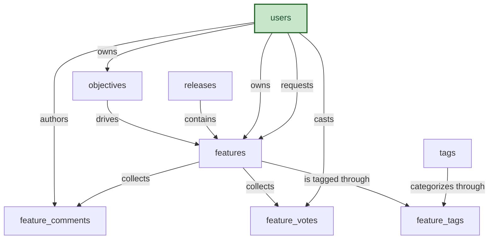

# Product Roadmap, Semantic Model

## 1. Overview

A single-product roadmap planning system. Product managers capture incoming feature requests, change requests, bugs, and tech-debt items as features, score them with RICE (reach × impact × confidence ÷ effort), align them to strategic objectives, and schedule the committed work into releases. Stakeholders contribute through weighted votes and threaded comments; tags provide cross-cutting categorization.

## 2. Entity summary

| # | Table name | Singular label | Purpose |
|---|---|---|---|
| 1 | `objectives` | Objective | Strategic goals or themes that features roll up to |
| 2 | `features` | Feature | Central entity, anything on the roadmap (idea, enhancement, change request, bug, tech debt) |
| 3 | `users` | User | PMs, owners, requesters, voters, stakeholders |
| 4 | `releases` | Release | Planned release with target/actual ship dates |
| 5 | `feature_votes` | Feature Vote | Junction, users voting for features (M:N) |
| 6 | `feature_comments` | Feature Comment | Discussion thread on a feature |
| 7 | `tags` | Tag | Reusable labels for categorizing features |
| 8 | `feature_tags` | Feature Tag | Junction, features and tags (M:N) |

### Entity-relationship diagram



### Permissions summary

| Permission | Type | Description | Used by | Included in |
|---|---|---|---|---|
| `product_roadmap:read` | baseline-read | Read access to every entity in the module. Typically: every user of the module. | every entity (`view_permission`) | — |
| `product_roadmap:manage` | baseline-manage | Edit operational records: objectives, features, releases, votes, comments, and feature-tag links. Typically: product managers, owners, contributors. | `objectives`, `features`, `users`, `releases`, `feature_votes`, `feature_comments`, `feature_tags` (`edit_permission`) | `product_roadmap:admin` |
| `product_roadmap:admin` | baseline-admin | Edit reference/config data (the tag catalog) and inherit every operational write plus every workflow permission. Typically: roadmap administrators, leadership. | `tags` (`edit_permission`); rollup target for `product_roadmap:release_release` | — |
| `product_roadmap:release_release` | workflow | Mark a release as released. Typically: release managers, product leads. | `releases` rule `release_requires_release_permission` (`require_permission`) | `product_roadmap:admin` |

## 3. Entities

### 3.1 `objectives`, Objective

**Plural label:** Objectives
**Label column:** `objective_name`
**Audit log:** yes
**Description:** A strategic goal or theme that features roll up to (e.g. "Reduce churn by 10%", "Mobile-first UX"). A light internal shadow of a richer OKR shape (key results, check-ins, confidence updates) that lives in a sibling domain.

**Fields**

| Field name | Format | Required | Label | Description | Reference / Notes |
|---|---|---|---|---|---|
| `objective_name` | `string` | yes | Name |  | label_column |
| `objective_description` | `multiline` | no | Description |  |  |
| `objective_period` | `string` | no | Period | Freeform period label, e.g. `Q2 2026`, `FY26` |  |
| `objective_status` | `enum` | yes | Status |  | values: `proposed`, `active`, `achieved`, `missed`, `cancelled`; default: "active" |
| `target_metric` | `string` | no | Target Metric |  |  |
| `objective_owner_id` | `reference` | no | Owner |  | → `users` (N:1), relationship_label: "owns" |

**Relationships**

- An `objective` may have one `objective_owner` (N:1 → `users`).
- An `objective` drives many `features` (1:N, via `features.objective_id`).

**Validation rules**

```json
[
  {
    "code": "objective_terminal_is_one_way",
    "message": "Once an objective is achieved, missed, or cancelled, its status cannot change.",
    "description": "achieved / missed / cancelled record the outcome of a strategic period; reopening a closed objective is a data-integrity bug, not a workflow.",
    "jsonlogic": {
      "or": [
        { "==": [{ "var": "$old" }, null] },
        { "!": { "in": [{ "var": "$old.objective_status" }, ["achieved", "missed", "cancelled"]] } },
        { "==": [{ "var": "objective_status" }, { "var": "$old.objective_status" }] }
      ]
    }
  }
]
```

**Input type rules**

```json
[
  {
    "field": "objective_status",
    "description": "Once an objective is closed (achieved, missed, or cancelled), its status is read-only.",
    "jsonlogic": {
      "if": [
        { "in": [{ "var": "objective_status" }, ["achieved", "missed", "cancelled"]] },
        "readonly",
        "default"
      ]
    }
  }
]
```

---

### 3.2 `features`, Feature

**Plural label:** Features
**Label column:** `feature_title`
**Audit log:** yes
**Description:** The central roadmap entity. Anything that lands on the roadmap is a feature, distinguished by its Type (new feature, enhancement, change request, bug, tech debt). Carries RICE scoring, status, source, target dates, and a target release once committed. A feature is considered committed once it has been planned, started, or shipped. Both target and actual start/completion dates are tracked so the team can measure plan-vs-actual cycle time. Once a feature is attached to a released release, the feature record is frozen as part of the immutable historical record of what shipped.

**Fields**

| Field name | Format | Required | Label | Description | Reference / Notes |
|---|---|---|---|---|---|
| `feature_title` | `string` | yes | Title |  | label_column |
| `feature_description` | `multiline` | no | Description |  |  |
| `feature_type` | `enum` | yes | Type |  | values: `new_feature`, `enhancement`, `change_request`, `bug`, `tech_debt`; default: "new_feature" |
| `feature_status` | `enum` | yes | Status |  | values: `new`, `under_review`, `planned`, `in_progress`, `shipped`, `declined`, `parked`; default: "new" |
| `feature_priority` | `enum` | no | Priority |  | values: `critical`, `high`, `medium`, `low`; default: "medium" |
| `feature_source` | `enum` | no | Source |  | values: `unspecified`, `customer`, `support`, `sales`, `internal`, `partner`; default: "unspecified" |
| `objective_id` | `reference` | no | Objective |  | → `objectives` (N:1), relationship_label: "drives" |
| `release_id` | `reference` | no | Release |  | → `releases` (N:1), relationship_label: "contains" |
| `requester_id` | `reference` | no | Requester |  | → `users` (N:1), relationship_label: "requests" |
| `owner_id` | `reference` | no | Owner (PM) |  | → `users` (N:1), relationship_label: "owns" |
| `submitted_at` | `date-time` | no | Submitted At |  |  |
| `target_start_date` | `date` | no | Target Start |  |  |
| `target_completion_date` | `date` | no | Target Completion |  |  |
| `actual_start_date` | `date` | no | Actual Start |  |  |
| `actual_completion_date` | `date` | no | Actual Completion |  |  |
| `reach_score` | `integer` | no | Reach | RICE reach: number of users/period reached |  |
| `impact_score` | `number` | no | Impact | RICE impact multiplier (typical 0.25, 0.5, 1, 2, 3) | precision: 2 |
| `confidence_score` | `number` | no | Confidence | RICE confidence as percentage (0-100) | precision: 2 |
| `effort_score` | `number` | no | Effort | RICE effort in person-months | precision: 2 |
| `rice_score` | `number` | no | RICE Score | (reach × impact × confidence) / effort | precision: 4; computed |

**Relationships**

- A `feature` may align with one `objective` (N:1, optional).
- A `feature` may be scheduled into one `release` (N:1, optional, null until committed and scheduled; required once shipped).
- A `feature` may have one `requester` and one `owner` (each N:1 → `users`).
- A `feature` has many `feature_comments` (1:N, via `feature_comments.feature_id`).
- `features` and `users` (voting) is M:N through the `feature_votes` junction.
- `features` and `tags` is M:N through the `feature_tags` junction.

**Computed fields**

```json
[
  {
    "name": "rice_score",
    "description": "(reach × impact × confidence) / effort, null when effort is missing or zero.",
    "jsonlogic": {
      "if": [
        { "and": [
          { "!=": [{ "var": "effort_score" }, null] },
          { ">":  [{ "var": "effort_score" }, 0] }
        ]},
        { "/": [
          { "*": [
            { "var": "reach_score" },
            { "var": "impact_score" },
            { "var": "confidence_score" }
          ]},
          { "var": "effort_score" }
        ]},
        null
      ]
    }
  }
]
```

**Validation rules**

```json
[
  {
    "code": "release_only_when_committed",
    "message": "A release can only be assigned once the feature is planned, in_progress, or shipped.",
    "description": "Commitment is derived from Status: planned, in_progress, or shipped imply the feature is committed; Release is only meaningful once committed.",
    "jsonlogic": {
      "or": [
        { "==": [{ "var": "release_id" }, null] },
        { "in": [{ "var": "feature_status" }, ["planned", "in_progress", "shipped"]] }
      ]
    }
  },
  {
    "code": "release_required_when_shipped",
    "message": "A shipped feature must reference the release it shipped in.",
    "description": "Paired with release_only_when_committed: a shipped feature shipped in some release, so Release can no longer be null at that terminal state.",
    "jsonlogic": {
      "or": [
        { "!=": [{ "var": "feature_status" }, "shipped"] },
        { "!=": [{ "var": "release_id" }, null] }
      ]
    }
  },
  {
    "code": "feature_shipped_is_one_way",
    "message": "Once a feature is shipped, its status cannot change.",
    "description": "shipped is the terminal outcome state; declined and parked are deliberately left reversible. Reopening a shipped feature should be a new feature record, not a status revert.",
    "jsonlogic": {
      "or": [
        { "==": [{ "var": "$old" }, null] },
        { "!=": [{ "var": "$old.feature_status" }, "shipped"] },
        { "==": [{ "var": "feature_status" }, "shipped"] }
      ]
    }
  },
  {
    "code": "features_locked_when_release_is_released",
    "message": "Cannot modify a feature attached to a released release.",
    "description": "Family-14 cross-entity gate. A released release is the immutable historical record of what shipped, so its feature roster is frozen. Blocks attaching a new feature to a released release on insert; blocks any edit (including detachment) on a feature whose prior release was already in the released state.",
    "jsonlogic": {
      "if": [
        { "and": [
          { "!=": [{ "var": "release_id" }, null] },
          { "set_record": ["new_release", "releases", { "var": "release_id" },
            { "==": [{ "var": "new_release.release_status" }, "released"] }
          ]}
        ]},
        { "throw_error": "Cannot attach a feature to a released release" },
        { "if": [
          { "and": [
            { "!=": [{ "var": "$old" }, null] },
            { "!=": [{ "var": "$old.release_id" }, null] },
            { "set_record": ["old_release", "releases", { "var": "$old.release_id" },
              { "==": [{ "var": "old_release.release_status" }, "released"] }
            ]}
          ]},
          { "throw_error": "Cannot modify a feature on a released release" },
          true
        ]}
      ]
    }
  },
  {
    "code": "target_dates_ordered",
    "message": "Target start date must be on or before target completion date.",
    "description": "When both target dates are set, completion cannot precede start; either field may still be null on its own.",
    "jsonlogic": {
      "or": [
        { "==": [{ "var": "target_start_date" }, null] },
        { "==": [{ "var": "target_completion_date" }, null] },
        { "<=": [{ "var": "target_start_date" }, { "var": "target_completion_date" }] }
      ]
    }
  },
  {
    "code": "actual_dates_ordered",
    "message": "Actual start date must be on or before actual completion date.",
    "description": "When both actual dates are set, completion cannot precede start; either field may still be null on its own.",
    "jsonlogic": {
      "or": [
        { "==": [{ "var": "actual_start_date" }, null] },
        { "==": [{ "var": "actual_completion_date" }, null] },
        { "<=": [{ "var": "actual_start_date" }, { "var": "actual_completion_date" }] }
      ]
    }
  },
  {
    "code": "actual_start_only_when_in_progress_or_later",
    "message": "Actual start date can only be set once the feature is in progress or shipped.",
    "description": "Actual Start records when work actually began; it has no domain meaning before the feature is in progress.",
    "jsonlogic": {
      "or": [
        { "==": [{ "var": "actual_start_date" }, null] },
        { "in": [{ "var": "feature_status" }, ["in_progress", "shipped"]] }
      ]
    }
  },
  {
    "code": "actual_start_required_when_shipped",
    "message": "A shipped feature must record its actual start date.",
    "description": "Paired with actual_start_only_when_in_progress_or_later: a shipped feature has actually started, so the start date is the historical record of when work began.",
    "jsonlogic": {
      "or": [
        { "!=": [{ "var": "feature_status" }, "shipped"] },
        { "!=": [{ "var": "actual_start_date" }, null] }
      ]
    }
  },
  {
    "code": "actual_completion_only_when_shipped",
    "message": "Actual completion date can only be set once the feature is shipped.",
    "description": "Actual Completion is the historical record of when the feature shipped; it has no domain meaning before that terminal state.",
    "jsonlogic": {
      "or": [
        { "==": [{ "var": "actual_completion_date" }, null] },
        { "==": [{ "var": "feature_status" }, "shipped"] }
      ]
    }
  },
  {
    "code": "actual_completion_required_when_shipped",
    "message": "A shipped feature must record its actual completion date.",
    "description": "Paired with actual_completion_only_when_shipped: at the terminal shipped state, Actual Completion is the historical record of when the feature shipped.",
    "jsonlogic": {
      "or": [
        { "!=": [{ "var": "feature_status" }, "shipped"] },
        { "!=": [{ "var": "actual_completion_date" }, null] }
      ]
    }
  },
  {
    "code": "reach_score_non_negative",
    "message": "Reach must be zero or greater.",
    "description": "RICE reach is a count of users/period reached; a negative count has no domain meaning.",
    "jsonlogic": {
      "or": [
        { "==": [{ "var": "reach_score" }, null] },
        { ">=": [{ "var": "reach_score" }, 0] }
      ]
    }
  },
  {
    "code": "impact_score_non_negative",
    "message": "Impact must be zero or greater.",
    "description": "RICE impact is a positive multiplier (typical 0.25 / 0.5 / 1 / 2 / 3); 0 means no impact, negative has no meaning.",
    "jsonlogic": {
      "or": [
        { "==": [{ "var": "impact_score" }, null] },
        { ">=": [{ "var": "impact_score" }, 0] }
      ]
    }
  },
  {
    "code": "confidence_score_in_range",
    "message": "Confidence must be between 0 and 100.",
    "description": "RICE confidence is documented as a percentage (0-100) on the Confidence field.",
    "jsonlogic": {
      "or": [
        { "==": [{ "var": "confidence_score" }, null] },
        { "and": [
          { ">=": [{ "var": "confidence_score" }, 0] },
          { "<=": [{ "var": "confidence_score" }, 100] }
        ]}
      ]
    }
  },
  {
    "code": "effort_score_non_negative",
    "message": "Effort must be zero or greater.",
    "description": "RICE effort is in person-months; a negative count has no domain meaning. Zero effort is permitted (RICE Score returns null in that case rather than dividing by zero).",
    "jsonlogic": {
      "or": [
        { "==": [{ "var": "effort_score" }, null] },
        { ">=": [{ "var": "effort_score" }, 0] }
      ]
    }
  }
]
```

**Input type rules**

```json
[
  {
    "field": "feature_status",
    "description": "Once a feature is shipped, its status is read-only.",
    "jsonlogic": {
      "if": [
        { "==": [{ "var": "feature_status" }, "shipped"] },
        "readonly",
        "default"
      ]
    }
  },
  {
    "field": "release_id",
    "description": "Release is required once the feature is shipped.",
    "jsonlogic": {
      "if": [
        { "==": [{ "var": "feature_status" }, "shipped"] },
        "required",
        "default"
      ]
    }
  },
  {
    "field": "actual_start_date",
    "description": "Hidden until the feature is in progress; required once shipped.",
    "jsonlogic": {
      "if": [
        { "==": [{ "var": "feature_status" }, "shipped"] },
        "required",
        { "if": [
          { "==": [{ "var": "feature_status" }, "in_progress"] },
          "default",
          "hidden"
        ]}
      ]
    }
  },
  {
    "field": "actual_completion_date",
    "description": "Hidden until the feature is shipped; required at that point.",
    "jsonlogic": {
      "if": [
        { "==": [{ "var": "feature_status" }, "shipped"] },
        "required",
        "hidden"
      ]
    }
  }
]
```

---

### 3.3 `users`, User

**Plural label:** Users
**Label column:** `display_name`
**Audit log:** no
**Description:** People who participate in the roadmap process: product managers, owners, requesters, voters, and stakeholders. Shared with the platform's user catalog.

**Fields**

| Field name | Format | Required | Label | Description | Reference / Notes |
|---|---|---|---|---|---|
| `display_name` | `string` | yes | Display Name |  | label_column |
| `email` | `email` | yes | Email |  | unique |
| `is_disabled` | `boolean` | no | Disabled |  |  |

**Relationships**

- A `user` may own many `objectives` and `features` (1:N for each, via the respective `objective_owner_id` / `owner_id` field).
- A `user` may request many `features` (1:N, via `features.requester_id`).
- A `user` may author many `feature_comments` (1:N, via `feature_comments.author_id`).
- `users` and `features` (voting) is M:N through the `feature_votes` junction.

---

### 3.4 `releases`, Release

**Plural label:** Releases
**Label column:** `release_name`
**Audit log:** yes
**Description:** A planned release with target and actual ship dates. Features are scheduled into a release once committed.

**Fields**

| Field name | Format | Required | Label | Description | Reference / Notes |
|---|---|---|---|---|---|
| `release_name` | `string` | yes | Name |  | label_column; unique |
| `release_description` | `multiline` | no | Description |  |  |
| `release_status` | `enum` | yes | Status |  | values: `planned`, `in_progress`, `released`, `cancelled`; default: "planned" |
| `target_release_date` | `date` | no | Target Date |  |  |
| `actual_release_date` | `date` | no | Actual Date |  |  |
| `release_notes` | `html` | no | Release Notes | Rich-text summary published with the release |  |

**Relationships**

- A `release` contains many `features` (1:N, via `features.release_id`).

**Validation rules**

```json
[
  {
    "code": "actual_date_only_when_released",
    "message": "Actual release date can only be set once the release status is released.",
    "description": "Actual Date is null until the release reaches its terminal released state.",
    "jsonlogic": {
      "or": [
        { "==": [{ "var": "actual_release_date" }, null] },
        { "==": [{ "var": "release_status" }, "released"] }
      ]
    }
  },
  {
    "code": "released_requires_actual_date",
    "message": "A released release must record its actual release date.",
    "description": "Paired with actual_date_only_when_released: once status reaches the terminal released state, the actual date is the historical record of when it shipped.",
    "jsonlogic": {
      "or": [
        { "!=": [{ "var": "release_status" }, "released"] },
        { "!=": [{ "var": "actual_release_date" }, null] }
      ]
    }
  },
  {
    "code": "release_released_is_one_way",
    "message": "Once a release is released, its status cannot change.",
    "description": "released is the terminal shipped state; cancelled is deliberately left reversible. Un-releasing breaks the historical record of what shipped when.",
    "jsonlogic": {
      "or": [
        { "==": [{ "var": "$old" }, null] },
        { "!=": [{ "var": "$old.release_status" }, "released"] },
        { "==": [{ "var": "release_status" }, "released"] }
      ]
    }
  },
  {
    "code": "release_requires_release_permission",
    "message": "Only release managers may set a release's status to released.",
    "description": "Transitioning a release to its terminal released state is a workflow gate restricted to holders of the release-release permission; runs in addition to the one-way-terminal rule that locks it after the fact.",
    "jsonlogic": {
      "if": [
        { "and": [
          { "value_changed": "release_status" },
          { "==": [{ "var": "release_status" }, "released"] }
        ] },
        { "require_permission": "product_roadmap:release_release" },
        true
      ]
    }
  }
]
```

**Input type rules**

```json
[
  {
    "field": "release_status",
    "description": "Once a release is released, its status is read-only.",
    "jsonlogic": {
      "if": [
        { "==": [{ "var": "release_status" }, "released"] },
        "readonly",
        "default"
      ]
    }
  },
  {
    "field": "actual_release_date",
    "description": "Hidden until the release is released; required at that point.",
    "jsonlogic": {
      "if": [
        { "==": [{ "var": "release_status" }, "released"] },
        "required",
        "hidden"
      ]
    }
  }
]
```

---

### 3.5 `feature_votes`, Feature Vote

**Plural label:** Feature Votes
**Label column:** `feature_vote_label`
**Audit log:** no
**Description:** Junction table representing a user's vote on a feature. Supports weighted votes for stakeholder tiers. The label is auto-composed at write time from the voter's display name and the feature's title. The vote's weight is the tunable strength signal. Votes are not accepted on features whose status is shipped or declined (the planning signal is moot once the decision is made).

**Fields**

| Field name | Format | Required | Label | Description | Reference / Notes |
|---|---|---|---|---|---|
| `feature_vote_label` | `string` | yes | Label |  | label_column; computed |
| `feature_id` | `parent` | yes | Feature |  | → `features` (N:1), cascade; relationship_label: "collects" |
| `user_id` | `parent` | yes | User |  | → `users` (N:1), cascade; relationship_label: "casts" |
| `voted_at` | `date-time` | no | Voted At |  |  |
| `vote_weight` | `integer` | no | Weight | Higher value = stronger signal | default: "1" |

**Relationships**

- A `feature_vote` belongs to one `feature` (N:1) and one `user` (N:1).
- Acts as the junction for the M:N relationship between `features` and `users`.

**Computed fields**

```json
[
  {
    "name": "feature_vote_label",
    "description": "Composed at write time from the voter's display name and the feature's title via nested cross-entity lookups.",
    "jsonlogic": {
      "set_record": ["voter", "users", { "var": "user_id" },
        { "set_record": ["feature", "features", { "var": "feature_id" },
          { "cat": [{ "var": "voter.display_name" }, " → ", { "var": "feature.feature_title" }] }
        ]}
      ]
    }
  }
]
```

**Validation rules**

```json
[
  {
    "code": "vote_weight_positive",
    "message": "Vote weight must be at least 1.",
    "description": "Weight is documented as a strength signal where higher = stronger; zero or negative weight has no domain meaning.",
    "jsonlogic": {
      "or": [
        { "==": [{ "var": "vote_weight" }, null] },
        { ">=": [{ "var": "vote_weight" }, 1] }
      ]
    }
  },
  {
    "code": "feature_votes_blocked_on_terminal_feature",
    "message": "Votes are not accepted on shipped or declined features.",
    "description": "Family-14 cross-entity gate. Once the parent feature reaches shipped or declined, votes and weight changes lose their planning signal; parked features remain votable so revival signal still works. Applies to both inserts and weight updates.",
    "jsonlogic": {
      "set_record": ["parent_feature", "features", { "var": "feature_id" },
        { "if": [
          { "in": [{ "var": "parent_feature.feature_status" }, ["shipped", "declined"]] },
          { "throw_error": "Cannot vote on a shipped or declined feature" },
          true
        ]}
      ]
    }
  }
]
```

---

### 3.6 `feature_comments`, Feature Comment

**Plural label:** Feature Comments
**Label column:** `feature_comment_label`
**Audit log:** no
**Description:** A discussion message posted by a user on a feature. The label is auto-computed at write time as the first ~80 characters of the body for list display. Comments are collaborative: any user with module-edit access may edit or delete any comment. New comments are not accepted once the parent feature has shipped (the thread freezes); existing comments may still be edited for typo fixes. Declined and parked features remain open for ongoing discussion (retros, "why was this declined?").

**Fields**

| Field name | Format | Required | Label | Description | Reference / Notes |
|---|---|---|---|---|---|
| `feature_comment_label` | `string` | yes | Label |  | label_column; computed |
| `feature_id` | `parent` | yes | Feature |  | → `features` (N:1), cascade; relationship_label: "collects" |
| `author_id` | `reference` | no | Author |  | → `users` (N:1), clear; relationship_label: "authors" |
| `feature_comment_body` | `multiline` | yes | Body |  |  |
| `posted_at` | `date-time` | no | Posted At |  |  |

**Relationships**

- A `feature_comment` belongs to one `feature` (N:1, required).
- A `feature_comment` is authored by one `user` (N:1, set null on user delete so the comment survives as orphaned).

**Computed fields**

```json
[
  {
    "name": "feature_comment_label",
    "description": "First 80 characters of the comment body, for list display.",
    "jsonlogic": { "substr": [{ "var": "feature_comment_body" }, 0, 80] }
  }
]
```

**Validation rules**

```json
[
  {
    "code": "author_required_on_insert",
    "message": "Author must be set when a comment is created.",
    "description": "Author is required on insert (caller must always set) but nullable in storage so comments survive when their author is deleted. The check fires only on insert.",
    "jsonlogic": {
      "or": [
        { "!=": [{ "var": "$old" }, null] },
        { "!=": [{ "var": "author_id" }, null] }
      ]
    }
  },
  {
    "code": "feature_comments_no_new_on_shipped",
    "message": "New comments are not accepted on shipped features.",
    "description": "Family-14 gate, insert-only. Once a feature is shipped, the discussion thread freezes for new entries; existing comments can still be edited (typo fixes). Declined and parked features remain open for ongoing discussion.",
    "jsonlogic": {
      "or": [
        { "!=": [{ "var": "$old" }, null] },
        { "set_record": ["parent_feature", "features", { "var": "feature_id" },
          { "if": [
            { "==": [{ "var": "parent_feature.feature_status" }, "shipped"] },
            { "throw_error": "Cannot post new comments on a shipped feature" },
            true
          ]}
        ]}
      ]
    }
  }
]
```

---

### 3.7 `tags`, Tag

**Plural label:** Tags
**Label column:** `tag_name`
**Audit log:** no
**Edit permission:** admin
**Description:** A reusable label for categorizing features (e.g. mobile, enterprise, platform). Typically seeded with a small set of organization-wide categories and extended occasionally by roadmap administrators.

**Fields**

| Field name | Format | Required | Label | Description | Reference / Notes |
|---|---|---|---|---|---|
| `tag_name` | `string` | yes | Name |  | label_column; unique |
| `tag_color` | `string` | no | Color | Hex color, e.g. `#3b82f6` |  |
| `tag_description` | `multiline` | no | Description |  |  |

**Relationships**

- `tags` and `features` is M:N through the `feature_tags` junction.

---

### 3.8 `feature_tags`, Feature Tag

**Plural label:** Feature Tags
**Label column:** `feature_tag_label`
**Audit log:** no
**Description:** Junction table linking features to tags. The label is auto-composed at write time from the feature's title and the tag's name.

**Fields**

| Field name | Format | Required | Label | Description | Reference / Notes |
|---|---|---|---|---|---|
| `feature_tag_label` | `string` | yes | Label |  | label_column; computed |
| `feature_id` | `parent` | yes | Feature |  | → `features` (N:1), cascade; relationship_label: "is tagged through" |
| `tag_id` | `reference` | yes | Tag |  | → `tags` (N:1), restrict; relationship_label: "categorizes through" |

**Relationships**

- A `feature_tag` belongs to one `feature` (N:1, cascade on parent delete).
- A `feature_tag` references one `tag` (N:1, restrict on tag delete to prevent the tag catalog being silently torn down by junction churn).
- Acts as the junction for the M:N relationship between `features` and `tags`.

**Computed fields**

```json
[
  {
    "name": "feature_tag_label",
    "description": "Composed at write time from the feature's title and the tag's name via nested cross-entity lookups.",
    "jsonlogic": {
      "set_record": ["feature", "features", { "var": "feature_id" },
        { "set_record": ["tag", "tags", { "var": "tag_id" },
          { "cat": [{ "var": "feature.feature_title" }, " / ", { "var": "tag.tag_name" }] }
        ]}
      ]
    }
  }
]
```

## 4. Relationship summary

| From | Field | To | Cardinality | Kind | Delete behavior |
|---|---|---|---|---|---|
| `objectives` | `objective_owner_id` | `users` | N:1 | reference | clear |
| `features` | `objective_id` | `objectives` | N:1 | reference | clear |
| `features` | `release_id` | `releases` | N:1 | reference | clear |
| `features` | `requester_id` | `users` | N:1 | reference | clear |
| `features` | `owner_id` | `users` | N:1 | reference | clear |
| `feature_votes` | `feature_id` | `features` | N:1 | parent (junction) | cascade |
| `feature_votes` | `user_id` | `users` | N:1 | parent (junction) | cascade |
| `feature_comments` | `feature_id` | `features` | N:1 | parent | cascade |
| `feature_comments` | `author_id` | `users` | N:1 | reference | clear |
| `feature_tags` | `feature_id` | `features` | N:1 | parent (junction) | cascade |
| `feature_tags` | `tag_id` | `tags` | N:1 | reference | restrict |

## 5. Enumerations

### 5.1 `objectives.objective_status`
- `proposed`
- `active`
- `achieved`
- `missed`
- `cancelled`

### 5.2 `features.feature_type`
- `new_feature`
- `enhancement`
- `change_request`
- `bug`
- `tech_debt`

### 5.3 `features.feature_status`
- `new`
- `under_review`
- `planned`
- `in_progress`
- `shipped`
- `declined`
- `parked`

### 5.4 `features.feature_priority`
- `critical`
- `high`
- `medium`
- `low`

### 5.5 `features.feature_source`
- `unspecified`
- `customer`
- `support`
- `sales`
- `internal`
- `partner`

### 5.6 `releases.release_status`
- `planned`
- `in_progress`
- `released`
- `cancelled`

## 6. Cross-model link suggestions

| From | To | Verb | Cardinality | Delete |
|---|---|---|---|---|
| `key_results` | `objectives` | is broken into | N:1 | clear |
| `issues` | `features` | is implemented by | N:1 | clear |
| `features` | `epics` | groups | N:1 | clear |
| `deployments` | `releases` | is deployed via | N:1 | clear |
| `releases` | `release_trains` | schedules | N:1 | clear |
| `features` | `accounts` | requests | N:1 | clear |
| `features` | `cost_centers` | funds | N:1 | clear |
| `cost_allocations` | `features` | is funded by | N:1 | clear |
| `insights` | `features` | is supported by | N:1 | clear |
| `feature_adoption_metrics` | `features` | is measured by | N:1 | clear |

## 7. Open questions

### 7.1 🔴 Decisions needed (blockers)

None.

### 7.2 🟡 Future considerations (deferred scope)

- Should the platform enforce a unique (feature_id, user_id) pair on feature_votes to prevent duplicate votes per user? Currently relies on caller-side dedup.
- Should the platform enforce a unique (feature_id, tag_id) pair on feature_tags to prevent duplicate tag assignments? Currently relies on caller-side dedup.
- Should a feature reaching the shipped state become a formal workflow gate restricted to a dedicated "ship feature" permission, if PM authority over shipping needs to be held more tightly than the operational manage tier?
- Should feature comments lock to author-only edits, with a manager-override permission granting unrestricted edit and delete, instead of the current explicitly-collaborative posture?
- Should feature-level cost data be added inside this model later, or always integrated through a Budgeting sibling domain via the §6 cross-model rows?
- Should the feature status values declined or parked become one-way terminal states (currently only shipped is) if governance ever requires an immutable rejection trail?
- Should the release status cancelled become one-way terminal too if cancelling a release should be a permanent record?
- Should new features be blocked from being filed under a missed or cancelled objective (a family-14 parent-state gate on the feature's Objective link), or should post-mortem features remain attachable to closed objectives for retrospective analysis?
- Should tag changes be blocked once the parent feature is shipped (a family-14 gate on the feature-tag's Feature link), or should re-tagging for reporting remain open after shipping?
- Should a feature be splittable across multiple releases (e.g. phase 1 / phase 2) by promoting the feature-to-release link from a single foreign key to a feature-releases junction with phase metadata?
- Should RICE estimates be tracked as a separate estimates entity to retain history (who scored what when, and how the score evolved), instead of living as fields on features?
- Should features be linkable to specific customers/accounts via a richer customer-requests junction (M:N) so the team can answer "which customers asked for this and how many"? A simple N:1 feature-to-account foreign key is already proposed as a §6 cross-model hint; the junction would be the richer M:N upgrade.
- Should the objective Period field be promoted from a freeform string to a structured time-periods entity (with start/end dates and a fiscal-period type) if cross-objective period rollups, period-over-period comparisons, or period-scoped reporting become needed?
- Should features support dependencies on other features (a feature-dependencies self-junction with predecessor / successor cardinality)?
- Should the feature Source field be promoted from an enum to its own feature-sources entity if sources need their own metadata (URL, channel, contact person)?
- Should attachments (mockups, specs, screenshots) be modeled as a first-class attachments entity linked to features?
- Should releases carry capacity data (team capacity vs. allocated effort) to support release-load planning?
- Should a strategic tier above objectives (e.g. initiatives) be introduced if the org begins planning multi-objective programs?
- Should the system later support multiple products (reintroducing a products entity that owns objectives, features, and releases) if the company expands beyond a single product?

## 8. Implementation notes for the downstream agent

1. Create one module named `product_roadmap` (the module name **must** equal the `system_slug` from the front-matter; do not invent a different module slug). Then iterate the §2 Permissions summary table in order: for each row, call `create_permission` with the `Permission` and `Description` columns; for each row whose `Included in` cell is non-`—`, call `create_permission_hierarchy` with `including_permission_id = <Included in>.id, included_permission_id = <row's Permission>.id` (read: `<Included in>` *includes* `<row's Permission>`). The §2 table is the canonical permission catalog; do not re-enumerate permissions here.
2. Create entities in dependency order. Recommended: `users`, `objectives`, `releases`, `tags`, `features`, `feature_votes`, `feature_comments`, `feature_tags`.
3. For each entity: set `label_column` to the snake_case field marked as label_column in §3, pass `module_id`, `view_permission` = `product_roadmap:read`, and `edit_permission` = `product_roadmap:manage` for every entity except `tags`, which uses `edit_permission` = `product_roadmap:admin` per the §3 `**Edit permission:** admin` annotation. Do **not** manually create `id`, `created_at`, `updated_at`, or the auto-label field.
4. For each field in §3: pass `table_name`, `field_name`, `format`, `title` (the Label column), and for `reference` / `parent` fields also `reference_table` and a `reference_delete_mode` consistent with §4. Pass `relationship_label` from the §3 Notes column for every FK so navigation breadcrumbs and ER docs render correctly. Pass the §3 Description cell verbatim as the field's `description`. (The §3 `Required` column is analyst intent; the platform manages nullability internally.)
5. **Fix up each entity's auto-created label-column field title.** `create_entity` auto-creates a field whose `field_name` equals the entity's `label_column`, with `title` defaulting to `singular_label`. Every entity in this model has a label_column whose §3 Label differs from its `singular_label`, so every entity needs the fixup. After each `create_entity`, follow up with `update_field` (id passed as a **string** in the form `"{table_name}.{field_name}"`) to set the correct title:
   - `"objectives.objective_name"` → title `"Name"`
   - `"features.feature_title"` → title `"Title"`
   - `"users.display_name"` → title `"Display Name"`
   - `"releases.release_name"` → title `"Name"`
   - `"feature_votes.feature_vote_label"` → title `"Label"`
   - `"feature_comments.feature_comment_label"` → title `"Label"`
   - `"tags.tag_name"` → title `"Name"`
   - `"feature_tags.feature_tag_label"` → title `"Label"`
6. **Apply each entity's computed_fields, validation_rules, and input_type_rules blocks byte-for-byte.** The JSON arrays in §3 are passed directly to `create_entity` (or `update_entity` if the entity already exists). Do not paraphrase the JsonLogic; the platform evaluates it on every INSERT/UPDATE (validation, computed) and on every form render (input_type_rules). Entities with no block (`users`, `tags`) get neither argument.
7. **Deduplicate against Semantius built-in tables.** This model declares `users` as a self-contained entity. Before creating it, inspect the live catalog: if a Semantius built-in `users` table exists, **skip the create** and reuse it as the `reference_table` target for every FK pointing to `users` (`objective_owner_id`, `requester_id`, `owner_id`, `author_id`, `feature_votes.user_id`). Only add missing fields to the reused table if they are required by this model and the addition is low-risk. The fields declared here (`display_name`, `email`, `is_disabled`) match the Semantius built-in's standard shape; no additional fields should be needed.
8. **Apply §6 cross-model link suggestions.** For each row, inspect the live catalog for the target table. When present, additively create the FK column on the `From` side with `reference_table` set to the resolved table name, `reference_delete_mode` matching the row's `Delete` column, and `relationship_label` matching the row's `Verb`. Outbound rows whose `From` is a table in this model (`features → epics`, `features → accounts`, `features → cost_centers`, `releases → release_trains`) add the FK to this model's table. Inbound rows whose `From` is a sibling-owned table (`key_results → objectives`, `issues → features`, `deployments → releases`, `cost_allocations → features`, `insights → features`, `feature_adoption_metrics → features`) add the FK to the sibling's table at deploy time, when the sibling later arrives. If multiple candidate tables match (e.g. `accounts` / `customers` / `companies`), surface the choice to the user. If no candidate exists, silently skip; do not create a placeholder table.
9. After creation, spot-check that `label_column` on each entity resolves to a real string field and that all `reference_table` targets exist. Verify the three junction `*_label` computed fields evaluate correctly on a sample insert (each composes its value from the parent records via cross-entity lookup).
