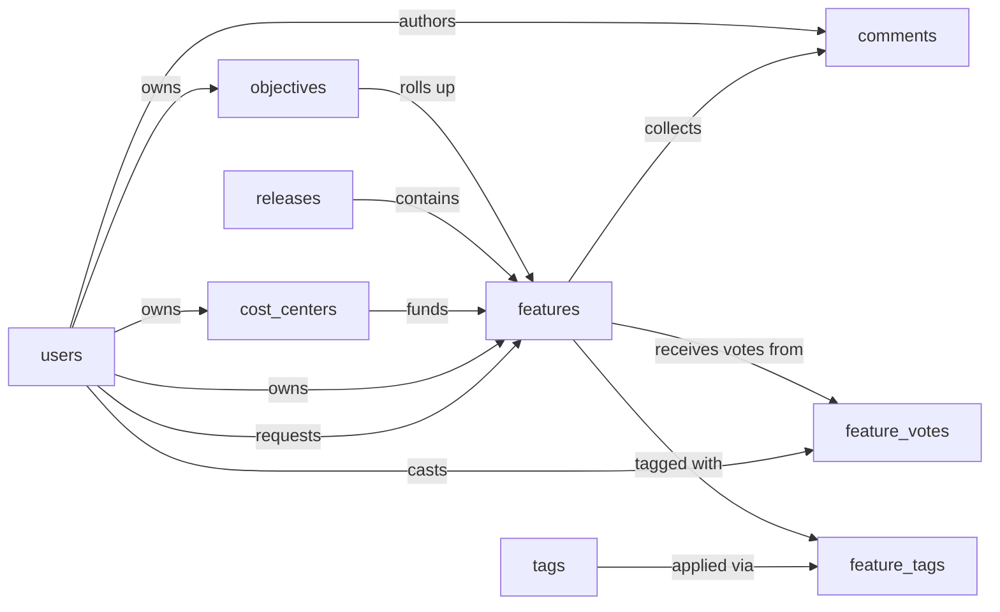

# Product Roadmap — Semantic Model

## 1. Overview

A single-product roadmap planning system. Product managers capture incoming feature requests, change requests, bugs, and tech-debt items as `features`, score them with RICE (reach × impact × confidence ÷ effort), align them to strategic `objectives`, and schedule the committed work into `releases`. Features carry estimated and actual cost and are assigned to a `cost_center` so spend can be rolled up. Stakeholders contribute through `feature_votes` and `comments`; `tags` provide cross-cutting categorization.

## 2. Entity summary

| # | Table name | Singular label | Purpose |
|---|---|---|---|
| 1 | `objectives` | Objective | Strategic goals or themes that features roll up to |
| 2 | `features` | Feature | Central entity, anything on the roadmap (idea, enhancement, change request, bug, tech debt) |
| 3 | `users` | User | PMs, owners, requesters, voters |
| 4 | `releases` | Release | Planned release with target/actual ship dates |
| 5 | `feature_votes` | Feature Vote | Junction, users voting for features (M:N) |
| 6 | `comments` | Comment | Discussion thread on a feature |
| 7 | `tags` | Tag | Reusable labels for categorizing features |
| 8 | `feature_tags` | Feature Tag | Junction, features and tags (M:N) |
| 9 | `cost_centers` | Cost Center | Funding bucket features are charged to; enables cost roll-up |

### Entity-relationship diagram

## 3. Entities

### 3.1 `objectives` — Objective

**Plural label:** Objectives
**Label column:** `objective_name`
**Audit log:** yes
**Description:** A strategic goal or theme that features roll up to (e.g. "Reduce churn by 10%", "Mobile-first UX").

**Fields**

| Field name | Format | Required | Label | Reference / Notes |
|---|---|---|---|---|
| `objective_name` | `string` | yes | Name | label_column; default: "" |
| `objective_description` | `text` | no | Description | |
| `objective_period` | `string` | no | Period | e.g. `Q2 2026`, `FY26` |
| `objective_status` | `enum` | no | Status | values: `proposed`, `active`, `achieved`, `missed`, `cancelled`; default: "proposed" |
| `target_metric` | `string` | no | Target Metric | freeform target text |
| `objective_owner_id` | `reference` | no | Owner | → `users` (N:1), relationship_label: "owns" |

**Relationships**

- An `objective` may have one `objective_owner` (N:1 → `users`).
- An `objective` rolls up many `features` (1:N, via `features.objective_id`).

---

### 3.2 `features` — Feature

**Plural label:** Features
**Label column:** `feature_title`
**Audit log:** yes
**Description:** The central roadmap entity. Anything that lands on the roadmap is a feature, distinguished by `feature_type` (new feature, enhancement, change request, bug, tech debt). Carries RICE scoring, status, source, cost, and a target release once committed. Commitment is derived from `feature_status`: a feature is considered committed once its status is `planned`, `in_progress`, or `shipped`.

**Fields**

| Field name | Format | Required | Label | Reference / Notes |
|---|---|---|---|---|
| `feature_title` | `string` | yes | Title | label_column; default: "" |
| `feature_description` | `text` | no | Description | |
| `feature_type` | `enum` | yes | Type | values: `new_feature`, `enhancement`, `change_request`, `bug`, `tech_debt`; default: "new_feature" |
| `feature_status` | `enum` | yes | Status | values: `new`, `under_review`, `planned`, `in_progress`, `shipped`, `declined`, `parked`; default: "new"; commitment is derived (status ∈ {planned, in_progress, shipped} ⇒ committed) |
| `feature_priority` | `enum` | no | Priority | values: `critical`, `high`, `medium`, `low`; default: "medium" |
| `feature_source` | `enum` | no | Source | values: `customer`, `support`, `sales`, `internal`, `partner` |
| `objective_id` | `reference` | no | Objective | → `objectives` (N:1), relationship_label: "rolls up" |
| `release_id` | `reference` | no | Release | → `releases` (N:1); null until scheduled, relationship_label: "contains" |
| `cost_center_id` | `reference` | no | Cost Center | → `cost_centers` (N:1); funding bucket the feature is charged to, relationship_label: "funds" |
| `requester_id` | `reference` | no | Requester | → `users` (N:1), relationship_label: "requests" |
| `owner_id` | `reference` | no | Owner (PM) | → `users` (N:1), relationship_label: "owns" |
| `submitted_at` | `date-time` | no | Submitted At | |
| `target_start_date` | `date` | no | Target Start | |
| `target_completion_date` | `date` | no | Target Completion | |
| `reach_score` | `integer` | no | Reach | RICE: # users/period reached |
| `impact_score` | `float` | no | Impact | RICE: typical 0.25, 0.5, 1, 2, 3 |
| `confidence_score` | `float` | no | Confidence | RICE: percentage (0-100) |
| `effort_score` | `float` | no | Effort | RICE: person-months |
| `rice_score` | `float` | no | RICE Score | (reach × impact × confidence) / effort |
| `estimated_cost` | `double` | no | Estimated Cost | currency amount; budget side |
| `actual_cost` | `double` | no | Actual Cost | currency amount; populated as work ships |

**Relationships**

- A `feature` may align with one `objective` (N:1, optional).
- A `feature` may be scheduled into one `release` (N:1, optional, null until committed and scheduled).
- A `feature` may be charged to one `cost_center` (N:1, optional).
- A `feature` may have one `requester` and one `owner` (each N:1 → `users`).
- A `feature` has many `comments` (1:N, via `comments.feature_id`).
- `features` and `users` (voting) is M:N through the `feature_votes` junction.
- `features` and `tags` is M:N through the `feature_tags` junction.

---

### 3.3 `users` — User

**Plural label:** Users
**Label column:** `user_full_name`
**Audit log:** no
**Description:** People who participate in the roadmap process: product managers, owners, requesters, voters, and stakeholders.

**Fields**

| Field name | Format | Required | Label | Reference / Notes |
|---|---|---|---|---|
| `user_full_name` | `string` | yes | Full Name | label_column; default: "" |
| `user_email` | `email` | yes | Email | unique; default: "" |
| `user_role` | `enum` | no | Role | values: `admin`, `product_manager`, `engineering`, `stakeholder`, `viewer`; default: "viewer" |
| `user_status` | `enum` | no | Status | values: `active`, `inactive`; default: "active" |

**Relationships**

- A `user` may own many `objectives`, `features`, and `cost_centers` (1:N for each, via the respective `*_owner_id` / `owner_id` field).
- A `user` may request many `features` (1:N, via `features.requester_id`).
- A `user` may author many `comments` (1:N, via `comments.author_id`).
- `users` and `features` (voting) is M:N through the `feature_votes` junction.

---

### 3.4 `releases` — Release

**Plural label:** Releases
**Label column:** `release_name`
**Audit log:** yes
**Description:** A planned release with target and actual ship dates. Features are scheduled into a release once committed.

**Fields**

| Field name | Format | Required | Label | Reference / Notes |
|---|---|---|---|---|
| `release_name` | `string` | yes | Name | label_column; unique; e.g. `v2.5`, `March 2026 Release`; default: "" |
| `release_description` | `text` | no | Description | |
| `release_status` | `enum` | yes | Status | values: `planned`, `in_progress`, `released`, `cancelled`; default: "planned" |
| `target_release_date` | `date` | no | Target Date | |
| `actual_release_date` | `date` | no | Actual Date | |
| `release_notes` | `html` | no | Release Notes | rich-text summary published with the release |

**Relationships**

- A `release` contains many `features` (1:N, via `features.release_id`).

---

### 3.5 `feature_votes` — Feature Vote

**Plural label:** Feature Votes
**Label column:** `feature_vote_label`
**Audit log:** no
**Description:** Junction table representing a user's vote on a feature. Supports weighted votes for stakeholder tiers. The caller must populate `feature_vote_label` on creation (e.g. `"{user_full_name} → {feature_title}"`).

**Fields**

| Field name | Format | Required | Label | Reference / Notes |
|---|---|---|---|---|
| `feature_vote_label` | `string` | yes | Label | label_column; caller populates as `{user_full_name} → {feature_title}`; default: "" |
| `feature_id` | `reference` | yes | Feature | → `features` (N:1), relationship_label: "receives votes from" |
| `user_id` | `reference` | yes | User | → `users` (N:1), relationship_label: "casts" |
| `voted_at` | `date-time` | no | Voted At | |
| `vote_weight` | `integer` | no | Weight | default 1; higher = stronger signal |

**Relationships**

- A `feature_vote` belongs to one `feature` (N:1) and one `user` (N:1).
- Acts as the junction for the M:N relationship between `features` and `users`.

---

### 3.6 `comments` — Comment

**Plural label:** Comments
**Label column:** `comment_label`
**Audit log:** no
**Description:** A discussion message posted by a user on a feature. The caller must populate `comment_label` on creation with a short snippet (e.g. first ~80 chars of body) for list display.

**Fields**

| Field name | Format | Required | Label | Reference / Notes |
|---|---|---|---|---|
| `comment_label` | `string` | yes | Label | label_column; caller populates with first ~80 chars of body; default: "" |
| `feature_id` | `reference` | yes | Feature | → `features` (N:1), relationship_label: "collects" |
| `author_id` | `reference` | no | Author | → `users` (N:1), relationship_label: "authors"; required on insert (caller must always set), nullable in storage so a deleted user's comments can be preserved as orphaned |
| `comment_body` | `text` | yes | Body | default: "" |
| `posted_at` | `date-time` | no | Posted At | |

**Relationships**

- A `comment` belongs to one `feature` (N:1, required).
- A `comment` is authored by one `user` (N:1, set null on user delete so the comment survives as orphaned).

---

### 3.7 `tags` — Tag

**Plural label:** Tags
**Label column:** `tag_name`
**Audit log:** no
**Description:** A reusable label for categorizing features (e.g. `mobile`, `enterprise`, `platform`).

**Fields**

| Field name | Format | Required | Label | Reference / Notes |
|---|---|---|---|---|
| `tag_name` | `string` | yes | Name | label_column; unique; default: "" |
| `tag_color` | `string` | no | Color | hex color, e.g. `#3b82f6` |
| `tag_description` | `text` | no | Description | |

**Relationships**

- `tags` and `features` is M:N through the `feature_tags` junction.

---

### 3.8 `feature_tags` — Feature Tag

**Plural label:** Feature Tags
**Label column:** `feature_tag_label`
**Audit log:** no
**Description:** Junction table linking features to tags. The caller must populate `feature_tag_label` on creation (e.g. `"{feature_title} / {tag_name}"`).

**Fields**

| Field name | Format | Required | Label | Reference / Notes |
|---|---|---|---|---|
| `feature_tag_label` | `string` | yes | Label | label_column; caller populates as `{feature_title} / {tag_name}`; default: "" |
| `feature_id` | `reference` | yes | Feature | → `features` (N:1), relationship_label: "tagged with" |
| `tag_id` | `reference` | yes | Tag | → `tags` (N:1), relationship_label: "applied via" |

**Relationships**

- A `feature_tag` belongs to one `feature` (N:1) and one `tag` (N:1).
- Acts as the junction for the M:N relationship between `features` and `tags`.

---

### 3.9 `cost_centers` — Cost Center

**Plural label:** Cost Centers
**Label column:** `cost_center_code`
**Audit log:** yes
**Description:** A funding bucket features are charged to. Enables roll-up of estimated and actual cost by cost center, plus comparison against an annual budget.

**Fields**

| Field name | Format | Required | Label | Reference / Notes |
|---|---|---|---|---|
| `cost_center_code` | `string` | yes | Code | label_column; unique; e.g. `CC-1001`; default: "" |
| `cost_center_name` | `string` | yes | Name | default: "" |
| `cost_center_description` | `text` | no | Description | |
| `cost_center_status` | `enum` | no | Status | values: `active`, `inactive`; default: "active" |
| `annual_budget` | `double` | no | Annual Budget | currency amount |
| `cost_center_owner_id` | `reference` | no | Owner | → `users` (N:1), relationship_label: "owns" |

**Relationships**

- A `cost_center` may have one `cost_center_owner` (N:1 → `users`).
- A `cost_center` funds many `features` (1:N, via `features.cost_center_id`).

## 4. Relationship summary

| From | Field | To | Cardinality | Kind | Delete behavior |
|---|---|---|---|---|---|
| `objectives` | `objective_owner_id` | `users` | N:1 | reference | clear |
| `features` | `objective_id` | `objectives` | N:1 | reference | clear |
| `features` | `release_id` | `releases` | N:1 | reference | clear |
| `features` | `cost_center_id` | `cost_centers` | N:1 | reference | clear |
| `features` | `requester_id` | `users` | N:1 | reference | clear |
| `features` | `owner_id` | `users` | N:1 | reference | clear |
| `cost_centers` | `cost_center_owner_id` | `users` | N:1 | reference | clear |
| `feature_votes` | `feature_id` | `features` | N:1 | parent (junction) | cascade |
| `feature_votes` | `user_id` | `users` | N:1 | parent (junction) | cascade |
| `comments` | `feature_id` | `features` | N:1 | parent | cascade |
| `comments` | `author_id` | `users` | N:1 | reference | set null |
| `feature_tags` | `feature_id` | `features` | N:1 | parent (junction) | cascade |
| `feature_tags` | `tag_id` | `tags` | N:1 | parent (junction) | cascade |

## 5. Enumerations

### 5.1 `objectives.objective_status`
- `proposed`
- `active`
- `achieved`
- `missed`
- `cancelled`

### 5.2 `features.feature_type`
- `new_feature`
- `enhancement`
- `change_request`
- `bug`
- `tech_debt`

### 5.3 `features.feature_status`
- `new`
- `under_review`
- `planned`
- `in_progress`
- `shipped`
- `declined`
- `parked`

### 5.4 `features.feature_priority`
- `critical`
- `high`
- `medium`
- `low`

### 5.5 `features.feature_source`
- `customer`
- `support`
- `sales`
- `internal`
- `partner`

### 5.6 `users.user_role`
- `admin`
- `product_manager`
- `engineering`
- `stakeholder`
- `viewer`

### 5.7 `users.user_status`
- `active`
- `inactive`

### 5.8 `releases.release_status`
- `planned`
- `in_progress`
- `released`
- `cancelled`

### 5.9 `cost_centers.cost_center_status`
- `active`
- `inactive`

## 6. Open questions

### 6.1 🔴 Decisions needed (blockers)

None.

### 6.2 🟡 Future considerations (deferred scope)

- Should a feature be splittable across multiple releases (e.g. phase 1 / phase 2) by promoting `features.release_id` to a `feature_releases` junction with phase metadata?
- Should RICE estimates be tracked as a separate `estimates` entity to retain history (who scored what when, and how the score evolved), instead of living as fields on `features`?
- Should cost estimates be tracked historically (a `cost_estimates` entity with timestamped values) instead of overwriting `estimated_cost` and `actual_cost` on the feature?
- Should cost tracking support multiple currencies (a `currency_code` field per feature and per cost center) if the org operates internationally?
- Should a feature be splittable across multiple cost centers (a `feature_cost_allocations` junction with percentage or amount) if cross-charging becomes needed?
- Should cost centers carry period-scoped budgets (e.g. `cost_center_budgets` per fiscal year/quarter) instead of a single `annual_budget` field?
- Should features be linkable to specific customers/accounts (e.g. via a `customer_requests` entity) so the team can answer "which customers asked for this and how many"?
- Should features support dependencies on other features (a `feature_dependencies` self-junction with `predecessor` / `successor` cardinality)?
- Should `feature_source` be promoted from an enum to its own `feature_sources` entity if sources need their own metadata (URL, channel, contact person)?
- Should attachments (mockups, specs, screenshots) be modeled as a first-class `attachments` entity linked to `features`?
- Should `releases` carry capacity data (team capacity vs. allocated effort) to support release-load planning?
- Should a strategic tier above `objectives` (e.g. `initiatives`) be introduced if the org begins planning multi-objective programs?
- Should the system later support multiple products (reintroducing a `products` entity that owns objectives, features, and releases) if the company expands beyond a single product?

## 7. Implementation notes for the downstream agent

1. Create one module named `product_roadmap` (the module name **must** equal the `system_slug` from the front-matter, do not invent a different module slug here) and two baseline permissions (`product_roadmap:read`, `product_roadmap:manage`) before any entity.
2. Create entities in dependency order. Recommended: `users`, `cost_centers`, `objectives`, `releases`, `tags`, `features`, `feature_votes`, `comments`, `feature_tags`.
3. For each entity: set `label_column` to the snake_case field marked as label in §3, pass `module_id`, `view_permission`, `edit_permission`. Do **not** manually create `id`, `created_at`, `updated_at`, or the auto-label field.
4. For each field in §3: pass `table_name`, `field_name`, `format`, `title` (the Label column), and for `reference` / `parent` fields also `reference_table` and a `reference_delete_mode` consistent with §4.
5. **Fix up each entity's auto-created label-column field title.** `create_entity` auto-creates a field whose `field_name` equals the entity's `label_column`, with `title` defaulting to `singular_label`. Every entity in this model has a label_column whose §3 Label differs from its `singular_label`, so every entity needs the fixup. After each `create_entity`, follow up with `update_field` (id passed as a **string** in the form `"{table_name}.{field_name}"`) to set the correct title:
   - `"objectives.objective_name"` → title `"Name"`
   - `"features.feature_title"` → title `"Title"`
   - `"users.user_full_name"` → title `"Full Name"`
   - `"releases.release_name"` → title `"Name"`
   - `"feature_votes.feature_vote_label"` → title `"Label"`
   - `"comments.comment_label"` → title `"Label"`
   - `"tags.tag_name"` → title `"Name"`
   - `"feature_tags.feature_tag_label"` → title `"Label"`
   - `"cost_centers.cost_center_code"` → title `"Code"`
6. **Deduplicate against Semantius built-in tables.** This model declares `users` as a self-contained entity. If Semantius ships a built-in `users` table, **skip the create** and reuse the built-in as the `reference_table` target for every FK pointing to `users` (`objective_owner_id`, `cost_center_owner_id`, `requester_id`, `owner_id`, `author_id`, `feature_votes.user_id`). Only add missing fields (e.g. `user_role`, `user_status`) to the built-in if they are not already present and the addition is low-risk.
7. After creation, spot-check that `label_column` on each entity resolves to a real string field and that all `reference_table` targets exist. The junction tables (`feature_votes`, `feature_tags`) require their `*_label` field to be populated by the caller on every insert, flag this in any seed script or import flow.
