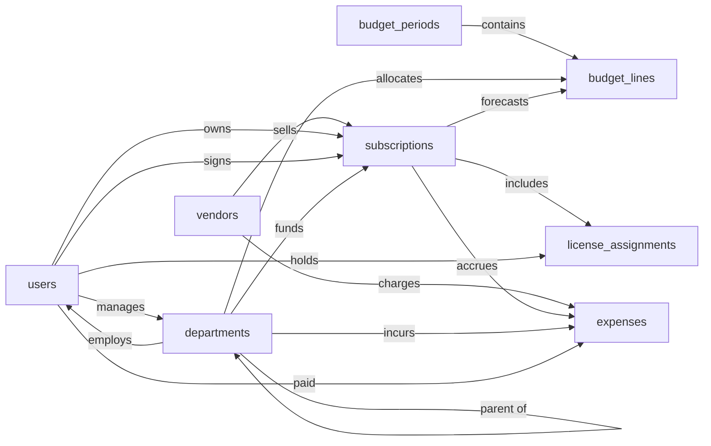

# SaaS Expense Tracker & Budget, Semantic Model

## 1. Overview

An internal SaaS spend management system that records the company's SaaS subscriptions (the app, the vendor, the commercial terms, and the contract details on a single record), the departments that own the spend, the budgets planned against them, the actual expenses paid against them, and which internal users consume seats. Finance and IT use it to track planned-vs-actual spend, allocate costs to departments, detect unused licenses, and manage upcoming renewals. All monetary amounts are stored in a single implicit base currency.

## 2. Entity summary

| # | Table name | Singular label | Purpose |
|---|---|---|---|
| 1 | `vendors` | Vendor | The company that sells a SaaS product (e.g. Slack Technologies, Atlassian) |
| 2 | `subscriptions` | Subscription | A SaaS subscription we pay for; combines product, commercial terms (seats, price, cadence, dates), and contract details on one record |
| 3 | `expenses` | Expense | One actual money-moved event, ingested from upstream (corporate card, expense platform, AP/ERP) and matched to a subscription |
| 4 | `departments` | Department | Cost center / org unit that owns part of the spend |
| 5 | `budget_periods` | Budget Period | A fiscal year or quarter container for budgeting |
| 6 | `budget_lines` | Budget Line | Planned spend allocated to a department / subscription for a budget period |
| 7 | `license_assignments` | License Assignment | Which internal user is consuming a seat on which subscription |
| 8 | `users` | User | Internal employee, acts as subscription owner, license holder, budget owner, payer, or approver |

### Entity-relationship diagram



## 3. Entities

### 3.1 `vendors`, Vendor

**Plural label:** Vendors
**Label column:** `vendor_name`  _(the human-identifying field; auto-wired by Semantius)_
**Description:** A company that sells one or more SaaS products we pay for. Created when we onboard a new supplier.

**Fields**

| Field name | Format | Required | Label | Reference / Notes |
|---|---|---|---|---|
| `vendor_name` | `string` | yes | Vendor Name | label_column; unique |
| `website_url` | `url` | no | Website | |
| `support_email` | `email` | no | Support Email | |
| `billing_contact_email` | `email` | no | Billing Contact | |
| `tax_id` | `string` | no | Tax ID | VAT / EIN |
| `notes` | `text` | no | Notes | |

> Do not include `id`, `created_at`, `updated_at`, or the auto-generated `label` field; Semantius creates these automatically.

**Relationships**

- A `vendor` may sell many `subscriptions` (1:N, via `subscriptions.vendor_id`).
- A `vendor` may charge many `expenses` (1:N, via `expenses.vendor_id`).

---

### 3.2 `subscriptions`, Subscription

**Plural label:** Subscriptions
**Label column:** `subscription_name`  _(the human-identifying field; auto-wired by Semantius)_
**Audit log:** yes
**Description:** A SaaS subscription we pay for. Each record represents one product-commercial pairing: which app, from which vendor, on what terms (seats, price, cadence, dates), under which contract. Created when a subscription starts; superseded when renewed.

**Fields**

| Field name | Format | Required | Label | Reference / Notes |
|---|---|---|---|---|
| `subscription_name` | `string` | yes | Subscription Name | label_column; e.g. "Slack Business+, Engineering" |
| `vendor_id` | `reference` | yes | Vendor | → `vendors` (N:1, restrict), relationship_label: "sells" |
| `business_owner_id` | `reference` | no | Business Owner | → `users` (N:1, clear); internal owner responsible for the app, relationship_label: "owns" |
| `primary_department_id` | `reference` | no | Owning Department | → `departments` (N:1, clear), relationship_label: "funds" |
| `signatory_user_id` | `reference` | no | Internal Signatory | → `users` (N:1, clear); signed the contract, relationship_label: "signs" |
| `category` | `enum` | no | Category | values listed in §5.1 |
| `criticality` | `enum` | no | Criticality | values listed in §5.2 |
| `description` | `text` | no | Description | |
| `website_url` | `url` | no | Product Website | |
| `billing_cycle` | `enum` | yes | Billing Cycle | values listed in §5.3; default: "monthly" |
| `seat_count` | `integer` | no | Seat Count | |
| `unit_price` | `number` | no | Unit Price | precision: 2; price per seat per billing cycle |
| `recurring_amount` | `number` | yes | Recurring Amount | precision: 2; total per billing cycle (base currency) |
| `start_date` | `date` | yes | Start Date | |
| `end_date` | `date` | no | End Date | |
| `auto_renew` | `boolean` | no | Auto-Renew | |
| `payment_method` | `enum` | no | Payment Method | values listed in §5.4 |
| `payment_terms` | `enum` | no | Payment Terms | values listed in §5.5 |
| `contract_number` | `string` | no | Contract Number | from the signed agreement, if any |
| `signed_date` | `date` | no | Contract Signed Date | |
| `total_contract_value` | `number` | no | Total Contract Value | precision: 2; whole-contract value if multi-period |
| `renewal_notice_days` | `integer` | no | Renewal Notice Days | days before `end_date` to give notice |
| `negotiated_savings` | `number` | no | Negotiated Savings | precision: 2; vs list price |
| `document_url` | `url` | no | Contract Document | signed PDF link |
| `status` | `enum` | yes | Status | values listed in §5.6; default: "pending" |
| `notes` | `text` | no | Notes | |

**Relationships**

- A `subscription` belongs to one `vendor` (N:1, required, delete: restrict).
- A `subscription` may have one `business_owner` user (N:1, optional, delete: clear).
- A `subscription` may have one `primary_department` (N:1, optional, delete: clear).
- A `subscription` may have one `signatory_user` (N:1, optional, delete: clear).
- A `subscription` may appear on many `budget_lines` (1:N, via `budget_lines.subscription_id`).
- A `subscription` may accrue many `expenses` (1:N, via `expenses.subscription_id`).
- `subscription` ↔ `user` is many-to-many through the `license_assignments` junction.

**Validation rules**

```json
[
  {"code": "seat_count_non_negative", "description": "Seat count cannot be negative.", "message": "Seat count must be zero or greater.", "jsonlogic": {">=": [{"var": "seat_count"}, 0]}},
  {"code": "unit_price_non_negative", "description": "Unit price per seat cannot be negative.", "message": "Unit price must be zero or greater.", "jsonlogic": {">=": [{"var": "unit_price"}, 0]}},
  {"code": "recurring_amount_non_negative", "description": "Recurring amount per billing cycle cannot be negative.", "message": "Recurring amount must be zero or greater.", "jsonlogic": {">=": [{"var": "recurring_amount"}, 0]}},
  {"code": "total_contract_value_non_negative", "description": "Total contract value cannot be negative.", "message": "Total contract value must be zero or greater.", "jsonlogic": {"or": [{"==": [{"var": "total_contract_value"}, null]}, {">=": [{"var": "total_contract_value"}, 0]}]}},
  {"code": "negotiated_savings_non_negative", "description": "Negotiated savings is a positive discount vs list price.", "message": "Negotiated savings must be zero or greater.", "jsonlogic": {"or": [{"==": [{"var": "negotiated_savings"}, null]}, {">=": [{"var": "negotiated_savings"}, 0]}]}},
  {"code": "renewal_notice_days_non_negative", "description": "Renewal notice days cannot be negative.", "message": "Renewal notice days must be zero or greater.", "jsonlogic": {"or": [{"==": [{"var": "renewal_notice_days"}, null]}, {">=": [{"var": "renewal_notice_days"}, 0]}]}},
  {"code": "subscription_dates_ordered", "description": "End date cannot precede start date.", "message": "End date must be on or after start date.", "jsonlogic": {"or": [{"==": [{"var": "end_date"}, null]}, {">=": [{"var": "end_date"}, {"var": "start_date"}]}]}},
  {"code": "signed_before_start", "description": "Contract is typically signed on or before subscription start.", "message": "Contract signed date must be on or before start date.", "jsonlogic": {"or": [{"==": [{"var": "signed_date"}, null]}, {"<=": [{"var": "signed_date"}, {"var": "start_date"}]}]}},
  {"code": "subscription_archive_is_terminal", "description": "Archived is one-way for record retention. Cancelled, expired, and deprecated stay reversible (see §7.2).", "message": "An archived subscription cannot be reactivated.", "jsonlogic": {"or": [{"==": [{"var": "$old"}, null]}, {"!=": [{"var": "$old.status"}, "archived"]}, {"==": [{"var": "status"}, "archived"]}]}}
]
```

---

### 3.3 `expenses`, Expense

**Plural label:** Expenses
**Label column:** `expense_label`  _(the human-identifying field; auto-wired by Semantius)_
**Audit log:** yes
**Description:** One actual money-moved event. Ingested from upstream systems (corporate card feeds, expense platforms, AP/ERP) or entered manually. Matched to a subscription so plan-vs-actual reporting can roll up by month, department, and subscription. Consolidated invoices covering multiple subscriptions are split into one row per subscription at ingestion time. Caller populates `expense_label` on create (e.g. `"{vendor.vendor_name} {transaction_date} {amount}"`) because the row has no natural string key.

**Fields**

| Field name | Format | Required | Label | Reference / Notes |
|---|---|---|---|---|
| `expense_label` | `string` | yes | Expense | label_column; caller-populated scalar |
| `vendor_id` | `reference` | yes | Vendor | → `vendors` (N:1, restrict), relationship_label: "charges" |
| `subscription_id` | `reference` | no | Subscription | → `subscriptions` (N:1, clear); null until matched, relationship_label: "accrues" |
| `department_id` | `reference` | no | Department | → `departments` (N:1, clear); chargeback target, relationship_label: "incurs" |
| `payer_user_id` | `reference` | no | Paid By | → `users` (N:1, clear); card holder for card-feed sources, relationship_label: "paid" |
| `transaction_date` | `date` | yes | Transaction Date | when money moved |
| `posted_date` | `date` | no | Posted Date | when GL posting was made |
| `amount` | `number` | yes | Amount | precision: 2; base currency; negative for refunds |
| `payment_method` | `enum` | no | Payment Method | values listed in §5.4 (same vocab as `subscriptions.payment_method`) |
| `source_system` | `enum` | yes | Source System | values listed in §5.13; default: "manual" |
| `source_reference` | `string` | no | Source Reference | external transaction id; unique per (source_system, source_reference) |
| `gl_category` | `enum` | no | GL Category | values listed in §5.14 (same vocab as `subscriptions.category`) |
| `gl_account_code` | `string` | no | GL Account Code | e.g. "6420-SAAS" |
| `match_status` | `enum` | yes | Match Status | values listed in §5.15; default: "unmatched" |
| `description` | `text` | no | Description | |
| `notes` | `text` | no | Notes | |

**Relationships**

- An `expense` belongs to one `vendor` (N:1, required, delete: restrict).
- An `expense` may be matched to one `subscription` (N:1, optional, delete: clear).
- An `expense` may be allocated to one `department` (N:1, optional, delete: clear).
- An `expense` may be paid by one `user` (N:1, optional, delete: clear).

**Validation rules**

```json
[
  {"code": "posted_after_transaction", "description": "GL posting date cannot precede the money-moved date.", "message": "Posted date must be on or after transaction date.", "jsonlogic": {"or": [{"==": [{"var": "posted_date"}, null]}, {">=": [{"var": "posted_date"}, {"var": "transaction_date"}]}]}},
  {"code": "subscription_required_when_matched", "description": "A matched expense must point at the subscription it was matched to.", "message": "Subscription is required for matched expenses.", "jsonlogic": {"or": [{"!": {"in": [{"var": "match_status"}, ["auto_matched", "manual_matched"]]}}, {"!=": [{"var": "subscription_id"}, null]}]}}
]
```

---

### 3.4 `departments`, Department

**Plural label:** Departments
**Label column:** `department_name`  _(the human-identifying field; auto-wired by Semantius)_
**Description:** A cost center or organizational unit against which spend is allocated and budgets are set. Self-referencing for hierarchy.

**Fields**

| Field name | Format | Required | Label | Reference / Notes |
|---|---|---|---|---|
| `department_name` | `string` | yes | Department Name | label_column |
| `department_code` | `string` | no | Code | unique; e.g. "ENG", "MKT" |
| `manager_user_id` | `reference` | no | Manager | → `users` (N:1, clear), relationship_label: "manages" |
| `parent_department_id` | `reference` | no | Parent Department | → `departments` (N:1, clear); self-ref for hierarchy, relationship_label: "parent of" |
| `status` | `enum` | yes | Status | values listed in §5.7; default: "active" |

**Relationships**

- A `department` may have one `manager` user (N:1, optional, delete: clear).
- A `department` may have one `parent_department` (N:1, optional, delete: clear; self-reference for hierarchy).
- A `department` may have many child departments (1:N, via self-reference).
- A `department` may employ many `users` (1:N, via `users.department_id`).
- A `department` may fund many `subscriptions` (1:N, via `subscriptions.primary_department_id`).
- A `department` may have many `budget_lines` allocated to it (1:N, via `budget_lines.department_id`).
- A `department` may incur many `expenses` (1:N, via `expenses.department_id`).

---

### 3.5 `budget_periods`, Budget Period

**Plural label:** Budget Periods
**Label column:** `period_name`  _(the human-identifying field; auto-wired by Semantius)_
**Audit log:** yes
**Description:** A time container (fiscal year, quarter, or custom range) inside which budgets are planned and tracked. Created at planning time.

**Fields**

| Field name | Format | Required | Label | Reference / Notes |
|---|---|---|---|---|
| `period_name` | `string` | yes | Period Name | label_column; unique; e.g. "FY2026", "Q1 2026" |
| `period_type` | `enum` | yes | Period Type | values listed in §5.8; default: "fiscal_year" |
| `start_date` | `date` | yes | Start Date | |
| `end_date` | `date` | yes | End Date | |
| `status` | `enum` | yes | Status | values listed in §5.9; default: "draft" |

**Relationships**

- A `budget_period` may contain many `budget_lines` (1:N, parent, cascade on delete).

**Validation rules**

```json
[
  {"code": "period_dates_ordered", "description": "End date cannot precede start date.", "message": "End date must be on or after start date.", "jsonlogic": {">=": [{"var": "end_date"}, {"var": "start_date"}]}},
  {"code": "period_archive_is_terminal", "description": "Archived is one-way. Closed stays reopen-able with permissions (see §7.2).", "message": "An archived budget period cannot be reopened.", "jsonlogic": {"or": [{"==": [{"var": "$old"}, null]}, {"!=": [{"var": "$old.status"}, "archived"]}, {"==": [{"var": "status"}, "archived"]}]}}
]
```

---

### 3.6 `budget_lines`, Budget Line

**Plural label:** Budget Lines
**Label column:** `budget_line_name`  _(the human-identifying field; auto-wired by Semantius)_
**Audit log:** yes
**Description:** A single planned spend allocation within a budget period. Typically allocates an amount to a department, a subscription, or a category combination. Created in the context of a budget period.

**Fields**

| Field name | Format | Required | Label | Reference / Notes |
|---|---|---|---|---|
| `budget_line_name` | `string` | yes | Budget Line Name | label_column; e.g. "Engineering, Dev Tools, FY2026" |
| `budget_period_id` | `parent` | yes | Budget Period | ↳ `budget_periods` (N:1, cascade), relationship_label: "contains" |
| `department_id` | `reference` | no | Department | → `departments` (N:1, clear), relationship_label: "allocates" |
| `subscription_id` | `reference` | no | Subscription | → `subscriptions` (N:1, clear); null if allocated at category level, relationship_label: "forecasts" |
| `category` | `enum` | no | Category | values listed in §5.10 |
| `planned_amount` | `number` | yes | Planned Amount | precision: 2; base currency |
| `notes` | `text` | no | Notes | |

**Relationships**

- A `budget_line` belongs to one `budget_period` (N:1, required, delete: cascade, parent).
- A `budget_line` may link to one `department` (N:1, optional, delete: clear).
- A `budget_line` may link to one `subscription` (N:1, optional, delete: clear).

**Validation rules**

```json
[
  {"code": "planned_amount_non_negative", "description": "Planned spend amount cannot be negative.", "message": "Planned amount must be zero or greater.", "jsonlogic": {">=": [{"var": "planned_amount"}, 0]}}
]
```

---

### 3.7 `license_assignments`, License Assignment

**Plural label:** License Assignments
**Label column:** `assignment_label`  _(the human-identifying field; auto-wired by Semantius)_
**Audit log:** yes
**Description:** Junction record showing that a specific user is consuming a seat of a specific subscription. Used for per-seat chargeback and unused-license detection. Caller populates `assignment_label` on create (e.g. `"{user.full_name} / {subscription.subscription_name}"`) because the junction has no natural string key.

**Fields**

| Field name | Format | Required | Label | Reference / Notes |
|---|---|---|---|---|
| `assignment_label` | `string` | yes | Assignment | label_column; caller-populated scalar (must not be a FK per Semantius label rules) |
| `subscription_id` | `parent` | yes | Subscription | ↳ `subscriptions` (N:1, cascade), relationship_label: "includes" |
| `user_id` | `parent` | yes | User | ↳ `users` (N:1, cascade), relationship_label: "holds" |
| `assigned_date` | `date` | no | Assigned Date | |
| `last_active_date` | `date` | no | Last Active | for unused-license detection |
| `monthly_cost_allocation` | `number` | no | Monthly Cost Allocation | precision: 2; per-seat chargeback |
| `status` | `enum` | yes | Status | values listed in §5.11; default: "active" |

**Relationships**

- A `license_assignment` belongs to one `subscription` (N:1, required, delete: cascade, parent).
- A `license_assignment` belongs to one `user` (N:1, required, delete: cascade, parent).
- Together the two parent FKs form the M:N junction between `subscriptions` and `users`.

**Validation rules**

```json
[
  {"code": "last_active_after_assigned", "description": "Last-active date cannot precede the assigned date.", "message": "Last active date must be on or after assigned date.", "jsonlogic": {"or": [{"==": [{"var": "last_active_date"}, null]}, {"==": [{"var": "assigned_date"}, null]}, {">=": [{"var": "last_active_date"}, {"var": "assigned_date"}]}]}},
  {"code": "monthly_cost_allocation_non_negative", "description": "Monthly cost allocation cannot be negative.", "message": "Monthly cost allocation must be zero or greater.", "jsonlogic": {"or": [{"==": [{"var": "monthly_cost_allocation"}, null]}, {">=": [{"var": "monthly_cost_allocation"}, 0]}]}},
  {"code": "revoked_is_terminal", "description": "Revocation is one-way. Re-granting access creates a new assignment.", "message": "A revoked license assignment cannot be reactivated.", "jsonlogic": {"or": [{"==": [{"var": "$old"}, null]}, {"!=": [{"var": "$old.status"}, "revoked"]}, {"==": [{"var": "status"}, "revoked"]}]}}
]
```

---

### 3.8 `users`, User

**Plural label:** Users
**Label column:** `full_name`  _(the human-identifying field; auto-wired by Semantius)_
**Description:** An internal employee who may own subscriptions, sign contracts, manage departments, hold license assignments, or pay expenses. The `table_name` matches the Semantius built-in `users` so the deployer can deduplicate at deploy-time; fields here describe the domain-required shape and the deployer reconciles with built-in fields, adding only what is missing.

**Fields**

| Field name | Format | Required | Label | Reference / Notes |
|---|---|---|---|---|
| `full_name` | `string` | yes | Full Name | label_column |
| `email` | `email` | yes | Email | unique |
| `department_id` | `reference` | no | Department | → `departments` (N:1, clear), relationship_label: "employs" |
| `job_title` | `string` | no | Job Title | |
| `employee_id` | `string` | no | Employee ID | unique |
| `status` | `enum` | yes | Status | values listed in §5.12; default: "active" |

**Relationships**

- A `user` may belong to one `department` (N:1, optional, delete: clear).
- A `user` may manage many `departments` (1:N, via `departments.manager_user_id`).
- A `user` may be the business owner of many `subscriptions` (1:N, via `subscriptions.business_owner_id`).
- A `user` may be signatory on many `subscriptions` (1:N, via `subscriptions.signatory_user_id`).
- A `user` may have paid many `expenses` (1:N, via `expenses.payer_user_id`).
- `user` ↔ `subscription` is many-to-many through the `license_assignments` junction.

**Validation rules**

```json
[
  {"code": "user_offboarded_is_terminal", "description": "Offboarding is one-way. Rehire is a new user record.", "message": "An offboarded user cannot be reactivated.", "jsonlogic": {"or": [{"==": [{"var": "$old"}, null]}, {"!=": [{"var": "$old.status"}, "offboarded"]}, {"==": [{"var": "status"}, "offboarded"]}]}}
]
```

---

## 4. Relationship summary

| From | Field | To | Cardinality | Kind | Delete behavior |
|---|---|---|---|---|---|
| `subscriptions` | `vendor_id` | `vendors` | N:1 | reference | restrict |
| `subscriptions` | `business_owner_id` | `users` | N:1 | reference | clear |
| `subscriptions` | `primary_department_id` | `departments` | N:1 | reference | clear |
| `subscriptions` | `signatory_user_id` | `users` | N:1 | reference | clear |
| `expenses` | `vendor_id` | `vendors` | N:1 | reference | restrict |
| `expenses` | `subscription_id` | `subscriptions` | N:1 | reference | clear |
| `expenses` | `department_id` | `departments` | N:1 | reference | clear |
| `expenses` | `payer_user_id` | `users` | N:1 | reference | clear |
| `departments` | `manager_user_id` | `users` | N:1 | reference | clear |
| `departments` | `parent_department_id` | `departments` | N:1 | reference | clear |
| `budget_lines` | `budget_period_id` | `budget_periods` | N:1 | parent | cascade |
| `budget_lines` | `department_id` | `departments` | N:1 | reference | clear |
| `budget_lines` | `subscription_id` | `subscriptions` | N:1 | reference | clear |
| `license_assignments` | `subscription_id` | `subscriptions` | N:1 | parent (junction) | cascade |
| `license_assignments` | `user_id` | `users` | N:1 | parent (junction) | cascade |
| `users` | `department_id` | `departments` | N:1 | reference | clear |

## 5. Enumerations

### 5.1 `subscriptions.category`
- `communication`
- `dev_tools`
- `productivity`
- `marketing`
- `sales`
- `hr`
- `finance`
- `security`
- `design`
- `analytics`
- `infrastructure`
- `other`

### 5.2 `subscriptions.criticality`
- `critical`
- `important`
- `nice_to_have`

### 5.3 `subscriptions.billing_cycle`
- `monthly`
- `quarterly`
- `annual`
- `multi_year`
- `one_time`

### 5.4 `subscriptions.payment_method` (also used by `expenses.payment_method`)
- `credit_card`
- `ach`
- `wire`
- `invoice`
- `purchase_order`

### 5.5 `subscriptions.payment_terms`
- `net_15`
- `net_30`
- `net_60`
- `net_90`
- `prepaid`

### 5.6 `subscriptions.status`
- `pending`
- `trialing`
- `active`
- `cancelled`
- `expired`
- `deprecated`
- `archived`

### 5.7 `departments.status`
- `active`
- `inactive`

### 5.8 `budget_periods.period_type`
- `fiscal_year`
- `quarter`
- `month`
- `custom`

### 5.9 `budget_periods.status`
- `draft`
- `open`
- `closed`
- `archived`

### 5.10 `budget_lines.category`
- `communication`
- `dev_tools`
- `productivity`
- `marketing`
- `sales`
- `hr`
- `finance`
- `security`
- `design`
- `analytics`
- `infrastructure`
- `other`
- `unallocated`

_(Note: shares most values with `subscriptions.category` plus `unallocated` for budget lines not tied to a specific category.)_

### 5.11 `license_assignments.status`
- `active`
- `inactive`
- `pending`
- `revoked`

### 5.12 `users.status`
- `active`
- `inactive`
- `offboarded`

### 5.13 `expenses.source_system`
- `manual`
- `brex`
- `ramp`
- `airbase`
- `divvy`
- `mercury`
- `expensify`
- `netsuite`
- `quickbooks`
- `sap`
- `vendor_email`
- `other`

### 5.14 `expenses.gl_category` (same vocabulary as `subscriptions.category`)
- `communication`
- `dev_tools`
- `productivity`
- `marketing`
- `sales`
- `hr`
- `finance`
- `security`
- `design`
- `analytics`
- `infrastructure`
- `other`

### 5.15 `expenses.match_status`
- `unmatched`
- `auto_matched`
- `manual_matched`
- `ambiguous`
- `ignored`

## 6. Cross-model link suggestions

Hint rows the deployer evaluates against the live catalog at deploy-time. Targets that do not exist yet are silently skipped; ambiguous matches trigger a single confirmation widget. Entity-overlap deduplication for shared-master tables (`users`, `vendors`, `departments`, `budget_periods`, `budget_lines`) is the deployer's responsibility and is not declared here.

| From | To | Verb | Cardinality | Delete |
|---|---|---|---|---|
| `invoice_line_items` | `subscriptions` | generates | N:1 | restrict |
| `gl_postings` | `expenses` | generates | N:1 | restrict |
| `gl_postings` | `budget_lines` | tracks | N:1 | restrict |
| `purchase_orders` | `subscriptions` | is procured by | N:1 | clear |
| `purchase_orders` | `budget_lines` | authorizes | N:1 | clear |
| `software_installs` | `subscriptions` | licenses | N:1 | clear |
| `tickets` | `subscriptions` | is the subject of | N:1 | clear |

Notes:

- `invoice_line_items → subscriptions` (inbound): when a finance / AP module deploys, its line-item table FKs back to `subscriptions` so each line item ties to the subscription it billed. Header-level `invoices` typically cover multiple subscriptions, so the FK lives on the line item.
- `gl_postings → expenses` (inbound): when a finance / GL module deploys, its postings table FKs back to `expenses` so the journal effect of an expense is traceable.
- `gl_postings → budget_lines` (inbound): when a finance / GL module deploys, postings FK back to `budget_lines` for plan-vs-actual reconciliation at the budget-line level.
- `purchase_orders → subscriptions` (inbound): when a procurement module deploys, POs for SaaS purchases FK back to the subscription they procured.
- `purchase_orders → budget_lines` (inbound): when a procurement module deploys, POs FK back to the budget_line they were authorized against.
- `software_installs → subscriptions` (inbound): when an ITAM / SAM module deploys, installed software records FK back to the subscription that licenses them. `clear` because uninstalling software should not block subscription edits.
- `tickets → subscriptions` (inbound): when an ITSM module deploys, tickets reporting issues with a SaaS app FK back to the subscription. `clear` so historical tickets survive subscription archival.

Domains in `related_domains` with no §6 row (one-line reason each):

- `Budgeting`, pair-overlaps on `budget_periods` and `budget_lines`; other Budgeting entities (`budgets`, `forecasts`, `variance_records`) aggregate from `budget_lines` rather than carrying back-FKs.
- `Vendor Management`, pair-overlaps on `vendors`; sibling entities (`vendor_contacts`, `vendor_risk_assessments`, `vendor_certifications`) all FK back into the merged `vendors` table.
- `HRIS`, pair-overlaps on `users` and `departments`; sibling entities (`positions`, `employment_records`) FK into those merged tables.
- `Identity & Access`, pair-overlaps on `users`; partial pair-overlap on `license_assignments` (as entitlements); other entities (groups, sessions, SSO configs) extend `users` upward.
- `ITAM`, hardware-focused; entities don't materially FK into this model beyond `users` (pair overlap).
- `CMDB`, pair-overlap-or-separate ambiguity on `subscriptions` (as configuration_items). Letting the deployer's similarity heuristic flag at deploy time rather than pre-declaring a brittle row.

## 7. Open questions

### 7.1 🔴 Decisions needed

None.

### 7.2 🟡 Future considerations

- **Should multi-currency support be added, with a `currency` field (ISO 4217) on each money-bearing record plus an `exchange_rates` (date, from_currency, to_currency, rate) entity?** All amounts are currently stored in a single implicit base currency; international finance teams would need both pieces to report budget-vs-actual in a single reporting currency.
- **Should contracts be promoted out of `subscriptions` into a separate `contracts` entity to support MSAs covering multiple sub-products?** A subscription currently carries its own `contract_number`, `signed_date`, `document_url`, `total_contract_value`, `renewal_notice_days`, `negotiated_savings`. Fine for 1:1 contract-to-subscription; breaks down when one contract spans several subscriptions.
- **Should product identity be re-split from commercial terms into a separate `saas_applications` entity?** A single `subscriptions` record carries both product and terms; multiple concurrent subscriptions for the same product work as multiple rows, but product-level reporting without double-counting would require the split.
- **Should `approval_requests` / `purchase_orders` be modelled in this system?** No approval workflow entities are present; significant addition if purchase, renewal, or budget-change approvals must be tracked here rather than in a separate procurement tool.
- **Should a `usage_events` entity be added for richer engagement analytics?** `license_assignments.last_active_date` captures a single timestamp for basic unused-license detection; per-user activity or feature adoption would need a dedicated event log.
- **Should `subscriptions.category`, `budget_lines.category`, and `expenses.gl_category` be promoted to a shared lookup table to avoid enum drift?** The three enums share most values; a lookup table would keep them aligned as the taxonomy evolves.
- **Should `expense_line_items` ever be tracked here for AP-grade detail (GL distributions, tax jurisdictions, multi-account splits)?** This model intentionally keeps `expenses` flat, one row per money-moved event; consolidated invoices are split into multiple rows at ingestion time. AP-grade detail lives in a sibling finance module and links via `invoice_line_items → subscriptions`.
- **Should `cancelled`, `expired`, and `deprecated` subscription statuses be made terminal (one-way)?** Currently reversible to handle mistaken cancellations, vendor reinstatements, and revived sunset products; only `archived` is one-way.
- **Should `budget_periods.status = closed` be made terminal?** Currently reopen-able with permissions to allow year-end adjustments; only `archived` is one-way.
- **Should `license_assignments.status = inactive` be made terminal?** Currently reversible to handle temporary deactivation; only `revoked` is one-way (re-granting access creates a new assignment).
- **Should `users.status = inactive` be made terminal?** Currently reversible to handle leaves of absence; only `offboarded` is one-way (rehire is a new user record).
- **Should `expenses.match_status = ignored` be made terminal?** Currently reversible to allow correcting mistakenly-ignored expenses.
- **Should audit logging be extended to `vendors`, `departments`, and `users`?** Currently set on `subscriptions`, `expenses`, `budget_periods`, `budget_lines`, `license_assignments` (the money-bearing entities); finance / compliance teams may want it on master data as well.

## 8. Implementation notes

1. Create one module named `saas_expense_tracker` and two baseline permissions (`saas_expense_tracker:read`, `saas_expense_tracker:manage`) before any entity.
2. Create entities in this order so referenced tables exist first: `departments` → `users` → `vendors` → `subscriptions` → `budget_periods` → `budget_lines` → `license_assignments` → `expenses`. Note that `departments` ↔ `users` have a mutual reference (`departments.manager_user_id` and `users.department_id`); create both entities first, then add the cross-references as a second pass.
3. For each entity: set `label_column` to the snake_case field marked as label in §3, pass `module_id`, `view_permission: "saas_expense_tracker:read"`, `edit_permission: "saas_expense_tracker:manage"`, and `audit_log: true` for `subscriptions`, `expenses`, `budget_periods`, `budget_lines`, `license_assignments` (leave default `false` for `vendors`, `departments`, `users`). Do **not** manually create `id`, `created_at`, `updated_at`, or the auto-label field.
4. For each field in §3: pass `table_name`, `field_name`, `format`, `title` (the Label column), and for `reference`/`parent` fields also `reference_table` and a `reference_delete_mode` consistent with §4. For required `enum` fields also pass `default_value` (taken from the §3 Notes `default: "<value>"` annotation) so existing rows backfill cleanly when the column is added to a non-empty table. The §3 `Required` column is analyst intent; the platform manages nullability internally based on `format` + `reference_delete_mode` and does not accept an `is_nullable` parameter.
5. **Fix up label-column titles.** `create_entity` auto-creates a field whose `field_name` equals `label_column` and whose `title` defaults to `singular_label`. Every entity in this model except `expenses` has a Label for the label_column row that differs from `singular_label` (intentional: `singular_label` stays a bare singular for plural/singular symmetry, while the field-level title is more specific). After each `create_entity`, call `update_field` with the composite string id `"{table_name}.{label_column}"` (passed as a **string**, not an integer) to set the correct title:
   - `"vendors.vendor_name"` → `"Vendor Name"`
   - `"subscriptions.subscription_name"` → `"Subscription Name"`
   - `"departments.department_name"` → `"Department Name"`
   - `"budget_periods.period_name"` → `"Period Name"`
   - `"budget_lines.budget_line_name"` → `"Budget Line Name"`
   - `"license_assignments.assignment_label"` → `"Assignment"`
   - `"users.full_name"` → `"Full Name"`
   - (no fixup needed for `expenses.expense_label`, the field title already matches `singular_label` "Expense")
6. **Caller-populated label columns.** Three entities have label_columns with no natural source field; front-end callers must populate them on create:
   - `license_assignments.assignment_label`, e.g. `"{user.full_name} / {subscription.subscription_name}"` (junction has no natural string identifier).
   - `budget_lines.budget_line_name`, e.g. `"{department.department_name}, {category}, {budget_period.period_name}"` (no single source field identifies a budget line).
   - `expenses.expense_label`, e.g. `"{vendor.vendor_name} {transaction_date} {amount}"` (no single source field identifies a money-moved event).
7. **Pass `validation_rules` arrays byte-for-byte** to `create_entity` (or `update_entity` post-creation) for entities that declare them in §3: `subscriptions` (9 rules), `expenses` (2 rules), `budget_periods` (2 rules), `budget_lines` (1 rule), `license_assignments` (3 rules), `users` (1 rule). The platform parses the array, validates each `code` is snake_case and unique within the entity, and rejects malformed JsonLogic at deploy time.
8. **Apply §6 cross-model link suggestions** after the model's own creates and the built-in dedup pass. Walk each row; for each `To` look up the target in the live catalog; propose an additive `create_field` on `From` with the row's `Verb` as `relationship_label` and `Delete` as `reference_delete_mode` when a single match is found; ask the user when multiple candidates fit; skip silently when no candidate is deployed yet.
9. After creation, spot-check that `label_column` on each entity resolves to a real field, that all `reference_table` targets exist, that each label-column field's `title` matches the §3 Label (not `singular_label`), and that `audit_log` is set as specified in step 3.
