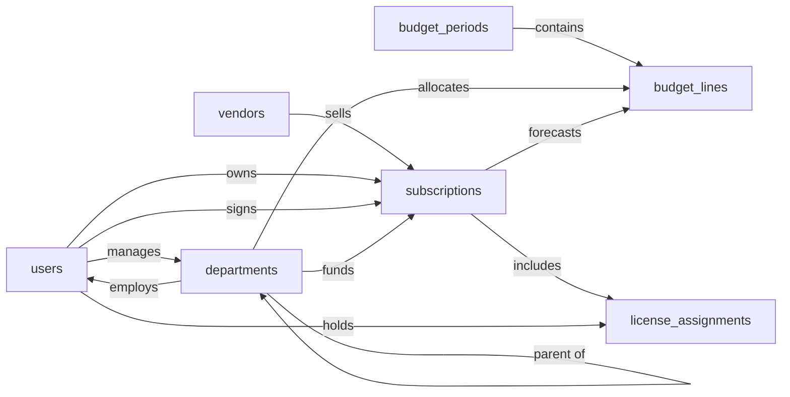

# SaaS Expense Tracker & Budget — Semantic Model

## 1. Overview

An internal SaaS spend management system that records the company's SaaS subscriptions (the app, the vendor, the commercial terms, and the contract details on a single record), the departments that own the spend, the budgets planned against them, and which internal users consume seats. Finance and IT use it to track planned vs. expected spend, allocate costs to departments, detect unused licenses, and manage upcoming renewals. All monetary amounts are stored in a single implicit base currency; multi-currency support is deferred (see §6.2).

## 2. Entity summary

| # | Table name | Singular label | Purpose |
|---|---|---|---|
| 1 | `vendors` | Vendor | The company that sells a SaaS product (e.g. Slack Technologies, Atlassian) |
| 2 | `subscriptions` | Subscription | A SaaS subscription we pay for — combines the product, commercial terms (seats, price, cadence, dates), and contract details on one record |
| 3 | `departments` | Department | Cost center / org unit that owns part of the spend |
| 4 | `budget_periods` | Budget Period | A fiscal year or quarter container for budgeting |
| 5 | `budget_lines` | Budget Line | Planned spend allocated to a department / subscription for a budget period |
| 6 | `license_assignments` | License Assignment | Which internal user is consuming a seat on which subscription |
| 7 | `users` | User | Internal employee — subscription owner, license holder, budget owner, approver |

### Entity-relationship diagram

## 3. Entities

### 3.1 `vendors` — Vendor

**Plural label:** Vendors
**Label column:** `vendor_name`  _(the human-identifying field; auto-wired by Semantius)_
**Description:** A company that sells one or more SaaS products we pay for. Created when we onboard a new supplier.

**Fields**

| Field name | Format | Required | Label | Reference / Notes |
|---|---|---|---|---|
| `vendor_name` | `string` | yes | Vendor Name | label_column; unique |
| `website_url` | `url` | no | Website | |
| `support_email` | `email` | no | Support Email | |
| `billing_contact_email` | `email` | no | Billing Contact | |
| `tax_id` | `string` | no | Tax ID | VAT / EIN |
| `notes` | `text` | no | Notes | |

> Do not include `id`, `created_at`, `updated_at`, or the auto-generated `label` field — Semantius creates these automatically.

**Relationships**

- A `vendor` may sell many `subscriptions` (1:N, via `subscriptions.vendor_id`).

---

### 3.2 `subscriptions` — Subscription

**Plural label:** Subscriptions
**Label column:** `subscription_name`  _(the human-identifying field; auto-wired by Semantius)_
**Description:** A SaaS subscription we pay for. Each record represents one product-commercial pairing: which app, from which vendor, on what terms (seats, price, cadence, dates), under which contract. Created when a subscription starts; superseded when renewed.

**Fields**

| Field name | Format | Required | Label | Reference / Notes |
|---|---|---|---|---|
| `subscription_name` | `string` | yes | Subscription Name | label_column; e.g. "Slack Business+ — Engineering" |
| `vendor_id` | `reference` | yes | Vendor | → `vendors` (N:1, restrict), relationship_label: "sells" |
| `business_owner_id` | `reference` | no | Business Owner | → `users` (N:1, clear); internal owner responsible for the app, relationship_label: "owns" |
| `primary_department_id` | `reference` | no | Owning Department | → `departments` (N:1, clear), relationship_label: "funds" |
| `signatory_user_id` | `reference` | no | Internal Signatory | → `users` (N:1, clear); signed the contract, relationship_label: "signs" |
| `category` | `enum` | no | Category | values listed in §5.1 |
| `criticality` | `enum` | no | Criticality | values listed in §5.2 |
| `description` | `text` | no | Description | |
| `website_url` | `url` | no | Product Website | |
| `billing_cycle` | `enum` | yes | Billing Cycle | values listed in §5.3; default: "monthly" |
| `seat_count` | `integer` | no | Seat Count | |
| `unit_price` | `number` | no | Unit Price | precision: 2; price per seat per billing cycle |
| `recurring_amount` | `number` | yes | Recurring Amount | precision: 2; total per billing cycle (base currency) |
| `start_date` | `date` | yes | Start Date | |
| `end_date` | `date` | no | End Date | |
| `auto_renew` | `boolean` | no | Auto-Renew | |
| `payment_method` | `enum` | no | Payment Method | values listed in §5.4 |
| `payment_terms` | `enum` | no | Payment Terms | values listed in §5.5 |
| `contract_number` | `string` | no | Contract Number | from the signed agreement, if any |
| `signed_date` | `date` | no | Contract Signed Date | |
| `total_contract_value` | `number` | no | Total Contract Value | precision: 2; whole-contract value if multi-period |
| `renewal_notice_days` | `integer` | no | Renewal Notice Days | days before `end_date` to give notice |
| `negotiated_savings` | `number` | no | Negotiated Savings | precision: 2; vs list price |
| `document_url` | `url` | no | Contract Document | signed PDF link |
| `status` | `enum` | yes | Status | values listed in §5.6; default: "pending" |
| `notes` | `text` | no | Notes | |

**Relationships**

- A `subscription` belongs to one `vendor` (N:1, required, delete: restrict).
- A `subscription` may have one `business_owner` user (N:1, optional, delete: clear).
- A `subscription` may have one `primary_department` (N:1, optional, delete: clear).
- A `subscription` may have one `signatory_user` (N:1, optional, delete: clear).
- A `subscription` may appear on many `budget_lines` (1:N, via `budget_lines.subscription_id`).
- `subscription` ↔ `user` is many-to-many through the `license_assignments` junction.

---

### 3.3 `departments` — Department

**Plural label:** Departments
**Label column:** `department_name`  _(the human-identifying field; auto-wired by Semantius)_
**Description:** A cost center or organizational unit against which spend is allocated and budgets are set. Self-referencing for hierarchy.

**Fields**

| Field name | Format | Required | Label | Reference / Notes |
|---|---|---|---|---|
| `department_name` | `string` | yes | Department Name | label_column |
| `department_code` | `string` | no | Code | unique; e.g. "ENG", "MKT" |
| `manager_user_id` | `reference` | no | Manager | → `users` (N:1, clear), relationship_label: "manages" |
| `parent_department_id` | `reference` | no | Parent Department | → `departments` (N:1, clear); self-ref for hierarchy, relationship_label: "parent of" |
| `status` | `enum` | yes | Status | values listed in §5.7; default: "active" |

**Relationships**

- A `department` may have one `manager` user (N:1, optional, delete: clear).
- A `department` may have one `parent_department` (N:1, optional, delete: clear — self-reference for hierarchy).
- A `department` may have many child departments (1:N, via self-reference).
- A `department` may employ many `users` (1:N, via `users.department_id`).
- A `department` may fund many `subscriptions` (1:N, via `subscriptions.primary_department_id`).
- A `department` may have many `budget_lines` allocated to it (1:N, via `budget_lines.department_id`).

---

### 3.4 `budget_periods` — Budget Period

**Plural label:** Budget Periods
**Label column:** `period_name`  _(the human-identifying field; auto-wired by Semantius)_
**Description:** A time container (fiscal year, quarter, or custom range) inside which budgets are planned and tracked. Created at planning time.

**Fields**

| Field name | Format | Required | Label | Reference / Notes |
|---|---|---|---|---|
| `period_name` | `string` | yes | Period Name | label_column; unique; e.g. "FY2026", "Q1 2026" |
| `period_type` | `enum` | yes | Period Type | values listed in §5.8; default: "fiscal_year" |
| `start_date` | `date` | yes | Start Date | |
| `end_date` | `date` | yes | End Date | |
| `status` | `enum` | yes | Status | values listed in §5.9; default: "draft" |

**Relationships**

- A `budget_period` may contain many `budget_lines` (1:N, parent, cascade on delete).

---

### 3.5 `budget_lines` — Budget Line

**Plural label:** Budget Lines
**Label column:** `budget_line_name`  _(the human-identifying field; auto-wired by Semantius)_
**Description:** A single planned spend allocation within a budget period. Typically allocates an amount to a department, a subscription, or a category combination. Created in the context of a budget period.

**Fields**

| Field name | Format | Required | Label | Reference / Notes |
|---|---|---|---|---|
| `budget_line_name` | `string` | yes | Budget Line Name | label_column; e.g. "Engineering, Dev Tools, FY2026" |
| `budget_period_id` | `parent` | yes | Budget Period | ↳ `budget_periods` (N:1, cascade), relationship_label: "contains" |
| `department_id` | `reference` | no | Department | → `departments` (N:1, clear), relationship_label: "allocates" |
| `subscription_id` | `reference` | no | Subscription | → `subscriptions` (N:1, clear); null if allocated at category level, relationship_label: "forecasts" |
| `category` | `enum` | no | Category | values listed in §5.10 |
| `planned_amount` | `number` | yes | Planned Amount | precision: 2; base currency |
| `notes` | `text` | no | Notes | |

**Relationships**

- A `budget_line` belongs to one `budget_period` (N:1, required, delete: cascade — parent).
- A `budget_line` may link to one `department` (N:1, optional, delete: clear).
- A `budget_line` may link to one `subscription` (N:1, optional, delete: clear).

---

### 3.6 `license_assignments` — License Assignment

**Plural label:** License Assignments
**Label column:** `assignment_label`  _(the human-identifying field; auto-wired by Semantius)_
**Description:** Junction record showing that a specific user is consuming a seat of a specific subscription. Used for per-seat chargeback and unused-license detection. Caller populates `assignment_label` on create (e.g. `"{user.full_name} / {subscription.subscription_name}"`) because the junction has no natural string key.

**Fields**

| Field name | Format | Required | Label | Reference / Notes |
|---|---|---|---|---|
| `assignment_label` | `string` | yes | Assignment | label_column; caller-populated scalar (must not be a FK per Semantius label rules) |
| `subscription_id` | `parent` | yes | Subscription | ↳ `subscriptions` (N:1, cascade), relationship_label: "includes" |
| `user_id` | `parent` | yes | User | ↳ `users` (N:1, cascade), relationship_label: "holds" |
| `assigned_date` | `date` | no | Assigned Date | |
| `last_active_date` | `date` | no | Last Active | for unused-license detection |
| `monthly_cost_allocation` | `number` | no | Monthly Cost Allocation | precision: 2; per-seat chargeback |
| `status` | `enum` | yes | Status | values listed in §5.11; default: "active" |

**Relationships**

- A `license_assignment` belongs to one `subscription` (N:1, required, delete: cascade — parent).
- A `license_assignment` belongs to one `user` (N:1, required, delete: cascade — parent).
- Together the two parent FKs form the M:N junction between `subscriptions` and `users`.

---

### 3.7 `users` — User

**Plural label:** Users
**Label column:** `full_name`  _(the human-identifying field; auto-wired by Semantius)_
**Description:** An internal employee who may own subscriptions, sign contracts, manage departments, or hold license assignments. The `table_name` matches the Semantius built-in `users` table so the downstream implementer can deduplicate — fields here describe the domain-required shape; the implementer reconciles with built-in fields and adds only what's missing.

**Fields**

| Field name | Format | Required | Label | Reference / Notes |
|---|---|---|---|---|
| `full_name` | `string` | yes | Full Name | label_column |
| `email` | `email` | yes | Email | unique |
| `department_id` | `reference` | no | Department | → `departments` (N:1, clear), relationship_label: "employs" |
| `job_title` | `string` | no | Job Title | |
| `employee_id` | `string` | no | Employee ID | unique |
| `status` | `enum` | yes | Status | values listed in §5.12; default: "active" |

**Relationships**

- A `user` may belong to one `department` (N:1, optional, delete: clear).
- A `user` may manage many `departments` (1:N, via `departments.manager_user_id`).
- A `user` may be the business owner of many `subscriptions` (1:N, via `subscriptions.business_owner_id`).
- A `user` may be signatory on many `subscriptions` (1:N, via `subscriptions.signatory_user_id`).
- `user` ↔ `subscription` is many-to-many through the `license_assignments` junction.

---

## 4. Relationship summary

| From | Field | To | Cardinality | Kind | Delete behavior |
|---|---|---|---|---|---|
| `subscriptions` | `vendor_id` | `vendors` | N:1 | reference | restrict |
| `subscriptions` | `business_owner_id` | `users` | N:1 | reference | clear |
| `subscriptions` | `primary_department_id` | `departments` | N:1 | reference | clear |
| `subscriptions` | `signatory_user_id` | `users` | N:1 | reference | clear |
| `departments` | `manager_user_id` | `users` | N:1 | reference | clear |
| `departments` | `parent_department_id` | `departments` | N:1 | reference | clear |
| `budget_lines` | `budget_period_id` | `budget_periods` | N:1 | parent | cascade |
| `budget_lines` | `department_id` | `departments` | N:1 | reference | clear |
| `budget_lines` | `subscription_id` | `subscriptions` | N:1 | reference | clear |
| `license_assignments` | `subscription_id` | `subscriptions` | N:1 | parent (junction) | cascade |
| `license_assignments` | `user_id` | `users` | N:1 | parent (junction) | cascade |
| `users` | `department_id` | `departments` | N:1 | reference | clear |

## 5. Enumerations

### 5.1 `subscriptions.category`
- `communication`
- `dev_tools`
- `productivity`
- `marketing`
- `sales`
- `hr`
- `finance`
- `security`
- `design`
- `analytics`
- `infrastructure`
- `other`

### 5.2 `subscriptions.criticality`
- `critical`
- `important`
- `nice_to_have`

### 5.3 `subscriptions.billing_cycle`
- `monthly`
- `quarterly`
- `annual`
- `multi_year`
- `one_time`

### 5.4 `subscriptions.payment_method`
- `credit_card`
- `ach`
- `wire`
- `invoice`
- `purchase_order`

### 5.5 `subscriptions.payment_terms`
- `net_15`
- `net_30`
- `net_60`
- `net_90`
- `prepaid`

### 5.6 `subscriptions.status`
- `pending`
- `trialing`
- `active`
- `cancelled`
- `expired`
- `deprecated`
- `archived`

### 5.7 `departments.status`
- `active`
- `inactive`

### 5.8 `budget_periods.period_type`
- `fiscal_year`
- `quarter`
- `month`
- `custom`

### 5.9 `budget_periods.status`
- `draft`
- `open`
- `closed`
- `archived`

### 5.10 `budget_lines.category`
- `communication`
- `dev_tools`
- `productivity`
- `marketing`
- `sales`
- `hr`
- `finance`
- `security`
- `design`
- `analytics`
- `infrastructure`
- `other`
- `unallocated`

_(Note: shares most values with `subscriptions.category` plus `unallocated` for budget lines not tied to a specific category.)_

### 5.11 `license_assignments.status`
- `active`
- `inactive`
- `pending`
- `revoked`

### 5.12 `users.status`
- `active`
- `inactive`
- `offboarded`

## 6. Open questions

### 6.1 🔴 Decisions needed

None.

### 6.2 🟡 Future considerations

- **Should multi-currency support be added — a `currency` field (ISO 4217) on each money-bearing record plus an `exchange_rates` (date, from_currency, to_currency, rate) entity?** All amounts are currently stored in a single implicit base currency; international finance teams would need both pieces to report budget-vs-actual in a single reporting currency.
- **Should `invoices` and `invoice_line_items` be added once AP-level tracking (paid vs. due, dispute handling, line-level allocations) is in scope?** This model intentionally omits them; "expected" spend is computed from `subscriptions.recurring_amount` × cadence across a budget period, not from received bills.
- **Should contracts be promoted out of `subscriptions` into a separate `contracts` entity to support MSAs covering multiple sub-products?** A subscription currently carries its own `contract_number`, `signed_date`, `document_url`, `total_contract_value`, `renewal_notice_days`, `negotiated_savings` — fine for 1:1 contract-to-subscription, but not for one contract spanning several subscriptions.
- **Should product identity be re-split from commercial terms into a separate `saas_applications` entity?** A single `subscriptions` record carries both product and terms; multiple concurrent subscriptions for the same product work as multiple rows, but product-level reporting (without double-counting) would require the split.
- **Should `approval_requests` / `purchase_orders` be modelled in this system?** No approval workflow entities are present; significant addition if purchase, renewal, or budget-change approvals must be tracked here rather than in a separate tool.
- **Should a `usage_events` entity be added for richer engagement analytics?** `license_assignments.last_active_date` captures a single timestamp for basic unused-license detection; per-user activity or feature adoption would need a dedicated event log.
- **Should `subscriptions.category` and `budget_lines.category` be promoted to a shared lookup table to avoid enum drift?** The two enums diverge only in that `budget_lines` has `unallocated`; a lookup table would keep them aligned as the taxonomy evolves.

## 7. Implementation notes for the downstream agent

1. Create one module named `saas_expense_tracker` and two baseline permissions (`saas_expense_tracker:read`, `saas_expense_tracker:manage`) before any entity.
2. Create entities in this order so referenced tables exist first: `departments` → `users` → `vendors` → `subscriptions` → `budget_periods` → `budget_lines` → `license_assignments`. Note that `departments` ↔ `users` have a mutual reference (`departments.manager_user_id` and `users.department_id`); create both entities first, then add the cross-references as a second pass.
3. For each entity: set `label_column` to the snake_case field marked as label in §3, pass `module_id`, `view_permission: "saas_expense_tracker:read"`, `edit_permission: "saas_expense_tracker:manage"`. Do **not** manually create `id`, `created_at`, `updated_at`, or the auto-label field.
4. For each field in §3: pass `table_name`, `field_name`, `format`, `title` (the Label column), and for `reference`/`parent` fields also `reference_table` and a `reference_delete_mode` consistent with §4. For required `enum` fields, also pass `default_value` (taken from the §3 Notes `default: "<value>"` annotation) so existing rows backfill cleanly when the column is added to a non-empty table. The §3 `Required` column is analyst intent; the platform manages nullability internally based on `format` + `reference_delete_mode` and does not accept an `is_nullable` parameter.
5. **Fix up label-column titles.** `create_entity` auto-creates a field whose `field_name` equals `label_column` and whose `title` defaults to `singular_label`. Every entity in this model has a Label for the label_column row that differs from `singular_label` (intentional — `singular_label` stays a bare singular for plural/singular symmetry, while the field-level title is more specific). After each `create_entity`, call `update_field` with the composite string id `"{table_name}.{label_column}"` (passed as a **string**, not an integer) to set the correct title:
   - `"vendors.vendor_name"` → `"Vendor Name"`
   - `"subscriptions.subscription_name"` → `"Subscription Name"`
   - `"departments.department_name"` → `"Department Name"`
   - `"budget_periods.period_name"` → `"Period Name"`
   - `"budget_lines.budget_line_name"` → `"Budget Line Name"`
   - `"license_assignments.assignment_label"` → `"Assignment"`
   - `"users.full_name"` → `"Full Name"`
6. **Deduplicate against Semantius built-in tables.** This model declares `users` which already exists as a Semantius built-in. Read the built-in first: if it already covers the required shape, **skip the `create_entity` call** and reuse the built-in as the `reference_table` target for `departments.manager_user_id`, `subscriptions.business_owner_id`, `subscriptions.signatory_user_id`, `license_assignments.user_id`, and `users.department_id`. Add only the missing fields in §3.7 that are not present on the built-in (`department_id`, `job_title`, `employee_id` are the likely additions; check before creating each). Additive changes only. If the built-in is reused, skip the step 5 `update_field` for `"users.full_name"` unless the built-in's existing title needs correcting.
7. **Caller-populated label columns.** Two entities have label_columns with no natural source field; front-end callers must populate them on create:
   - `license_assignments.assignment_label` — e.g. `"{user.full_name} / {subscription.subscription_name}"` (junction has no natural string identifier).
   - `budget_lines.budget_line_name` — e.g. `"{department.department_name} — {category} — {budget_period.period_name}"` (no single source field identifies a budget line).
8. After creation, spot-check that `label_column` on each entity resolves to a real field, that all `reference_table` targets exist, and that each label-column field's `title` matches the §3 Label (not `singular_label`).
