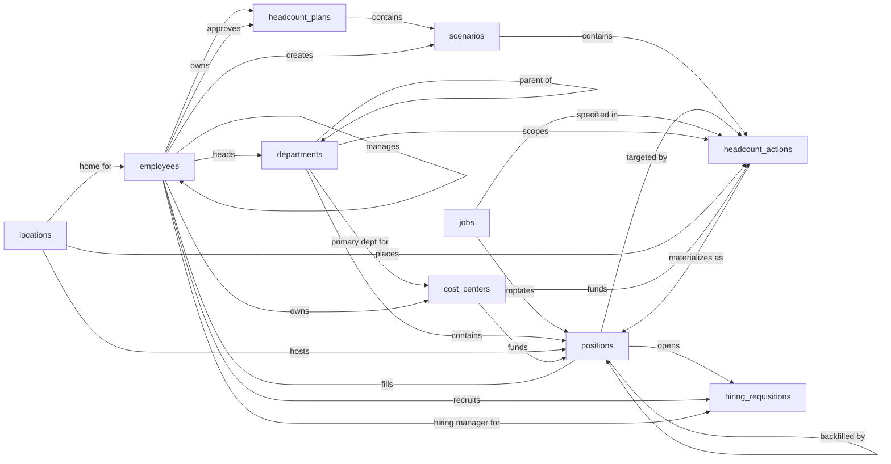

# Workforce Planning — Semantic Model

## 1. Overview

A scenario-based headcount planning system. The system tracks the current org (departments, locations, cost centers, jobs, employees, positions) as the source-of-truth baseline, and lets planners draft alternative future-state plans through scenarios containing staged headcount actions (add, eliminate, transfer). Approved scenarios materialize into real position records, which can then be handed off to recruiting via lightweight hiring requisitions.

## 2. Entity summary

| # | Table name | Singular label | Purpose |
|---|---|---|---|
| 1 | `departments` | Department | Org units the workforce is grouped into; supports hierarchy via `parent_department_id` |
| 2 | `locations` | Location | Offices, regions, or remote pools where positions sit |
| 3 | `cost_centers` | Cost Center | Financial buckets used to budget headcount cost |
| 4 | `jobs` | Job | Catalog of role definitions — title, level, family — used to template positions |
| 5 | `employees` | Employee | Current workforce members; can occupy a position and report to a manager |
| 6 | `positions` | Position | A discrete seat (filled, open, or approved-future), tied to a job, department, location, cost center |
| 7 | `headcount_plans` | Headcount Plan | A named plan covering a timeframe (e.g. "FY2026") with status (draft → in-review → approved → active → archived) |
| 8 | `scenarios` | Scenario | A what-if version of a plan (base, optimistic, conservative, custom). Many per plan; one is marked active |
| 9 | `headcount_actions` | Headcount Action | A staged change within a scenario — add, eliminate, or transfer — with effective date and cost impact |
| 10 | `hiring_requisitions` | Hiring Requisition | A lightweight handoff record marking that a position has been cleared to start recruiting |

### Entity-relationship diagram

## 3. Entities

### 3.1 `departments` — Department

**Plural label:** Departments
**Label column:** `department_name`
**Audit log:** no
**Description:** An org unit the workforce is grouped into (e.g. Engineering, Sales). Supports hierarchy via `parent_department_id` so sub-departments can roll up under a parent. Created by HR or planning admins as the org's structural skeleton.

**Fields**

| Field name | Format | Required | Label | Reference / Notes |
|---|---|---|---|---|
| `department_name` | `string` | yes | Name | unique; default: `""` |
| `department_code` | `string` | no | Code | unique; short code, e.g. `ENG`, `SLS` |
| `parent_department_id` | `reference` | no | Parent Department | → `departments` (N:1, self), relationship_label: `"parent of"` |
| `head_employee_id` | `reference` | no | Department Head | → `employees` (N:1), relationship_label: `"heads"` |
| `description` | `text` | no | Description | |
| `is_active` | `boolean` | yes | Active | default: `true` |

**Relationships**

- A `department` may have a parent `department` (N:1, optional, self-referential, clear on delete).
- A `department` may have one head `employee` (N:1, optional, clear on delete).
- A `department` may have many `cost_centers` for which it is the primary department (1:N, via `cost_centers.primary_department_id`).
- A `department` may host many `positions` (1:N, via `positions.department_id`).
- A `department` may be the target of many `headcount_actions` (1:N, via `headcount_actions.department_id`).

---

### 3.2 `locations` — Location

**Plural label:** Locations
**Label column:** `location_name`
**Audit log:** no
**Description:** An office, regional hub, remote pool, or field location where positions can sit. Used to plan headcount geography and assign employees a home base.

**Fields**

| Field name | Format | Required | Label | Reference / Notes |
|---|---|---|---|---|
| `location_name` | `string` | yes | Name | default: `""` |
| `location_type` | `enum` | yes | Type | values: `office`, `remote_pool`, `hybrid_hub`, `field` |
| `city` | `string` | no | City | |
| `region` | `string` | no | Region / State | |
| `country` | `string` | no | Country | ISO-2 or full name |
| `timezone` | `string` | no | Time Zone | IANA, e.g. `Europe/Berlin` |
| `is_active` | `boolean` | yes | Active | default: `true` |

**Relationships**

- A `location` may be the home location for many `employees` (1:N, via `employees.home_location_id`).
- A `location` may host many `positions` (1:N, via `positions.location_id`).
- A `location` may be the target of many `headcount_actions` (1:N, via `headcount_actions.location_id`).

---

### 3.3 `cost_centers` — Cost Center

**Plural label:** Cost Centers
**Label column:** `cost_center_code`
**Audit log:** no
**Description:** A financial bucket against which headcount cost is budgeted and reported. Often (but not always) maps 1:1 with a department.

**Fields**

| Field name | Format | Required | Label | Reference / Notes |
|---|---|---|---|---|
| `cost_center_code` | `string` | yes | Code | unique; default: `""` |
| `cost_center_name` | `string` | yes | Name | default: `""` |
| `primary_department_id` | `reference` | no | Primary Department | → `departments` (N:1), relationship_label: `"primary dept for"` |
| `owner_employee_id` | `reference` | no | Owner | → `employees` (N:1), relationship_label: `"owns"` |
| `is_active` | `boolean` | yes | Active | default: `true` |

**Relationships**

- A `cost_center` may have a primary `department` (N:1, optional, clear on delete).
- A `cost_center` may have one owner `employee` (N:1, optional, clear on delete).
- A `cost_center` may fund many `positions` (1:N, via `positions.cost_center_id`).
- A `cost_center` may be the target of many `headcount_actions` (1:N, via `headcount_actions.cost_center_id`).

---

### 3.4 `jobs` — Job

**Plural label:** Jobs
**Label column:** `job_name`
**Audit log:** no
**Description:** A reusable role definition (title + level + family) that templates positions. A position is "an instance of a job" placed in a department/location/cost center. Carries an optional comp band for budgeting reference.

**Fields**

| Field name | Format | Required | Label | Reference / Notes |
|---|---|---|---|---|
| `job_name` | `string` | yes | Name | e.g. "Senior Software Engineer"; default: `""` |
| `job_code` | `string` | no | Code | unique |
| `job_family` | `string` | no | Job Family | e.g. `Engineering`, `Sales` |
| `job_level` | `string` | no | Level | e.g. `L4`, `Manager`, `Director` |
| `job_type` | `enum` | yes | Type | values: `individual_contributor`, `people_manager`, `executive` |
| `description` | `text` | no | Description | |
| `min_annual_compensation` | `number` | no | Min Annual Compensation | precision: 2; comp band low |
| `max_annual_compensation` | `number` | no | Max Annual Compensation | precision: 2; comp band high |
| `is_active` | `boolean` | yes | Active | default: `true` |

**Relationships**

- A `job` may template many `positions` (1:N, via `positions.job_id`).
- A `job` may be specified in many `headcount_actions` (1:N, via `headcount_actions.job_id`).

---

### 3.5 `employees` — Employee

**Plural label:** Employees
**Label column:** `employee_full_name`
**Audit log:** yes
**Description:** A current workforce member (full-time, part-time, contractor, or intern). Each employee may occupy a position and reports to a manager. Lifecycle covers `pending_start` → `active` → `on_leave` → `terminated`.

**Fields**

| Field name | Format | Required | Label | Reference / Notes |
|---|---|---|---|---|
| `employee_full_name` | `string` | yes | Full Name | default: `""` |
| `employee_number` | `string` | no | Employee Number | unique |
| `work_email` | `email` | no | Work Email | unique |
| `employment_type` | `enum` | yes | Employment Type | values: `full_time`, `part_time`, `contractor`, `intern` |
| `employment_status` | `enum` | yes | Employment Status | values: `pending_start`, `active`, `on_leave`, `terminated` |
| `hire_date` | `date` | no | Hire Date | |
| `termination_date` | `date` | no | Termination Date | |
| `manager_employee_id` | `reference` | no | Manager | → `employees` (N:1, self), relationship_label: `"manages"` |
| `home_location_id` | `reference` | no | Home Location | → `locations` (N:1), relationship_label: `"home for"` |

**Relationships**

- An `employee` may have a manager `employee` (N:1, optional, self-referential, clear on delete).
- An `employee` may have a home `location` (N:1, optional, clear on delete).
- An `employee` may fill exactly one `position` (1:1, via `positions.current_employee_id` with uniqueness).
- An `employee` may head many `departments` (1:N, via `departments.head_employee_id`).
- An `employee` may own many `cost_centers` (1:N, via `cost_centers.owner_employee_id`).
- An `employee` may own and approve many `headcount_plans` (1:N each, via `headcount_plans.owner_employee_id` and `.approved_by_employee_id`).
- An `employee` may create many `scenarios` (1:N, via `scenarios.created_by_employee_id`).
- An `employee` may serve as recruiter or hiring manager on many `hiring_requisitions` (1:N each).

---

### 3.6 `positions` — Position

**Plural label:** Positions
**Label column:** `position_code`
**Audit log:** yes
**Description:** A discrete seat in the org. Captures both reality (filled or open today) and approved-future seats (committed from an approved scenario, with a target start date). Uncommitted what-if seats live as `headcount_actions`, not as positions. Status drives lifecycle: `filled` ↔ `open`, `approved_future` → `open` once the start date arrives, `eliminated` for closed seats.

**Fields**

| Field name | Format | Required | Label | Reference / Notes |
|---|---|---|---|---|
| `position_code` | `string` | yes | Position Code | unique, e.g. `POS-00123`; default: `""` |
| `position_status` | `enum` | yes | Status | values: `open`, `filled`, `approved_future`, `on_hold`, `eliminated` |
| `job_id` | `reference` | yes | Job | → `jobs` (N:1), relationship_label: `"templates"` |
| `department_id` | `reference` | yes | Department | → `departments` (N:1), relationship_label: `"contains"` |
| `location_id` | `reference` | yes | Location | → `locations` (N:1), relationship_label: `"hosts"` |
| `cost_center_id` | `reference` | yes | Cost Center | → `cost_centers` (N:1), relationship_label: `"funds"` |
| `current_employee_id` | `reference` | no | Current Employee | → `employees` (N:1); unique — at most one position per employee, relationship_label: `"fills"` |
| `fte` | `number` | yes | FTE | precision: 2; 1.0 = full-time, 0.5 = half-time; default: `1.0` |
| `target_start_date` | `date` | no | Target Start Date | for `approved_future` and `open` |
| `actual_start_date` | `date` | no | Actual Start Date | when the seat became `filled` |
| `end_date` | `date` | no | End Date | when the seat was `eliminated` |
| `budgeted_annual_cost` | `number` | no | Budgeted Annual Cost | precision: 2 |
| `is_backfill` | `boolean` | no | Is Backfill | |
| `backfill_for_position_id` | `reference` | no | Backfill For | → `positions` (N:1, self), relationship_label: `"backfilled by"` |
| `originated_from_action_id` | `reference` | no | Originated From Action | → `headcount_actions` (N:1); set when committed from a scenario, relationship_label: `"materializes as"` |
| `notes` | `text` | no | Notes | |

**Relationships**

- A `position` belongs to one `job`, one `department`, one `location`, one `cost_center` (each N:1, required, restrict on delete).
- A `position` may be filled by exactly one `employee` (1:1, via `current_employee_id` with uniqueness, clear on delete).
- A `position` may be a backfill of another `position` (N:1, optional, self-referential, clear on delete).
- A `position` may have originated from one `headcount_action` (N:1, optional, clear on delete).
- A `position` may be targeted by many `headcount_actions` (1:N, via `headcount_actions.target_position_id`).
- A `position` may have many `hiring_requisitions` over time (1:N, via `hiring_requisitions.position_id`, restrict on delete).

---

### 3.7 `headcount_plans` — Headcount Plan

**Plural label:** Headcount Plans
**Label column:** `plan_name`
**Audit log:** yes
**Description:** A named plan covering a fiscal timeframe. Acts as a container for one or more scenarios. Lifecycle: `draft` → `in_review` → `approved` → `active` → `archived`.

**Fields**

| Field name | Format | Required | Label | Reference / Notes |
|---|---|---|---|---|
| `plan_name` | `string` | yes | Name | e.g. "FY2026 Headcount Plan"; default: `""` |
| `plan_status` | `enum` | yes | Status | values: `draft`, `in_review`, `approved`, `active`, `archived` |
| `fiscal_year_label` | `string` | no | Fiscal Year | e.g. `FY2026` |
| `start_date` | `date` | yes | Start Date | |
| `end_date` | `date` | yes | End Date | |
| `owner_employee_id` | `reference` | no | Plan Owner | → `employees` (N:1), relationship_label: `"owns"` |
| `description` | `text` | no | Description | |
| `approved_at` | `date-time` | no | Approved At | |
| `approved_by_employee_id` | `reference` | no | Approved By | → `employees` (N:1), relationship_label: `"approves"` |

**Relationships**

- A `headcount_plan` may have one owner `employee` and one approver `employee` (each N:1, optional, clear on delete).
- A `headcount_plan` has many `scenarios` (1:N, parent, cascade on delete — scenarios live and die with their plan).

---

### 3.8 `scenarios` — Scenario

**Plural label:** Scenarios
**Label column:** `scenario_name`
**Audit log:** yes
**Description:** An alternative version of a plan (base case, aggressive growth, conservative). Each plan has many scenarios; exactly one per plan is marked `is_active_for_plan = true`. The active scenario's actions are what gets committed when the plan is approved.

**Fields**

| Field name | Format | Required | Label | Reference / Notes |
|---|---|---|---|---|
| `scenario_name` | `string` | yes | Name | e.g. "Base Case", "Aggressive Growth"; default: `""` |
| `headcount_plan_id` | `parent` | yes | Plan | ↳ `headcount_plans` (N:1, cascade), relationship_label: `"contains"` |
| `scenario_type` | `enum` | yes | Type | values: `base`, `optimistic`, `conservative`, `custom` |
| `scenario_status` | `enum` | yes | Status | values: `draft`, `in_review`, `approved`, `archived` |
| `is_active_for_plan` | `boolean` | yes | Active for Plan | exactly one per plan should be `true`; default: `false` |
| `description` | `text` | no | Description | |
| `committed_at` | `date-time` | no | Committed At | when actions were materialized into positions |
| `created_by_employee_id` | `reference` | no | Created By | → `employees` (N:1), relationship_label: `"creates"` |

**Relationships**

- A `scenario` belongs to one `headcount_plan` (N:1, parent, cascade on delete).
- A `scenario` may have a creator `employee` (N:1, optional, clear on delete).
- A `scenario` has many `headcount_actions` (1:N, parent, cascade on delete).

---

### 3.9 `headcount_actions` — Headcount Action

**Plural label:** Headcount Actions
**Label column:** `action_label`
**Audit log:** yes
**Description:** A single staged change within a scenario. Three action types: `add` (create a new seat), `eliminate` (close an existing seat), `transfer` (move an existing seat between department/location/cost center). The caller populates `action_label` (e.g. "Add Sr SWE / Eng / Berlin / 2026-Q1") to give the action a human-readable handle.

**Fields**

| Field name | Format | Required | Label | Reference / Notes |
|---|---|---|---|---|
| `action_label` | `string` | yes | Action | caller populates; default: `""` |
| `scenario_id` | `parent` | yes | Scenario | ↳ `scenarios` (N:1, cascade), relationship_label: `"contains"` |
| `action_type` | `enum` | yes | Action Type | values: `add`, `eliminate`, `transfer` |
| `action_status` | `enum` | yes | Status | values: `proposed`, `in_review`, `approved`, `committed`, `rejected` |
| `target_position_id` | `reference` | no | Target Position | → `positions` (N:1); required for `eliminate`/`transfer`, null for `add`, relationship_label: `"targeted by"` |
| `job_id` | `reference` | no | Job | → `jobs` (N:1); required for `add`, relationship_label: `"specified in"` |
| `department_id` | `reference` | no | Department | → `departments` (N:1); required for `add`, target dept for `transfer`, relationship_label: `"scopes"` |
| `location_id` | `reference` | no | Location | → `locations` (N:1); required for `add`, target loc for `transfer`, relationship_label: `"places"` |
| `cost_center_id` | `reference` | no | Cost Center | → `cost_centers` (N:1); required for `add`, target cc for `transfer`, relationship_label: `"funds"` |
| `effective_date` | `date` | yes | Effective Date | |
| `fte` | `number` | no | FTE | precision: 2; for `add` |
| `budgeted_annual_cost` | `number` | no | Budgeted Annual Cost | precision: 2; for `add` |
| `justification` | `text` | no | Justification | |

**Relationships**

- A `headcount_action` belongs to one `scenario` (N:1, parent, cascade on delete).
- A `headcount_action` may target one existing `position` (N:1, optional, clear on delete) — required for `eliminate`/`transfer`.
- A `headcount_action` may specify one `job`, `department`, `location`, `cost_center` (each N:1, optional, clear on delete) — populated for `add`/`transfer` per the action type.
- A `headcount_action` may materialize as many `positions` once committed (1:N, via `positions.originated_from_action_id`).

---

### 3.10 `hiring_requisitions` — Hiring Requisition

**Plural label:** Hiring Requisitions
**Label column:** `requisition_number`
**Audit log:** yes
**Description:** A lightweight handoff record marking that an open position has been cleared to start recruiting. Tracks recruiter, hiring manager, target/actual fill dates, and an optional URL into the external ATS where the candidate pipeline lives. A future ATS module would replace this with a richer requisition + candidate model.

**Fields**

| Field name | Format | Required | Label | Reference / Notes |
|---|---|---|---|---|
| `requisition_number` | `string` | yes | Requisition Number | unique, e.g. `REQ-2026-0123`; default: `""` |
| `position_id` | `reference` | yes | Position | → `positions` (N:1, restrict), relationship_label: `"opens"` |
| `requisition_status` | `enum` | yes | Status | values: `open`, `on_hold`, `filled`, `cancelled` |
| `recruiter_employee_id` | `reference` | no | Recruiter | → `employees` (N:1), relationship_label: `"recruits"` |
| `hiring_manager_employee_id` | `reference` | no | Hiring Manager | → `employees` (N:1), relationship_label: `"hiring manager for"` |
| `opened_date` | `date` | yes | Opened Date | |
| `target_fill_date` | `date` | no | Target Fill Date | |
| `filled_date` | `date` | no | Filled Date | |
| `external_ats_url` | `url` | no | External ATS URL | handoff link to the recruiting tool |
| `notes` | `text` | no | Notes | |

**Relationships**

- A `hiring_requisition` is for exactly one `position` (N:1, required, restrict on delete).
- A `hiring_requisition` may have a recruiter `employee` and a hiring manager `employee` (each N:1, optional, clear on delete).

## 4. Relationship summary

| From | Field | To | Cardinality | Kind | Delete behavior |
|---|---|---|---|---|---|
| `departments` | `parent_department_id` | `departments` | N:1 | reference | clear |
| `departments` | `head_employee_id` | `employees` | N:1 | reference | clear |
| `cost_centers` | `primary_department_id` | `departments` | N:1 | reference | clear |
| `cost_centers` | `owner_employee_id` | `employees` | N:1 | reference | clear |
| `employees` | `manager_employee_id` | `employees` | N:1 | reference | clear |
| `employees` | `home_location_id` | `locations` | N:1 | reference | clear |
| `positions` | `job_id` | `jobs` | N:1 | reference | restrict |
| `positions` | `department_id` | `departments` | N:1 | reference | restrict |
| `positions` | `location_id` | `locations` | N:1 | reference | restrict |
| `positions` | `cost_center_id` | `cost_centers` | N:1 | reference | restrict |
| `positions` | `current_employee_id` | `employees` | 1:1 | reference | clear |
| `positions` | `backfill_for_position_id` | `positions` | N:1 | reference | clear |
| `positions` | `originated_from_action_id` | `headcount_actions` | N:1 | reference | clear |
| `headcount_plans` | `owner_employee_id` | `employees` | N:1 | reference | clear |
| `headcount_plans` | `approved_by_employee_id` | `employees` | N:1 | reference | clear |
| `scenarios` | `headcount_plan_id` | `headcount_plans` | N:1 | parent | cascade |
| `scenarios` | `created_by_employee_id` | `employees` | N:1 | reference | clear |
| `headcount_actions` | `scenario_id` | `scenarios` | N:1 | parent | cascade |
| `headcount_actions` | `target_position_id` | `positions` | N:1 | reference | clear |
| `headcount_actions` | `job_id` | `jobs` | N:1 | reference | clear |
| `headcount_actions` | `department_id` | `departments` | N:1 | reference | clear |
| `headcount_actions` | `location_id` | `locations` | N:1 | reference | clear |
| `headcount_actions` | `cost_center_id` | `cost_centers` | N:1 | reference | clear |
| `hiring_requisitions` | `position_id` | `positions` | N:1 | reference | restrict |
| `hiring_requisitions` | `recruiter_employee_id` | `employees` | N:1 | reference | clear |
| `hiring_requisitions` | `hiring_manager_employee_id` | `employees` | N:1 | reference | clear |

## 5. Enumerations

### 5.1 `locations.location_type`
- `office`
- `remote_pool`
- `hybrid_hub`
- `field`

### 5.2 `jobs.job_type`
- `individual_contributor`
- `people_manager`
- `executive`

### 5.3 `employees.employment_type`
- `full_time`
- `part_time`
- `contractor`
- `intern`

### 5.4 `employees.employment_status`
- `pending_start`
- `active`
- `on_leave`
- `terminated`

### 5.5 `positions.position_status`
- `open`
- `filled`
- `approved_future`
- `on_hold`
- `eliminated`

### 5.6 `headcount_plans.plan_status`
- `draft`
- `in_review`
- `approved`
- `active`
- `archived`

### 5.7 `scenarios.scenario_type`
- `base`
- `optimistic`
- `conservative`
- `custom`

### 5.8 `scenarios.scenario_status`
- `draft`
- `in_review`
- `approved`
- `archived`

### 5.9 `headcount_actions.action_type`
- `add`
- `eliminate`
- `transfer`

### 5.10 `headcount_actions.action_status`
- `proposed`
- `in_review`
- `approved`
- `committed`
- `rejected`

### 5.11 `hiring_requisitions.requisition_status`
- `open`
- `on_hold`
- `filled`
- `cancelled`

## 6. Open questions

### 6.1 🔴 Decisions needed (blockers)

None.

### 6.2 🟡 Future considerations (deferred scope)

- Should `position_assignments` be added as a history entity to record every employee who has held a position over time, rather than only the current occupant on `positions.current_employee_id`?
- Should a `skills` (or `competencies`) catalog be introduced, with M:N junctions to `jobs` (required skills) and `employees` (held skills) to support skills-based planning?
- Should `headcount_actions.action_type` be extended with `promote`, `reclassify`, and `comp_change` to cover non-seat changes within a scenario, or are those better modeled as a separate `compensation_actions` entity?
- Should a `legal_entities` entity be added to support multi-subsidiary planning (with `cost_centers` and `employees` rolling up to a legal entity)?
- Should attrition assumptions (e.g. expected voluntary attrition % per department per quarter) be modeled as planning inputs, possibly as an `attrition_assumptions` entity attached to `scenarios`?
- Should `scenarios` be able to stage org-structure changes (new departments, splits, merges) in addition to position changes, or are department changes always made directly on the live org?
- Should the lightweight `hiring_requisitions` be replaced or extended by a full ATS module (`candidates`, `applications`, `interview_stages`, `offers`) when recruiting moves into this system?
- Should `employees` carry an optional `user_id` link to the platform's built-in `users` for SSO/login integration, with deduplication handled at deploy time?
- Should `cost_centers` ↔ `departments` become an M:N junction to support orgs where a department is funded by multiple cost centers, rather than the current single `primary_department_id` reference?

## 7. Implementation notes for the downstream agent

1. Create one module named `workforce_planning` and two baseline permissions (`workforce_planning:read`, `workforce_planning:manage`) before any entity.
2. Create entities in this order so that referenced entities exist first: `locations`, `departments`, `jobs`, `cost_centers`, `employees`, `positions`, `headcount_plans`, `scenarios`, `headcount_actions`, `hiring_requisitions`. Note that `departments`, `employees`, `cost_centers`, and `positions` all contain forward references to entities created later in the list — create the entity first with all non-FK fields, then add the FK fields in a second pass once the target tables exist.
3. For each entity: set `label_column` to the snake_case field marked as label in §3, pass `module_id`, `view_permission` (`workforce_planning:read`), `edit_permission` (`workforce_planning:manage`). Set `audit_log: true` on `employees`, `positions`, `headcount_plans`, `scenarios`, `headcount_actions`, and `hiring_requisitions` (per §3); leave the others at the default `false`. Do not manually create `id`, `created_at`, `updated_at`, or the auto-label field.
4. For each field in §3: pass `table_name`, `field_name`, `format`, `title` (the Label column), and for `reference`/`parent` fields also `reference_table` and a `reference_delete_mode` consistent with §4. For `positions.current_employee_id`, set `unique_value: true` to enforce the 1:1 business rule (an employee fills at most one position). The `Required` column is analyst intent; the platform manages nullability internally.
5. **Fix up each entity's auto-created label-column field title.** `create_entity` auto-creates a field whose `field_name` equals the entity's `label_column`, and its `title` defaults to `singular_label` (e.g. entity `departments` with `singular_label: "Department"` and `label_column: "department_name"` yields an auto-field `departments.department_name` with title `"Department"`). For every entity in this model, the §3 Label for the label-column row differs from `singular_label`, so `update_field` must be called for each. Use the composite **string** id `"{table_name}.{field_name}"` (passed as a string, not an integer):
   - `"departments.department_name"` → title `"Name"`
   - `"locations.location_name"` → title `"Name"`
   - `"cost_centers.cost_center_code"` → title `"Code"`
   - `"jobs.job_name"` → title `"Name"`
   - `"employees.employee_full_name"` → title `"Full Name"`
   - `"positions.position_code"` → title `"Position Code"`
   - `"headcount_plans.plan_name"` → title `"Name"`
   - `"scenarios.scenario_name"` → title `"Name"`
   - `"headcount_actions.action_label"` → title `"Action"`
   - `"hiring_requisitions.requisition_number"` → title `"Requisition Number"`
6. **Deduplicate against Semantius built-in tables.** This model is self-contained but does not currently declare any entity that overlaps with the Semantius built-ins (`users`, `roles`, `permissions`, etc.). No deduplication action is required for this model. If a future extension declares any built-in (e.g. linking `employees.user_id` to `users`), read Semantius first and reuse the built-in as the `reference_table` target rather than recreating it.
7. After creation, spot-check: every `label_column` resolves to a real field; every `reference_table` target exists; the `is_active_for_plan` boolean on `scenarios` has a uniqueness expectation per `headcount_plan_id` (enforce via application logic if the platform does not support partial unique indexes); `positions.current_employee_id` has `unique_value: true` set.

## 8. Related domains

This model declares its links to sibling modules so the deployer can reconcile shared masters and downstream handoffs at deploy time. Each entry is a sibling slug with three keys: **Exposes** (what this model offers the sibling), **Expects on sibling** (FKs the sibling should add back into this model when deployed), and **Defers to sibling** (entities this model declares for self-containment but cedes canonical ownership to the sibling when the sibling is deployed).

### 8.1 `applicant_tracking` (downstream peer)

- **Exposes:** `hiring_requisitions`, `positions`, `jobs`, `departments`, `locations`. Recruiting workflows in ATS need the requisition to attach candidates to, plus the position/job/dept/location context.
- **Expects on sibling:** when ATS is deployed, ATS entities such as `applications` or `candidates` are expected to FK back to `hiring_requisitions` (e.g. `applications.requisition_id → hiring_requisitions`). The lightweight `external_ats_url` field on `hiring_requisitions` becomes redundant once a real ATS owns the candidate pipeline.
- **Defers to sibling:** none. This model owns its lightweight `hiring_requisitions` for the standalone case; if ATS is deployed, `hiring_requisitions` may be deprecated in favor of an ATS-native requisition entity (see §6.2).

### 8.2 `hris` (upstream master)

- **Exposes:** none. HRIS is the canonical owner; this model is the consumer.
- **Expects on sibling:** none — HRIS does not need to FK into workforce-planning entities.
- **Defers to sibling:** `employees`, `departments`, `locations`. When HRIS is deployed, those tables are owned canonically there and the deployer should rewire `positions.{department_id, location_id, current_employee_id}`, `headcount_actions.{department_id, location_id}`, `headcount_plans.{owner_employee_id, approved_by_employee_id}`, etc. to point at the HRIS-owned tables. Until HRIS is deployed, this model owns those entities for self-containment.

### 8.3 `finance` (upstream master)

- **Exposes:** none. Finance is the canonical owner of the chart of accounts.
- **Expects on sibling:** none.
- **Defers to sibling:** `cost_centers`. When a finance / chart-of-accounts module is deployed, `cost_centers` is canonically owned there and the deployer should rewire `positions.cost_center_id`, `headcount_actions.cost_center_id`, and `cost_centers.primary_department_id` (if finance keeps the dept link) to point at the finance-owned table. Until finance is deployed, this model owns `cost_centers` for self-containment.
