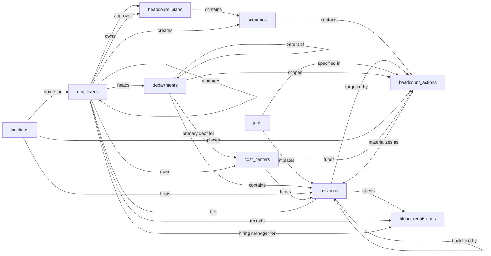

# Workforce Planning — Semantic Model

## 1. Overview

A scenario-based headcount planning tool. Planners stage what-if changes (add, eliminate, transfer) inside scenarios under a named plan, then commit the active scenario's actions into real position records once the plan is approved. The system carries the operational baseline (departments, locations, cost centers, jobs, employees, positions) so plans can be drafted against the current org, and emits lightweight hiring requisitions to hand approved seats off to recruiting.

## 2. Entity summary

| # | Table name | Singular label | Purpose |
|---|---|---|---|
| 1 | `departments` | Department | Org units the workforce is grouped into; supports hierarchy via `parent_department_id` |
| 2 | `locations` | Location | Offices, regions, or remote pools where positions sit |
| 3 | `cost_centers` | Cost Center | Financial buckets used to budget headcount cost |
| 4 | `jobs` | Job | Catalog of role definitions (title, level, family) used to template positions |
| 5 | `employees` | Employee | Current workforce members; can occupy a position and report to a manager |
| 6 | `positions` | Position | A discrete seat (filled, open, or approved-future), tied to a job, department, location, cost center |
| 7 | `headcount_plans` | Headcount Plan | A named plan covering a timeframe (e.g. "FY2026") with status (draft, in-review, approved, active, archived) |
| 8 | `scenarios` | Scenario | A what-if version of a plan (base, optimistic, conservative, custom). Many per plan; one is marked active |
| 9 | `headcount_actions` | Headcount Action | A staged change within a scenario (add, eliminate, or transfer) with effective date and cost impact |
| 10 | `hiring_requisitions` | Hiring Requisition | A lightweight handoff record marking that a position has been cleared to start recruiting |

### Entity-relationship diagram



## 3. Entities

### 3.1 `departments` — Department

**Plural label:** Departments
**Label column:** `department_name`
**Audit log:** no
**Description:** An org unit the workforce is grouped into (e.g. Engineering, Sales). Supports hierarchy via `parent_department_id` so sub-departments can roll up under a parent. Created by HR or planning admins as the org's structural skeleton.

**Fields**

| Field name | Format | Required | Label | Reference / Notes |
|---|---|---|---|---|
| `department_name` | `string` | yes | Name | unique; default: `""` |
| `department_code` | `string` | no | Code | unique; short code, e.g. `ENG`, `SLS` |
| `parent_department_id` | `reference` | no | Parent Department | → `departments` (N:1, self), relationship_label: `"parent of"` |
| `head_employee_id` | `reference` | no | Department Head | → `employees` (N:1), relationship_label: `"heads"` |
| `description` | `text` | no | Description | |
| `is_active` | `boolean` | yes | Active | default: `true` |

**Relationships**

- A `department` may have a parent `department` (N:1, optional, self-referential, clear on delete).
- A `department` may have one head `employee` (N:1, optional, clear on delete).
- A `department` may have many `cost_centers` for which it is the primary department (1:N, via `cost_centers.primary_department_id`).
- A `department` may host many `positions` (1:N, via `positions.department_id`).
- A `department` may be the target of many `headcount_actions` (1:N, via `headcount_actions.department_id`).

**Validation rules**

```json
[
  {
    "code": "department_not_self_parent",
    "message": "A department cannot be its own parent.",
    "description": "Direct self-reference check. Deeper cycle detection across the hierarchy requires cross-row analysis and is out of scope for JsonLogic; enforce in application layer or via a periodic data quality job.",
    "jsonlogic": {
      "or": [
        {"==": [{"var": "parent_department_id"}, null]},
        {"!=": [{"var": "parent_department_id"}, {"var": "id"}]}
      ]
    }
  }
]
```

---

### 3.2 `locations` — Location

**Plural label:** Locations
**Label column:** `location_name`
**Audit log:** no
**Description:** An office, regional hub, remote pool, or field location where positions can sit. Used to plan headcount geography and assign employees a home base.

**Fields**

| Field name | Format | Required | Label | Reference / Notes |
|---|---|---|---|---|
| `location_name` | `string` | yes | Name | default: `""` |
| `location_type` | `enum` | yes | Type | values: `office`, `remote_pool`, `hybrid_hub`, `field`; default: `"office"` |
| `city` | `string` | no | City | |
| `region` | `string` | no | Region / State | |
| `country` | `string` | no | Country | ISO-2 or full name |
| `timezone` | `string` | no | Time Zone | IANA, e.g. `Europe/Berlin` |
| `is_active` | `boolean` | yes | Active | default: `true` |

**Relationships**

- A `location` may be the home location for many `employees` (1:N, via `employees.home_location_id`).
- A `location` may host many `positions` (1:N, via `positions.location_id`).
- A `location` may be the target of many `headcount_actions` (1:N, via `headcount_actions.location_id`).

---

### 3.3 `cost_centers` — Cost Center

**Plural label:** Cost Centers
**Label column:** `cost_center_code`
**Audit log:** no
**Description:** A financial bucket against which headcount cost is budgeted and reported. Often (but not always) maps 1:1 with a department.

**Fields**

| Field name | Format | Required | Label | Reference / Notes |
|---|---|---|---|---|
| `cost_center_code` | `string` | yes | Code | unique; default: `""` |
| `cost_center_name` | `string` | yes | Name | default: `""` |
| `primary_department_id` | `reference` | no | Primary Department | → `departments` (N:1), relationship_label: `"primary dept for"` |
| `owner_employee_id` | `reference` | no | Owner | → `employees` (N:1), relationship_label: `"owns"` |
| `is_active` | `boolean` | yes | Active | default: `true` |

**Relationships**

- A `cost_center` may have a primary `department` (N:1, optional, clear on delete).
- A `cost_center` may have one owner `employee` (N:1, optional, clear on delete).
- A `cost_center` may fund many `positions` (1:N, via `positions.cost_center_id`).
- A `cost_center` may be the target of many `headcount_actions` (1:N, via `headcount_actions.cost_center_id`).

---

### 3.4 `jobs` — Job

**Plural label:** Jobs
**Label column:** `job_name`
**Audit log:** no
**Description:** A reusable role definition (title, level, family) that templates positions. A position is "an instance of a job" placed in a department, location, and cost center. Carries an optional comp band for budgeting reference; the comp band low must not exceed the comp band high when both are set.

**Fields**

| Field name | Format | Required | Label | Reference / Notes |
|---|---|---|---|---|
| `job_name` | `string` | yes | Name | e.g. "Senior Software Engineer"; default: `""` |
| `job_code` | `string` | no | Code | unique |
| `job_family` | `string` | no | Job Family | e.g. `Engineering`, `Sales` |
| `job_level` | `string` | no | Level | e.g. `L4`, `Manager`, `Director` |
| `job_type` | `enum` | yes | Type | values: `individual_contributor`, `people_manager`, `executive`; default: `"individual_contributor"` |
| `description` | `text` | no | Description | |
| `min_annual_compensation` | `number` | no | Min Annual Compensation | precision: 2; comp band low; non-negative |
| `max_annual_compensation` | `number` | no | Max Annual Compensation | precision: 2; comp band high; non-negative; ≥ `min_annual_compensation` |
| `is_active` | `boolean` | yes | Active | default: `true` |

**Relationships**

- A `job` may template many `positions` (1:N, via `positions.job_id`).
- A `job` may be specified in many `headcount_actions` (1:N, via `headcount_actions.job_id`).

**Validation rules**

```json
[
  {
    "code": "min_annual_compensation_non_negative",
    "message": "Minimum annual compensation cannot be negative.",
    "description": "Currency amounts on a comp band cannot be negative.",
    "jsonlogic": {
      "or": [
        {"==": [{"var": "min_annual_compensation"}, null]},
        {">=": [{"var": "min_annual_compensation"}, 0]}
      ]
    }
  },
  {
    "code": "max_annual_compensation_non_negative",
    "message": "Maximum annual compensation cannot be negative.",
    "description": "Currency amounts on a comp band cannot be negative.",
    "jsonlogic": {
      "or": [
        {"==": [{"var": "max_annual_compensation"}, null]},
        {">=": [{"var": "max_annual_compensation"}, 0]}
      ]
    }
  },
  {
    "code": "comp_band_min_le_max",
    "message": "Minimum annual compensation cannot exceed maximum annual compensation.",
    "description": "Comp band low cannot exceed comp band high. Skipped when either side is unset.",
    "jsonlogic": {
      "or": [
        {"==": [{"var": "min_annual_compensation"}, null]},
        {"==": [{"var": "max_annual_compensation"}, null]},
        {"<=": [{"var": "min_annual_compensation"}, {"var": "max_annual_compensation"}]}
      ]
    }
  }
]
```

---

### 3.5 `employees` — Employee

**Plural label:** Employees
**Label column:** `employee_full_name`
**Audit log:** yes
**Description:** A current workforce member (full-time, part-time, contractor, or intern). Each employee may occupy a position and reports to a manager. Lifecycle covers `pending_start`, `active`, `on_leave`, `terminated`. An employee may move from `terminated` back to `active` to support rehires, rather than requiring a new employee record; the lifecycle deliberately does not lock down the terminal state.

**Fields**

| Field name | Format | Required | Label | Reference / Notes |
|---|---|---|---|---|
| `employee_full_name` | `string` | yes | Full Name | default: `""` |
| `employee_number` | `string` | no | Employee Number | unique |
| `work_email` | `email` | no | Work Email | unique |
| `employment_type` | `enum` | yes | Employment Type | values: `full_time`, `part_time`, `contractor`, `intern`; default: `"full_time"` |
| `employment_status` | `enum` | yes | Employment Status | values: `pending_start`, `active`, `on_leave`, `terminated`; default: `"pending_start"` |
| `hire_date` | `date` | no | Hire Date | |
| `termination_date` | `date` | no | Termination Date | required when `employment_status = terminated`; ≥ `hire_date` |
| `manager_employee_id` | `reference` | no | Manager | → `employees` (N:1, self), relationship_label: `"manages"` |
| `home_location_id` | `reference` | no | Home Location | → `locations` (N:1), relationship_label: `"home for"` |

**Relationships**

- An `employee` may have a manager `employee` (N:1, optional, self-referential, clear on delete).
- An `employee` may have a home `location` (N:1, optional, clear on delete).
- An `employee` may fill exactly one `position` (1:1, via `positions.current_employee_id` with uniqueness).
- An `employee` may head many `departments` (1:N, via `departments.head_employee_id`).
- An `employee` may own many `cost_centers` (1:N, via `cost_centers.owner_employee_id`).
- An `employee` may own and approve many `headcount_plans` (1:N each, via `headcount_plans.owner_employee_id` and `.approved_by_employee_id`).
- An `employee` may create many `scenarios` (1:N, via `scenarios.created_by_employee_id`).
- An `employee` may serve as recruiter or hiring manager on many `hiring_requisitions` (1:N each).

**Validation rules**

```json
[
  {
    "code": "employee_not_self_manager",
    "message": "An employee cannot be their own manager.",
    "description": "Direct self-reference check on the manager hierarchy.",
    "jsonlogic": {
      "or": [
        {"==": [{"var": "manager_employee_id"}, null]},
        {"!=": [{"var": "manager_employee_id"}, {"var": "id"}]}
      ]
    }
  },
  {
    "code": "hire_termination_dates_ordered",
    "message": "Termination date cannot precede hire date.",
    "description": "Date ordering on the employment lifecycle. Skipped when either date is unset.",
    "jsonlogic": {
      "or": [
        {"==": [{"var": "hire_date"}, null]},
        {"==": [{"var": "termination_date"}, null]},
        {"<=": [{"var": "hire_date"}, {"var": "termination_date"}]}
      ]
    }
  },
  {
    "code": "termination_date_required_when_terminated",
    "message": "A terminated employee must have a termination date.",
    "description": "Once employment_status reaches terminated, the termination date must be recorded.",
    "jsonlogic": {
      "or": [
        {"!=": [{"var": "employment_status"}, "terminated"]},
        {"!=": [{"var": "termination_date"}, null]}
      ]
    }
  }
]
```

---

### 3.6 `positions` — Position

**Plural label:** Positions
**Label column:** `position_code`
**Audit log:** yes
**Description:** A discrete seat in the org. Captures both reality (filled or open today) and approved-future seats (committed from an approved scenario, with a target start date). Uncommitted what-if seats live as `headcount_actions`, not as positions. Status drives lifecycle: `filled` and `open` flip back and forth, `approved_future` becomes `open` once the start date arrives, `eliminated` is one-way for closed seats. A `filled` position must have a current employee and an actual start date; an `eliminated` position must have an end date. FTE is bounded to the half-open range (0, 1.0]: over-allocation and dotted-line assignments are not modeled. `is_backfill` is derived from `backfill_for_position_id` and is auto-maintained by the platform.

**Fields**

| Field name | Format | Required | Label | Reference / Notes |
|---|---|---|---|---|
| `position_code` | `string` | yes | Position Code | unique, e.g. `POS-00123`; default: `""` |
| `position_status` | `enum` | yes | Status | values: `open`, `filled`, `approved_future`, `on_hold`, `eliminated`; default: `"approved_future"` |
| `job_id` | `reference` | yes | Job | → `jobs` (N:1), relationship_label: `"templates"` |
| `department_id` | `reference` | yes | Department | → `departments` (N:1), relationship_label: `"contains"` |
| `location_id` | `reference` | yes | Location | → `locations` (N:1), relationship_label: `"hosts"` |
| `cost_center_id` | `reference` | yes | Cost Center | → `cost_centers` (N:1), relationship_label: `"funds"` |
| `current_employee_id` | `reference` | no | Current Employee | → `employees` (N:1); unique (at most one position per employee); set iff `position_status = filled`, relationship_label: `"fills"` |
| `fte` | `number` | yes | FTE | precision: 2; 0 < fte ≤ 1.0; 1.0 = full-time, 0.5 = half-time; default: `1.0` |
| `target_start_date` | `date` | no | Target Start Date | for `approved_future` and `open` |
| `actual_start_date` | `date` | no | Actual Start Date | required when `position_status = filled`; ≤ `end_date` if both set |
| `end_date` | `date` | no | End Date | required when `position_status = eliminated` |
| `budgeted_annual_cost` | `number` | no | Budgeted Annual Cost | precision: 2; non-negative |
| `is_backfill` | `boolean` | no | Is Backfill | computed from `backfill_for_position_id` |
| `backfill_for_position_id` | `reference` | no | Backfill For | → `positions` (N:1, self); cannot point at self, relationship_label: `"backfilled by"` |
| `originated_from_action_id` | `reference` | no | Originated From Action | → `headcount_actions` (N:1); set when committed from a scenario, relationship_label: `"materializes as"` |
| `notes` | `text` | no | Notes | |

**Relationships**

- A `position` belongs to one `job`, one `department`, one `location`, one `cost_center` (each N:1, required, restrict on delete).
- A `position` may be filled by exactly one `employee` (1:1, via `current_employee_id` with uniqueness, clear on delete).
- A `position` may be a backfill of another `position` (N:1, optional, self-referential, clear on delete).
- A `position` may have originated from one `headcount_action` (N:1, optional, clear on delete).
- A `position` may be targeted by many `headcount_actions` (1:N, via `headcount_actions.target_position_id`).
- A `position` may have many `hiring_requisitions` over time (1:N, via `hiring_requisitions.position_id`, restrict on delete).

**Computed fields**

```json
[
  {
    "name": "is_backfill",
    "description": "Derived from backfill_for_position_id; true when the position is a backfill, false otherwise.",
    "jsonlogic": {
      "!=": [{"var": "backfill_for_position_id"}, null]
    }
  }
]
```

**Validation rules**

```json
[
  {
    "code": "position_not_self_backfill",
    "message": "A position cannot be a backfill of itself.",
    "description": "Direct self-reference check on the backfill chain.",
    "jsonlogic": {
      "or": [
        {"==": [{"var": "backfill_for_position_id"}, null]},
        {"!=": [{"var": "backfill_for_position_id"}, {"var": "id"}]}
      ]
    }
  },
  {
    "code": "fte_in_valid_range",
    "message": "FTE must be greater than 0 and at most 1.0.",
    "description": "Over-allocation and dotted-line assignments are not modeled.",
    "jsonlogic": {
      "and": [
        {">": [{"var": "fte"}, 0]},
        {"<=": [{"var": "fte"}, 1.0]}
      ]
    }
  },
  {
    "code": "budgeted_cost_non_negative",
    "message": "Budgeted annual cost cannot be negative.",
    "description": "Currency amount on a position cannot be negative. Skipped when unset.",
    "jsonlogic": {
      "or": [
        {"==": [{"var": "budgeted_annual_cost"}, null]},
        {">=": [{"var": "budgeted_annual_cost"}, 0]}
      ]
    }
  },
  {
    "code": "actual_end_dates_ordered",
    "message": "End date cannot precede actual start date.",
    "description": "Date ordering on the position lifecycle. Skipped when either date is unset.",
    "jsonlogic": {
      "or": [
        {"==": [{"var": "actual_start_date"}, null]},
        {"==": [{"var": "end_date"}, null]},
        {"<=": [{"var": "actual_start_date"}, {"var": "end_date"}]}
      ]
    }
  },
  {
    "code": "filled_requires_current_employee",
    "message": "A filled position must have a current employee assigned.",
    "description": "filled is paired with current_employee_id; the field is required-when-filled.",
    "jsonlogic": {
      "or": [
        {"!=": [{"var": "position_status"}, "filled"]},
        {"!=": [{"var": "current_employee_id"}, null]}
      ]
    }
  },
  {
    "code": "current_employee_only_when_filled",
    "message": "A position with a current employee must have status filled.",
    "description": "current_employee_id is gated on position_status = filled (paired with filled_requires_current_employee).",
    "jsonlogic": {
      "or": [
        {"==": [{"var": "current_employee_id"}, null]},
        {"==": [{"var": "position_status"}, "filled"]}
      ]
    }
  },
  {
    "code": "filled_requires_actual_start_date",
    "message": "A filled position must have an actual start date.",
    "description": "actual_start_date is required-when status = filled.",
    "jsonlogic": {
      "or": [
        {"!=": [{"var": "position_status"}, "filled"]},
        {"!=": [{"var": "actual_start_date"}, null]}
      ]
    }
  },
  {
    "code": "eliminated_requires_end_date",
    "message": "An eliminated position must have an end date.",
    "description": "end_date is required-when status = eliminated.",
    "jsonlogic": {
      "or": [
        {"!=": [{"var": "position_status"}, "eliminated"]},
        {"!=": [{"var": "end_date"}, null]}
      ]
    }
  },
  {
    "code": "position_eliminated_is_one_way",
    "message": "An eliminated position cannot be reopened. Create a new position instead.",
    "description": "Terminal-state lock on position_status. Reopening an eliminated seat would create accounting ambiguity (FTE delta, end-date semantics); a new position record is the correct path.",
    "jsonlogic": {
      "or": [
        {"==": [{"var": "$old"}, null]},
        {"!=": [{"var": "$old.position_status"}, "eliminated"]},
        {"==": [{"var": "position_status"}, "eliminated"]}
      ]
    }
  }
]
```

---

### 3.7 `headcount_plans` — Headcount Plan

**Plural label:** Headcount Plans
**Label column:** `plan_name`
**Audit log:** yes
**Description:** A named plan covering a fiscal timeframe. Acts as a container for one or more scenarios. Lifecycle: `draft`, `in_review`, `approved`, `active`, `archived`. The plan dates form an ordered range (start ≤ end). Approval metadata (`approved_at`, `approved_by_employee_id`) is recorded once the plan reaches `approved` and is not set before.

**Fields**

| Field name | Format | Required | Label | Reference / Notes |
|---|---|---|---|---|
| `plan_name` | `string` | yes | Name | e.g. "FY2026 Headcount Plan"; default: `""` |
| `plan_status` | `enum` | yes | Status | values: `draft`, `in_review`, `approved`, `active`, `archived`; default: `"draft"` |
| `fiscal_year_label` | `string` | no | Fiscal Year | e.g. `FY2026` |
| `start_date` | `date` | yes | Start Date | ≤ `end_date` |
| `end_date` | `date` | yes | End Date | |
| `owner_employee_id` | `reference` | no | Plan Owner | → `employees` (N:1), relationship_label: `"owns"` |
| `description` | `text` | no | Description | |
| `approved_at` | `date-time` | no | Approved At | set only when `plan_status` ∈ {`approved`, `active`, `archived`} |
| `approved_by_employee_id` | `reference` | no | Approved By | → `employees` (N:1); set only when approved+, relationship_label: `"approves"` |

**Relationships**

- A `headcount_plan` may have one owner `employee` and one approver `employee` (each N:1, optional, clear on delete).
- A `headcount_plan` has many `scenarios` (1:N, parent, cascade on delete; scenarios live and die with their plan).

**Validation rules**

```json
[
  {
    "code": "plan_dates_ordered",
    "message": "Plan end date cannot precede start date.",
    "description": "Date ordering on the plan timeframe. Both dates are required at the field level.",
    "jsonlogic": {
      "<=": [{"var": "start_date"}, {"var": "end_date"}]
    }
  },
  {
    "code": "approved_requires_approval_metadata",
    "message": "An approved, active, or archived plan must record approved_at and approved_by_employee_id.",
    "description": "Once the plan crosses into approved+, both approval-metadata fields must be set (paired with approved_metadata_only_when_approved).",
    "jsonlogic": {
      "or": [
        {"!": {"in": [{"var": "plan_status"}, ["approved", "active", "archived"]]}},
        {"and": [
          {"!=": [{"var": "approved_at"}, null]},
          {"!=": [{"var": "approved_by_employee_id"}, null]}
        ]}
      ]
    }
  },
  {
    "code": "approved_metadata_only_when_approved",
    "message": "approved_at and approved_by_employee_id can only be set once the plan reaches approved.",
    "description": "Approval-metadata fields are gated on plan_status ∈ approved+ (paired with approved_requires_approval_metadata).",
    "jsonlogic": {
      "or": [
        {"and": [
          {"==": [{"var": "approved_at"}, null]},
          {"==": [{"var": "approved_by_employee_id"}, null]}
        ]},
        {"in": [{"var": "plan_status"}, ["approved", "active", "archived"]]}
      ]
    }
  },
  {
    "code": "plan_archived_is_one_way",
    "message": "An archived plan cannot be moved back to active.",
    "description": "Terminal-state lock on plan_status. An archived plan is a historical record; revisions create a new plan instead.",
    "jsonlogic": {
      "or": [
        {"==": [{"var": "$old"}, null]},
        {"!=": [{"var": "$old.plan_status"}, "archived"]},
        {"==": [{"var": "plan_status"}, "archived"]}
      ]
    }
  }
]
```

---

### 3.8 `scenarios` — Scenario

**Plural label:** Scenarios
**Label column:** `scenario_name`
**Audit log:** yes
**Description:** An alternative version of a plan (base case, aggressive growth, conservative). Each plan has many scenarios; exactly one per plan is marked `is_active_for_plan = true`. The active scenario's actions are what gets committed when the plan is approved. `committed_at` is recorded once the scenario crosses into `approved`.

**Fields**

| Field name | Format | Required | Label | Reference / Notes |
|---|---|---|---|---|
| `scenario_name` | `string` | yes | Name | e.g. "Base Case", "Aggressive Growth"; default: `""` |
| `headcount_plan_id` | `parent` | yes | Plan | ↳ `headcount_plans` (N:1, cascade), relationship_label: `"contains"` |
| `scenario_type` | `enum` | yes | Type | values: `base`, `optimistic`, `conservative`, `custom`; default: `"base"` |
| `scenario_status` | `enum` | yes | Status | values: `draft`, `in_review`, `approved`, `archived`; default: `"draft"` |
| `is_active_for_plan` | `boolean` | yes | Active for Plan | exactly one per plan should be `true` (enforced via application logic); default: `false` |
| `description` | `text` | no | Description | |
| `committed_at` | `date-time` | no | Committed At | set only when `scenario_status` ∈ {`approved`, `archived`}; records when actions were materialized into positions |
| `created_by_employee_id` | `reference` | no | Created By | → `employees` (N:1), relationship_label: `"creates"` |

**Relationships**

- A `scenario` belongs to one `headcount_plan` (N:1, parent, cascade on delete).
- A `scenario` may have a creator `employee` (N:1, optional, clear on delete).
- A `scenario` has many `headcount_actions` (1:N, parent, cascade on delete).

**Validation rules**

```json
[
  {
    "code": "committed_at_only_when_approved",
    "message": "committed_at can only be set once the scenario is approved or archived.",
    "description": "Gate: actions are materialized at approval time, so the timestamp is meaningless before approved.",
    "jsonlogic": {
      "or": [
        {"==": [{"var": "committed_at"}, null]},
        {"in": [{"var": "scenario_status"}, ["approved", "archived"]]}
      ]
    }
  },
  {
    "code": "scenario_archived_is_one_way",
    "message": "An archived scenario cannot be moved back to draft, in_review, or approved.",
    "description": "Terminal-state lock on scenario_status. An archived scenario is a historical record; revisions create a new scenario.",
    "jsonlogic": {
      "or": [
        {"==": [{"var": "$old"}, null]},
        {"!=": [{"var": "$old.scenario_status"}, "archived"]},
        {"==": [{"var": "scenario_status"}, "archived"]}
      ]
    }
  }
]
```

---

### 3.9 `headcount_actions` — Headcount Action

**Plural label:** Headcount Actions
**Label column:** `action_label`
**Audit log:** yes
**Description:** A single staged change within a scenario. Three action types: `add` (create a new seat), `eliminate` (close an existing seat), `transfer` (move an existing seat between department, location, or cost center). The caller populates `action_label` (e.g. "Add Sr SWE / Eng / Berlin / 2026-Q1") to give the action a human-readable handle. Required fields depend on `action_type`: `add` requires job, department, location, cost center, and a valid FTE; `eliminate` and `transfer` require a target position. Both `committed` and `rejected` are terminal states.

**Fields**

| Field name | Format | Required | Label | Reference / Notes |
|---|---|---|---|---|
| `action_label` | `string` | yes | Action | caller populates; default: `""` |
| `scenario_id` | `parent` | yes | Scenario | ↳ `scenarios` (N:1, cascade), relationship_label: `"contains"` |
| `action_type` | `enum` | yes | Action Type | values: `add`, `eliminate`, `transfer`; default: `"add"` |
| `action_status` | `enum` | yes | Status | values: `proposed`, `in_review`, `approved`, `committed`, `rejected`; default: `"proposed"` |
| `target_position_id` | `reference` | no | Target Position | → `positions` (N:1); required for `eliminate` and `transfer`, null for `add`, relationship_label: `"targeted by"` |
| `job_id` | `reference` | no | Job | → `jobs` (N:1); required for `add`, relationship_label: `"specified in"` |
| `department_id` | `reference` | no | Department | → `departments` (N:1); required for `add`, target dept for `transfer`, relationship_label: `"scopes"` |
| `location_id` | `reference` | no | Location | → `locations` (N:1); required for `add`, target loc for `transfer`, relationship_label: `"places"` |
| `cost_center_id` | `reference` | no | Cost Center | → `cost_centers` (N:1); required for `add`, target cc for `transfer`, relationship_label: `"funds"` |
| `effective_date` | `date` | yes | Effective Date | |
| `fte` | `number` | no | FTE | precision: 2; required for `add`; 0 < fte ≤ 1.0 when set |
| `budgeted_annual_cost` | `number` | no | Budgeted Annual Cost | precision: 2; non-negative |
| `justification` | `text` | no | Justification | |

**Relationships**

- A `headcount_action` belongs to one `scenario` (N:1, parent, cascade on delete).
- A `headcount_action` may target one existing `position` (N:1, optional, clear on delete), required for `eliminate` and `transfer`.
- A `headcount_action` may specify one `job`, `department`, `location`, `cost_center` (each N:1, optional, clear on delete), populated for `add` and `transfer` per the action type.
- A `headcount_action` may materialize as many `positions` once committed (1:N, via `positions.originated_from_action_id`).

**Validation rules**

```json
[
  {
    "code": "target_position_required_for_eliminate_or_transfer",
    "message": "Eliminate and transfer actions must specify a target position.",
    "description": "target_position_id is required-when action_type ∈ {eliminate, transfer}.",
    "jsonlogic": {
      "or": [
        {"==": [{"var": "action_type"}, "add"]},
        {"!=": [{"var": "target_position_id"}, null]}
      ]
    }
  },
  {
    "code": "job_required_for_add",
    "message": "Add actions must specify a job.",
    "description": "job_id is required-when action_type = add.",
    "jsonlogic": {
      "or": [
        {"!=": [{"var": "action_type"}, "add"]},
        {"!=": [{"var": "job_id"}, null]}
      ]
    }
  },
  {
    "code": "department_required_for_add",
    "message": "Add actions must specify a department.",
    "description": "department_id is required-when action_type = add.",
    "jsonlogic": {
      "or": [
        {"!=": [{"var": "action_type"}, "add"]},
        {"!=": [{"var": "department_id"}, null]}
      ]
    }
  },
  {
    "code": "location_required_for_add",
    "message": "Add actions must specify a location.",
    "description": "location_id is required-when action_type = add.",
    "jsonlogic": {
      "or": [
        {"!=": [{"var": "action_type"}, "add"]},
        {"!=": [{"var": "location_id"}, null]}
      ]
    }
  },
  {
    "code": "cost_center_required_for_add",
    "message": "Add actions must specify a cost center.",
    "description": "cost_center_id is required-when action_type = add.",
    "jsonlogic": {
      "or": [
        {"!=": [{"var": "action_type"}, "add"]},
        {"!=": [{"var": "cost_center_id"}, null]}
      ]
    }
  },
  {
    "code": "fte_required_for_add",
    "message": "Add actions must specify an FTE between 0 and 1.0.",
    "description": "fte is required-when action_type = add and bounded to (0, 1.0].",
    "jsonlogic": {
      "or": [
        {"!=": [{"var": "action_type"}, "add"]},
        {"and": [
          {"!=": [{"var": "fte"}, null]},
          {">": [{"var": "fte"}, 0]},
          {"<=": [{"var": "fte"}, 1.0]}
        ]}
      ]
    }
  },
  {
    "code": "budgeted_cost_non_negative",
    "message": "Budgeted annual cost cannot be negative.",
    "description": "Currency amount on an action cannot be negative. Skipped when unset.",
    "jsonlogic": {
      "or": [
        {"==": [{"var": "budgeted_annual_cost"}, null]},
        {">=": [{"var": "budgeted_annual_cost"}, 0]}
      ]
    }
  },
  {
    "code": "action_committed_is_one_way",
    "message": "A committed action cannot be moved back to proposed, in_review, approved, or rejected.",
    "description": "Terminal-state lock on action_status. A committed action has materialized as a position record; reverting it would orphan that record.",
    "jsonlogic": {
      "or": [
        {"==": [{"var": "$old"}, null]},
        {"!=": [{"var": "$old.action_status"}, "committed"]},
        {"==": [{"var": "action_status"}, "committed"]}
      ]
    }
  },
  {
    "code": "action_rejected_is_one_way",
    "message": "A rejected action cannot be moved back to a non-rejected state. Create a new action to reconsider.",
    "description": "Terminal-state lock on action_status. Rejection is a final outcome; revisions create a new action with revised justification.",
    "jsonlogic": {
      "or": [
        {"==": [{"var": "$old"}, null]},
        {"!=": [{"var": "$old.action_status"}, "rejected"]},
        {"==": [{"var": "action_status"}, "rejected"]}
      ]
    }
  }
]
```

---

### 3.10 `hiring_requisitions` — Hiring Requisition

**Plural label:** Hiring Requisitions
**Label column:** `requisition_number`
**Audit log:** yes
**Description:** A lightweight handoff record marking that an open position has been cleared to start recruiting. Tracks recruiter, hiring manager, target and actual fill dates, and an optional URL into the external ATS where the candidate pipeline lives. A future ATS module would replace this with a richer requisition and candidate model. Both `filled` and `cancelled` are terminal states; `filled_date` is recorded once the requisition reaches `filled`.

**Fields**

| Field name | Format | Required | Label | Reference / Notes |
|---|---|---|---|---|
| `requisition_number` | `string` | yes | Requisition Number | unique, e.g. `REQ-2026-0123`; default: `""` |
| `position_id` | `reference` | yes | Position | → `positions` (N:1, restrict), relationship_label: `"opens"` |
| `requisition_status` | `enum` | yes | Status | values: `open`, `on_hold`, `filled`, `cancelled`; default: `"open"` |
| `recruiter_employee_id` | `reference` | no | Recruiter | → `employees` (N:1), relationship_label: `"recruits"` |
| `hiring_manager_employee_id` | `reference` | no | Hiring Manager | → `employees` (N:1), relationship_label: `"hiring manager for"` |
| `opened_date` | `date` | yes | Opened Date | |
| `target_fill_date` | `date` | no | Target Fill Date | ≥ `opened_date` when set |
| `filled_date` | `date` | no | Filled Date | required when `requisition_status = filled`; ≥ `opened_date`; set only when filled |
| `external_ats_url` | `url` | no | External ATS URL | handoff link to the recruiting tool |
| `notes` | `text` | no | Notes | |

**Relationships**

- A `hiring_requisition` is for exactly one `position` (N:1, required, restrict on delete).
- A `hiring_requisition` may have a recruiter `employee` and a hiring manager `employee` (each N:1, optional, clear on delete).

**Validation rules**

```json
[
  {
    "code": "target_fill_after_opened",
    "message": "Target fill date cannot precede opened date.",
    "description": "Date ordering on the requisition lifecycle. Skipped when target_fill_date is unset.",
    "jsonlogic": {
      "or": [
        {"==": [{"var": "target_fill_date"}, null]},
        {"<=": [{"var": "opened_date"}, {"var": "target_fill_date"}]}
      ]
    }
  },
  {
    "code": "filled_date_after_opened",
    "message": "Filled date cannot precede opened date.",
    "description": "Date ordering on the requisition lifecycle. Skipped when filled_date is unset.",
    "jsonlogic": {
      "or": [
        {"==": [{"var": "filled_date"}, null]},
        {"<=": [{"var": "opened_date"}, {"var": "filled_date"}]}
      ]
    }
  },
  {
    "code": "filled_date_only_when_filled",
    "message": "filled_date can only be set when requisition_status is filled.",
    "description": "filled_date is gated on requisition_status = filled (paired with filled_date_required_when_filled).",
    "jsonlogic": {
      "or": [
        {"==": [{"var": "filled_date"}, null]},
        {"==": [{"var": "requisition_status"}, "filled"]}
      ]
    }
  },
  {
    "code": "filled_date_required_when_filled",
    "message": "A filled requisition must have a filled date.",
    "description": "filled_date is required-when status = filled (paired with filled_date_only_when_filled).",
    "jsonlogic": {
      "or": [
        {"!=": [{"var": "requisition_status"}, "filled"]},
        {"!=": [{"var": "filled_date"}, null]}
      ]
    }
  },
  {
    "code": "requisition_filled_is_one_way",
    "message": "A filled requisition cannot be reopened. Create a new requisition instead.",
    "description": "Terminal-state lock on requisition_status. Reopening a filled requisition would create accounting ambiguity for the position's fill state.",
    "jsonlogic": {
      "or": [
        {"==": [{"var": "$old"}, null]},
        {"!=": [{"var": "$old.requisition_status"}, "filled"]},
        {"==": [{"var": "requisition_status"}, "filled"]}
      ]
    }
  },
  {
    "code": "requisition_cancelled_is_one_way",
    "message": "A cancelled requisition cannot be reopened. Create a new requisition instead.",
    "description": "Terminal-state lock on requisition_status. Cancellation is a final outcome.",
    "jsonlogic": {
      "or": [
        {"==": [{"var": "$old"}, null]},
        {"!=": [{"var": "$old.requisition_status"}, "cancelled"]},
        {"==": [{"var": "requisition_status"}, "cancelled"]}
      ]
    }
  }
]
```

## 4. Relationship summary

| From | Field | To | Cardinality | Kind | Delete behavior |
|---|---|---|---|---|---|
| `departments` | `parent_department_id` | `departments` | N:1 | reference | clear |
| `departments` | `head_employee_id` | `employees` | N:1 | reference | clear |
| `cost_centers` | `primary_department_id` | `departments` | N:1 | reference | clear |
| `cost_centers` | `owner_employee_id` | `employees` | N:1 | reference | clear |
| `employees` | `manager_employee_id` | `employees` | N:1 | reference | clear |
| `employees` | `home_location_id` | `locations` | N:1 | reference | clear |
| `positions` | `job_id` | `jobs` | N:1 | reference | restrict |
| `positions` | `department_id` | `departments` | N:1 | reference | restrict |
| `positions` | `location_id` | `locations` | N:1 | reference | restrict |
| `positions` | `cost_center_id` | `cost_centers` | N:1 | reference | restrict |
| `positions` | `current_employee_id` | `employees` | 1:1 | reference | clear |
| `positions` | `backfill_for_position_id` | `positions` | N:1 | reference | clear |
| `positions` | `originated_from_action_id` | `headcount_actions` | N:1 | reference | clear |
| `headcount_plans` | `owner_employee_id` | `employees` | N:1 | reference | clear |
| `headcount_plans` | `approved_by_employee_id` | `employees` | N:1 | reference | clear |
| `scenarios` | `headcount_plan_id` | `headcount_plans` | N:1 | parent | cascade |
| `scenarios` | `created_by_employee_id` | `employees` | N:1 | reference | clear |
| `headcount_actions` | `scenario_id` | `scenarios` | N:1 | parent | cascade |
| `headcount_actions` | `target_position_id` | `positions` | N:1 | reference | clear |
| `headcount_actions` | `job_id` | `jobs` | N:1 | reference | clear |
| `headcount_actions` | `department_id` | `departments` | N:1 | reference | clear |
| `headcount_actions` | `location_id` | `locations` | N:1 | reference | clear |
| `headcount_actions` | `cost_center_id` | `cost_centers` | N:1 | reference | clear |
| `hiring_requisitions` | `position_id` | `positions` | N:1 | reference | restrict |
| `hiring_requisitions` | `recruiter_employee_id` | `employees` | N:1 | reference | clear |
| `hiring_requisitions` | `hiring_manager_employee_id` | `employees` | N:1 | reference | clear |

## 5. Enumerations

### 5.1 `locations.location_type`
- `office`
- `remote_pool`
- `hybrid_hub`
- `field`

### 5.2 `jobs.job_type`
- `individual_contributor`
- `people_manager`
- `executive`

### 5.3 `employees.employment_type`
- `full_time`
- `part_time`
- `contractor`
- `intern`

### 5.4 `employees.employment_status`
- `pending_start`
- `active`
- `on_leave`
- `terminated`

### 5.5 `positions.position_status`
- `open`
- `filled`
- `approved_future`
- `on_hold`
- `eliminated`

### 5.6 `headcount_plans.plan_status`
- `draft`
- `in_review`
- `approved`
- `active`
- `archived`

### 5.7 `scenarios.scenario_type`
- `base`
- `optimistic`
- `conservative`
- `custom`

### 5.8 `scenarios.scenario_status`
- `draft`
- `in_review`
- `approved`
- `archived`

### 5.9 `headcount_actions.action_type`
- `add`
- `eliminate`
- `transfer`

### 5.10 `headcount_actions.action_status`
- `proposed`
- `in_review`
- `approved`
- `committed`
- `rejected`

### 5.11 `hiring_requisitions.requisition_status`
- `open`
- `on_hold`
- `filled`
- `cancelled`

## 6. Cross-model link suggestions

| From | To | Verb | Cardinality | Delete |
|---|---|---|---|---|
| `jobs` | `salary_bands` | scales | N:1 | clear |
| `hiring_requisitions` | `job_openings` | is sourced by | N:1 | clear |
| `headcount_plans` | `budgets` | consolidates | N:1 | clear |
| `worker_assignments` | `employees` | holds | N:1 | clear |
| `time_off_requests` | `employees` | submits | N:1 | clear |
| `benefits_enrollments` | `employees` | enrolls in | N:1 | clear |
| `reviews` | `employees` | receives | N:1 | clear |
| `reviews` | `positions` | anchors | N:1 | clear |
| `successors` | `positions` | is succeeded by | N:1 | clear |
| `successors` | `employees` | is candidate in | N:1 | clear |
| `pay_run_lines` | `employees` | earns | N:1 | clear |
| `pay_run_lines` | `positions` | compensates | N:1 | clear |
| `pay_run_lines` | `cost_centers` | absorbs | N:1 | clear |

The first three rows are **outbound**: the FK column lands on this model's table at deploy time (`jobs.salary_band_id` when Compensation Management deploys; `hiring_requisitions.job_opening_id` when ATS deploys; `headcount_plans.budget_id` when Budgeting deploys). The remaining ten are **inbound**: the FK column lands on the sibling's table at the sibling's deploy time, pointing back at this model's entities. The deployer applies each row only when both endpoints exist in the catalog.

## 7. Open questions

### 7.1 🔴 Decisions needed (blockers)

None.

### 7.2 🟡 Future considerations (deferred scope)

- Should `position_assignments` be added as a history entity to record every employee who has held a position over time, rather than only the current occupant on `positions.current_employee_id`?
- Should a `skills` (or `competencies`) catalog be introduced, with M:N junctions to `jobs` (required skills) and `employees` (held skills) to support skills-based planning?
- Should `headcount_actions.action_type` be extended with `promote`, `reclassify`, and `comp_change` to cover non-seat changes within a scenario, or are those better modeled as a separate `compensation_actions` entity?
- Should a `legal_entities` entity be added to support multi-subsidiary planning (with `cost_centers` and `employees` rolling up to a legal entity)?
- Should attrition assumptions (e.g. expected voluntary attrition % per department per quarter) be modeled as planning inputs, possibly as an `attrition_assumptions` entity attached to `scenarios`?
- Should `scenarios` be able to stage org-structure changes (new departments, splits, merges) in addition to position changes, or are department changes always made directly on the live org?
- Should `cost_centers` ↔ `departments` become an M:N junction to support orgs where a department is funded by multiple cost centers, rather than the current single `primary_department_id` reference?
- When ATS is deployed, should the standalone `hiring_requisitions` entity be retired in favor of ATS's richer `job_openings`, or kept as a lightweight WFP-side handoff record alongside?
- When HRIS, Finance, and Identity & Access modules are deployed, should `employees`, `departments`, `locations`, `cost_centers`, and a future `users` link be canonically owned by those modules, with WFP rewiring its FKs to point at the canonical tables?

## 8. Implementation notes for the downstream agent

1. Create one module named `workforce_planning` (the module name must equal the `system_slug` from the front-matter) and two baseline permissions (`workforce_planning:read`, `workforce_planning:manage`) before any entity.
2. Create entities in this order so referenced entities exist first: `locations`, `departments`, `jobs`, `cost_centers`, `employees`, `positions`, `headcount_plans`, `scenarios`, `headcount_actions`, `hiring_requisitions`. Note that `departments`, `employees`, `cost_centers`, and `positions` all contain forward references to entities created later in the list. Create the entity first with all non-FK fields, then add the FK fields in a second pass once the target tables exist.
3. For each entity: set `label_column` to the snake_case field marked as label in §3, pass `module_id`, `view_permission` (`workforce_planning:read`), `edit_permission` (`workforce_planning:manage`). Set `audit_log: true` on `employees`, `positions`, `headcount_plans`, `scenarios`, `headcount_actions`, and `hiring_requisitions` (per §3); leave the others at the default `false`. Do not manually create `id`, `created_at`, `updated_at`, or the auto-label field.
4. **Pass the `Computed fields` and `Validation rules` JSON arrays from §3 byte-for-byte to `create_entity`.** The platform compiles them into INSERT/UPDATE triggers; deploy-time validation rejects names that don't resolve, duplicate codes, or malformed JsonLogic. The arrays in this model use only reserved variable `$old` (and standard field references); no `$today` / `$now` / `$user_id` are used. Entities without these blocks (`locations`, `cost_centers`) are deployed without the arrays.
5. For each field in §3: pass `table_name`, `field_name`, `format`, `title` (the Label column), and for `reference` and `parent` fields also `reference_table` and a `reference_delete_mode` consistent with §4. For `positions.current_employee_id`, set `unique_value: true` to enforce the 1:1 business rule (an employee fills at most one position). The `Required` column is analyst intent; the platform manages nullability internally.
6. **Fix up each entity's auto-created label-column field title.** `create_entity` auto-creates a field whose `field_name` equals the entity's `label_column`, and its `title` defaults to `singular_label` (e.g. entity `departments` with `singular_label: "Department"` and `label_column: "department_name"` yields an auto-field `departments.department_name` with title `"Department"`). For every entity in this model, the §3 Label for the label-column row differs from `singular_label`, so `update_field` must be called for each. Use the composite **string** id `"{table_name}.{field_name}"` (passed as a string, not an integer):
   - `"departments.department_name"` → title `"Name"`
   - `"locations.location_name"` → title `"Name"`
   - `"cost_centers.cost_center_code"` → title `"Code"`
   - `"jobs.job_name"` → title `"Name"`
   - `"employees.employee_full_name"` → title `"Full Name"`
   - `"positions.position_code"` → title `"Position Code"`
   - `"headcount_plans.plan_name"` → title `"Name"`
   - `"scenarios.scenario_name"` → title `"Name"`
   - `"headcount_actions.action_label"` → title `"Action"`
   - `"hiring_requisitions.requisition_number"` → title `"Requisition Number"`
7. **Deduplicate against Semantius built-in tables.** This model is self-contained but does not currently declare any entity that overlaps with the Semantius built-ins (`users`, `roles`, `permissions`, etc.). No deduplication action is required for this model. If a future extension declares any built-in (e.g. linking `employees.user_id` to a built-in `users` for SSO identity), read Semantius first and reuse the built-in as the `reference_table` target rather than recreating it.
8. **Apply §6 cross-model link suggestions.** After this model's own creates and the built-in dedup pass, walk the §6 hint table. For each row, look up the `To` concept in the live catalog: when a single entity matches, propose an additive `create_field` on `From` using the auto-generated `<target_singular>_id` field name with the row's `Verb` as `relationship_label` and the row's `Delete` as `reference_delete_mode`; when multiple candidates match, batch a single user confirmation; when no candidate is deployed, skip silently. All §6 changes are strictly additive (new optional FK columns); §6 never carries renames, type changes, deletions, or entity-overlap declarations.
9. After creation, spot-check: every `label_column` resolves to a real field; every `reference_table` target exists; the `is_active_for_plan` boolean on `scenarios` has a uniqueness expectation per `headcount_plan_id` (enforce via application logic if the platform does not support partial unique indexes); `positions.current_employee_id` has `unique_value: true` set.
