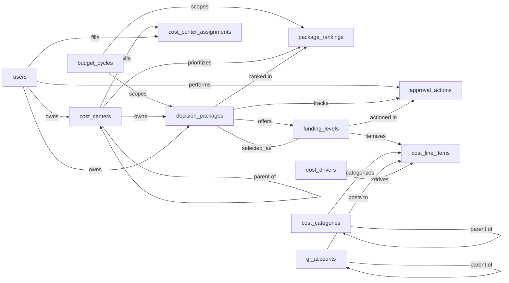

# Zero-Based Budgeting — Semantic Model

## 1. Overview

A budgeting platform implementing Peter Pyhrr's Zero-Based Budgeting (ZBB) methodology: every cost-center owner rebuilds their budget from zero each cycle by submitting **decision packages** (discrete activities or expenditures), each with multiple **funding levels** (minimum, current, enhanced) and a granular cost breakdown. Packages are ranked within their cost center, reviewed through an explicit approval workflow, and the chosen funding level becomes the funded amount. The model captures the planning artifacts (cycles, packages, levels, costs) and the governance artifacts (rankings, approval actions, role assignments) but does not model actuals, variance analysis, or downstream GL postings — those live in upstream/downstream finance systems.

## 2. Entity summary

| # | Table name | Singular label | Purpose |
|---|---|---|---|
| 1 | `budget_cycles` | Budget Cycle | The planning period (e.g. FY26) over which budgets are rebuilt from zero |
| 2 | `cost_centers` | Cost Center | Org unit responsible for justifying its own budget — the ZBB "decision unit" |
| 3 | `decision_packages` | Decision Package | A discrete activity, service, or expenditure being justified — the atomic unit of ZBB |
| 4 | `funding_levels` | Funding Level | A service-level option for a package (minimum / current / enhanced) with its own cost and benefit |
| 5 | `cost_line_items` | Cost Line Item | Granular cost row inside a funding level (e.g. salaries, software, travel) |
| 6 | `cost_categories` | Cost Category | Taxonomy of cost types (Salary, Contractor, Software, Travel, Capex, …) |
| 7 | `gl_accounts` | GL Account | Chart-of-accounts entry linking cost lines to the general ledger |
| 8 | `cost_drivers` | Cost Driver | Quantitative driver reusable across line items (FTE count, transaction volume, square footage) |
| 9 | `package_rankings` | Package Ranking | Priority ordering of packages within a cost center, scoped to a cycle |
| 10 | `approval_actions` | Approval Action | Audit-trail entry for a review decision on a package |
| 11 | `users` | User | A person who owns, reviews, or approves packages |
| 12 | `cost_center_assignments` | Cost Center Assignment | Junction: which user holds which role on which cost center |

### Entity-relationship diagram

## 3. Entities

### 3.1 `budget_cycles` — Budget Cycle

**Plural label:** Budget Cycles
**Label column:** `cycle_name`
**Audit log:** yes
**Description:** A planning period (typically annual) during which cost centers rebuild their budgets from zero. The cycle bounds all packages, rankings, and approvals.

**Fields**

| Field name | Format | Required | Label | Reference / Notes |
|---|---|---|---|---|
| `cycle_name` | `string` | yes | Cycle Name | (label) e.g. "FY26 ZBB Cycle"; default: `""` |
| `fiscal_year` | `integer` | yes | Fiscal Year | e.g. 2026; default: `0` |
| `start_date` | `date` | yes | Start Date | |
| `end_date` | `date` | yes | End Date | |
| `cycle_status` | `enum` | yes | Status | values: `draft`, `planning`, `in_review`, `locked`, `archived`; default: `"draft"` |
| `description` | `text` | no | Description | |

**Relationships**

- A `budget_cycle` may scope many `decision_packages` (1:N, via `decision_packages.budget_cycle_id`).
- A `budget_cycle` may scope many `package_rankings` (1:N, via `package_rankings.budget_cycle_id`).

---

### 3.2 `cost_centers` — Cost Center

**Plural label:** Cost Centers
**Label column:** `cost_center_name`
**Audit log:** yes
**Description:** An organizational unit (department, function, team) accountable for justifying its own budget. In ZBB language this is the "decision unit". Hierarchical via `parent_cost_center_id`.

**Fields**

| Field name | Format | Required | Label | Reference / Notes |
|---|---|---|---|---|
| `cost_center_code` | `string` | yes | Code | unique, e.g. "CC-1001"; no safe default — see §6.1 |
| `cost_center_name` | `string` | yes | Name | (label); default: `""` |
| `parent_cost_center_id` | `reference` | no | Parent Cost Center | → `cost_centers` (N:1, self-ref hierarchy, clear on delete), relationship_label: `"parent of"` |
| `owner_user_id` | `reference` | no | Primary Owner | → `users` (N:1, clear on delete), relationship_label: `"owns"` |
| `gl_segment` | `string` | no | GL Segment | optional ERP linkage |
| `is_active` | `boolean` | yes | Active | default: `true` |

**Relationships**

- A `cost_center` may have a parent `cost_center` (N:1, self-referential).
- A `cost_center` may have a primary owner `user` (N:1).
- A `cost_center` owns many `decision_packages` (1:N, parent, restrict on delete — historical packages are preserved).
- A `cost_center` has many `cost_center_assignments` (1:N, parent, cascade on delete).
- A `cost_center` has many `package_rankings` (1:N, parent, cascade on delete).

---

### 3.3 `decision_packages` — Decision Package

**Plural label:** Decision Packages
**Label column:** `package_title`
**Audit log:** yes
**Description:** The atomic unit of ZBB — a discrete activity, service, or expenditure being justified from zero. Every package is owned by a cost center, scoped to a cycle, broken into 2+ funding levels, and moves through an approval workflow.

**Fields**

| Field name | Format | Required | Label | Reference / Notes |
|---|---|---|---|---|
| `package_code` | `string` | yes | Code | unique, e.g. "PKG-FY26-001"; no safe default — see §6.1 |
| `package_title` | `string` | yes | Title | (label); default: `""` |
| `cost_center_id` | `parent` | yes | Cost Center | ↳ `cost_centers` (N:1, restrict on delete), relationship_label: `"owns"` |
| `budget_cycle_id` | `reference` | yes | Budget Cycle | → `budget_cycles` (N:1, restrict on delete), relationship_label: `"scopes"` |
| `package_type` | `enum` | yes | Package Type | values: `continuing`, `new`, `discretionary`, `mandatory`; default: `"continuing"` |
| `priority_tier` | `enum` | no | Priority Tier | values: `must_have`, `should_have`, `nice_to_have` |
| `package_status` | `enum` | yes | Status | values: `draft`, `submitted`, `in_review`, `approved`, `rejected`, `cut`, `deferred`; default: `"draft"` |
| `business_justification` | `html` | yes | Business Justification | the "why" narrative — core ZBB artifact; default: `""` |
| `consequences_of_not_funding` | `html` | no | Consequences if Not Funded | what breaks if killed |
| `alternatives_considered` | `html` | no | Alternatives Considered | |
| `selected_funding_level_id` | `reference` | no | Selected Funding Level | → `funding_levels` (N:1, clear on delete) — set after approval, relationship_label: `"selected_as"` |
| `owner_user_id` | `reference` | yes | Package Owner | → `users` (N:1, restrict on delete), relationship_label: `"owns"` |
| `submitted_at` | `date-time` | no | Submitted At | |
| `approved_at` | `date-time` | no | Approved At | |

**Relationships**

- A `decision_package` belongs to one `cost_center` (N:1, parent, restrict on delete).
- A `decision_package` is scoped to one `budget_cycle` (N:1, required).
- A `decision_package` is owned by one `user` (N:1, required).
- A `decision_package` has many `funding_levels` (1:N, parent, cascade on delete).
- A `decision_package` may select one of its `funding_levels` as the funded option (N:1, via `selected_funding_level_id`, clear on delete). Circular reference with the parent edge above — `selected_funding_level_id.decision_package_id` must equal `this.id`.
- A `decision_package` has many `approval_actions` (1:N, parent, restrict on delete to preserve audit trail).
- A `decision_package` may appear in many `package_rankings` (1:N).

---

### 3.4 `funding_levels` — Funding Level

**Plural label:** Funding Levels
**Label column:** `funding_level_label`
**Audit log:** yes
**Description:** A service-level option for a decision package (typically minimum / current / enhanced). Each level has its own cost stack and benefit narrative; the package owner recommends one and an approver selects one.

**Fields**

| Field name | Format | Required | Label | Reference / Notes |
|---|---|---|---|---|
| `funding_level_label` | `string` | yes | Level Label | (label) e.g. "Minimum", "Current", "Enhanced +2 FTE"; default: `""` |
| `decision_package_id` | `parent` | yes | Decision Package | ↳ `decision_packages` (N:1, cascade on delete), relationship_label: `"offers"` |
| `level_tier` | `enum` | yes | Tier | values: `minimum`, `current`, `enhanced`, `custom`; default: `"minimum"` |
| `level_order` | `integer` | yes | Order | 1 = lowest, ascending; default: `1` |
| `is_recommended_level` | `boolean` | yes | Recommended by Owner | default: `false`; the owner picks one before submission |
| `headcount_fte` | `number` | no | Headcount (FTE) | total FTE at this level; precision: 2 |
| `currency_code` | `string` | yes | Currency | ISO 4217, e.g. "USD"; default: `"USD"` |
| `service_description` | `html` | yes | Service Description | what's delivered at this level; default: `""` |
| `benefit_narrative` | `html` | no | Incremental Benefit | benefit vs the next-lower level |
| `risk_narrative` | `html` | no | Risk if Chosen | |

**Relationships**

- A `funding_level` belongs to one `decision_package` (N:1, parent, cascade on delete).
- A `funding_level` has many `cost_line_items` (1:N, parent, cascade on delete).
- A `funding_level` may be referenced by many `approval_actions` (1:N, via `approval_actions.funding_level_id`, clear on delete).
- A `funding_level` may be the selected level on its parent `decision_package` (1:0..1, via `decision_packages.selected_funding_level_id`).

---

### 3.5 `cost_line_items` — Cost Line Item

**Plural label:** Cost Line Items
**Label column:** `line_item_label`
**Audit log:** yes
**Description:** A granular cost row inside a funding level — e.g. "Senior Engineer salaries (×2)", "Datadog enterprise license". Supports either driver-based input (quantity × unit_cost) or lump-sum entry; `total_cost_amount` is always the canonical roll-up figure.

**Fields**

| Field name | Format | Required | Label | Reference / Notes |
|---|---|---|---|---|
| `line_item_label` | `string` | yes | Description | (label); default: `""` |
| `funding_level_id` | `parent` | yes | Funding Level | ↳ `funding_levels` (N:1, cascade on delete), relationship_label: `"itemizes"` |
| `cost_category_id` | `reference` | yes | Cost Category | → `cost_categories` (N:1, restrict on delete), relationship_label: `"categorizes"` |
| `gl_account_id` | `reference` | no | GL Account | → `gl_accounts` (N:1, clear on delete), relationship_label: `"posts to"` |
| `cost_driver_id` | `reference` | no | Cost Driver | → `cost_drivers` (N:1, clear on delete), relationship_label: `"drives"` |
| `quantity` | `float` | no | Quantity | optional driver-based input, e.g. 2 (FTE) |
| `unit_cost_amount` | `number` | no | Unit Cost | optional, paired with `quantity`; precision: 2 |
| `total_cost_amount` | `number` | yes | Total Cost | canonical figure used in roll-ups; precision: 2; default: `0` |
| `currency_code` | `string` | yes | Currency | ISO 4217; default: `"USD"` |
| `cost_period` | `enum` | yes | Period | values: `one_time`, `recurring_annual`; default: `"one_time"` |
| `notes` | `text` | no | Notes | |

**Relationships**

- A `cost_line_item` belongs to one `funding_level` (N:1, parent, cascade on delete).
- A `cost_line_item` belongs to one `cost_category` (N:1, required, restrict on delete).
- A `cost_line_item` may map to one `gl_account` (N:1, optional).
- A `cost_line_item` may be driven by one `cost_driver` (N:1, optional).

---

### 3.6 `cost_categories` — Cost Category

**Plural label:** Cost Categories
**Label column:** `category_name`
**Audit log:** no
**Description:** Taxonomy of cost types used to classify line items (Salary, Contractor, Software, Travel, Capex, etc.). Hierarchical via `parent_category_id` so categories can roll up.

**Fields**

| Field name | Format | Required | Label | Reference / Notes |
|---|---|---|---|---|
| `category_code` | `string` | yes | Code | unique, e.g. "SALARY"; no safe default — see §6.1 |
| `category_name` | `string` | yes | Name | (label); default: `""` |
| `category_type` | `enum` | yes | Type | values: `opex`, `capex`, `mixed`; default: `"opex"` |
| `parent_category_id` | `reference` | no | Parent Category | → `cost_categories` (N:1, self-ref, clear on delete), relationship_label: `"parent of"` |

**Relationships**

- A `cost_category` may have a parent `cost_category` (N:1, self-referential).
- A `cost_category` may classify many `cost_line_items` (1:N).

---

### 3.7 `gl_accounts` — GL Account

**Plural label:** GL Accounts
**Label column:** `account_name`
**Audit log:** no
**Description:** Chart-of-accounts entry that links ZBB cost line items back to the general ledger. Hierarchical (parent/child accounts).

**Fields**

| Field name | Format | Required | Label | Reference / Notes |
|---|---|---|---|---|
| `account_code` | `string` | yes | Code | unique, e.g. "5100"; no safe default — see §6.1 |
| `account_name` | `string` | yes | Name | (label) e.g. "Salaries Expense"; default: `""` |
| `account_type` | `enum` | yes | Type | values: `asset`, `liability`, `equity`, `revenue`, `expense`, `contra`; default: `"expense"` |
| `parent_account_id` | `reference` | no | Parent Account | → `gl_accounts` (N:1, self-ref, clear on delete), relationship_label: `"parent of"` |

**Relationships**

- A `gl_account` may have a parent `gl_account` (N:1, self-referential).
- A `gl_account` may be mapped to by many `cost_line_items` (1:N).

---

### 3.8 `cost_drivers` — Cost Driver

**Plural label:** Cost Drivers
**Label column:** `driver_name`
**Audit log:** no
**Description:** A reusable quantitative driver of cost — e.g. headcount, transaction volume, square footage. Cost line items can reference a driver to make the cost-build transparent and easy to flex.

**Fields**

| Field name | Format | Required | Label | Reference / Notes |
|---|---|---|---|---|
| `driver_code` | `string` | yes | Code | unique, e.g. "FTE_COUNT"; no safe default — see §6.1 |
| `driver_name` | `string` | yes | Name | (label) e.g. "Full-Time Equivalents"; default: `""` |
| `unit_of_measure` | `string` | yes | Unit | e.g. "headcount", "transactions/month"; default: `""` |
| `current_value` | `float` | no | Current Value | most recent quantity |
| `description` | `text` | no | Description | |

**Relationships**

- A `cost_driver` may drive many `cost_line_items` (1:N).

---

### 3.9 `package_rankings` — Package Ranking

**Plural label:** Package Rankings
**Label column:** `ranking_label`
**Audit log:** yes
**Description:** A prioritization entry — within a cost center and cycle, this row says "package X is ranked at position Y". Used by the cost-center owner during the ZBB ranking ceremony and by finance during roll-up reviews.

**Fields**

| Field name | Format | Required | Label | Reference / Notes |
|---|---|---|---|---|
| `ranking_label` | `string` | yes | Ranking | (label) caller composes on insert, e.g. "FY26 / CC-1001 / #3 K8s Migration"; default: `""` |
| `cost_center_id` | `parent` | yes | Cost Center | ↳ `cost_centers` (N:1, cascade on delete) — the scope of this ranking, relationship_label: `"prioritizes"` |
| `budget_cycle_id` | `reference` | yes | Budget Cycle | → `budget_cycles` (N:1, restrict on delete), relationship_label: `"scopes"` |
| `decision_package_id` | `reference` | yes | Decision Package | → `decision_packages` (N:1, cascade on delete), relationship_label: `"ranked in"` |
| `rank_position` | `integer` | yes | Rank | 1 = highest priority |
| `rationale` | `text` | no | Rationale | |

> Composite uniqueness expected on `(cost_center_id, budget_cycle_id, rank_position)` and `(cost_center_id, budget_cycle_id, decision_package_id)`. Implementation enforces.

**Relationships**

- A `package_ranking` belongs to one `cost_center` (N:1, parent, cascade on delete).
- A `package_ranking` is scoped to one `budget_cycle` (N:1, required).
- A `package_ranking` ranks one `decision_package` (N:1, required).

---

### 3.10 `approval_actions` — Approval Action

**Plural label:** Approval Actions
**Label column:** `action_label`
**Audit log:** yes
**Description:** A single review event on a decision package — submission, approval, rejection, cut to a lower funding level, deferral. The full sequence of `approval_actions` for a package is the audit trail of how the package moved through governance.

**Fields**

| Field name | Format | Required | Label | Reference / Notes |
|---|---|---|---|---|
| `action_label` | `string` | yes | Action | (label) caller composes on insert, e.g. "Approve · Jane Doe · 2026-04-15"; default: `""` |
| `decision_package_id` | `parent` | yes | Decision Package | ↳ `decision_packages` (N:1, restrict on delete to preserve audit trail), relationship_label: `"tracks"` |
| `funding_level_id` | `reference` | no | Funding Level | → `funding_levels` (N:1, clear on delete) — level approved or cut to, relationship_label: `"actioned in"` |
| `actor_user_id` | `reference` | yes | Actor | → `users` (N:1, restrict on delete), relationship_label: `"performs"` |
| `action_type` | `enum` | yes | Action Type | values: `submit`, `approve`, `reject`, `cut`, `defer`, `request_changes`, `withdraw`; default: `"submit"` |
| `comment` | `text` | no | Comment | |
| `acted_at` | `date-time` | yes | Acted At | default: `CURRENT_TIMESTAMP` |

**Relationships**

- An `approval_action` belongs to one `decision_package` (N:1, parent, restrict on delete).
- An `approval_action` may reference one `funding_level` (N:1).
- An `approval_action` is performed by one `user` (N:1, required).

---

### 3.11 `users` — User

**Plural label:** Users
**Label column:** `display_name`
**Audit log:** no
**Description:** A person who owns, reviews, or approves decision packages. The `table_name: users` matches the Semantius built-in exactly so the deployer can deduplicate against the platform user table.

**Fields**

| Field name | Format | Required | Label | Reference / Notes |
|---|---|---|---|---|
| `user_email` | `email` | yes | Email | unique, no safe default — see §6.1 |
| `display_name` | `string` | yes | Display Name | (label) e.g. "Jane Doe"; default: `""` |
| `is_active` | `boolean` | yes | Active | default: `true` |
| `department` | `string` | no | Department | |
| `job_title` | `string` | no | Job Title | |

**Relationships**

- A `user` may own many `cost_centers` (1:N, via `cost_centers.owner_user_id`).
- A `user` may own many `decision_packages` (1:N, via `decision_packages.owner_user_id`).
- A `user` may perform many `approval_actions` (1:N, via `approval_actions.actor_user_id`).
- A `user` may have many `cost_center_assignments` (1:N).

---

### 3.12 `cost_center_assignments` — Cost Center Assignment

**Plural label:** Cost Center Assignments
**Label column:** `assignment_label`
**Audit log:** no
**Description:** Junction entity that captures which user holds which ZBB role on which cost center — owner, reviewer, approver, or controller. Drives package routing and review permissions during the cycle.

**Fields**

| Field name | Format | Required | Label | Reference / Notes |
|---|---|---|---|---|
| `assignment_label` | `string` | yes | Assignment | (label) caller composes on insert, e.g. "Jane Doe · Owner · CC-1001"; default: `""` |
| `cost_center_id` | `parent` | yes | Cost Center | ↳ `cost_centers` (N:1, cascade on delete), relationship_label: `"staffs"` |
| `user_id` | `reference` | yes | User | → `users` (N:1, cascade on delete), relationship_label: `"fills"` |
| `assignment_role` | `enum` | yes | Role | values: `owner`, `reviewer`, `approver`, `controller`; default: `"owner"` |
| `is_primary` | `boolean` | no | Primary | one primary per (cost_center, role) by convention |
| `valid_from` | `date` | no | Valid From | |
| `valid_to` | `date` | no | Valid To | |

**Relationships**

- A `cost_center_assignment` belongs to one `cost_center` (N:1, parent, cascade on delete).
- A `cost_center_assignment` references one `user` (N:1, cascade on delete).
- `cost_centers` ↔ `users` is many-to-many through this junction (with role).

## 4. Relationship summary

| From | Field | To | Cardinality | Kind | Delete behavior |
|---|---|---|---|---|---|
| `cost_centers` | `parent_cost_center_id` | `cost_centers` | N:1 | reference | clear |
| `cost_centers` | `owner_user_id` | `users` | N:1 | reference | clear |
| `decision_packages` | `cost_center_id` | `cost_centers` | N:1 | parent | restrict |
| `decision_packages` | `budget_cycle_id` | `budget_cycles` | N:1 | reference | restrict |
| `decision_packages` | `selected_funding_level_id` | `funding_levels` | N:1 | reference | clear |
| `decision_packages` | `owner_user_id` | `users` | N:1 | reference | restrict |
| `funding_levels` | `decision_package_id` | `decision_packages` | N:1 | parent | cascade |
| `cost_line_items` | `funding_level_id` | `funding_levels` | N:1 | parent | cascade |
| `cost_line_items` | `cost_category_id` | `cost_categories` | N:1 | reference | restrict |
| `cost_line_items` | `gl_account_id` | `gl_accounts` | N:1 | reference | clear |
| `cost_line_items` | `cost_driver_id` | `cost_drivers` | N:1 | reference | clear |
| `cost_categories` | `parent_category_id` | `cost_categories` | N:1 | reference | clear |
| `gl_accounts` | `parent_account_id` | `gl_accounts` | N:1 | reference | clear |
| `package_rankings` | `cost_center_id` | `cost_centers` | N:1 | parent | cascade |
| `package_rankings` | `budget_cycle_id` | `budget_cycles` | N:1 | reference | restrict |
| `package_rankings` | `decision_package_id` | `decision_packages` | N:1 | reference | cascade |
| `approval_actions` | `decision_package_id` | `decision_packages` | N:1 | parent | restrict |
| `approval_actions` | `funding_level_id` | `funding_levels` | N:1 | reference | clear |
| `approval_actions` | `actor_user_id` | `users` | N:1 | reference | restrict |
| `cost_center_assignments` | `cost_center_id` | `cost_centers` | N:1 | parent | cascade |
| `cost_center_assignments` | `user_id` | `users` | N:1 | reference | cascade |

`cost_centers` ↔ `users` is many-to-many through `cost_center_assignments` (with `assignment_role`).

## 5. Enumerations

### 5.1 `budget_cycles.cycle_status`
- `draft`
- `planning`
- `in_review`
- `locked`
- `archived`

### 5.2 `decision_packages.package_type`
- `continuing`
- `new`
- `discretionary`
- `mandatory`

### 5.3 `decision_packages.priority_tier`
- `must_have`
- `should_have`
- `nice_to_have`

### 5.4 `decision_packages.package_status`
- `draft`
- `submitted`
- `in_review`
- `approved`
- `rejected`
- `cut`
- `deferred`

### 5.5 `funding_levels.level_tier`
- `minimum`
- `current`
- `enhanced`
- `custom`

### 5.6 `cost_line_items.cost_period`
- `one_time`
- `recurring_annual`

### 5.7 `cost_categories.category_type`
- `opex`
- `capex`
- `mixed`

### 5.8 `gl_accounts.account_type`
- `asset`
- `liability`
- `equity`
- `revenue`
- `expense`
- `contra`

### 5.9 `approval_actions.action_type`
- `submit`
- `approve`
- `reject`
- `cut`
- `defer`
- `request_changes`
- `withdraw`

### 5.10 `cost_center_assignments.assignment_role`
- `owner`
- `reviewer`
- `approver`
- `controller`

## 6. Open questions

### 6.1 🔴 Decisions needed (blockers)

- How should the deployer handle adding required-unique fields (`cost_centers.cost_center_code`, `decision_packages.package_code`, `cost_categories.category_code`, `gl_accounts.account_code`, `cost_drivers.driver_code`, `users.user_email`) to entities that already contain rows? A blanket default (`""`) would collide on the unique index for any second row. Options: (a) seed the columns nullable, populate per-row, then add the unique + NOT NULL constraint; (b) require a one-off backfill script keyed off `id`; (c) decide these fields are deploy-time-only (the entity must be empty before the field is added).

### 6.2 🟡 Future considerations (deferred scope)

- Should ZBB scopes that span multiple cost centers (cross-functional initiatives, shared services) be supported via a `cost_center_groups` entity, or is the current single-`cost_center_id` link on `decision_packages` sufficient?
- Should `currency_code` be promoted to its own `currencies` entity with FX rates, to support multi-currency budget consolidation? Currently a free-text ISO 4217 string on `funding_levels` and `cost_line_items`.
- Should justification supporting evidence (spreadsheets, vendor quotes, slide decks) be modeled via an `attachments` entity, or kept in an external document store?
- Should prior-period actuals be loaded into the model for variance reporting, or always pulled from upstream finance systems at query time? (ZBB de-emphasizes prior periods, but reviewers often want the comparison.)
- Should funding-level cost roll-ups be stored as denormalized snapshots on `funding_levels` (for performance) or always derived from `cost_line_items` at query time?
- Should rankings be expressible at multiple scopes (cost center → function → corporate), e.g. via a `ranking_scope` enum and an optional roll-up parent ID, or stay scoped to cost centers only with corporate roll-up handled in the reporting layer?
- Should `cost_center_assignments` enforce a single concurrent assignment per (user, cost_center, role) via `valid_from`/`valid_to`, or permit overlapping assignments? Currently the date fields are optional.
- Should `cost_drivers.current_value` be typed `number` (precision 2+) instead of `float`? Float is fine for transaction-volume or square-footage drivers, but if a driver ever holds a per-unit price or rate it will reintroduce IEEE-754 drift into roll-ups.

## 7. Implementation notes for the downstream agent

A short checklist for the agent who will materialize this model in Semantius (or equivalent):

1. Create one module named `zero_based_budgeting` (the module name **must** equal the `system_slug` from the front-matter — do not invent a different slug here) and two baseline permissions (`zero_based_budgeting:read`, `zero_based_budgeting:manage`) before any entity.
2. Create entities in the order given in §2 — entities referenced by others first. The circular reference between `decision_packages.selected_funding_level_id` and `funding_levels.decision_package_id` requires a two-pass approach: create both entities, then add `decision_packages.selected_funding_level_id` after `funding_levels` exists.
3. For each entity: set `label_column` to the snake_case field marked as label in §3, pass `module_id`, `view_permission`, `edit_permission`. Do **not** manually create `id`, `created_at`, `updated_at`, or the auto-label field.
4. For each field in §3: pass `table_name`, `field_name`, `format`, `title` (the Label column), and for `reference`/`parent` fields also `reference_table`, `reference_delete_mode` consistent with §4, and `relationship_label` set to the verb annotated in the §3 Notes column (which matches the §2 Mermaid edge label byte-for-byte). For required fields with a `default:` annotation in §3, pass that value as `default_value` so Postgres can backfill existing rows when the column is added. (The §3 `Required` column is analyst intent; the platform manages nullability internally and does not need a per-field flag.)
5. **Fix up each entity's auto-created label-column field title.** `create_entity` auto-creates a field whose `field_name` equals the entity's `label_column`, and its `title` defaults to `singular_label`. Every entity in this model has a label_column whose §3 Label differs from `singular_label` (e.g. entity `cost_centers` would yield title "Cost Center" but we want "Name"). After each `create_entity` call, follow up with `update_field` to set the correct title. The `update_field` `id` is the **composite string** `"{table_name}.{field_name}"` (e.g. `"cost_centers.cost_center_name"`, `"decision_packages.package_title"`, `"funding_levels.funding_level_label"`) — **pass it as a string, not an integer**, or the update will fail. The full list of fixups:
   - `budget_cycles.cycle_name` → "Cycle Name"
   - `cost_centers.cost_center_name` → "Name"
   - `decision_packages.package_title` → "Title"
   - `funding_levels.funding_level_label` → "Level Label"
   - `cost_line_items.line_item_label` → "Description"
   - `cost_categories.category_name` → "Name"
   - `gl_accounts.account_name` → "Name"
   - `cost_drivers.driver_name` → "Name"
   - `package_rankings.ranking_label` → "Ranking"
   - `approval_actions.action_label` → "Action"
   - `users.display_name` → "Display Name"
   - `cost_center_assignments.assignment_label` → "Assignment"
6. **Deduplicate against Semantius built-in tables.** This model is self-contained and declares `users`, which exists in Semantius as a built-in. For each declared entity, read Semantius first: if a built-in already covers it, **skip the create** and reuse the built-in as the `reference_table` target — do not attempt to recreate. Optionally add the model's required fields (`display_name`, `is_active`, `department`, `job_title`) to the built-in only if they are missing (additive, low-risk changes only).
7. **Junction-table label population.** Three entities have label fields the caller must populate on insert because they have no natural single-field label: `package_rankings.ranking_label`, `approval_actions.action_label`, `cost_center_assignments.assignment_label`. The implementing application or workflow should compose these from the related records (e.g. `"{cycle_name} / {cost_center_code} / #{rank_position} {package_title}"` for a ranking).
8. After creation, spot-check that `label_column` on each entity resolves to a real field, that all `reference_table` targets exist, and that the `decision_packages` ↔ `funding_levels` circular reference resolves cleanly in both directions.

## 8. Related domains

The model is self-contained — every entity it needs is declared in §3 — but the following sibling modules are likely to coexist in the same Semantius catalog. The deployer should consult each sibling's own model at deploy time and reconcile per the contract below.

### 8.1 `workforce_planning` (peer)

- **Exposes:** `cost_centers` (canonical org-unit definitions, hierarchy via `parent_cost_center_id`).
- **Expects on sibling:** `workforce_planning` headcount plans and positions reference back to `cost_centers` via the same `cost_center_id` shape used here. ZBB `funding_levels.headcount_fte` corresponds in spirit to workforce-plan FTE on a position; if both modules deploy together, the implementing workflow should reconcile package-funded FTE with planned positions on the same cost center and cycle.
- **Defers to sibling:** none in either direction — `workforce_planning` is a peer, not a master-data owner of `cost_centers` or `users`.

### 8.2 `finance` (upstream master data)

- **Exposes:** `cost_line_items.gl_account_id` (the FK that lets ZBB roll spending up to ledger lines).
- **Expects on sibling:** a `finance.gl_accounts` table whose `id` and `account_code` align with the local `gl_accounts` declared here.
- **Defers to sibling:** `gl_accounts` if a `finance` module is deployed. The deployer should skip `gl_accounts` creation, rewire `cost_line_items.gl_account_id → finance.gl_accounts`, and treat the local `gl_accounts` declaration as a self-containment fallback only. `cost_line_items.gl_account_id` is optional (clear on delete), so missing GL alignment never blocks ZBB.

### 8.3 `identity_and_access` (upstream master data, also Semantius built-in)

- **Exposes:** every user-FK (`cost_centers.owner_user_id`, `decision_packages.owner_user_id`, `approval_actions.actor_user_id`, `cost_center_assignments.user_id`).
- **Expects on sibling:** a `users` table the deployer can FK against. The Semantius built-in `users` is the canonical target.
- **Defers to sibling:** `users` always defers to the Semantius built-in (per §7 step 6). If a richer `identity_and_access` module is deployed alongside, defer further: skip the local `users` create entirely, add only any missing fields (`display_name`, `is_active`, `department`, `job_title`) to whichever owner exists.
