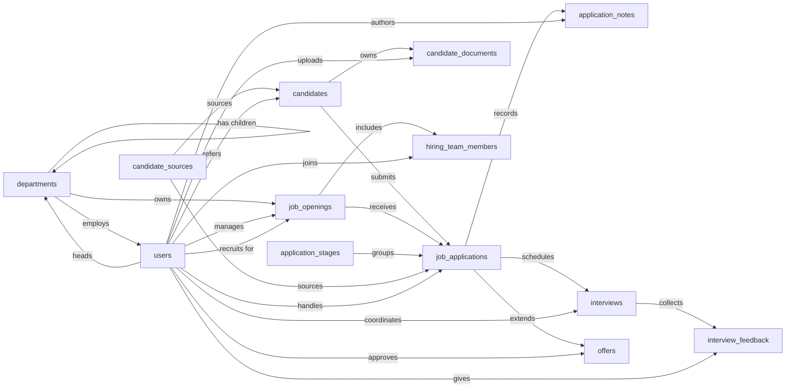

import Command from '~/components/common/Command.astro';

# Applicant Tracking Skill

An applicant tracking system used by an in-house recruiting team to manage open job requisitions, the candidates considered for them, and the full hiring funnel from application through interviews to offer. Primary users are recruiters, hiring managers, and interviewers; the system records who applied for what, where they are in the pipeline, what feedback interviewers gave, and what offers were extended and accepted.

The Applicant Tracking model tracks every step of a hire, from a candidate's first application through interview rounds to a recorded acceptance. The Applicant Tracking Skill teaches an agent how to use that model to track candidates through the funnel reliably and the same way every time, so the right pieces always get filled in in the right order. Without it, an offer can go out with no recorded approver; a rejection can land with no reason on file and quietly blank the funnel report; a candidate can accept while the requisition stays open and the same person sits on the hiring team twice over.

## Sample prompts

- "open a requisition"
- "apply this candidate to the job"
- "move the application to on-site"
- "schedule a phone screen"
- "submit interview feedback"
- "extend an offer"
- "the candidate accepted, mark them hired"
- "reject this application"
- "add Sarah as the hiring manager"
- "what does the pipeline look like by stage"
- "who's on the hiring team for the senior backend role"

<Command command="npx skills add https://github.com/semantius/semantius/tree/main/skills/applicant-tracking" />

## Semantic model

