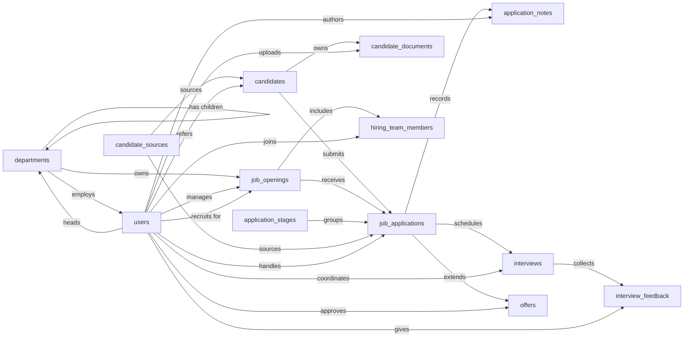

# Applicant Tracking Skill

An applicant tracking system used by an in-house recruiting team to manage open job requisitions, the candidates considered for them, and the full hiring funnel from application through interviews to offer. Primary users are recruiters, hiring managers, and interviewers; the system records who applied for what, where they are in the pipeline, what feedback interviewers gave, and what offers were extended and accepted.

The Applicant Tracking model tracks every step of a hire, from first application through stage progression and interviewers' scorecards to a recorded offer acceptance. The Applicant Tracking Skill teaches an agent how to use that model to take a candidate from inbound to hired reliably and the same way every time, so the rejection reasons, hired dates, approver details, and the matching timestamps that turn each step into a clean audit trail always travel together. Without it, an offer can go out with no recorded approver; a rejection can land with no reason on file and quietly blank the funnel report; a candidate can accept while the requisition stays open and get pulled into another pipeline by mistake.

## Sample prompts

- "apply Jane Doe to the Senior Engineer opening"
- "move Bob to Phone Screen"
- "reject the SDR candidate, salary mismatch"
- "schedule a panel interview for Alex on Tuesday"
- "submit my feedback for Jane's onsite, strong yes"
- "draft an offer for Jane, $180k base, $20k bonus"
- "send the offer to Bob"
- "Jane accepted the offer"
- "open the SDR requisition"
- "mark ENG-2026-014 filled"
- "add Sam as interviewer on the Senior Engineer req"
- "show me the pipeline by stage"
- "what's the time-to-hire for Engineering last quarter"
- "open requisitions by department"
- "who changed Jane's offer status"
- "source ROI for the Sales hiring funnel"

## What it covers

- Submit applications and move them through the stage pipeline
- Reject applications with paired reasons and timestamps
- Schedule interviews and capture interviewer scorecards
- Draft, approve, send, and resolve offers, including candidate response and the resulting hire
- Open, put on hold, fill, close, or cancel a requisition
- Manage the hiring team and read the audit trail behind a hiring decision
- Common reports: pipeline by stage, source ROI, time-to-hire, open requisitions by department, interviewer load

## Semantic model

