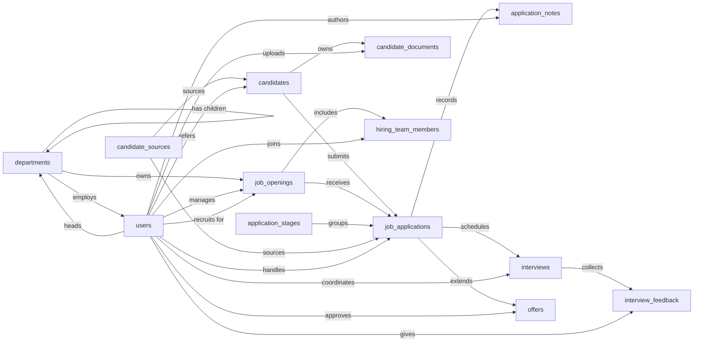

# Applicant Tracking Skill

An applicant tracking system used by an in-house recruiting team to manage open job requisitions, the candidates considered for them, and the full hiring funnel from application through interviews to offer. Primary users are recruiters, hiring managers, and interviewers; the system records who applied for what, where they are in the pipeline, what feedback interviewers gave, and what offers were extended and accepted.

The Applicant Tracking model tracks every step of a hire, from the moment a candidate enters the funnel to the recorded acceptance that closes a requisition. The Applicant Tracking Skill teaches an agent how to use that model to track candidates through the funnel reliably and the same way every time, so paired updates land together and the audit trail behind each decision stays intact. Without it, an offer can go out with no recorded approver; a rejection can land with no reason on file and quietly blank the funnel report; a candidate can accept while the requisition stays open and get pulled into another pipeline by mistake.

## Sample prompts

- "Submit a job application for Jane Doe against ENG-2026-014"
- "Move Alex's application to the on-site stage"
- "Reject Priya for the Senior Engineer role, reason: not qualified"
- "Schedule a phone screen with Jane for Tuesday at 10am"
- "Book the technical interview, Alex Kim is interviewing"
- "Submit my scorecard for the on-site, strong yes, advance"
- "Save my interview feedback as a draft"
- "Extend an offer to Jane, base 180k, start February"
- "Approve the offer, the recruiting director signed off"
- "Jane accepted the offer, close out the funnel"
- "Open requisition ENG-2026-014"
- "Add Sarah as a coordinator on the Senior Engineer req"
- "Edit my note on Jane's application"
- "Who approved the offer for the platform role"
- "Show me the pipeline by stage right now"
- "What's our time-to-hire by department this quarter"
- "Which interviewers are carrying the most load this month"

## What it covers

- Submit applications and move them through pipeline stages
- Reject applications with a recorded reason and rejection timestamp
- Schedule interviews and capture scorecard feedback per interviewer
- Extend, approve, and send offers, then record acceptance and the resulting hire
- Transition requisitions through open, on hold, filled, closed, and cancelled
- Assign or remove hiring team members and edit application notes by author
- Common reports: pipeline by stage, source ROI by hire, time-to-hire by department, open requisitions by department, interviewer load

## Semantic model

