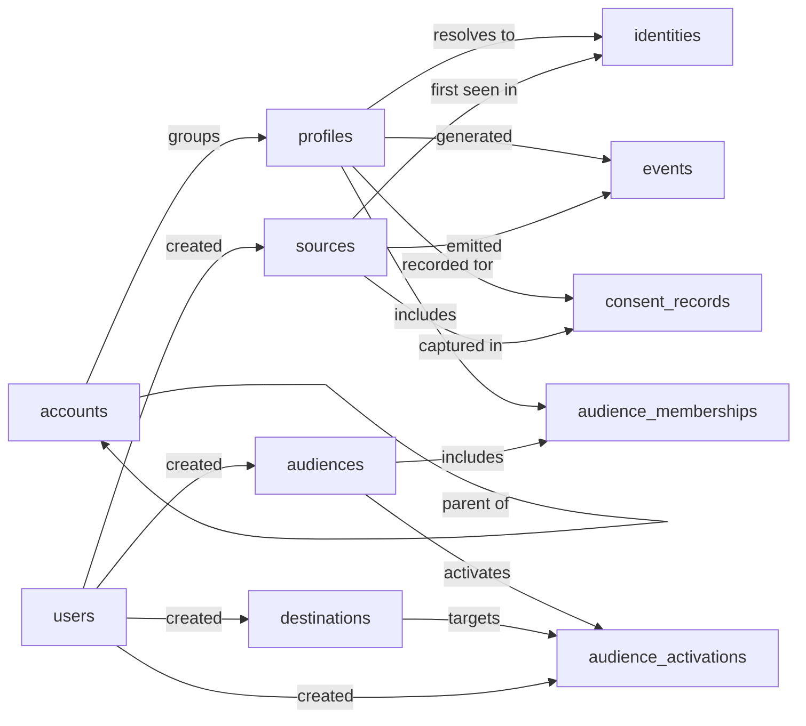

# Customer Data Platform Skill

A Customer Data Platform (CDP) ingests behavioral and attribute data about customers from many inbound sources, resolves multiple identifiers to a single unified `profile`, organises profiles into rule-based `audiences`, and activates those audiences out to downstream `destinations` (ads, email, warehouse). Operators (`users`) configure sources, audiences, computed traits, and activations; profile consent state per purpose is tracked separately for compliance. Volumes are skewed: events and identities are high-throughput; profiles, audiences, and configuration entities are low-cardinality and edited deliberately.

The Customer Data Platform model unifies the customer record by mapping every observed identifier back to one profile, and lays out the audiences, activations, and consent history that sit on top of those profiles. The Customer Data Platform Skill teaches an agent how to use that model to unify customer data reliably and the same way every time, with the right composite label whenever a profile lands in an audience or an audience targets a destination, the right append-only handling of consent, and the right discipline when a profile is forgotten or two profiles are merged. Without it, two anonymous events from the same person can stay split across separate profiles forever; a consent withdrawal can quietly overwrite the prior grant and erase the history a compliance audit needs; a forgotten profile can leave its audience memberships and identities behind in segments that still get activated.

## Sample prompts

- "find the profile for alice@example.com"
- "add a device id to this profile"
- "add this customer to the high-value audience"
- "remove them from the audience"
- "activate the audience to Meta Ads"
- "create a new audience of repeat buyers"
- "record marketing consent for this profile"
- "forget this customer"
- "GDPR delete"
- "merge these two profiles"
- "what's our profile lifecycle breakdown"

## Semantic model

