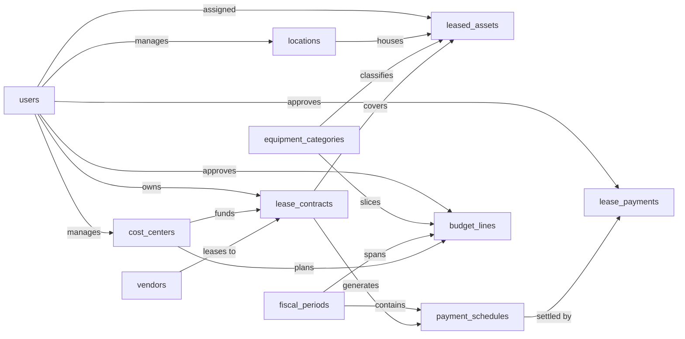

import Command from '~/components/common/Command.astro';

# Equipment Lease Management Skill

A lessee-side system for tracking equipment lease contracts with vendors, the individual assets they cover, the planned and actual payment streams they generate, and the budgets against which those payments are measured. Users are finance analysts, contract owners, and cost-center managers who need to answer questions like "what is our total lease obligation next quarter?", "which contracts are over budget?", and "which assets are still under lease and where are they deployed?". The data model is platform-agnostic; budgeting is modeled at the cost-center / fiscal-period grain so variance analysis against actual payments is straightforward downstream.

The Equipment Lease Management model manages every lease contract with a vendor, the assets it covers, the planned schedule of payments, the cash that actually clears, and the budgets those payments are measured against. The Equipment Lease Management Skill teaches an agent how to use that model to manage a lease from signing through to retirement reliably and the same way every time, with each step on the contract flowing through into the assets, the schedules, and the payments correctly. Without it, a terminated contract can leave next quarter's schedules still marked pending and the variance report keeps planning cash that will never move; a posted payment can clear in the bank while its schedule stays pending and the contract reads as unpaid; a retired asset can sit on the deployed-by-location report because no decommission date was set; a duplicate budget line can land for the same cost center and period and quietly double-count the leasing budget.

## Sample prompts

- "add a new lease contract"
- "register the new copier lease"
- "add the laptops covered by this contract"
- "generate the payment schedule for this lease"
- "record the March payment for contract LC-2026-0042"
- "terminate this lease early"
- "renew the vehicle lease"
- "retire this asset"
- "decommission the printer"
- "add a budget line for IT hardware in Q1"
- "approve the FY2026 leasing budget"
- "what is our total lease obligation next quarter"
- "which contracts are over budget"
- "show upcoming contract renewals"
- "show overdue payments"

<Command command="npx skills add https://github.com/semantius/semantius/tree/main/skills/equipment-lease-management" />

## Semantic model

