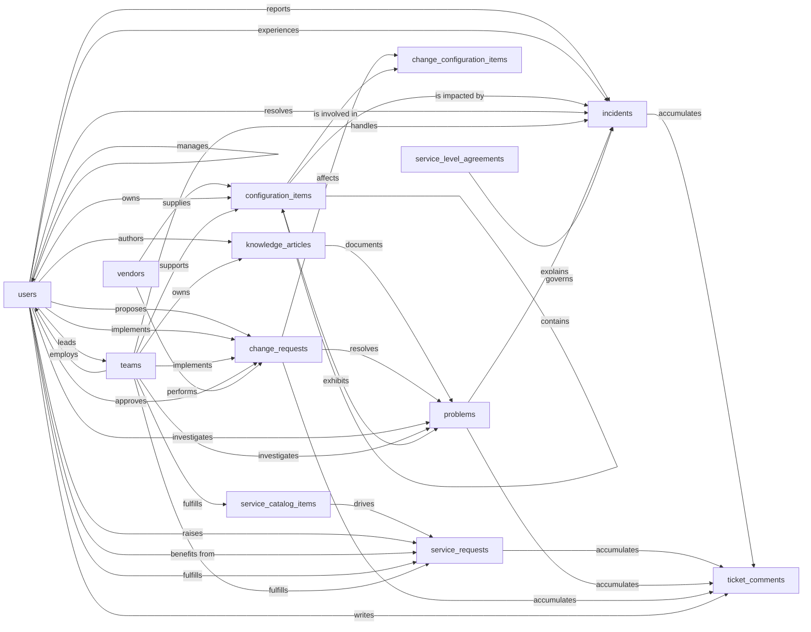

# IT Service Management Skill

An IT Service Management (ITSM) system that captures the four core ITIL processes (incident, problem, change, service request) on top of a configuration management database (CMDB) and a service catalog. Used by IT support agents, engineers, change managers, and end users across an organization. The system answers questions like "what is broken right now", "what caused the recurring printer outages last quarter", "what changes are scheduled for tonight's maintenance window", and "how do I request a new laptop".

The IT Service Management model manages every step of an IT support workflow, from a ticket the moment it is reported to the recorded close after the change that fixes it for good. The IT Service Management Skill teaches an agent how to use that model to manage tickets through their lifecycles reliably and the same way every time, with SLA clocks, approver names, and the link from a problem's root cause to the change that fixes it kept in lockstep with the status flips that name them. Without it, an incident can be marked resolved with no resolution category on file and quietly fall out of the breach report; a change can be marked implemented while no one ever recorded who approved it; a knowledge article can flip to published with no recorded publish date and never appear in the latest-articles list.

## Sample prompts

- "report an incident"
- "assign INC-00042 to the network team"
- "resolve this incident with a workaround"
- "raise a service request for a new laptop"
- "approve this service request"
- "open a change request for tonight's maintenance window"
- "approve the emergency change"
- "schedule the change for Saturday"
- "mark the change implemented"
- "roll these incidents up to a problem"
- "investigate this problem"
- "publish the runbook"
- "post a public comment on the ticket"
- "what's our SLA breach rate this month"
- "show me changes scheduled this week"

## Semantic model

