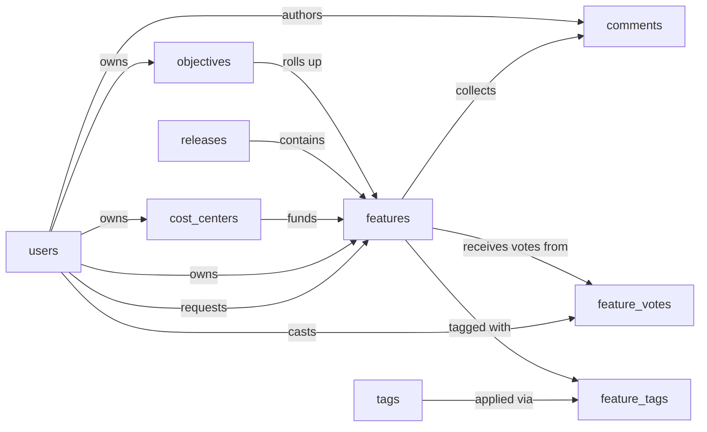

# Product Roadmap Skill

A single-product roadmap planning system. Product managers capture incoming feature requests, change requests, bugs, and tech-debt items as `features`, score them with RICE (reach × impact × confidence ÷ effort), align them to strategic `objectives`, and schedule the committed work into `releases`. Features carry estimated and actual cost and are assigned to a `cost_center` so spend can be rolled up. Stakeholders contribute through `feature_votes` and `comments`; `tags` provide cross-cutting categorization.

The Product Roadmap model plans how every idea moves from intake through RICE scoring and release commitment to a shipped feature, with the rationale weighing each one and the release it lands in. The Product Roadmap Skill teaches an agent how to use that model to plan the roadmap reliably and the same way every time, so RICE scores stay current and a release ships with every feature in it actually marked shipped. Without it, a release can be marked shipped while features in it still sit at "in progress"; a feature can get rescored on reach or effort but its RICE score stays stale and the backlog ranking lies; the same person can vote twice on the same feature and silently inflate the signal.

## Sample prompts

- "capture a new feature request"
- "score this feature with RICE"
- "rescore the dark mode feature"
- "triage the under-review backlog"
- "schedule feature X into v2.5"
- "ship the March 2026 release"
- "vote for the dark mode feature"
- "tag this as mobile"
- "comment on this feature"
- "what's the top-voted feature this quarter"
- "what's our planned spend by cost center"
- "show pipeline by status"

## Semantic model

