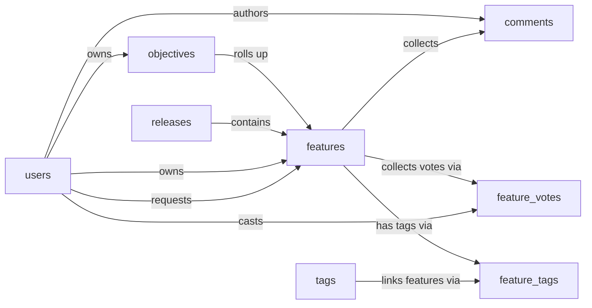

# Product Roadmap Skill

A single-product roadmap planning system. Product managers capture incoming feature requests, change requests, bugs, and tech-debt items as features, score them with RICE (reach × impact × confidence ÷ effort), align them to strategic objectives, and schedule the committed work into releases. Stakeholders contribute through votes and comments; tags provide cross-cutting categorization.

The Product Roadmap model plans how every idea moves from intake through scoring and release commitment to a shipped feature, with the rationale weighing each one and the release it lands in. The Product Roadmap Skill teaches an agent how to use that model to plan a feature from intake through to a shipped release reliably, without the handoffs between PM, design, and engineering quietly going missing. Without it, an idea can get scheduled with no recorded owner; a release can ship with features still marked "in progress"; a stakeholder vote can be double-counted because the second cast did not find and replace the first.

## Sample prompts

- "Schedule the dark-mode feature into the v2.5 release"
- "Plan the SSO feature for March 2026, target start next Monday"
- "Start work on the API rate-limiting feature today"
- "Mark the onboarding revamp in progress"
- "Ship the export-to-CSV feature in v2.4 with completion date today"
- "The mobile push notifications feature is done, ship it"
- "Cast a vote for the dark-mode feature for jane@acme.com with weight 3"
- "Sarah voted for the SSO feature, record it"
- "Tag the rate-limiting feature with platform"
- "Add the tag enterprise to the SSO feature"
- "Comment on the dark-mode feature for jane@acme.com saying we should align this with the brand refresh"
- "Post a note on the SSO feature for the security team"
- "Show the roadmap pipeline by status"
- "Which features have the highest RICE score right now"
- "How many features shipped in v2.4"
- "Top-voted features by total weight"
- "Pipeline grouped by objective"

## What it covers

- Schedule a feature into a release with target dates
- Start work on a feature and record the actual start date
- Ship a feature with the release it shipped in and the completion date
- Cast or update weighted votes on features without duplicating junction rows
- Tag features, asking before creating tags that do not exist yet
- Post comments with a deterministic short-form label for list display
- Common reports: pipeline by status, top RICE features, release throughput, top-voted features, pipeline by objective

## Semantic model

