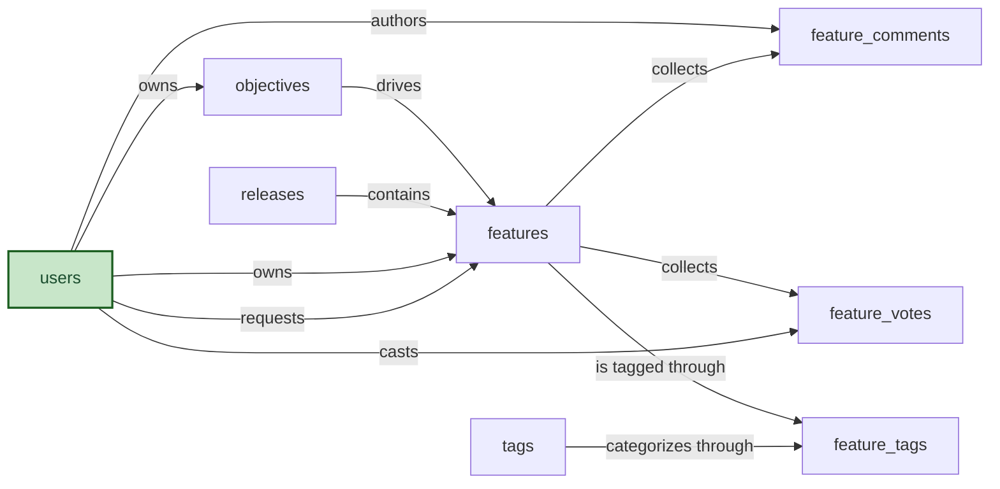

# Product Roadmap Skill

A single-product roadmap planning system. Product managers capture incoming feature requests, change requests, bugs, and tech-debt items as features, score them with RICE (reach × impact × confidence ÷ effort), align them to strategic objectives, and schedule the committed work into releases. Stakeholders contribute through weighted votes and threaded comments; tags provide cross-cutting categorization.

The Product Roadmap model plans how every idea moves from intake through RICE scoring and release commitment to a shipped feature, alongside the votes, comments, and tags that steer those decisions. The Product Roadmap Skill teaches an agent how to use that model to plan a feature from intake through to a shipped release reliably and the same way every time, with the paired status, release, and date entries kept in lockstep across the workflow. Without it, a feature can be marked shipped while the release it shipped in stays empty; a vote can be cast twice for the same person because nothing checks for an existing one; a tag can be retired while features still carry it, and the delete refuses with a confusing message.

## Sample prompts

- "Move the SSO feature to in progress"
- "Start work on multi-tenant onboarding"
- "Ship the dark-mode feature in release 3.4"
- "Mark the auth refactor as shipped in 2026 Q2"
- "Schedule the dashboard redesign into release 2026 Q2"
- "Move the bug fix out of release 3.4"
- "Cast a vote for the dark-mode feature on behalf of alice@acme.com"
- "Vote for the SAML feature with weight 3"
- "Tag the inventory feature as 'mobile'"
- "Release the 3.4 release"
- "Delete the deprecated 'legacy' tag"
- "Show the top 10 features by RICE score in the backlog"
- "How many features shipped this quarter"
- "Which features have the most votes"
- "Show the release scorecard for 2026 Q1"
- "How are features distributed across tags"

## What it covers

- Start features and ship them into a release with paired actual dates
- Schedule and detach features against committed releases
- Cast and update weighted stakeholder votes with deduplication
- Tag features with reusable categories
- Release a release through its workflow gate
- Delete tags with feature-link cleanup
- Common reports: RICE-ranked backlog, release scorecard, top voted features, throughput by month, tag distribution

## Semantic model

