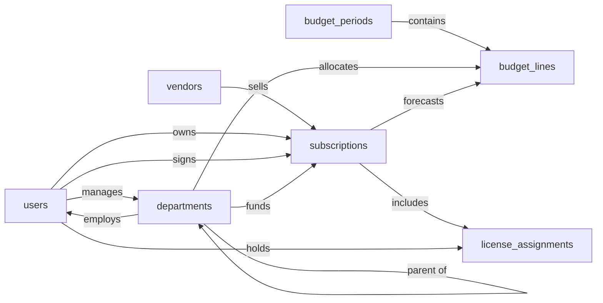

# SaaS Expense Tracker & Budget Skill

An internal SaaS spend management system that records the company's SaaS subscriptions (the app, the vendor, the commercial terms, and the contract details on a single record), the departments that own the spend, the budgets planned against them, and which internal users consume seats. Finance and IT use it to track planned vs. expected spend, allocate costs to departments, detect unused licenses, and manage upcoming renewals. All monetary amounts are stored in a single implicit base currency; multi-currency support is deferred (see §6.2).

The SaaS Expense Tracker & Budget model tracks every SaaS subscription, the seats consumed against it, and the planned spend each fiscal period. The SaaS Expense Tracker & Budget Skill teaches an agent how to use that model to track SaaS spend reliably and the same way every time, with seats reclaimed when people leave, the locked-period rules respected, and renewals never falling off the calendar. Without it, a cancelled subscription can leave seats marked active and chargeback keeps billing departments for software nobody uses; a user can be offboarded while their licenses sit consuming spend; a budget line can land in a closed period and quietly skew the variance report.

## Sample prompts

- "add a new SaaS subscription"
- "cancel the Slack subscription"
- "assign Bob a license on Figma"
- "revoke Alice's GitHub seat"
- "offboard Sarah and revoke her licenses"
- "create a budget line for engineering dev tools"
- "renew the Notion subscription"
- "what's our SaaS spend by department this quarter"
- "which licenses are unused"
- "show upcoming renewals"

## Semantic model

