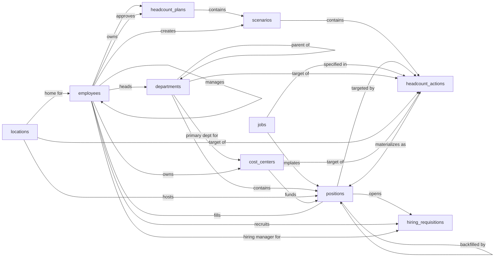

# Workforce Planning Skill

A scenario-based headcount planning system. The system tracks the current org (departments, locations, cost centers, jobs, employees, positions) as the source-of-truth baseline, and lets planners draft alternative future-state plans through scenarios containing staged headcount actions (add, eliminate, transfer). Approved scenarios materialize into real position records, which can then be handed off to recruiting via lightweight hiring requisitions.

The Workforce Planning model plans how headcount grows across scenarios and the seats an approved scenario will create. The Workforce Planning Skill teaches an agent how to use that model to plan headcount across scenarios reliably and walk an approved scenario into real positions the same way every time, with the paired sign-off and the recruiting handoff that should accompany each step. Without it, a plan can be marked approved with no record of who signed off; an approved scenario can sit dormant while the real seats never get created; a departing employee's position can stay locked under their name and quietly block the next hire.

## Sample prompts

- "draft a headcount plan for FY26"
- "add a Senior Engineer to the aggressive growth scenario"
- "set the base case as active for the FY26 plan"
- "approve the FY26 headcount plan"
- "commit the approved scenario into real positions"
- "open a requisition for the new SWE seat"
- "fill position POS-00123 with Jane Doe"
- "Bob is leaving, terminate him and open his seat"
- "backfill Alice's seat"
- "what's our open headcount by department"
- "show planned vs filled FTE by cost center"
- "who approved the FY26 plan"

## Semantic model

