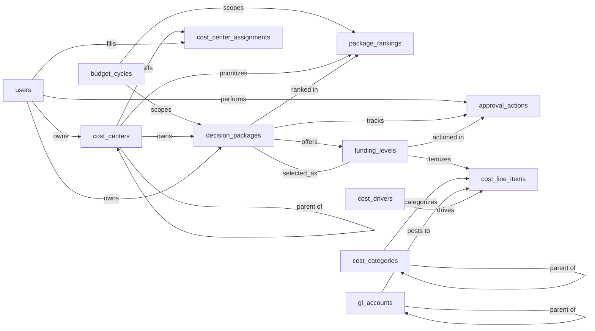

import Command from '~/components/common/Command.astro';

# Zero-Based Budgeting Skill

A budgeting platform implementing Peter Pyhrr's Zero-Based Budgeting (ZBB) methodology: every cost-center owner rebuilds their budget from zero each cycle by submitting **decision packages** (discrete activities or expenditures), each with multiple **funding levels** (minimum, current, enhanced) and a granular cost breakdown. Packages are ranked within their cost center, reviewed through an explicit approval workflow, and the chosen funding level becomes the funded amount. The model captures the planning artifacts (cycles, packages, levels, costs) and the governance artifacts (rankings, approval actions, role assignments) but does not model actuals, variance analysis, or downstream GL postings; those live in upstream/downstream finance systems.

The Zero-Based Budgeting model budgets a fresh cycle from zero, decision package by decision package, with each justified at multiple funding levels and a granular line-item cost stack. The Zero-Based Budgeting Skill teaches an agent how to use that model to budget a cycle reliably and the same way every time, walking a package from draft through ranking, submission, and approval at a chosen funding level without the audit trail going missing. Without it, a package can land approved with no recorded funding level on file; a cycle can lock while submissions are still in review and quietly lose them; a ranking can attach to a cost center the package never belonged to.

## Sample prompts

- "open the FY26 budget cycle"
- "lock the cycle"
- "draft a decision package"
- "add a minimum / current / enhanced funding level"
- "add cost line items to the enhanced level"
- "submit this package for review"
- "approve the package at the current level"
- "cut this package to minimum"
- "reject this package"
- "defer the package to next cycle"
- "rank the packages for cost center CC-1001"
- "reorder the rankings"
- "assign Jane as approver on CC-1001"
- "what's the total committed budget for FY26"
- "show package count by status by cost center"

<Command command="npx skills add https://github.com/semantius/semantius/tree/main/skills/zero-based-budgeting" />

## Semantic model

